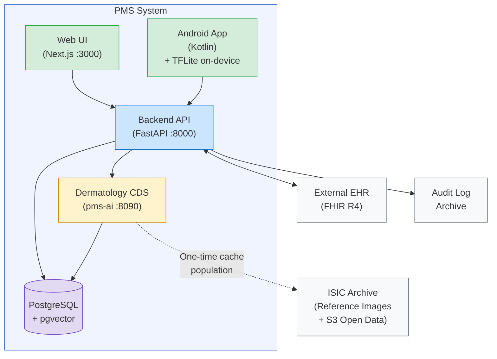

# PMS Project Overview — Bird's Eye View

**Date:** 2026-02-21
**Version:** 1.2
**Organization:** utexas-demo (GitHub)

---

## 1. Project Summary

The Patient Management System (PMS) is a HIPAA-compliant software suite for managing patient records, clinical workflows, medications, and reporting across a multi-facility healthcare organization. It consists of five repositories under the `utexas-demo` GitHub organization.

---

## 2. Repository Overview

| Repository | Purpose | Tech Stack | Branch | Status |
|---|---|---|---|---|
| **demo** | Central documentation & specs | Markdown, shared as git submodule | `main` | Clean |
| **pms-backend** | REST API server | Python 3.12, FastAPI, PostgreSQL, SQLAlchemy 2.0, Pydantic v2 | `main` | Clean |
| **pms-frontend** | Web application | Next.js 15, React, TypeScript, Tailwind CSS 3 | `main` | Clean |
| **pms-android** | Native Android app | Kotlin 2.1, Jetpack Compose, Material 3, Hilt, Room | `main` | Clean |
| **pms-ai** | AI platform (Dermatology CDS, AI Gateway) | Python 3.12, FastAPI, ONNX Runtime, pgvector | `main` | Clean |

---

## 3. Architecture



### Subsystems

| Code | Subsystem | Scope | Primary Actor |
|---|---|---|---|
| SUB-PR | Patient Records | Demographics, medical history, encrypted PHI, AI vision, dermatology CDS (skin lesion classification, similarity search, risk scoring, longitudinal tracking), DermaCheck pipeline orchestration (parallel fan-out, graceful degradation) | All roles |
| SUB-CW | Clinical Workflow | Scheduling, encounters, status tracking, clinical notes, DermaCheck encounter workflow (capture → classify → review) | Physicians, Nurses |
| SUB-MM | Medication Management | Prescriptions, drug interactions, formulary, dispensing | Physicians, Pharmacists |
| SUB-RA | Reporting & Analytics | Dashboards, compliance reports, audit log queries, dermatology classification analytics | Administrators, Compliance |
| SUB-PM | Prompt Management | Centralized prompt CRUD, versioning, audit trail, LLM-powered version comparison | Administrators |

---

## 4. Repository Details

### 4.1 demo (Documentation Hub)

Central knowledge base shared as a git submodule across all other repos.

**Contents:**
- Development Pipeline Tutorial (.md / .docx)
- PMS Developer Working Instructions (.md / .docx)
- `docs/` directory with:
  - 22 Architecture Decision Records (ADRs)
  - 7 configuration & setup guides
  - 2 feature implementation docs
  - System spec, testing strategy, requirements governance
  - 5 subsystem requirement documents + traceability matrix
  - Release compatibility matrix & subsystem versions

**CI:** `validate-docs.yml` — documentation validation

---

### 4.2 pms-backend

**Structure:**
```
src/pms/
├── main.py, config.py, database.py, feature_flags.py
├── middleware/      → audit.py, auth.py
├── models/          → patient, encounter, medication, audit_log
├── routers/         → auth, patients, encounters, medications, reports, vision
├── schemas/         → auth, patient, encounter, medication, vision
├── services/        → audit, auth, encryption, interaction_checker, patient, vision
```

**Key Implementation Status:**
- Patient CRUD: Fully implemented with 16 integration tests
- JWT authentication: Enforced on all patient endpoints
- RBAC: Per-endpoint role-based access control on patient routes
- Audit logging: All patient operations logged
- PHI encryption: SSN encrypted at rest via Fernet (AES-256-GCM migration planned)
- Encounters, Medications, Reports: Scaffold/stub endpoints

**Tests:** 23 test files, 157 tests passing
**CI:** ci.yml, snyk-security.yml, sonarqube.yml — all passing

---

### 4.3 pms-frontend

**Structure:**
```
src/
├── app/             → 7 pages (dashboard, login, patients, encounters, medications, reports + detail pages)
├── components/
│   ├── layout/      → header.tsx, sidebar.tsx
│   └── ui/          → badge, button, card, input
├── config/          → featureFlags.ts
├── lib/             → api.ts, auth.ts, utils.ts
└── types/           → auth, patient, encounter, medication
```

**Key Implementation Status:**
- Auth guard and token management: Scaffolded
- All page layouts and navigation: Implemented
- Patient, Encounter, Medication list/detail views: Scaffolded
- Reports dashboard: Scaffolded

**Tests:** 23 test files covering all pages, components, API client, auth, and utilities
**CI:** ci.yml, snyk-security.yml, sonarqube.yml — all passing

---

### 4.4 pms-android (Native Android App)

**Structure:**
```
app/src/main/java/com/utexas/pms/
├── MainActivity.kt, PmsApplication.kt
├── config/          → FeatureFlags.kt
├── data/
│   ├── api/         → PmsApi.kt, AuthInterceptor.kt
│   ├── local/       → PmsDatabase, TokenStore, PatientDao, PatientEntity
│   └── repository/  → Auth, Patient, Encounter, Medication repositories
├── di/              → AppModule.kt (Hilt)
├── domain/model/    → Auth, Patient, Encounter, Medication
└── ui/
    ├── navigation/  → PmsNavGraph.kt
    ├── auth/        → LoginScreen + LoginViewModel
    ├── patients/    → PatientsScreen, PatientDetailScreen + ViewModels
    ├── encounters/  → EncountersScreen + EncountersViewModel
    ├── medications/ → MedicationsScreen + MedicationsViewModel
    └── reports/     → ReportsScreen
```

**Key Implementation Status:**
- Auth interceptor for API calls: Scaffolded
- All screens and navigation: Implemented
- Room local database with offline caching: Scaffolded
- ViewModels for all screens: Implemented

**Tests:** 21 test files covering ViewModels, repositories, serialization, models, feature flags
**CI:** ci.yml, snyk-security.yml, sonarqube.yml — all passing

---

### 4.5 pms-ai (AI Platform)

**Structure:**
```
pms-ai/
├── services/
│   ├── derm-cds/           # Dermatology CDS (EfficientNet-B4, pgvector)
│   │   ├── classifier.py, embedder.py, similarity.py
│   │   ├── risk_scorer.py, orchestrator.py
│   │   └── model-manifest.json
│   └── ai-gateway/         # AI Gateway (Gemma 3, prompt routing)
├── shared/                 # Shared AI infrastructure
│   ├── preprocessing/      # Image preprocessing pipeline
│   └── model_registry/     # Model version management
├── migrations/             # Alembic (pgvector tables, lesion schema)
├── tests/
├── Dockerfile
├── docker-compose.yml
└── demo/                   # Documentation submodule
```

**Key Implementation Status:**
- Dermatology CDS service: Architecture defined (ADR-0008 through ADR-0022)
- EfficientNet-B4 ONNX classifier: Not started
- pgvector similarity search: Not started
- AI Gateway (Gemma 3): Not started
- Shared preprocessing pipeline: Not started

**Tests:** Not yet implemented
**CI:** ci.yml, snyk-security.yml, sonarqube.yml — planned

---

## 5. CI/CD Status

| Repository | CI | SonarCloud | Snyk Security | Docs Validation |
|---|---|---|---|---|
| demo | — | — | — | Passing |
| pms-backend | Passing | Passing | Passing | — |
| pms-frontend | Passing | Passing | Passing | — |
| pms-android | Passing | Passing | Passing | — |
| pms-ai | Planned | Planned | Planned | — |

---

## 6. System Requirements Status

| Req ID | Description | Priority | Status |
|---|---|---|---|
| SYS-REQ-0001 | Multi-Factor Authentication | Critical | Partial |
| SYS-REQ-0002 | Data Encryption (AES-256 at rest, TLS 1.3 in transit) | Critical | Partial |
| SYS-REQ-0003 | Complete Audit Trail | Critical | Partial |
| SYS-REQ-0004 | HL7 FHIR R4 Interoperability | High | Not Started |
| SYS-REQ-0005 | Role-Based Access Control (5 roles) | Critical | Partial |
| SYS-REQ-0006 | Real-Time Clinical Alerts (< 30 sec) | High | Placeholder |
| SYS-REQ-0007 | 500+ Concurrent Users (< 2 sec response) | High | Not Started |
| SYS-REQ-0008 | Web-Based Interface (Chrome, Firefox, Safari, Edge) | High | Scaffolded |
| SYS-REQ-0009 | Native Android Application | High | Scaffolded |
| SYS-REQ-0010 | Docker Container Deployment | Medium | Scaffolded |
| SYS-REQ-0011 | Centralized Prompt Management | High | Not Started |
| SYS-REQ-0012 | Dermatology Clinical Decision Support (ISIC Archive) | High | Architecture Defined |
| SYS-REQ-0013 | DermaCheck Workflow Orchestration (parallel fan-out pipeline) | High | Architecture Defined |

---

## 7. Subsystem Progress

| Subsystem | Version | Domain Reqs | Platform Reqs | Verified | Implemented | Scaffolded | Not Started | Coverage |
|---|---|---|---|---|---|---|---|---|
| Patient Records (SUB-PR) | v0.6 | 17 | 38 | 3 | 2 | 2 | 31 | 35.3% |
| Clinical Workflow (SUB-CW) | v0.0 | 9 | 17 | 0 | 0 | 2 | 15 | 0.0% |
| Medication Management (SUB-MM) | v0.0 | 9 | 13 | 0 | 0 | 2 | 11 | 0.0% |
| Reporting & Analytics (SUB-RA) | v0.0 | 8 | 19 | 0 | 0 | 2 | 17 | 0.0% |
| Prompt Management (SUB-PM) | v0.0 | 7 | 13 | 0 | 0 | 0 | 13 | 0.0% |
| **Total** | — | **50** | **100** | **3** | **2** | **8** | **87** | **16.0%** |

### Platform Coverage

| Platform | Total Reqs | Verified | Implemented | Scaffolded | Placeholder | Not Started |
|---|---|---|---|---|---|---|
| Backend (BE) | 49 | 3 | 2 | 0 | 16 | 28 |
| Web (WEB) | 25 | 0 | 0 | 5 | 0 | 20 |
| Android (AND) | 19 | 0 | 0 | 4 | 0 | 15 |
| AI | 7 | 0 | 0 | 0 | 0 | 7 |
| **Total** | **100** | **3** | **2** | **9** | **16** | **70** |

---

## 8. Test Coverage

| Repository | Test Files | Total Tests | Passing | Failing |
|---|---|---|---|---|
| pms-backend | 23 | 157 | 157 | 0 |
| pms-frontend | 23 | — | All | 0 |
| pms-android | 21 | — | All | 0 |
| pms-ai | — | — | — | — |

### Requirements Test Coverage

| Subsystem | Domain Reqs | With Tests | Passing | No Tests | Domain Coverage |
|---|---|---|---|---|---|
| Patient Records (PR) | 16 | 6 | 6 | 10 | 37.5% |
| Clinical Workflow (CW) | 8 | 1 | 1 | 7 | 12.5% |
| Medication Mgmt (MM) | 9 | 2 | 2 | 7 | 22.2% |
| Reporting (RA) | 8 | 0 | 0 | 8 | 0.0% |
| Prompt Mgmt (PM) | 7 | 0 | 0 | 7 | 0.0% |
| System (SYS) | 13 | 1 | 1 | 12 | 7.7% |
| **Total** | **63** | **10** | **10** | **53** | **15.9%** |

---

## 9. Security & Compliance

### HIPAA Requirements Mapping

| HIPAA Requirement | System Req | Status |
|---|---|---|
| §164.312(d) — Person/Entity Authentication | SYS-REQ-0001 (MFA) | Partial (JWT only, TOTP pending) |
| §164.312(a)(2)(iv) — Encryption of ePHI | SYS-REQ-0002 (Encryption) | Partial (Fernet, AES-256-GCM planned) |
| §164.312(b) — Audit Controls | SYS-REQ-0003 (Audit) | Partial (patient endpoints only) |
| §164.312(a)(1) — Access Controls | SYS-REQ-0005 (RBAC) | Partial (patient endpoints only) |

### Security Scanning

- **Snyk:** Dependency vulnerability scanning on all 4 platform repos
- **SonarCloud:** Code quality and security analysis on all 4 platform repos
- All scans currently passing

---

## 10. Gap Analysis & Next Steps

### Priority 1 — Complete Patient Records Platform Coverage
- Implement patient CRUD forms on Web Frontend (SUB-PR-0003-WEB)
- Implement patient CRUD screens on Android (SUB-PR-0003-AND)
- Add explicit auth/RBAC rejection tests (TST-PR-0001, TST-PR-0002)
- Add explicit audit assertion tests (TST-PR-0005)

### Priority 2 — Clinical Workflow Implementation
- Implement encounter CRUD with lifecycle management (SUB-CW-0003)
- Add auth/RBAC enforcement on encounter endpoints (SUB-CW-0001, SUB-CW-0002)
- Implement encounter audit logging (SUB-CW-0004)

### Priority 3 — Medication Management Implementation
- Implement prescription CRUD with lifecycle (SUB-MM-0008)
- Build drug interaction checking logic (SUB-MM-0001, SUB-MM-0002)
- Add auth/RBAC enforcement (SUB-MM-0006, SUB-MM-0007)

### Priority 4 — Reporting & Analytics
- Implement report endpoints (SUB-RA-0001 through SUB-RA-0007)
- Build dashboard UI on Web and Android
- Add CSV export functionality
- Implement dermatology analytics dashboard (SUB-RA-0008)

### Priority 5 — Dermatology Clinical Decision Support
> **Architecture: COMPLETE** — 15 ADRs (ADR-0008 through ADR-0022) define all architectural decisions. PRD, setup guide, and developer tutorial documented (experiment 18). Implementation phase ready to begin.

- Deploy Dermatology CDS Docker service with EfficientNet-B4 ONNX classifier (SUB-PR-0013) — ADR-0008, ADR-0009
- Implement Alembic migrations for pgvector tables and lesion schema (ADR-0021)
- Populate ISIC reference cache from S3 with model-version-coupled embeddings (ADR-0017)
- Implement AES-256-GCM image encryption with versioned-envelope key management (ADR-0010, ADR-0016)
- Implement pgvector similarity search against ISIC reference cache (SUB-PR-0014) — ADR-0011
- Build risk scoring service with configurable thresholds and referral urgency (SUB-PR-0015) — ADR-0015
- Implement image preprocessing pipeline with quality gates (ADR-0014)
- Implement backend-to-CDS HTTP communication with circuit breaking (ADR-0018)
- Implement lesion longitudinal tracking with persistent identity and change detection (SUB-PR-0016) — ADR-0019
- **Implement DermaCheck pipeline orchestration: parallel fan-out inside CDS, graceful degradation, per-stage timeouts, atomic DermaCheckResult response (SUB-PR-0017) — ADR-0022**
- **Implement DermaCheck encounter workflow: camera capture → upload → results review → save/discard within encounter context (SUB-CW-0009) — ADR-0022**
- Build Web UI: lesion upload, classification results, similar gallery, timeline (SUB-PR-0013/0014/0015/0016-WEB)
- Build Android on-device TFLite triage (SUB-PR-0013-AND) — ADR-0012
- Configure granular feature flags for phased rollout (ADR-0020)

### Priority 6 — Cross-Cutting Concerns
- Implement TOTP/MFA to complete SYS-REQ-0001
- Migrate encryption from Fernet to AES-256-GCM for SYS-REQ-0002
- Implement FHIR R4 interoperability (SYS-REQ-0004)
- Performance/load testing (SYS-REQ-0007)
- Implement centralized prompt management (SYS-REQ-0011)
