# PMS Documentation Workflow

**Date:** 2026-02-21
**Purpose:** Visualizes how a feature flows through the documentation system, from initial research through requirements, implementation, testing, and release.

---

## Documentation Flow Diagram

```mermaid
flowchart TB
    %% ── ENTRY POINTS ──
    Feature["New Feature / Change Request"]
    Experiment["Technology Research"]

    %% ── EXPERIMENTS ──
    subgraph EXP["experiments/"]
        PRD["PRD<br/>(00–19 PRDs)"]
        Setup["Setup Guide<br/>(00–19 Guides)"]
        Tutorial["Developer Tutorial<br/>(00–19 Tutorials)"]
        POC["POC Gap Analysis<br/>(04-POC-Gap-Analysis)"]
        PRD --> Setup --> Tutorial
    end

    %% ── FEATURES ──
    subgraph FEAT["features/"]
        FeatureDoc["Feature Docs<br/>initial-project-scaffolds<br/>vision-capabilities"]
        PromptMgmt["aria-prompt-management<br/>(.docx)"]
    end

    %% ── ARCHITECTURE DECISIONS ──
    subgraph ADR["architecture/"]
        ADR1["0001 Repo-Based Knowledge Mgmt"]
        ADR2["0002 Multi-Repo Structure"]
        ADR3["0003 Backend Tech Stack"]
        ADR4["0004 Frontend Tech Stack"]
        ADR5["0005 Android Tech Stack"]
        ADR6["0006 Release Management"]
        ADR7["0007 Jetson Thor Edge"]
    end

    %% ── SYSTEM SPECIFICATION ──
    subgraph SPEC["specs/"]
        SysSpec["system-spec.md<br/>System Specification"]
        SubVer["subsystem-versions.md"]
        RelCompat["release-compatibility-matrix.md"]

        subgraph REQ["specs/requirements/"]
            SysReq["SYS-REQ.md<br/>12 System Requirements"]
            subgraph DOMREQ["domain/"]
                SubPR["SUB-PR.md<br/>Patient Records<br/>16 domain reqs"]
                SubCW["SUB-CW.md<br/>Clinical Workflow<br/>8 domain reqs"]
                SubMM["SUB-MM.md<br/>Medication Mgmt<br/>9 domain reqs"]
                SubRA["SUB-RA.md<br/>Reporting & Analytics<br/>8 domain reqs"]
                SubPM["SUB-PM.md<br/>Prompt Mgmt<br/>7 domain reqs"]
            end
            subgraph PLATREQ["platform/"]
                PlatFiles["16 platform files<br/>SUB-*-BE/WEB/AND/AI.md<br/>95 platform reqs"]
            end
        end

        SysSpec --> SysReq
        SysReq --> SubPR
        SysReq --> SubCW
        SysReq --> SubMM
        SysReq --> SubRA
        SysReq --> SubPM
    end

    %% ── TESTING ──
    subgraph TEST["testing/"]
        Strategy["testing-strategy.md<br/>Test Levels & Conventions"]
        RTM["traceability-matrix.md<br/>Forward & Backward Traceability<br/>60 domain / 95 platform reqs"]
        Evidence["evidence/<br/>Test Run Records"]
    end

    %% ── QUALITY ──
    subgraph QMS["quality/"]
        Governance["processes/<br/>requirements-governance.md"]
        DevInstr["processes/<br/>PMS_Developer_Working_Instructions"]
        Pipeline["processes/<br/>Development_Pipeline_Tutorial"]
        ISO["standards/<br/>iso-13485-2016.pdf"]
        Audits["audits/"]
        CAPA["capa/"]
        Risk["risk-management/"]
    end

    %% ── API ──
    subgraph API["api/"]
        Endpoints["backend-endpoints.md<br/>REST API Reference"]
    end

    %% ── CONFIG ──
    subgraph CFG["config/"]
        ProjectSetup["project-setup.md"]
        Deps["dependencies.md"]
        SecScan["security-scanning.md"]
        Envs["environments.md"]
        RelProcess["release-process.md"]
        Flags["feature-flags.md"]
        Jetson["jetson-deployment.md"]
    end

    %% ── VIEWS ──
    subgraph VIEWS["Documentation Views"]
        subgraph DOM["domain/"]
            DomIdx["index.md"]
            DomPM["property-management"]
            DomSec["security-compliance"]
            DomVis["vision-ai"]
            DomAgent["agentic-ai"]
            DomUI["frontend-ui"]
            DomRel["release-management"]
            DomTest["testing-qa"]
            DomCfg["configuration-devops"]
            DomProj["project-management"]
        end
        subgraph PLAT["platform/"]
            PlatIdx["index.md"]
            PlatBE["backend-server"]
            PlatWEB["web-frontend"]
            PlatAND["android"]
            PlatEdge["jetson-edge"]
            PlatCI["infrastructure-cicd"]
            PlatX["cross-platform"]
        end
    end

    %% ── TOP-LEVEL ──
    Index["index.md<br/>Knowledge Base TOC"]
    Overview["PMS_Project_Overview.md<br/>Bird's Eye View"]
    ReqMatrix["PMS_Requirements_Matrix.xlsx"]

    %% ── FLOW CONNECTIONS ──

    %% Entry → Research
    Experiment --> PRD
    Feature --> FeatureDoc

    %% Research → Architecture
    PRD -->|"informs"| ADR1
    PRD -->|"informs"| ADR7

    %% Feature/PRD → System Spec
    FeatureDoc -->|"drives"| SysSpec
    PRD -->|"drives"| SysSpec

    %% Architecture → System Spec
    ADR3 -->|"constrains"| SysSpec
    ADR4 -->|"constrains"| SysSpec
    ADR5 -->|"constrains"| SysSpec

    %% System Req → Subsystem Reqs (already in SPEC subgraph)

    %% Subsystem Reqs → API Contracts
    SubPR -->|"defines endpoints"| Endpoints
    SubCW -->|"defines endpoints"| Endpoints
    SubMM -->|"defines endpoints"| Endpoints
    SubRA -->|"defines endpoints"| Endpoints
    SubPM -->|"defines endpoints"| Endpoints

    %% Subsystem Reqs → Traceability
    SubPR -->|"traces to"| RTM
    SubCW -->|"traces to"| RTM
    SubMM -->|"traces to"| RTM
    SubRA -->|"traces to"| RTM
    SubPM -->|"traces to"| RTM
    SysReq -->|"traces to"| RTM
    Strategy -->|"governs"| RTM
    RTM --> Evidence

    %% Subsystem Reqs → Versions & Compatibility
    SubPR --> SubVer
    SubCW --> SubVer
    SubMM --> SubVer
    SubRA --> SubVer
    SubPM --> SubVer
    SubVer --> RelCompat

    %% Quality governs the process
    ISO -->|"standard"| Governance
    Governance -->|"governs"| SysReq
    Governance -->|"governs"| RTM
    DevInstr -->|"process"| Pipeline

    %% ── IMPLEMENTATION MILESTONE ──
    IMPL["⚙ STEP 7: Speckit Cycle<br/>clarify → plan → task → analyze → implement<br/>(Code is written here)"]

    %% Platform reqs drive implementation
    PlatFiles -->|"implement"| IMPL
    Endpoints -->|"contracts"| IMPL
    Strategy -->|"test conventions"| IMPL
    IMPL -->|"dev tests"| Evidence
    IMPL -->|"updates status"| RTM

    %% ── VERIFICATION GATE ──
    VERIFY["✓ STEP 9: Verification<br/>& Evidence<br/>(Full regression + evidence)"]

    IMPL -->|"code complete"| VERIFY
    VERIFY -->|"full suite evidence"| Evidence
    VERIFY -->|"final status"| RTM

    %% Config supports implementation
    ADR6 --> RelProcess
    ADR6 --> Flags
    ADR6 --> Envs
    ADR7 --> Jetson
    RelProcess --> RelCompat

    %% Views aggregate documentation
    SysSpec --> Overview
    RTM --> Overview
    SysReq --> ReqMatrix

    %% Index links everything
    Index -.->|"links to"| SPEC
    Index -.->|"links to"| TEST
    Index -.->|"links to"| QMS
    Index -.->|"links to"| API
    Index -.->|"links to"| CFG
    Index -.->|"links to"| EXP
    Index -.->|"links to"| FEAT
    Index -.->|"links to"| ADR
    Index -.->|"links to"| VIEWS

    %% ── STYLES ──
    style Feature fill:#ff6b6b,stroke:#c92a2a,color:#fff
    style Experiment fill:#ff6b6b,stroke:#c92a2a,color:#fff
    style EXP fill:#fff9db,stroke:#f59f00
    style FEAT fill:#fff9db,stroke:#f59f00
    style ADR fill:#d3f9d8,stroke:#37b24d
    style SPEC fill:#d0ebff,stroke:#1c7ed6
    style REQ fill:#a5d8ff,stroke:#1971c2
    style TEST fill:#e5dbff,stroke:#7048e8
    style QMS fill:#ffe3e3,stroke:#e03131
    style API fill:#c3fae8,stroke:#0ca678
    style CFG fill:#f3f0ff,stroke:#845ef7
    style DOM fill:#fff4e6,stroke:#fd7e14
    style PLAT fill:#fff4e6,stroke:#fd7e14
    style VIEWS fill:#fff4e6,stroke:#fd7e14
    style IMPL fill:#ff922b,stroke:#d9480f,color:#fff,stroke-width:3px
    style VERIFY fill:#51cf66,stroke:#2b8a3e,color:#fff,stroke-width:3px
    style Index fill:#343a40,stroke:#212529,color:#fff
    style Overview fill:#343a40,stroke:#212529,color:#fff
    style SysReq fill:#1971c2,stroke:#1864ab,color:#fff
    style SysSpec fill:#1c7ed6,stroke:#1864ab,color:#fff
```



---

## Workflow Steps with AI Agent Checklists

Each step includes a checklist and a ready-to-use AI agent prompt. Replace `{FEATURE}` with the feature name and `{TECH}` with the technology name.

---

### Step 1: Research & Discovery

**When:** A new technology or feature is being evaluated for PMS integration.

**Checklist:**
- [ ] Scan `docs/experiments/` for the highest numeric prefix (currently `19`)
- [ ] Set new prefix to highest + 1 (zero-padded: `20`, `21`, etc.)
- [ ] Research the technology: architecture, features, security, HIPAA implications
- [ ] Create PRD: `docs/experiments/NN-PRD-{TECH}-PMS-Integration.md`
- [ ] Create Setup Guide: `docs/experiments/NN-{TECH}-PMS-Developer-Setup-Guide.md`
- [ ] Create Developer Tutorial: `docs/experiments/NN-{TECH}-Developer-Tutorial.md`
- [ ] Add experiment section to `docs/index.md` under "Experiments & Tool Evaluations"
- [ ] Commit and push

**AI Agent Prompt:**
```
/tech-research {URL_OR_TOPIC}
```

**Manual prompt alternative:**
```
Research {TECH} for integration into the PMS (Patient Management System).
Read docs/index.md and docs/experiments/ to understand existing conventions.
Create three files in docs/experiments/ following the exact format of
existing experiment docs (e.g., 18-ISICArchive-*):
1. PRD with architecture diagrams, HIPAA analysis, and PMS data sources
2. Developer Setup Guide with step-by-step installation and PMS integration
3. Developer Tutorial with hands-on exercises building a PMS integration
Update docs/index.md with the new experiment section.
```

---

### Step 2: Architecture Decision

**When:** A technology choice, structural change, or design approach needs to be recorded.

**Checklist:**
- [ ] Scan `docs/architecture/` for the highest ADR number (currently `0007`)
- [ ] Create new ADR: `docs/architecture/NNNN-{short-title}.md`
- [ ] Include: Context, Options Considered, Decision, Rationale, Trade-offs, Consequences
- [ ] Cross-reference related PRDs from `docs/experiments/`
- [ ] Update `docs/index.md` under "Architecture Decisions"
- [ ] Commit and push

**AI Agent Prompt:**
```
Read docs/architecture/ to understand the ADR format and numbering.
Create a new Architecture Decision Record for {DECISION_TOPIC}.
The ADR must include:
- Context: why this decision is needed
- Options considered (at least 2-3 alternatives)
- Decision: what was chosen
- Rationale: why this option was selected
- Trade-offs and consequences
- References to related PRDs in docs/experiments/
Follow the naming convention: NNNN-short-title.md
Update docs/index.md with the new ADR link.
```

---

### Step 3: System Requirements

**When:** A new capability is being added to the PMS that requires a formal system-level requirement.

**Checklist:**
- [ ] Read `docs/specs/requirements/SYS-REQ.md` — note current version, date, highest req ID
- [ ] Add new row to the requirements table: `SYS-REQ-XXXX`
- [ ] Add detailed section with: Rationale, Acceptance Criteria, Current Implementation, Decomposes To
- [ ] Increment version number and update date in SYS-REQ.md header
- [ ] Read `docs/specs/system-spec.md` — update subsystem decomposition table, system context diagram, platform codes if needed
- [ ] Increment version number and update date in system-spec.md header
- [ ] Read `docs/PMS_Project_Overview.md` — update system requirements table, subsystem progress, gap analysis
- [ ] Update date in PMS_Project_Overview.md header
- [ ] Commit and push

**AI Agent Prompt:**
```
Read these files to understand the current state:
- docs/specs/requirements/SYS-REQ.md
- docs/specs/system-spec.md
- docs/PMS_Project_Overview.md

Add a new system requirement SYS-REQ-{NEXT_ID} for {FEATURE}.
Follow the exact format of existing requirements (e.g., SYS-REQ-0012).

For the SYS-REQ detailed section include:
- Rationale citing relevant regulations (HIPAA if applicable)
- Numbered acceptance criteria (5-7 items)
- Current Implementation status
- "Decomposes To" listing which SUB-* requirements it creates

Update system-spec.md:
- Subsystem decomposition table scope descriptions
- System context Mermaid diagram if new components are added
- Platform codes table if new platforms are needed

Update PMS_Project_Overview.md:
- System requirements status table
- Subsystem progress counts
- Gap analysis priorities

Increment version numbers and dates in all modified file headers.
```

---

### Step 4: Subsystem Decomposition

**When:** A system requirement needs to be broken down into domain and platform requirements.

**Checklist:**
- [ ] Identify which subsystem(s) the feature belongs to (PR, CW, MM, RA, PM)
- [ ] Read the target `docs/specs/requirements/domain/SUB-{code}.md` — note version, highest req ID, platform counts
- [ ] Add domain requirement rows to the Requirements table: `SUB-{code}-XXXX`
- [ ] Add platform requirement rows to the applicable platform files in `docs/specs/requirements/platform/`:
  - [ ] `SUB-{code}-XXXX-BE` in `SUB-{code}-BE.md` — Backend API endpoint, service, model
  - [ ] `SUB-{code}-XXXX-WEB` in `SUB-{code}-WEB.md` — Web UI component, page, form
  - [ ] `SUB-{code}-XXXX-AND` in `SUB-{code}-AND.md` — Android screen, ViewModel, repository
  - [ ] `SUB-{code}-XXXX-AI` in `SUB-{code}-AI.md` — ML model, inference service, embedding pipeline
- [ ] Update Platform Decomposition index table in the domain file (req counts)
- [ ] Update status rollup note at bottom of Requirements table
- [ ] Increment version number and update date in domain file header
- [ ] Read `docs/api/backend-endpoints.md` — add new API endpoint definitions
- [ ] Read `docs/specs/subsystem-versions.md` — update if version changes
- [ ] Update `docs/index.md` requirement counts in "Specifications & Requirements" section
- [ ] Commit and push

**AI Agent Prompt:**
```
Read these files to understand current state and conventions:
- docs/specs/requirements/domain/SUB-{CODE}.md (the target domain file)
- docs/specs/requirements/platform/SUB-{CODE}-BE.md (example platform file)
- docs/specs/requirements/SYS-REQ.md (to see the parent requirement)
- docs/api/backend-endpoints.md
- docs/index.md (Specifications & Requirements section)

Decompose SYS-REQ-{ID} into subsystem requirements for SUB-{CODE}.
Follow the exact table format of existing requirements in the files.

Add domain requirements to docs/specs/requirements/domain/SUB-{CODE}.md.
For each domain requirement (SUB-{CODE}-XXXX), create platform requirements
in the corresponding platform file (docs/specs/requirements/platform/SUB-{CODE}-{PLATFORM}.md):
- BE: API endpoint with router, service, model modules and test case ID
- WEB: UI component/page with module path and test case ID
- AND: Screen/ViewModel with module path and test case ID (if applicable)
- AI: ML model/inference service with module path and test case ID (if applicable)

Use the naming convention: SUB-{CODE}-XXXX-{PLATFORM}
Test case IDs follow: TST-{CODE}-XXXX-{PLATFORM}

Update:
- Platform Decomposition index table in the domain file (req counts)
- Status rollup note in the domain file
- Version and date in the domain file header
- docs/api/backend-endpoints.md with new endpoint definitions
- docs/index.md requirement counts
```

---

### Step 5: Governance & Quality

**When:** New requirements introduce conflicts, risks, or process changes.

**Checklist:**
- [ ] Read `docs/quality/processes/requirements-governance.md` — check for conflicts with existing requirements
- [ ] Analyze new requirements for:
  - [ ] Domain conflicts (DC-*): contradictions between subsystem requirements
  - [ ] Platform conflicts (PC-*): implementation tensions across BE/WEB/AND/AI
  - [ ] Race conditions (RC-*): concurrency issues in multi-platform scenarios
- [ ] Add new conflict entries with IDs, descriptions, and resolution strategies
- [ ] Read `docs/quality/risk-management/` — assess new risks if applicable
- [ ] Verify new requirements comply with `docs/quality/processes/PMS_Developer_Working_Instructions.md`
- [ ] Verify alignment with `docs/quality/standards/iso-13485-2016.pdf` if medical device relevant
- [ ] Commit and push

**AI Agent Prompt:**
```
Read these files:
- docs/quality/processes/requirements-governance.md
- docs/specs/requirements/domain/SUB-{CODE}.md (the newly updated domain file)
- docs/quality/processes/PMS_Developer_Working_Instructions.md

Analyze the new requirements (SUB-{CODE}-{IDs}) for:

1. Domain Conflicts (DC-*): Do any new requirements contradict existing
   requirements in the same or different subsystems? Check all SUB-*.md files.

2. Platform Conflicts (PC-*): Are there implementation tensions between
   platforms? E.g., encryption approach differs between BE and AND,
   auth token handling differs between WEB and AND.

3. Race Conditions (RC-*): Can concurrent operations across platforms
   cause data inconsistency? E.g., optimistic locking, token refresh
   thundering herd, camera resource contention.

For each conflict found, add an entry to requirements-governance.md with:
- Conflict ID (DC-{CODE}-NN, PC-{PLATFORM}-NN, or RC-{PLATFORM}-NN)
- Description of the conflict
- Affected requirements
- Resolution strategy
- Status (Open/Resolved)

Follow the exact format of existing conflict entries in the file.
```

---

### Step 6: Testing & Traceability

**When:** New requirements have been added and need test coverage tracking.

**Checklist:**
- [ ] Read `docs/testing/traceability-matrix.md` — note version, current counts
- [ ] **Forward traceability:** Add SYS-REQ row mapping to subsystem reqs, modules, and test cases
- [ ] **Backward traceability (subsystem tests):** Add one row per platform requirement:
  - [ ] Test Case ID: `TST-{CODE}-XXXX-{PLATFORM}`
  - [ ] Description, Repository, Test Function (or "not implemented"), Traces To, Last Result, Run ID
- [ ] **Backward traceability (system tests):** Add `TST-SYS-XXXX` row
- [ ] **Platform Traceability Summary:** Add rows to the relevant SUB-* section, update platform req count in header
- [ ] **Coverage Summary by Platform:** Update BE/WEB/AND/AI totals (Total Reqs, Not Started columns)
- [ ] **Coverage Summary:** Update domain req counts, platform req counts, No Tests counts, Domain Coverage percentages
- [ ] Add version update note (e.g., "Note on v1.X updates")
- [ ] Increment version number and update date in header
- [ ] Read `docs/testing/testing-strategy.md` — verify naming conventions are followed
- [ ] Commit and push

**AI Agent Prompt:**
```
Read these files:
- docs/testing/traceability-matrix.md
- docs/testing/testing-strategy.md
- docs/specs/requirements/domain/SUB-{CODE}.md (to get the new requirement IDs)
- docs/specs/requirements/SYS-REQ.md (to get the parent SYS-REQ ID)

Update the traceability matrix for the new requirements:

1. FORWARD TRACEABILITY: Add a row for SYS-REQ-{ID} mapping to all
   subsystem reqs, backend modules, test case IDs, and status.

2. BACKWARD TRACEABILITY (Subsystem Tests): Add one row per NEW platform
   requirement using format:
   | TST-{CODE}-XXXX-{PLATFORM} | Description | Repository | — (not implemented) | SUB-{CODE}-XXXX, SYS-REQ-{ID} | — | — |

   Repositories: pms-backend for BE, pms-frontend for WEB, pms-android for AND

3. BACKWARD TRACEABILITY (System Tests): Add TST-SYS-{ID} row.

4. PLATFORM TRACEABILITY SUMMARY: Add rows to SUB-{CODE} section.
   Update the header count (e.g., "SUB-PR — Patient Records (N platform reqs)").

5. COVERAGE SUMMARY BY PLATFORM: Recalculate BE/WEB/AND/AI totals.

6. COVERAGE SUMMARY: Recalculate domain reqs, platform reqs, No Tests,
   and Domain Coverage percentages for affected subsystems and totals.

7. Add a version update note documenting all changes made.

8. Increment version and update date in file header.

Verify all test case IDs follow the TST-{CODE}-XXXX-{PLATFORM} convention
from testing-strategy.md.
```

---

### Step 7: Development & Implementation (GitHub Speckit Cycle)

**When:** Requirements are decomposed (Step 4), governance checks are done (Step 5), and test cases are planned in the traceability matrix (Step 6). This is the milestone where actual code is written.

> **This is the implementation milestone.** All prior steps (1–6) are documentation and planning. Steps 8–10 are configuration, verification, and release. Code is written here.

The implementation follows the **GitHub Speckit full cycle** — five phases executed per platform. The **platform constitution** (the platform requirement file `SUB-{CODE}-{PLATFORM}.md`) is the governing specification for each cycle.

```
┌──────────────────────────────────────────────────────────────────┐
│  SPECKIT FULL CYCLE  (repeat per platform: BE, WEB, AND, AI)    │
│                                                                  │
│  Constitution: docs/specs/requirements/platform/SUB-*-{PLAT}.md │
│                                                                  │
│  7a. CLARIFY   — /specify  (double-check requirements)          │
│  7b. PLAN      — /plan     (technical implementation plan)      │
│  7c. TASK      — /speckit.tasks (break into testable tasks)     │
│  7d. ANALYZE   — /analyze  (validate consistency before code)   │
│  7e. IMPLEMENT — write code, tests, evidence, update status     │
└──────────────────────────────────────────────────────────────────┘
```

#### 7a. Clarify (`/specify`)

Double-check that the platform requirements are complete, unambiguous, and consistent before writing any code.

- [ ] Read the platform constitution: `docs/specs/requirements/platform/SUB-{CODE}-{PLATFORM}.md`
- [ ] Read the parent domain file: `docs/specs/requirements/domain/SUB-{CODE}.md`
- [ ] Read the API contracts: `docs/api/backend-endpoints.md`
- [ ] Run `/specify` to validate that each requirement in the constitution is:
  - Unambiguous and testable
  - Linked to a parent domain requirement
  - Assigned a test case ID (`TST-{CODE}-XXXX-{PLATFORM}`)
  - Consistent with cross-cutting system requirements (SYS-REQ-0001 auth, SYS-REQ-0002 encryption, SYS-REQ-0003 audit, SYS-REQ-0005 RBAC)
- [ ] Flag and resolve any gaps or ambiguities before proceeding

#### 7b. Plan (`/plan`)

Generate a technical implementation plan scoped to the platform constitution.

- [ ] Run `/plan` referencing the platform constitution
- [ ] The plan must specify:
  - Which modules/files to create or modify
  - Data models and database migrations needed
  - API endpoint signatures (for BE) or component hierarchy (for WEB/AND)
  - How cross-cutting concerns (auth, encryption, audit) are handled
  - Integration points with other platforms

#### 7c. Task (`/speckit.tasks`)

Break the plan into small, testable implementation tasks.

- [ ] Run `/speckit.tasks` to decompose the plan
- [ ] Each task should map to one or more platform requirements from the constitution
- [ ] Tasks should be ordered by dependency (models → services → routers → tests for BE; stores → components → pages → tests for WEB/AND)

#### 7d. Analyze (`/analyze`)

Validate consistency between the constitution, plan, and traceability matrix before writing code.

- [ ] Run `/analyze` to verify:
  - Every platform requirement in the constitution has a planned task
  - Every planned test case ID exists in the traceability matrix
  - No requirement is orphaned or contradicted
- [ ] Save the `/analyze` output as evidence:
  ```bash
  git add docs/analyze/
  git commit -m "evidence: pre-implementation analysis for SUB-{CODE}-{PLATFORM}"
  ```

#### 7e. Implement

Write code, tests, and evidence. Update all traceability artifacts.

- [ ] Implement the feature in the target repository per the speckit tasks:
  - **pms-backend** (FastAPI): routers, services, models per `SUB-*-BE` constitution
  - **pms-frontend** (Next.js): pages, components, API calls per `SUB-*-WEB` constitution
  - **pms-android** (Kotlin/Jetpack Compose): screens, ViewModels, repositories per `SUB-*-AND` constitution
  - **AI infrastructure**: ML models, inference services, embedding pipelines per `SUB-*-AI` constitution
- [ ] Write tests with `@requirement` annotations linking to the platform constitution IDs (e.g., `SUB-PR-0001-BE`)
- [ ] Use test IDs from the traceability matrix: `TST-{CODE}-XXXX-{PLATFORM}`
- [ ] Run the test suite and verify all new tests pass
- [ ] Record a test run in `docs/testing/evidence/RUN-YYYY-MM-DD-NNN.md`
- [ ] Update test results in `docs/testing/traceability-matrix.md` — fill in Test Function, Last Result (PASS/FAIL), and Run ID
- [ ] Update requirement status in the platform constitution: `Not Started` → `Implemented`
- [ ] Update domain requirement status based on platform rollup rule
- [ ] Commit and push

**AI Agent Prompt:**
```
You are implementing requirements using the GitHub Speckit full cycle.

CONSTITUTION (governing spec for this cycle):
  docs/specs/requirements/platform/SUB-{CODE}-{PLATFORM}.md

Read these files before starting:
- docs/specs/requirements/platform/SUB-{CODE}-{PLATFORM}.md (platform constitution)
- docs/specs/requirements/domain/SUB-{CODE}.md (domain context)
- docs/specs/requirements/SYS-REQ.md (cross-cutting system requirements)
- docs/api/backend-endpoints.md (API contracts)
- docs/testing/testing-strategy.md (test conventions)
- docs/testing/traceability-matrix.md (planned test case IDs)
- docs/quality/processes/PMS_Developer_Working_Instructions.md (process)

Execute the five-phase speckit cycle:

PHASE 7a — CLARIFY (/specify):
Review every requirement row in the platform constitution file.
For each requirement, verify it is unambiguous, testable, linked to a
parent domain req, and has a test case ID assigned. Flag any gaps.
Verify consistency with SYS-REQ-0001 (auth), SYS-REQ-0002 (encryption),
SYS-REQ-0003 (audit), SYS-REQ-0005 (RBAC).

PHASE 7b — PLAN (/plan):
Generate a technical implementation plan for SUB-{CODE}-{PLATFORM}.
List every file to create/modify, data models, endpoint signatures or
component hierarchy, and how cross-cutting concerns are handled.

PHASE 7c — TASK (/speckit.tasks):
Break the plan into small, testable tasks. Each task maps to one or more
platform constitution requirements. Order by dependency.

PHASE 7d — ANALYZE (/analyze):
Validate that every constitution requirement has a planned task and a
test case ID in the traceability matrix. Save output to docs/analyze/.
Commit: "evidence: pre-implementation analysis for SUB-{CODE}-{PLATFORM}"

PHASE 7e — IMPLEMENT:
For each platform requirement (SUB-{CODE}-XXXX-{PLATFORM}):
  - Write the implementation code in the target repository
  - Write tests annotated with @requirement SUB-{CODE}-XXXX-{PLATFORM}
  - Use the test ID from the traceability matrix: TST-{CODE}-XXXX-{PLATFORM}
  - Follow the test annotation format from testing-strategy.md

After implementation:
1. Run all tests and verify they pass.
2. Create a test run record: docs/testing/evidence/RUN-YYYY-MM-DD-NNN.md
3. Update docs/testing/traceability-matrix.md:
   - Fill in "Test Function" with actual function path
   - Set "Last Result" to PASS or FAIL
   - Set "Run ID" to the new run record ID
4. Update requirement status in the platform constitution:
   "Not Started" → "Implemented"
5. Update domain requirement status per the rollup rule.
6. Commit: "feat(SUB-{CODE}): implement {FEATURE} for {PLATFORM}"
```

---

### Step 8: Configuration & Deployment

**When:** New requirements introduce dependencies, feature flags, environment variables, or deployment changes.

**Checklist:**
- [ ] Read `docs/config/dependencies.md` — add new libraries/services with rationale
- [ ] Read `docs/config/feature-flags.md` — add feature flags for new capabilities
  - [ ] Flag name following convention: `FF_{SUBSYSTEM}_{FEATURE}`
  - [ ] Default state per environment (dev/qa/staging/prod)
  - [ ] Linked requirement IDs
- [ ] Read `docs/config/environments.md` — add new environment variables or services
- [ ] Read `docs/config/project-setup.md` — update setup steps if new services are needed
- [ ] Read `docs/config/security-scanning.md` — verify new dependencies are covered by Snyk/SonarCloud
- [ ] If edge/AI deployment: Read `docs/config/jetson-deployment.md` — update Docker services
- [ ] Commit and push

**AI Agent Prompt:**
```
Read these files:
- docs/config/dependencies.md
- docs/config/feature-flags.md
- docs/config/environments.md
- docs/config/project-setup.md
- docs/config/security-scanning.md

For the new feature {FEATURE} (requirements: {REQ_IDS}), update:

1. dependencies.md: Add any new libraries, Docker services, or external
   dependencies. Include: name, version, purpose, and why it was chosen
   over alternatives.

2. feature-flags.md: Add feature flag(s) for the new capability.
   Follow the naming convention FF_{SUBSYSTEM}_{FEATURE}.
   Set default state: dev=ON, qa=ON, staging=OFF, prod=OFF.
   Link to the requirement IDs.

3. environments.md: Add any new environment variables needed
   (API keys, service URLs, ports, secrets).

4. project-setup.md: Update the setup steps if developers need to
   install new tools or start new services.

5. security-scanning.md: Verify new dependencies are covered.
   Note any exclusions or false-positive suppressions needed.
```

---

### Step 9: Verification & Evidence

**When:** Implementation (Step 7) and configuration (Step 8) are complete. This is the pre-release gate where the full test suite is run across all platforms and evidence is recorded.

> **This is the verification gate.** Step 7 runs tests per-platform during development. This step runs the **full cross-platform regression suite** and produces the consolidated evidence that proves all requirements are satisfied.

**Checklist:**
- [ ] Read `docs/testing/testing-strategy.md` — confirm test levels, naming conventions, and run record format
- [ ] Read `docs/testing/traceability-matrix.md` — identify all test cases for affected requirements
- [ ] **Run backend tests:**
  ```bash
  cd pms-backend && pytest -v --cov=pms --cov-report=html
  ```
- [ ] **Run frontend tests:**
  ```bash
  cd pms-frontend && npx vitest run --coverage
  ```
- [ ] **Run Android tests:**
  ```bash
  cd pms-android && ./gradlew test
  ```
- [ ] **Run system tests** (full stack):
  ```bash
  docker compose up -d && pytest tests/system/ -v --base-url=http://localhost:8000
  ```
- [ ] Create a test run record for each platform: `docs/testing/evidence/RUN-YYYY-MM-DD-NNN.md`
  - [ ] Include: date, repository, commit SHA, branch, runner, and per-test results table
  - [ ] Follow the format in `testing-strategy.md` Section 6
- [ ] Update `docs/testing/traceability-matrix.md`:
  - [ ] Fill in Test Function paths for any remaining "—" entries
  - [ ] Set Last Result to PASS/FAIL for every test case
  - [ ] Set Run ID to the new run record ID
  - [ ] Recalculate Coverage Summary (domain and platform)
  - [ ] Recalculate Coverage Summary by Platform (BE/WEB/AND/AI)
  - [ ] Increment version and update date in header
- [ ] Update requirement statuses in platform files: `Implemented` → `Verified` for all passing tests
- [ ] Update domain requirement statuses based on platform rollup rule
- [ ] Run `/analyze` for final consistency verification:
  ```bash
  claude
  /analyze
  # "Verify that all requirements in docs/specs/requirements/ are covered
  # by test cases in the traceability matrix. Flag any requirements with
  # no tests or with failing tests."
  ```
- [ ] Save `/analyze` output: `git add docs/analyze/ && git commit -m "evidence: pre-release consistency verification"`
- [ ] Commit and push all evidence

**AI Agent Prompt:**
```
Read these files:
- docs/testing/testing-strategy.md (test levels, naming, run record format)
- docs/testing/traceability-matrix.md (all test cases and current status)
- docs/specs/requirements/domain/SUB-{CODE}.md (domain requirements)
- docs/specs/requirements/platform/SUB-{CODE}-{PLATFORM}.md (platform requirements)

Run the full verification cycle for {FEATURE}:

1. Run the test suite for each affected platform:
   - pms-backend: pytest -v --cov=pms --cov-report=html
   - pms-frontend: npx vitest run --coverage
   - pms-android: ./gradlew test
   - System tests: pytest tests/system/ -v --base-url=http://localhost:8000

2. For each platform, create a test run record:
   docs/testing/evidence/RUN-YYYY-MM-DD-NNN.md
   Include: date, repository, commit SHA, branch, runner (local/CI),
   and a results table with Test Case | Requirement | Result | Duration.

3. Update docs/testing/traceability-matrix.md:
   - Fill in Test Function for any "—" entries
   - Set Last Result to PASS or FAIL for every affected test case
   - Set Run ID to the corresponding evidence file
   - Recalculate Coverage Summary and Coverage Summary by Platform
   - Increment version and update date

4. Update requirement statuses:
   - Platform files: Implemented → Verified (for all passing tests)
   - Domain files: apply strict rollup rule (Verified only when ALL
     platform requirements are Verified)

5. Run /analyze to verify 100% requirement coverage. Save output to
   docs/analyze/. Commit: "evidence: pre-release consistency verification"

6. Commit all evidence:
   git add docs/testing/evidence/ docs/testing/traceability-matrix.md
   git add docs/specs/requirements/ docs/analyze/
   git commit -m "evidence: full verification for {FEATURE}"
```

---

### Step 10: Release

**When:** All verification evidence is recorded (Step 9) and the feature is ready to ship.

**Checklist:**
- [ ] Read `docs/specs/subsystem-versions.md` — bump version for affected subsystem(s)
- [ ] Read `docs/specs/release-compatibility-matrix.md` — add new version combination row
- [ ] Read `docs/config/release-process.md` — follow the release checklist:
  - [ ] All tests passing (verified in Step 9)
  - [ ] Security scans clean
  - [ ] Feature flags configured for target environment
  - [ ] Documentation complete (all steps 1-9 done)
- [ ] Read `docs/config/feature-flags.md` — update flag states for release environment
- [ ] Update `docs/PMS_Project_Overview.md` — refresh all counts, coverage, gap analysis
- [ ] Update `docs/PMS_Requirements_Matrix.xlsx` — sync requirement IDs, statuses, and counts with SYS-REQ.md, domain files, and platform files
- [ ] Update `docs/index.md` — verify all links, update requirement counts
- [ ] Update `docs/documentation-workflow.md` — update file inventory if new files were added
- [ ] Commit and push
- [ ] Create PR targeting main branch

**AI Agent Prompt:**
```
Read these files:
- docs/specs/subsystem-versions.md
- docs/specs/release-compatibility-matrix.md
- docs/config/release-process.md
- docs/config/feature-flags.md
- docs/PMS_Project_Overview.md
- docs/PMS_Requirements_Matrix.xlsx
- docs/index.md
- docs/documentation-workflow.md

Prepare the release for {FEATURE} (branch: feature/{BRANCH_NAME}):

1. subsystem-versions.md: Bump version for {SUBSYSTEM} based on the
   scope of changes (patch for fixes, minor for features, major for breaking).

2. release-compatibility-matrix.md: Add a row with the new version
   combination across all repos (backend, frontend, android, docs).

3. feature-flags.md: Update flag states — enable for the target
   release environment.

4. PMS_Project_Overview.md: Refresh ALL counts:
   - System requirements status table
   - Subsystem progress table (domain reqs, platform reqs, coverage)
   - Platform coverage table
   - Requirements test coverage table
   - Gap analysis priorities

5. PMS_Requirements_Matrix.xlsx: Sync the spreadsheet with the
   current state of all requirement documents:
   - All SYS-REQ IDs and statuses from SYS-REQ.md
   - All domain requirement IDs and statuses from domain/SUB-*.md
   - All platform requirement IDs and statuses from platform/SUB-*-{PLATFORM}.md
   - Totals must match index.md and PMS_Project_Overview.md counts

6. index.md: Verify all links work, update requirement counts in
   "Specifications & Requirements" section.

7. documentation-workflow.md: Update file inventory if new files
   were added during this feature.

8. Create a summary of all documentation changes made across all steps
   for the PR description.
```

---

### Quick Reference: Which Files to Touch Per Step

| Step | Files Modified |
|---|---|
| 1. Research | `experiments/NN-*` (3 new files), `index.md` |
| 2. Architecture | `architecture/NNNN-*.md` (1 new file), `index.md` |
| 3. System Reqs | `SYS-REQ.md`, `system-spec.md`, `PMS_Project_Overview.md` |
| 4. Subsystem | `domain/SUB-*.md`, `platform/SUB-*-{PLATFORM}.md`, `backend-endpoints.md`, `subsystem-versions.md`, `index.md` |
| 5. Governance | `requirements-governance.md` |
| 6. Testing | `traceability-matrix.md` |
| **7. Speckit Cycle** | **7a `/specify` → 7b `/plan` → 7c `/speckit.tasks` → 7d `/analyze` → 7e implement code + tests, `evidence/RUN-*.md`, `traceability-matrix.md`, platform status** |
| 8. Config | `dependencies.md`, `feature-flags.md`, `environments.md`, `project-setup.md` |
| **9. Verification** | **Run full test suite, `evidence/RUN-*.md`, `traceability-matrix.md`, platform/domain status → Verified, `/analyze` report** |
| 10. Release | `subsystem-versions.md`, `release-compatibility-matrix.md`, `feature-flags.md`, `PMS_Project_Overview.md`, `PMS_Requirements_Matrix.xlsx`, `index.md` |

---

## File Inventory

### Total: 97 files (89 markdown + 8 non-markdown)

| Directory | Files | Purpose |
|---|---|---|
| `experiments/` | 58 (55 .md + 3 .docx) | Technology research: PRDs, setup guides, tutorials |
| `architecture/` | 7 | Architecture Decision Records |
| `specs/requirements/` | 1 + 5 domain + 16 platform = 22 | System, domain, and platform requirement documents |
| `specs/` | 3 (+ requirements/) | System spec, versions, compatibility matrix |
| `config/` | 7 | Setup, dependencies, environments, deployment |
| `testing/` | 2 (+ evidence/) | Test strategy, traceability matrix, run records |
| `quality/` | 3 .md + 1 .pdf + 4 assets | QMS processes, governance, ISO standard |
| `features/` | 2 .md + 1 .docx | Feature implementation docs |
| `api/` | 1 | Backend API reference |
| `domain/` | 10 | Documentation views by business domain |
| `platform/` | 6 | Documentation views by deployment platform |
| Root | 3 | index.md, PMS_Project_Overview.md, Requirements Matrix |
