# PMS Documentation Workflow

**Date:** 2026-02-21
**Purpose:** Visualizes how a feature flows through the documentation system, from initial research through requirements, implementation, testing, and release.

---

## Documentation Flow Diagram

```mermaid
flowchart TB
    %% ── ENTRY POINTS ──
    Feature["New Feature / Change Request"]
    Experiment["Technology Research"]

    %% ── EXPERIMENTS ──
    subgraph EXP["experiments/"]
        PRD["PRD<br/>(00–19 PRDs)"]
        Setup["Setup Guide<br/>(00–19 Guides)"]
        Tutorial["Developer Tutorial<br/>(00–19 Tutorials)"]
        POC["POC Gap Analysis<br/>(04-POC-Gap-Analysis)"]
        PRD --> Setup --> Tutorial
    end

    %% ── FEATURES ──
    subgraph FEAT["features/"]
        FeatureDoc["Feature Docs<br/>initial-project-scaffolds<br/>vision-capabilities"]
        PromptMgmt["aria-prompt-management<br/>(.docx)"]
    end

    %% ── ARCHITECTURE DECISIONS ──
    subgraph ADR["architecture/"]
        ADR1["0001 Repo-Based Knowledge Mgmt"]
        ADR2["0002 Multi-Repo Structure"]
        ADR3["0003 Backend Tech Stack"]
        ADR4["0004 Frontend Tech Stack"]
        ADR5["0005 Android Tech Stack"]
        ADR6["0006 Release Management"]
        ADR7["0007 Jetson Thor Edge"]
    end

    %% ── SYSTEM SPECIFICATION ──
    subgraph SPEC["specs/"]
        SysSpec["system-spec.md<br/>System Specification"]
        SubVer["subsystem-versions.md"]
        RelCompat["release-compatibility-matrix.md"]

        subgraph REQ["specs/requirements/"]
            SysReq["SYS-REQ.md<br/>12 System Requirements"]
            SubPR["SUB-PR.md<br/>Patient Records<br/>16 domain / 36 platform"]
            SubCW["SUB-CW.md<br/>Clinical Workflow<br/>8 domain / 14 platform"]
            SubMM["SUB-MM.md<br/>Medication Mgmt<br/>9 domain / 13 platform"]
            SubRA["SUB-RA.md<br/>Reporting & Analytics<br/>8 domain / 19 platform"]
            SubPM["SUB-PM.md<br/>Prompt Mgmt<br/>7 domain / 13 platform"]
        end

        SysSpec --> SysReq
        SysReq --> SubPR
        SysReq --> SubCW
        SysReq --> SubMM
        SysReq --> SubRA
        SysReq --> SubPM
    end

    %% ── TESTING ──
    subgraph TEST["testing/"]
        Strategy["testing-strategy.md<br/>Test Levels & Conventions"]
        RTM["traceability-matrix.md<br/>Forward & Backward Traceability<br/>60 domain / 95 platform reqs"]
        Evidence["evidence/<br/>Test Run Records"]
    end

    %% ── QUALITY ──
    subgraph QMS["quality/"]
        Governance["processes/<br/>requirements-governance.md"]
        DevInstr["processes/<br/>PMS_Developer_Working_Instructions"]
        Pipeline["processes/<br/>Development_Pipeline_Tutorial"]
        ISO["standards/<br/>iso-13485-2016.pdf"]
        Audits["audits/"]
        CAPA["capa/"]
        Risk["risk-management/"]
    end

    %% ── API ──
    subgraph API["api/"]
        Endpoints["backend-endpoints.md<br/>REST API Reference"]
    end

    %% ── CONFIG ──
    subgraph CFG["config/"]
        ProjectSetup["project-setup.md"]
        Deps["dependencies.md"]
        SecScan["security-scanning.md"]
        Envs["environments.md"]
        RelProcess["release-process.md"]
        Flags["feature-flags.md"]
        Jetson["jetson-deployment.md"]
    end

    %% ── VIEWS ──
    subgraph VIEWS["Documentation Views"]
        subgraph DOM["domain/"]
            DomIdx["index.md"]
            DomPM["property-management"]
            DomSec["security-compliance"]
            DomVis["vision-ai"]
            DomAgent["agentic-ai"]
            DomUI["frontend-ui"]
            DomRel["release-management"]
            DomTest["testing-qa"]
            DomCfg["configuration-devops"]
            DomProj["project-management"]
        end
        subgraph PLAT["platform/"]
            PlatIdx["index.md"]
            PlatBE["backend-server"]
            PlatWEB["web-frontend"]
            PlatAND["android"]
            PlatEdge["jetson-edge"]
            PlatCI["infrastructure-cicd"]
            PlatX["cross-platform"]
        end
    end

    %% ── TOP-LEVEL ──
    Index["index.md<br/>Knowledge Base TOC"]
    Overview["PMS_Project_Overview.md<br/>Bird's Eye View"]
    ReqMatrix["PMS_Requirements_Matrix.xlsx"]

    %% ── FLOW CONNECTIONS ──

    %% Entry → Research
    Experiment --> PRD
    Feature --> FeatureDoc

    %% Research → Architecture
    PRD -->|"informs"| ADR1
    PRD -->|"informs"| ADR7

    %% Feature/PRD → System Spec
    FeatureDoc -->|"drives"| SysSpec
    PRD -->|"drives"| SysSpec

    %% Architecture → System Spec
    ADR3 -->|"constrains"| SysSpec
    ADR4 -->|"constrains"| SysSpec
    ADR5 -->|"constrains"| SysSpec

    %% System Req → Subsystem Reqs (already in SPEC subgraph)

    %% Subsystem Reqs → API Contracts
    SubPR -->|"defines endpoints"| Endpoints
    SubCW -->|"defines endpoints"| Endpoints
    SubMM -->|"defines endpoints"| Endpoints
    SubRA -->|"defines endpoints"| Endpoints
    SubPM -->|"defines endpoints"| Endpoints

    %% Subsystem Reqs → Traceability
    SubPR -->|"traces to"| RTM
    SubCW -->|"traces to"| RTM
    SubMM -->|"traces to"| RTM
    SubRA -->|"traces to"| RTM
    SubPM -->|"traces to"| RTM
    SysReq -->|"traces to"| RTM
    Strategy -->|"governs"| RTM
    RTM --> Evidence

    %% Subsystem Reqs → Versions & Compatibility
    SubPR --> SubVer
    SubCW --> SubVer
    SubMM --> SubVer
    SubRA --> SubVer
    SubPM --> SubVer
    SubVer --> RelCompat

    %% Quality governs the process
    ISO -->|"standard"| Governance
    Governance -->|"governs"| SysReq
    Governance -->|"governs"| RTM
    DevInstr -->|"process"| Pipeline

    %% Config supports implementation
    ADR6 --> RelProcess
    ADR6 --> Flags
    ADR6 --> Envs
    ADR7 --> Jetson
    RelProcess --> RelCompat

    %% Views aggregate documentation
    SysSpec --> Overview
    RTM --> Overview
    SysReq --> ReqMatrix

    %% Index links everything
    Index -.->|"links to"| SPEC
    Index -.->|"links to"| TEST
    Index -.->|"links to"| QMS
    Index -.->|"links to"| API
    Index -.->|"links to"| CFG
    Index -.->|"links to"| EXP
    Index -.->|"links to"| FEAT
    Index -.->|"links to"| ADR
    Index -.->|"links to"| VIEWS

    %% ── STYLES ──
    style Feature fill:#ff6b6b,stroke:#c92a2a,color:#fff
    style Experiment fill:#ff6b6b,stroke:#c92a2a,color:#fff
    style EXP fill:#fff9db,stroke:#f59f00
    style FEAT fill:#fff9db,stroke:#f59f00
    style ADR fill:#d3f9d8,stroke:#37b24d
    style SPEC fill:#d0ebff,stroke:#1c7ed6
    style REQ fill:#a5d8ff,stroke:#1971c2
    style TEST fill:#e5dbff,stroke:#7048e8
    style QMS fill:#ffe3e3,stroke:#e03131
    style API fill:#c3fae8,stroke:#0ca678
    style CFG fill:#f3f0ff,stroke:#845ef7
    style DOM fill:#fff4e6,stroke:#fd7e14
    style PLAT fill:#fff4e6,stroke:#fd7e14
    style VIEWS fill:#fff4e6,stroke:#fd7e14
    style Index fill:#343a40,stroke:#212529,color:#fff
    style Overview fill:#343a40,stroke:#212529,color:#fff
    style SysReq fill:#1971c2,stroke:#1864ab,color:#fff
    style SysSpec fill:#1c7ed6,stroke:#1864ab,color:#fff
```

---

## Workflow Steps

### Step 1: Research & Discovery
| Action | Artifacts Created | Location |
|---|---|---|
| Evaluate new technology | PRD, Setup Guide, Tutorial | `experiments/NN-*` |
| Analyze POC gaps | Gap Analysis doc | `experiments/04-*` |
| Document feature requirements | Feature doc | `features/*.md` |

### Step 2: Architecture Decision
| Action | Artifacts Created | Location |
|---|---|---|
| Choose technology/approach | ADR document | `architecture/NNNN-*.md` |
| Update tech stack constraints | Updated ADR | `architecture/` |

### Step 3: System Requirements
| Action | Artifacts Updated | Location |
|---|---|---|
| Add/update SYS-REQ | System Requirements | `specs/requirements/SYS-REQ.md` |
| Update system spec | System Specification | `specs/system-spec.md` |
| Update project overview | Bird's Eye View | `PMS_Project_Overview.md` |

### Step 4: Subsystem Decomposition
| Action | Artifacts Updated | Location |
|---|---|---|
| Add domain requirements | SUB-* docs | `specs/requirements/SUB-*.md` |
| Add platform requirements (BE/WEB/AND/AI) | Same SUB-* docs | `specs/requirements/SUB-*.md` |
| Define API endpoints | API reference | `api/backend-endpoints.md` |
| Update subsystem versions | Version tracking | `specs/subsystem-versions.md` |

### Step 5: Governance & Quality
| Action | Artifacts Updated | Location |
|---|---|---|
| Conflict analysis | Requirements governance | `quality/processes/requirements-governance.md` |
| Risk assessment | Risk artifacts | `quality/risk-management/` |
| Process compliance | Working instructions | `quality/processes/PMS_Developer_Working_Instructions.md` |

### Step 6: Testing & Traceability
| Action | Artifacts Updated | Location |
|---|---|---|
| Add test stubs (forward traceability) | Traceability matrix | `testing/traceability-matrix.md` |
| Add test stubs (backward traceability) | Traceability matrix | `testing/traceability-matrix.md` |
| Update platform coverage counts | Traceability matrix | `testing/traceability-matrix.md` |
| Record test runs | Run evidence | `testing/evidence/RUN-*.md` |

### Step 7: Configuration & Deployment
| Action | Artifacts Updated | Location |
|---|---|---|
| Update dependencies | Dependencies doc | `config/dependencies.md` |
| Update feature flags | Flag registry | `config/feature-flags.md` |
| Update environments | Environment config | `config/environments.md` |
| Update deployment guide | Deployment doc | `config/jetson-deployment.md` |

### Step 8: Release
| Action | Artifacts Updated | Location |
|---|---|---|
| Update compatibility matrix | Release compat | `specs/release-compatibility-matrix.md` |
| Follow release process | Release checklist | `config/release-process.md` |
| Update index | Knowledge base TOC | `index.md` |

---

## File Inventory

### Total: 97 files (89 markdown + 8 non-markdown)

| Directory | Files | Purpose |
|---|---|---|
| `experiments/` | 58 (55 .md + 3 .docx) | Technology research: PRDs, setup guides, tutorials |
| `architecture/` | 7 | Architecture Decision Records |
| `specs/requirements/` | 6 | System and subsystem requirement documents |
| `specs/` | 3 (+ requirements/) | System spec, versions, compatibility matrix |
| `config/` | 7 | Setup, dependencies, environments, deployment |
| `testing/` | 2 (+ evidence/) | Test strategy, traceability matrix, run records |
| `quality/` | 3 .md + 1 .pdf + 4 assets | QMS processes, governance, ISO standard |
| `features/` | 2 .md + 1 .docx | Feature implementation docs |
| `api/` | 1 | Backend API reference |
| `domain/` | 10 | Documentation views by business domain |
| `platform/` | 6 | Documentation views by deployment platform |
| Root | 3 | index.md, PMS_Project_Overview.md, Requirements Matrix |
