# PMS Documentation Workflow

**Date:** 2026-02-21
**Purpose:** Visualizes how a feature flows through the documentation system, from initial research through requirements, implementation, testing, and release.

---

## Documentation Flow Diagram

```mermaid
flowchart TB
    %% ── ENTRY POINTS ──
    Feature["New Feature / Change Request"]
    Experiment["Technology Research"]

    %% ── EXPERIMENTS ──
    subgraph EXP["experiments/"]
        PRD["PRD<br/>(00–19 PRDs)"]
        Setup["Setup Guide<br/>(00–19 Guides)"]
        Tutorial["Developer Tutorial<br/>(00–19 Tutorials)"]
        POC["POC Gap Analysis<br/>(04-POC-Gap-Analysis)"]
        PRD --> Setup --> Tutorial
    end

    %% ── FEATURES ──
    subgraph FEAT["features/"]
        FeatureDoc["Feature Docs<br/>initial-project-scaffolds<br/>vision-capabilities"]
        PromptMgmt["aria-prompt-management<br/>(.docx)"]
    end

    %% ── ARCHITECTURE DECISIONS ──
    subgraph ADR["architecture/"]
        ADR1["0001 Repo-Based Knowledge Mgmt"]
        ADR2["0002 Multi-Repo Structure"]
        ADR3["0003 Backend Tech Stack"]
        ADR4["0004 Frontend Tech Stack"]
        ADR5["0005 Android Tech Stack"]
        ADR6["0006 Release Management"]
        ADR7["0007 Jetson Thor Edge"]
    end

    %% ── SYSTEM SPECIFICATION ──
    subgraph SPEC["specs/"]
        SysSpec["system-spec.md<br/>System Specification"]
        SubVer["subsystem-versions.md"]
        RelCompat["release-compatibility-matrix.md"]

        subgraph REQ["specs/requirements/"]
            SysReq["SYS-REQ.md<br/>13 System Requirements"]
            subgraph DOMREQ["domain/"]
                SubPR["SUB-PR.md<br/>Patient Records<br/>17 domain reqs"]
                SubCW["SUB-CW.md<br/>Clinical Workflow<br/>9 domain reqs"]
                SubMM["SUB-MM.md<br/>Medication Mgmt<br/>9 domain reqs"]
                SubRA["SUB-RA.md<br/>Reporting & Analytics<br/>8 domain reqs"]
                SubPM["SUB-PM.md<br/>Prompt Mgmt<br/>7 domain reqs"]
            end
            subgraph PLATREQ["platform/"]
                PlatFiles["4 consolidated platform files<br/>SUB-BE/WEB/AND/AI.md<br/>100 platform reqs"]
            end
        end

        SysSpec --> SysReq
        SysReq --> SubPR
        SysReq --> SubCW
        SysReq --> SubMM
        SysReq --> SubRA
        SysReq --> SubPM
    end

    %% ── TESTING ──
    subgraph TEST["testing/"]
        Strategy["testing-strategy.md<br/>Test Levels & Conventions"]
        RTM["traceability-matrix.md<br/>Forward & Backward Traceability<br/>63 domain / 100 platform reqs"]
        Evidence["evidence/<br/>Test Run Records"]
    end

    %% ── QUALITY ──
    subgraph QMS["quality/"]
        Governance["processes/<br/>requirements-governance.md"]
        DevInstr["processes/<br/>PMS_Developer_Working_Instructions"]
        Pipeline["processes/<br/>Development_Pipeline_Tutorial"]
        ISO["standards/<br/>iso-13485-2016.pdf"]
        Audits["audits/"]
        CAPA["capa/"]
        Risk["risk-management/<br/>RA-{CODE}-{FEATURE}.md"]
        DHF["DHF/<br/>Design History File"]
    end

    %% ── API ──
    subgraph API["api/"]
        Endpoints["backend-endpoints.md<br/>REST API Reference"]
    end

    %% ── CONFIG ──
    subgraph CFG["config/"]
        ProjectSetup["project-setup.md"]
        Deps["dependencies.md"]
        SecScan["security-scanning.md"]
        Envs["environments.md"]
        RelProcess["release-process.md"]
        Flags["feature-flags.md"]
        Jetson["jetson-deployment.md"]
    end

    %% ── VIEWS ──
    subgraph VIEWS["Documentation Views"]
        subgraph DOM["domain/"]
            DomIdx["index.md"]
            DomPM["property-management"]
            DomSec["security-compliance"]
            DomVis["vision-ai"]
            DomAgent["agentic-ai"]
            DomUI["frontend-ui"]
            DomRel["release-management"]
            DomTest["testing-qa"]
            DomCfg["configuration-devops"]
            DomProj["project-management"]
        end
        subgraph PLAT["platform/"]
            PlatIdx["index.md"]
            PlatBE["backend-server"]
            PlatWEB["web-frontend"]
            PlatAND["android"]
            PlatEdge["jetson-edge"]
            PlatCI["infrastructure-cicd"]
            PlatX["cross-platform"]
        end
    end

    %% ── TOP-LEVEL ──
    Index["index.md<br/>Knowledge Base TOC"]
    Overview["PMS_Project_Overview.md<br/>Bird's Eye View"]
    ReqMatrix["PMS_Requirements_Matrix.xlsx"]

    %% ── FLOW CONNECTIONS ──

    %% Entry → Research
    Experiment --> PRD
    Feature --> FeatureDoc

    %% Research → Architecture
    PRD -->|"informs"| ADR1
    PRD -->|"informs"| ADR7

    %% Feature/PRD → System Spec
    FeatureDoc -->|"drives"| SysSpec
    PRD -->|"drives"| SysSpec

    %% Architecture → System Spec
    ADR3 -->|"constrains"| SysSpec
    ADR4 -->|"constrains"| SysSpec
    ADR5 -->|"constrains"| SysSpec

    %% System Req → Subsystem Reqs (already in SPEC subgraph)

    %% Subsystem Reqs → API Contracts
    SubPR -->|"defines endpoints"| Endpoints
    SubCW -->|"defines endpoints"| Endpoints
    SubMM -->|"defines endpoints"| Endpoints
    SubRA -->|"defines endpoints"| Endpoints
    SubPM -->|"defines endpoints"| Endpoints

    %% Subsystem Reqs → Traceability
    SubPR -->|"traces to"| RTM
    SubCW -->|"traces to"| RTM
    SubMM -->|"traces to"| RTM
    SubRA -->|"traces to"| RTM
    SubPM -->|"traces to"| RTM
    SysReq -->|"traces to"| RTM
    Strategy -->|"governs"| RTM
    RTM --> Evidence

    %% Subsystem Reqs → Versions & Compatibility
    SubPR --> SubVer
    SubCW --> SubVer
    SubMM --> SubVer
    SubRA --> SubVer
    SubPM --> SubVer
    SubVer --> RelCompat

    %% Quality governs the process
    ISO -->|"standard"| Governance
    Governance -->|"governs"| SysReq
    Governance -->|"governs"| RTM
    Governance -->|"mitigations"| Risk
    DevInstr -->|"process"| Pipeline
    Risk -->|"informs"| IMPL
    DHF -->|"collects"| VERIFY

    %% ── IMPLEMENTATION MILESTONE ──
    IMPL["⚙ STEP 7: Speckit Cycle<br/>clarify → plan → task → analyze → implement<br/>(Code is written here)"]

    %% Platform reqs drive implementation
    PlatFiles -->|"implement"| IMPL
    Endpoints -->|"contracts"| IMPL
    Strategy -->|"test conventions"| IMPL
    IMPL -->|"dev tests"| Evidence
    IMPL -->|"updates status"| RTM

    %% ── VERIFICATION GATE ──
    VERIFY["✓ STEP 9: Verification<br/>& Evidence<br/>(Full regression + evidence)"]

    IMPL -->|"code complete"| VERIFY
    VERIFY -->|"full suite evidence"| Evidence
    VERIFY -->|"final status"| RTM

    %% Config supports implementation
    ADR6 --> RelProcess
    ADR6 --> Flags
    ADR6 --> Envs
    ADR7 --> Jetson
    RelProcess --> RelCompat

    %% Views aggregate documentation
    SysSpec --> Overview
    RTM --> Overview
    SysReq --> ReqMatrix

    %% Index links everything
    Index -.->|"links to"| SPEC
    Index -.->|"links to"| TEST
    Index -.->|"links to"| QMS
    Index -.->|"links to"| API
    Index -.->|"links to"| CFG
    Index -.->|"links to"| EXP
    Index -.->|"links to"| FEAT
    Index -.->|"links to"| ADR
    Index -.->|"links to"| VIEWS

    %% ── STYLES ──
    style Feature fill:#ff6b6b,stroke:#c92a2a,color:#fff
    style Experiment fill:#ff6b6b,stroke:#c92a2a,color:#fff
    style EXP fill:#fff9db,stroke:#f59f00
    style FEAT fill:#fff9db,stroke:#f59f00
    style ADR fill:#d3f9d8,stroke:#37b24d
    style SPEC fill:#d0ebff,stroke:#1c7ed6
    style REQ fill:#a5d8ff,stroke:#1971c2
    style TEST fill:#e5dbff,stroke:#7048e8
    style QMS fill:#ffe3e3,stroke:#e03131
    style API fill:#c3fae8,stroke:#0ca678
    style CFG fill:#f3f0ff,stroke:#845ef7
    style DOM fill:#fff4e6,stroke:#fd7e14
    style PLAT fill:#fff4e6,stroke:#fd7e14
    style VIEWS fill:#fff4e6,stroke:#fd7e14
    style IMPL fill:#ff922b,stroke:#d9480f,color:#fff,stroke-width:3px
    style VERIFY fill:#51cf66,stroke:#2b8a3e,color:#fff,stroke-width:3px
    style Risk fill:#ff8787,stroke:#c92a2a
    style DHF fill:#ffa8a8,stroke:#e03131
    style Index fill:#343a40,stroke:#212529,color:#fff
    style Overview fill:#343a40,stroke:#212529,color:#fff
    style SysReq fill:#1971c2,stroke:#1864ab,color:#fff
    style SysSpec fill:#1c7ed6,stroke:#1864ab,color:#fff
```



---

## Workflow Steps with AI Agent Checklists

Each step includes a checklist and a ready-to-use AI agent prompt. Replace `{FEATURE}` with the feature name and `{TECH}` with the technology name.

---

### Step 1: Research & Discovery

**When:** A new technology or feature is being evaluated for PMS integration.

**Checklist:**
- [ ] Scan `docs/experiments/` for the highest numeric prefix (currently `19`)
- [ ] Set new prefix to highest + 1 (zero-padded: `20`, `21`, etc.)
- [ ] Research the technology: architecture, features, security, HIPAA implications
- [ ] Create PRD: `docs/experiments/NN-PRD-{TECH}-PMS-Integration.md`
- [ ] Create Setup Guide: `docs/experiments/NN-{TECH}-PMS-Developer-Setup-Guide.md`
- [ ] Create Developer Tutorial: `docs/experiments/NN-{TECH}-Developer-Tutorial.md`
- [ ] Add experiment section to `docs/index.md` under "Experiments & Tool Evaluations"
- [ ] Commit and push

**AI Agent Prompt:**
```
/tech-research {URL_OR_TOPIC}
```

**Manual prompt alternative:**
```
Research {TECH} for integration into the PMS (Patient Management System).
Read docs/index.md and docs/experiments/ to understand existing conventions.
Create three files in docs/experiments/ following the exact format of
existing experiment docs (e.g., 18-ISICArchive-*):
1. PRD with architecture diagrams, HIPAA analysis, and PMS data sources
2. Developer Setup Guide with step-by-step installation and PMS integration
3. Developer Tutorial with hands-on exercises building a PMS integration
Update docs/index.md with the new experiment section.
```

---

### Step 2: Architecture Decision

**When:** A technology choice, structural change, or design approach needs to be recorded.

**Checklist:**
- [ ] Scan `docs/architecture/` for the highest ADR number (currently `0022`)
- [ ] Create new ADR: `docs/architecture/NNNN-{short-title}.md`
- [ ] Include: Context, Options Considered, Decision, Rationale, Trade-offs, Consequences
- [ ] Cross-reference related PRDs from `docs/experiments/`
- [ ] Update `docs/index.md` under "Architecture Decisions"
- [ ] Commit and push

**AI Agent Prompt:**
```
Read docs/architecture/ to understand the ADR format and numbering.
Create a new Architecture Decision Record for {DECISION_TOPIC}.
The ADR must include:
- Context: why this decision is needed
- Options considered (at least 2-3 alternatives)
- Decision: what was chosen
- Rationale: why this option was selected
- Trade-offs and consequences
- References to related PRDs in docs/experiments/
Follow the naming convention: NNNN-short-title.md
Update docs/index.md with the new ADR link.
```

---

### Step 3: System Requirements

**When:** A new capability is being added to the PMS that requires a formal system-level requirement.

**Checklist:**
- [ ] Read `docs/specs/requirements/SYS-REQ.md` — note current version, date, highest req ID
- [ ] Add new row to the requirements table: `SYS-REQ-XXXX`
- [ ] Add detailed section with: Rationale, Acceptance Criteria, Current Implementation, Decomposes To
- [ ] Increment version number and update date in SYS-REQ.md header
- [ ] Read `docs/specs/system-spec.md` — update subsystem decomposition table, system context diagram, platform codes if needed
- [ ] Increment version number and update date in system-spec.md header
- [ ] Read `docs/PMS_Project_Overview.md` — update system requirements table, subsystem progress, gap analysis
- [ ] Update date in PMS_Project_Overview.md header
- [ ] Commit and push

**AI Agent Prompt:**
```
Read these files to understand the current state:
- docs/specs/requirements/SYS-REQ.md
- docs/specs/system-spec.md
- docs/PMS_Project_Overview.md

Add a new system requirement SYS-REQ-{NEXT_ID} for {FEATURE}.
Follow the exact format of existing requirements (e.g., SYS-REQ-0012).

For the SYS-REQ detailed section include:
- Rationale citing relevant regulations (HIPAA if applicable)
- Numbered acceptance criteria (5-7 items)
- Current Implementation status
- "Decomposes To" listing which SUB-* requirements it creates

Update system-spec.md:
- Subsystem decomposition table scope descriptions
- System context Mermaid diagram if new components are added
- Platform codes table if new platforms are needed

Update PMS_Project_Overview.md:
- System requirements status table
- Subsystem progress counts
- Gap analysis priorities

Increment version numbers and dates in all modified file headers.
```

---

### Step 4: Subsystem Decomposition

**When:** A system requirement needs to be broken down into domain and platform requirements.

**Checklist:**
- [ ] Identify which subsystem(s) the feature belongs to (PR, CW, MM, RA, PM)
- [ ] Read the target `docs/specs/requirements/domain/SUB-{code}.md` — note version, highest req ID, platform counts
- [ ] Read `docs/specs/requirements/SYS-REQ.md` — identify the parent SYS-REQ(s) for the feature
- [ ] Add domain requirement rows to the Requirements table: `SUB-{code}-XXXX`
  - [ ] **Every domain requirement must include a `Parent` field** linking to its parent SYS-REQ (e.g., `SYS-REQ-0001`). Use `—` only if no system requirement applies.
- [ ] Add platform requirement rows to the applicable consolidated platform files in `docs/specs/requirements/platform/`:
  - [ ] `SUB-{code}-XXXX-BE` in `SUB-BE.md` (under the relevant domain section) — Backend API endpoint, service, model
  - [ ] `SUB-{code}-XXXX-WEB` in `SUB-WEB.md` (under the relevant domain section) — Web UI component, page, form
  - [ ] `SUB-{code}-XXXX-AND` in `SUB-AND.md` (under the relevant domain section) — Android screen, ViewModel, repository
  - [ ] `SUB-{code}-XXXX-AI` in `SUB-AI.md` (under the relevant domain section) — ML model, inference service, embedding pipeline
  - [ ] **Every platform requirement must include a `SYS-REQ` column** showing the system requirement(s) inherited from its domain parent. This enables direct traceability from platform implementation to system-level intent. Use `—` only if the domain parent has no SYS-REQ.
- [ ] Update Platform Decomposition index table in the domain file (req counts)
- [ ] Update status rollup note at bottom of Requirements table
- [ ] Increment version number and update date in domain file header
- [ ] Read `docs/api/backend-endpoints.md` — add new API endpoint definitions
- [ ] Read `docs/specs/subsystem-versions.md` — update if version changes
- [ ] Update `docs/index.md` requirement counts in "Specifications & Requirements" section
- [ ] Commit and push

**AI Agent Prompt:**
```
Read these files to understand current state and conventions:
- docs/specs/requirements/SYS-REQ.md (to see the parent system requirement)
- docs/specs/requirements/domain/SUB-{CODE}.md (the target domain file)
- docs/specs/requirements/platform/SUB-BE.md (example consolidated platform file)
- docs/api/backend-endpoints.md
- docs/index.md (Specifications & Requirements section)

Decompose SYS-REQ-{ID} into subsystem requirements for SUB-{CODE}.
Follow the exact table format of existing requirements in the files.

TRACEABILITY RULES (mandatory):
- Domain requirements: the "Parent" column must link to the originating
  SYS-REQ (e.g., SYS-REQ-0001). Use "—" only if no system requirement applies.
- Platform requirements: the "SYS-REQ" column must carry forward the system
  requirement(s) from the domain parent. This creates a three-tier chain:
  SYS-REQ → SUB-{CODE}-XXXX → SUB-{CODE}-XXXX-{PLATFORM}.
  Use "—" only if the domain parent has no SYS-REQ.

Add domain requirements to docs/specs/requirements/domain/SUB-{CODE}.md.
For each domain requirement (SUB-{CODE}-XXXX), add platform requirements
to the relevant domain section in the consolidated platform file:
- SUB-BE.md: API endpoint with router, service, model modules and test case ID
- SUB-WEB.md: UI component/page with module path and test case ID
- SUB-AND.md: Screen/ViewModel with module path and test case ID (if applicable)
- SUB-AI.md: ML model/inference service with module path and test case ID (if applicable)

Platform requirement table columns (in order):
  Platform Req ID | Parent | SYS-REQ | Description | Module(s) | Test Case(s) | Status

Use the naming convention: SUB-{CODE}-XXXX-{PLATFORM}
Test case IDs follow: TST-{CODE}-XXXX-{PLATFORM}

Update:
- Platform Decomposition index table in the domain file (req counts)
- Status rollup note in the domain file
- Version and date in the domain file header
- docs/api/backend-endpoints.md with new endpoint definitions
- docs/index.md requirement counts
```

---

### Step 5: Governance, Quality & Risk Assessment

**When:** New requirements introduce conflicts, risks, or process changes.

#### Step 5a: Conflict Analysis

**Checklist:**
- [ ] Read `docs/quality/processes/requirements-governance.md` — check for conflicts with existing requirements
- [ ] Analyze new requirements for:
  - [ ] Domain conflicts (DC-*): contradictions between subsystem requirements
  - [ ] Platform conflicts (PC-*): implementation tensions across BE/WEB/AND/AI
  - [ ] Race conditions (RC-*): concurrency issues in multi-platform scenarios
- [ ] Add new conflict entries with IDs, descriptions, and resolution strategies
- [ ] Verify new requirements comply with `docs/quality/processes/PMS_Developer_Working_Instructions.md`
- [ ] Verify alignment with `docs/quality/standards/iso-13485-2016.pdf` if medical device relevant
- [ ] Commit and push

**AI Agent Prompt (5a — Conflict Analysis):**
```
Read these files:
- docs/quality/processes/requirements-governance.md
- docs/specs/requirements/domain/SUB-{CODE}.md (the newly updated domain file)
- docs/quality/processes/PMS_Developer_Working_Instructions.md

Analyze the new requirements (SUB-{CODE}-{IDs}) for:

1. Domain Conflicts (DC-*): Do any new requirements contradict existing
   requirements in the same or different subsystems? Check all SUB-*.md files.

2. Platform Conflicts (PC-*): Are there implementation tensions between
   platforms? E.g., encryption approach differs between BE and AND,
   auth token handling differs between WEB and AND.

3. Race Conditions (RC-*): Can concurrent operations across platforms
   cause data inconsistency? E.g., optimistic locking, token refresh
   thundering herd, camera resource contention.

For each conflict found, add an entry to requirements-governance.md with:
- Conflict ID (DC-{CODE}-NN, PC-{PLATFORM}-NN, or RC-{PLATFORM}-NN)
- Description of the conflict
- Affected requirements
- Resolution strategy
- Status (Open/Resolved)

Follow the exact format of existing conflict entries in the file.
```

#### Step 5b: Risk Assessment

**When:** New requirements have been analyzed for conflicts (Step 5a) and need formal risk evaluation per ISO 14971.

**Checklist:**
- [ ] Read the domain requirements for the feature: `docs/specs/requirements/domain/SUB-{CODE}.md`
- [ ] Read the platform requirements: `docs/specs/requirements/platform/SUB-{PLATFORM}.md` (relevant domain section)
- [ ] For each requirement, identify risks using ISO 14971 categories:
  - [ ] **Clinical safety risks** — misdiagnosis, delayed treatment, incorrect clinical data, unsafe recommendations
  - [ ] **Data integrity risks** — PHI exposure, encryption failures, audit trail gaps, unauthorized access
  - [ ] **Availability risks** — service downtime, edge/offline failures, degraded mode gaps
  - [ ] **Concurrency risks** — race conditions, data corruption, duplicate processing, stale cache
- [ ] Create risk assessment file: `docs/quality/risk-management/RA-{CODE}-{FEATURE}.md`
  - Each risk entry must include: Risk ID, Description, Related Requirement(s), Severity (1–5), Probability (1–5), Risk Level (S×P), Mitigation Strategy, Residual Risk
- [ ] Cross-reference risks with resolved conflicts in `requirements-governance.md` — conflict resolutions are mitigations
- [ ] Update `docs/index.md` Quality Management section if this is the first risk assessment file
- [ ] Commit and push

**AI Agent Prompt (5b — Risk Assessment):**
```
Read these files to understand the feature scope and existing mitigations:
- docs/specs/requirements/domain/SUB-{CODE}.md (domain requirements)
- docs/specs/requirements/platform/SUB-BE.md (backend platform reqs — relevant domain section)
- docs/specs/requirements/platform/SUB-WEB.md (web platform reqs — relevant domain section)
- docs/specs/requirements/platform/SUB-AND.md (android platform reqs — relevant domain section)
- docs/specs/requirements/platform/SUB-AI.md (AI platform reqs — relevant domain section, if exists)
- docs/quality/processes/requirements-governance.md (resolved conflicts = mitigations)
- docs/architecture/ (ADRs related to this feature)
- docs/quality/standards/iso-13485-2016.pdf (regulatory context)

Produce a risk assessment document: docs/quality/risk-management/RA-{CODE}-{FEATURE}.md

The document must follow this structure:

# Risk Assessment: {FEATURE}
**Subsystem:** SUB-{CODE}
**Date:** {TODAY}
**Author:** AI Agent (reviewed by {REVIEWER})
**Standard:** ISO 14971:2019 — Application of risk management to medical devices

## Risk Acceptability Matrix

| Probability ↓ / Severity → | 1 (Negligible) | 2 (Minor) | 3 (Moderate) | 4 (Major) | 5 (Catastrophic) |
|---|---|---|---|---|---|
| 5 (Frequent)       | 5  | 10 | 15 | 20 | 25 |
| 4 (Probable)       | 4  | 8  | 12 | 16 | 20 |
| 3 (Occasional)     | 3  | 6  | 9  | 12 | 15 |
| 2 (Remote)         | 2  | 4  | 6  | 8  | 10 |
| 1 (Improbable)     | 1  | 2  | 3  | 4  | 5  |

Risk levels: 1–4 = Acceptable (green), 5–9 = ALARP (yellow), 10–25 = Unacceptable (red)

## Risk Register

| Risk ID | Description | Related Req(s) | Category | Severity | Probability | Risk Level | Mitigation | Residual Risk |
|---|---|---|---|---|---|---|---|---|
| RISK-{CODE}-001 | ... | SUB-{CODE}-XXXX | Clinical Safety | ... | ... | ... | ... | ... |

Categories: Clinical Safety, Data Integrity, Availability, Concurrency

For each requirement in the domain and platform files:
1. Identify what can go wrong (hazard)
2. Determine the severity if it occurs (1-5)
3. Estimate the probability of occurrence (1-5)
4. Calculate risk level (S × P)
5. For risks ≥ 5 (ALARP or Unacceptable): specify mitigation strategy
6. Cross-reference resolved conflicts from requirements-governance.md as existing mitigations
7. Calculate residual risk after mitigation

## Summary
- Total risks identified: N
- Acceptable (1-4): N
- ALARP (5-9): N — mitigations required
- Unacceptable (10-25): N — design changes required
- Residual unacceptable risks: N (must be 0 before release)
```

---

### Step 6: Testing & Traceability

**When:** New requirements have been added and need test coverage tracking.

**Checklist:**
- [ ] Read `docs/testing/traceability-matrix.md` — note version, current counts
- [ ] **Forward traceability:** Add SYS-REQ row mapping to subsystem reqs, modules, and test cases
- [ ] **Backward traceability (subsystem tests):** Add one row per platform requirement:
  - [ ] Test Case ID: `TST-{CODE}-XXXX-{PLATFORM}`
  - [ ] Description, Repository, Test Function (or "not implemented"), Traces To, Last Result, Run ID
- [ ] **Backward traceability (system tests):** Add `TST-SYS-XXXX` row
- [ ] **Platform Traceability Summary:** Add rows to the relevant SUB-* section, update platform req count in header
- [ ] **Coverage Summary by Platform:** Update BE/WEB/AND/AI totals (Total Reqs, Not Started columns)
- [ ] **Coverage Summary:** Update domain req counts, platform req counts, No Tests counts, Domain Coverage percentages
- [ ] Add version update note (e.g., "Note on v1.X updates")
- [ ] Increment version number and update date in header
- [ ] Read `docs/testing/testing-strategy.md` — verify naming conventions are followed
- [ ] Commit and push

**AI Agent Prompt:**
```
Read these files:
- docs/testing/traceability-matrix.md
- docs/testing/testing-strategy.md
- docs/specs/requirements/domain/SUB-{CODE}.md (to get the new requirement IDs)
- docs/specs/requirements/SYS-REQ.md (to get the parent SYS-REQ ID)

Update the traceability matrix for the new requirements:

1. FORWARD TRACEABILITY: Add a row for SYS-REQ-{ID} mapping to all
   subsystem reqs, backend modules, test case IDs, and status.

2. BACKWARD TRACEABILITY (Subsystem Tests): Add one row per NEW platform
   requirement using format:
   | TST-{CODE}-XXXX-{PLATFORM} | Description | Repository | — (not implemented) | SUB-{CODE}-XXXX, SYS-REQ-{ID} | — | — |

   Repositories: pms-backend for BE, pms-frontend for WEB, pms-android for AND

3. BACKWARD TRACEABILITY (System Tests): Add TST-SYS-{ID} row.

4. PLATFORM TRACEABILITY SUMMARY: Add rows to SUB-{CODE} section.
   Update the header count (e.g., "SUB-PR — Patient Records (N platform reqs)").

5. COVERAGE SUMMARY BY PLATFORM: Recalculate BE/WEB/AND/AI totals.

6. COVERAGE SUMMARY: Recalculate domain reqs, platform reqs, No Tests,
   and Domain Coverage percentages for affected subsystems and totals.

7. Add a version update note documenting all changes made.

8. Increment version and update date in file header.

Verify all test case IDs follow the TST-{CODE}-XXXX-{PLATFORM} convention
from testing-strategy.md.
```

---

### Step 7: Development & Implementation (GitHub Speckit Cycle)

**When:** Requirements are decomposed (Step 4), governance checks are done (Step 5), and test cases are planned in the traceability matrix (Step 6). This is the milestone where actual code is written.

> **This is the implementation milestone.** All prior steps (1–6) are documentation and planning. Steps 8–10 are configuration, verification, and release. Code is written here.

The implementation follows the **GitHub Speckit full cycle** — five phases executed per platform. The **platform constitution** (the consolidated platform requirement file `SUB-{PLATFORM}.md`) is the governing specification for each cycle.

```
┌──────────────────────────────────────────────────────────────────┐
│  SPECKIT FULL CYCLE  (repeat per platform: BE, WEB, AND, AI)    │
│                                                                  │
│  Constitution: docs/specs/requirements/platform/SUB-{PLAT}.md   │
│                                                                  │
│  7a. CLARIFY   — /specify  (double-check requirements)          │
│  7b. PLAN      — /plan     (technical implementation plan)      │
│  7c. TASK      — /speckit.tasks (break into testable tasks)     │
│  7d. ANALYZE   — /analyze  (validate consistency before code)   │
│  7e. IMPLEMENT — write code, tests, evidence, update status     │
└──────────────────────────────────────────────────────────────────┘
```

#### 7a. Clarify (`/specify`)

Double-check that the platform requirements are complete, unambiguous, and consistent before writing any code. The `/specify` prompt auto-detects the current platform from the repository name and extracts all requirements for the target feature across every domain subsystem — no manual `{CODE}` or `{PLATFORM}` substitution needed.

> **Platform Detection.** The prompt maps the current repository to a platform code using the table in [system-spec.md §8.1](specs/system-spec.md):
>
> | Repository | Platform Code |
> |---|---|
> | `pms-backend` | BE |
> | `pms-frontend` | WEB |
> | `pms-android` | AND |
> | `pms-derm-cds` | AI |
>
> It then reads the **consolidated** platform requirement file for that platform (e.g., for BE: `SUB-BE.md` which contains all domain sections) and filters to only those requirements that trace to the target feature's SYS-REQ.

**Checklist:**
- [ ] Run `/specify` from within the target repository (or provide the repo name and feature branch)
- [ ] Review the output requirement hierarchy (system → domain → platform) for completeness
- [ ] Verify each extracted platform requirement is:
  - Unambiguous and testable
  - Linked to a parent domain requirement
  - Assigned a test case ID (`TST-{CODE}-XXXX-{PLATFORM}`)
  - Consistent with cross-cutting system requirements (SYS-REQ-0001 auth, SYS-REQ-0002 encryption, SYS-REQ-0003 audit, SYS-REQ-0005 RBAC)
- [ ] Flag and resolve any gaps or ambiguities before proceeding

**AI Agent Prompt (`/specify`):**
```
You are running the /specify phase (Step 7a) of the GitHub Speckit cycle.
Your job is to extract and validate ALL platform requirements for a given
feature on the current platform.

INPUT: Feature branch name (or SYS-REQ ID) and current repository name.
OUTPUT: Structured requirements hierarchy with validation results.

──────────────────────────────────────────────────────────────────────────
STEP 1 — DETECT PLATFORM
──────────────────────────────────────────────────────────────────────────
Map the current repository name to a platform code:

  pms-backend   → BE
  pms-frontend  → WEB
  pms-android   → AND
  pms-derm-cds  → AI

If the repo name does not match any entry, ask the user to confirm the
platform code.

──────────────────────────────────────────────────────────────────────────
STEP 2 — IDENTIFY TARGET SYS-REQ(s)
──────────────────────────────────────────────────────────────────────────
Determine the system requirement(s) for this feature:
  - Parse the feature branch name for clues (e.g., feature/isic-archive-integration
    → SYS-REQ-0012).
  - If ambiguous, ask the user which SYS-REQ ID(s) this feature implements.

──────────────────────────────────────────────────────────────────────────
STEP 3 — READ SYS-REQ & FIND DOMAIN DECOMPOSITION
──────────────────────────────────────────────────────────────────────────
Read: docs/specs/requirements/SYS-REQ.md

For each target SYS-REQ, find the "Decomposes To" field. This lists all
domain requirement IDs with their platform annotations. Example:

  SYS-REQ-0012 Decomposes To:
    SUB-PR-0013 (→ BE, WEB, AND, AI)
    SUB-PR-0014 (→ BE, WEB, AI)
    SUB-PR-0015 (→ BE, WEB)
    SUB-PR-0016 (→ BE, WEB)
    SUB-RA-0008 (→ BE, WEB)

Filter: Keep only domain requirements whose platform annotations include
the detected platform (e.g., for BE, keep all five above).

──────────────────────────────────────────────────────────────────────────
STEP 4 — READ DOMAIN REQUIREMENT FILES
──────────────────────────────────────────────────────────────────────────
For each relevant domain subsystem code (e.g., PR, RA), read:
  docs/specs/requirements/domain/SUB-{CODE}.md

Extract the matching domain requirement rows (description, status, parent
SYS-REQ link).

──────────────────────────────────────────────────────────────────────────
STEP 5 — READ PLATFORM REQUIREMENT FILE
──────────────────────────────────────────────────────────────────────────
Read the consolidated platform requirement file:
  docs/specs/requirements/platform/SUB-{PLATFORM}.md

Extract only the platform requirement rows (from the relevant domain
sections) that trace to the domain requirements identified in Step 3.
For each row, capture: Req ID, parent domain req, SYS-REQ,
description, modules, test case ID, status.

──────────────────────────────────────────────────────────────────────────
STEP 6 — READ SUPPORTING DOCUMENTS
──────────────────────────────────────────────────────────────────────────
Read these additional files for validation context:

  - docs/api/backend-endpoints.md (for BE platform — verify API contracts)
  - docs/quality/processes/requirements-governance.md (extract conflict
    and race-condition references affecting the target requirements)
  - docs/testing/traceability-matrix.md (verify test case IDs exist)

──────────────────────────────────────────────────────────────────────────
STEP 7 — VALIDATE & OUTPUT
──────────────────────────────────────────────────────────────────────────
Produce a structured output with the following sections:

A) PLATFORM DETECTION
   - Repository: {repo}
   - Platform: {PLATFORM}
   - Feature branch: {branch}
   - Target SYS-REQ(s): {IDs}

B) REQUIREMENTS HIERARCHY
   For each platform requirement, output:

   | Platform Req | Description | Domain Parent | SYS-REQ Parent | Modules | Test Case ID | Status |
   |---|---|---|---|---|---|---|

   Group rows by domain subsystem (e.g., SUB-PR, SUB-RA).

C) CROSS-CUTTING REQUIREMENTS CHECK
   Verify consistency with:
   - SYS-REQ-0001 (Authentication / MFA)
   - SYS-REQ-0002 (Encryption at rest & in transit)
   - SYS-REQ-0003 (Audit trail)
   - SYS-REQ-0005 (RBAC)
   For each, state whether the feature's requirements address it and how.

D) GOVERNANCE REFERENCES
   List any conflict IDs (DC-*, PC-*, RC-*) from requirements-governance.md
   that affect the target requirements, with their resolution status.

E) GAPS & ISSUES
   Flag any requirement that is:
   - Missing a test case ID
   - Missing a parent domain link
   - Ambiguous or untestable
   - Inconsistent with cross-cutting requirements
   - Referenced in an unresolved governance conflict

If no gaps are found, state: "All requirements validated — ready for /plan."
```

#### 7b. Plan (`/plan`)

Generate a technical implementation plan scoped to the platform constitution.

- [ ] Run `/plan` referencing the platform constitution
- [ ] The plan must specify:
  - Which modules/files to create or modify
  - Data models and database migrations needed
  - API endpoint signatures (for BE) or component hierarchy (for WEB/AND)
  - How cross-cutting concerns (auth, encryption, audit) are handled
  - Integration points with other platforms

#### 7c. Task (`/speckit.tasks`)

Break the plan into small, testable implementation tasks.

- [ ] Run `/speckit.tasks` to decompose the plan
- [ ] Each task should map to one or more platform requirements from the constitution
- [ ] Tasks should be ordered by dependency (models → services → routers → tests for BE; stores → components → pages → tests for WEB/AND)

#### 7d. Analyze (`/analyze`)

Validate consistency between the constitution, plan, and traceability matrix before writing code.

- [ ] Run `/analyze` to verify:
  - Every platform requirement in the constitution has a planned task
  - Every planned test case ID exists in the traceability matrix
  - No requirement is orphaned or contradicted
- [ ] Save the `/analyze` output as evidence:
  ```bash
  git add docs/analyze/
  git commit -m "evidence: pre-implementation analysis for SUB-{CODE}-{PLATFORM}"
  ```

#### 7e. Implement

Write code, tests, and evidence. Update all traceability artifacts.

- [ ] Implement the feature in the target repository per the speckit tasks:
  - **pms-backend** (FastAPI): routers, services, models per `SUB-BE.md` constitution
  - **pms-frontend** (Next.js): pages, components, API calls per `SUB-WEB.md` constitution
  - **pms-android** (Kotlin/Jetpack Compose): screens, ViewModels, repositories per `SUB-AND.md` constitution
  - **AI infrastructure**: ML models, inference services, embedding pipelines per `SUB-AI.md` constitution
- [ ] Write tests with `@requirement` annotations linking to the platform constitution IDs (e.g., `SUB-PR-0001-BE`)
- [ ] Use test IDs from the traceability matrix: `TST-{CODE}-XXXX-{PLATFORM}`
- [ ] Run the test suite and verify all new tests pass
- [ ] Record a test run in `docs/testing/evidence/RUN-YYYY-MM-DD-NNN.md`
- [ ] Update test results in `docs/testing/traceability-matrix.md` — fill in Test Function, Last Result (PASS/FAIL), and Run ID
- [ ] Update requirement status in the platform constitution: `Not Started` → `Implemented`
- [ ] Update domain requirement status based on platform rollup rule
- [ ] Commit and push

**AI Agent Prompt:**
```
You are implementing requirements using the GitHub Speckit full cycle.

CONSTITUTION (governing spec for this cycle):
  docs/specs/requirements/platform/SUB-{PLATFORM}.md

Read these files before starting:
- docs/specs/requirements/platform/SUB-{PLATFORM}.md (platform constitution — all domain sections)
- docs/specs/requirements/domain/SUB-{CODE}.md (domain context)
- docs/specs/requirements/SYS-REQ.md (cross-cutting system requirements)
- docs/api/backend-endpoints.md (API contracts)
- docs/testing/testing-strategy.md (test conventions)
- docs/testing/traceability-matrix.md (planned test case IDs)
- docs/quality/processes/PMS_Developer_Working_Instructions.md (process)

Execute the five-phase speckit cycle:

PHASE 7a — CLARIFY (/specify):
Run the /specify prompt (see the dedicated AI Agent Prompt in Step 7a
above). It auto-detects the platform from the repo name, reads SYS-REQ.md
to find the feature's domain decomposition, then reads ALL platform
requirement files for this platform filtered to the target SYS-REQ.
Output: structured hierarchy with full parent chain, cross-cutting
requirements check, governance references, and gap report.
If gaps are found, resolve them before proceeding to /plan.

PHASE 7b — PLAN (/plan):
Generate a technical implementation plan for SUB-{CODE}-{PLATFORM}.
List every file to create/modify, data models, endpoint signatures or
component hierarchy, and how cross-cutting concerns are handled.

PHASE 7c — TASK (/speckit.tasks):
Break the plan into small, testable tasks. Each task maps to one or more
platform constitution requirements. Order by dependency.

PHASE 7d — ANALYZE (/analyze):
Validate that every constitution requirement has a planned task and a
test case ID in the traceability matrix. Save output to docs/analyze/.
Commit: "evidence: pre-implementation analysis for SUB-{CODE}-{PLATFORM}"

PHASE 7e — IMPLEMENT:
For each platform requirement (SUB-{CODE}-XXXX-{PLATFORM}):
  - Write the implementation code in the target repository
  - Write tests annotated with @requirement SUB-{CODE}-XXXX-{PLATFORM}
  - Use the test ID from the traceability matrix: TST-{CODE}-XXXX-{PLATFORM}
  - Follow the test annotation format from testing-strategy.md

After implementation:
1. Run all tests and verify they pass.
2. Create a test run record: docs/testing/evidence/RUN-YYYY-MM-DD-NNN.md
3. Update docs/testing/traceability-matrix.md:
   - Fill in "Test Function" with actual function path
   - Set "Last Result" to PASS or FAIL
   - Set "Run ID" to the new run record ID
4. Update requirement status in the platform constitution:
   "Not Started" → "Implemented"
5. Update domain requirement status per the rollup rule.
6. Commit: "feat(SUB-{CODE}): implement {FEATURE} for {PLATFORM}"
```

---

### Step 8: Configuration & Deployment

**When:** New requirements introduce dependencies, feature flags, environment variables, or deployment changes.

**Checklist:**
- [ ] Read `docs/config/dependencies.md` — add new libraries/services with rationale
- [ ] Read `docs/config/feature-flags.md` — add feature flags for new capabilities
  - [ ] Flag name following convention: `FF_{SUBSYSTEM}_{FEATURE}`
  - [ ] Default state per environment (dev/qa/staging/prod)
  - [ ] Linked requirement IDs
- [ ] Read `docs/config/environments.md` — add new environment variables or services
- [ ] Read `docs/config/project-setup.md` — update setup steps if new services are needed
- [ ] Read `docs/config/security-scanning.md` — verify new dependencies are covered by Snyk/SonarCloud
- [ ] If edge/AI deployment: Read `docs/config/jetson-deployment.md` — update Docker services
- [ ] Commit and push

**AI Agent Prompt:**
```
Read these files:
- docs/config/dependencies.md
- docs/config/feature-flags.md
- docs/config/environments.md
- docs/config/project-setup.md
- docs/config/security-scanning.md

For the new feature {FEATURE} (requirements: {REQ_IDS}), update:

1. dependencies.md: Add any new libraries, Docker services, or external
   dependencies. Include: name, version, purpose, and why it was chosen
   over alternatives.

2. feature-flags.md: Add feature flag(s) for the new capability.
   Follow the naming convention FF_{SUBSYSTEM}_{FEATURE}.
   Set default state: dev=ON, qa=ON, staging=OFF, prod=OFF.
   Link to the requirement IDs.

3. environments.md: Add any new environment variables needed
   (API keys, service URLs, ports, secrets).

4. project-setup.md: Update the setup steps if developers need to
   install new tools or start new services.

5. security-scanning.md: Verify new dependencies are covered.
   Note any exclusions or false-positive suppressions needed.
```

---

### Step 9: Verification & Evidence

**When:** Implementation (Step 7) and configuration (Step 8) are complete. This is the pre-release gate where the full test suite is run across all platforms and evidence is recorded.

> **This is the verification gate.** Step 7 runs tests per-platform during development. This step runs the **full cross-platform regression suite** and produces the consolidated evidence that proves all requirements are satisfied.

**Checklist:**
- [ ] Read `docs/testing/testing-strategy.md` — confirm test levels, naming conventions, and run record format
- [ ] Read `docs/testing/traceability-matrix.md` — identify all test cases for affected requirements
- [ ] **Run backend tests:**
  ```bash
  cd pms-backend && pytest -v --cov=pms --cov-report=html
  ```
- [ ] **Run frontend tests:**
  ```bash
  cd pms-frontend && npx vitest run --coverage
  ```
- [ ] **Run Android tests:**
  ```bash
  cd pms-android && ./gradlew test
  ```
- [ ] **Run system tests** (full stack):
  ```bash
  docker compose up -d && pytest tests/system/ -v --base-url=http://localhost:8000
  ```
- [ ] Create a test run record for each platform: `docs/testing/evidence/RUN-YYYY-MM-DD-NNN.md`
  - [ ] Include: date, repository, commit SHA, branch, runner, and per-test results table
  - [ ] Follow the format in `testing-strategy.md` Section 6
- [ ] Update `docs/testing/traceability-matrix.md`:
  - [ ] Fill in Test Function paths for any remaining "—" entries
  - [ ] Set Last Result to PASS/FAIL for every test case
  - [ ] Set Run ID to the new run record ID
  - [ ] Recalculate Coverage Summary (domain and platform)
  - [ ] Recalculate Coverage Summary by Platform (BE/WEB/AND/AI)
  - [ ] Increment version and update date in header
- [ ] Update requirement statuses in platform files: `Implemented` → `Verified` for all passing tests
- [ ] Update domain requirement statuses based on platform rollup rule
- [ ] Run `/analyze` for final consistency verification:
  ```bash
  claude
  /analyze
  # "Verify that all requirements in docs/specs/requirements/ are covered
  # by test cases in the traceability matrix. Flag any requirements with
  # no tests or with failing tests."
  ```
- [ ] Save `/analyze` output: `git add docs/analyze/ && git commit -m "evidence: pre-release consistency verification"`
- [ ] Commit and push all evidence

**AI Agent Prompt:**
```
Read these files:
- docs/testing/testing-strategy.md (test levels, naming, run record format)
- docs/testing/traceability-matrix.md (all test cases and current status)
- docs/specs/requirements/domain/SUB-{CODE}.md (domain requirements)
- docs/specs/requirements/platform/SUB-{PLATFORM}.md (platform requirements — relevant domain section)

Run the full verification cycle for {FEATURE}:

1. Run the test suite for each affected platform:
   - pms-backend: pytest -v --cov=pms --cov-report=html
   - pms-frontend: npx vitest run --coverage
   - pms-android: ./gradlew test
   - System tests: pytest tests/system/ -v --base-url=http://localhost:8000

2. For each platform, create a test run record:
   docs/testing/evidence/RUN-YYYY-MM-DD-NNN.md
   Include: date, repository, commit SHA, branch, runner (local/CI),
   and a results table with Test Case | Requirement | Result | Duration.

3. Update docs/testing/traceability-matrix.md:
   - Fill in Test Function for any "—" entries
   - Set Last Result to PASS or FAIL for every affected test case
   - Set Run ID to the corresponding evidence file
   - Recalculate Coverage Summary and Coverage Summary by Platform
   - Increment version and update date

4. Update requirement statuses:
   - Platform files: Implemented → Verified (for all passing tests)
   - Domain files: apply strict rollup rule (Verified only when ALL
     platform requirements are Verified)

5. Run /analyze to verify 100% requirement coverage. Save output to
   docs/analyze/. Commit: "evidence: pre-release consistency verification"

6. Commit all evidence:
   git add docs/testing/evidence/ docs/testing/traceability-matrix.md
   git add docs/specs/requirements/ docs/analyze/
   git commit -m "evidence: full verification for {FEATURE}"
```

---

### Step 10a: Release Evidence & DHF Refresh

**When:** All verification evidence is recorded (Step 9) and the feature is ready for release. This step produces the formal release conformity record and refreshes DHF copies.

> **This step must precede Step 10b.** The release evidence document captures the requirement inventory, test results, and release decision. DHF copies are refreshed to ensure the Design History File reflects the latest deliverables.

**Checklist:**
- [ ] Read `docs/specs/requirements/SYS-REQ.md` — note all requirement statuses
- [ ] Read all `docs/specs/requirements/domain/SUB-*.md` files — note domain statuses
- [ ] Read all `docs/specs/requirements/platform/SUB-*.md` files — note platform statuses
- [ ] Read `docs/testing/traceability-matrix.md` — note test run log, coverage summary, and any failures
- [ ] Read `docs/testing/evidence/` — note all test run evidence files
- [ ] Read `docs/quality/DHF/DHF-index.md` — note current gap analysis
- [ ] Read `docs/quality/processes/requirements-governance.md` — note conflict resolution status
- [ ] Create release evidence document: `docs/quality/DHF/10-release-evidence/DHF-release-YYYY-MM-DD-vX.Y.Z-{tag}.md`
  - [ ] Section 1: Release scope (what was delivered)
  - [ ] Section 2: Full requirements inventory (all requirements with statuses, grouped by tier)
  - [ ] Section 3: Not-implemented requirements justification (every requirement not yet Verified must have a justification)
  - [ ] Section 4: Test evidence (0 failures explicitly stated, test run references, coverage summary)
  - [ ] Section 5: DHF completeness assessment (clause-by-clause 7.3.2–7.3.9 + ISO 14971)
  - [ ] Section 6: Release decision (acceptance criteria checklist with pass/fail)
- [ ] Refresh DHF copies — for each file changed in this release, copy into the corresponding DHF sub-folder:
  - [ ] `01-design-planning/`: `documentation-workflow.md`, `system-spec.md`
  - [ ] `02-design-input/`: `SYS-REQ.md`, domain `SUB-*.md` files
  - [ ] `03-design-output/`: `backend-endpoints.md`, ADR files
  - [ ] `04-design-review/`: `requirements-governance.md`
  - [ ] `05-design-verification/`: `testing-strategy.md`, `traceability-matrix.md`
  - [ ] `07-design-transfer/`: `release-process.md`, `release-compatibility-matrix.md`
  - [ ] `09-risk-management/`: `RA-*.md` files
- [ ] Verify DHF copies match source files: `diff docs/source docs/quality/DHF/XX-folder/copy`
- [ ] Update `docs/quality/DHF/DHF-index.md` — add release evidence record to traceability matrix, update file manifest
- [ ] Commit and push

**AI Agent Prompt:**
```
Read ALL of the following files to build a complete picture:

REQUIREMENTS (all tiers):
- docs/specs/requirements/SYS-REQ.md
- docs/specs/requirements/domain/SUB-PR.md
- docs/specs/requirements/domain/SUB-CW.md
- docs/specs/requirements/domain/SUB-MM.md
- docs/specs/requirements/domain/SUB-RA.md
- docs/specs/requirements/domain/SUB-PM.md
- All files in docs/specs/requirements/platform/

TESTING:
- docs/testing/traceability-matrix.md (test run log + coverage summary)
- docs/testing/evidence/ (test run evidence files, if any)

DHF & QUALITY:
- docs/quality/DHF/DHF-index.md (current DHF state + gap analysis)
- docs/quality/processes/requirements-governance.md (conflict status)
- docs/quality/risk-management/ (risk assessment files, if any)

RELEASE CONTEXT:
- Read the git log for the current branch to understand what was delivered

Produce the release evidence document:
  docs/quality/DHF/10-release-evidence/DHF-release-{TODAY}-v{VERSION}-{TAG}.md

The document MUST contain these sections:

1. RELEASE SCOPE: List every deliverable (ADRs, requirements, conflicts
   resolved, DHF changes, workflow additions). Include a table of all
   ADRs delivered with their titles.

2. REQUIREMENTS INVENTORY: Full status table of ALL requirements
   (system + domain + platform). Group by tier and subsystem. Include
   a status distribution summary (Not Started, Placeholder, Scaffolded,
   Partial, Implemented, Verified, Verified-dev, Architecture Defined).

3. NOT-IMPLEMENTED JUSTIFICATION: For every requirement not yet
   Verified or Implemented, provide a justification row. Group by
   status category. For documentation-only releases, the justification
   is: "No code delivered; status unchanged from prior release."

4. TEST EVIDENCE: State the number of test failures explicitly
   (e.g., "Test failures: 0"). Reference every test run from the
   traceability matrix Test Run Log. Include the coverage summary.

5. DHF COMPLETENESS: Clause-by-clause assessment of ISO 13485
   7.3.2-7.3.9 plus ISO 14971. For each clause: folder, status
   (Complete/GAP), and assessment notes.

6. RELEASE DECISION: Acceptance criteria checklist with pass/fail
   for each criterion. Final decision: APPROVED or BLOCKED.

After creating the release evidence document:

REFRESH DHF COPIES:
For each file that changed in this release cycle, copy the updated
version into the corresponding DHF sub-folder. Only copy files that
actually changed. Verify copies match sources.

UPDATE DHF-index.md:
- Add the new release evidence record to the file manifest
- Update any gap statuses that changed
- Increment the date

Commit: "evidence: release evidence for v{VERSION}"
```

---

### Step 10b: Version, Compatibility & Publish

**When:** Release evidence is recorded (Step 10a) and the release is approved.

**Checklist:**
- [ ] Read `docs/specs/subsystem-versions.md` — bump version for affected subsystem(s)
- [ ] Read `docs/specs/release-compatibility-matrix.md` — add new version combination row
- [ ] Read `docs/config/release-process.md` — follow the release checklist:
  - [ ] All tests passing (verified in Step 9)
  - [ ] Security scans clean
  - [ ] Feature flags configured for target environment
  - [ ] Documentation complete (all steps 1–10a done)
- [ ] Read `docs/config/feature-flags.md` — update flag states for release environment
- [ ] Update `docs/PMS_Project_Overview.md` — refresh all counts, coverage, gap analysis
- [ ] Update `docs/PMS_Requirements_Matrix.xlsx` — sync requirement IDs, statuses, and counts with SYS-REQ.md, domain files, and platform files
- [ ] Update `docs/index.md` — verify all links, update requirement counts
- [ ] Update `docs/documentation-workflow.md` — update file inventory if new files were added
- [ ] Commit and push
- [ ] Create PR targeting main branch

**AI Agent Prompt:**
```
Read these files:
- docs/specs/subsystem-versions.md
- docs/specs/release-compatibility-matrix.md
- docs/config/release-process.md
- docs/config/feature-flags.md
- docs/PMS_Project_Overview.md
- docs/PMS_Requirements_Matrix.xlsx
- docs/index.md
- docs/documentation-workflow.md

Prepare the release for {FEATURE} (branch: feature/{BRANCH_NAME}):

1. subsystem-versions.md: Bump version for {SUBSYSTEM} based on the
   scope of changes (patch for fixes, minor for features, major for breaking).

2. release-compatibility-matrix.md: Add a row with the new version
   combination across all repos (backend, frontend, android, docs).

3. feature-flags.md: Update flag states — enable for the target
   release environment.

4. PMS_Project_Overview.md: Refresh ALL counts:
   - System requirements status table
   - Subsystem progress table (domain reqs, platform reqs, coverage)
   - Platform coverage table
   - Requirements test coverage table
   - Gap analysis priorities

5. PMS_Requirements_Matrix.xlsx: Sync the spreadsheet with the
   current state of all requirement documents:
   - All SYS-REQ IDs and statuses from SYS-REQ.md
   - All domain requirement IDs and statuses from domain/SUB-*.md
   - All platform requirement IDs and statuses from platform/SUB-{PLATFORM}.md
   - Totals must match index.md and PMS_Project_Overview.md counts

6. index.md: Verify all links work, update requirement counts in
   "Specifications & Requirements" section.

7. documentation-workflow.md: Update file inventory if new files
   were added during this feature.

8. Create a summary of all documentation changes made across all steps
   for the PR description.
```

---

### Quick Reference: Which Files to Touch Per Step

| Step | Files Modified |
|---|---|
| 1. Research | `experiments/NN-*` (3 new files), `index.md` |
| 2. Architecture | `architecture/NNNN-*.md` (1 new file), `index.md` |
| 3. System Reqs | `SYS-REQ.md`, `system-spec.md`, `PMS_Project_Overview.md` |
| 4. Subsystem | `domain/SUB-*.md`, `platform/SUB-{PLATFORM}.md`, `backend-endpoints.md`, `subsystem-versions.md`, `index.md` |
| 5a. Conflict Analysis | `requirements-governance.md` |
| 5b. Risk Assessment | `risk-management/RA-{CODE}-{FEATURE}.md` (new file), `index.md` |
| 6. Testing | `traceability-matrix.md` |
| **7. Speckit Cycle** | **7a `/specify` → 7b `/plan` → 7c `/speckit.tasks` → 7d `/analyze` → 7e implement code + tests, `evidence/RUN-*.md`, `traceability-matrix.md`, platform status** |
| 8. Config | `dependencies.md`, `feature-flags.md`, `environments.md`, `project-setup.md` |
| **9. Verification** | **Run full test suite, `evidence/RUN-*.md`, `traceability-matrix.md`, platform/domain status → Verified, `/analyze` report** |
| **10a. Release Evidence** | **`DHF/10-release-evidence/DHF-release-*.md` (new), `DHF-index.md`, DHF folder copies refreshed** |
| 10b. Version & Publish | `subsystem-versions.md`, `release-compatibility-matrix.md`, `feature-flags.md`, `PMS_Project_Overview.md`, `PMS_Requirements_Matrix.xlsx`, `index.md` |

---

## File Inventory

### Total: ~123 files (113 markdown + 10 non-markdown)

| Directory | Files | Purpose |
|---|---|---|
| `experiments/` | 58 (55 .md + 3 .docx) | Technology research: PRDs, setup guides, tutorials |
| `architecture/` | 22 | Architecture Decision Records (0001–0022) |
| `specs/requirements/` | 1 + 5 domain + 4 platform = 10 | System, domain, and platform requirement documents |
| `specs/` | 3 (+ requirements/) | System spec, versions, compatibility matrix |
| `config/` | 7 | Setup, dependencies, environments, deployment |
| `testing/` | 2 (+ evidence/) | Test strategy, traceability matrix, run records |
| `quality/` | 3 .md + 1 .pdf + 4 assets | QMS processes, governance, ISO standard |
| `quality/DHF/` | ~39 (copies + index + release evidence) | Design History File — ISO 13485 Clause 7.3 deliverables + release evidence |
| `quality/risk-management/` | RA-*.md (per feature) | Risk assessments per ISO 14971 |
| `features/` | 2 .md + 1 .docx | Feature implementation docs |
| `api/` | 1 | Backend API reference |
| `domain/` | 10 | Documentation views by business domain |
| `platform/` | 6 | Documentation views by deployment platform |
| Root | 3 | index.md, PMS_Project_Overview.md, Requirements Matrix |
