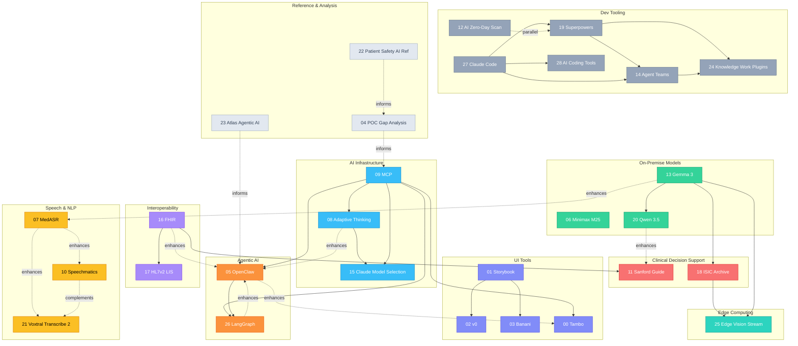
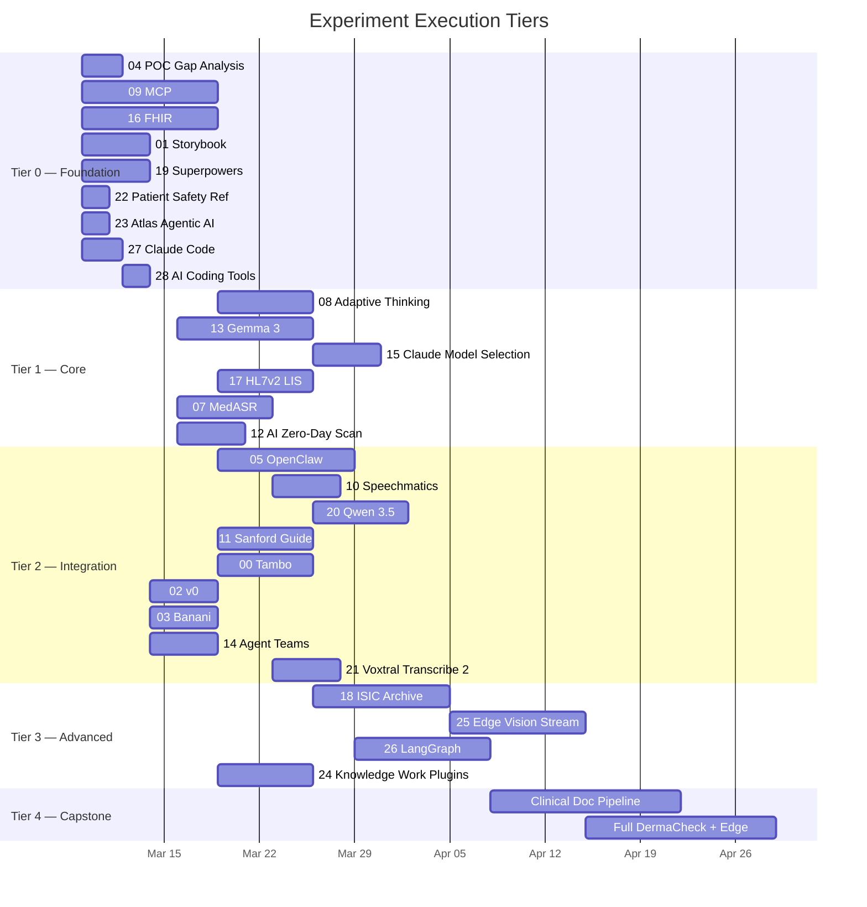
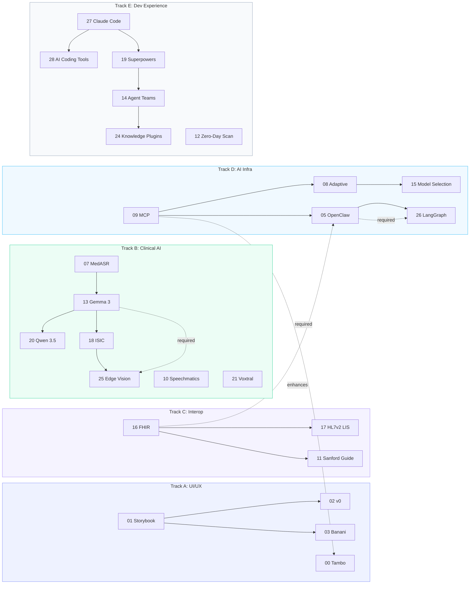
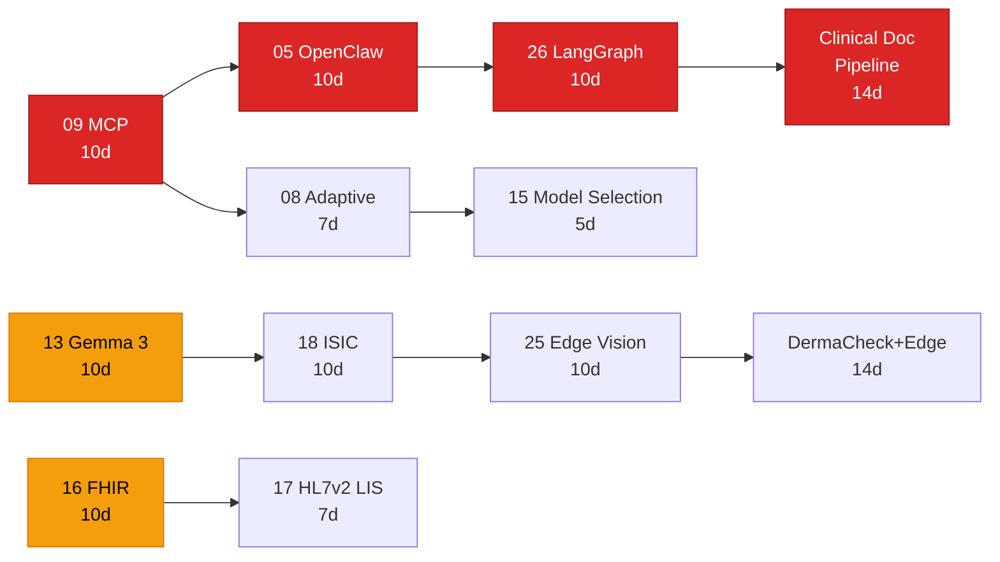

# PMS Experiment Interconnection Roadmap

**Document ID:** PMS-EXP-ROADMAP-001
**Version:** 1.0
**Date:** March 2, 2026
**Author:** Ammar (CEO, MPS Inc.)
**Status:** Living Document

---

## 1. Executive Summary

The PMS project maintains 29 experiments (numbered 00–28) evaluating technologies across frontend UI tools, clinical AI models, healthcare interoperability standards, edge computing, and developer experience. Each experiment has been documented independently — PRDs, setup guides, and tutorials — but no single document maps how these experiments relate to each other or the recommended order to execute them.

This roadmap serves as the **master navigation guide** for the experiment portfolio. It provides:

- A **complete registry** of all 29 experiments with categories, platforms, and documentation inventory
- A **dependency graph** showing which experiments build on or complement others
- **Execution tiers** recommending a foundation-first build order
- **Parallel tracks** for teams that can work on independent streams simultaneously
- A **critical path analysis** identifying bottleneck experiments that gate the most downstream work
- **Quick-start recommendations** for 1-week, 1-month, and 1-quarter execution plans

### How to Use This Document

1. **New to the project?** Start with [Section 8: Quick Start Recommendations](#8-quick-start-recommendations)
2. **Planning a sprint?** Check [Section 4: Execution Tiers](#4-recommended-execution-tiers) for prioritization
3. **Looking for related experiments?** Use the [Section 6: Interconnection Matrix](#6-interconnection-matrix)
4. **Assessing risk?** Review [Section 7: Critical Path Analysis](#7-critical-path-analysis) for bottlenecks

### Scope

This roadmap covers experiments 00–28 as documented in `docs/experiments/`. It does not cover core PMS implementation (requirements, ADRs, platform development) — for that, see the [PMS Project Overview](../PMS_Project_Overview.md).

---

## 2. Experiment Registry

| # | Name | Category | Platforms | Dependencies | Doc Types |
|---|------|----------|-----------|-------------|-----------|
| 00 | [Tambo](00-PRD-Tambo-PMS-Integration.md) | Frontend / AI UI | Web | 09-MCP | PRD, Setup, Tutorial |
| 01 | [Storybook](01-Storybook-Getting-Started.md) | Frontend / Dev Tooling | Web | None | Setup, Tutorial |
| 02 | [v0](02-v0-Getting-Started.md) | Frontend / AI UI | Web | 01-Storybook | Setup, Tutorial |
| 03 | [Banani](03-Banani-Getting-Started.md) | Frontend / AI UI | Web | 01-Storybook | Setup, Tutorial |
| 04 | [POC Gap Analysis](04-POC-Gap-Analysis.md) | Analysis | Cross | None | Analysis |
| 05 | [OpenClaw](05-PRD-OpenClaw-PMS-Integration.md) | Backend / AI Agents | Backend, Web | 09-MCP | PRD, Setup, Tutorial |
| 06 | Minimax M25 ADG | AI Models | Backend | None | .docx only |
| 07 | [MedASR](07-PRD-MedASR-PMS-Integration.md) | Backend / AI Models | Backend, Web | None | PRD, Setup, Tutorial |
| 08 | [Adaptive Thinking](08-PRD-AdaptiveThinking-PMS-Integration.md) | Backend / AI Infra | Backend | 09-MCP | PRD, Setup, Tutorial |
| 09 | [MCP](09-PRD-MCP-PMS-Integration.md) | Backend / AI Infra | Backend, Web, Android | None | PRD, Setup, Tutorial |
| 10 | [Speechmatics Medical](10-PRD-SpeechmaticsMedical-PMS-Integration.md) | Backend / External API | Backend, Web | None | PRD, Setup, Tutorial |
| 11 | [Sanford Guide](11-PRD-SanfordGuide-PMS-Integration.md) | Backend / External API | Backend, Web | 16-FHIR | PRD, Setup, Tutorial |
| 12 | [AI Zero-Day Scan](12-PRD-AIZeroDayScan-PMS-Integration.md) | Dev Tooling / Security | CI/CD | None | PRD, Setup, Tutorial, Plan |
| 13 | [Gemma 3](13-PRD-Gemma3-PMS-Integration.md) | Backend / AI Models | Backend | None | PRD, Setup, Tutorial |
| 14 | [Agent Teams](14-agent-teams-claude-whitepaper.md) | Dev Tooling | Dev | 19-Superpowers | Reference, Tutorial |
| 15 | [Claude Model Selection](15-PRD-ClaudeModelSelection-PMS-Integration.md) | Backend / AI Infra | Backend | 09-MCP, 08-Adaptive | PRD, Setup, Tutorial |
| 16 | [FHIR](16-PRD-FHIR-PMS-Integration.md) | Backend / Interop | Backend, Web | None | PRD, Setup, Tutorial |
| 17 | [HL7v2 LIS](17-PRD-HL7v2LIS-PMS-Integration.md) | Backend / Interop | Backend, Web | 16-FHIR | PRD, Setup, Tutorial |
| 18 | [ISIC Archive](18-PRD-ISICArchive-PMS-Integration.md) | Backend / AI Models / Edge | Backend, Web, Edge | 13-Gemma 3 | PRD, Setup, Tutorial |
| 19 | [Superpowers](19-PRD-Superpowers-PMS-Integration.md) | Dev Tooling | Dev | None | PRD, Setup, Tutorial |
| 20 | [Qwen 3.5](20-PRD-Qwen35-PMS-Integration.md) | Backend / AI Models | Backend | 13-Gemma 3 | PRD, Setup, Tutorial |
| 21 | [Voxtral Transcribe 2](21-PRD-VoxtralTranscribe2-PMS-Integration.md) | Backend / AI Models | Backend, Web | None | PRD, Setup, Tutorial |
| 22 | [Patient Safety AI Ref](22-PMS_AI_Extension_Ideas.md) | Reference / Analysis | Cross | None | Reference |
| 23 | [Atlas Agentic AI](23-Atlas-Agentic-AI-Healthcare-Synergies.md) | Reference / Analysis | Cross | None | Reference |
| 24 | [Knowledge Work Plugins](24-PRD-KnowledgeWorkPlugins-PMS-Integration.md) | Dev Tooling | Dev | 19-Superpowers, 14-Agent Teams | PRD, Setup, Tutorial |
| 25 | [Edge Vision Stream](25-PRD-EdgeVisionStream-PMS-Integration.md) | Edge / AI Models | Edge, Android | 18-ISIC, 13-Gemma 3 | PRD, Setup, Tutorial, Build Guide |
| 26 | [LangGraph](26-PRD-LangGraph-PMS-Integration.md) | Backend / AI Agents | Backend, Web | 09-MCP, 05-OpenClaw | PRD, Setup, Tutorial |
| 27 | [Claude Code](27-ClaudeCode-Developer-Tutorial.md) | Dev Tooling | Dev | None | Tutorial |
| 28 | [AI Coding Tools Landscape](28-AI-Coding-Tools-Landscape-2026.md) | Dev Tooling / Strategic | Cross | 27-Claude Code | Research |

---

## 3. Master Dependency Graph



**Legend:** Solid arrows = hard dependency (must be implemented first). Dashed arrows = complementary/enhances (benefits from but does not require).

---

## 4. Recommended Execution Tiers

### Tier 0 — Foundation (Weeks 1–2)

Establish infrastructure, standards, and context. These experiments have **zero dependencies** and are prerequisites for most later work.

| # | Experiment | Rationale |
|---|-----------|-----------|
| 04 | POC Gap Analysis | Understand current coverage gaps before building |
| 09 | MCP | Foundation protocol — 6 experiments depend on it |
| 16 | FHIR | Interoperability backbone — gates HL7v2 and Sanford Guide |
| 01 | Storybook | Component infrastructure — gates v0 and Banani |
| 19 | Superpowers | Dev workflow — gates Agent Teams and Knowledge Work Plugins |
| 22 | Patient Safety AI Ref | Reference — informs prioritization |
| 23 | Atlas Agentic AI | Reference — maps 50 use cases to PMS subsystems |
| 27 | Claude Code | Developer prerequisite — master the primary development tool before all experiments |
| 28 | AI Coding Tools Landscape | Strategic — understand vendor landscape, lock-in risks, and emergency transition paths |

### Tier 1 — Core Capabilities (Weeks 3–5)

Build on Tier 0 foundations. These experiments provide core AI, interop, and security capabilities.

| # | Experiment | Dependencies |
|---|-----------|-------------|
| 08 | Adaptive Thinking | 09-MCP |
| 13 | Gemma 3 | None (but benefits from Tier 0 context) |
| 15 | Claude Model Selection | 09-MCP, 08-Adaptive |
| 17 | HL7v2 LIS | 16-FHIR |
| 07 | MedASR | None (standalone, but position here for clinical pipeline) |
| 12 | AI Zero-Day Scan | None (parallel security track) |

### Tier 2 — Integration & Expansion (Weeks 6–9)

Combine Tier 1 capabilities into integrated workflows. Multiple experiments can run in parallel.

| # | Experiment | Dependencies |
|---|-----------|-------------|
| 05 | OpenClaw | 09-MCP |
| 10 | Speechmatics Medical | None (compare with 07-MedASR) |
| 20 | Qwen 3.5 | 13-Gemma 3 |
| 11 | Sanford Guide | 16-FHIR |
| 00 | Tambo | 09-MCP |
| 02 | v0 | 01-Storybook |
| 03 | Banani | 01-Storybook |
| 14 | Agent Teams | 19-Superpowers |
| 21 | Voxtral Transcribe 2 | None (compare with 07, 10) |

### Tier 3 — Advanced Capabilities (Weeks 10–12)

Complex integrations requiring multiple Tier 1–2 foundations.

| # | Experiment | Dependencies |
|---|-----------|-------------|
| 18 | ISIC Archive (DermaCheck) | 13-Gemma 3 |
| 25 | Edge Vision Stream | 18-ISIC, 13-Gemma 3 |
| 26 | LangGraph | 09-MCP, 05-OpenClaw |
| 24 | Knowledge Work Plugins | 19-Superpowers, 14-Agent Teams |

### Tier 4 — Capstone Integrations (Week 13+)

Full end-to-end clinical workflows combining multiple experiments.

| Pipeline | Experiments Combined | Description |
|----------|---------------------|-------------|
| Clinical Documentation Pipeline | 07/10/21 + 13/20 + 05 + 26 | Transcribe → Structure → Approve → File |
| Full DermaCheck + Edge | 18 + 25 + 13 + 09 + 16 | Capture → Classify → Risk Score → FHIR Export |
| Autonomous Care Coordination | 05 + 26 + 16 + 11 + 15 | Multi-step agent with HITL, FHIR interop, model routing |

### Execution Timeline (Gantt)



---

## 5. Parallel Execution Tracks

Five independent tracks that can be staffed and executed simultaneously. Cross-track dependencies are minimal and noted explicitly.

### Track A — UI/UX
```
01-Storybook → 02-v0 → 03-Banani → 00-Tambo
                                       ↑
                                  (needs 09-MCP from Track D)
```

### Track B — Clinical AI
```
{07-MedASR, 10-Speechmatics, 21-Voxtral}  →  {13-Gemma 3, 20-Qwen 3.5}  →  18-ISIC  →  25-Edge Vision
     (independent ASR comparisons)              (on-premise model stack)       (CDS)       (edge deploy)
```

### Track C — Interoperability
```
16-FHIR → {17-HL7v2 LIS, 11-Sanford Guide}
```

### Track D — AI Infrastructure & Agents
```
09-MCP → {08-Adaptive Thinking, 05-OpenClaw} → {15-Claude Model Selection, 26-LangGraph}
```

### Track E — Developer Experience
```
27-Claude Code → {28-AI Coding Tools, 19-Superpowers} → 14-Agent Teams → 24-Knowledge Work Plugins
                                                                           (+ 12-AI Zero-Day Scan runs in parallel)
```

### Cross-Track Dependencies



---

## 6. Interconnection Matrix

Relationship types: **D** = Dependency, **C** = Complementary, **S** = Same Domain, **E** = Enhances

|  | 00 | 01 | 02 | 03 | 05 | 07 | 08 | 09 | 10 | 11 | 13 | 14 | 15 | 16 | 17 | 18 | 19 | 20 | 21 | 24 | 25 | 26 |
|---|---|---|---|---|---|---|---|---|---|---|---|---|---|---|---|---|---|---|---|---|---|---|
| **00 Tambo** | — | | | | E | | | D | | | | | | | | | | | | | | |
| **01 Storybook** | | — | D | D | | | | | | | | | | | | | | | | | | |
| **02 v0** | | D | — | S | | | | | | | | | | | | | | | | | | |
| **03 Banani** | | D | S | — | | | | | | | | | | | | | | | | | | |
| **05 OpenClaw** | E | | | | — | | E | D | | | | | | E | | | | | | | | E |
| **07 MedASR** | | | | | | — | | | S | | E | | | | | | | | S | | | |
| **08 Adaptive** | | | | | E | | — | D | | | | | D | | | | | | | | | |
| **09 MCP** | D | | | | D | | D | — | | | | | D | | | | | | | | | D |
| **10 Speechmatics** | | | | | | S | | | — | | | | | | | | | | C | | | |
| **11 Sanford Guide** | | | | | | | | | | — | | | | D | | | | E | | | | |
| **13 Gemma 3** | | | | | | E | | | | | — | | | | | D | | D | | | D | |
| **14 Agent Teams** | | | | | | | | | | | | — | | | | | D | | | D | | |
| **15 Model Select** | | | | | | | D | D | | | | | — | | | | | | | | | |
| **16 FHIR** | | | | | E | | | | | D | | | | — | D | | | | | | | |
| **17 HL7v2 LIS** | | | | | | | | | | | | | | D | — | | | | | | | |
| **18 ISIC** | | | | | | | | | | | D | | | | | — | | | | | D | |
| **19 Superpowers** | | | | | | | | | | | | D | | | | | — | | | D | | |
| **20 Qwen 3.5** | | | | | | | | | | E | D | | | | | | | — | | | | |
| **21 Voxtral** | | | | | | S | | | C | | | | | | | | | | — | | | |
| **24 Knowledge Plugins** | | | | | | | | | | | | D | | | | | D | | | — | | |
| **25 Edge Vision** | | | | | | | | | | | D | | | | | D | | | | | — | |
| **26 LangGraph** | | | | | D | | | D | | | | | | | | | | | | | | — |

_Sparse matrix — only non-empty cells are shown. Experiments 04, 06, 12, 22, 23 omitted (zero or reference-only relationships)._

---

## 7. Critical Path Analysis

### Longest Dependency Chain

The critical path — the longest sequence of dependent experiments — determines the minimum time to reach full capability:

```
09-MCP → 05-OpenClaw → 26-LangGraph → Clinical Documentation Pipeline (Tier 4)
  10d        10d           10d                   14d                      = 44 days
```

### Bottleneck Experiments

These experiments **gate the most downstream work** and should be prioritized:

| Experiment | Downstream Count | Blocks |
|-----------|-----------------|--------|
| **09 MCP** | 6 | 00-Tambo, 05-OpenClaw, 08-Adaptive, 15-Model Selection, 26-LangGraph, (+ Tier 4 pipelines) |
| **13 Gemma 3** | 3 | 18-ISIC, 20-Qwen 3.5, 25-Edge Vision |
| **16 FHIR** | 2 | 11-Sanford Guide, 17-HL7v2 LIS |
| **01 Storybook** | 2 | 02-v0, 03-Banani |
| **19 Superpowers** | 2 | 14-Agent Teams, 24-Knowledge Work Plugins |

### Critical Path Diagram



---

## 8. Quick Start Recommendations

### 1-Week Sprint

**Goal:** Establish foundation context and begin core infrastructure.

| Day | Activity |
|-----|----------|
| 1 | Read reference docs: [04-POC Gap Analysis](04-POC-Gap-Analysis.md), [22-Patient Safety AI Ref](22-PMS_AI_Extension_Ideas.md), [23-Atlas Agentic AI](23-Atlas-Agentic-AI-Healthcare-Synergies.md) |
| 2–3 | Begin [09-MCP](09-PRD-MCP-PMS-Integration.md): PRD review, FastMCP server skeleton |
| 4–5 | Begin [16-FHIR](16-PRD-FHIR-PMS-Integration.md): PRD review, FHIR Facade skeleton |

### 1-Month Plan

| Week | Focus | Experiments |
|------|-------|-------------|
| 1 | Infrastructure | 09-MCP + 16-FHIR (parallel) |
| 2 | AI Foundation | 13-Gemma 3 + 08-Adaptive Thinking (parallel) |
| 3 | Agents + Speech | 05-OpenClaw + 07-MedASR (parallel) |
| 4 | Dev + UI | 01-Storybook + 19-Superpowers (parallel) |

### 1-Quarter Plan (13 Weeks)

| Weeks | Tier | Experiments |
|-------|------|-------------|
| 1–2 | 0 — Foundation | 04, 09, 16, 01, 19, 22, 23, 27, 28 |
| 3–5 | 1 — Core | 08, 13, 15, 17, 07, 12 |
| 6–9 | 2 — Integration | 05, 10, 20, 11, 00, 02, 03, 14, 21 |
| 10–12 | 3 — Advanced | 18, 25, 26, 24 |
| 13 | 4 — Capstone | Clinical Doc Pipeline, DermaCheck+Edge |

---

## 9. Platform Coverage Matrix

| Experiment | Backend | Web | Android | Database | AI Models | Edge | External APIs | Dev Tooling |
|-----------|---------|-----|---------|----------|-----------|------|---------------|-------------|
| 00 Tambo | | X | | | | | | |
| 01 Storybook | | X | | | | | | X |
| 02 v0 | | X | | | | | | |
| 03 Banani | | X | | | | | | |
| 04 POC Gap Analysis | X | X | X | X | | | | |
| 05 OpenClaw | X | X | | X | | | | |
| 06 Minimax M25 | X | | | | X | | | |
| 07 MedASR | X | X | | | X | | | |
| 08 Adaptive Thinking | X | | | | X | | | |
| 09 MCP | X | X | X | | | | | |
| 10 Speechmatics | X | X | | | | | X | |
| 11 Sanford Guide | X | X | | X | | | X | |
| 12 AI Zero-Day Scan | | | | | X | | | X |
| 13 Gemma 3 | X | X | | | X | | | |
| 14 Agent Teams | | | | | | | | X |
| 15 Claude Model Selection | X | | | X | X | | | |
| 16 FHIR | X | X | | X | | | | |
| 17 HL7v2 LIS | X | X | | X | | | | |
| 18 ISIC Archive | X | X | | X | X | X | | |
| 19 Superpowers | | | | | | | | X |
| 20 Qwen 3.5 | X | | | | X | | | |
| 21 Voxtral Transcribe 2 | X | X | | | X | | | |
| 22 Patient Safety Ref | X | X | X | X | X | | | |
| 23 Atlas Agentic AI | X | X | X | | X | | | |
| 24 Knowledge Work Plugins | | | | | | | | X |
| 25 Edge Vision Stream | | | X | | X | X | | |
| 26 LangGraph | X | X | | X | X | | | |
| 27 Claude Code | | | | | | | | X |
| 28 AI Coding Tools | X | X | X | | X | X | | X |
| **Total** | **19** | **17** | **6** | **9** | **15** | **4** | **2** | **7** |

---

## 10. Category Legend & Color Key

Reference for Mermaid diagram styling in Section 3.

| Category | Color | Hex | Experiments |
|----------|-------|-----|-------------|
| UI Tools | Indigo | `#818cf8` | 00, 01, 02, 03 |
| AI Infrastructure | Sky Blue | `#38bdf8` | 08, 09, 15 |
| On-Premise Models | Emerald | `#34d399` | 06, 13, 20 |
| Speech & NLP | Amber | `#fbbf24` | 07, 10, 21 |
| Clinical Decision Support | Red | `#f87171` | 11, 18 |
| Interoperability | Violet | `#a78bfa` | 16, 17 |
| Agentic AI | Orange | `#fb923c` | 05, 26 |
| Edge Computing | Teal | `#2dd4bf` | 25 |
| Dev Tooling | Slate | `#94a3b8` | 12, 14, 19, 24, 27, 28 |
| Reference & Analysis | Light Gray | `#e2e8f0` | 04, 22, 23 |

---

## 11. Change Log

| Version | Date | Author | Changes |
|---------|------|--------|---------|
| 1.2 | 2026-03-02 | Ammar | Added Experiment 28 (AI Coding Tools Landscape) |
| 1.1 | 2026-03-02 | Ammar | Added Experiment 27 (Claude Code Mastery) |
| 1.0 | 2026-03-02 | Ammar | Initial roadmap covering experiments 00–26 |
