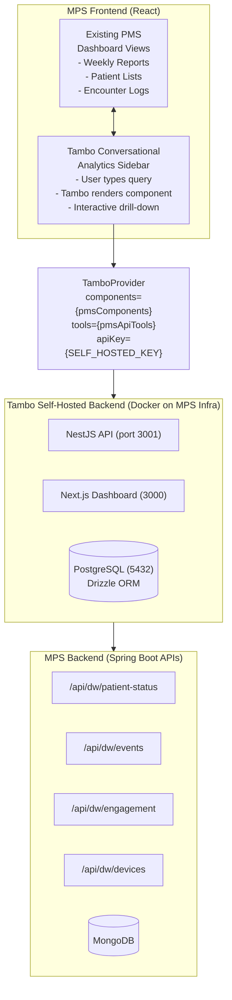

# Product Requirements Document: Tambo AI Integration into Practice Metrics Reporting System (PMS)

**Document ID:** PRD-PMS-TAMBO-001
**Version:** 1.0
**Date:** February 16, 2026
**Author:** Ammar (CEO, MPS Inc.)
**Status:** Draft

---

## 1. Executive Summary

This PRD defines the integration of Tambo AI — an open-source generative UI SDK for React — into the MPS Health Practice Metrics Reporting System (PMS). The goal is to replace static weekly PDF reports with a conversational analytics interface where practice administrators, health coaches, and account managers can query PMS data using natural language and receive dynamically rendered React components (charts, tables, dashboards) in response.

Tambo will be **self-hosted** on MPS infrastructure to maintain HIPAA compliance and full control over PHI data flow. No patient data will leave our environment.

---

## 2. Problem Statement

The current PMS reporting workflow has several limitations:

- **Static delivery:** Weekly Practice Metrics Reports are generated as PDFs and emailed to stakeholders, creating a lag between data availability and consumption.
- **One-size-fits-all:** All consumers (practice admins, health coaches, account managers) receive the same report format regardless of their specific needs.
- **No drill-down capability:** Users cannot explore data beyond the predefined report layout without requesting custom queries from the engineering team.
- **High engineering cost for ad-hoc requests:** Every new report view or filter requires backend development and a release cycle.

---

## 3. Proposed Solution

Integrate Tambo AI as a **conversational analytics sidebar** within the PMS dashboard. Users type natural language queries, and Tambo's agent selects and renders the appropriate React component with live data from our existing Spring Boot APIs.

### 3.1 Architecture Overview



### 3.2 Deployment Model

- **Self-hosted Tambo backend** running in Docker containers on MPS development/staging infrastructure
- **LLM provider:** Anthropic Claude API (API key managed via environment variables, no PHI sent to LLM — only schema definitions and user queries)
- **Data flow:** Tambo agent calls MPS Spring Boot APIs internally; all PHI stays within our network boundary

---

## 4. Data Warehouse Collections (Existing)

Tambo tools will query the following existing PMS data warehouse collections:

### 4.1 DW_PatientStatus
- Patient lifecycle tracking: enrolled, declined, inactive, ineligible, opt-out
- Organization assignment and attribution
- Key metrics: Enrollment %, Pending Enrollment count

### 4.2 DW_Events
- Time-series events: appointments, RPM encounters, CCM encounters, HRA encounters, hospitalizations
- Outcomes: SCHEDULED, COMPLETED, NO_SHOW, CANCELLED
- Key metrics: Completion rates, No-show %, Encounter volume

### 4.3 DW_Engagement
- Patient engagement scores over time
- Baseline vs. current HRA/CCM scores (0-100 range)
- 3-month interval tracking
- Health coach attribution

### 4.4 DW_Devices
- Device assignment and utilization for RPM programs
- Device type tracking and compliance metrics

---

## 5. Tambo Component Definitions

Each component maps to a Zod schema that Tambo uses as an LLM tool definition.

### 5.1 EnrollmentDashboard (Generative)

**Description:** Displays patient enrollment metrics for an organization over a time period.

**Props Schema:**
```typescript
z.object({
  organizationName: z.string(),
  dateRange: z.object({
    start: z.string().describe("ISO date"),
    end: z.string().describe("ISO date")
  }),
  totalPatients: z.number(),
  enrolled: z.number(),
  declined: z.number(),
  optOut: z.number(),
  inactive: z.number(),
  ineligible: z.number(),
  pendingEnrollment: z.number(),
  enrollmentPercentage: z.number(),
  trend: z.array(z.object({
    week: z.string(),
    enrollmentPct: z.number()
  })).optional()
})
```

**Example queries:** "Show enrollment rates for Dr. Smith's practice this month," "Which practices have enrollment below 50%?"

### 5.2 EncounterTable (Generative)

**Description:** Renders a filterable table of encounters with completion status.

**Props Schema:**
```typescript
z.object({
  encounters: z.array(z.object({
    patientName: z.string(),
    encounterType: z.enum(["RPM", "CCM", "HRA", "APPOINTMENT"]),
    scheduledDate: z.string(),
    outcome: z.enum(["COMPLETED", "NO_SHOW", "CANCELLED", "SCHEDULED"]),
    healthCoach: z.string(),
    duration: z.number().optional()
  })),
  summary: z.object({
    total: z.number(),
    completed: z.number(),
    noShow: z.number(),
    cancelled: z.number(),
    completionRate: z.number(),
    noShowRate: z.number()
  })
})
```

**Example queries:** "Show me all no-shows this week," "RPM encounter completion rate by health coach."

### 5.3 EngagementChart (Generative)

**Description:** Visualizes patient engagement score trends using Recharts.

**Props Schema:**
```typescript
z.object({
  chartType: z.enum(["line", "bar", "scatter"]),
  data: z.array(z.object({
    period: z.string(),
    averageScore: z.number(),
    patientCount: z.number()
  })),
  baselineAverage: z.number().optional(),
  currentAverage: z.number().optional(),
  organizationName: z.string().optional()
})
```

**Example queries:** "Graph engagement score trends over the last 6 months," "Compare baseline vs. current scores across practices."

### 5.4 DeviceUtilization (Generative)

**Description:** Displays RPM device assignment and utilization metrics.

**Props Schema:**
```typescript
z.object({
  totalDevices: z.number(),
  assigned: z.number(),
  activeReadings: z.number(),
  complianceRate: z.number(),
  byType: z.array(z.object({
    deviceType: z.string(),
    count: z.number(),
    activeCount: z.number()
  }))
})
```

**Example queries:** "How many devices are assigned but not reporting?" "Device compliance rate by practice."

### 5.5 PatientStatusFlow (Generative)

**Description:** Renders a Sankey-style or stacked bar visualization of patient status transitions.

**Props Schema:**
```typescript
z.object({
  transitions: z.array(z.object({
    from: z.string(),
    to: z.string(),
    count: z.number()
  })),
  period: z.string(),
  organizationName: z.string().optional()
})
```

**Example queries:** "Show patient status transitions this quarter," "How many patients moved from enrolled to inactive?"

### 5.6 PracticeComparisonTable (Generative)

**Description:** Side-by-side comparison of metrics across multiple practices.

**Props Schema:**
```typescript
z.object({
  practices: z.array(z.object({
    name: z.string(),
    enrollmentPct: z.number(),
    encounterCompletionPct: z.number(),
    noShowPct: z.number(),
    avgEngagementScore: z.number(),
    deviceCompliancePct: z.number(),
    totalPatients: z.number()
  })),
  sortBy: z.string().optional(),
  highlightThresholds: z.object({
    enrollmentWarning: z.number().optional(),
    noShowWarning: z.number().optional()
  }).optional()
})
```

**Example queries:** "Compare all practices by enrollment rate," "Which practices have no-show rates above 20%?"

---

## 6. Tambo Tool Definitions

Tools are functions the agent calls to fetch data from MPS's Spring Boot backend.

| Tool Name | Description | MPS API Endpoint |
|-----------|-------------|---------------------|
| `queryPatientStatus` | Fetch enrollment metrics by organization and date range | `GET /api/dw/patient-status` |
| `queryEvents` | Fetch encounters/appointments with filters | `GET /api/dw/events` |
| `queryEngagement` | Fetch engagement scores and trends | `GET /api/dw/engagement` |
| `queryDevices` | Fetch device assignment and utilization | `GET /api/dw/devices` |
| `listOrganizations` | Return available organizations for context | `GET /api/organizations` |
| `queryStatusTransitions` | Fetch patient status change history | `GET /api/dw/patient-status/transitions` |
| `comparePractices` | Fetch aggregate metrics across practices | `GET /api/dw/practices/compare` |

---

## 7. User Roles and Access

| Role | Access Scope | Example Queries |
|------|-------------|-----------------|
| **Practice Administrator** | Own practice data only | "Show my enrollment this week" |
| **Health Coach** | Assigned patients and encounters | "My no-shows today," "Engagement scores for my patients" |
| **Account Manager** | All assigned practices | "Compare my practices," "Which practice needs attention?" |
| **MPS Admin** | All organizations | "System-wide enrollment trends," "Top performing practices" |

Access control is enforced at the Spring Boot API layer (existing RBAC), not within Tambo. The `userToken` passed to `TamboProvider` carries the authenticated user's JWT, which the API validates.

---

## 8. Non-Functional Requirements

### 8.1 Security and Compliance
- All Tambo infrastructure self-hosted within MPS's network
- No PHI transmitted to LLM providers (only component schemas and natural language queries)
- LLM API key stored in environment variables, never exposed to client
- All API calls from Tambo tools go through authenticated Spring Boot endpoints
- Audit logging for all conversational queries

### 8.2 Performance
- Component render time < 3 seconds from query submission
- Streaming props for progressive rendering on larger datasets
- API response time < 1 second for standard queries

### 8.3 Infrastructure
- Docker-based deployment (PostgreSQL + NestJS API + Next.js dashboard)
- Node.js 22+ required
- Compatible with existing MPS CI/CD pipeline

---

## 9. Implementation Phases

### Phase 1: Foundation (Sprint 1-2)
- Self-host Tambo backend on development environment
- Implement 2 components: `EnrollmentDashboard`, `EncounterTable`
- Implement 3 tools: `queryPatientStatus`, `queryEvents`, `listOrganizations`
- Basic sidebar integration in PMS dashboard

### Phase 2: Analytics Expansion (Sprint 3-4)
- Add `EngagementChart`, `DeviceUtilization`, `PracticeComparisonTable`
- Add remaining tools
- Context helpers for current user role and selected organization
- Suggestion prompts based on user role

### Phase 3: Interactive Features (Sprint 5-6)
- Add `PatientStatusFlow` with interactable pattern for drill-down
- MCP integration for connecting to additional data sources
- Conversation history and saved queries
- Production deployment and monitoring

---

## 10. Success Metrics

| Metric | Target | Measurement |
|--------|--------|-------------|
| Ad-hoc report requests to engineering | 50% reduction | JIRA ticket count comparison |
| Time to insight | < 30 seconds (from query to rendered answer) | Frontend analytics |
| User adoption | 60% of PMS users within 3 months | Active user tracking |
| Query success rate | > 85% queries produce relevant components | Agent response logging |

---

## 11. Risks and Mitigations

| Risk | Impact | Mitigation |
|------|--------|------------|
| LLM hallucination produces incorrect metrics | High | All data sourced from verified API endpoints; components display real data, not LLM-generated numbers |
| Increased API load from conversational queries | Medium | Rate limiting on Tambo tools; caching layer for frequently requested data |
| User confusion with natural language interface | Medium | Pre-built suggestion prompts per role; onboarding guide |
| Tambo open-source project maintenance risk | Low | Self-hosted; MIT licensed; can fork if needed |

---

## 12. Dependencies

- Tambo AI SDK (`@tambo-ai/react`) — React SDK for frontend
- Tambo Cloud backend (self-hosted via Docker) — conversation state and agent orchestration
- Anthropic Claude API key — LLM provider for agent reasoning
- Existing MPS Spring Boot APIs — data source
- Existing PMS Data Warehouse collections — DW_PatientStatus, DW_Events, DW_Engagement, DW_Devices

---

## 13. Research Sources

### Official Documentation

- [Tambo AI Docs](https://docs.tambo.co/) — SDK reference, component registration, agent configuration
- [Tambo GitHub Repository](https://github.com/tambo-ai/tambo) — Source code, architecture, and React SDK

### Architecture & Ecosystem

- [Introducing Tambo 1.0](https://tambo.co/blog/posts/introducing-tambo-generative-ui) — Launch announcement, SOC 2 and HIPAA compliance details
- [What is Generative UI?](https://tambo.co/blog/posts/what-is-generative-ui) — Core concepts behind Tambo's generative UI approach
- [Tambo: A Comprehensive Overview (Skywork AI)](https://skywork.ai/blog/tambo-a-comprehensive-overview/) — Third-party architectural analysis and comparison

### Community & Tutorials

- [Tambo AI: React SDK for Generative UI (YUV.AI)](https://yuv.ai/blog/tambo-ai) — Developer walkthrough and integration patterns

---

## 14. Appendix: Related Documents

- PMS Data Warehouse Requirements (DW Collections Schema)
- MPS API Swagger Documentation
- Tambo AI Documentation: https://docs.tambo.co
- Tambo GitHub Repository: https://github.com/tambo-ai/tambo
