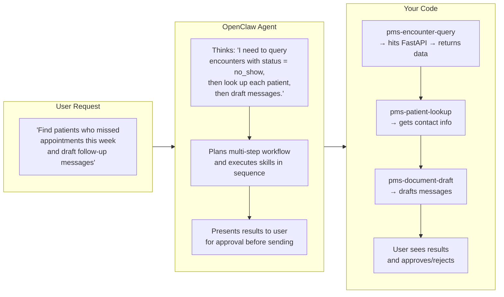
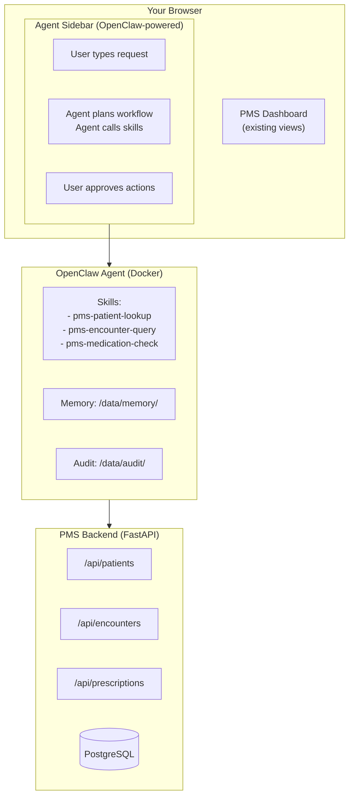

# OpenClaw Developer Onboarding Tutorial

**Welcome to the MPS PMS Agent Automation Team**

This tutorial will take you from zero to building your first OpenClaw skill for the PMS. By the end, you will understand how OpenClaw works, have a running local environment, and have built and tested a custom PMS skill end-to-end.

**Document ID:** PMS-EXP-OPENCLAW-002
**Version:** 1.0
**Date:** February 16, 2026
**Applies To:** PMS project (all platforms)
**Prerequisite:** [OpenClaw Setup Guide](05-OpenClaw-PMS-Developer-Setup-Guide.md)
**Estimated time:** 2-3 hours
**Difficulty:** Beginner-friendly (assumes basic TypeScript and REST API knowledge)

---

## What You Will Learn

1. What OpenClaw is and why we use it
2. How the pieces fit together (mental model)
3. Verifying your local environment
4. Building your first skill
5. Testing with real queries
6. Understanding the approval system
7. Debugging common issues
8. Building a second skill (practice exercise)
9. How to contribute to the PMS OpenClaw codebase

---

## Part 1: Understanding OpenClaw (15 min read)

### 1.1 What Problem Does OpenClaw Solve?

Today, our PMS staff spend hours on repetitive tasks: looking up patient records across screens, drafting the same types of clinical documents, chasing follow-ups that fell through the cracks, and manually reconciling data across systems.

OpenClaw lets us build an **AI agent** that automates these multi-step workflows. Staff type natural language instructions like "find all patients who missed their appointment last week and draft follow-up messages" and the agent executes the entire workflow — calling our APIs, processing data, and drafting outputs — with human approval before any actions are taken.

### 1.2 How OpenClaw Works — The Three Pieces

Think of OpenClaw as a smart assistant that knows how to use your tools.



**The three things you define:**

| You Build | What It Does | Example |
|-----------|-------------|---------|
| **Skills** | Functions that interact with external systems (API calls, data processing) | `pms-patient-lookup` → calls FastAPI |
| **Descriptions** | Text that tells the agent when and how to use each skill | "Use when the user asks to find a patient" |
| **Approval policies** | Rules for what requires human review | Read = auto, Write = human approval |

The agent reads your descriptions and schemas, decides which skills to call and in what order, executes them, and presents results.

### 1.3 OpenClaw vs. Tambo — Why We Have Both

| Aspect | Tambo | OpenClaw |
|--------|-------|----------|
| **What it does** | Renders React components in response to data queries | Executes multi-step workflows across systems |
| **User experience** | "Show me enrollment data" → sees a chart | "Draft follow-up letters for no-shows" → reviews drafts |
| **Output** | Visual components (charts, tables) | Actions (documents, messages, data updates) |
| **Think of it as** | A smart dashboard | A smart assistant |

They're complementary: use **Tambo** when you want to **see** data, use **OpenClaw** when you want to **do** something with it.

### 1.4 Key Vocabulary

| Term | Meaning |
|------|---------|
| **Skill** | A function the agent can call — typically wraps an API call or data processing step |
| **Skill Schema** | JSON Schema defining the input and output shape of a skill |
| **Agent** | The LLM-powered reasoning engine that decides which skills to invoke |
| **Thread** | A conversation session with message history |
| **Memory** | Persistent context stored as Markdown files — user preferences, past interactions |
| **Approval tier** | Security level: `read` (auto), `write_advisory` (human review), `write_autonomous` (blocked) |
| **ClawHub** | Public skill marketplace (disabled in our deployment for security) |
| **Sandboxed mode** | Restricted execution environment with limited system access |

### 1.5 Our Architecture



---

## Part 2: Environment Verification (15 min)

Before building anything, verify your setup is working. Follow the [Setup Guide](05-OpenClaw-PMS-Developer-Setup-Guide.md) if you haven't already.

### 2.1 Checklist

Open a terminal and run each command:

```bash
# 1. Docker running
docker --version
# Need: 24.x or higher

# 2. OpenClaw container running
docker compose -f ~/Projects/utexas/pms-openclaw/docker-compose.yml ps
# Should show openclaw container as "running"

# 3. Agent responding
curl http://localhost:3333/health
# Expected: {"status":"ok","version":"1.x.x"}

# 4. Skills loaded
curl http://localhost:3333/api/skills
# Should list pms-patient-lookup, pms-encounter-query, pms-medication-check

# 5. PMS Backend running
curl http://localhost:8000/docs
# Should show FastAPI Swagger UI

# 6. PMS Frontend running
curl -s -o /dev/null -w "%{http_code}" http://localhost:3000
# Expected: 200
```

### 2.2 Quick Test

Open the PMS dashboard at http://localhost:3000. You should see the Agent Sidebar on the right. Type:

> "hello"

If the agent responds, you're ready to start building.

**Checkpoint:** All services running, agent responding to messages.

---

## Part 3: Build Your First Skill (45 min)

Let's build a skill from scratch so you understand every piece.

### 3.1 What We Are Building

A **pms-overdue-followups** skill that identifies patients with overdue follow-up encounters. The user will trigger it by asking something like "Which patients need follow-up?"

### 3.2 Step 1 — Plan the Skill

Before writing code, think about:

| Question | Answer |
|----------|--------|
| What data does this skill need? | Encounters with status "scheduled" that are past their scheduled date |
| What API endpoint provides it? | `GET /api/encounters?status=scheduled` |
| What does the output look like? | List of patients with overdue encounter details |
| What approval level? | Read (auto-approved — no data modification) |

### 3.3 Step 2 — Create the Skill File

```bash
cd ~/Projects/utexas/pms-openclaw
mkdir -p skills/pms-overdue-followups
```

Create `skills/pms-overdue-followups/index.ts`:

```typescript
import { Skill, SkillInput, SkillOutput } from "@openclaw/sdk";

interface OverdueFollowupsInput {
  days_overdue?: number;
  encounter_type?: string;
}

const skill: Skill = {
  name: "pms-overdue-followups",
  description:
    "Identifies patients with overdue follow-up encounters. Queries encounters " +
    "that were scheduled but never completed, past their scheduled date. " +
    "Returns patient names, encounter details, and how many days overdue. " +
    "Use when the user asks about overdue follow-ups, missed appointments " +
    "that need rescheduling, or patients who need outreach.",

  inputSchema: {
    type: "object",
    properties: {
      days_overdue: {
        type: "number",
        description: "Minimum days past scheduled date to include (default: 1)",
      },
      encounter_type: {
        type: "string",
        enum: ["office_visit", "telehealth", "follow_up", "emergency", "procedure"],
        description: "Filter by specific encounter type (optional)",
      },
    },
  },

  outputSchema: {
    type: "object",
    properties: {
      overdue_patients: {
        type: "array",
        items: {
          type: "object",
          properties: {
            patient_id: { type: "string" },
            patient_name: { type: "string" },
            encounter_type: { type: "string" },
            scheduled_date: { type: "string" },
            days_overdue: { type: "number" },
            reason: { type: "string" },
          },
        },
      },
      total_overdue: { type: "number" },
      summary: { type: "string" },
    },
  },

  async execute(input: SkillInput<OverdueFollowupsInput>): Promise<SkillOutput> {
    const { days_overdue = 1, encounter_type } = input.params;
    const apiUrl = process.env.PMS_API_URL;
    const token = process.env.PMS_API_TOKEN;

    // Step 1: Query scheduled encounters
    const params = new URLSearchParams({ status: "scheduled" });
    if (encounter_type) params.set("encounter_type", encounter_type);

    const response = await fetch(`${apiUrl}/api/encounters?${params}`, {
      headers: {
        "Content-Type": "application/json",
        Authorization: `Bearer ${token}`,
      },
    });

    if (!response.ok) {
      throw new Error(`PMS API error: ${response.status}`);
    }

    const data = await response.json();
    const encounters = Array.isArray(data) ? data : data.items || [];

    // Step 2: Filter to overdue encounters
    const now = new Date();
    const overdue = encounters
      .filter((enc: any) => {
        const scheduled = new Date(enc.scheduled_at);
        const diffDays = Math.floor((now.getTime() - scheduled.getTime()) / (1000 * 60 * 60 * 24));
        return diffDays >= days_overdue;
      })
      .map((enc: any) => {
        const scheduled = new Date(enc.scheduled_at);
        const diffDays = Math.floor((now.getTime() - scheduled.getTime()) / (1000 * 60 * 60 * 24));
        return {
          patient_id: enc.patient_id,
          patient_name: `Patient ${enc.patient_id}`, // Will be enriched by agent
          encounter_type: enc.encounter_type,
          scheduled_date: scheduled.toLocaleDateString("en-US"),
          days_overdue: diffDays,
          reason: enc.reason || "No reason recorded",
        };
      })
      .sort((a: any, b: any) => b.days_overdue - a.days_overdue); // Most overdue first

    // Step 3: Build summary
    const summary = overdue.length === 0
      ? "No overdue follow-ups found. All scheduled encounters are up to date."
      : `Found ${overdue.length} overdue follow-up(s). Most overdue: ${overdue[0].days_overdue} days.`;

    return {
      overdue_patients: overdue,
      total_overdue: overdue.length,
      summary,
    };
  },
};

export default skill;
```

### 3.4 Step 3 — Register the Skill

Edit `config/skills.yaml` and add:

```yaml
  - name: pms-overdue-followups
    path: /app/skills/pms-overdue-followups
    approval_tier: read
    enabled: true
```

### 3.5 Step 4 — Reload and Test

```bash
# Restart the agent to pick up the new skill
docker compose restart openclaw

# Verify it's registered
curl -s http://localhost:3333/api/skills | grep overdue
# Should show pms-overdue-followups
```

Now go to the Agent Sidebar and type:

> "Which patients have overdue follow-ups?"

The agent should:
1. Recognize this needs the `pms-overdue-followups` skill
2. Call it with default parameters
3. Present the results in a readable format

Try variations:

> "Show me follow-ups overdue by more than 7 days"

> "Any overdue telehealth appointments?"

### 3.6 What Just Happened

1. Your message went to the OpenClaw agent
2. The agent matched your query to `pms-overdue-followups` based on the description
3. The agent extracted parameters from your message (days_overdue, encounter_type)
4. The skill called `GET /api/encounters?status=scheduled` on the PMS backend
5. The skill filtered and sorted the results
6. The agent formatted the output and displayed it in the chat

---

## Part 4: Understanding the Approval System (15 min)

### 4.1 Three Tiers

| Tier | What It Means | Example Skills |
|------|---------------|----------------|
| **Read** (`auto`) | Agent calls the skill immediately, no user prompt | `pms-patient-lookup`, `pms-encounter-query` |
| **Write-advisory** (`human_required`) | Agent drafts output, presents to user for review before acting | `pms-document-draft`, `pms-prior-auth` |
| **Write-autonomous** (`blocked`) | Completely blocked for PHI operations | Not used — all writes require human review |

### 4.2 How Approval Looks in Practice

When a skill with `human_required` approval is triggered:

```
Agent: I've drafted a follow-up message for John Doe:

  "Dear John, we noticed you missed your RPM check-in scheduled
   for Feb 10. Please call us at (555) 123-4567 to reschedule.
   — Dr. Smith's Office"

  [Approve]  [Reject]  [Edit]
```

The agent **cannot** send the message until the user clicks Approve. This is critical for HIPAA compliance.

### 4.3 Setting the Approval Tier

In `config/skills.yaml`:

```yaml
  - name: pms-document-draft
    path: /app/skills/pms-document-draft
    approval_tier: write_advisory    # <-- Requires human review
    enabled: true
```

**Rule of thumb:**
- Does the skill only **read** data? → `read`
- Does the skill **create or modify** anything? → `write_advisory`
- Should the skill **never run without oversight**? → `write_advisory` (we don't use `write_autonomous` for PHI)

---

## Part 5: Debugging Common Issues (15 min read)

### 5.1 "The agent doesn't call my skill"

The agent matches queries to skills based on the `description` field. If your skill isn't being invoked:

**Fixes:**
- Make descriptions more specific — include keywords users would actually say
- Cover multiple phrasings: "overdue", "past due", "late", "missed", "needs follow-up"
- Check that the skill is registered: `curl http://localhost:3333/api/skills`
- Restart after changes: `docker compose restart openclaw`

**Good description:**
```
"Identifies patients with overdue follow-up encounters. Queries encounters
that were scheduled but never completed, past their scheduled date.
Returns patient names, encounter details, and how many days overdue.
Use when the user asks about overdue follow-ups, missed appointments
that need rescheduling, or patients who need outreach."
```

**Bad description:**
```
"Gets overdue data"
```

### 5.2 "The skill returns an error"

```bash
# Check agent logs for the full error
docker compose logs -f openclaw | grep -A5 "ERROR"

# Common causes:
# 1. PMS backend not running
curl http://localhost:8000/docs

# 2. Invalid auth token
# Regenerate: POST http://localhost:8000/api/auth/login

# 3. API endpoint doesn't exist
# Check the Swagger docs at http://localhost:8000/docs
```

### 5.3 "The agent returns data in a weird format"

The agent formats skill output as text. If the formatting is off:
- Check your `outputSchema` — the agent uses it to understand the data shape
- Add `.description` to schema fields for better formatting hints
- Structure output logically — put the summary first, details second

### 5.4 "Skill works but is slow"

```bash
# Check which API calls are slow
docker compose logs openclaw | grep "duration"

# Common fixes:
# 1. Add date range filters to reduce data volume
# 2. Use pagination in API calls
# 3. Process data in the skill instead of returning everything to the agent
```

### 5.5 Reading Agent Reasoning

The agent logs show its decision-making process:

```bash
docker compose logs -f openclaw
```

Look for lines like:

```
[Agent] User: "who needs follow-up?"
[Agent] Planning: Identified pms-overdue-followups as relevant skill
[Agent] Skill call: pms-overdue-followups(days_overdue=1)
[Agent] Skill result: 5 overdue patients found
[Agent] Formatting response...
```

This is invaluable for understanding why the agent chose (or didn't choose) your skill.

---

## Part 6: Practice Exercise — Build a Skill (45 min)

Now it's your turn. Build one of these skills on your own:

### Option A: pms-patient-summary

A skill that generates a comprehensive patient summary — demographics, recent encounters, active medications, and engagement metrics.

**Hints:**
- Calls multiple API endpoints: `/api/patients/{id}`, `/api/encounters?patient_id={id}`, `/api/patients/{id}/prescriptions`
- Combines data from multiple sources into a single summary
- Useful for: "Give me a summary of patient 1" or "What's the status of John Doe?"

### Option B: pms-schedule-gaps

A skill that identifies gaps in the practice schedule — time slots with no encounters.

**Hints:**
- Queries encounters for a date range
- Analyzes scheduled times to find gaps
- Useful for: "Any open slots this week?" or "When can we schedule a follow-up?"

### Option C: pms-refill-alert

A skill that finds prescriptions with zero refills remaining that are still active.

**Hints:**
- Calls `/api/patients/{id}/prescriptions` or `/api/prescriptions`
- Filters for `status = active` and `refills_remaining = 0`
- Useful for: "Which patients need prescription refills?" or "Active medications with no refills"

**Steps to follow:**

1. Create the skill directory: `mkdir -p skills/pms-{skill-name}`
2. Write `index.ts` with description, schemas, and execute function
3. Register in `config/skills.yaml` with appropriate approval tier
4. Restart: `docker compose restart openclaw`
5. Test with at least 3 different natural language phrasings
6. Check audit logs to verify invocations are recorded
7. Commit on a feature branch

---

## Part 7: Development Workflow and Conventions

### 7.1 File Organization

```
pms-openclaw/
├── config/
│   ├── openclaw.yaml          # Main agent configuration
│   ├── skills.yaml            # Skill registry
│   ├── approval-policy.yaml   # Approval tier definitions
│   ├── workflows.yaml         # Scheduled workflow definitions
│   └── memory/                # Persistent memory files
├── skills/
│   ├── pms-patient-lookup/    # Each skill in its own directory
│   │   └── index.ts
│   ├── pms-encounter-query/
│   │   └── index.ts
│   ├── pms-medication-check/
│   │   └── index.ts
│   └── pms-overdue-followups/
│       └── index.ts
├── docker-compose.yml
├── Dockerfile
└── .env
```

### 7.2 Naming Conventions

| Item | Convention | Example |
|------|-----------|---------|
| Skill directory | kebab-case with `pms-` prefix | `pms-patient-lookup/` |
| Skill name (in code) | kebab-case with `pms-` prefix | `"pms-patient-lookup"` |
| Skill file | Always `index.ts` | `skills/pms-patient-lookup/index.ts` |
| Config files | kebab-case YAML | `approval-policy.yaml` |
| Environment vars | SCREAMING_SNAKE_CASE | `PMS_API_URL` |

### 7.3 Writing Good Skill Descriptions

The description is the most important part. It determines whether the agent picks your skill for a given query.

**Do:**
- List specific keywords and phrasings users would say
- Explain what data the skill accesses
- Be specific about when to use it vs. similar skills
- Keep it 3-5 sentences

**Don't:**
- Write generic descriptions like "Queries data"
- Assume the agent knows domain jargon — spell out acronyms
- Leave descriptions shorter than 2 sentences
- Include PHI examples in descriptions (they go to the LLM)

### 7.4 PR Checklist

When submitting a PR that adds an OpenClaw skill:

- [ ] Skill directory created in `skills/pms-{name}/`
- [ ] `index.ts` implements `Skill` interface with description, schemas, and execute
- [ ] Description is detailed (3+ sentences, includes trigger keywords)
- [ ] `inputSchema` and `outputSchema` match actual API data shapes
- [ ] Skill registered in `config/skills.yaml` with correct approval tier
- [ ] Tested with at least 3 different natural language phrasings
- [ ] Audit log entries verified for skill invocations
- [ ] No PHI in skill descriptions or schema descriptions
- [ ] Error handling for API failures (try/catch with meaningful messages)
- [ ] Code reviewed for HIPAA compliance (no PHI logging, no data leakage)

### 7.5 Security Reminders

- **Never put PHI in descriptions.** Descriptions go to the LLM. Use only structural information.
- **All API calls go through authenticated endpoints.** The JWT token is passed from environment variables.
- **Read vs. Write matters.** If your skill creates, updates, or deletes anything, it MUST have `write_advisory` approval tier.
- **Don't log PHI.** Your `console.log` statements should never include patient names, DOBs, or medical data. Log IDs and counts only.
- **Test with the audit log.** After testing, review `/data/audit/agent.log` to ensure no PHI is being recorded inappropriately.

---

## Part 8: Quick Reference Card

Print this or keep it open while developing.

### Key Commands

```bash
# Start OpenClaw
cd ~/Projects/utexas/pms-openclaw
docker compose up -d

# Restart after changes
docker compose restart openclaw

# View logs
docker compose logs -f openclaw

# List skills
curl http://localhost:3333/api/skills

# Health check
curl http://localhost:3333/health

# View audit log
docker compose exec openclaw tail -50 /data/audit/agent.log

# Stop
docker compose down
```

### Key Files

| What | Where |
|------|-------|
| Add a skill | `skills/pms-{name}/index.ts` |
| Register it | `config/skills.yaml` |
| Set approval tier | `config/approval-policy.yaml` |
| Agent config | `config/openclaw.yaml` |
| Scheduled workflows | `config/workflows.yaml` |
| Environment | `.env` |
| Audit log | `/data/audit/agent.log` (inside container) |
| Memory files | `/data/memory/` (inside container) |

### Key URLs

| Service | URL |
|---------|-----|
| OpenClaw Web UI | http://localhost:3333 |
| OpenClaw Skills API | http://localhost:3333/api/skills |
| PMS Frontend | http://localhost:3000 |
| PMS Backend Swagger | http://localhost:8000/docs |

### Skill Template

```typescript
import { Skill, SkillInput, SkillOutput } from "@openclaw/sdk";

interface MySkillInput {
  // Define input parameters
}

const skill: Skill = {
  name: "pms-my-skill",
  description: "Detailed description with trigger keywords...",
  inputSchema: { /* JSON Schema */ },
  outputSchema: { /* JSON Schema */ },
  async execute(input: SkillInput<MySkillInput>): Promise<SkillOutput> {
    // 1. Extract parameters
    // 2. Call PMS API
    // 3. Process results
    // 4. Return structured output
  },
};

export default skill;
```

---

## Next Steps

Once you've completed this tutorial:

1. **Read the PRD** ([05-PRD-OpenClaw-PMS-Integration.md](05-PRD-OpenClaw-PMS-Integration.md)) for the full list of planned skills and workflows
2. **Pick a Phase 2 skill** from the PRD and implement it (start with `pms-document-draft`)
3. **Explore scheduled workflows** — modify `config/workflows.yaml` to add your own
4. **Review the Tambo tutorial** ([00-Tambo-Developer-Onboarding-Tutorial.md](00-Tambo-Developer-Onboarding-Tutorial.md)) to understand the complementary analytics system
5. **Pair with a teammate** — build a skill together to share knowledge

Questions? Reach out on the `#openclaw-pms` Slack channel or tag the team lead in your PR.
