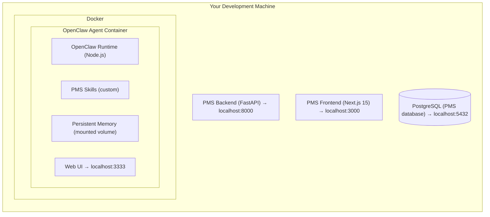

# OpenClaw Self-Hosted Setup Guide for PMS Integration

**Document ID:** PMS-EXP-OPENCLAW-001
**Version:** 1.0
**Date:** February 16, 2026
**Applies To:** PMS project (all platforms)
**Prerequisites Level:** Intermediate (Docker, FastAPI, and Next.js familiarity assumed)

---

## Table of Contents

1. [Overview](#1-overview)
2. [Prerequisites](#2-prerequisites)
3. [Part A: Install and Configure OpenClaw](#3-part-a-install-and-configure-openclaw)
4. [Part B: Harden for HIPAA Compliance](#4-part-b-harden-for-hipaa-compliance)
5. [Part C: Create PMS Skills](#5-part-c-create-pms-skills)
6. [Part D: Integrate with PMS Web Frontend](#6-part-d-integrate-with-pms-web-frontend)
7. [Part E: Configure Scheduled Workflows](#7-part-e-configure-scheduled-workflows)
8. [Part F: Testing and Verification](#8-part-f-testing-and-verification)
9. [Troubleshooting](#9-troubleshooting)
10. [Reference Commands](#10-reference-commands)

---

## 1. Overview

This guide walks you through deploying a **HIPAA-hardened, self-hosted OpenClaw agent** on your local development machine and integrating it with the MPS PMS. By the end, you will have:

- OpenClaw running in a sandboxed Docker container
- Security hardening applied (network isolation, skill governance, audit logging)
- Custom PMS skills that call the FastAPI backend for patient, encounter, and medication data
- A web-based agent interface integrated into the PMS dashboard
- Scheduled workflows for automated follow-ups and reports

### Architecture at a Glance



---

## 2. Prerequisites

Verify each of these before proceeding.

### 2.1 Required Software

| Software | Minimum Version | Check Command |
|----------|----------------|---------------|
| Docker | 24.x | `docker --version` |
| Docker Compose | 2.x | `docker compose version` |
| Node.js | 22.x | `node --version` |
| npm | 11.x | `npm --version` |
| Git | 2.x | `git --version` |
| Python | 3.12+ | `python3 --version` |
| curl | any | `curl --version` |

### 2.2 Install Docker (if needed)

```bash
# macOS
brew install --cask docker
# Then open Docker Desktop from Applications

# Verify
docker --version
docker compose version
```

### 2.3 API Key Required

You need an **Anthropic API key** for the LLM provider:

1. Go to https://console.anthropic.com
2. Create an API key
3. Save it securely — you will add it to the OpenClaw configuration in Part A

### 2.4 Verify PMS Backend is Running

```bash
# Start the PMS backend if not running
cd ~/Projects/utexas/pms-backend
source .venv/bin/activate
uvicorn app.main:app --reload --port 8000

# Verify
curl http://localhost:8000/docs
# Should show the FastAPI Swagger UI
```

---

## 3. Part A: Install and Configure OpenClaw

### Step 1: Install OpenClaw

```bash
# Option A: Official installer (recommended)
curl -fsSL https://openclaw.ai/install.sh | bash

# Option B: npm global install
npm install -g openclaw

# Verify installation
openclaw --version
# Should show v1.x.x
```

### Step 2: Create the PMS Agent Project

```bash
mkdir -p ~/Projects/utexas/pms-openclaw
cd ~/Projects/utexas/pms-openclaw

# Initialize OpenClaw project
openclaw init --name "PMS Agent" --mode docker
```

This creates:
```
pms-openclaw/
├── docker-compose.yml       # Container configuration
├── Dockerfile               # Agent container build
├── config/
│   ├── openclaw.yaml        # Main configuration
│   ├── skills.yaml          # Skill registry
│   └── memory/              # Persistent memory (Markdown files)
├── skills/                  # Custom skill modules
│   └── README.md
├── .env.example             # Environment template
└── .gitignore
```

### Step 3: Configure Environment Variables

```bash
cp .env.example .env
```

Edit `.env`:

```env
# LLM Provider
ANTHROPIC_API_KEY=sk-ant-your-key-here
OPENCLAW_MODEL=claude-sonnet-4-5-20250929

# Agent Configuration
OPENCLAW_MODE=sandboxed
OPENCLAW_PORT=3333
OPENCLAW_LOG_LEVEL=info

# PMS Backend Connection
PMS_API_URL=http://host.docker.internal:8000
PMS_API_TOKEN=your-dev-jwt-token-here

# Security
OPENCLAW_DISABLE_CLAWHUB=true
OPENCLAW_REQUIRE_APPROVAL=true
OPENCLAW_AUDIT_LOG=true
OPENCLAW_AUDIT_LOG_PATH=/data/audit/agent.log

# Memory
OPENCLAW_MEMORY_PATH=/data/memory
```

> **Note:** `host.docker.internal` allows the Docker container to reach services on your host machine. On Linux, use `--network host` or the host IP instead.

### Step 4: Configure OpenClaw

Edit `config/openclaw.yaml`:

```yaml
agent:
  name: "PMS Agent"
  description: >
    Healthcare practice management assistant for MPS Inc..
    Helps with patient lookups, encounter management, care coordination,
    and clinical document drafting. All actions involving patient data
    require human approval.

  # Security settings
  sandbox: true
  require_approval_for:
    - file_write
    - network_request
    - shell_command
    - skill_install

  # Allowed network targets (whitelist)
  allowed_hosts:
    - "host.docker.internal:8000"   # PMS Backend
    - "api.anthropic.com"            # LLM provider

  # Blocked features
  disable:
    - clawhub_install       # No public skill marketplace
    - autonomous_write      # No unsupervised write operations
    - browser_automation    # Disabled until Phase 3

  # Memory configuration
  memory:
    enabled: true
    path: "/data/memory"
    max_entries: 1000

  # Audit logging
  audit:
    enabled: true
    log_path: "/data/audit/agent.log"
    log_fields:
      - timestamp
      - user_id
      - action
      - skill_name
      - patient_id
      - input_summary
      - output_summary
      - approval_status
```

### Step 5: Build and Start the Container

```bash
# Build the Docker image
docker compose build

# Start the agent
docker compose up -d

# Verify it's running
docker compose ps
# Should show the openclaw container as "running"

# Check the logs
docker compose logs -f openclaw
# Wait for "Agent ready on http://localhost:3333"
```

### Step 6: Verify the Agent

```bash
# Health check
curl http://localhost:3333/health
# Expected: {"status":"ok","version":"1.x.x"}

# Open the web UI
open http://localhost:3333
```

Type "hello" in the agent chat interface. If you get a response, the agent is working.

**Checkpoint:** OpenClaw running in Docker, responding to messages, with sandboxed execution enabled.

---

## 4. Part B: Harden for HIPAA Compliance

**This section is mandatory.** OpenClaw's default configuration is not HIPAA-compliant. Apply all hardening steps before connecting to PMS data.

### Step 1: Verify Sandboxed Execution

```bash
# Check that sandbox mode is active
docker compose exec openclaw openclaw config get agent.sandbox
# Expected: true

# Test that the agent cannot access the host filesystem
docker compose exec openclaw ls /host
# Expected: Permission denied or directory not found
```

### Step 2: Disable Public Skill Marketplace

```bash
# Verify ClawHub is disabled
docker compose exec openclaw openclaw config get agent.disable
# Should include "clawhub_install"

# Attempt to install a public skill (should fail)
docker compose exec openclaw openclaw skill install some-public-skill
# Expected: Error — ClawHub installation is disabled
```

### Step 3: Configure Network Isolation

Edit `docker-compose.yml` to restrict network access:

```yaml
services:
  openclaw:
    build: .
    ports:
      - "3333:3333"
    env_file: .env
    volumes:
      - ./config:/app/config
      - ./skills:/app/skills
      - openclaw-data:/data
    networks:
      - pms-internal
    # Security: drop all capabilities, read-only root filesystem
    security_opt:
      - no-new-privileges:true
    read_only: true
    tmpfs:
      - /tmp
    # Memory limit
    deploy:
      resources:
        limits:
          memory: 2G
          cpus: "2.0"

networks:
  pms-internal:
    driver: bridge
    internal: false   # Allow outbound for LLM API calls

volumes:
  openclaw-data:
```

Rebuild after changes:

```bash
docker compose down && docker compose up -d --build
```

### Step 4: Enable Audit Logging

Verify audit logs are being written:

```bash
# Check audit log location
docker compose exec openclaw ls -la /data/audit/

# View recent audit entries
docker compose exec openclaw tail -20 /data/audit/agent.log

# Example audit entry:
# {"timestamp":"2026-02-16T10:30:00Z","user_id":"dev-user","action":"skill_invoke",
#  "skill_name":"pms-patient-lookup","patient_id":"none","input_summary":"search: John Doe",
#  "output_summary":"2 results returned","approval_status":"auto_approved_read"}
```

### Step 5: Configure Approval Tiers

Create `config/approval-policy.yaml`:

```yaml
# Approval policy for PMS Agent
approval_tiers:
  # Read operations — auto-approved (no user prompt)
  read:
    skills:
      - pms-patient-lookup
      - pms-encounter-query
      - pms-medication-check
      - pms-report-generate
    approval: auto

  # Write-advisory — agent drafts, human reviews
  write_advisory:
    skills:
      - pms-document-draft
      - pms-prior-auth
      - pms-care-coordination
    approval: human_required
    display: "Review the draft before submission"

  # Write-autonomous — blocked for PHI operations
  write_autonomous:
    skills: []
    approval: blocked
    message: "Autonomous write operations are disabled for HIPAA compliance"
```

### Step 6: Security Verification Checklist

Run through this checklist before proceeding:

```bash
# ✓ Sandbox mode active
docker compose exec openclaw openclaw config get agent.sandbox

# ✓ ClawHub disabled
docker compose exec openclaw openclaw config get agent.disable

# ✓ Network restricted to allowed hosts only
docker compose exec openclaw openclaw config get agent.allowed_hosts

# ✓ Audit logging active
docker compose exec openclaw test -f /data/audit/agent.log && echo "OK"

# ✓ Approval required for write operations
docker compose exec openclaw openclaw config get agent.require_approval_for

# ✓ Memory limit set
docker stats --no-stream | grep openclaw
```

**Checkpoint:** Security hardening applied. Agent cannot access unauthorized systems, install public skills, or perform unsupervised write operations.

---

## 5. Part C: Create PMS Skills

Skills are JavaScript/TypeScript modules that OpenClaw invokes to interact with external systems.

### Step 1: Create the Skill Directory Structure

```bash
cd ~/Projects/utexas/pms-openclaw
mkdir -p skills/pms-patient-lookup
mkdir -p skills/pms-encounter-query
mkdir -p skills/pms-medication-check
```

### Step 2: Patient Lookup Skill

Create `skills/pms-patient-lookup/index.ts`:

```typescript
import { Skill, SkillInput, SkillOutput } from "@openclaw/sdk";

interface PatientLookupInput {
  query?: string;
  patient_id?: string;
}

interface Patient {
  id: string;
  first_name: string;
  last_name: string;
  date_of_birth: string;
  gender: string;
  email: string | null;
  phone: string | null;
  address: string | null;
}

const skill: Skill = {
  name: "pms-patient-lookup",
  description:
    "Search and retrieve patient records from the PMS. Supports search " +
    "by name, phone, email, or direct ID lookup. Returns patient demographics " +
    "and contact information. Use when the user asks to find a patient, look " +
    "up patient details, or check patient information.",

  inputSchema: {
    type: "object",
    properties: {
      query: {
        type: "string",
        description: "Free-text search — patient name, phone, or email",
      },
      patient_id: {
        type: "string",
        description: "Direct patient ID for exact lookup",
      },
    },
  },

  outputSchema: {
    type: "object",
    properties: {
      patients: {
        type: "array",
        items: {
          type: "object",
          properties: {
            id: { type: "string" },
            first_name: { type: "string" },
            last_name: { type: "string" },
            date_of_birth: { type: "string" },
            gender: { type: "string" },
            email: { type: "string" },
            phone: { type: "string" },
          },
        },
      },
      total: { type: "number" },
    },
  },

  async execute(input: SkillInput<PatientLookupInput>): Promise<SkillOutput> {
    const { query, patient_id } = input.params;
    const apiUrl = process.env.PMS_API_URL;
    const token = process.env.PMS_API_TOKEN;

    const headers: Record<string, string> = {
      "Content-Type": "application/json",
      Authorization: `Bearer ${token}`,
    };

    let url: string;
    if (patient_id) {
      url = `${apiUrl}/api/patients/${patient_id}`;
    } else {
      url = `${apiUrl}/api/patients?search=${encodeURIComponent(query || "")}`;
    }

    const response = await fetch(url, { headers });
    if (!response.ok) {
      throw new Error(`PMS API error: ${response.status} ${response.statusText}`);
    }

    const data = await response.json();

    // Single patient lookup returns object, search returns array
    if (patient_id) {
      return {
        patients: [data],
        total: 1,
      };
    }

    return {
      patients: Array.isArray(data) ? data : data.items || [],
      total: Array.isArray(data) ? data.length : data.total || 0,
    };
  },
};

export default skill;
```

### Step 3: Encounter Query Skill

Create `skills/pms-encounter-query/index.ts`:

```typescript
import { Skill, SkillInput, SkillOutput } from "@openclaw/sdk";

interface EncounterQueryInput {
  patient_id?: string;
  encounter_type?: string;
  status?: string;
  date_from?: string;
  date_to?: string;
}

const skill: Skill = {
  name: "pms-encounter-query",
  description:
    "Query encounter records from the PMS. Filter by patient, encounter " +
    "type (office_visit, telehealth, follow_up, emergency, procedure), " +
    "status (scheduled, in_progress, completed, cancelled), and date range. " +
    "Returns encounter details and summary statistics. Use when the user " +
    "asks about appointments, encounters, visit history, or schedules.",

  inputSchema: {
    type: "object",
    properties: {
      patient_id: {
        type: "string",
        description: "Filter by specific patient ID",
      },
      encounter_type: {
        type: "string",
        enum: ["office_visit", "telehealth", "follow_up", "emergency", "procedure"],
        description: "Filter by encounter type",
      },
      status: {
        type: "string",
        enum: ["scheduled", "in_progress", "completed", "cancelled"],
        description: "Filter by encounter status",
      },
      date_from: {
        type: "string",
        description: "Start date (YYYY-MM-DD)",
      },
      date_to: {
        type: "string",
        description: "End date (YYYY-MM-DD)",
      },
    },
  },

  async execute(input: SkillInput<EncounterQueryInput>): Promise<SkillOutput> {
    const { patient_id, encounter_type, status, date_from, date_to } = input.params;
    const apiUrl = process.env.PMS_API_URL;
    const token = process.env.PMS_API_TOKEN;

    const params = new URLSearchParams();
    if (patient_id) params.set("patient_id", patient_id);
    if (encounter_type) params.set("encounter_type", encounter_type);
    if (status) params.set("status", status);
    if (date_from) params.set("date_from", date_from);
    if (date_to) params.set("date_to", date_to);

    const response = await fetch(`${apiUrl}/api/encounters?${params}`, {
      headers: {
        "Content-Type": "application/json",
        Authorization: `Bearer ${token}`,
      },
    });

    if (!response.ok) {
      throw new Error(`PMS API error: ${response.status}`);
    }

    const data = await response.json();
    const encounters = Array.isArray(data) ? data : data.items || [];

    // Compute summary statistics
    const summary = {
      total: encounters.length,
      by_status: {
        scheduled: encounters.filter((e: any) => e.status === "scheduled").length,
        in_progress: encounters.filter((e: any) => e.status === "in_progress").length,
        completed: encounters.filter((e: any) => e.status === "completed").length,
        cancelled: encounters.filter((e: any) => e.status === "cancelled").length,
      },
      completion_rate:
        encounters.length > 0
          ? (encounters.filter((e: any) => e.status === "completed").length / encounters.length) * 100
          : 0,
    };

    return { encounters, summary };
  },
};

export default skill;
```

### Step 4: Medication Check Skill

Create `skills/pms-medication-check/index.ts`:

```typescript
import { Skill, SkillInput, SkillOutput } from "@openclaw/sdk";

interface MedicationCheckInput {
  patient_id: string;
}

const skill: Skill = {
  name: "pms-medication-check",
  description:
    "Retrieves active prescriptions for a patient and checks for drug " +
    "interactions. Returns medication list with dosage, frequency, refill " +
    "status, and any interaction warnings. Use when the user asks about a " +
    "patient's medications, drug interactions, or prescription status.",

  inputSchema: {
    type: "object",
    properties: {
      patient_id: {
        type: "string",
        description: "The patient ID to check medications for",
      },
    },
    required: ["patient_id"],
  },

  async execute(input: SkillInput<MedicationCheckInput>): Promise<SkillOutput> {
    const { patient_id } = input.params;
    const apiUrl = process.env.PMS_API_URL;
    const token = process.env.PMS_API_TOKEN;

    const headers = {
      "Content-Type": "application/json",
      Authorization: `Bearer ${token}`,
    };

    const response = await fetch(`${apiUrl}/api/patients/${patient_id}/prescriptions`, {
      headers,
    });

    if (!response.ok) {
      throw new Error(`PMS API error: ${response.status}`);
    }

    const prescriptions = await response.json();

    // Separate active from historical
    const active = prescriptions.filter((rx: any) => rx.status === "active");
    const historical = prescriptions.filter((rx: any) => rx.status !== "active");

    return {
      patient_id,
      active_prescriptions: active,
      historical_prescriptions: historical,
      total_active: active.length,
      refills_needed: active.filter((rx: any) => rx.refills_remaining === 0).length,
    };
  },
};

export default skill;
```

### Step 5: Register Skills

Edit `config/skills.yaml`:

```yaml
skills:
  - name: pms-patient-lookup
    path: /app/skills/pms-patient-lookup
    approval_tier: read
    enabled: true

  - name: pms-encounter-query
    path: /app/skills/pms-encounter-query
    approval_tier: read
    enabled: true

  - name: pms-medication-check
    path: /app/skills/pms-medication-check
    approval_tier: read
    enabled: true

  # Phase 2 skills (disabled until implementation)
  # - name: pms-prior-auth
  #   path: /app/skills/pms-prior-auth
  #   approval_tier: write_advisory
  #   enabled: false

  # - name: pms-document-draft
  #   path: /app/skills/pms-document-draft
  #   approval_tier: write_advisory
  #   enabled: false

  # - name: pms-care-coordination
  #   path: /app/skills/pms-care-coordination
  #   approval_tier: write_advisory
  #   enabled: false
```

### Step 6: Reload the Agent

```bash
docker compose restart openclaw

# Verify skills are loaded
curl http://localhost:3333/api/skills
# Should list pms-patient-lookup, pms-encounter-query, pms-medication-check
```

**Checkpoint:** Three PMS skills registered and callable from the agent.

---

## 6. Part D: Integrate with PMS Web Frontend

### Step 1: Add the Agent Sidebar Component

Create `src/components/openclaw/agent-sidebar.tsx` in the `pms-frontend` project:

```tsx
"use client";

import { useState, useRef, useEffect } from "react";
import { Send, Bot, User, Loader2 } from "lucide-react";
import { Button } from "@/components/ui/button";
import { Input } from "@/components/ui/input";

interface Message {
  id: string;
  role: "user" | "agent";
  content: string;
  timestamp: string;
  approval_needed?: boolean;
}

const OPENCLAW_URL = process.env.NEXT_PUBLIC_OPENCLAW_URL || "http://localhost:3333";

export default function AgentSidebar() {
  const [messages, setMessages] = useState<Message[]>([]);
  const [input, setInput] = useState("");
  const [loading, setLoading] = useState(false);
  const bottomRef = useRef<HTMLDivElement>(null);

  useEffect(() => {
    bottomRef.current?.scrollIntoView({ behavior: "smooth" });
  }, [messages]);

  const sendMessage = async () => {
    if (!input.trim() || loading) return;

    const userMsg: Message = {
      id: crypto.randomUUID(),
      role: "user",
      content: input.trim(),
      timestamp: new Date().toISOString(),
    };

    setMessages((prev) => [...prev, userMsg]);
    setInput("");
    setLoading(true);

    try {
      const res = await fetch(`${OPENCLAW_URL}/api/chat`, {
        method: "POST",
        headers: { "Content-Type": "application/json" },
        body: JSON.stringify({
          message: userMsg.content,
          thread_id: "pms-session",
        }),
      });

      const data = await res.json();

      const agentMsg: Message = {
        id: crypto.randomUUID(),
        role: "agent",
        content: data.response || data.message || "No response",
        timestamp: new Date().toISOString(),
        approval_needed: data.approval_needed,
      };

      setMessages((prev) => [...prev, agentMsg]);
    } catch {
      setMessages((prev) => [
        ...prev,
        {
          id: crypto.randomUUID(),
          role: "agent",
          content: "Connection error. Is the OpenClaw agent running?",
          timestamp: new Date().toISOString(),
        },
      ]);
    } finally {
      setLoading(false);
    }
  };

  return (
    <div className="w-96 h-full flex flex-col border-l border-gray-200 bg-gray-50">
      {/* Header */}
      <div className="p-4 border-b bg-white flex items-center gap-2">
        <Bot className="h-5 w-5 text-primary-600" />
        <div>
          <h2 className="text-sm font-semibold text-gray-700">PMS Agent</h2>
          <p className="text-xs text-gray-400">Powered by OpenClaw</p>
        </div>
      </div>

      {/* Messages */}
      <div className="flex-1 overflow-y-auto p-4 space-y-3">
        {messages.length === 0 && (
          <div className="text-center text-sm text-gray-400 mt-8">
            <p className="mb-2">Ask me about patients, encounters, or medications.</p>
            <p className="text-xs">Example: &ldquo;Look up patient John Doe&rdquo;</p>
          </div>
        )}

        {messages.map((msg) => (
          <div
            key={msg.id}
            className={`flex gap-2 ${msg.role === "user" ? "justify-end" : "justify-start"}`}
          >
            {msg.role === "agent" && (
              <Bot className="h-6 w-6 text-gray-400 mt-1 shrink-0" />
            )}
            <div
              className={`max-w-[80%] rounded-lg px-3 py-2 text-sm whitespace-pre-wrap ${
                msg.role === "user"
                  ? "bg-primary-600 text-white"
                  : "bg-white text-gray-700 shadow-sm border"
              }`}
            >
              {msg.content}
              {msg.approval_needed && (
                <div className="mt-2 flex gap-2">
                  <Button size="sm" variant="default" className="text-xs">
                    Approve
                  </Button>
                  <Button size="sm" variant="secondary" className="text-xs">
                    Reject
                  </Button>
                </div>
              )}
            </div>
            {msg.role === "user" && (
              <User className="h-6 w-6 text-gray-400 mt-1 shrink-0" />
            )}
          </div>
        ))}

        {loading && (
          <div className="flex gap-2">
            <Bot className="h-6 w-6 text-gray-400 mt-1" />
            <div className="bg-white rounded-lg px-3 py-2 shadow-sm border">
              <Loader2 className="h-4 w-4 animate-spin text-gray-400" />
            </div>
          </div>
        )}

        <div ref={bottomRef} />
      </div>

      {/* Input */}
      <div className="p-4 border-t bg-white">
        <div className="flex gap-2">
          <Input
            value={input}
            onChange={(e) => setInput(e.target.value)}
            onKeyDown={(e) => e.key === "Enter" && sendMessage()}
            placeholder="Ask the PMS Agent..."
            disabled={loading}
          />
          <Button
            onClick={sendMessage}
            disabled={loading || !input.trim()}
            size="icon"
          >
            <Send className="h-4 w-4" />
          </Button>
        </div>
      </div>
    </div>
  );
}
```

### Step 2: Add Environment Variable

Add to `pms-frontend/.env.local`:

```env
NEXT_PUBLIC_OPENCLAW_URL=http://localhost:3333
```

### Step 3: Add Sidebar to Dashboard Layout

In your PMS layout or dashboard page, add the sidebar:

```tsx
import AgentSidebar from "@/components/openclaw/agent-sidebar";

// In the layout JSX:
<div className="flex h-screen">
  <Sidebar />
  <div className="flex flex-1 flex-col overflow-hidden">
    <Header />
    <main className="flex-1 overflow-y-auto p-6">
      {/* Page content */}
    </main>
  </div>
  <AgentSidebar />
</div>
```

**Checkpoint:** Agent sidebar visible in PMS dashboard, communicating with OpenClaw backend.

---

## 7. Part E: Configure Scheduled Workflows

### Step 1: Create Workflow Configuration

Create `config/workflows.yaml`:

```yaml
workflows:
  - name: morning-followup-list
    description: "Generate list of patients needing follow-up"
    schedule: "0 7 * * 1-5"   # 7 AM Monday-Friday
    skills:
      - pms-encounter-query
      - pms-patient-lookup
    prompt: >
      Query all encounters from the past 7 days with status 'scheduled'
      that were not completed (no-shows). For each patient, look up their
      contact information. Generate a prioritized follow-up list.
    output: "/data/reports/followup-{date}.md"
    approval: human_required

  - name: weekly-metrics-digest
    description: "Generate practice performance summary"
    schedule: "0 6 * * 1"      # 6 AM Monday
    skills:
      - pms-encounter-query
      - pms-patient-lookup
    prompt: >
      Generate a weekly performance summary including: total encounters
      by type and status, completion rates, new patient count, and
      any notable trends compared to the previous week.
    output: "/data/reports/weekly-{date}.md"
    approval: auto
```

### Step 2: Restart to Enable Workflows

```bash
docker compose restart openclaw

# Verify workflows are registered
curl http://localhost:3333/api/workflows
# Should list morning-followup-list and weekly-metrics-digest
```

---

## 8. Part F: Testing and Verification

### Step 1: Service Health Check

```bash
# 1. OpenClaw Agent
curl http://localhost:3333/health
# ✓ {"status":"ok"}

# 2. PMS Backend
curl http://localhost:8000/docs
# ✓ Swagger UI loads

# 3. PMS Frontend
curl -s -o /dev/null -w "%{http_code}" http://localhost:3000
# ✓ 200
```

### Step 2: Test Skills via Chat

Open the PMS dashboard and use the agent sidebar:

| Query | Expected Skill | Expected Output |
|-------|---------------|-----------------|
| "Find patient John Doe" | pms-patient-lookup | Patient record with demographics |
| "Show encounters for patient 1" | pms-encounter-query | Encounter list with summary stats |
| "What medications is patient 1 on?" | pms-medication-check | Active prescriptions list |
| "How many encounters were completed this week?" | pms-encounter-query | Count with completion rate |

### Step 3: Verify Audit Logs

After running test queries:

```bash
docker compose exec openclaw cat /data/audit/agent.log | tail -10
```

Each entry should contain: timestamp, skill_name, input_summary, and approval_status.

### Step 4: Verify Security Controls

```bash
# Attempt to access a blocked host (should fail)
docker compose exec openclaw curl https://example.com
# Expected: blocked by network policy

# Verify skill governance
docker compose exec openclaw openclaw skill list
# Should show only the 3 registered PMS skills, no public skills
```

---

## 9. Troubleshooting

### "Connection refused" on port 3333

- Verify the container is running: `docker compose ps`
- Check logs: `docker compose logs openclaw`
- Verify port mapping: `docker port pms-openclaw-openclaw-1`

### "PMS API error: 401"

- Check that `PMS_API_TOKEN` in `.env` is a valid JWT
- Generate a fresh token from the PMS login endpoint
- Verify the token hasn't expired

### Agent doesn't invoke skills

- Check skill registration: `curl http://localhost:3333/api/skills`
- Verify skill descriptions are specific enough for the agent to match
- Check agent logs for reasoning: `docker compose logs -f openclaw`

### "Approval required" for read operations

- Check `config/approval-policy.yaml` — ensure read skills have `approval: auto`
- Restart after changes: `docker compose restart openclaw`

### Docker memory issues

- Check memory usage: `docker stats --no-stream`
- Increase limit in `docker-compose.yml` if needed
- Clear old memory files: `docker compose exec openclaw rm /data/memory/*.old`

### Port conflicts

| Service | Default Port | Alternative |
|---------|-------------|-------------|
| OpenClaw Web UI | 3333 | Change `OPENCLAW_PORT` in `.env` |
| PMS Backend | 8000 | Change `PMS_API_URL` in `.env` |
| PMS Frontend | 3000 | Change in `next.config.ts` |

---

## 10. Reference Commands

### Daily Development Workflow

```bash
# Start everything
cd ~/Projects/utexas/pms-openclaw && docker compose up -d     # OpenClaw
cd ~/Projects/utexas/pms-backend && uvicorn app.main:app --reload  # Backend
cd ~/Projects/utexas/pms-frontend && npm run dev               # Frontend

# Stop everything
docker compose down                # OpenClaw
# Ctrl+C on backend and frontend
```

### Agent Management

```bash
docker compose logs -f openclaw          # Stream agent logs
docker compose exec openclaw openclaw skill list  # List skills
docker compose exec openclaw openclaw config get agent  # View config
docker compose restart openclaw          # Restart after config changes
```

### Audit and Monitoring

```bash
# View audit log
docker compose exec openclaw tail -50 /data/audit/agent.log

# View agent memory
docker compose exec openclaw ls /data/memory/

# Check resource usage
docker stats --no-stream | grep openclaw
```

### Useful URLs

| URL | Description |
|-----|-------------|
| `http://localhost:3333` | OpenClaw Web UI (agent chat) |
| `http://localhost:3333/api/skills` | Registered skills list |
| `http://localhost:3333/api/workflows` | Scheduled workflows |
| `http://localhost:3333/health` | Health check endpoint |
| `http://localhost:3000` | PMS Frontend |
| `http://localhost:8000/docs` | PMS Backend Swagger UI |

---

## Next Steps

Once the setup is verified:

1. **Test with seed data:** Use the PMS seed data to verify skill outputs
2. **Add Phase 2 skills:** `pms-prior-auth`, `pms-document-draft`, `pms-care-coordination`
3. **Enable scheduled workflows:** Activate morning follow-up and weekly digest
4. **Production hardening:** Move to production Docker deployment with TLS, secrets management, and monitoring
5. **Read the Developer Tutorial** ([05-OpenClaw-Developer-Tutorial.md](05-OpenClaw-Developer-Tutorial.md)) for hands-on skill development

Refer to the full PRD (PRD-PMS-OPENCLAW-001) for Phase 2 and Phase 3 requirements.

---

## Resources

- OpenClaw Documentation: https://docs.openclaw.ai
- OpenClaw GitHub: https://github.com/openclaw/openclaw
- OpenClaw Security Hardening Guide: https://docs.openclaw.ai/security
- HIPAA Technical Safeguards: https://www.hhs.gov/hipaa/for-professionals/security
- PMS Backend API Docs: http://localhost:8000/docs
