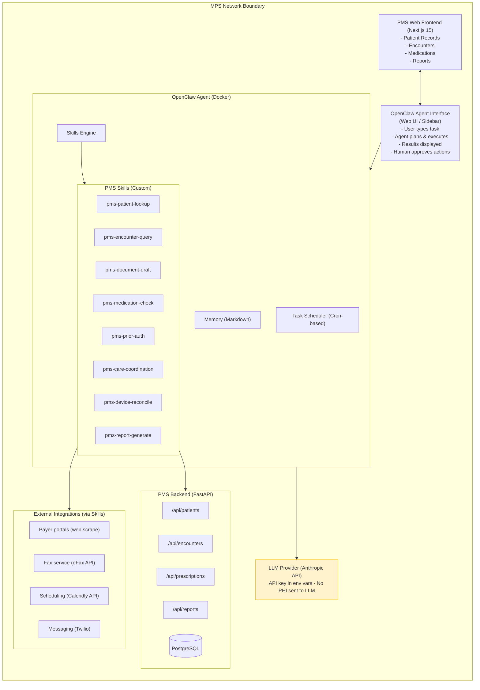

# Product Requirements Document: OpenClaw Integration into Practice Management System (PMS)

**Document ID:** PRD-PMS-OPENCLAW-001
**Version:** 1.0
**Date:** February 16, 2026
**Author:** Ammar (CEO, MPS Inc.)
**Status:** Draft

---

## 1. Executive Summary

This PRD defines the integration of OpenClaw — an open-source agentic AI gateway — into the MPS Inc. Practice Management System (PMS). The goal is to deploy a locally-hosted autonomous agent that automates repetitive clinical and administrative workflows: prior authorization processing, care coordination follow-ups, clinical documentation drafting, and cross-system data reconciliation.

OpenClaw will be **self-hosted on MPS infrastructure** inside Docker with a hardened security envelope to maintain HIPAA compliance. No PHI will leave our network boundary. All agent actions that modify data will require human-in-the-loop approval.

---

## 2. Problem Statement

The current PMS workflow has several operational bottlenecks:

- **Manual prior authorization:** Staff spend 15-30 minutes per authorization request gathering clinical data, checking payer policies, and drafting letters. With 200+ requests per week across practices, this is a major time sink.
- **Fragmented care coordination:** Health coaches manage follow-ups across multiple systems (EHR, scheduling, messaging). Tasks fall through the cracks when handoffs are manual.
- **Repetitive documentation:** Clinical notes, encounter summaries, and status update emails follow predictable templates but are still drafted manually for each patient.
- **Cross-system reconciliation:** Device readings (RPM), engagement scores, and encounter records live in separate data warehouse collections. Correlating data across systems for a single patient requires manual queries.

---

## 3. Proposed Solution

Deploy OpenClaw as a **task automation agent** accessible to PMS users via a web-based chat interface and scheduled background workflows. OpenClaw's skills architecture connects to our existing FastAPI backend, data warehouse, and third-party integrations (fax, payer portals) to execute multi-step workflows autonomously.

### 3.1 Architecture Overview



### 3.2 Deployment Model

- **Self-hosted OpenClaw** running in Docker on MPS infrastructure with sandboxed execution
- **LLM provider:** Anthropic Claude API (API key in environment variables; agent queries contain task descriptions and schema metadata only — no raw PHI)
- **Skills:** Custom PMS skills call the FastAPI backend internally via authenticated API; all PHI stays within the network boundary
- **Human-in-the-loop:** All write operations (creating records, sending messages, submitting authorizations) require explicit user approval before execution

---

## 4. PMS Data Sources

OpenClaw skills will access the following existing PMS backend resources:

### 4.1 Patient Records API
- Patient demographics, contact info, enrollment status
- CRUD operations via `/api/patients`
- Search and pagination support

### 4.2 Encounter Records API
- Encounter lifecycle: scheduled, in_progress, completed, cancelled
- Type classification: office_visit, telehealth, follow_up, emergency, procedure
- Clinical notes and reason fields
- CRUD via `/api/encounters`

### 4.3 Medication & Prescription API
- Active prescriptions, dosage, frequency, refill tracking
- Drug interaction checking
- Prescription lifecycle management via `/api/prescriptions`

### 4.4 Reporting API
- Patient volume metrics
- Encounter summary statistics
- Medication usage reports
- Audit log queries

### 4.5 Data Warehouse Collections (Future)
- DW_PatientStatus — enrollment lifecycle tracking
- DW_Events — time-series encounter and appointment events
- DW_Engagement — patient engagement scores over time
- DW_Devices — RPM device assignment and compliance

---

## 5. OpenClaw Skill Definitions

Each skill is a self-contained module that OpenClaw can invoke to interact with PMS systems.

### 5.1 pms-patient-lookup

**Description:** Search and retrieve patient records by name, ID, DOB, or phone number.

**Input:**
```yaml
query: string          # Free-text search (name, phone, email)
patient_id: string?    # Direct ID lookup
```

**Output:** Patient record(s) with demographics, contact info, and enrollment status.

**API Endpoint:** `GET /api/patients` with query parameters

### 5.2 pms-encounter-query

**Description:** Query encounters by patient, date range, type, or status. Returns encounter details with clinical notes.

**Input:**
```yaml
patient_id: string?
encounter_type: string?   # office_visit, telehealth, follow_up, emergency, procedure
status: string?            # scheduled, in_progress, completed, cancelled
date_from: string?         # ISO date
date_to: string?           # ISO date
```

**Output:** Encounter list with summary statistics (total, by status, completion rate).

**API Endpoint:** `GET /api/encounters` with query parameters

### 5.3 pms-prior-auth

**Description:** Automates prior authorization workflow — gathers clinical data, checks payer requirements, and drafts the authorization request for human review.

**Workflow:**
1. Look up patient record and active diagnoses
2. Query recent encounters and clinical notes
3. Check payer-specific requirements (via payer policy skill)
4. Draft authorization letter with clinical justification
5. Present draft to user for review and approval
6. On approval, submit via fax/portal integration

**Human Approval Required:** Yes — draft must be reviewed before submission

### 5.4 pms-care-coordination

**Description:** Manages care coordination tasks — identifies patients needing follow-up, generates outreach lists, and drafts communications.

**Workflow:**
1. Query patients with overdue encounters or missed appointments
2. Check engagement scores and device compliance
3. Prioritize by clinical urgency
4. Draft follow-up messages (SMS/email templates)
5. Present action plan to health coach for approval
6. On approval, send via Twilio/email integration

**Human Approval Required:** Yes — outreach plan must be reviewed

### 5.5 pms-document-draft

**Description:** Drafts clinical documents from structured data — encounter summaries, referral letters, patient status updates.

**Input:**
```yaml
document_type: string     # encounter_summary, referral_letter, status_update
patient_id: string
encounter_id: string?
recipient: string?        # For referral letters
```

**Output:** Formatted document draft for human review.

**Human Approval Required:** Yes — all clinical documents require clinician review

### 5.6 pms-medication-check

**Description:** Checks drug interactions, validates prescription parameters, and flags potential issues.

**Input:**
```yaml
patient_id: string
medication_id: string?    # Check specific medication
```

**Output:** Interaction warnings, contraindication flags, and dosage validation results.

**API Endpoint:** `GET /api/patients/{id}/prescriptions` + interaction checking logic

### 5.7 pms-device-reconcile

**Description:** Reconciles RPM device readings with encounter records. Identifies devices not reporting, patients with gaps in readings, and compliance anomalies.

**Input:**
```yaml
patient_id: string?       # Specific patient or all
date_range: number?       # Days to look back (default: 7)
```

**Output:** Reconciliation report with actionable items.

### 5.8 pms-report-generate

**Description:** Generates summary reports from PMS data — patient volume, encounter metrics, medication usage. Outputs formatted tables or CSV.

**Input:**
```yaml
report_type: string       # patient_volume, encounter_summary, medication_usage
date_from: string
date_to: string
format: string?           # table, csv (default: table)
```

**Output:** Formatted report data.

**API Endpoints:** `GET /api/reports/*`

---

## 6. Scheduled Workflows

Beyond interactive chat, OpenClaw will run scheduled background tasks:

| Workflow | Schedule | Description |
|----------|----------|-------------|
| Morning follow-up list | Daily 7:00 AM | Identify patients needing follow-up, draft outreach plan |
| Prior auth queue check | Every 2 hours | Check pending authorizations, flag items needing attention |
| Device compliance scan | Daily 8:00 PM | Identify devices not reporting in 24+ hours |
| Weekly metrics digest | Monday 6:00 AM | Generate practice performance summary for account managers |

All scheduled workflows produce reports that require human review before any outbound actions.

---

## 7. User Roles and Access

| Role | Skill Access | Approval Authority |
|------|-------------|-------------------|
| **Practice Administrator** | All skills, own practice data | Approve outreach, view reports |
| **Health Coach** | Patient lookup, encounters, care coordination | Approve patient communications |
| **Prior Auth Specialist** | Patient lookup, prior auth, document draft | Approve authorization submissions |
| **Account Manager** | Reports, device reconciliation | View-only, no write actions |
| **MPS Admin** | All skills, all practices | Full approval authority |

Access control is enforced at the FastAPI layer via JWT-based RBAC. OpenClaw passes the user's authentication token with every skill invocation.

---

## 8. Non-Functional Requirements

### 8.1 Security and HIPAA Compliance

**Critical:** OpenClaw's default configuration is NOT HIPAA-compliant. The following hardening measures are mandatory:

- **Network isolation:** OpenClaw Docker container runs inside MPS's private network; no inbound ports exposed to the internet
- **Authentication:** OpenClaw web UI protected by MPS's existing SSO/JWT authentication; no anonymous access
- **PHI isolation:** Agent queries to the LLM contain only task descriptions and field schemas — never raw patient data. All PHI stays within PMS API calls inside the network
- **Sandboxed execution:** Docker container runs with minimal privileges; filesystem access restricted to designated working directory
- **Skill governance:** Only vetted, internally-developed skills are installed. ClawHub (public skill marketplace) is disabled. No autonomous skill installation
- **Audit logging:** Every agent action (skill invocation, data access, document generation) logged with timestamp, user ID, patient ID, and action type
- **Human-in-the-loop:** All write operations require explicit user approval. Agent cannot autonomously modify patient records, send communications, or submit authorizations
- **Access tiering:** Three privilege levels — read-only (query data), write-advisory (draft documents for review), write-autonomous (disabled for PHI-related operations)

### 8.2 Performance

- Agent response time < 5 seconds for simple queries (patient lookup, encounter search)
- Complex workflows (prior auth drafting) < 30 seconds
- Scheduled workflows complete within 10 minutes
- Concurrent user support: 10 simultaneous agent sessions

### 8.3 Infrastructure

- Docker-based deployment with `docker-compose.yml`
- Node.js runtime within container
- Persistent memory stored in mounted volume (Markdown files)
- Anthropic Claude API key in environment variables
- Compatible with existing MPS CI/CD pipeline

---

## 9. Implementation Phases

### Phase 1: Foundation (Sprint 1-2)
- Deploy OpenClaw in Docker on development environment with hardened configuration
- Implement 3 core skills: `pms-patient-lookup`, `pms-encounter-query`, `pms-medication-check`
- Web UI integration as sidebar in PMS dashboard
- JWT passthrough authentication
- Audit logging for all skill invocations

### Phase 2: Workflow Automation (Sprint 3-4)
- Implement `pms-prior-auth` and `pms-document-draft` skills
- Add `pms-care-coordination` skill
- Human-in-the-loop approval flow (draft → review → approve → execute)
- Scheduled workflow engine (morning follow-ups, device compliance)

### Phase 3: Advanced Integration (Sprint 5-6)
- Implement `pms-device-reconcile` and `pms-report-generate` skills
- External integrations (fax, payer portals, Twilio)
- Agent memory for per-user preferences and workflow history
- Production deployment with monitoring and alerting

---

## 10. Success Metrics

| Metric | Target | Measurement |
|--------|--------|-------------|
| Prior auth processing time | 50% reduction (15 min → 7 min) | Average time from request to submission |
| Follow-up completion rate | 30% improvement | Percentage of overdue follow-ups resolved within 48 hours |
| Clinical document drafting | 60% reduction in manual effort | Time spent on encounter summaries and referral letters |
| Agent accuracy | > 90% of drafted documents accepted without major edits | Approval rate tracking |
| User adoption | 50% of eligible staff within 3 months | Active user tracking |

---

## 11. Risks and Mitigations

| Risk | Impact | Mitigation |
|------|--------|------------|
| LLM hallucination in clinical documents | Critical | Human-in-the-loop review mandatory for all clinical content; agent marks confidence level on each draft |
| Security vulnerability in OpenClaw (3 CVEs in first 90 days) | Critical | Pinned version with security patches; network isolation; disable ClawHub; regular security audits |
| PHI leakage to LLM provider | Critical | Architectural enforcement: skills return data to agent locally, agent generates summaries without raw PHI in LLM prompts |
| Shadow IT — staff running personal OpenClaw instances | High | IT policy prohibiting unauthorized installations; provide official sanctioned instance with proper controls |
| Agent takes unauthorized action | High | Write-autonomous mode disabled for PHI operations; all modifications require human approval |
| Increased API load from agent workflows | Medium | Rate limiting on skills; caching for frequently accessed data; separate API rate tier for agent |

---

## 12. Dependencies

- OpenClaw (open-source, MIT licensed) — agentic AI gateway
- Docker and Docker Compose — containerized deployment
- Anthropic Claude API key — LLM provider for agent reasoning
- Existing PMS FastAPI backend — data source and write operations
- Existing PMS Web Frontend (Next.js 15) — UI integration point
- Twilio API — SMS/messaging integration (Phase 2)
- eFax API — fax integration for prior authorizations (Phase 2)

---

## 13. Comparison with Tambo AI Integration

| Aspect | Tambo (PRD-PMS-TAMBO-001) | OpenClaw (this PRD) |
|--------|---------------------------|---------------------|
| **Primary use case** | Conversational analytics — query data, render charts | Workflow automation — execute multi-step tasks |
| **Output** | React components (charts, tables, dashboards) | Actions (documents, messages, submissions) |
| **User interaction** | Ask questions, get visual answers | Assign tasks, review and approve results |
| **Data flow** | Read-only queries to Spring Boot APIs | Read and write through FastAPI with approval |
| **Architecture** | SDK embedded in React app | Standalone agent in Docker container |
| **Complementary?** | Yes — Tambo for analytics, OpenClaw for automation | Yes — OpenClaw for workflows, Tambo for insights |

---

## 14. Research Sources

### Official Documentation

- [OpenClaw GitHub Repository](https://github.com/openclaw/openclaw) — Source code, skills architecture, and deployment guides
- [OpenClaw Official Site](https://openclaw.ai/) — Product overview and feature summary
- [OpenClaw Security Docs](https://docs.openclaw.ai/gateway/security) — Gateway security model and sandboxing

### Architecture & Deployment

- [What Is OpenClaw? (DigitalOcean)](https://www.digitalocean.com/resources/articles/what-is-openclaw) — Self-hosted AI agent architecture overview
- [How to Deploy OpenClaw (Vultr)](https://docs.vultr.com/how-to-deploy-openclaw-autonomous-ai-agent-platform) — Docker deployment walkthrough and configuration
- [OpenClaw Complete Guide (Milvus Blog)](https://milvus.io/blog/openclaw-formerly-clawdbot-moltbot-explained-a-complete-guide-to-the-autonomous-ai-agent.md) — History, architecture, and skill system deep-dive

### Security & Healthcare

- [What Security Teams Need to Know (CrowdStrike)](https://www.crowdstrike.com/en-us/blog/what-security-teams-need-to-know-about-openclaw-ai-super-agent/) — Security risk analysis and mitigation strategies
- [OpenClaw in the Clinic (OnHealthcare)](https://www.onhealthcare.tech/p/openclaw-in-the-clinic-a-business) — HIPAA-compliant deployment plan for healthcare
- [Autonomous AI Agents and Identity Security (CyberArk)](https://www.cyberark.com/resources/agentic-ai-security/how-autonomous-ai-agents-like-openclaw-are-reshaping-enterprise-identity-security) — Enterprise identity and access control considerations

---

## 15. Appendix: Related Documents

- [Tambo AI PRD](05-PRD-Tambo-PMS-Integration.md) — Complementary conversational analytics integration
- [OpenClaw Setup Guide](05-OpenClaw-PMS-Developer-Setup-Guide.md) — Step-by-step installation and configuration
- [OpenClaw Developer Tutorial](05-OpenClaw-Developer-Tutorial.md) — Hands-on onboarding for new team members
- OpenClaw Documentation: https://docs.openclaw.ai
- OpenClaw GitHub Repository: https://github.com/openclaw/openclaw
- HIPAA Security Rule Reference: https://www.hhs.gov/hipaa/for-professionals/security
