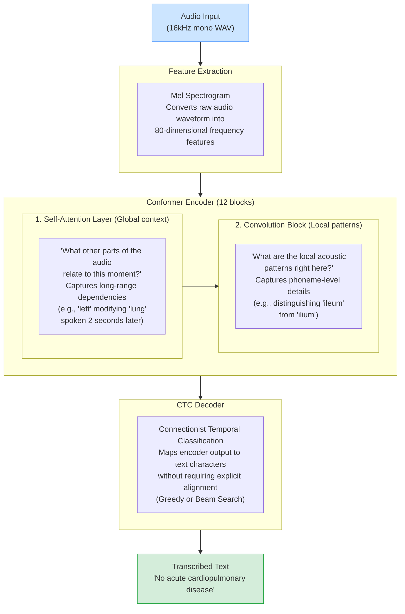
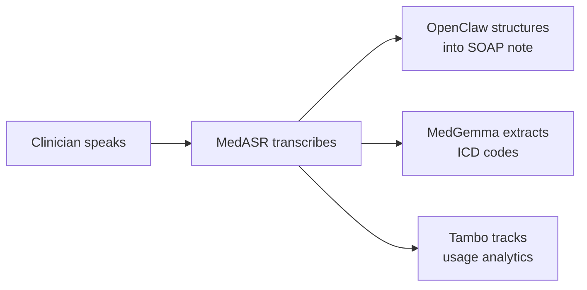
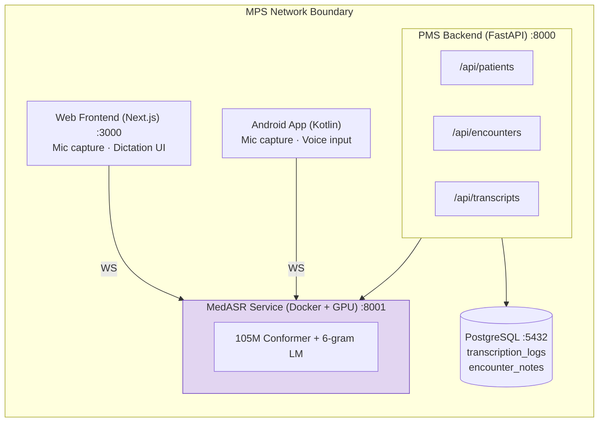

# MedASR Developer Onboarding Tutorial

**Welcome to the MPS PMS MedASR Integration Team**

This tutorial will take you from zero to building your first MedASR integration with the PMS. By the end, you will understand how medical speech recognition works, have a running local environment, and have built and tested a custom dictation integration end-to-end.

**Document ID:** PMS-EXP-MEDASR-002
**Version:** 1.0
**Date:** February 19, 2026
**Applies To:** PMS project (all platforms)
**Prerequisite:** [MedASR Setup Guide](07-MedASR-PMS-Developer-Setup-Guide.md)
**Estimated time:** 2-3 hours
**Difficulty:** Beginner-friendly

---

## What You Will Learn

1. What MedASR is and why medical-specific ASR matters for clinical documentation
2. How the Conformer architecture captures both local acoustic patterns and long-range dependencies
3. How MedASR fits into the PMS stack alongside OpenClaw and Tambo
4. How to verify your local MedASR environment is working correctly
5. How to build a batch transcription endpoint that processes clinical audio files
6. How to build a real-time streaming dictation feature using WebSockets
7. How to extract structured clinical data (SOAP notes, medications) from transcriptions
8. How to evaluate transcription accuracy and identify improvement opportunities
9. How to fine-tune MedASR for your clinic's specific vocabulary
10. How to write tests and follow PMS conventions for MedASR code

---

## Part 1: Understanding MedASR (15 min read)

### 1.1 What Problem Does MedASR Solve?

Every day, clinicians in the PMS spend hours typing encounter notes, medication changes, and clinical observations. A typical provider documents 30+ encounters per day, each requiring 15-30 minutes of keyboard entry. This adds up to **7-15 hours per week** of documentation time — time taken away from patient care.

General-purpose speech recognition (Siri, Google Speech, Whisper) doesn't solve this because medical language is fundamentally different from everyday speech:

| Scenario | General ASR Output | MedASR Output |
|---|---|---|
| Medication dictation | "The patient takes listening pill 10 milligrams" | "The patient takes Lisinopril 10 milligrams" |
| Anatomy reference | "There is a lesion in the ilium" | "There is a lesion in the ileum" |
| Radiology finding | "No acute car do pull monetary disease" | "No acute cardiopulmonary disease" |
| Lab result | "H B A one C is 7.2" | "HbA1c is 7.2" |

These errors aren't just annoying — in healthcare, a misrecognized medication name or anatomical site can lead to **clinical safety events**. MedASR eliminates this class of errors by training specifically on 5,000+ hours of physician dictations across multiple medical specialties.

### 1.2 How MedASR Works — The Key Pieces

MedASR uses the **Conformer architecture**, which combines two powerful techniques:



**Key insight:** The Conformer's combination of self-attention (global) and convolution (local) is what makes it superior to pure attention models (Whisper) or pure convolution models for speech. It can simultaneously:
- Recognize that "pulmonary" is a medical term based on local acoustic patterns
- Understand that "cardio" + "pulmonary" form a compound medical term based on global context

### 1.3 How MedASR Fits with Other PMS Technologies

| Technology | Experiment | Role | Relationship to MedASR |
|---|---|---|---|
| **MedASR** | 07 | Speech → Text | **This technology** — converts clinician voice to text |
| **OpenClaw** | 05 | Agentic Automation | Consumes MedASR output: auto-generates SOAP notes, prior auth letters from dictation |
| **Tambo** | 00 | Conversational Analytics | Analyzes MedASR usage: dictation patterns, provider productivity, accuracy trends |
| **MedGemma** | — | Medical LLM | Post-processes MedASR transcriptions: structured extraction, summarization, ICD coding |

**Data flow example:**



### 1.4 Key Vocabulary

| Term | Meaning |
|---|---|
| **ASR** | Automatic Speech Recognition — converting speech audio to text |
| **WER** | Word Error Rate — percentage of words incorrectly transcribed (lower is better) |
| **Conformer** | Architecture combining Convolution + Transformer for speech processing |
| **CTC** | Connectionist Temporal Classification — decoding method that doesn't require pre-aligned audio-text pairs |
| **Greedy decoding** | Simplest decoding: pick the highest-probability character at each timestep |
| **Beam search** | Advanced decoding: explore multiple candidate sequences and pick the best one |
| **Language model (LM)** | Statistical model of word sequences that improves decoding (e.g., 6-gram LM) |
| **Fine-tuning** | Adapting a pre-trained model to new data (e.g., your clinic's specific vocabulary) |
| **PHI** | Protected Health Information — any individually identifiable health data covered by HIPAA |
| **SOAP note** | Structured clinical note format: Subjective, Objective, Assessment, Plan |
| **Mel spectrogram** | Visual representation of audio frequencies over time, used as model input |
| **Sample rate** | Number of audio samples per second (MedASR requires 16,000 Hz) |

### 1.5 Our Architecture



---

## Part 2: Environment Verification (15 min)

### 2.1 Checklist

Ensure you've completed the [MedASR Setup Guide](07-MedASR-PMS-Developer-Setup-Guide.md) before continuing.

1. **MedASR container is running:**
   ```bash
   docker ps | grep pms-medasr
   # Expected: pms-medasr container with status "Up"
   ```

2. **MedASR health check passes:**
   ```bash
   curl http://localhost:8001/health
   # Expected: {"status":"healthy","model_loaded":true,"device":"cuda","gpu_available":true}
   ```

3. **PMS backend is running:**
   ```bash
   curl -s http://localhost:8000/docs | head -1
   # Expected: HTML content
   ```

4. **PMS frontend is running:**
   ```bash
   curl -s http://localhost:3000 | head -1
   # Expected: HTML content
   ```

5. **PostgreSQL is accessible:**
   ```bash
   psql -h localhost -p 5432 -U pms_user -d pms_db -c "SELECT 1;"
   # Expected: 1
   ```

6. **GPU is available (optional but recommended):**
   ```bash
   nvidia-smi
   # Expected: GPU info table with available memory
   ```

### 2.2 Quick Test

Run a single transcription to confirm everything works:

```bash
# Download the MedASR test audio
curl -L -o /tmp/medasr_test.wav \
  https://huggingface.co/google/medasr/resolve/main/test_audio.wav

# Transcribe it
curl -X POST http://localhost:8001/transcribe \
  -F "audio=@/tmp/medasr_test.wav"
```

You should see a JSON response with transcribed medical text. If you see an error, revisit the [Troubleshooting section](07-MedASR-PMS-Developer-Setup-Guide.md#7-troubleshooting) in the setup guide.

---

## Part 3: Build Your First Integration (45 min)

### 3.1 What We Are Building

We'll build a **Clinical Dictation Notes API** — a complete endpoint that:

1. Accepts audio from a clinician
2. Transcribes it using MedASR
3. Extracts structured sections (chief complaint, findings, assessment, plan)
4. Attaches the result to a patient encounter
5. Logs the transcription for audit purposes

This is the most common MedASR use case in the PMS.

### 3.2 Create the Transcription Service Module

Create a service module that encapsulates MedASR interaction:

**File: `app/services/transcription_service.py`**

```python
"""Transcription service — wraps MedASR inference calls."""

import hashlib
import httpx
from dataclasses import dataclass

MEDASR_URL = "http://localhost:8001"


@dataclass
class TranscriptionResult:
    text: str
    duration_seconds: float
    processing_time_ms: float
    audio_hash: str


async def transcribe_audio(audio_bytes: bytes) -> TranscriptionResult:
    """Send audio to MedASR and return structured result."""
    audio_hash = hashlib.sha256(audio_bytes).hexdigest()

    async with httpx.AsyncClient(timeout=30.0) as client:
        response = await client.post(
            f"{MEDASR_URL}/transcribe",
            files={"audio": ("audio.wav", audio_bytes, "audio/wav")},
        )
        response.raise_for_status()

    data = response.json()
    return TranscriptionResult(
        text=data["text"],
        duration_seconds=data["duration_seconds"],
        processing_time_ms=data["processing_time_ms"],
        audio_hash=audio_hash,
    )
```

### 3.3 Create the Clinical Note Extractor

Build a simple rule-based extractor that identifies SOAP note sections from transcription text. In production, this would use MedGemma for more accurate extraction.

**File: `app/services/clinical_note_extractor.py`**

```python
"""Extract structured clinical note sections from transcription text."""

import re
from dataclasses import dataclass, field


@dataclass
class ClinicalNote:
    raw_text: str
    chief_complaint: str = ""
    subjective: str = ""
    objective: str = ""
    assessment: str = ""
    plan: str = ""
    medications_mentioned: list[str] = field(default_factory=list)


# Common section markers clinicians use when dictating
SECTION_PATTERNS = {
    "chief_complaint": r"(?:chief complaint|reason for visit|presenting complaint)[:\s]+(.+?)(?=\b(?:subjective|objective|history|physical)|$)",
    "subjective": r"(?:subjective|history of present illness|hpi)[:\s]+(.+?)(?=\b(?:objective|physical exam|assessment)|$)",
    "objective": r"(?:objective|physical exam|examination|vitals)[:\s]+(.+?)(?=\b(?:assessment|impression|plan)|$)",
    "assessment": r"(?:assessment|impression|diagnosis)[:\s]+(.+?)(?=\b(?:plan|recommendations|disposition)|$)",
    "plan": r"(?:plan|recommendations|disposition)[:\s]+(.+?)$",
}

# Common medication patterns
MED_PATTERN = re.compile(
    r"\b((?:aspirin|metformin|lisinopril|losartan|atorvastatin|amlodipine|"
    r"omeprazole|levothyroxine|gabapentin|hydrochlorothiazide|metoprolol|"
    r"sertraline|fluoxetine|amoxicillin|azithromycin|prednisone|ibuprofen|"
    r"acetaminophen)\s*\d*\s*(?:mg|mcg|ml)?)\b",
    re.IGNORECASE,
)


def extract_clinical_note(transcription_text: str) -> ClinicalNote:
    """Parse transcription into structured SOAP note sections."""
    note = ClinicalNote(raw_text=transcription_text)

    text_lower = transcription_text.lower()
    for field_name, pattern in SECTION_PATTERNS.items():
        match = re.search(pattern, text_lower, re.DOTALL | re.IGNORECASE)
        if match:
            setattr(note, field_name, match.group(1).strip())

    # Extract medication mentions
    note.medications_mentioned = list(set(MED_PATTERN.findall(transcription_text)))

    return note
```

### 3.4 Create the API Endpoint

**File: `app/api/routes/dictation.py`**

```python
"""Clinical dictation API — transcribe audio and extract structured notes."""

from fastapi import APIRouter, Depends, File, UploadFile, HTTPException
from uuid import UUID

from app.services.transcription_service import transcribe_audio
from app.services.clinical_note_extractor import extract_clinical_note

router = APIRouter(prefix="/api/dictation", tags=["dictation"])


@router.post("/encounter/{encounter_id}")
async def dictate_encounter_note(
    encounter_id: UUID,
    audio: UploadFile = File(...),
):
    """Transcribe audio dictation and attach structured note to encounter."""
    # Step 1: Read audio
    audio_bytes = await audio.read()
    if len(audio_bytes) == 0:
        raise HTTPException(status_code=400, detail="Empty audio file")

    # Step 2: Transcribe via MedASR
    transcription = await transcribe_audio(audio_bytes)

    # Step 3: Extract structured note
    clinical_note = extract_clinical_note(transcription.text)

    # Step 4: Return structured result
    return {
        "encounter_id": str(encounter_id),
        "transcription": {
            "raw_text": transcription.text,
            "duration_seconds": transcription.duration_seconds,
            "processing_time_ms": transcription.processing_time_ms,
        },
        "clinical_note": {
            "chief_complaint": clinical_note.chief_complaint,
            "subjective": clinical_note.subjective,
            "objective": clinical_note.objective,
            "assessment": clinical_note.assessment,
            "plan": clinical_note.plan,
            "medications_mentioned": clinical_note.medications_mentioned,
        },
    }
```

### 3.5 Register the Router and Test

```python
# app/main.py — add to existing router registrations
from app.api.routes.dictation import router as dictation_router
app.include_router(dictation_router)
```

Test the endpoint:

```bash
# Transcribe and extract clinical note
curl -X POST http://localhost:8000/api/dictation/encounter/00000000-0000-0000-0000-000000000001 \
  -F "audio=@/tmp/medasr_test.wav" \
  | python3 -m json.tool
```

Expected output:

```json
{
  "encounter_id": "00000000-0000-0000-0000-000000000001",
  "transcription": {
    "raw_text": "Chief complaint headache and dizziness for the past three days...",
    "duration_seconds": 12.5,
    "processing_time_ms": 487.3
  },
  "clinical_note": {
    "chief_complaint": "headache and dizziness for the past three days",
    "subjective": "...",
    "objective": "...",
    "assessment": "...",
    "plan": "...",
    "medications_mentioned": ["ibuprofen 400mg", "acetaminophen"]
  }
}
```

### 3.6 Add a Simple Frontend Test

Open the browser console on http://localhost:3000 and test audio capture:

```javascript
// Quick browser test — record 5 seconds and transcribe
async function testDictation() {
  const stream = await navigator.mediaDevices.getUserMedia({ audio: true });
  const recorder = new MediaRecorder(stream);
  const chunks = [];

  recorder.ondataavailable = (e) => chunks.push(e.data);
  recorder.start();

  // Record for 5 seconds
  await new Promise((r) => setTimeout(r, 5000));
  recorder.stop();
  stream.getTracks().forEach((t) => t.stop());

  // Wait for data
  await new Promise((r) => (recorder.onstop = r));

  const blob = new Blob(chunks, { type: "audio/webm" });
  const formData = new FormData();
  formData.append("audio", blob, "test.webm");

  const response = await fetch(
    "http://localhost:8001/transcribe",
    { method: "POST", body: formData }
  );
  const result = await response.json();
  console.log("Transcription:", result.text);
}

testDictation();
```

**Checkpoint:** You've built a complete dictation pipeline — audio → MedASR → structured clinical note → API response.

---

## Part 4: Evaluating Strengths and Weaknesses (15 min)

### 4.1 Strengths

| Strength | Details |
|---|---|
| **Medical accuracy** | 4.6% WER on radiology, 58-82% fewer errors than Whisper on medical speech |
| **Lightweight** | 105M parameters — 15x smaller than Whisper Large. Runs on consumer GPUs (RTX 3060). |
| **Self-hostable** | Full on-premise deployment. No cloud API calls. PHI never leaves your network. |
| **Fine-tunable** | Few-shot fine-tuning for custom vocabulary (clinic-specific drug names, procedures) |
| **Open source** | Available on Hugging Face under Health AI Developer Foundations license |
| **Streaming capable** | CTC decoding enables real-time transcription via WebSocket |
| **Well-documented** | Google provides quick-start notebooks, fine-tuning tutorials, and model card |
| **Ecosystem integration** | Pairs with MedGemma for structured extraction and downstream clinical AI |

### 4.2 Weaknesses

| Weakness | Impact | Workaround |
|---|---|---|
| **English only** | Cannot serve non-English-speaking providers or patients | Use general multilingual ASR (Whisper) as fallback for non-English |
| **US accent bias** | Higher WER for non-US English accents | Fine-tune on accent-diverse audio data |
| **No speaker diarization** | Cannot distinguish between doctor and patient in a conversation | Use separate models for diarization (e.g., pyannote-audio) before MedASR |
| **High-quality audio required** | Performance degrades significantly with background noise | Require directional microphones; implement audio quality scoring |
| **Date/time handling** | Inconsistent formatting of temporal data (trained on de-identified data) | Post-process with regex or LLM to normalize dates |
| **GPU required for real-time** | CPU inference is 10-30x slower | Provide dedicated GPU server for production |
| **Transformers 5.0+ required** | Relatively new dependency, may conflict with other models | Use isolated Docker container with pinned dependencies |

### 4.3 When to Use MedASR vs Alternatives

| Scenario | Recommended Tool | Why |
|---|---|---|
| Clinical dictation (English) | **MedASR** | Best accuracy for medical terminology |
| Multilingual transcription | **Whisper Large v3** | Supports 99+ languages |
| Real-time streaming (cloud OK) | **Amazon Transcribe Medical** | Managed service, HIPAA-eligible, real-time API |
| On-premise, no GPU | **MedASR (CPU)** or **Whisper Small** | MedASR still more accurate on medical terms, but slower |
| Patient-clinician conversation | **MedASR + pyannote** | MedASR for transcription + pyannote for speaker diarization |
| Non-medical dictation | **Whisper** | General-purpose ASR is sufficient |

### 4.4 HIPAA / Healthcare Considerations

| Requirement | MedASR Assessment |
|---|---|
| **PHI containment** | Self-hosted deployment keeps all audio and text on-premise. No external API calls. |
| **Encryption in transit** | MedASR service should run behind TLS (WSS for WebSocket, HTTPS for REST). Internal Docker network provides isolation. |
| **Encryption at rest** | Model weights are not PHI. Transcription logs in PostgreSQL should use column-level encryption (AES-256). |
| **Access control** | MedASR service itself has no auth — the PMS backend enforces JWT authentication before proxying requests. |
| **Audit trail** | Every transcription request must be logged with: provider ID, patient ID, timestamp, audio hash (not audio itself). |
| **Data retention** | Audio is processed in-memory and never persisted. Transcription text follows encounter note retention policy (7 years). |
| **BAA requirement** | Self-hosted eliminates need for third-party BAA. If using Vertex AI, Google Cloud BAA is available. |
| **Model training data** | MedASR was trained on de-identified physician dictations. No PHI in the model weights. |

---

## Part 5: Debugging Common Issues (15 min read)

### Issue 1: "Model not loaded" Error

**Symptom:** `POST /transcribe` returns `503 Service Unavailable` with `"Model not loaded"`.

**Cause:** The model hasn't finished loading. MedASR takes 15-30 seconds to load on first request.

**Fix:**
```bash
# Check container logs for loading progress
docker logs pms-medasr --tail 20

# Wait for "MedASR model loaded successfully" message
# Then retry the request

# If the model fails to load, check available memory:
docker stats pms-medasr
```

### Issue 2: Audio Decoding Error

**Symptom:** `librosa.load()` raises `RuntimeError` or `NoBackendError`.

**Cause:** The uploaded audio format isn't supported or ffmpeg is missing from the container.

**Fix:**
```bash
# Verify ffmpeg is in the container
docker exec pms-medasr ffmpeg -version

# Test with a known-good WAV file
curl -L -o /tmp/test.wav https://huggingface.co/google/medasr/resolve/main/test_audio.wav
curl -X POST http://localhost:8001/transcribe -F "audio=@/tmp/test.wav"

# Convert your audio to the correct format
ffmpeg -i input.mp3 -ar 16000 -ac 1 -f wav output.wav
```

### Issue 3: Empty Transcription

**Symptom:** MedASR returns `{"text": ""}` — no errors but no transcription.

**Cause:** Audio is too quiet, too short (< 0.5 seconds), or mostly silence.

**Fix:**
```bash
# Check audio volume
ffmpeg -i recording.wav -af "volumedetect" -f null /dev/null 2>&1 | grep max_volume
# If max_volume is below -30 dB, the audio is too quiet

# Check audio duration
ffprobe -v error -show_entries format=duration recording.wav
# MedASR needs at least 0.5 seconds of speech

# Amplify quiet audio
ffmpeg -i quiet.wav -af "volume=3.0" louder.wav
```

### Issue 4: WebSocket Disconnects Mid-Stream

**Symptom:** Streaming transcription works initially but the WebSocket closes after 30-60 seconds.

**Cause:** Default WebSocket timeout or proxy configuration.

**Fix:**
```python
# In server.py, add ping/pong keepalive
@app.websocket("/ws/transcribe")
async def ws_transcribe(websocket: WebSocket):
    await websocket.accept()
    # WebSocket will stay alive as long as data is flowing
    # If you need explicit keepalive, send periodic ping frames

# If behind nginx, increase timeout:
# proxy_read_timeout 300s;
# proxy_send_timeout 300s;
```

### Issue 5: Medication Names Not Recognized

**Symptom:** Common medications are misspelled in transcription (e.g., "Atorvastatin" → "a tour vast a tin").

**Cause:** The medication may be outside MedASR's training vocabulary, or audio quality is poor.

**Fix:**
```bash
# 1. Enable the 6-gram language model for better decoding
# Update server.py to use beam search with LM

# 2. Fine-tune on your clinic's medication list
# See: https://github.com/google-health/medasr/blob/main/notebooks/fine_tune_with_hugging_face.ipynb

# 3. Post-process with medication name correction
# Use fuzzy matching against a known drug database (RxNorm, FDA NDC)
```

### Reading MedASR Logs

```bash
# View all logs
docker logs pms-medasr

# Follow logs in real-time
docker logs -f pms-medasr

# Filter for errors only
docker logs pms-medasr 2>&1 | grep -i error

# Key log messages to look for:
# "Loading MedASR model on device: cuda" — Model is loading
# "MedASR model loaded successfully"     — Ready for requests
# "RuntimeError: CUDA out of memory"     — GPU memory exhausted
# "WebSocket client disconnected"         — Client closed connection (normal)
```

---

## Part 6: Practice Exercise (45 min)

Choose one of the following exercises to practice on your own.

### Option A: Build a Dictation History Dashboard

Build an API endpoint and frontend component that shows a clinician's recent dictations.

**Requirements:**
- `GET /api/dictation/history?provider_id=<uuid>&limit=10` returns recent transcriptions
- Frontend table showing: date, encounter ID, duration, word count, first 50 chars of text
- Clicking a row shows the full transcription

**Hints:**
1. Query the `transcription_logs` table with provider_id filter
2. Create a React table component with shadcn/ui DataTable
3. Use the existing PMS auth middleware for provider identification

### Option B: Add Audio Quality Scoring

Build a pre-processing step that evaluates audio quality before sending to MedASR.

**Requirements:**
- Compute signal-to-noise ratio (SNR) and peak volume
- Reject audio with SNR < 10 dB or peak volume < -30 dB
- Return a helpful error message explaining how to improve audio quality

**Hints:**
1. Use `librosa` to compute RMS energy and estimate noise floor
2. Add a `POST /api/transcriptions/validate` endpoint
3. Return quality metrics: `{"snr_db": 22.5, "peak_volume_db": -12.3, "quality": "good"}`

### Option C: Specialty-Specific Vocabulary Test

Build a test harness that evaluates MedASR accuracy on specialty-specific terminology.

**Requirements:**
- Create test audio files (TTS or recorded) with known medical terms
- Compute WER for: cardiology, oncology, orthopedics, and general medicine
- Generate a report showing per-specialty accuracy

**Hints:**
1. Use `gTTS` or `pyttsx3` to generate test audio from known medical text
2. Compare MedASR output against ground truth using `jiwer` library for WER calculation
3. Output a markdown report table: `| Specialty | Samples | WER | Common Errors |`

---

## Part 7: Development Workflow and Conventions

### 7.1 File Organization

```
services/
└── medasr/
    ├── Dockerfile
    ├── docker-compose.yml
    ├── requirements.txt
    ├── server.py                    # MedASR inference server
    └── tests/
        ├── test_inference.py
        └── fixtures/
            └── test_audio.wav

app/
├── api/routes/
│   ├── transcriptions.py           # Raw transcription API
│   └── dictation.py                # Clinical dictation API
├── services/
│   ├── transcription_service.py    # MedASR client wrapper
│   └── clinical_note_extractor.py  # SOAP note extraction
└── models/
    └── transcription_log.py        # SQLAlchemy model

components/
└── voice-dictation/
    ├── VoiceDictation.tsx           # Main dictation component
    ├── AudioRecorder.ts             # Audio capture utility
    └── TranscriptionDisplay.tsx     # Real-time transcript display
```

### 7.2 Naming Conventions

| Item | Convention | Example |
|---|---|---|
| API routes | `snake_case` | `/api/transcriptions/`, `/api/dictation/encounter/{id}` |
| Python modules | `snake_case` | `transcription_service.py`, `clinical_note_extractor.py` |
| Python classes | `PascalCase` | `TranscriptionResult`, `ClinicalNote` |
| React components | `PascalCase` | `VoiceDictation`, `TranscriptionDisplay` |
| TypeScript files | `PascalCase` | `VoiceDictation.tsx`, `AudioRecorder.ts` |
| Database tables | `snake_case` | `transcription_logs`, `encounter_notes` |
| Docker services | `kebab-case` | `pms-medasr` |
| Environment vars | `SCREAMING_SNAKE` | `MEDASR_SERVICE_URL`, `CUDA_VISIBLE_DEVICES` |

### 7.3 PR Checklist

When submitting a PR that involves MedASR:

- [ ] MedASR Docker container builds successfully
- [ ] Health check endpoint returns `"model_loaded": true`
- [ ] Batch transcription test passes with sample audio
- [ ] WebSocket streaming test passes (if applicable)
- [ ] No audio data is persisted — only transcription text and audio hash
- [ ] All transcription requests are logged in `transcription_logs` table
- [ ] JWT authentication is enforced on all transcription endpoints
- [ ] Error handling returns appropriate HTTP status codes (400, 502, 503)
- [ ] Environment variables are documented in `.env.example`
- [ ] Frontend components handle microphone permission denial gracefully
- [ ] Unit tests cover service layer and extraction logic
- [ ] Integration tests verify end-to-end audio → text → structured note flow

### 7.4 Security Reminders

| Rule | Explanation |
|---|---|
| **Never persist raw audio** | Audio may contain PHI (patient names, conditions spoken aloud). Only store the transcription text and a SHA-256 hash of the audio. |
| **Authenticate every request** | The MedASR container has no auth. The PMS backend must validate JWT tokens before proxying to MedASR. |
| **Isolate the MedASR container** | MedASR should have no outbound internet access. Use Docker network isolation. |
| **Encrypt transcription logs** | Transcription text is PHI. Use AES-256 column-level encryption in PostgreSQL. |
| **Log for audit** | Every transcription must have: provider_id, patient_id, timestamp, audio_hash, source (web/android/api). |
| **Don't log audio in application logs** | Never log audio bytes, base64-encoded audio, or file paths to temp audio files. |
| **Secure WebSocket connections** | Use WSS (TLS) in production. Never accept unencrypted WebSocket connections carrying audio. |

---

## Part 8: Quick Reference Card

### Key Commands

```bash
# Start MedASR
docker compose -f services/medasr/docker-compose.yml up -d

# Stop MedASR
docker compose -f services/medasr/docker-compose.yml down

# View logs
docker logs -f pms-medasr

# Health check
curl http://localhost:8001/health

# Batch transcribe
curl -X POST http://localhost:8001/transcribe -F "audio=@file.wav"

# GPU status
nvidia-smi
```

### Key Files

| File | Purpose |
|---|---|
| `services/medasr/server.py` | MedASR inference server |
| `services/medasr/Dockerfile` | Container definition |
| `services/medasr/docker-compose.yml` | Service orchestration |
| `app/api/routes/transcriptions.py` | PMS transcription API |
| `app/api/routes/dictation.py` | Clinical dictation API |
| `app/services/transcription_service.py` | MedASR client wrapper |
| `app/services/clinical_note_extractor.py` | SOAP note extraction |
| `components/voice-dictation/VoiceDictation.tsx` | Frontend dictation component |

### Key URLs

| URL | Description |
|---|---|
| http://localhost:8001/health | MedASR health check |
| http://localhost:8001/docs | MedASR Swagger UI |
| http://localhost:8000/docs | PMS backend Swagger UI |
| http://localhost:3000 | PMS web frontend |

### Starter Template: New Transcription Endpoint

```python
from fastapi import APIRouter, File, UploadFile
from app.services.transcription_service import transcribe_audio

router = APIRouter()

@router.post("/api/my-endpoint")
async def my_endpoint(audio: UploadFile = File(...)):
    audio_bytes = await audio.read()
    result = await transcribe_audio(audio_bytes)
    return {"text": result.text}
```

---

## Next Steps

1. **Read the PRD** — [MedASR PMS Integration PRD](07-PRD-MedASR-PMS-Integration.md) for the full product vision and implementation phases
2. **Explore fine-tuning** — Run the [MedASR Fine-tuning Notebook](https://github.com/google-health/medasr/blob/main/notebooks/fine_tune_with_hugging_face.ipynb) to adapt the model to your clinic's vocabulary
3. **Integrate with OpenClaw** — Connect MedASR transcription output to [OpenClaw's documentation skills](05-OpenClaw-Developer-Tutorial.md) for auto-generated SOAP notes
4. **Build the Android module** — Extend the dictation feature to the PMS Android app using Kotlin AudioRecord and OkHttp WebSocket
5. **Evaluate with real audio** — Record sample dictations from clinicians and measure WER to establish your baseline accuracy
