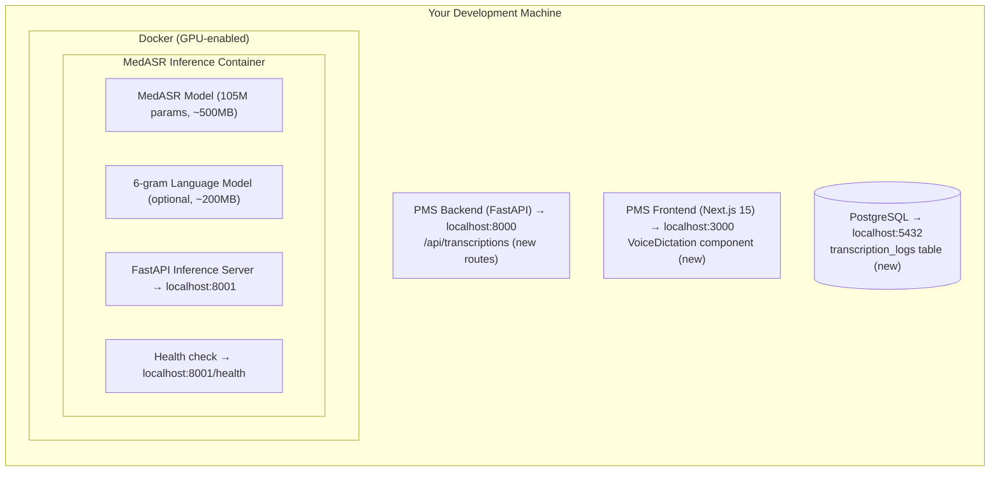

# MedASR Setup Guide for PMS Integration

**Document ID:** PMS-EXP-MEDASR-001
**Version:** 1.0
**Date:** February 19, 2026
**Applies To:** PMS project (all platforms)
**Prerequisites Level:** Intermediate (Docker, FastAPI, and basic ML familiarity assumed)

---

## Table of Contents

1. [Overview](#1-overview)
2. [Prerequisites](#2-prerequisites)
3. [Part A: Install and Configure MedASR](#3-part-a-install-and-configure-medasr)
4. [Part B: Integrate with PMS Backend](#4-part-b-integrate-with-pms-backend)
5. [Part C: Integrate with PMS Frontend](#5-part-c-integrate-with-pms-frontend)
6. [Part D: Testing and Verification](#6-part-d-testing-and-verification)
7. [Troubleshooting](#7-troubleshooting)
8. [Reference Commands](#8-reference-commands)

---

## 1. Overview

This guide walks you through deploying a **self-hosted MedASR medical speech recognition service** on your local development machine and integrating it with the MPS PMS. By the end, you will have:

- MedASR running in a GPU-enabled Docker container on port 8001
- A FastAPI inference service with batch and streaming transcription endpoints
- Transcription API routes added to the PMS backend
- A voice dictation UI component integrated into the PMS web frontend
- End-to-end audio-to-text pipeline verified with medical test audio

### Architecture at a Glance



---

## 2. Prerequisites

Verify each of these before proceeding.

### 2.1 Required Software

| Software | Minimum Version | Check Command |
|----------|----------------|---------------|
| Docker | 24.x | `docker --version` |
| Docker Compose | 2.x | `docker compose version` |
| NVIDIA GPU Driver | 535+ | `nvidia-smi` |
| NVIDIA Container Toolkit | 1.14+ | `nvidia-ctk --version` |
| Python | 3.12+ | `python3 --version` |
| Node.js | 22.x | `node --version` |
| npm | 11.x | `npm --version` |
| Git | 2.x | `git --version` |
| curl | any | `curl --version` |
| ffmpeg | 6.x+ | `ffmpeg -version` |

### 2.2 Install NVIDIA Container Toolkit (if needed)

The NVIDIA Container Toolkit enables GPU passthrough to Docker containers.

```bash
# Ubuntu/Debian
curl -fsSL https://nvidia.github.io/libnvidia-container/gpgkey | \
  sudo gpg --dearmor -o /usr/share/keyrings/nvidia-container-toolkit-keyring.gpg
curl -s -L https://nvidia.github.io/libnvidia-container/stable/deb/nvidia-container-toolkit.list | \
  sed 's#deb https://#deb [signed-by=/usr/share/keyrings/nvidia-container-toolkit-keyring.gpg] https://#g' | \
  sudo tee /etc/apt/sources.list.d/nvidia-container-toolkit.list
sudo apt-get update && sudo apt-get install -y nvidia-container-toolkit
sudo nvidia-ctk runtime configure --runtime=docker
sudo systemctl restart docker

# macOS (Docker Desktop with GPU support)
# GPU passthrough is available on Docker Desktop 4.30+ with Apple Silicon (MPS backend)
# For NVIDIA GPUs on macOS, use a Linux VM or remote GPU server

# Verify GPU is accessible from Docker
docker run --rm --gpus all nvidia/cuda:12.2.0-base-ubuntu22.04 nvidia-smi
```

### 2.3 Install ffmpeg (if needed)

```bash
# macOS
brew install ffmpeg

# Ubuntu/Debian
sudo apt-get install -y ffmpeg

# Verify
ffmpeg -version
```

### 2.4 Verify PMS Services

Confirm the PMS backend, frontend, and database are running:

```bash
# Check PMS backend
curl -s http://localhost:8000/docs | head -5
# Expected: HTML content from FastAPI Swagger UI

# Check PMS frontend
curl -s http://localhost:3000 | head -5
# Expected: HTML content from Next.js

# Check PostgreSQL
psql -h localhost -p 5432 -U pms_user -d pms_db -c "SELECT 1;"
# Expected: 1 row returned
```

**Checkpoint:** All prerequisite software is installed and PMS services are running.

---

## 3. Part A: Install and Configure MedASR

### Step 1: Create the MedASR Service Directory

```bash
mkdir -p services/medasr
cd services/medasr
```

### Step 2: Create the Inference Server

Create the FastAPI inference server that wraps MedASR:

**File: `services/medasr/server.py`**

```python
"""MedASR Inference Server — FastAPI wrapper for medical speech-to-text."""

import io
import logging
import time
from contextlib import asynccontextmanager

import librosa
import torch
from fastapi import FastAPI, File, HTTPException, UploadFile, WebSocket, WebSocketDisconnect
from fastapi.middleware.cors import CORSMiddleware
from pydantic import BaseModel
from transformers import AutoModelForCTC, AutoProcessor, pipeline

logger = logging.getLogger("medasr")
logging.basicConfig(level=logging.INFO)

# Global model references
model = None
processor = None
pipe = None
device = None


@asynccontextmanager
async def lifespan(app: FastAPI):
    """Load MedASR model on startup."""
    global model, processor, pipe, device

    device = "cuda" if torch.cuda.is_available() else "cpu"
    logger.info(f"Loading MedASR model on device: {device}")

    model_id = "google/medasr"
    processor = AutoProcessor.from_pretrained(model_id)
    model = AutoModelForCTC.from_pretrained(model_id).to(device)
    pipe = pipeline(
        "automatic-speech-recognition",
        model=model,
        tokenizer=processor.tokenizer,
        feature_extractor=processor.feature_extractor,
        device=device,
    )
    logger.info("MedASR model loaded successfully")
    yield
    logger.info("Shutting down MedASR service")


app = FastAPI(
    title="MedASR Inference Service",
    version="1.0.0",
    lifespan=lifespan,
)

app.add_middleware(
    CORSMiddleware,
    allow_origins=["http://localhost:3000"],
    allow_methods=["POST", "GET"],
    allow_headers=["*"],
)


class TranscriptionResponse(BaseModel):
    text: str
    duration_seconds: float
    processing_time_ms: float
    model: str = "google/medasr"


@app.get("/health")
async def health():
    return {
        "status": "healthy",
        "model_loaded": model is not None,
        "device": str(device),
        "gpu_available": torch.cuda.is_available(),
    }


@app.post("/transcribe", response_model=TranscriptionResponse)
async def transcribe(audio: UploadFile = File(...)):
    """Transcribe an audio file using MedASR."""
    if pipe is None:
        raise HTTPException(status_code=503, detail="Model not loaded")

    start_time = time.time()

    # Read and decode audio
    audio_bytes = await audio.read()
    speech, sample_rate = librosa.load(io.BytesIO(audio_bytes), sr=16000, mono=True)
    duration = len(speech) / sample_rate

    # Run inference
    result = pipe(speech, chunk_length_s=20, stride_length_s=2)

    processing_time = (time.time() - start_time) * 1000

    return TranscriptionResponse(
        text=result["text"],
        duration_seconds=round(duration, 2),
        processing_time_ms=round(processing_time, 2),
    )


@app.websocket("/ws/transcribe")
async def ws_transcribe(websocket: WebSocket):
    """Streaming transcription over WebSocket.

    Protocol:
    - Client sends binary audio chunks (16kHz, mono, int16)
    - Server responds with JSON: {"text": "...", "is_final": bool}
    - Client sends text message "END" to finalize
    """
    await websocket.accept()
    audio_buffer = bytearray()

    try:
        while True:
            data = await websocket.receive()

            if "text" in data and data["text"] == "END":
                # Final transcription of accumulated audio
                if len(audio_buffer) > 0:
                    speech, _ = librosa.load(
                        io.BytesIO(bytes(audio_buffer)), sr=16000, mono=True
                    )
                    result = pipe(speech, chunk_length_s=20, stride_length_s=2)
                    await websocket.send_json(
                        {"text": result["text"], "is_final": True}
                    )
                break

            if "bytes" in data:
                audio_buffer.extend(data["bytes"])

                # Transcribe every 2 seconds of audio (32000 samples * 2 bytes)
                if len(audio_buffer) >= 64000:
                    speech, _ = librosa.load(
                        io.BytesIO(bytes(audio_buffer)), sr=16000, mono=True
                    )
                    result = pipe(speech, chunk_length_s=20, stride_length_s=2)
                    await websocket.send_json(
                        {"text": result["text"], "is_final": False}
                    )

    except WebSocketDisconnect:
        logger.info("WebSocket client disconnected")
    finally:
        await websocket.close()
```

### Step 3: Create the Dockerfile

**File: `services/medasr/Dockerfile`**

```dockerfile
FROM nvidia/cuda:12.2.0-runtime-ubuntu22.04

# System dependencies
RUN apt-get update && apt-get install -y \
    python3.12 python3.12-venv python3-pip \
    ffmpeg libsndfile1 \
    && rm -rf /var/lib/apt/lists/*

WORKDIR /app

# Python dependencies
COPY requirements.txt .
RUN pip3 install --no-cache-dir -r requirements.txt

# Download model weights at build time (cached in layer)
RUN python3 -c "from transformers import AutoModelForCTC, AutoProcessor; \
    AutoProcessor.from_pretrained('google/medasr'); \
    AutoModelForCTC.from_pretrained('google/medasr')"

# Copy server code
COPY server.py .

EXPOSE 8001

CMD ["uvicorn", "server:app", "--host", "0.0.0.0", "--port", "8001"]
```

### Step 4: Create Requirements File

**File: `services/medasr/requirements.txt`**

```
transformers>=5.0.0
torch>=2.0.0
librosa>=0.10.0
fastapi>=0.115.0
uvicorn[standard]>=0.30.0
python-multipart>=0.0.9
websockets>=12.0
huggingface-hub>=0.25.0
soundfile>=0.12.0
```

### Step 5: Add MedASR to Docker Compose

Add the following service to your project's `docker-compose.yml` (or create `services/medasr/docker-compose.yml`):

```yaml
services:
  medasr:
    build:
      context: ./services/medasr
      dockerfile: Dockerfile
    container_name: pms-medasr
    ports:
      - "8001:8001"
    deploy:
      resources:
        reservations:
          devices:
            - driver: nvidia
              count: 1
              capabilities: [gpu]
    environment:
      - TRANSFORMERS_CACHE=/app/models
      - CUDA_VISIBLE_DEVICES=0
    volumes:
      - medasr-models:/app/models
    networks:
      - pms-internal
    restart: unless-stopped
    healthcheck:
      test: ["CMD", "curl", "-f", "http://localhost:8001/health"]
      interval: 30s
      timeout: 10s
      retries: 3

volumes:
  medasr-models:

networks:
  pms-internal:
    driver: bridge
```

### Step 6: Build and Start MedASR

```bash
# Build the Docker image (downloads model weights — may take 5-10 minutes first time)
docker compose -f services/medasr/docker-compose.yml build

# Start the service
docker compose -f services/medasr/docker-compose.yml up -d

# Watch logs during startup
docker logs -f pms-medasr
```

### Step 7: Verify MedASR is Running

```bash
# Health check
curl http://localhost:8001/health
# Expected: {"status":"healthy","model_loaded":true,"device":"cuda","gpu_available":true}

# Test with sample audio
curl -X POST http://localhost:8001/transcribe \
  -F "audio=@test_audio.wav" \
  | python3 -m json.tool
# Expected: {"text":"the patient presents with...","duration_seconds":5.2,"processing_time_ms":342.1,"model":"google/medasr"}
```

**Checkpoint:** MedASR is running in Docker on port 8001 with GPU acceleration and responding to transcription requests.

---

## 4. Part B: Integrate with PMS Backend

### Step 1: Create the Transcription Database Table

Add a migration for storing transcription logs:

**File: `alembic/versions/xxxx_add_transcription_logs.py`** (or equivalent migration)

```sql
CREATE TABLE transcription_logs (
    id UUID PRIMARY KEY DEFAULT gen_random_uuid(),
    encounter_id UUID REFERENCES encounters(id),
    patient_id UUID REFERENCES patients(id),
    provider_id UUID NOT NULL,
    transcription_text TEXT NOT NULL,
    duration_seconds FLOAT NOT NULL,
    processing_time_ms FLOAT NOT NULL,
    word_error_rate FLOAT,
    audio_hash VARCHAR(64) NOT NULL,  -- SHA-256 hash of audio (no audio stored)
    source VARCHAR(20) NOT NULL CHECK (source IN ('web', 'android', 'api')),
    created_at TIMESTAMP WITH TIME ZONE DEFAULT NOW(),
    updated_at TIMESTAMP WITH TIME ZONE DEFAULT NOW()
);

CREATE INDEX idx_transcription_logs_encounter ON transcription_logs(encounter_id);
CREATE INDEX idx_transcription_logs_provider ON transcription_logs(provider_id);
CREATE INDEX idx_transcription_logs_created ON transcription_logs(created_at);
```

### Step 2: Add Transcription Routes to PMS Backend

**File: `app/api/routes/transcriptions.py`**

```python
"""PMS Transcription API — proxies requests to MedASR inference service."""

import hashlib
import httpx
from uuid import UUID
from fastapi import APIRouter, Depends, File, HTTPException, UploadFile
from sqlalchemy.ext.asyncio import AsyncSession

from app.core.auth import get_current_user
from app.core.config import settings
from app.db.session import get_db

router = APIRouter(prefix="/api/transcriptions", tags=["transcriptions"])

MEDASR_URL = settings.MEDASR_SERVICE_URL  # http://pms-medasr:8001


@router.post("/")
async def create_transcription(
    audio: UploadFile = File(...),
    encounter_id: UUID | None = None,
    patient_id: UUID | None = None,
    db: AsyncSession = Depends(get_db),
    current_user=Depends(get_current_user),
):
    """Submit audio for transcription and store the result."""
    audio_bytes = await audio.read()
    audio_hash = hashlib.sha256(audio_bytes).hexdigest()

    # Forward to MedASR service
    async with httpx.AsyncClient(timeout=30.0) as client:
        response = await client.post(
            f"{MEDASR_URL}/transcribe",
            files={"audio": ("audio.wav", audio_bytes, audio.content_type)},
        )

    if response.status_code != 200:
        raise HTTPException(status_code=502, detail="MedASR service error")

    result = response.json()

    # Store transcription log (no audio persisted — HIPAA compliance)
    # ... insert into transcription_logs table ...

    return {
        "id": "...",  # generated UUID
        "text": result["text"],
        "duration_seconds": result["duration_seconds"],
        "processing_time_ms": result["processing_time_ms"],
        "encounter_id": encounter_id,
    }
```

### Step 3: Add Environment Variable

Add the MedASR service URL to the PMS backend environment:

```bash
# .env (PMS backend)
MEDASR_SERVICE_URL=http://localhost:8001
```

For Docker Compose deployments where both services are on the same network:

```bash
MEDASR_SERVICE_URL=http://pms-medasr:8001
```

### Step 4: Register the Router

Add the transcription router to the FastAPI application:

```python
# app/main.py (add to existing router registrations)
from app.api.routes.transcriptions import router as transcriptions_router

app.include_router(transcriptions_router)
```

### Step 5: Verify Backend Integration

```bash
# Test transcription through PMS backend
curl -X POST http://localhost:8000/api/transcriptions/ \
  -H "Authorization: Bearer <your-jwt-token>" \
  -F "audio=@test_audio.wav" \
  -F "encounter_id=<valid-encounter-uuid>" \
  | python3 -m json.tool

# Expected: {"id":"...","text":"the patient presents with...","duration_seconds":5.2,...}
```

**Checkpoint:** PMS backend proxies transcription requests to MedASR, stores results in PostgreSQL, and enforces authentication.

---

## 5. Part C: Integrate with PMS Frontend

### Step 1: Install Audio Recording Dependencies

```bash
cd pms-frontend
npm install recordrtc
```

### Step 2: Create the Voice Dictation Component

**File: `components/voice-dictation/VoiceDictation.tsx`**

```tsx
"use client";

import { useState, useRef, useCallback } from "react";

interface VoiceDictationProps {
  onTranscription: (text: string) => void;
  encounterId?: string;
}

export function VoiceDictation({ onTranscription, encounterId }: VoiceDictationProps) {
  const [isRecording, setIsRecording] = useState(false);
  const [transcript, setTranscript] = useState("");
  const [isProcessing, setIsProcessing] = useState(false);
  const mediaRecorderRef = useRef<MediaRecorder | null>(null);
  const chunksRef = useRef<Blob[]>([]);

  const startRecording = useCallback(async () => {
    const stream = await navigator.mediaDevices.getUserMedia({
      audio: { sampleRate: 16000, channelCount: 1 },
    });

    const mediaRecorder = new MediaRecorder(stream, {
      mimeType: "audio/webm;codecs=opus",
    });

    chunksRef.current = [];
    mediaRecorder.ondataavailable = (event) => {
      if (event.data.size > 0) {
        chunksRef.current.push(event.data);
      }
    };

    mediaRecorder.onstop = async () => {
      setIsProcessing(true);
      const audioBlob = new Blob(chunksRef.current, { type: "audio/webm" });
      const formData = new FormData();
      formData.append("audio", audioBlob, "recording.webm");
      if (encounterId) {
        formData.append("encounter_id", encounterId);
      }

      try {
        const response = await fetch("/api/transcriptions/", {
          method: "POST",
          body: formData,
        });
        const result = await response.json();
        setTranscript(result.text);
        onTranscription(result.text);
      } catch (error) {
        console.error("Transcription failed:", error);
      } finally {
        setIsProcessing(false);
      }
    };

    mediaRecorder.start(1000); // Collect data every second
    mediaRecorderRef.current = mediaRecorder;
    setIsRecording(true);
  }, [encounterId, onTranscription]);

  const stopRecording = useCallback(() => {
    if (mediaRecorderRef.current && isRecording) {
      mediaRecorderRef.current.stop();
      mediaRecorderRef.current.stream.getTracks().forEach((t) => t.stop());
      setIsRecording(false);
    }
  }, [isRecording]);

  return (
    <div className="flex flex-col gap-3 rounded-lg border border-gray-200 p-4">
      <div className="flex items-center gap-3">
        <button
          onClick={isRecording ? stopRecording : startRecording}
          disabled={isProcessing}
          className={`flex items-center gap-2 rounded-md px-4 py-2 text-sm font-medium text-white transition-colors ${
            isRecording
              ? "bg-red-600 hover:bg-red-700"
              : "bg-blue-600 hover:bg-blue-700"
          } disabled:opacity-50`}
        >
          {isRecording ? "Stop Dictation" : "Start Dictation"}
        </button>
        {isRecording && (
          <span className="flex items-center gap-1 text-sm text-red-600">
            <span className="h-2 w-2 animate-pulse rounded-full bg-red-600" />
            Recording...
          </span>
        )}
        {isProcessing && (
          <span className="text-sm text-gray-500">Transcribing...</span>
        )}
      </div>
      {transcript && (
        <div className="rounded-md bg-gray-50 p-3">
          <p className="text-sm text-gray-500">Transcription:</p>
          <p className="mt-1 text-sm">{transcript}</p>
        </div>
      )}
    </div>
  );
}
```

### Step 3: Add to Encounter Notes Form

```tsx
// In your encounter notes page/component:
import { VoiceDictation } from "@/components/voice-dictation/VoiceDictation";

// Inside the form JSX:
<VoiceDictation
  encounterId={encounter.id}
  onTranscription={(text) => {
    // Append transcribed text to the notes field
    setNotes((prev) => prev + " " + text);
  }}
/>
```

### Step 4: Add Next.js API Proxy (optional)

If you need to proxy through Next.js instead of calling the PMS backend directly:

**File: `app/api/transcriptions/route.ts`**

```typescript
import { NextRequest, NextResponse } from "next/server";

export async function POST(request: NextRequest) {
  const formData = await request.formData();

  const response = await fetch(
    `${process.env.PMS_BACKEND_URL}/api/transcriptions/`,
    {
      method: "POST",
      body: formData,
      headers: {
        Authorization: request.headers.get("Authorization") ?? "",
      },
    }
  );

  const result = await response.json();
  return NextResponse.json(result);
}
```

### Step 5: Add Environment Variable

```bash
# .env.local (Next.js frontend)
NEXT_PUBLIC_MEDASR_ENABLED=true
PMS_BACKEND_URL=http://localhost:8000
```

**Checkpoint:** Voice dictation component is available on the encounter notes form. Clinicians can record audio and see real-time transcriptions.

---

## 6. Part D: Testing and Verification

### 6.1 Service Health Checks

```bash
# MedASR inference service
curl http://localhost:8001/health
# Expected: {"status":"healthy","model_loaded":true,"device":"cuda","gpu_available":true}

# PMS backend
curl http://localhost:8000/docs
# Expected: FastAPI Swagger UI HTML

# PMS frontend
curl http://localhost:3000
# Expected: Next.js page HTML
```

### 6.2 Batch Transcription Test

```bash
# Download test audio from MedASR repo
curl -L -o test_audio.wav https://huggingface.co/google/medasr/resolve/main/test_audio.wav

# Direct MedASR test
curl -X POST http://localhost:8001/transcribe \
  -F "audio=@test_audio.wav"
# Expected: {"text":"...medical transcription...","duration_seconds":...,"processing_time_ms":...}

# Through PMS backend (authenticated)
curl -X POST http://localhost:8000/api/transcriptions/ \
  -H "Authorization: Bearer <jwt-token>" \
  -F "audio=@test_audio.wav"
# Expected: {"id":"...","text":"...","duration_seconds":...}
```

### 6.3 WebSocket Streaming Test

```python
# test_websocket.py
import asyncio
import json
import websockets
import librosa
import numpy as np

async def test_streaming():
    uri = "ws://localhost:8001/ws/transcribe"
    async with websockets.connect(uri) as ws:
        # Load and send audio in chunks
        speech, sr = librosa.load("test_audio.wav", sr=16000, mono=True)
        chunk_size = 16000  # 1 second chunks

        for i in range(0, len(speech), chunk_size):
            chunk = speech[i:i + chunk_size]
            audio_bytes = (chunk * 32767).astype(np.int16).tobytes()
            await ws.send(audio_bytes)
            await asyncio.sleep(0.1)

        # Signal end
        await ws.send("END")

        # Receive final result
        result = await ws.recv()
        print(json.loads(result))

asyncio.run(test_streaming())
```

### 6.4 Database Verification

```sql
-- Check transcription logs are being stored
SELECT id, provider_id, duration_seconds, processing_time_ms, source, created_at
FROM transcription_logs
ORDER BY created_at DESC
LIMIT 5;
```

### 6.5 Performance Benchmark

```bash
# Run 10 sequential transcriptions and measure average latency
for i in $(seq 1 10); do
  time curl -s -X POST http://localhost:8001/transcribe \
    -F "audio=@test_audio.wav" > /dev/null
done
```

**Checkpoint:** All services are healthy, batch and streaming transcription work end-to-end, results are stored in PostgreSQL, and latency meets performance targets.

---

## 7. Troubleshooting

### CUDA Out of Memory

**Symptom:** `RuntimeError: CUDA out of memory` during inference.

**Fix:** MedASR is lightweight (105M params, ~500MB VRAM) but other processes may consume GPU memory.

```bash
# Check GPU memory usage
nvidia-smi

# Kill other GPU processes if needed
# Reduce batch size in server.py if processing multiple files

# Fallback: Force CPU mode
docker run -e CUDA_VISIBLE_DEVICES="" pms-medasr
```

### Model Download Fails During Docker Build

**Symptom:** `ConnectionError` or `HTTPError` when downloading from Hugging Face during `docker build`.

**Fix:**

```bash
# Option 1: Set Hugging Face token for gated models
docker build --build-arg HF_TOKEN=hf_xxxx .

# Option 2: Pre-download model weights and COPY into image
python3 -c "from transformers import AutoModelForCTC, AutoProcessor; \
  AutoProcessor.from_pretrained('google/medasr', cache_dir='./model_cache'); \
  AutoModelForCTC.from_pretrained('google/medasr', cache_dir='./model_cache')"
# Then add to Dockerfile: COPY model_cache /app/models
```

### Port 8001 Already in Use

**Symptom:** `Address already in use` when starting the MedASR container.

**Fix:**

```bash
# Find the process using port 8001
lsof -i :8001

# Kill the process or change the port in docker-compose.yml
# ports:
#   - "8002:8001"
```

### Audio Format Not Supported

**Symptom:** `librosa` fails to decode uploaded audio.

**Fix:** MedASR expects 16kHz mono audio. Ensure audio is converted:

```bash
# Convert any audio to 16kHz mono WAV
ffmpeg -i input.mp3 -ar 16000 -ac 1 output.wav
```

On the frontend, ensure MediaRecorder uses compatible settings:

```javascript
// Browser MediaRecorder — use audio/webm which librosa can decode
const mediaRecorder = new MediaRecorder(stream, {
  mimeType: "audio/webm;codecs=opus",
});
```

### WebSocket Connection Refused

**Symptom:** Browser console shows `WebSocket connection to 'ws://localhost:8001/ws/transcribe' failed`.

**Fix:**

```bash
# Verify the MedASR container is running
docker ps | grep pms-medasr

# Check container logs for errors
docker logs pms-medasr --tail 50

# Verify CORS is configured for your frontend origin
# In server.py, ensure allow_origins includes http://localhost:3000
```

### Slow Transcription on CPU

**Symptom:** Transcription takes 10-30 seconds instead of < 1 second.

**Fix:** CPU inference is significantly slower. Options:

```bash
# Verify GPU is being used
curl http://localhost:8001/health
# Check "device" field — should be "cuda", not "cpu"

# If no GPU available, consider:
# 1. Use a remote GPU server for the MedASR service
# 2. Accept slower batch-mode transcription
# 3. Use quantized model (INT8) for faster CPU inference
```

### High Word Error Rate

**Symptom:** Transcription accuracy is poor (WER > 15%).

**Fix:**

```bash
# 1. Check audio quality
ffmpeg -i recording.wav -af "volumedetect" -f null /dev/null
# Ensure peak volume is above -30 dB

# 2. Enable 6-gram language model for better accuracy
# Update server.py to use beam search decoding

# 3. Verify sample rate is 16kHz
ffprobe -v error -show_entries stream=sample_rate recording.wav

# 4. Consider fine-tuning on your specific clinical vocabulary
# See: https://github.com/google-health/medasr/blob/main/notebooks/fine_tune_with_hugging_face.ipynb
```

---

## 8. Reference Commands

### Daily Development Workflow

```bash
# Start MedASR service
docker compose -f services/medasr/docker-compose.yml up -d

# View logs
docker logs -f pms-medasr

# Restart after code changes
docker compose -f services/medasr/docker-compose.yml up -d --build

# Stop service
docker compose -f services/medasr/docker-compose.yml down
```

### Management Commands

```bash
# Check GPU utilization
nvidia-smi -l 1

# View transcription logs
psql -h localhost -U pms_user -d pms_db -c \
  "SELECT COUNT(*), AVG(processing_time_ms) FROM transcription_logs WHERE created_at > NOW() - INTERVAL '1 day';"

# Clear model cache (re-downloads on next start)
docker volume rm medasr-models

# Run inference benchmark
docker exec pms-medasr python3 -c "
from transformers import pipeline
import time
pipe = pipeline('automatic-speech-recognition', model='google/medasr', device='cuda')
start = time.time()
for _ in range(10):
    pipe('test_audio.wav', chunk_length_s=20)
print(f'10 inferences in {time.time()-start:.1f}s')
"
```

### Useful URLs

| Service | URL | Description |
|---------|-----|-------------|
| MedASR Health | http://localhost:8001/health | Inference service health check |
| MedASR Docs | http://localhost:8001/docs | FastAPI Swagger UI for MedASR |
| PMS Backend | http://localhost:8000/docs | PMS API documentation |
| PMS Frontend | http://localhost:3000 | PMS web application |

---

## Next Steps

After completing this setup, proceed to the [MedASR Developer Tutorial](07-MedASR-Developer-Tutorial.md) to build your first end-to-end dictation integration and learn how to fine-tune the model for your clinical vocabulary.

---

## Resources

- [MedASR Official Documentation](https://developers.google.com/health-ai-developer-foundations/medasr)
- [MedASR on Hugging Face](https://huggingface.co/google/medasr)
- [MedASR GitHub Repository](https://github.com/Google-Health/medasr)
- [MedASR Model Card](https://developers.google.com/health-ai-developer-foundations/medasr/model-card)
- [Quick Start Notebook](https://colab.research.google.com/github/google-health/medasr/blob/main/notebooks/quick_start_with_hugging_face.ipynb)
- [Fine-tuning Notebook](https://github.com/google-health/medasr/blob/main/notebooks/fine_tune_with_hugging_face.ipynb)
- [PRD: MedASR PMS Integration](07-PRD-MedASR-PMS-Integration.md)
