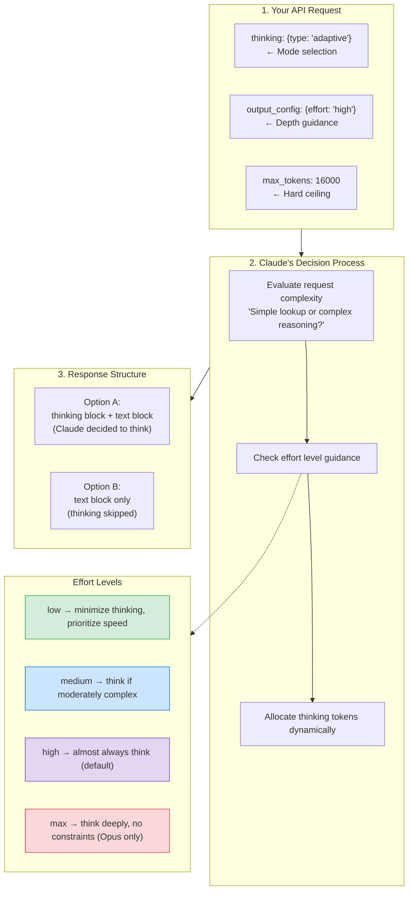
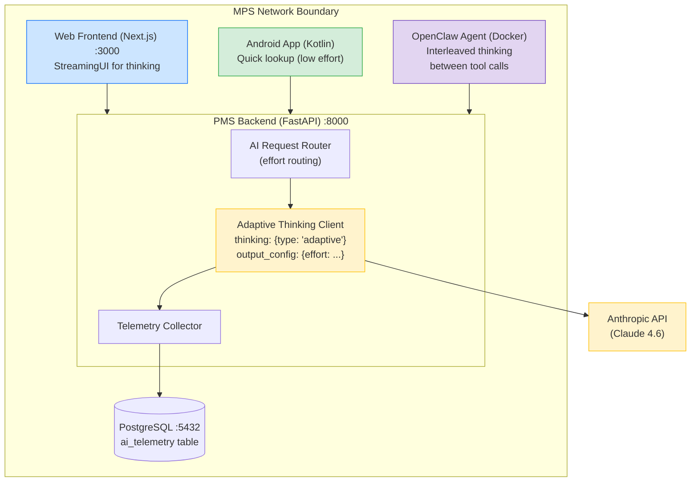

# Adaptive Thinking Developer Onboarding Tutorial

**Welcome to the MPS PMS Adaptive Thinking Integration Team**

This tutorial will take you from zero to building your first adaptive thinking integration with the PMS. By the end, you will understand how Claude's adaptive thinking works, have migrated from deprecated extended thinking, and have built and tested an effort-routed clinical AI feature end-to-end.

**Document ID:** PMS-EXP-ADAPTIVETHINKING-002
**Version:** 1.0
**Date:** February 19, 2026
**Applies To:** PMS project (all platforms)
**Prerequisite:** [Adaptive Thinking Setup Guide](08-AdaptiveThinking-PMS-Developer-Setup-Guide.md)
**Estimated time:** 2-3 hours
**Difficulty:** Beginner-friendly

---

## What You Will Learn

1. What adaptive thinking is and why Anthropic introduced it as the replacement for fixed thinking budgets
2. How the effort parameter controls reasoning depth across low, medium, high, and max levels
3. How interleaved thinking enables smarter agentic workflows (thinking between tool calls)
4. How adaptive thinking fits into the PMS alongside OpenClaw, MedASR, and Tambo
5. How to verify your local environment is configured for adaptive thinking
6. How to build an effort-routed clinical decision support endpoint
7. How to stream thinking progress to the frontend in real-time
8. How to evaluate cost savings and accuracy tradeoffs across effort levels
9. How to handle edge cases: redacted thinking, summarized thinking, and prompt caching
10. How to write tests and follow PMS conventions for adaptive thinking code

---

## Part 1: Understanding Adaptive Thinking (15 min read)

### 1.1 What Problem Does Adaptive Thinking Solve?

Every AI-powered feature in the PMS calls the Anthropic Claude API. Until now, every call used the same configuration:

```python
# Old approach — same budget for everything
thinking={"type": "enabled", "budget_tokens": 10000}
```

This is like giving a doctor the same amount of time for every patient visit — 15 minutes for a routine blood pressure check **and** 15 minutes for a complex differential diagnosis workup. It's wasteful for simple tasks and insufficient for complex ones.

Adaptive thinking solves this by letting Claude decide:

```python
# New approach — Claude decides how much to think
thinking={"type": "adaptive"}
output_config={"effort": "high"}  # Developer provides guidance
```

| Task | Old Approach | Adaptive Thinking |
|---|---|---|
| "What is patient John Smith's date of birth?" | 10,000 thinking tokens (wasted) | 0 thinking tokens (skipped) |
| "Summarize this encounter" | 10,000 thinking tokens (adequate) | ~3,000 thinking tokens (right-sized) |
| "What are the contraindications for this drug combo?" | 10,000 thinking tokens (maybe insufficient) | ~15,000 thinking tokens (deep reasoning) |

The result: **76% fewer tokens on routine tasks** and **better accuracy on complex tasks** — simultaneously.

### 1.2 How Adaptive Thinking Works — The Key Pieces

Adaptive thinking has three components that work together:



**Key insight:** The effort parameter is a **soft signal**, not a hard limit. Even at `low` effort, Claude will still think if the question is genuinely complex. And even at `max` effort, Claude won't waste tokens on trivially simple questions.

### 1.3 How Adaptive Thinking Fits with Other PMS Technologies

| Technology | Experiment | How Adaptive Thinking Helps |
|---|---|---|
| **OpenClaw** | 05 | Interleaved thinking: Claude reasons between each tool call, producing smarter multi-step workflows |
| **MedASR** | 07 | High-effort post-processing of transcriptions extracts more accurate SOAP notes and medication lists |
| **Tambo** | 00 | Medium-effort conversational queries balance speed with analytical depth |
| **Clinical Decision Support** | — | Max-effort reasoning for drug interactions and differential diagnosis ensures thorough analysis |
| **Patient Search** | — | Low-effort responses keep autocomplete fast and cheap |

### 1.4 Key Vocabulary

| Term | Meaning |
|---|---|
| **Adaptive thinking** | Thinking mode where Claude dynamically decides when and how much to reason (`thinking: {type: "adaptive"}`) |
| **Extended thinking** | The broader feature that gives Claude reasoning capabilities. Adaptive thinking is one mode of extended thinking. |
| **Effort parameter** | Developer-provided hint (`low`/`medium`/`high`/`max`) that guides how eagerly Claude spends tokens |
| **Thinking block** | Content block in the API response containing Claude's reasoning summary |
| **Interleaved thinking** | Ability to think between tool calls (automatic with adaptive thinking on 4.6 models) |
| **Summarized thinking** | Claude 4 models return a summary of thinking rather than raw thinking tokens |
| **Redacted thinking** | Thinking content encrypted by Anthropic's safety system — still usable in subsequent API calls |
| **`budget_tokens`** | Deprecated parameter that set a fixed thinking token budget. Replaced by adaptive thinking + effort. |
| **`max_tokens`** | Hard ceiling on total output (thinking + response text). Acts as a cost control. |
| **Thinking signature** | Encrypted field used to verify thinking blocks were generated by Claude |
| **Prompt caching** | Reusing cached prompt prefixes across requests. Switching thinking modes breaks message cache. |

### 1.5 Our Architecture



---

## Part 2: Environment Verification (15 min)

### 2.1 Checklist

Ensure you've completed the [Adaptive Thinking Setup Guide](08-AdaptiveThinking-PMS-Developer-Setup-Guide.md) before continuing.

1. **Anthropic API key is set:**
   ```bash
   echo $ANTHROPIC_API_KEY | head -c 10
   # Expected: sk-ant-api
   ```

2. **Python SDK supports adaptive thinking:**
   ```bash
   python3 -c "import anthropic; print(anthropic.__version__)"
   # Expected: 0.45.0 or higher
   ```

3. **PMS backend is running:**
   ```bash
   curl -s http://localhost:8000/docs | head -1
   # Expected: HTML content
   ```

4. **No deprecated parameters in codebase:**
   ```bash
   grep -rn "budget_tokens" app/ --include="*.py" | wc -l
   # Expected: 0
   ```

5. **Telemetry table exists:**
   ```bash
   psql -h localhost -U pms_user -d pms_db -c "\d ai_telemetry"
   # Expected: Table description with columns
   ```

### 2.2 Quick Test

Send one adaptive thinking request to verify everything works:

```bash
curl -s https://api.anthropic.com/v1/messages \
  -H "x-api-key: $ANTHROPIC_API_KEY" \
  -H "anthropic-version: 2023-06-01" \
  -H "content-type: application/json" \
  -d '{
    "model": "claude-sonnet-4-6",
    "max_tokens": 4000,
    "thinking": {"type": "adaptive"},
    "output_config": {"effort": "high"},
    "messages": [{"role": "user", "content": "What are the common side effects of metformin?"}]
  }' | python3 -c "
import sys, json
r = json.load(sys.stdin)
for block in r['content']:
    print(f'[{block[\"type\"]}] {block.get(\"thinking\", block.get(\"text\", \"\"))[:100]}...')
print(f'Usage: input={r[\"usage\"][\"input_tokens\"]} output={r[\"usage\"][\"output_tokens\"]}')
"
```

You should see a `[thinking]` block followed by a `[text]` block, confirming adaptive thinking is active.

---

## Part 3: Build Your First Integration (45 min)

### 3.1 What We Are Building

We'll build a **Clinical Decision Support Endpoint** that accepts a clinical question with patient context and returns an AI-assisted analysis. The endpoint will:

1. Accept a clinical question and optional patient ID
2. Load patient context from the database (medications, allergies, conditions)
3. Route to the appropriate effort level based on question complexity
4. Stream Claude's thinking and response back to the caller
5. Log telemetry for cost monitoring

### 3.2 Create the Question Classifier

First, build a simple classifier that determines effort level from the question:

**File: `app/services/question_classifier.py`**

```python
"""Classify clinical questions by complexity to determine effort level."""

import re
from app.services.ai_client import EffortLevel

# Keywords that indicate high-complexity questions
HIGH_COMPLEXITY_KEYWORDS = [
    r"differential diagnosis",
    r"contraindication",
    r"drug interaction",
    r"treatment plan",
    r"prognosis",
    r"risk assessment",
    r"clinical decision",
]

MEDIUM_COMPLEXITY_KEYWORDS = [
    r"summarize",
    r"summary",
    r"explain",
    r"compare",
    r"side effects",
    r"dosage",
    r"recommendation",
]

# Compile patterns
HIGH_PATTERNS = [re.compile(kw, re.IGNORECASE) for kw in HIGH_COMPLEXITY_KEYWORDS]
MEDIUM_PATTERNS = [re.compile(kw, re.IGNORECASE) for kw in MEDIUM_COMPLEXITY_KEYWORDS]


def classify_question(question: str) -> EffortLevel:
    """Classify a clinical question and return the appropriate effort level."""
    if any(p.search(question) for p in HIGH_PATTERNS):
        return EffortLevel.MAX

    if any(p.search(question) for p in MEDIUM_PATTERNS):
        return EffortLevel.HIGH

    # Default: medium effort for unclassified questions
    return EffortLevel.MEDIUM
```

### 3.3 Create the Clinical Decision Support Endpoint

**File: `app/api/routes/clinical_assist.py`**

```python
"""Clinical Decision Support — effort-routed AI assistance for clinicians."""

from uuid import UUID
from fastapi import APIRouter, Depends, HTTPException
from fastapi.responses import StreamingResponse
from pydantic import BaseModel
from sqlalchemy.ext.asyncio import AsyncSession

from app.core.auth import get_current_user
from app.db.session import get_db
from app.services.ai_client import complete, stream, EffortLevel
from app.services.ai_telemetry import log_ai_usage
from app.services.question_classifier import classify_question

router = APIRouter(prefix="/api/clinical-assist", tags=["clinical-assist"])

SYSTEM_PROMPT = """You are a clinical decision support assistant for the MPS Patient
Management System. You help clinicians by providing evidence-based analysis of clinical
questions. Always include relevant citations and note when clinical judgment is required.
Never provide definitive diagnoses — frame responses as decision support for the clinician."""


class ClinicalQuestion(BaseModel):
    question: str
    patient_id: UUID | None = None
    effort_override: EffortLevel | None = None


@router.post("/ask")
async def ask_clinical_question(
    request: ClinicalQuestion,
    db: AsyncSession = Depends(get_db),
    current_user=Depends(get_current_user),
):
    """Submit a clinical question and get AI-assisted analysis."""
    # Step 1: Classify question complexity
    effort = request.effort_override or classify_question(request.question)

    # Step 2: Build context (load patient data if provided)
    context = ""
    if request.patient_id:
        # In production, load from database
        context = f"\n\nPatient context: [Patient ID: {request.patient_id}]"

    # Step 3: Call Claude with adaptive thinking
    prompt = f"{request.question}{context}"
    response = await complete(
        messages=[{"role": "user", "content": prompt}],
        system=SYSTEM_PROMPT,
        effort=effort,
    )

    # Step 4: Log telemetry
    await log_ai_usage(
        db=db,
        response=response,
        endpoint="/api/clinical-assist/ask",
        task_type="clinical_question",
        provider_id=current_user.id,
    )

    return {
        "answer": response.text,
        "thinking_summary": response.thinking_summary,
        "effort": response.effort,
        "model": response.model,
        "tokens": {
            "input": response.input_tokens,
            "output": response.output_tokens,
        },
    }


@router.post("/ask/stream")
async def stream_clinical_question(
    request: ClinicalQuestion,
    _=Depends(get_current_user),
):
    """Stream a clinical question response with real-time thinking."""
    effort = request.effort_override or classify_question(request.question)

    async def generate():
        async for chunk in stream(
            messages=[{"role": "user", "content": request.question}],
            system=SYSTEM_PROMPT,
            effort=effort,
        ):
            yield f"data: {__import__('json').dumps(chunk)}\n\n"

    return StreamingResponse(
        generate(),
        media_type="text/event-stream",
        headers={"X-Accel-Buffering": "no"},
    )
```

### 3.4 Register the Router

```python
# app/main.py — add to existing router registrations
from app.api.routes.clinical_assist import router as clinical_assist_router
app.include_router(clinical_assist_router)
```

### 3.5 Test the Endpoint

```bash
# Simple question — should use medium effort
curl -X POST http://localhost:8000/api/clinical-assist/ask \
  -H "Authorization: Bearer <jwt>" \
  -H "Content-Type: application/json" \
  -d '{"question": "What is the standard dosage of amoxicillin for adults?"}' \
  | python3 -m json.tool

# Complex question — should use max effort
curl -X POST http://localhost:8000/api/clinical-assist/ask \
  -H "Authorization: Bearer <jwt>" \
  -H "Content-Type: application/json" \
  -d '{"question": "What is the differential diagnosis for a 65-year-old male presenting with acute chest pain, elevated troponin, and ST elevation in leads V1-V4?"}' \
  | python3 -m json.tool

# Override effort manually
curl -X POST http://localhost:8000/api/clinical-assist/ask \
  -H "Authorization: Bearer <jwt>" \
  -H "Content-Type: application/json" \
  -d '{"question": "List common side effects of lisinopril", "effort_override": "low"}' \
  | python3 -m json.tool
```

### 3.6 Verify Telemetry Was Logged

```bash
psql -h localhost -U pms_user -d pms_db -c \
  "SELECT effort_level, model, input_tokens, output_tokens, thinking_present, duration_ms
   FROM ai_telemetry ORDER BY created_at DESC LIMIT 5;"
```

**Checkpoint:** You've built a complete clinical decision support endpoint with automatic effort routing, streaming support, and telemetry logging.

---

## Part 4: Evaluating Strengths and Weaknesses (15 min)

### 4.1 Strengths

| Strength | Details |
|---|---|
| **Cost efficiency** | 76% fewer tokens on routine tasks at medium effort. Significant cost reduction without accuracy loss. |
| **Better reasoning when needed** | `max` effort on Opus 4.6 provides the deepest reasoning available — exceeds previous models on clinical benchmarks. |
| **No infrastructure changes** | Pure API parameter change. No new servers, containers, or services required. |
| **Interleaved thinking** | Automatic with adaptive mode. Claude reasons between tool calls in agentic workflows (OpenClaw). |
| **Dynamic allocation** | Claude right-sizes thinking per request. No manual budget tuning per endpoint. |
| **Effort parameter** | Simple 4-level control (`low`/`medium`/`high`/`max`) that developers can set per endpoint. |
| **Streaming support** | Thinking blocks stream in real-time via SSE, enabling progressive UI updates. |
| **Future-proof** | Replaces deprecated `budget_tokens` before it's removed. Migration now avoids forced migration later. |

### 4.2 Weaknesses

| Weakness | Impact | Workaround |
|---|---|---|
| **Unpredictable token usage** | Hard to forecast API costs exactly since Claude decides how much to think | Set `max_tokens` as hard ceiling. Monitor telemetry dashboard. |
| **Summarized thinking** | Cannot see Claude's full reasoning — only a summary | Sufficient for most use cases. Contact Anthropic sales for full access if needed. |
| **`max` effort Opus-only** | Deepest reasoning requires Opus 4.6, which is more expensive | Reserve `max` for safety-critical clinical tasks. Use Sonnet for routine work. |
| **Cache invalidation** | Switching between `adaptive` and `enabled` modes breaks message cache | Stay consistently on `adaptive` mode after migration. |
| **Latency at max effort** | Max effort responses can take 15+ seconds | Stream responses to show progress. Reserve max for non-real-time tasks. |
| **Effort is a hint, not a guarantee** | Claude may still think at low effort for complex questions | This is actually a safety feature — ensures clinical accuracy even if effort is set too low. |

### 4.3 When to Use Each Effort Level

| Effort | Use When | PMS Examples |
|---|---|---|
| **low** | Speed matters most, task is simple | Patient search, autocomplete, simple lookups |
| **medium** | Good balance of speed and quality | Encounter summaries, routine note drafting, report generation |
| **high** | Quality matters, willing to wait | Clinical summaries, compliance reports, OpenClaw skills |
| **max** | Safety-critical reasoning | Drug interaction checks, differential diagnosis, treatment planning |

**Decision rule:** Start with `medium` for new endpoints. Upgrade to `high`/`max` only if clinical accuracy requires it. Use `low` only for non-clinical tasks.

### 4.4 HIPAA / Healthcare Considerations

| Requirement | Assessment |
|---|---|
| **PHI in thinking blocks** | Thinking summaries may reference PHI from the prompt. Never log thinking content to application logs. Store only in encrypted database fields if audit trail is needed. |
| **Redacted thinking** | Anthropic may encrypt sensitive reasoning. This is a safety feature. Handle gracefully in UI — don't display raw encrypted blocks. |
| **Data residency** | Claude 4.6 supports `inference_geo: "us"` for US-only inference (1.1x pricing). Use if data residency is required. |
| **BAA coverage** | Adaptive thinking is a standard API feature covered by the existing Anthropic BAA. No additional agreements needed. |
| **Audit trail** | Log request ID, effort level, model, token counts, endpoint, and provider ID. Never log prompt content or thinking content in plain text. |
| **Minimum necessary** | Only include PHI that is necessary for the clinical task. De-identify where possible. Adaptive thinking doesn't change this requirement. |

---

## Part 5: Debugging Common Issues (15 min read)

### Issue 1: Response Missing Thinking Block

**Symptom:** `response.content` has only a `text` block, no `thinking` block.

**Cause:** At `low` or `medium` effort, Claude may skip thinking for simple questions. This is expected behavior.

**Fix:** If thinking is important, increase effort:
```python
response = await complete(messages=..., effort=EffortLevel.HIGH)
# At high effort, Claude almost always thinks
```

### Issue 2: "Output would exceed max_tokens" Error

**Symptom:** `400 Bad Request` with message about exceeding max_tokens.

**Cause:** Prompt tokens + `max_tokens` exceeds context window. With adaptive thinking, Claude may allocate more thinking tokens than expected.

**Fix:** Increase `max_tokens` or reduce prompt size:
```python
response = await complete(messages=..., max_tokens=32000)  # Increase ceiling
```

### Issue 3: Higher-Than-Expected Costs

**Symptom:** Token usage is higher than with the old fixed `budget_tokens`.

**Cause:** At `high`/`max` effort, Claude may think more extensively than your old fixed budget allowed.

**Fix:** Check telemetry and adjust effort routing:
```sql
-- Find the most expensive endpoints
SELECT endpoint, effort_level, AVG(output_tokens)::int, COUNT(*)
FROM ai_telemetry
WHERE created_at > NOW() - INTERVAL '7 days'
GROUP BY endpoint, effort_level
ORDER BY AVG(output_tokens) DESC;
```

### Issue 4: Streaming Shows Thinking Then Stops

**Symptom:** Frontend shows "Reasoning..." but then the response stops or times out.

**Cause:** HTTP timeout on long thinking responses (especially at `max` effort).

**Fix:** Ensure timeouts are sufficient:
```python
# Backend: increase ASGI timeout
# uvicorn app.main:app --timeout-keep-alive 120

# Frontend: increase fetch timeout
const controller = new AbortController();
const timeout = setTimeout(() => controller.abort(), 120000);  // 2 minutes
const res = await fetch(endpoint, { signal: controller.signal, ... });
```

### Issue 5: Prompt Cache Misses After Migration

**Symptom:** `cache_read_input_tokens` is 0 on every request after switching to adaptive thinking.

**Cause:** Switching from `thinking: {type: "enabled"}` to `thinking: {type: "adaptive"}` invalidates message cache breakpoints.

**Fix:** This is expected on the first request after migration. Subsequent requests with the same thinking mode will cache normally. Stay consistently on `adaptive` mode — don't switch back and forth.

### Reading API Response Metadata

```python
# Check response for useful debugging info
response = await client.messages.create(...)
print(f"Stop reason: {response.stop_reason}")  # "end_turn" or "max_tokens"
print(f"Input tokens: {response.usage.input_tokens}")
print(f"Output tokens: {response.usage.output_tokens}")

# If stop_reason is "max_tokens", Claude ran out of space
# Increase max_tokens or lower effort to reduce thinking allocation
```

---

## Part 6: Practice Exercise (45 min)

Choose one of the following exercises to practice on your own.

### Option A: Build an Effort Comparison Dashboard

Build a page that sends the same clinical question at all four effort levels and displays the results side-by-side.

**Requirements:**
- Input field for a clinical question
- Four panels showing: effort level, thinking summary (if any), response text, token usage, latency
- Highlight cost differences between effort levels

**Hints:**
1. Use `Promise.all()` on the frontend to fire all four requests in parallel
2. Use the `effort_override` parameter in the `/api/clinical-assist/ask` endpoint
3. Calculate estimated cost: `output_tokens * rate_per_token` (Opus: $25/MTok, Sonnet: $15/MTok)

### Option B: Implement Dynamic Effort Escalation

Build a system that starts at `low` effort and automatically retries at higher effort if the response quality is insufficient.

**Requirements:**
- Start every request at `low` effort
- If response contains "I need more information" or is under 50 words, retry at `medium`
- If still insufficient, retry at `high`
- Log all retries in telemetry

**Hints:**
1. Add a `min_response_length` parameter to the `complete()` function
2. Implement a retry loop with effort escalation: `low → medium → high`
3. Log each attempt in `ai_telemetry` with a shared `request_id` to track escalation chains

### Option C: Add Thinking Visibility to OpenClaw

Enable OpenClaw skill executions to display intermediate thinking between tool calls.

**Requirements:**
- OpenClaw uses adaptive thinking with interleaved reasoning
- Each thinking block between tool calls is captured and displayed
- The UI shows a timeline: thinking → tool call → thinking → tool call → response

**Hints:**
1. Use streaming with the OpenClaw agent to capture interleaved thinking blocks
2. Interleaved thinking is automatic with adaptive mode — no beta header needed
3. Build a timeline component that distinguishes between `thinking`, `tool_use`, and `text` blocks

---

## Part 7: Development Workflow and Conventions

### 7.1 File Organization

```
app/
├── api/routes/
│   ├── clinical_assist.py          # Clinical decision support endpoints
│   └── ai_telemetry.py             # Telemetry dashboard endpoints
├── services/
│   ├── ai_client.py                # Adaptive thinking client wrapper
│   ├── ai_router.py                # Effort level routing configuration
│   ├── ai_telemetry.py             # Telemetry logging service
│   └── question_classifier.py      # Question complexity classifier

components/
└── ai/
    ├── StreamingThinking.tsx        # Streaming thinking UI component
    └── EffortBadge.tsx              # Effort level badge component
```

### 7.2 Naming Conventions

| Item | Convention | Example |
|---|---|---|
| Effort levels | lowercase string | `"low"`, `"medium"`, `"high"`, `"max"` |
| AI client functions | `snake_case` async | `complete()`, `stream()` |
| Router task types | `snake_case` | `"drug_interaction_check"`, `"patient_search"` |
| Telemetry table | `snake_case` | `ai_telemetry` |
| React components | `PascalCase` | `StreamingThinking`, `EffortBadge` |
| Environment vars | `SCREAMING_SNAKE` | `ANTHROPIC_API_KEY`, `CLAUDE_DEFAULT_EFFORT` |

### 7.3 PR Checklist

When submitting a PR that involves adaptive thinking:

- [ ] All Claude API calls use `thinking: {type: "adaptive"}` (no `budget_tokens`)
- [ ] Effort level is explicitly set for each endpoint via AI Router
- [ ] Safety-critical endpoints use `high` or `max` effort
- [ ] Non-clinical endpoints use `low` or `medium` effort
- [ ] Telemetry logging is added for new endpoints
- [ ] Streaming is used for `high`/`max` effort endpoints to avoid timeouts
- [ ] Redacted thinking blocks are handled gracefully in UI
- [ ] No thinking block content is logged to application logs (HIPAA)
- [ ] `max_tokens` is set appropriately (not too low for thinking allocation)
- [ ] Unit tests verify effort routing for the new endpoint
- [ ] Integration tests confirm adaptive thinking responses contain expected block types

### 7.4 Security Reminders

| Rule | Explanation |
|---|---|
| **Never log thinking content** | Thinking summaries may contain PHI reasoning. Log only metadata (token counts, effort level, duration). |
| **Handle redacted thinking** | Display "Some reasoning was encrypted for safety" — never expose raw encrypted blocks to users. |
| **Use `inference_geo` if required** | Set `inference_geo: "us"` for US-only data residency at 1.1x cost. |
| **Enforce effort minimums for clinical tasks** | Drug interactions and differential diagnosis must use `max` effort. Don't allow `low` for safety-critical tasks. |
| **Audit all AI requests** | Every Claude API call must be logged to `ai_telemetry` with provider ID and endpoint. |
| **Don't expose API key to frontend** | All Claude API calls go through the PMS backend. The frontend never calls the Anthropic API directly. |

---

## Part 8: Quick Reference Card

### API Request Template

```python
from app.services.ai_client import complete, stream, EffortLevel

# Batch request
response = await complete(
    messages=[{"role": "user", "content": "..."}],
    effort=EffortLevel.HIGH,
    system="...",
)

# Streaming request
async for chunk in stream(
    messages=[{"role": "user", "content": "..."}],
    effort=EffortLevel.HIGH,
):
    print(chunk)
```

### Effort Level Quick Reference

| Level | Speed | Cost | Thinking | Best For |
|---|---|---|---|---|
| `low` | Fastest | Lowest | Rarely | Lookups, autocomplete |
| `medium` | Fast | Low | Sometimes | Summaries, reports |
| `high` | Moderate | Moderate | Almost always | Clinical analysis |
| `max` | Slowest | Highest | Always (deep) | Safety-critical reasoning |

### Key Files

| File | Purpose |
|---|---|
| `app/services/ai_client.py` | Adaptive thinking client wrapper |
| `app/services/ai_router.py` | Effort routing configuration |
| `app/services/ai_telemetry.py` | Telemetry logging |
| `app/services/question_classifier.py` | Question complexity classifier |
| `app/api/routes/clinical_assist.py` | Clinical decision support endpoints |
| `app/api/routes/ai_telemetry.py` | Telemetry dashboard API |
| `components/ai/StreamingThinking.tsx` | Streaming thinking UI |
| `components/ai/EffortBadge.tsx` | Effort level badge |

### Key URLs

| URL | Description |
|---|---|
| http://localhost:8000/docs | PMS backend Swagger UI |
| http://localhost:8000/api/ai-telemetry/summary | Token usage summary |
| http://localhost:3000 | PMS web frontend |
| https://console.anthropic.com | Anthropic API dashboard |
| https://platform.claude.com/docs/en/build-with-claude/adaptive-thinking | Official docs |

---

## Next Steps

1. **Read the PRD** — [Adaptive Thinking PMS Integration PRD](08-PRD-AdaptiveThinking-PMS-Integration.md) for the full product vision and implementation phases
2. **Optimize effort routing** — Use the telemetry dashboard to identify endpoints that can use lower effort without accuracy loss
3. **Integrate with OpenClaw** — Enable interleaved thinking in [OpenClaw skills](05-OpenClaw-Developer-Tutorial.md) for smarter multi-step workflows
4. **Connect to MedASR** — Use high-effort adaptive thinking for [MedASR transcription post-processing](07-MedASR-Developer-Tutorial.md) to extract better SOAP notes
5. **Build cost forecasting** — Use telemetry data to predict monthly Anthropic API costs based on effort distribution and request volume
