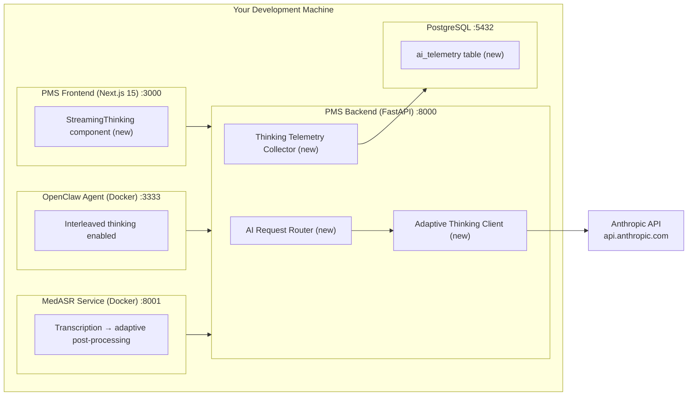

# Adaptive Thinking Setup Guide for PMS Integration

**Document ID:** PMS-EXP-ADAPTIVETHINKING-001
**Version:** 1.0
**Date:** February 19, 2026
**Applies To:** PMS project (all platforms)
**Prerequisites Level:** Intermediate (FastAPI, Next.js, and Anthropic SDK familiarity assumed)

---

## Table of Contents

1. [Overview](#1-overview)
2. [Prerequisites](#2-prerequisites)
3. [Part A: Upgrade SDKs and Migrate API Calls](#3-part-a-upgrade-sdks-and-migrate-api-calls)
4. [Part B: Integrate with PMS Backend](#4-part-b-integrate-with-pms-backend)
5. [Part C: Integrate with PMS Frontend](#5-part-c-integrate-with-pms-frontend)
6. [Part D: Testing and Verification](#6-part-d-testing-and-verification)
7. [Troubleshooting](#7-troubleshooting)
8. [Reference Commands](#8-reference-commands)

---

## 1. Overview

This guide walks you through migrating the PMS from **deprecated extended thinking** (`thinking: {type: "enabled", budget_tokens: N}`) to **adaptive thinking** (`thinking: {type: "adaptive"}`) with the effort parameter. By the end, you will have:

- Anthropic Python and TypeScript SDKs upgraded to support adaptive thinking
- All backend Claude API calls migrated to adaptive thinking
- An AI Request Router that assigns effort levels based on clinical context
- A Thinking Telemetry Collector logging token usage for cost monitoring
- A streaming thinking UI component in the Next.js frontend
- End-to-end verification that adaptive thinking works across all PMS features

### Architecture at a Glance



---

## 2. Prerequisites

Verify each of these before proceeding.

### 2.1 Required Software

| Software | Minimum Version | Check Command |
|----------|----------------|---------------|
| Python | 3.12+ | `python3 --version` |
| Node.js | 22.x | `node --version` |
| npm | 11.x | `npm --version` |
| `anthropic` (Python) | 0.45.0+ | `pip show anthropic \| grep Version` |
| `@anthropic-ai/sdk` (JS) | 0.40.0+ | `npm list @anthropic-ai/sdk` |
| Git | 2.x | `git --version` |
| curl | any | `curl --version` |

### 2.2 Installation of Prerequisites

```bash
# Upgrade Anthropic Python SDK
pip install --upgrade anthropic

# Verify version supports adaptive thinking
python3 -c "import anthropic; print(anthropic.__version__)"
# Expected: 0.45.0 or higher

# Upgrade Anthropic TypeScript SDK (in pms-frontend directory)
cd pms-frontend
npm install @anthropic-ai/sdk@latest

# Verify
npm list @anthropic-ai/sdk
# Expected: @anthropic-ai/sdk@0.40.0 or higher
```

### 2.3 Verify PMS Services

```bash
# PMS backend
curl -s http://localhost:8000/docs | head -5
# Expected: FastAPI Swagger UI HTML

# PMS frontend
curl -s http://localhost:3000 | head -5
# Expected: Next.js HTML

# PostgreSQL
psql -h localhost -p 5432 -U pms_user -d pms_db -c "SELECT 1;"
# Expected: 1

# Anthropic API key is set
echo $ANTHROPIC_API_KEY | head -c 10
# Expected: sk-ant-api (first 10 chars of your key)
```

### 2.4 Verify Current Extended Thinking Usage

Before migrating, identify all existing Claude API calls:

```bash
# Find all files using budget_tokens (deprecated parameter)
grep -rn "budget_tokens" app/ --include="*.py"

# Find all files using thinking type enabled
grep -rn 'type.*enabled' app/ --include="*.py" | grep -i think
```

**Checkpoint:** All prerequisites are installed, PMS services are running, and you've identified all Claude API calls that need migration.

---

## 3. Part A: Upgrade SDKs and Migrate API Calls

### Step 1: Create the Adaptive Thinking Client

This wrapper replaces direct Anthropic SDK calls with an effort-aware client:

**File: `app/services/ai_client.py`**

```python
"""Adaptive Thinking Client — wraps Anthropic SDK with effort routing."""

import time
import logging
from enum import Enum
from typing import AsyncIterator

import anthropic
from pydantic import BaseModel

from app.core.config import settings

logger = logging.getLogger("ai_client")


class EffortLevel(str, Enum):
    LOW = "low"
    MEDIUM = "medium"
    HIGH = "high"
    MAX = "max"


class AIResponse(BaseModel):
    text: str
    thinking_summary: str | None = None
    input_tokens: int
    output_tokens: int
    effort: str
    model: str
    duration_ms: float


# Model selection based on effort
MODEL_MAP = {
    EffortLevel.LOW: "claude-sonnet-4-6",
    EffortLevel.MEDIUM: "claude-sonnet-4-6",
    EffortLevel.HIGH: "claude-opus-4-6",
    EffortLevel.MAX: "claude-opus-4-6",
}

client = anthropic.AsyncAnthropic(api_key=settings.ANTHROPIC_API_KEY)


async def complete(
    messages: list[dict],
    effort: EffortLevel = EffortLevel.HIGH,
    system: str | None = None,
    tools: list[dict] | None = None,
    max_tokens: int = 16000,
    model_override: str | None = None,
) -> AIResponse:
    """Send a request to Claude with adaptive thinking and effort routing."""
    model = model_override or MODEL_MAP[effort]
    start_time = time.time()

    kwargs = {
        "model": model,
        "max_tokens": max_tokens,
        "thinking": {"type": "adaptive"},
        "output_config": {"effort": effort.value},
        "messages": messages,
    }
    if system:
        kwargs["system"] = system
    if tools:
        kwargs["tools"] = tools

    response = await client.messages.create(**kwargs)

    # Extract thinking and text blocks
    thinking_text = None
    response_text = ""
    for block in response.content:
        if block.type == "thinking":
            thinking_text = block.thinking
        elif block.type == "text":
            response_text += block.text

    duration_ms = (time.time() - start_time) * 1000

    return AIResponse(
        text=response_text,
        thinking_summary=thinking_text,
        input_tokens=response.usage.input_tokens,
        output_tokens=response.usage.output_tokens,
        effort=effort.value,
        model=model,
        duration_ms=round(duration_ms, 2),
    )


async def stream(
    messages: list[dict],
    effort: EffortLevel = EffortLevel.HIGH,
    system: str | None = None,
    tools: list[dict] | None = None,
    max_tokens: int = 16000,
    model_override: str | None = None,
) -> AsyncIterator[dict]:
    """Stream a response from Claude with adaptive thinking.

    Yields dicts with keys:
    - {"type": "thinking", "text": "..."} for thinking deltas
    - {"type": "text", "text": "..."} for response deltas
    - {"type": "done", "usage": {...}} when complete
    """
    model = model_override or MODEL_MAP[effort]

    kwargs = {
        "model": model,
        "max_tokens": max_tokens,
        "thinking": {"type": "adaptive"},
        "output_config": {"effort": effort.value},
        "messages": messages,
    }
    if system:
        kwargs["system"] = system
    if tools:
        kwargs["tools"] = tools

    async with client.messages.stream(**kwargs) as stream_response:
        async for event in stream_response:
            if event.type == "content_block_delta":
                if event.delta.type == "thinking_delta":
                    yield {"type": "thinking", "text": event.delta.thinking}
                elif event.delta.type == "text_delta":
                    yield {"type": "text", "text": event.delta.text}

        final = await stream_response.get_final_message()
        yield {
            "type": "done",
            "usage": {
                "input_tokens": final.usage.input_tokens,
                "output_tokens": final.usage.output_tokens,
            },
        }
```

### Step 2: Create the AI Request Router

**File: `app/services/ai_router.py`**

```python
"""AI Request Router — assigns effort levels based on clinical context."""

from app.services.ai_client import EffortLevel

# Effort routing configuration
ENDPOINT_EFFORT_MAP: dict[str, EffortLevel] = {
    # Low effort — speed matters most
    "patient_search": EffortLevel.LOW,
    "patient_autocomplete": EffortLevel.LOW,
    "prescription_refill": EffortLevel.LOW,
    # Medium effort — balanced
    "encounter_note_draft": EffortLevel.MEDIUM,
    "report_summary": EffortLevel.MEDIUM,
    "tambo_query": EffortLevel.MEDIUM,
    # High effort — clinical quality matters
    "clinical_summary": EffortLevel.HIGH,
    "compliance_report": EffortLevel.HIGH,
    "openclaw_skill": EffortLevel.HIGH,
    # Max effort — safety-critical reasoning (Opus 4.6 only)
    "differential_diagnosis": EffortLevel.MAX,
    "drug_interaction_check": EffortLevel.MAX,
}


def get_effort(task_type: str) -> EffortLevel:
    """Look up the effort level for a given task type."""
    return ENDPOINT_EFFORT_MAP.get(task_type, EffortLevel.HIGH)
```

### Step 3: Migrate Existing API Calls

Replace all existing Claude API calls. Here's a before/after example:

**Before (deprecated):**

```python
# Old code using budget_tokens
response = await anthropic_client.messages.create(
    model="claude-sonnet-4-5-20250929",
    max_tokens=16000,
    thinking={"type": "enabled", "budget_tokens": 10000},
    messages=[{"role": "user", "content": prompt}],
)
```

**After (adaptive thinking):**

```python
# New code using adaptive thinking with effort routing
from app.services.ai_client import complete, EffortLevel
from app.services.ai_router import get_effort

effort = get_effort("encounter_note_draft")  # Returns EffortLevel.MEDIUM
response = await complete(
    messages=[{"role": "user", "content": prompt}],
    effort=effort,
)
print(response.text)
```

### Step 4: Remove Deprecated Parameters

```bash
# Search for all deprecated patterns and replace
grep -rn "budget_tokens" app/ --include="*.py"
grep -rn "interleaved-thinking-2025-05-14" app/ --include="*.py"
grep -rn '"type": "enabled"' app/ --include="*.py" | grep -i think

# Each occurrence should be replaced with the ai_client wrapper
```

**Checkpoint:** All Claude API calls now use `thinking: {type: "adaptive"}` via the `ai_client` wrapper. No `budget_tokens` references remain.

---

## 4. Part B: Integrate with PMS Backend

### Step 1: Create the Telemetry Database Table

**Migration SQL:**

```sql
CREATE TABLE ai_telemetry (
    id UUID PRIMARY KEY DEFAULT gen_random_uuid(),
    request_id VARCHAR(64) NOT NULL,
    endpoint VARCHAR(128) NOT NULL,
    task_type VARCHAR(64) NOT NULL,
    effort_level VARCHAR(10) NOT NULL CHECK (effort_level IN ('low', 'medium', 'high', 'max')),
    model VARCHAR(64) NOT NULL,
    input_tokens INTEGER NOT NULL,
    output_tokens INTEGER NOT NULL,
    thinking_present BOOLEAN NOT NULL DEFAULT false,
    duration_ms FLOAT NOT NULL,
    provider_id UUID,
    created_at TIMESTAMP WITH TIME ZONE DEFAULT NOW()
);

CREATE INDEX idx_ai_telemetry_effort ON ai_telemetry(effort_level);
CREATE INDEX idx_ai_telemetry_created ON ai_telemetry(created_at);
CREATE INDEX idx_ai_telemetry_endpoint ON ai_telemetry(endpoint);
```

### Step 2: Add Telemetry Logging

**File: `app/services/ai_telemetry.py`**

```python
"""AI Telemetry — logs adaptive thinking usage for cost monitoring."""

import uuid
from sqlalchemy.ext.asyncio import AsyncSession

from app.services.ai_client import AIResponse


async def log_ai_usage(
    db: AsyncSession,
    response: AIResponse,
    endpoint: str,
    task_type: str,
    provider_id: uuid.UUID | None = None,
) -> None:
    """Log AI request telemetry to the database."""
    await db.execute(
        """
        INSERT INTO ai_telemetry
            (request_id, endpoint, task_type, effort_level, model,
             input_tokens, output_tokens, thinking_present, duration_ms, provider_id)
        VALUES (:request_id, :endpoint, :task_type, :effort, :model,
                :input_tokens, :output_tokens, :thinking, :duration, :provider_id)
        """,
        {
            "request_id": str(uuid.uuid4()),
            "endpoint": endpoint,
            "task_type": task_type,
            "effort": response.effort,
            "model": response.model,
            "input_tokens": response.input_tokens,
            "output_tokens": response.output_tokens,
            "thinking": response.thinking_summary is not None,
            "duration": response.duration_ms,
            "provider_id": provider_id,
        },
    )
    await db.commit()
```

### Step 3: Add Telemetry Dashboard Endpoint

**File: `app/api/routes/ai_telemetry.py`**

```python
"""AI Telemetry API — cost and usage monitoring for adaptive thinking."""

from fastapi import APIRouter, Depends
from sqlalchemy.ext.asyncio import AsyncSession

from app.core.auth import get_current_user
from app.db.session import get_db

router = APIRouter(prefix="/api/ai-telemetry", tags=["ai-telemetry"])


@router.get("/summary")
async def get_telemetry_summary(
    days: int = 7,
    db: AsyncSession = Depends(get_db),
    _=Depends(get_current_user),
):
    """Get AI usage summary by effort level for the past N days."""
    result = await db.execute(
        """
        SELECT
            effort_level,
            model,
            COUNT(*) as request_count,
            SUM(input_tokens) as total_input_tokens,
            SUM(output_tokens) as total_output_tokens,
            AVG(duration_ms)::int as avg_duration_ms,
            SUM(CASE WHEN thinking_present THEN 1 ELSE 0 END) as thinking_count
        FROM ai_telemetry
        WHERE created_at > NOW() - make_interval(days => :days)
        GROUP BY effort_level, model
        ORDER BY effort_level, model
        """,
        {"days": days},
    )
    rows = result.fetchall()
    return [dict(row._mapping) for row in rows]
```

### Step 4: Add Environment Variables

```bash
# .env (PMS backend)
ANTHROPIC_API_KEY=sk-ant-api-xxxxxxxxxxxx
CLAUDE_DEFAULT_MODEL=claude-opus-4-6
CLAUDE_DEFAULT_EFFORT=high
```

### Step 5: Register the Router

```python
# app/main.py — add to existing router registrations
from app.api.routes.ai_telemetry import router as ai_telemetry_router
app.include_router(ai_telemetry_router)
```

**Checkpoint:** PMS backend uses adaptive thinking for all Claude API calls, logs telemetry to PostgreSQL, and exposes a usage summary endpoint.

---

## 5. Part C: Integrate with PMS Frontend

### Step 1: Create the Streaming Thinking Component

**File: `components/ai/StreamingThinking.tsx`**

```tsx
"use client";

import { useState, useCallback } from "react";

interface StreamingThinkingProps {
  endpoint: string;
  prompt: string;
  effort?: "low" | "medium" | "high" | "max";
  showThinking?: boolean;
  onComplete?: (text: string) => void;
}

export function StreamingThinking({
  endpoint,
  prompt,
  effort = "high",
  showThinking = true,
  onComplete,
}: StreamingThinkingProps) {
  const [thinking, setThinking] = useState("");
  const [response, setResponse] = useState("");
  const [isLoading, setIsLoading] = useState(false);
  const [isThinking, setIsThinking] = useState(false);

  const submit = useCallback(async () => {
    setIsLoading(true);
    setIsThinking(false);
    setThinking("");
    setResponse("");

    const res = await fetch(endpoint, {
      method: "POST",
      headers: { "Content-Type": "application/json" },
      body: JSON.stringify({ prompt, effort }),
    });

    const reader = res.body?.getReader();
    const decoder = new TextDecoder();

    if (!reader) return;

    while (true) {
      const { done, value } = await reader.read();
      if (done) break;

      const chunk = decoder.decode(value, { stream: true });
      const lines = chunk.split("\n").filter((l) => l.startsWith("data: "));

      for (const line of lines) {
        const data = JSON.parse(line.slice(6));

        if (data.type === "thinking") {
          setIsThinking(true);
          setThinking((prev) => prev + data.text);
        } else if (data.type === "text") {
          setIsThinking(false);
          setResponse((prev) => prev + data.text);
        } else if (data.type === "done") {
          setIsLoading(false);
          onComplete?.(response + data.text);
        }
      }
    }

    setIsLoading(false);
  }, [endpoint, prompt, effort, onComplete, response]);

  return (
    <div className="flex flex-col gap-3">
      <button
        onClick={submit}
        disabled={isLoading}
        className="rounded-md bg-blue-600 px-4 py-2 text-sm font-medium text-white hover:bg-blue-700 disabled:opacity-50"
      >
        {isLoading ? "Processing..." : "Analyze"}
      </button>

      {showThinking && isThinking && thinking && (
        <div className="rounded-md border border-amber-200 bg-amber-50 p-3">
          <p className="mb-1 text-xs font-medium text-amber-700">
            Reasoning...
          </p>
          <p className="text-xs text-amber-600 whitespace-pre-wrap">{thinking}</p>
        </div>
      )}

      {response && (
        <div className="rounded-md bg-gray-50 p-3">
          <p className="text-sm whitespace-pre-wrap">{response}</p>
        </div>
      )}
    </div>
  );
}
```

### Step 2: Add Effort Indicator Badge

**File: `components/ai/EffortBadge.tsx`**

```tsx
const EFFORT_CONFIG = {
  low: { label: "Quick", color: "bg-green-100 text-green-700" },
  medium: { label: "Standard", color: "bg-blue-100 text-blue-700" },
  high: { label: "Deep Analysis", color: "bg-purple-100 text-purple-700" },
  max: { label: "Maximum Reasoning", color: "bg-red-100 text-red-700" },
};

export function EffortBadge({ effort }: { effort: "low" | "medium" | "high" | "max" }) {
  const config = EFFORT_CONFIG[effort];
  return (
    <span className={`inline-flex items-center rounded-full px-2 py-0.5 text-xs font-medium ${config.color}`}>
      {config.label}
    </span>
  );
}
```

### Step 3: Add Environment Variable

```bash
# .env.local (Next.js frontend)
NEXT_PUBLIC_ADAPTIVE_THINKING_ENABLED=true
```

**Checkpoint:** Frontend displays real-time thinking progress and effort level badges. Streaming works for high/max effort requests.

---

## 6. Part D: Testing and Verification

### 6.1 Verify Adaptive Thinking Works

```bash
# Direct API test — adaptive thinking with high effort
curl -s https://api.anthropic.com/v1/messages \
  -H "x-api-key: $ANTHROPIC_API_KEY" \
  -H "anthropic-version: 2023-06-01" \
  -H "content-type: application/json" \
  -d '{
    "model": "claude-sonnet-4-6",
    "max_tokens": 4000,
    "thinking": {"type": "adaptive"},
    "output_config": {"effort": "high"},
    "messages": [{"role": "user", "content": "What are the contraindications for Lisinopril in a patient with bilateral renal artery stenosis?"}]
  }' | python3 -m json.tool

# Expected: Response with thinking block + text block
```

### 6.2 Verify Effort Levels

```bash
# Low effort — should be fast, may skip thinking
curl -s https://api.anthropic.com/v1/messages \
  -H "x-api-key: $ANTHROPIC_API_KEY" \
  -H "anthropic-version: 2023-06-01" \
  -H "content-type: application/json" \
  -d '{
    "model": "claude-sonnet-4-6",
    "max_tokens": 1000,
    "thinking": {"type": "adaptive"},
    "output_config": {"effort": "low"},
    "messages": [{"role": "user", "content": "What is the capital of France?"}]
  }' | python3 -m json.tool

# Expected: Response WITHOUT thinking block (simple question, low effort)
```

### 6.3 Verify No Deprecated Parameters Remain

```bash
# Check backend code for deprecated patterns
grep -rn "budget_tokens" app/ --include="*.py"
# Expected: No results

grep -rn "interleaved-thinking-2025-05-14" app/ --include="*.py"
# Expected: No results
```

### 6.4 Verify Telemetry

```bash
# Make a few requests through the PMS backend
curl -X POST http://localhost:8000/api/encounters/summarize \
  -H "Authorization: Bearer <jwt>" \
  -H "Content-Type: application/json" \
  -d '{"encounter_id": "...", "prompt": "Summarize this encounter"}'

# Check telemetry
psql -h localhost -U pms_user -d pms_db -c \
  "SELECT effort_level, model, input_tokens, output_tokens, thinking_present, duration_ms FROM ai_telemetry ORDER BY created_at DESC LIMIT 5;"
```

### 6.5 Performance Benchmark

```python
# benchmark_effort.py — compare effort levels
import asyncio
import time
from app.services.ai_client import complete, EffortLevel

PROMPT = "List the top 5 drug interactions for metformin."

async def benchmark():
    for effort in EffortLevel:
        start = time.time()
        response = await complete(
            messages=[{"role": "user", "content": PROMPT}],
            effort=effort,
        )
        elapsed = time.time() - start
        print(f"{effort.value:8s} | {elapsed:.1f}s | "
              f"in={response.input_tokens} out={response.output_tokens} | "
              f"thinking={'yes' if response.thinking_summary else 'no'}")

asyncio.run(benchmark())
```

**Checkpoint:** Adaptive thinking works at all effort levels, telemetry is being collected, and no deprecated parameters remain in the codebase.

---

## 7. Troubleshooting

### "budget_tokens is deprecated" Warning

**Symptom:** API response includes a deprecation warning about `budget_tokens`.

**Fix:** You still have old code using `thinking: {type: "enabled", budget_tokens: N}`. Find and replace:

```bash
grep -rn "budget_tokens" app/ --include="*.py"
# Replace each occurrence with the ai_client wrapper
```

### "max effort is only supported on Opus 4.6" Error

**Symptom:** `400 Bad Request` when using `effort: "max"` with Sonnet.

**Fix:** The `max` effort level is only available on `claude-opus-4-6`. Update the AI Router to never assign `max` to Sonnet:

```python
# In ai_router.py — ensure max effort routes to Opus
if effort == EffortLevel.MAX and model != "claude-opus-4-6":
    model = "claude-opus-4-6"
```

### Claude Not Thinking on Complex Questions

**Symptom:** Response has no thinking block even for complex clinical questions.

**Fix:** At `low` and `medium` effort, Claude may skip thinking. Ensure clinical decision support uses `high` or `max`:

```python
# Verify effort routing for safety-critical endpoints
assert get_effort("drug_interaction_check") == EffortLevel.MAX
assert get_effort("differential_diagnosis") == EffortLevel.MAX
```

### High Token Costs After Migration

**Symptom:** Anthropic invoice is higher than expected.

**Fix:** Check telemetry for effort distribution:

```sql
SELECT effort_level, COUNT(*), SUM(output_tokens)
FROM ai_telemetry
WHERE created_at > NOW() - INTERVAL '7 days'
GROUP BY effort_level;
```

If most requests are `high` or `max`, review whether some can be downgraded to `medium` or `low`. Common candidates: autocomplete, search, simple lookups.

### Streaming Timeout on Long Responses

**Symptom:** WebSocket or SSE connection drops during long thinking responses.

**Fix:** Ensure your HTTP timeout is sufficient for `max` effort responses (which can take 15+ seconds):

```python
# In FastAPI, set timeout for streaming endpoints
from starlette.responses import StreamingResponse

@router.post("/api/clinical-assist/stream")
async def stream_clinical_assist(request: ClinicalAssistRequest):
    return StreamingResponse(
        generate_stream(request),
        media_type="text/event-stream",
        headers={"X-Accel-Buffering": "no"},  # Disable nginx buffering
    )
```

### Redacted Thinking Blocks in Response

**Symptom:** Response contains `redacted_thinking` blocks with encrypted data.

**Fix:** This is expected behavior — Anthropic's safety system occasionally encrypts thinking content. Handle gracefully:

```python
for block in response.content:
    if block.type == "redacted_thinking":
        # Don't try to display this — it's encrypted
        logger.info("Redacted thinking block received (safety encryption)")
    elif block.type == "thinking":
        # Normal thinking summary — safe to display
        pass
```

### Prompt Cache Misses After Migration

**Symptom:** Cache hit rate dropped after switching from `enabled` to `adaptive` thinking.

**Fix:** Switching thinking modes breaks message cache breakpoints. After migration, stay consistently on `adaptive` mode. System prompts and tool definitions remain cached regardless of thinking mode changes.

---

## 8. Reference Commands

### Daily Development Workflow

```bash
# Start PMS services
docker compose up -d  # PostgreSQL, MedASR, OpenClaw

# Start backend
cd pms-backend && uvicorn app.main:app --reload --port 8000

# Start frontend
cd pms-frontend && npm run dev

# Check AI telemetry
psql -h localhost -U pms_user -d pms_db -c \
  "SELECT effort_level, COUNT(*), AVG(duration_ms)::int as avg_ms FROM ai_telemetry WHERE created_at > NOW() - INTERVAL '1 day' GROUP BY effort_level;"
```

### Management Commands

```bash
# Check for deprecated parameters
grep -rn "budget_tokens\|interleaved-thinking-2025-05-14" app/ --include="*.py"

# View token usage by effort level (last 7 days)
psql -h localhost -U pms_user -d pms_db -c "
  SELECT effort_level, model,
    COUNT(*) as requests,
    SUM(input_tokens) as in_tokens,
    SUM(output_tokens) as out_tokens,
    ROUND(SUM(output_tokens) * CASE
      WHEN model LIKE '%opus%' THEN 25.0/1000000
      WHEN model LIKE '%sonnet%' THEN 15.0/1000000
      ELSE 0
    END, 2) as est_cost_usd
  FROM ai_telemetry
  WHERE created_at > NOW() - INTERVAL '7 days'
  GROUP BY effort_level, model
  ORDER BY est_cost_usd DESC;
"

# Test a specific effort level
python3 -c "
import asyncio
from app.services.ai_client import complete, EffortLevel
r = asyncio.run(complete(
    messages=[{'role': 'user', 'content': 'Hello'}],
    effort=EffortLevel.LOW))
print(f'Tokens: in={r.input_tokens} out={r.output_tokens} thinking={r.thinking_summary is not None}')
"
```

### Useful URLs

| Service | URL | Description |
|---------|-----|-------------|
| PMS Backend Docs | http://localhost:8000/docs | FastAPI Swagger UI |
| PMS Frontend | http://localhost:3000 | PMS web application |
| AI Telemetry Summary | http://localhost:8000/api/ai-telemetry/summary | Token usage by effort level |
| Anthropic Console | https://console.anthropic.com | API key management and usage dashboard |
| Anthropic Docs | https://platform.claude.com/docs | Official Claude documentation |

---

## Next Steps

After completing this setup, proceed to the [Adaptive Thinking Developer Tutorial](08-AdaptiveThinking-Developer-Tutorial.md) to build your first effort-routed clinical AI feature and learn how to optimize effort levels for your specific workflows.

---

## Resources

- [Anthropic Adaptive Thinking Documentation](https://platform.claude.com/docs/en/build-with-claude/adaptive-thinking)
- [Anthropic Effort Parameter Documentation](https://platform.claude.com/docs/en/build-with-claude/effort)
- [Anthropic Extended Thinking Documentation](https://platform.claude.com/docs/en/build-with-claude/extended-thinking)
- [Claude 4.6 What's New](https://platform.claude.com/docs/en/about-claude/models/whats-new-claude-4-6)
- [Anthropic Pricing](https://platform.claude.com/docs/en/about-claude/pricing)
- [Claude 4.6 Migration Guide](https://openrouter.ai/docs/guides/guides/model-migrations/claude-4-6)
- [PRD: Adaptive Thinking PMS Integration](08-PRD-AdaptiveThinking-PMS-Integration.md)
