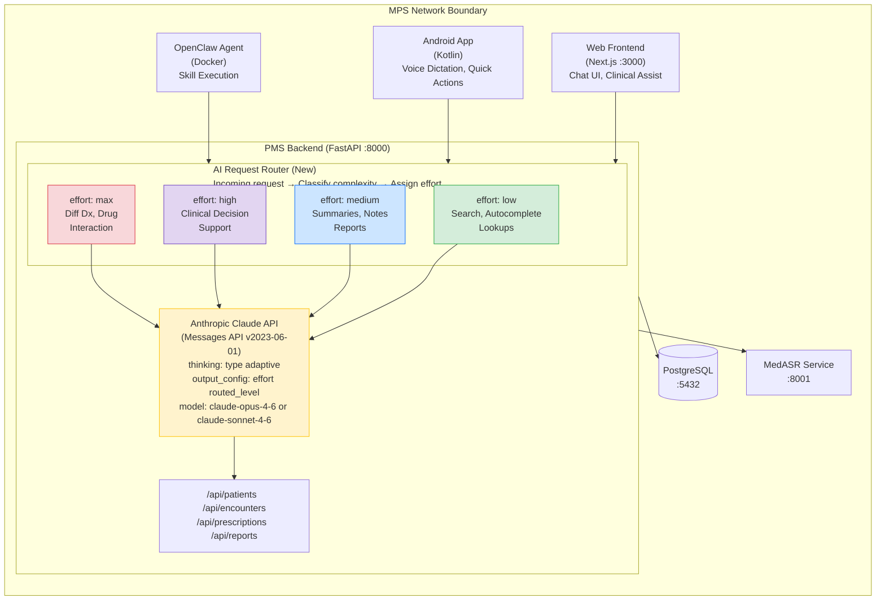

# Product Requirements Document: Adaptive Thinking Integration into Patient Management System (PMS)

**Document ID:** PRD-PMS-ADAPTIVETHINKING-001
**Version:** 1.0
**Date:** February 19, 2026
**Author:** Ammar (CEO, MPS Inc.)
**Status:** Draft

---

## 1. Executive Summary

Adaptive Thinking is a new reasoning capability introduced by Anthropic in Claude 4.6 (Opus and Sonnet) that allows the model to **dynamically determine when and how much to reason** based on task complexity. Instead of developers manually setting a fixed thinking token budget, Claude now evaluates each request and allocates reasoning effort proportionally — thinking deeply on complex clinical questions while responding directly to simple ones.

Integrating Adaptive Thinking into the PMS replaces the current static extended thinking configuration used by our AI-powered features (OpenClaw agentic workflows, Tambo analytics, clinical documentation assistance). This delivers three key benefits: **better clinical accuracy** on complex tasks like medication interaction analysis and differential diagnosis support, **lower latency and cost** on routine tasks like patient lookup and appointment scheduling, and **improved agentic workflow performance** through interleaved thinking that enables Claude to reason between tool calls rather than only at the start of a turn.

At medium effort, Claude matches the previous Sonnet 4.5 benchmark scores while using **76% fewer output tokens**. At high effort, it exceeds Sonnet 4.5 by 4.3 percentage points on SWE-bench Verified while using **48% fewer tokens**. For a healthcare system processing hundreds of AI-assisted interactions daily, this translates directly to reduced API costs and faster response times without sacrificing clinical reasoning quality.

---

## 2. Problem Statement

The current PMS AI integration uses Claude's extended thinking with a **fixed budget_tokens** parameter across all API calls. This creates several problems:

- **One-size-fits-all reasoning:** A simple patient name lookup uses the same 10,000-token thinking budget as a complex medication interaction analysis. This wastes tokens (and money) on trivial tasks and may under-allocate reasoning for complex clinical questions.
- **Manual budget tuning:** Developers must guess the right `budget_tokens` value for each endpoint. Too low and clinical accuracy suffers; too high and latency/cost increase. Different clinical workflows have different complexity profiles, making a single budget suboptimal.
- **No inter-tool reasoning:** With the current `thinking: {type: "enabled"}` configuration, Claude thinks only once at the start of a turn. In agentic workflows (OpenClaw), Claude cannot reason about tool results before making the next tool call — it must plan everything upfront, leading to less intelligent multi-step workflows.
- **Deprecated API path:** Anthropic has deprecated `thinking: {type: "enabled", budget_tokens: N}` on Opus 4.6 and Sonnet 4.6. While it still works, it will be removed in a future release. Migrating now avoids a forced migration later.
- **Inconsistent effort levels:** Some PMS features need maximum reasoning (clinical decision support) while others need speed (autocomplete, search). There is no unified mechanism to express this intent to the model.

---

## 3. Proposed Solution

Migrate all PMS Claude API calls from `thinking: {type: "enabled", budget_tokens: N}` to `thinking: {type: "adaptive"}` with the `effort` parameter, and implement a request-level effort routing system that assigns the appropriate effort level based on the clinical context of each request.

### 3.1 Architecture Overview

### 3.2 Deployment Model

- **Cloud API:** Adaptive Thinking is a parameter-level change to the existing Anthropic Messages API. No new infrastructure is required — the change is entirely in how the PMS backend constructs API requests.
- **No PHI leaves the network for inference:** Audio processing (MedASR) remains on-premise. Only text-based prompts are sent to the Anthropic API, following existing HIPAA-compliant patterns with de-identified or minimum-necessary PHI.
- **Model selection:** Use Opus 4.6 (`claude-opus-4-6`) for clinical decision support and complex reasoning. Use Sonnet 4.6 (`claude-sonnet-4-6`) for routine tasks where speed and cost matter more. Both support adaptive thinking.
- **BAA coverage:** Anthropic offers a Business Associate Agreement (BAA) for HIPAA-covered use cases via their API. The existing BAA covers adaptive thinking as it is a standard API feature.

---

## 4. PMS Data Sources

Adaptive Thinking affects every PMS API that calls the Anthropic Claude API. The effort level is determined by which data source and clinical context the request involves:

| API Endpoint | Effort Level | Rationale |
|---|---|---|
| `/api/patients` (search, autocomplete) | **low** | Simple lookup tasks that need speed, not deep reasoning |
| `/api/patients` (clinical summary generation) | **high** | Synthesizing patient history requires multi-step reasoning |
| `/api/encounters` (note drafting from dictation) | **medium** | Structured extraction from MedASR transcription — moderate complexity |
| `/api/encounters` (differential diagnosis support) | **max** | Safety-critical clinical reasoning requiring deepest analysis (Opus 4.6 only) |
| `/api/prescriptions` (drug interaction check) | **max** | Patient safety: must reason thoroughly about contraindications (Opus 4.6 only) |
| `/api/prescriptions` (refill automation) | **low** | Routine task with well-defined rules |
| `/api/reports` (analytics summary) | **medium** | Moderate reasoning to synthesize trends from data |
| `/api/reports` (regulatory compliance report) | **high** | Complex analysis requiring careful reasoning |
| OpenClaw skill execution | **high** | Agentic workflows benefit from interleaved thinking between tool calls |
| Tambo conversational queries | **medium** | Conversational analytics — balance speed with quality |

---

## 5. Component/Module Definitions

### 5.1 AI Request Router

| Property | Value |
|---|---|
| **Description** | Middleware component that classifies incoming AI requests by clinical complexity and assigns the appropriate effort level and model |
| **Input** | API request context: endpoint, patient data sensitivity, clinical workflow type |
| **Output** | Effort level (`low`/`medium`/`high`/`max`) and model selection (`opus-4-6`/`sonnet-4-6`) |
| **PMS APIs Used** | All endpoints that invoke Claude |

### 5.2 Adaptive Thinking Client Wrapper

| Property | Value |
|---|---|
| **Description** | Wrapper around the Anthropic Python SDK that replaces all `thinking: {type: "enabled", budget_tokens: N}` calls with `thinking: {type: "adaptive"}` and routes effort levels |
| **Input** | Prompt, effort level, model, tools (if any) |
| **Output** | Claude response with thinking blocks (when model decides to think) and text blocks |
| **PMS APIs Used** | N/A (internal service layer) |

### 5.3 Thinking Telemetry Collector

| Property | Value |
|---|---|
| **Description** | Observability component that logs thinking token usage, effort levels, and response quality metrics per request for cost monitoring and optimization |
| **Input** | Claude API response metadata (usage.input_tokens, usage.output_tokens, effort level, thinking block presence) |
| **Output** | Telemetry records in PostgreSQL for dashboard visualization |
| **PMS APIs Used** | `/api/reports` (analytics dashboard) |

### 5.4 Streaming Thinking UI Component

| Property | Value |
|---|---|
| **Description** | React component for the Next.js frontend that displays thinking progress when Claude reasons through complex clinical questions |
| **Input** | SSE stream from Claude API via PMS backend |
| **Output** | Real-time display of thinking summary + final response |
| **PMS APIs Used** | `/api/encounters`, `/api/prescriptions` (clinical assist features) |

### 5.5 Interleaved Thinking Agent Adapter

| Property | Value |
|---|---|
| **Description** | Adapter for OpenClaw that enables interleaved thinking — Claude reasons between each tool call instead of only at the start |
| **Input** | OpenClaw skill execution context with tool definitions |
| **Output** | Multi-step agentic workflow with intermediate reasoning |
| **PMS APIs Used** | All endpoints accessed by OpenClaw skills |

---

## 6. Non-Functional Requirements

### 6.1 Security and HIPAA Compliance

| Requirement | Implementation |
|---|---|
| **PHI in prompts** | Follow existing minimum-necessary principle: only include PHI required for the specific clinical task. De-identify where possible. |
| **Thinking block handling** | Thinking summaries may contain PHI reasoning. Never log thinking block content to application logs. Store only in encrypted database fields if needed for audit. |
| **Redacted thinking** | Handle `redacted_thinking` blocks gracefully in UI — display "Some reasoning has been encrypted for safety" rather than raw encrypted data. |
| **Encryption in transit** | All Anthropic API calls use HTTPS/TLS 1.3. No change from current setup. |
| **Audit logging** | Log: request ID, effort level, model, input/output token counts, thinking token counts, endpoint, provider ID. Never log prompt content or thinking content to audit logs. |
| **BAA compliance** | Ensure Anthropic BAA covers adaptive thinking usage. No architectural change — same API endpoint, same BAA scope. |

### 6.2 Performance

| Metric | Target |
|---|---|
| **Latency (low effort)** | < 1 second for simple lookups and autocomplete |
| **Latency (medium effort)** | < 3 seconds for note summaries and report generation |
| **Latency (high effort)** | < 8 seconds for clinical decision support |
| **Latency (max effort)** | < 15 seconds for differential diagnosis and drug interaction analysis |
| **Token cost reduction** | 40-76% reduction on routine tasks (low/medium effort) vs. current fixed budget |
| **Streaming** | All high/max effort requests stream responses to avoid HTTP timeouts |
| **Concurrent requests** | Support 50+ concurrent Claude API calls across all effort levels |

### 6.3 Infrastructure

| Requirement | Specification |
|---|---|
| **Anthropic SDK** | `anthropic` Python SDK >= 0.45.0 (adaptive thinking support) |
| **Anthropic JS SDK** | `@anthropic-ai/sdk` >= 0.40.0 (frontend streaming support) |
| **API version** | `anthropic-version: 2023-06-01` (no change) |
| **No new infrastructure** | Adaptive thinking is an API parameter change — no new servers, containers, or services |
| **Environment variables** | `ANTHROPIC_API_KEY`, `CLAUDE_DEFAULT_MODEL`, `CLAUDE_DEFAULT_EFFORT` |

---

## 7. Implementation Phases

### Phase 1: Foundation — SDK Migration (Sprints 1-2)

- Upgrade Anthropic Python SDK to latest version with adaptive thinking support
- Create AI Request Router with effort-level mapping configuration
- Create Adaptive Thinking Client Wrapper replacing all `budget_tokens` calls
- Migrate all PMS backend Claude calls to `thinking: {type: "adaptive"}`
- Add effort level as a configurable parameter per endpoint
- Implement Thinking Telemetry Collector for cost monitoring
- Write unit tests for router and wrapper

### Phase 2: Core Integration (Sprints 3-4)

- Implement streaming thinking UI component for Next.js frontend
- Add thinking progress indicator to clinical decision support views
- Migrate OpenClaw agent to adaptive thinking with interleaved reasoning
- Implement per-endpoint effort routing (low/medium/high/max)
- Add model selection routing (Opus for complex, Sonnet for routine)
- Build telemetry dashboard showing token usage by effort level
- A/B test adaptive vs. fixed budget on clinical accuracy benchmarks

### Phase 3: Optimization (Sprints 5-6)

- Fine-tune effort routing based on telemetry data
- Implement dynamic effort escalation (start low, retry at higher effort on insufficient quality)
- Add prompt-level thinking guidance for edge cases
- Integrate effort parameter into Android app API calls
- Build cost forecasting dashboard based on effort distribution
- Document effort routing decision framework for new endpoints

---

## 8. Success Metrics

| Metric | Target | Measurement Method |
|---|---|---|
| API token cost reduction | 40% reduction on routine tasks | Compare monthly Anthropic invoice before/after migration |
| Response latency (routine tasks) | 50% reduction for low-effort requests | API response time logging |
| Clinical reasoning accuracy | No regression on complex clinical tasks | A/B test against fixed-budget baseline using clinician-rated accuracy |
| Agentic workflow quality | 20% improvement in multi-step task completion | OpenClaw skill success rate with interleaved thinking |
| Developer experience | All new endpoints use effort routing by default | Code review checklist compliance |
| Migration completeness | 100% of Claude API calls migrated | Grep for deprecated `budget_tokens` parameter |

---

## 9. Risks and Mitigations

| Risk | Impact | Mitigation |
|---|---|---|
| Claude skips thinking on clinically complex tasks at low effort | Reduced accuracy on safety-critical responses | Never use `low` or `medium` effort for clinical decision support or drug interaction checks. Enforce via AI Request Router configuration. |
| Adaptive thinking cost is unpredictable | Budget overruns from unexpected thinking depth | Set `max_tokens` as a hard ceiling. Monitor telemetry dashboard daily during rollout. Use effort parameter as soft guidance. |
| Summarized thinking loses critical reasoning details | Developers can't debug clinical reasoning failures | Thinking summaries preserve key ideas. For debugging, request full thinking access from Anthropic sales team. Log thinking block presence/absence for audit. |
| Model version deprecation | `budget_tokens` removal breaks existing code | Migrating now eliminates this risk. Phase 1 removes all deprecated parameters. |
| Redacted thinking blocks in clinical responses | Users confused by "encrypted reasoning" messages | Implement graceful UI handling — show "Some internal reasoning was encrypted for safety" with explanation. |
| Anthropic API outage affects all PMS AI features | Complete loss of AI-assisted clinical workflows | Implement fallback to non-AI workflows (manual forms, no autocomplete). Consider caching common responses. |

---

## 10. Dependencies

| Dependency | Type | Notes |
|---|---|---|
| Anthropic Claude API | Service | Messages API with adaptive thinking support. Requires `claude-opus-4-6` or `claude-sonnet-4-6`. |
| `anthropic` Python SDK >= 0.45.0 | Library | Adaptive thinking and effort parameter support |
| `@anthropic-ai/sdk` >= 0.40.0 | Library | TypeScript SDK for frontend streaming |
| Valid Anthropic API key | Credential | Stored in environment variables, never committed to code |
| Anthropic BAA | Legal | Business Associate Agreement covering HIPAA-compliant API usage |
| PMS Backend (FastAPI) :8000 | Service | All Claude API calls are proxied through the backend |
| PostgreSQL :5432 | Database | Telemetry storage for thinking usage metrics |
| OpenClaw Agent (Docker) | Service | Agentic workflows that benefit from interleaved thinking |
| MedASR Service :8001 | Service | Transcription output feeds into adaptive-thinking-powered note generation |

---

## 11. Comparison with Existing Experiments

| Dimension | Adaptive Thinking (08) | OpenClaw (05) | MedASR (07) | Tambo (00) |
|---|---|---|---|---|
| **Category** | AI Reasoning Optimization | Agentic AI Automation | Medical Speech Recognition | Conversational Analytics |
| **What it changes** | How Claude reasons across all AI features | What Claude can automate end-to-end | How clinician voice becomes text | How users query PMS data |
| **Infrastructure** | No new infrastructure — API parameter change | Docker container + skills engine | GPU Docker container | Self-hosted backend |
| **Complementarity** | Improves reasoning quality in OpenClaw, MedASR post-processing, and Tambo | Directly benefits from interleaved thinking | Transcription output processed by adaptive-thinking-powered extraction | Conversational queries benefit from effort-appropriate reasoning |

Adaptive Thinking is a **cross-cutting enhancement** that improves every existing AI integration. It is not a standalone feature but rather an optimization layer that makes OpenClaw smarter (interleaved thinking between tool calls), MedASR post-processing more accurate (high-effort clinical note extraction), and Tambo more responsive (low-effort conversational queries).

---

## 12. Research Sources

### Official Documentation

- [Anthropic Adaptive Thinking Docs](https://platform.claude.com/docs/en/build-with-claude/adaptive-thinking) — Core adaptive thinking API reference and usage patterns
- [Anthropic Effort Parameter Docs](https://platform.claude.com/docs/en/build-with-claude/effort) — Effort levels (low/medium/high/max) and routing guidance
- [Anthropic Extended Thinking Docs](https://platform.claude.com/docs/en/build-with-claude/extended-thinking) — Legacy budget_tokens API and migration path

### Model & Performance

- [Claude 4.6 What's New](https://platform.claude.com/docs/en/about-claude/models/whats-new-claude-4-6) — 76% fewer tokens at medium effort, interleaved thinking
- [Anthropic Pricing](https://platform.claude.com/docs/en/about-claude/pricing) — Token cost implications for effort routing
- [Claude's Extended Thinking (Anthropic Blog)](https://www.anthropic.com/news/visible-extended-thinking) — Original announcement and reasoning capabilities overview

### Integration & Ecosystem

- [Extended Thinking on Amazon Bedrock](https://docs.aws.amazon.com/bedrock/latest/userguide/claude-messages-extended-thinking.html) — AWS Bedrock integration for adaptive thinking
- [Anthropic Effort Parameter (liteLLM)](https://docs.litellm.ai/docs/providers/anthropic_effort) — Third-party proxy support for effort routing

---

## 13. Appendix: Related Documents

- [Adaptive Thinking Setup Guide](08-AdaptiveThinking-PMS-Developer-Setup-Guide.md) — SDK migration, effort routing, streaming integration
- [Adaptive Thinking Developer Tutorial](08-AdaptiveThinking-Developer-Tutorial.md) — Hands-on onboarding: build effort-routed AI features
- [OpenClaw PRD](05-PRD-OpenClaw-PMS-Integration.md) — Agentic workflows enhanced by interleaved thinking
- [MedASR PRD](07-PRD-MedASR-PMS-Integration.md) — Speech recognition with adaptive post-processing
- [Tambo PRD](00-PRD-Tambo-PMS-Integration.md) — Conversational analytics with effort-appropriate reasoning
- [Anthropic Adaptive Thinking Docs](https://platform.claude.com/docs/en/build-with-claude/adaptive-thinking)
- [Anthropic Effort Parameter Docs](https://platform.claude.com/docs/en/build-with-claude/effort)
- [Anthropic Extended Thinking Docs](https://platform.claude.com/docs/en/build-with-claude/extended-thinking)
- [Claude 4.6 What's New](https://platform.claude.com/docs/en/about-claude/models/whats-new-claude-4-6)
- [Anthropic Pricing](https://platform.claude.com/docs/en/about-claude/pricing)
