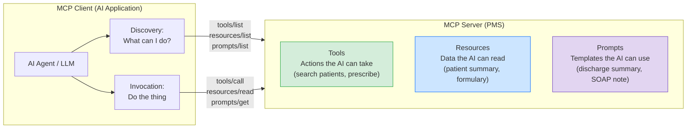
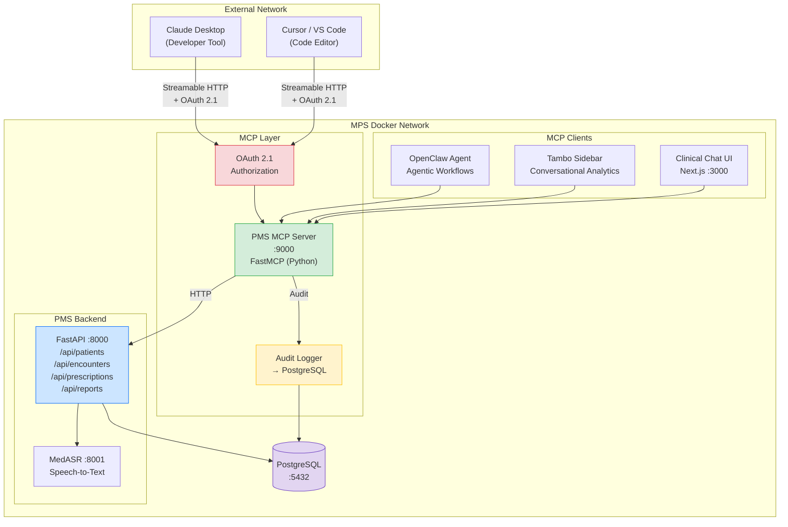

# MCP (Model Context Protocol) Developer Onboarding Tutorial

**Welcome to the MPS PMS MCP Integration Team**

This tutorial will take you from zero to building your first MCP integration with the PMS. By the end, you will understand how MCP works, have a running local environment, and have built and tested a custom tool, resource, and prompt end-to-end.

**Document ID:** PMS-EXP-MCP-002
**Version:** 1.0
**Date:** February 19, 2026
**Applies To:** PMS project (all platforms)
**Prerequisite:** [MCP Setup Guide](09-MCP-PMS-Developer-Setup-Guide.md)
**Estimated time:** 2-3 hours
**Difficulty:** Beginner-friendly

---

## What You Will Learn

1. What problem MCP solves in the PMS and why it matters for healthcare AI
2. How MCP's three primitives (Tools, Resources, Prompts) work
3. How the MCP client-server architecture maps to the PMS stack
4. How to verify your local MCP environment is working
5. How to build a custom MCP tool that queries PMS patient data
6. How to build an MCP resource that exposes clinical context
7. How to build an MCP prompt template for clinical documentation
8. How to connect Claude Desktop to the PMS MCP server
9. How to evaluate MCP's strengths and weaknesses for healthcare
10. How to debug common MCP issues using logs and the inspector

---

## Part 1: Understanding MCP (15 min read)

### 1.1 What Problem Does MCP Solve?

Imagine a clinic where the clinical staff use multiple AI tools every day:

- **OpenClaw** automates prior authorization by calling the PMS patient API, the encounters API, and the prescriptions API using custom Python "skill" classes
- **Tambo** provides a conversational analytics sidebar that queries the same APIs using its own tool definition format
- **Claude Desktop** is used by the dev team for debugging, but it has no way to access PMS data at all
- **A new AI triage tool** the team wants to evaluate would need yet another adapter

Each of these AI systems talks to the **same PMS data** but through **different, hand-built connectors**. Every time a new PMS endpoint is added (`/api/lab-results`), someone has to update OpenClaw's skills, Tambo's tools, and any other AI integration. It's an N x M problem.

**MCP solves this by providing one protocol that all AI systems speak.** The PMS exposes its APIs once through an MCP server, and every AI client — OpenClaw, Tambo, Claude Desktop, the new triage tool — discovers and calls those APIs through the same standardized protocol. Add a new endpoint? Every AI client sees it automatically.

### 1.2 How MCP Works — The Key Pieces

MCP has three core primitives:



| Primitive | Analogy | PMS Example | Who Controls It |
|---|---|---|---|
| **Tool** | A POST endpoint — does something | `search_patients`, `prescribe_medication` | The AI model decides when to call it |
| **Resource** | A GET endpoint — reads data | `pms://patients/42/summary` | The user or application requests it |
| **Prompt** | A template — structures interaction | `discharge_summary` template | The user selects it |

Communication happens over **JSON-RPC 2.0** using one of three transports:

| Transport | Use Case | PMS Usage |
|---|---|---|
| **Streamable HTTP** | Remote servers, production | Primary (port 9000) |
| **stdio** | Local development, CLI tools | Local dev/testing |
| **SSE** (legacy) | Older clients | Not used |

### 1.3 How MCP Fits with Other PMS Technologies

| Technology | Experiment | Relationship to MCP |
|---|---|---|
| **OpenClaw** | 05 | Currently uses custom skills → will migrate to MCP client that discovers PMS tools at runtime |
| **Tambo** | 00 | Currently registers its own tool definitions → will migrate to MCP tool discovery |
| **MedASR** | 07 | Speech-to-text service → could expose transcription as an MCP tool; MCP could orchestrate dictation-to-note pipeline |
| **Adaptive Thinking** | 08 | Controls how Claude reasons (effort routing) → orthogonal to MCP; MCP handles data access, Adaptive Thinking handles reasoning depth |
| **Storybook** | 01 | UI component documentation → unrelated to MCP |
| **v0 / Banani** | 02/03 | Code generation tools → could consume MCP to generate PMS-specific code |

### 1.4 Key Vocabulary

| Term | Meaning |
|---|---|
| **MCP Server** | A program that exposes tools, resources, and prompts via the MCP protocol |
| **MCP Client** | An AI application that connects to an MCP server to discover and use capabilities |
| **Tool** | A function the AI model can invoke (like an API endpoint) |
| **Resource** | Read-only data the application can fetch (like a document or summary) |
| **Prompt** | A reusable template that structures the AI's interaction pattern |
| **Transport** | The communication layer (Streamable HTTP, stdio, or SSE) |
| **JSON-RPC** | The message format MCP uses — every request has `jsonrpc`, `id`, `method`, and `params` |
| **FastMCP** | A Python framework that makes building MCP servers easy — decorators for tools, resources, and prompts |
| **Streamable HTTP** | The modern MCP transport over HTTP with optional server-sent event streaming |
| **Tool Discovery** | The process where a client calls `tools/list` to learn what tools are available |
| **OAuth 2.1 + PKCE** | The authentication standard MCP uses for securing access to servers |
| **AAIF** | Agentic AI Foundation (Linux Foundation) — governs the MCP specification since Dec 2025 |

### 1.5 Our Architecture



---

## Part 2: Environment Verification (15 min)

### 2.1 Checklist

Complete each step before proceeding:

1. **PMS Backend is running:**
   ```bash
   curl -s http://localhost:8000/health
   # ✓ Returns {"status": "healthy"}
   ```

2. **PostgreSQL is accepting connections:**
   ```bash
   docker exec pms-postgres pg_isready -U pms
   # ✓ Returns "accepting connections"
   ```

3. **PMS MCP Server is running:**
   ```bash
   curl -s http://localhost:9000/health
   # ✓ Returns server health with tool counts
   ```

4. **MCP tools are discoverable:**
   ```bash
   curl -s -X POST http://localhost:9000/mcp \
     -H "Content-Type: application/json" \
     -d '{"jsonrpc":"2.0","id":1,"method":"tools/list"}' | python3 -m json.tool
   # ✓ Returns JSON with 7+ tools listed
   ```

5. **MCP CLI is installed:**
   ```bash
   mcp --version
   # ✓ Returns version number
   ```

6. **Python dependencies are installed:**
   ```bash
   cd services/mcp-server && uv run python -c "import fastmcp; print(fastmcp.__version__)"
   # ✓ Returns FastMCP version
   ```

### 2.2 Quick Test

Run this one-liner to verify the full pipeline (MCP server → PMS backend → database):

```bash
curl -s -X POST http://localhost:9000/mcp \
  -H "Content-Type: application/json" \
  -d '{
    "jsonrpc": "2.0",
    "id": 1,
    "method": "tools/call",
    "params": {
      "name": "search_patients",
      "arguments": {"query": "test", "limit": 3}
    }
  }' | python3 -m json.tool
```

If you see patient results (or an empty list with a successful response), the full pipeline is working.

---

## Part 3: Build Your First Integration (45 min)

### 3.1 What We Are Building

We will build a **Patient Medication Review Tool** — an MCP tool that takes a patient ID and returns a consolidated medication review including:
- Current prescriptions
- Drug-drug interaction warnings
- Adherence notes

This combines data from multiple PMS endpoints into a single MCP tool call, demonstrating how MCP tools can provide higher-level abstractions over raw APIs.

### 3.2 Create the Tool

Add the following to `services/mcp-server/server.py`, just before the `# --- MCP Resources ---` section:

```python
# --- Custom MCP Tool: Medication Review ---

@mcp.tool()
async def medication_review(patient_id: int) -> dict:
    """Perform a comprehensive medication review for a patient.

    Aggregates current prescriptions, checks for drug-drug interactions,
    and returns a structured review suitable for clinical decision support.

    Args:
        patient_id: The patient whose medications to review
    """
    async with httpx.AsyncClient() as client:
        # Step 1: Get patient info
        patient_resp = await client.get(
            f"{PMS_BACKEND_URL}/api/patients/{patient_id}"
        )
        patient_resp.raise_for_status()
        patient = patient_resp.json()

        # Step 2: Get active prescriptions
        rx_resp = await client.get(
            f"{PMS_BACKEND_URL}/api/prescriptions",
            params={"patient_id": patient_id},
        )
        rx_resp.raise_for_status()
        prescriptions = rx_resp.json()

        # Step 3: Check interactions (if 2+ medications)
        medication_ids = [rx.get("medication_id") for rx in prescriptions if rx.get("medication_id")]
        interactions = []
        if len(medication_ids) >= 2:
            ix_resp = await client.post(
                f"{PMS_BACKEND_URL}/api/prescriptions/interactions",
                json={"medication_ids": medication_ids},
            )
            if ix_resp.status_code == 200:
                interactions = ix_resp.json().get("interactions", [])

    return {
        "patient_id": patient_id,
        "patient_name": patient.get("name", "Unknown"),
        "review_date": datetime.now().isoformat(),
        "total_medications": len(prescriptions),
        "prescriptions": prescriptions,
        "interactions": interactions,
        "interaction_count": len(interactions),
        "status": "review_complete",
    }
```

### 3.3 Create a Custom Resource

Add a resource that provides a medication summary in human-readable form:

```python
@mcp.resource("pms://patients/{patient_id}/medications")
async def patient_medications(patient_id: int) -> str:
    """Get a human-readable medication list for a patient."""
    async with httpx.AsyncClient() as client:
        rx_resp = await client.get(
            f"{PMS_BACKEND_URL}/api/prescriptions",
            params={"patient_id": patient_id},
        )
        rx_resp.raise_for_status()
        prescriptions = rx_resp.json()

    if not prescriptions:
        return f"Patient {patient_id} has no active prescriptions."

    lines = [f"Active Medications for Patient {patient_id}:", ""]
    for i, rx in enumerate(prescriptions, 1):
        lines.append(
            f"{i}. {rx.get('medication_name', 'Unknown')} "
            f"{rx.get('dosage', '')} — {rx.get('frequency', '')} "
            f"(prescribed: {rx.get('prescribed_date', 'N/A')})"
        )

    return "\n".join(lines)
```

### 3.4 Create a Custom Prompt

Add a prompt template for medication reconciliation with clinical context:

```python
@mcp.prompt()
def medication_review_prompt(patient_id: int, reason: str = "routine") -> str:
    """Generate a clinician-facing medication review prompt.

    Args:
        patient_id: The patient whose medications to review
        reason: Reason for review (routine, admission, discharge, adverse_event)
    """
    return (
        f"Perform a medication review for patient ID {patient_id}.\n"
        f"Review reason: {reason}\n\n"
        "Steps:\n"
        "1. Call medication_review tool to get the full review data\n"
        "2. Read pms://patients/{patient_id}/medications for current med list\n"
        "3. Analyze the interactions list for severity\n"
        "4. Check for:\n"
        "   - Therapeutic duplications\n"
        "   - Dose appropriateness for patient age/weight\n"
        "   - Contraindications with known allergies\n"
        "   - Adherence concerns\n"
        "5. Produce a structured report with:\n"
        "   - Medication list with status\n"
        "   - Interaction warnings (sorted by severity)\n"
        "   - Recommendations for the prescriber\n"
    )
```

### 3.5 Restart and Test

```bash
# Restart the MCP server to pick up changes
docker compose restart pms-mcp-server

# Verify the new tool appears
curl -s -X POST http://localhost:9000/mcp \
  -H "Content-Type: application/json" \
  -d '{"jsonrpc":"2.0","id":1,"method":"tools/list"}' \
  | python3 -m json.tool | grep medication_review
# Should show "medication_review" in the tools list

# Call the new tool
curl -s -X POST http://localhost:9000/mcp \
  -H "Content-Type: application/json" \
  -d '{
    "jsonrpc": "2.0",
    "id": 2,
    "method": "tools/call",
    "params": {
      "name": "medication_review",
      "arguments": {"patient_id": 1}
    }
  }' | python3 -m json.tool
```

### 3.6 Test with Claude Desktop

1. Restart Claude Desktop (to refresh the tool list)
2. Ask Claude: **"Do a medication review for patient 1"**
3. Claude should discover and call the `medication_review` tool
4. You should see the structured review data returned

**Checkpoint:** You've built a custom MCP tool, resource, and prompt. All three are discoverable and callable through the MCP protocol. Claude Desktop can invoke them.

---

## Part 4: Evaluating Strengths and Weaknesses (15 min)

### 4.1 Strengths

| Strength | Detail |
|---|---|
| **Industry standard** | Adopted by OpenAI, Google, Microsoft, and 97M+ monthly SDK downloads. Safe long-term investment |
| **Runtime discovery** | AI clients discover capabilities at runtime via `tools/list` — no hardcoded integrations |
| **Multi-client** | One MCP server serves every AI client: OpenClaw, Tambo, Claude Desktop, Cursor, custom tools |
| **Type-safe schemas** | Tools are described with JSON Schema — automatic validation, documentation, and IDE autocompletion |
| **FastMCP DX** | Build tools with Python decorators — schema generation, validation, and docs are automatic |
| **Transport flexibility** | Streamable HTTP for production, stdio for development — same server code works with both |
| **Governed specification** | Managed by the Linux Foundation's AAIF — not controlled by any single vendor |
| **Composability** | MCP clients can connect to multiple MCP servers simultaneously — PMS + external services |

### 4.2 Weaknesses

| Weakness | Detail |
|---|---|
| **Additional infrastructure** | Another Docker service to maintain (port 9000), another thing that can go down |
| **Latency overhead** | JSON-RPC serialization + transport adds ~20-50ms per call vs direct API calls |
| **OAuth complexity** | OAuth 2.1 + PKCE is more complex than simple API keys for internal services |
| **Young specification** | Spec was first released Nov 2024; still evolving (Nov 2025 was a breaking change) |
| **Limited streaming** | While Streamable HTTP supports SSE, streaming large datasets is less ergonomic than direct API streaming |
| **No built-in rate limiting** | Rate limiting must be implemented by the server — MCP spec doesn't provide it |
| **Debugging tools** | The MCP Inspector exists but is less mature than REST debugging tools (Postman, curl) |

### 4.3 When to Use MCP vs Alternatives

| Scenario | Use MCP? | Alternative |
|---|---|---|
| Multiple AI clients need PMS data | **Yes** — MCP eliminates N x M adapters | N/A |
| Single internal tool calling PMS | **Maybe** — only if you want future extensibility | Direct REST calls with function calling |
| Real-time streaming of clinical data | **No** — use WebSocket or SSE directly | WebSocket from FastAPI |
| External developers building PMS plugins | **Yes** — MCP provides standardized access | Custom SDK or REST API docs |
| Simple chatbot with 2-3 tool calls | **Maybe** — overhead may not be justified | Direct function calling (Anthropic/OpenAI) |
| AI-assisted code development against PMS | **Yes** — Claude Desktop/Cursor can connect | Manual API documentation |

### 4.4 HIPAA / Healthcare Considerations

| Aspect | Assessment | Recommendation |
|---|---|---|
| **PHI in tool parameters** | Tool arguments may contain patient IDs, names, or MRNs | Redact PHI from audit logs; never log full tool arguments in production |
| **PHI in tool responses** | Tool results contain clinical data (diagnoses, medications) | Encrypt responses in transit (TLS 1.3); do not cache responses containing PHI |
| **External client access** | Claude Desktop connects from outside the Docker network | Require OAuth 2.1 with PKCE for all external clients; short token expiry (15 min) |
| **Audit trail** | HIPAA requires a log of who accessed what PHI and when | MCP audit logger captures every tool invocation with user identity and timestamp |
| **Access control** | Different roles need different PMS access levels | OAuth scopes map to PMS roles: `pms:patient:read`, `pms:prescribe`, etc. |
| **Data minimization** | AI models should receive only the data they need | Design tools to return minimal necessary data; use resources for summaries instead of full records |
| **Business Associate Agreement** | If AI processing happens outside your infrastructure | MCP server runs on-premise inside Docker — no external data processing for self-hosted deployments |

---

## Part 5: Debugging Common Issues (15 min read)

### Issue 1: "Method not found" Error

**Symptom:** JSON-RPC response: `{"error": {"code": -32601, "message": "Method not found"}}`

**Cause:** The client is calling a method that doesn't match the MCP spec (e.g., `tool/call` instead of `tools/call`).

**Fix:** Verify the method name matches the spec exactly:
- `tools/list`, `tools/call`
- `resources/list`, `resources/read`
- `prompts/list`, `prompts/get`
- `initialize`, `ping`

### Issue 2: Tool Returns Empty Results

**Symptom:** The tool call succeeds but returns empty data.

**Cause:** The PMS backend has no data matching the query, or the backend endpoint returns a different response format than expected.

**Fix:**
```bash
# Test the backend directly
curl -s http://localhost:8000/api/patients?search=Smith | python3 -m json.tool

# Compare with the MCP tool result
# If backend returns data but MCP doesn't, check the server.py tool implementation
```

### Issue 3: Connection Reset During Long Tool Calls

**Symptom:** MCP tool call times out or connection resets for slow operations (e.g., report generation).

**Cause:** The Streamable HTTP transport has a default timeout that may be too short for long-running operations.

**Fix:**
- Increase the `httpx` timeout in server.py: `httpx.AsyncClient(timeout=60.0)`
- For very long operations, implement MCP Tasks (async pattern) instead of synchronous tool calls
- Check Docker healthcheck timeout settings

### Issue 4: OAuth Token Not Accepted

**Symptom:** External client gets `403 Forbidden` even with a valid token.

**Cause:** The token's OAuth scopes don't include the required scope for the tool being called.

**Fix:**
```bash
# Decode the JWT to inspect scopes
echo "<token>" | cut -d. -f2 | base64 -d | python3 -m json.tool

# Verify the required scope matches what's in the token
# e.g., prescribe_medication requires "pms:prescribe" scope
```

### Issue 5: MCP Inspector Can't Connect

**Symptom:** The MCP Inspector tool shows "Connection failed."

**Cause:** The inspector is trying to connect on the wrong URL or the server only accepts connections from specific origins.

**Fix:**
```bash
# Run the MCP Inspector
npx @modelcontextprotocol/inspector

# It will open a browser UI — enter your server URL:
# http://localhost:9000/mcp

# If CORS is blocking, add CORS headers to the MCP server config
```

### Reading MCP Server Logs

```bash
# Tail logs with timestamps
docker compose logs -f pms-mcp-server --timestamps

# Key log patterns to watch:
# [INFO] Tool called: search_patients        → Successful tool invocation
# [ERROR] Backend unreachable                → PMS backend is down
# [WARN] Token expired for client: xyz       → OAuth token needs refresh
# [ERROR] JSON-RPC parse error               → Malformed client request
```

---

## Part 6: Practice Exercise (45 min)

### Option A: Build an Encounter Summary Tool (Recommended)

Build an MCP tool called `encounter_summary` that takes an `encounter_id` and returns a structured summary combining encounter details, patient info, and medications prescribed during that encounter.

**Hints:**
1. Call `/api/encounters/{encounter_id}` to get the encounter
2. Use the `patient_id` from the encounter to call `/api/patients/{patient_id}`
3. Filter prescriptions by encounter date
4. Return a structured dict with sections: demographics, encounter details, medications

### Option B: Build a Clinical Dashboard Resource

Build an MCP resource at `pms://dashboard/today` that returns today's clinical dashboard — total patients, total encounters, pending prescriptions.

**Hints:**
1. Call `/api/reports` with `report_type="daily_census"`
2. Format the result as a human-readable string
3. Register as `@mcp.resource("pms://dashboard/today")`

### Option C: Build a Referral Letter Prompt

Build an MCP prompt template for generating a referral letter from one provider to another.

**Hints:**
1. Accept `patient_id`, `from_provider`, `to_provider`, and `reason` as parameters
2. The prompt should instruct the AI to use `get_patient` and `list_encounters` tools
3. Include sections: patient summary, reason for referral, relevant history, specific questions for specialist

---

## Part 7: Development Workflow and Conventions

### 7.1 File Organization

```
services/
└── mcp-server/
    ├── server.py              # Main MCP server (tools, resources, prompts)
    ├── auth.py                # OAuth 2.1 authorization server
    ├── audit.py               # Audit logging middleware
    ├── pyproject.toml         # Python dependencies
    ├── Dockerfile             # Container definition
    ├── .env                   # Environment variables (not committed)
    ├── .env.example           # Environment template
    └── tests/
        ├── test_tools.py      # Tool unit tests
        ├── test_resources.py  # Resource unit tests
        ├── test_prompts.py    # Prompt unit tests
        └── test_auth.py       # OAuth flow tests
```

### 7.2 Naming Conventions

| Item | Convention | Example |
|---|---|---|
| Tool function name | `snake_case`, verb-first | `search_patients`, `check_interactions` |
| Resource URI | `pms://{domain}/{id}/{view}` | `pms://patients/42/summary` |
| Prompt function name | `snake_case`, noun-based | `discharge_summary`, `encounter_note` |
| Docker service name | `pms-mcp-server` | — |
| Environment variables | `UPPER_SNAKE_CASE` | `PMS_BACKEND_URL` |
| OAuth scopes | `pms:{domain}:{action}` | `pms:patient:read`, `pms:prescribe` |
| Audit log table | `mcp_audit_log` | — |

### 7.3 PR Checklist

When submitting a PR that involves MCP changes:

- [ ] New tools have descriptive docstrings with Args section
- [ ] New tools have corresponding unit tests in `tests/test_tools.py`
- [ ] New resources use the `pms://` URI scheme
- [ ] New prompts include instructions for which tools to use
- [ ] OAuth scopes are defined for any new tool that accesses PHI
- [ ] Audit logging covers the new tool/resource/prompt
- [ ] No PHI is logged in tool parameters (audit log redaction verified)
- [ ] Claude Desktop tested with the new tool (manual verification)
- [ ] `tools/list` output verified (all tools discoverable)
- [ ] Docker build succeeds and health check passes
- [ ] Setup guide updated if new configuration is required

### 7.4 Security Reminders

1. **Never log PHI**: Audit logs should record tool names and parameter keys, but redact parameter values that contain patient data
2. **Always validate input**: Use FastMCP's automatic JSON Schema validation — don't skip it
3. **Short-lived tokens**: OAuth access tokens expire in 15 minutes — don't extend this in production
4. **Scope checks**: Every tool that accesses PHI must verify the client's OAuth scope before executing
5. **Network isolation**: The MCP server runs inside the Docker network — only port 9000 is exposed; never expose port 8000 (backend) directly to MCP clients
6. **No PHI in error messages**: Catch exceptions and return generic error messages — never include patient data in error responses
7. **TLS everywhere**: All external Streamable HTTP connections must use TLS 1.3

---

## Part 8: Quick Reference Card

### Key Commands

| Action | Command |
|---|---|
| Start MCP server | `docker compose up -d pms-mcp-server` |
| Stop MCP server | `docker compose stop pms-mcp-server` |
| View logs | `docker compose logs -f pms-mcp-server` |
| Rebuild | `docker compose build pms-mcp-server` |
| List tools | `mcp tools list --transport streamable-http --url http://localhost:9000/mcp` |
| Call a tool | `mcp tools call <name> --transport streamable-http --url http://localhost:9000/mcp --input '{...}'` |
| Run locally (dev) | `cd services/mcp-server && uv run fastmcp run server.py --transport streamable-http --port 9000` |
| Run inspector | `npx @modelcontextprotocol/inspector` |

### Key Files

| File | Purpose |
|---|---|
| `services/mcp-server/server.py` | MCP server entry point (tools, resources, prompts) |
| `services/mcp-server/.env` | Environment configuration |
| `services/mcp-server/Dockerfile` | Container definition |
| `docker-compose.yml` | Service orchestration (pms-mcp-server section) |
| `~/Library/Application Support/Claude/claude_desktop_config.json` | Claude Desktop MCP config (macOS) |

### Key URLs

| URL | Service |
|---|---|
| `http://localhost:9000/mcp` | MCP Server endpoint |
| `http://localhost:9000/health` | MCP Server health check |
| `http://localhost:8000` | PMS Backend (FastAPI) |
| `http://localhost:3000` | PMS Frontend (Next.js) |
| `https://modelcontextprotocol.io` | Official MCP docs |
| `https://gofastmcp.com` | FastMCP framework docs |

### Starter Template for a New Tool

```python
@mcp.tool()
async def my_new_tool(param1: str, param2: int = 10) -> dict:
    """One-line description of what this tool does.

    Detailed description for the AI model explaining when
    and how to use this tool.

    Args:
        param1: Description of param1
        param2: Description of param2 (default: 10)
    """
    async with httpx.AsyncClient() as client:
        response = await client.get(
            f"{PMS_BACKEND_URL}/api/endpoint",
            params={"key": param1, "limit": param2},
        )
        response.raise_for_status()
        return response.json()
```

---

## Next Steps

1. **Migrate OpenClaw to MCP client** — Replace custom skill classes with MCP tool discovery ([PRD Phase 2](09-PRD-MCP-PMS-Integration.md#phase-2-core-integration-sprints-3-4))
2. **Add resource subscriptions** — Enable real-time updates when patient data changes ([FastMCP docs](https://gofastmcp.com/))
3. **Connect Cursor and VS Code** — Set up MCP for AI-assisted PMS development ([TypeScript SDK](https://github.com/modelcontextprotocol/typescript-sdk))
4. **Implement MCP Tasks** — Add async support for long-running operations like report generation ([Spec: Tasks](https://modelcontextprotocol.io/specification/2025-11-25))
5. **Explore the MCP ecosystem** — Browse [5,800+ community MCP servers](https://github.com/modelcontextprotocol/servers) for inspiration and reusable patterns
