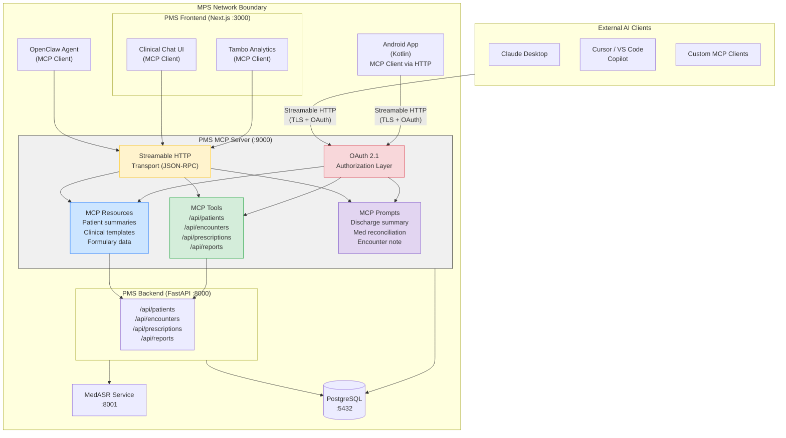

# Product Requirements Document: MCP (Model Context Protocol) Integration into Patient Management System (PMS)

**Document ID:** PRD-PMS-MCP-001
**Version:** 1.0
**Date:** February 19, 2026
**Author:** Ammar (CEO, MPS Inc.)
**Status:** Draft

---

## 1. Executive Summary

The Model Context Protocol (MCP) is an open standard — originally created by Anthropic in November 2024 and now governed by the Linux Foundation's Agentic AI Foundation (AAIF) — that provides a universal, JSON-RPC-based interface for connecting AI models and agents to external tools, data sources, and systems. MCP standardizes how AI applications discover, authenticate with, and invoke capabilities exposed by servers, replacing the current patchwork of ad-hoc integrations between the PMS's AI features and its backend services.

Integrating MCP into the PMS transforms every existing API endpoint — patient records, encounters, prescriptions, reporting — into a **discoverable, schema-described tool** that any MCP-compatible AI client can invoke. This means the PMS's existing AI integrations (OpenClaw agentic workflows, Tambo conversational analytics, Adaptive Thinking clinical decision support) no longer need bespoke API wiring: they discover PMS capabilities at runtime through MCP's standardized tool listing, resource subscription, and prompt template mechanisms. External developer tools (Claude Desktop, Cursor, VS Code Copilot) can also connect to the PMS MCP server for AI-assisted development and clinical debugging.

The protocol has achieved industry-wide adoption — with 97M+ monthly SDK downloads, 5,800+ registered servers, and endorsement from OpenAI, Google DeepMind, and Microsoft — making it a safe long-term investment. For a healthcare PMS handling protected health information (PHI), MCP's November 2025 specification adds OAuth 2.1 authorization, scoped access tokens, and audit-ready request tracing, providing a HIPAA-aligned security envelope for all AI-to-PMS interactions.

---

## 2. Problem Statement

The current PMS has multiple AI-powered features, each with its own integration pattern for accessing backend data:

- **Fragmented AI integrations:** OpenClaw uses custom Python skill classes to call PMS APIs. Tambo registers tool definitions in its own format. MedASR pipes audio through a dedicated FastAPI service. Each integration is a snowflake — different authentication, different error handling, different schemas. Adding a new AI feature requires writing another bespoke adapter.
- **No runtime capability discovery:** When an AI agent needs to interact with PMS data, the available endpoints and their schemas are hardcoded into the agent's configuration. If a new API is added (e.g., `/api/lab-results`), every AI integration must be manually updated to know about it. There is no mechanism for agents to dynamically discover what PMS capabilities are available.
- **Inconsistent authorization for AI access:** Different AI features use different authentication mechanisms to access PMS APIs — some use internal service tokens, some use the user's session, and some bypass authentication entirely because they run inside the Docker network. There is no unified authorization model for "AI agent accessing PMS on behalf of a clinician."
- **No external AI tooling access:** Developers cannot point Claude Desktop, Cursor, or VS Code Copilot at the PMS to assist with clinical data debugging or workflow testing. The PMS APIs are only accessible through their REST interface, which AI coding tools cannot natively consume.
- **Vendor lock-in risk:** Current integrations are tightly coupled to specific AI providers (Anthropic for OpenClaw/Adaptive Thinking, Tambo's proprietary format). If the team wants to evaluate a different model or agent framework, every integration must be rewritten.

---

## 3. Proposed Solution

Build a **PMS MCP Server** that wraps the existing FastAPI backend, exposing PMS API endpoints as MCP tools, clinical data as MCP resources, and reusable interaction patterns as MCP prompts. All AI features (OpenClaw, Tambo, Adaptive Thinking, MedASR) become **MCP clients** that discover and invoke PMS capabilities through the standardized protocol.

### 3.1 Architecture Overview

### 3.2 Deployment Model

| Aspect | Decision |
|---|---|
| **Hosting** | Self-hosted, co-located with PMS Backend in Docker Compose |
| **Transport** | Streamable HTTP (the MCP 2025-11-25 standard) over TLS |
| **Authentication** | OAuth 2.1 with PKCE, scoped to PMS roles (clinician, admin, read-only) |
| **PHI Handling** | MCP server runs inside the same Docker network as the PMS backend; PHI never leaves the network boundary |
| **Framework** | FastMCP (Python) — wraps existing FastAPI endpoints using `FastMCP.from_fastapi()` |
| **Container** | Dedicated `pms-mcp-server` Docker service on port 9000 |
| **HIPAA** | All requests logged with timestamp, user identity, tool invoked, and parameters; audit logs stored in PostgreSQL |

---

## 4. PMS Data Sources

The PMS MCP Server exposes the following existing PMS APIs as MCP tools and resources:

| PMS API | MCP Exposure | Description |
|---|---|---|
| `/api/patients` | **Tool:** `search_patients`, `get_patient`, `create_patient`, `update_patient` | Patient demographic and clinical data CRUD |
| `/api/encounters` | **Tool:** `list_encounters`, `get_encounter`, `create_encounter` | Clinical encounter records (visits, admissions) |
| `/api/prescriptions` | **Tool:** `list_prescriptions`, `prescribe_medication`, `check_interactions` | Medication orders, interaction checking |
| `/api/reports` | **Tool:** `generate_report`, `get_report` | Clinical and operational reports |
| Patient summaries | **Resource:** `pms://patients/{id}/summary` | Read-only patient summary (subscribable) |
| Formulary data | **Resource:** `pms://formulary/current` | Current medication formulary |
| Clinical templates | **Prompt:** `discharge_summary`, `encounter_note`, `med_reconciliation` | Reusable prompt templates for clinical documentation |

---

## 5. Component/Module Definitions

### 5.1 PMS MCP Server (`pms-mcp-server`)

**Description:** A FastMCP-based server that wraps the existing PMS FastAPI backend and exposes its capabilities through the MCP protocol.

- **Input:** JSON-RPC requests over Streamable HTTP from MCP clients
- **Output:** JSON-RPC responses containing tool results, resource data, or prompt templates
- **PMS APIs used:** All (`/api/patients`, `/api/encounters`, `/api/prescriptions`, `/api/reports`)
- **Technology:** Python, FastMCP, `mcp` SDK

### 5.2 OAuth Authorization Server (`pms-mcp-auth`)

**Description:** OAuth 2.1 authorization server that issues scoped access tokens for MCP clients, integrated with the existing PMS user/role system.

- **Input:** OAuth authorization requests (PKCE flow)
- **Output:** Scoped access tokens with PMS role claims
- **PMS APIs used:** PMS user authentication and role management APIs
- **Technology:** Python, `authlib`

### 5.3 MCP Audit Logger

**Description:** Middleware component that logs every MCP tool invocation with full traceability for HIPAA compliance.

- **Input:** Every MCP request/response passing through the server
- **Output:** Audit records written to PostgreSQL `mcp_audit_log` table
- **Fields logged:** Timestamp, client identity, tool/resource/prompt name, parameters (PHI redacted in logs), response status, latency

### 5.4 OpenClaw MCP Adapter

**Description:** Replaces OpenClaw's custom PMS skill classes with MCP client calls, allowing OpenClaw to discover and invoke PMS tools at runtime.

- **Input:** OpenClaw skill execution requests
- **Output:** PMS tool results via MCP
- **PMS APIs used:** Dynamically discovered via `tools/list`

### 5.5 Tambo MCP Adapter

**Description:** Replaces Tambo's custom tool definitions with MCP tool discovery, enabling Tambo to dynamically access PMS capabilities.

- **Input:** Tambo analytics queries requiring PMS data
- **Output:** PMS data via MCP tool calls
- **PMS APIs used:** Dynamically discovered via `tools/list`

### 5.6 Frontend MCP Client (Next.js)

**Description:** TypeScript MCP client integrated into the PMS Next.js frontend, enabling the clinical chat UI and Tambo sidebar to interact with PMS data through MCP.

- **Input:** User interactions in the clinical UI
- **Output:** MCP tool call results rendered in the UI
- **Technology:** `@modelcontextprotocol/sdk` TypeScript SDK

---

## 6. Non-Functional Requirements

### 6.1 Security and HIPAA Compliance

| Requirement | Implementation |
|---|---|
| **Authentication** | OAuth 2.1 with PKCE for all MCP clients; no anonymous access |
| **Authorization** | Role-based scoped tokens: `pms:patient:read`, `pms:patient:write`, `pms:prescribe`, `pms:report:generate` |
| **Transport encryption** | TLS 1.3 for all Streamable HTTP connections |
| **PHI containment** | MCP server runs inside Docker network; PHI never serialized to external transports without encryption |
| **Audit logging** | Every tool invocation logged with identity, timestamp, parameters, and response status |
| **Token expiry** | Access tokens expire after 15 minutes; refresh tokens after 8 hours |
| **Rate limiting** | Per-client rate limits: 100 tool calls/minute for automated agents, 30/minute for interactive clients |
| **Input validation** | All tool parameters validated against JSON Schema before execution |

### 6.2 Performance

| Metric | Target |
|---|---|
| MCP tool call latency (overhead above direct API call) | < 50ms |
| Tool discovery (`tools/list`) response time | < 100ms |
| Resource subscription notification delivery | < 200ms |
| Concurrent MCP client connections | 50+ |
| Audit log write latency | < 10ms (async) |

### 6.3 Infrastructure

| Component | Requirement |
|---|---|
| **Docker image** | Python 3.12 slim, < 200MB |
| **Memory** | 256MB base, 512MB peak |
| **CPU** | 0.5 vCPU base, 1 vCPU peak |
| **Port** | 9000 (Streamable HTTP) |
| **Dependencies** | `mcp` SDK, `fastmcp`, `authlib`, `httpx`, `asyncpg` |
| **Health check** | `/health` endpoint returning server capabilities and connection status |

---

## 7. Implementation Phases

### Phase 1: Foundation (Sprints 1-2)

- Set up `pms-mcp-server` Docker service with FastMCP
- Expose `/api/patients` and `/api/encounters` as MCP tools using `FastMCP.from_fastapi()`
- Implement OAuth 2.1 authorization with PKCE
- Add audit logging middleware
- Validate with Claude Desktop as an external MCP client

### Phase 2: Core Integration (Sprints 3-4)

- Expose remaining PMS APIs (`/api/prescriptions`, `/api/reports`) as MCP tools
- Add MCP resources for patient summaries and formulary data
- Add MCP prompt templates for clinical documentation
- Migrate OpenClaw from custom skills to MCP client
- Integrate MCP client into Next.js frontend (clinical chat UI)

### Phase 3: Advanced Features (Sprints 5-6)

- Migrate Tambo analytics to MCP client
- Add resource subscriptions (real-time patient data updates)
- Implement MCP Tasks for long-running operations (report generation, batch prescriptions)
- Android MCP client integration via Streamable HTTP
- Performance optimization and load testing
- Production hardening: circuit breakers, retry policies, graceful degradation

---

## 8. Success Metrics

| Metric | Target | Measurement Method |
|---|---|---|
| AI integration code reduction | 40% fewer lines of integration code | Git diff before/after migration |
| New AI feature integration time | < 2 hours to connect a new AI client to PMS | Time from start to first successful tool call |
| Tool discovery accuracy | 100% of PMS endpoints discoverable via MCP | Automated `tools/list` verification test |
| HIPAA audit coverage | 100% of AI-to-PMS interactions logged | Audit log completeness check |
| MCP overhead latency | < 50ms above direct API call | p95 latency comparison in load tests |
| External tool connectivity | Claude Desktop, Cursor, VS Code all connecting successfully | Manual verification + CI smoke test |
| Zero PHI leakage | 0 PHI exposure incidents | Security audit + penetration testing |

---

## 9. Risks and Mitigations

| Risk | Impact | Mitigation |
|---|---|---|
| **MCP specification instability** | Breaking changes in future spec versions could require server rewrites | Pin to spec version 2025-11-25; use official SDK which abstracts spec details; monitor AAIF roadmap |
| **OAuth complexity for internal services** | Internal services (OpenClaw, Tambo) adding OAuth overhead for intra-network calls | Support both OAuth (external) and mTLS (internal Docker network) authentication paths |
| **PHI exposure through MCP tool descriptions** | Tool schemas could inadvertently describe PHI fields | Review all tool schemas for PHI leakage; use generic field names in schemas; full data only in responses |
| **Performance overhead** | JSON-RPC serialization + OAuth token validation adds latency | Connection pooling, token caching, async processing; benchmark against 50ms target |
| **Developer adoption friction** | Team unfamiliar with MCP concepts | Developer tutorial (this experiment set), pair programming sessions, lunch-and-learn |
| **FastMCP framework maturity** | FastMCP is relatively new; potential bugs or missing features | Pin FastMCP version; contribute upstream fixes; fallback to raw `mcp` SDK if needed |

---

## 10. Dependencies

| Dependency | Version | Purpose |
|---|---|---|
| `mcp` (Python SDK) | >= 1.9.x | Official MCP Python SDK |
| `fastmcp` | >= 2.x | High-level FastMCP framework for building MCP servers |
| `@modelcontextprotocol/sdk` | >= 1.12.x | Official MCP TypeScript SDK for Next.js client |
| `authlib` | >= 1.3.x | OAuth 2.1 server implementation |
| `httpx` | >= 0.27.x | Async HTTP client for PMS backend calls |
| `asyncpg` | >= 0.29.x | Async PostgreSQL driver for audit logging |
| PMS Backend (FastAPI) | Running on :8000 | Source of all PMS API endpoints |
| PostgreSQL | >= 16.x | Audit log storage, token storage |
| Docker / Docker Compose | >= 24.x | Container orchestration |

---

## 11. Comparison with Existing Experiments

| Aspect | MCP (This Experiment) | OpenClaw (Experiment 05) | Tambo (Experiment 00) | Adaptive Thinking (Experiment 08) |
|---|---|---|---|---|
| **Purpose** | Universal protocol for AI-to-PMS communication | Agentic workflow automation | Conversational analytics UI | AI reasoning optimization |
| **Layer** | Infrastructure / integration protocol | Application / agent orchestration | Application / UI component | API configuration / model tuning |
| **Relationship** | **Enables** OpenClaw, Tambo, and Adaptive Thinking by providing standardized PMS access | **Consumes** MCP tools to execute skills | **Consumes** MCP tools to query PMS data | **Orthogonal** — controls how much Claude thinks, not how it accesses data |
| **Replaces** | Custom per-feature API adapters | N/A (MCP becomes its transport) | N/A (MCP becomes its data layer) | N/A (different concern) |

MCP is a **foundational infrastructure layer** that makes all other AI experiments more maintainable. OpenClaw skills become MCP tool calls. Tambo tool definitions become MCP tool discovery. New AI features get PMS access "for free" by connecting as MCP clients.

---

## 12. Appendix: Related Documents

- [MCP Setup Guide](09-MCP-PMS-Developer-Setup-Guide.md) — Step-by-step installation and configuration
- [MCP Developer Tutorial](09-MCP-Developer-Tutorial.md) — Hands-on onboarding: build your first MCP integration
- [PRD: OpenClaw PMS Integration](05-PRD-OpenClaw-PMS-Integration.md) — Agentic workflows (will migrate to MCP client)
- [PRD: Tambo PMS Integration](00-PRD-Tambo-PMS-Integration.md) — Conversational analytics (will migrate to MCP client)
- [PRD: Adaptive Thinking PMS Integration](08-PRD-AdaptiveThinking-PMS-Integration.md) — AI reasoning optimization (orthogonal to MCP)
- [PRD: MedASR PMS Integration](07-PRD-MedASR-PMS-Integration.md) — Medical speech recognition (MCP resource candidate)
- [Official MCP Specification (2025-11-25)](https://modelcontextprotocol.io/specification/2025-11-25)
- [MCP GitHub Organization](https://github.com/modelcontextprotocol)
- [FastMCP Framework](https://github.com/PrefectHQ/fastmcp)
- [MCP Python SDK](https://github.com/modelcontextprotocol/python-sdk)
- [MCP TypeScript SDK](https://github.com/modelcontextprotocol/typescript-sdk)
