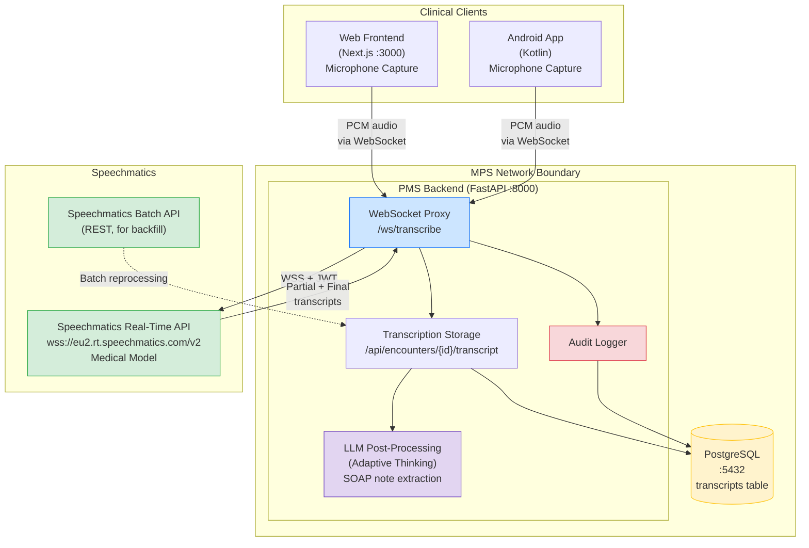

# Product Requirements Document: Speechmatics Medical Model Integration into Patient Management System (PMS)

**Document ID:** PRD-PMS-SPEECHMATICSMEDICAL-001
**Version:** 1.0
**Date:** February 19, 2026
**Author:** Ammar (CEO, MPS Inc.)
**Status:** Draft

---

## 1. Executive Summary

Speechmatics Medical Model is a next-generation medical speech-to-text (STT) engine purpose-built for clinical transcription. Launched in September 2025, it achieves **93% general real-world accuracy** with **50% fewer errors on medical terminology** (drug names, procedures, clinical shorthand) compared to the next best system, and a **7% word error rate (WER)** in clinical settings. The model is accent-independent, supports real-time speaker diarization (distinguishing clinicians, patients, and family members), and correctly formats numbers, dosages, dates, and times out of the box.

Integrating Speechmatics Medical Model into the PMS provides a **cloud-managed or self-hosted** clinical transcription layer that feeds directly into encounter documentation, clinical notes, and prescriptions. Unlike the existing MedASR experiment (07), which uses a self-hosted open-source Conformer model requiring GPU infrastructure, Speechmatics offers a commercially supported **real-time WebSocket API** with HIPAA compliance, SOC 2 Type II certification, and a Business Associate Agreement (BAA) — significantly reducing the operational burden of running a medical speech pipeline. The model supports 55+ languages including recent medical-grade expansions to Spanish, French, Dutch, Finnish, Swedish, and an English-Arabic bilingual model, making it relevant for MPS's multilingual patient population.

For the PMS, this means clinicians can dictate encounter notes, prescription instructions, and discharge summaries in real-time from the Next.js web interface or the Android app, with transcriptions streamed directly into the PMS encounter record via the FastAPI backend. The real-time diarization capability enables ambient scribing during patient visits — automatically attributing speech to the correct speaker and structuring the transcript for LLM-powered note generation downstream.

---

## 2. Problem Statement

The current PMS has limited speech-to-text capability, and the clinical documentation workflow imposes significant burden on clinicians:

- **Manual documentation bottleneck:** Clinicians spend an average of 2 hours per day on documentation — typing encounter notes, prescriptions, and discharge summaries. This time is taken away from direct patient care and is a leading cause of clinician burnout.
- **MedASR GPU infrastructure cost:** The existing MedASR experiment (07) requires a dedicated GPU Docker container (~8GB VRAM minimum) running on-premise. This is expensive to provision, complex to maintain, and creates a single point of failure. MedASR also only supports English.
- **No real-time streaming:** MedASR processes audio files in batch — the clinician records, uploads, and waits for transcription. There is no live transcription during the encounter, which prevents ambient scribing and real-time clinical documentation.
- **No speaker diarization:** MedASR transcribes all audio as a single speaker. In multi-party clinical encounters (clinician + patient + family), there is no way to attribute speech to the correct person — making the transcript unsuitable for structured note generation.
- **Limited medical vocabulary:** While MedASR outperforms general-purpose models, its training data has gaps in recently approved medications, specialized procedures, and non-English medical terms.
- **No multilingual support:** The PMS serves a diverse patient population, but MedASR only supports English dictation. Clinicians who speak to patients in Spanish, Arabic, or other languages cannot use speech-to-text for those encounters.

---

## 3. Proposed Solution

Deploy the Speechmatics Medical Model as the PMS's real-time clinical transcription engine, accessible via WebSocket from both the Next.js frontend and Android app, with transcriptions routed through the FastAPI backend for persistence, audit logging, and downstream LLM processing.

### 3.1 Architecture Overview

### 3.2 Deployment Model

| Aspect | Decision |
| --- | --- |
| **Primary deployment** | Speechmatics Cloud (managed SaaS) via real-time WebSocket API |
| **Fallback / air-gapped** | Speechmatics CPU Container (Docker, self-hosted) for on-premise deployments |
| **Transport** | WebSocket (WSS) for real-time; REST for batch |
| **Authentication** | API key (server-side) → short-lived JWT (client-side browser/Android) |
| **HIPAA** | BAA available; SOC 2 Type II certified; no data logging by default; end-to-end TLS |
| **Audio routing** | Audio streams from client → PMS backend WebSocket proxy → Speechmatics API. Audio never sent directly from browser to Speechmatics (PHI containment). |
| **Data residency** | EU or US region selectable; on-premise container for full data sovereignty |

---

## 4. PMS Data Sources

| PMS API | Integration | Description |
| --- | --- | --- |
| `/api/encounters` | **Primary** | Transcripts are attached to encounter records. New endpoint: `/api/encounters/{id}/transcript` |
| `/api/patients` | **Context** | Patient demographics (name, preferred language) used to configure transcription language |
| `/api/prescriptions` | **Downstream** | LLM post-processing extracts medication orders from transcripts and creates draft prescriptions |
| `/api/reports` | **Analytics** | Transcription usage reports: minutes transcribed, accuracy metrics, clinician adoption |

---

## 5. Component/Module Definitions

### 5.1 WebSocket Transcription Proxy (`/ws/transcribe`)

**Description:** FastAPI WebSocket endpoint that accepts PCM audio from clients, forwards it to the Speechmatics Real-Time API, and streams transcript events back.

- **Input:** Raw PCM audio (16kHz, 16-bit, mono) from browser MediaRecorder or Android AudioRecord
- **Output:** Partial transcripts (low-latency, ~500ms), final transcripts (high-accuracy), and diarization labels
- **PMS APIs used:** `/api/encounters/{id}/transcript` for persistence

### 5.2 Transcript Storage Service

**Description:** Persists final transcripts to PostgreSQL, linked to encounter records, with speaker labels and timestamps.

- **Input:** Final transcript events from the WebSocket proxy
- **Output:** Structured transcript records in `encounter_transcripts` table
- **PMS APIs used:** `/api/encounters` for encounter lookup and validation

### 5.3 LLM Post-Processing Pipeline

**Description:** Uses Adaptive Thinking (Experiment 08) to extract structured clinical data from raw transcripts — SOAP notes, medication mentions, follow-up actions.

- **Input:** Completed encounter transcript
- **Output:** Draft SOAP note, extracted medication orders, follow-up items
- **PMS APIs used:** `/api/encounters/{id}` (write), `/api/prescriptions` (draft creation)

### 5.4 Next.js Transcription UI Component

**Description:** React component providing a live transcription interface — microphone control, real-time transcript display with speaker labels, and correction capabilities.

- **Input:** Browser microphone audio via MediaRecorder API
- **Output:** Audio stream to WebSocket proxy; renders live transcript
- **Technology:** `@speechmatics/flow-client` SDK, WebSocket

### 5.5 Android Transcription Module

**Description:** Kotlin module providing real-time dictation in the Android app using AudioRecord and OkHttp WebSocket.

- **Input:** Device microphone audio via Android AudioRecord
- **Output:** Audio stream to WebSocket proxy; renders live transcript in Jetpack Compose UI

### 5.6 Batch Reprocessing Service

**Description:** Reprocesses previously recorded audio files through the Speechmatics Batch API for improved accuracy or language model updates.

- **Input:** Audio files stored in PMS object storage
- **Output:** Updated transcripts replacing earlier versions
- **PMS APIs used:** `/api/encounters/{id}/transcript` (update)

---

## 6. Non-Functional Requirements

### 6.1 Security and HIPAA Compliance

| Requirement | Implementation |
| --- | --- |
| **Business Associate Agreement** | Speechmatics signs BAA covering PHI in audio and transcripts |
| **Audio routing** | All audio routed through PMS backend proxy — never directly from client to Speechmatics |
| **Transport encryption** | WSS (TLS 1.3) for all WebSocket connections; HTTPS for batch API |
| **No data retention** | Speechmatics configured with no data logging — audio and transcripts are not stored by Speechmatics |
| **Audit logging** | Every transcription session logged: clinician ID, patient encounter ID, duration, timestamp |
| **Access control** | Only authenticated clinicians can initiate transcription; encounter-level authorization verified |
| **PHI in transcripts** | Transcripts stored encrypted at rest in PostgreSQL; access restricted by encounter ownership |
| **JWT authentication** | Browser and Android clients receive short-lived JWTs (15-minute expiry) from the PMS backend |

### 6.2 Performance

| Metric | Target |
| --- | --- |
| Partial transcript latency | < 500ms from speech to display |
| Final transcript latency | < 2s from end of utterance |
| Medical term accuracy (KWER) | < 5% keyword error rate |
| Overall WER | < 8% on clinical dictation |
| Speaker diarization accuracy | > 90% correct attribution |
| Concurrent transcription sessions | 20+ simultaneous |
| Audio-to-transcript throughput | Real-time (1x) or faster |

### 6.3 Infrastructure

| Component | Requirement |
| --- | --- |
| **Cloud API** | Speechmatics managed SaaS (no infrastructure to manage) |
| **On-premise container** | Speechmatics CPU Container: 8 vCPUs, 16GB RAM, Docker 24+ |
| **PMS backend** | WebSocket support in FastAPI (already supported via `websockets` library) |
| **PostgreSQL** | New `encounter_transcripts` table; estimated 1KB per minute of transcript |
| **Network** | Stable internet connection for cloud API; < 100ms RTT to Speechmatics endpoint |

---

## 7. Implementation Phases

### Phase 1: Foundation (Sprints 1-2)

- Set up Speechmatics account and obtain API key
- Implement WebSocket proxy endpoint in FastAPI (`/ws/transcribe`)
- Create `encounter_transcripts` PostgreSQL table and storage service
- Implement basic real-time transcription (English, single speaker, no diarization)
- Add audit logging for transcription sessions
- Verify HIPAA compliance: BAA signed, no data logging confirmed, audio routing validated

### Phase 2: Core Integration (Sprints 3-4)

- Enable speaker diarization (clinician vs patient attribution)
- Build Next.js transcription UI component with microphone control and live display
- Build Android transcription module with AudioRecord and OkHttp WebSocket
- Add Medical Model configuration (drug names, clinical shorthand, dosage formatting)
- Integrate with existing encounter workflow: start transcription when encounter begins, stop on save
- Add language selection based on patient preferred language

### Phase 3: Advanced Features (Sprints 5-6)

- LLM post-processing pipeline: auto-generate SOAP notes from transcripts using Adaptive Thinking
- Extract medication mentions and create draft prescriptions
- Batch reprocessing service for audio quality improvement
- Transcription analytics dashboard (usage, accuracy trends, clinician adoption)
- Multilingual support: Spanish, Arabic, French
- On-premise container deployment option for air-gapped environments

---

## 8. Success Metrics

| Metric | Target | Measurement Method |
| --- | --- | --- |
| Clinician documentation time reduction | 40% fewer minutes per encounter | Time-tracking before/after pilot |
| Medical term accuracy (KWER) | < 5% keyword error rate | Periodic accuracy audits on sample transcripts |
| Clinician adoption rate | > 70% of clinicians using dictation within 3 months | Usage analytics from transcription sessions |
| Transcript-to-note automation | > 60% of SOAP note fields auto-populated | LLM output vs manual entry comparison |
| Real-time latency (partial transcripts) | < 500ms | p95 latency measurement from audio capture to display |
| HIPAA audit compliance | 100% of sessions logged with required fields | Audit log completeness check |
| Clinician satisfaction (NPS) | > 7/10 | Post-pilot clinician survey |

---

## 9. Risks and Mitigations

| Risk | Impact | Mitigation |
| --- | --- | --- |
| **Network dependency for cloud API** | Transcription fails if internet connection drops | On-premise container fallback; graceful degradation with "record and transcribe later" mode |
| **Accuracy on rare medical terms** | Specialized terminology not in model vocabulary | Custom vocabulary/phrase lists via Speechmatics API; feedback loop for corrections |
| **Cost at scale** | Speechmatics pricing per audio minute could be significant at high volume | Monitor usage; batch reprocessing at off-peak rates; evaluate on-premise container for high-volume clinics |
| **Speaker diarization errors** | Incorrect speaker attribution leads to wrong SOAP note sections | Manual correction UI; confidence scores on diarization; two-speaker mode for 1:1 encounters |
| **Clinician resistance to ambient recording** | Privacy concerns from staff about always-on microphone | Explicit opt-in per encounter; clear recording indicator in UI; auto-stop when encounter ends |
| **Latency spikes** | Network congestion causes delayed transcripts | WebSocket reconnection logic; buffered audio playback; max_delay tuning |
| **Multilingual accuracy** | Non-English medical models less mature | Start with English only; expand languages based on Speechmatics model maturity benchmarks |

---

## 10. Dependencies

| Dependency | Version / Detail | Purpose |
| --- | --- | --- |
| Speechmatics Real-Time API | v2 (WSS) | Real-time clinical transcription |
| Speechmatics Batch API | REST | Batch reprocessing of recorded audio |
| `speechmatics-python` | >= 1.11.x | Python SDK for backend WebSocket proxy |
| `@speechmatics/flow-client` | latest | TypeScript SDK for Next.js browser integration |
| Speechmatics API Key | Enterprise plan with BAA | Authentication and HIPAA compliance |
| PMS Backend (FastAPI) | Running on :8000 | WebSocket proxy and transcript storage |
| PostgreSQL | >= 16.x | Transcript and audit log storage |
| Adaptive Thinking (Experiment 08) | Configured | LLM post-processing for SOAP note extraction |
| Browser MediaRecorder API | Supported in Chrome/Firefox/Safari | Audio capture in Next.js frontend |
| Android AudioRecord | API 21+ | Audio capture in Android app |

---

## 11. Comparison with Existing Experiments

| Dimension | Speechmatics Medical (10) | MedASR (07) | OpenClaw (05) | Adaptive Thinking (08) |
| --- | --- | --- | --- | --- |
| **Category** | Cloud/On-Prem Medical STT | Self-hosted Open-Source STT | Agentic AI Automation | AI Reasoning Optimization |
| **Deployment** | Managed SaaS or Docker CPU container | GPU Docker container (8GB VRAM) | Docker container | API parameter change |
| **Real-time** | Yes (WebSocket, < 500ms partials) | No (batch only) | N/A | N/A |
| **Speaker diarization** | Yes (clinician/patient/family) | No (single speaker) | N/A | N/A |
| **Medical accuracy** | 93% overall, 50% fewer med term errors | 4.6% WER on radiology | N/A | N/A |
| **Languages** | 55+ (medical model in EN, ES, FR, NL, FI, SV, DE) | English only | N/A | N/A |
| **Cost model** | Per-minute API pricing or license | Free (open-source) | Free (open-source) | Anthropic API token costs |
| **HIPAA** | BAA available, SOC 2 Type II | Self-managed (no BAA) | Self-managed | Anthropic BAA |
| **Complementarity** | Speechmatics provides real-time transcription → feeds into OpenClaw documentation skills and Adaptive Thinking SOAP note extraction | MedASR could serve as a free fallback for batch processing | OpenClaw automates workflows using transcript output | Adaptive Thinking powers LLM post-processing of transcripts |

Speechmatics Medical Model and MedASR address the same core problem (clinical speech-to-text) but with different tradeoffs. **Speechmatics** offers real-time streaming, speaker diarization, commercial support, and HIPAA BAA at a per-minute cost. **MedASR** offers free, open-source batch processing requiring GPU infrastructure. The two can coexist: Speechmatics for live clinical encounters, MedASR as a free fallback for batch reprocessing of recorded audio.

---

## 12. Research Sources

### Official Documentation

- [Speechmatics Docs](https://docs.speechmatics.com/) — API reference, real-time and batch guides, SDK documentation
- [Speechmatics Real-Time API Reference](https://docs.speechmatics.com/api-ref/realtime-transcription-websocket) — WebSocket protocol, message types, configuration options
- [Speechmatics Security](https://www.speechmatics.com/security) — SOC 2 Type II, HIPAA, GDPR compliance details

### Medical Model & Performance

- [Medical Model Launch Announcement](https://www.speechmatics.com/company/articles-and-news/speechmatics-launches-medical-model-for-real-time-clinical-transcription) — Feature overview, diarization, formatting
- [93% Accuracy Record (NVIDIA-powered)](https://www.speechmatics.com/company/articles-and-news/speechmatics-sets-record-in-medical-speech-to-text-with-93-percent-accuracy) — Benchmark results, 50% fewer medical term errors
- [Next-Generation Medical STT](https://www.speechmatics.com/company/articles-and-news/the-next-generation-of-ai-medical-speech-recognition-is-here) — Architecture, vocabulary coverage, ambient scribe capabilities

### SDKs & Integration

- [Speechmatics Python SDK (GitHub)](https://github.com/speechmatics/speechmatics-python) — Python client library for real-time and batch transcription
- [Speechmatics JS/TS SDK (GitHub)](https://github.com/speechmatics/speechmatics-js-sdk) — Browser and Node.js SDK for real-time transcription
- [Next.js Flow Guide](https://docs.speechmatics.com/voice-agents-flow/guides/nextjs-guide) — Official Next.js integration walkthrough

### Deployment & Healthcare

- [On-Prem CPU Container](https://docs.speechmatics.com/on-prem/containers/cpu-container) — Self-hosted Docker deployment for air-gapped environments
- [Medical Transcription Use Case](https://www.speechmatics.com/use-cases/medical-transcription) — Healthcare-specific features, HIPAA compliance, ambient scribe
- [Speechmatics + Edvak EHR Partnership](https://www.globenewswire.com/news-release/2026/02/17/3239382/0/en/Speechmatics-and-Edvak-EHR-Partner-to-Make-Voice-AI-Safe-for-Clinical-Automation-at-Scale.html) — Clinical automation at scale, EHR integration patterns

---

## 13. Appendix: Related Documents

- [Speechmatics Medical Setup Guide](10-SpeechmaticsMedical-PMS-Developer-Setup-Guide.md) — Step-by-step installation and configuration
- [Speechmatics Medical Developer Tutorial](10-SpeechmaticsMedical-Developer-Tutorial.md) — Hands-on onboarding: build your first clinical transcription integration
- [PRD: MedASR PMS Integration](07-PRD-MedASR-PMS-Integration.md) — Open-source medical STT (complementary/fallback)
- [PRD: Adaptive Thinking PMS Integration](08-PRD-AdaptiveThinking-PMS-Integration.md) — LLM post-processing for SOAP note extraction
- [PRD: OpenClaw PMS Integration](05-PRD-OpenClaw-PMS-Integration.md) — Agentic workflows consuming transcript output
- [PRD: MCP PMS Integration](09-PRD-MCP-PMS-Integration.md) — Transcription could be exposed as an MCP tool
- [Speechmatics Official Documentation](https://docs.speechmatics.com/)
- [Speechmatics Python SDK](https://github.com/speechmatics/speechmatics-python)
- [Speechmatics TypeScript SDK](https://github.com/speechmatics/speechmatics-js-sdk)
