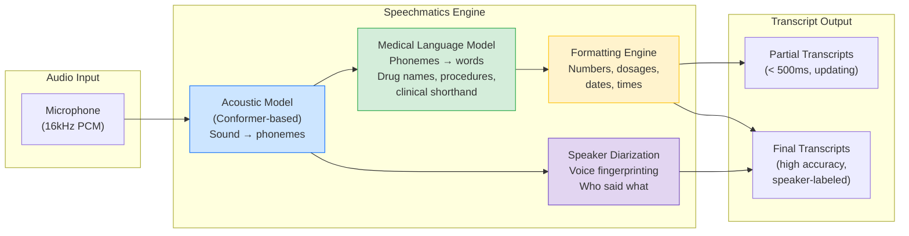
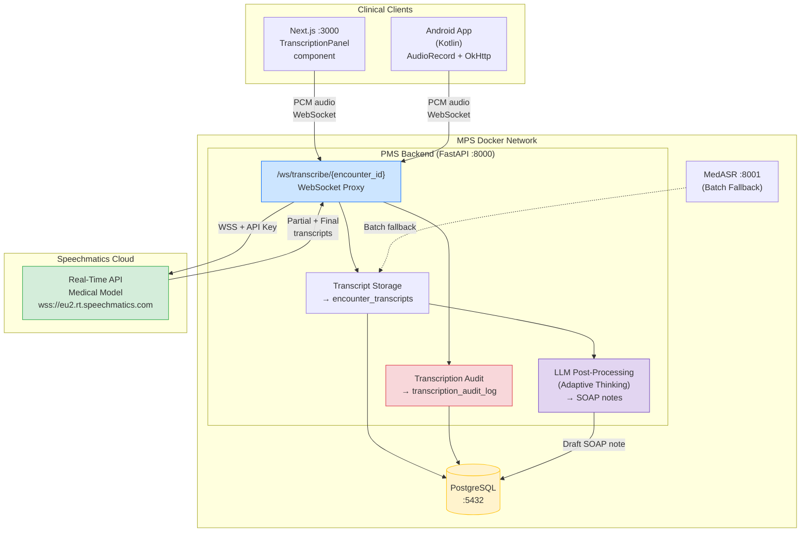

# Speechmatics Medical Model Developer Onboarding Tutorial

**Welcome to the MPS PMS Speechmatics Medical Integration Team**

This tutorial will take you from zero to building your first real-time clinical transcription integration with the PMS. By the end, you will understand how Speechmatics Medical Model works, have a running local environment, and have built and tested a clinical dictation workflow end-to-end.

**Document ID:** PMS-EXP-SPEECHMATICSMEDICAL-002
**Version:** 1.0
**Date:** February 19, 2026
**Applies To:** PMS project (all platforms)
**Prerequisite:** [Speechmatics Medical Setup Guide](10-SpeechmaticsMedical-PMS-Developer-Setup-Guide.md)
**Estimated time:** 2-3 hours
**Difficulty:** Beginner-friendly

---

## What You Will Learn

1. What problem real-time clinical transcription solves for PMS clinicians
2. How Speechmatics Medical Model differs from general-purpose STT and MedASR
3. How the WebSocket-based real-time transcription pipeline works
4. How speaker diarization attributes speech to clinician, patient, and family
5. How to verify your local transcription environment
6. How to build a clinical dictation endpoint that stores transcripts in PostgreSQL
7. How to build a live transcription UI with speaker labels and partial results
8. How to evaluate Speechmatics strengths and weaknesses for healthcare
9. How to debug common transcription issues using logs and audio inspection
10. How to follow PMS development conventions for transcription features

---

## Part 1: Understanding Speechmatics Medical Model (15 min read)

### 1.1 What Problem Does Speechmatics Medical Model Solve?

Picture a typical day for a PMS clinician:

- They see 20 patients, spending 15 minutes with each
- After each visit, they type encounter notes — chief complaint, history, exam findings, assessment, plan
- They type prescription details, discharge instructions, and referral letters
- Total documentation time: **2+ hours per day**, done after clinic hours ("pajama time")

This documentation burden is the #1 cause of clinician burnout. The PMS can help by **transcribing the clinical encounter in real-time** — the clinician speaks naturally during the visit, and the transcript is automatically structured into clinical notes.

But general-purpose speech recognition (Google, Whisper) fails in clinical settings:
- "Metformin 500 milligrams" becomes "met for men 500 milligrams"
- "PRN" becomes "P.R.N." or "piranah"
- Speaker changes between doctor and patient are lost

**Speechmatics Medical Model** is specifically trained for clinical speech. It recognizes drug names, procedures, dosages, and clinical shorthand with **50% fewer errors** than general-purpose systems, while distinguishing who said what through real-time speaker diarization.

### 1.2 How Speechmatics Medical Model Works — The Key Pieces



**Three key concepts:**

1. **Medical Language Model** — Trained on clinical dictation data, recognizing drug names (metformin, lisinopril), procedures (cholecystectomy, endoscopy), dosages (500mg TID), and abbreviations (PRN, BID, SOAP). This is what makes it "medical."

2. **Real-Time Speaker Diarization** — Analyzes voice characteristics to distinguish speakers. In a clinical encounter, it labels speech as "clinician," "patient," or "family" — essential for structuring notes (subjective = patient's words, objective = clinician's observations).

3. **Streaming with Partials** — Transcripts arrive in two stages: **partials** (< 500ms, may change) for live display, and **finals** (2s, high accuracy) for storage. This gives users immediate feedback while ensuring stored transcripts are accurate.

### 1.3 How Speechmatics Medical Fits with Other PMS Technologies

| Technology | Experiment | Relationship to Speechmatics Medical |
| --- | --- | --- |
| **MedASR** | 07 | Both do medical STT. MedASR is free/open-source but batch-only, English-only, no diarization. Speechmatics is commercial but real-time, multilingual, with diarization. They complement as primary (Speechmatics) and fallback (MedASR). |
| **Adaptive Thinking** | 08 | Processes transcripts downstream: extracts SOAP notes, medication orders from raw text. Higher effort for complex clinical reasoning, lower effort for simple formatting. |
| **OpenClaw** | 05 | Agentic workflows can trigger transcription sessions and auto-generate documentation from transcript output. |
| **MCP** | 09 | Transcription can be exposed as an MCP tool (`start_transcription`, `get_transcript`) for any AI client. |
| **Tambo** | 00 | Analytics sidebar could display transcription usage stats, accuracy trends, and clinician adoption dashboards. |

### 1.4 Key Vocabulary

| Term | Meaning |
| --- | --- |
| **WER** | Word Error Rate — percentage of words transcribed incorrectly. Lower is better. Speechmatics Medical: ~7% |
| **KWER** | Keyword Error Rate — WER measured only on domain-specific terms (drug names, procedures). Speechmatics: ~3.9% |
| **Partial transcript** | A low-latency, provisional transcript that may be revised as more audio context arrives |
| **Final transcript** | A high-accuracy transcript that will not change; suitable for storage |
| **Speaker diarization** | The process of segmenting audio by speaker identity (who said what) |
| **PCM** | Pulse Code Modulation — raw uncompressed audio format. Speechmatics expects 16kHz, 16-bit, mono |
| **max_delay** | Configuration parameter controlling the accuracy/latency tradeoff. Higher = more accurate but slower |
| **Operating point** | Speechmatics model tier: "standard" (faster, cheaper) or "enhanced" (more accurate). Medical Model uses "enhanced" |
| **Ambient scribe** | A mode where the microphone captures the entire clinical encounter passively, without clinician intervention |
| **BAA** | Business Associate Agreement — HIPAA-required contract for vendors handling PHI |
| **JWT** | JSON Web Token — short-lived authentication token used for browser/mobile WebSocket connections |

### 1.5 Our Architecture



---

## Part 2: Environment Verification (15 min)

### 2.1 Checklist

Complete each step before proceeding:

1. **PMS Backend is running:**
   ```bash
   curl -s http://localhost:8000/health
   # Returns: {"status": "healthy"}
   ```

2. **PostgreSQL has transcript tables:**
   ```bash
   docker exec pms-postgres psql -U pms -d pms -c "\dt encounter_transcripts"
   # Returns: table listing
   ```

3. **Speechmatics API key is configured:**
   ```bash
   echo $SPEECHMATICS_API_KEY | head -c 10
   # Returns: first 10 characters of your key
   ```

4. **Speechmatics Python SDK is installed:**
   ```bash
   python3 -c "import speechmatics; print(speechmatics.__version__)"
   # Returns: version number
   ```

5. **WebSocket endpoint is accessible:**
   ```bash
   python3 -c "
   import asyncio, websockets
   async def test():
       async with websockets.connect('ws://localhost:8000/ws/transcribe/1') as ws:
           print('WebSocket: OK')
   asyncio.run(test())
   "
   ```

6. **ffmpeg is available (for test audio):**
   ```bash
   ffmpeg -version | head -1
   # Returns: ffmpeg version X.X
   ```

### 2.2 Quick Test

Run this one-liner to verify the full pipeline:

```bash
# Generate test audio and transcribe
say -o /tmp/sm-test.aiff "Patient reports chest pain radiating to left arm, onset two hours ago. Prescribed aspirin 325 milligrams stat." && \
ffmpeg -y -i /tmp/sm-test.aiff -ar 16000 -ac 1 -f wav /tmp/sm-test.wav 2>/dev/null && \
speechmatics transcribe \
    --auth-token $SPEECHMATICS_API_KEY \
    --url wss://eu2.rt.speechmatics.com/v2 \
    --lang en \
    --operating-point enhanced \
    /tmp/sm-test.wav
```

If you see "chest pain," "left arm," and "aspirin 325 milligrams" in the output, the pipeline works.

---

## Part 3: Build Your First Integration (45 min)

### 3.1 What We Are Building

A **clinical dictation endpoint** that:
1. Accepts live audio from a WebSocket client
2. Streams it to Speechmatics Medical Model for real-time transcription
3. Stores final transcripts in PostgreSQL linked to an encounter
4. Returns both partial (live) and final (stored) transcripts to the client

### 3.2 Create the Transcript Storage Module

Create `pms-backend/app/services/transcript_storage.py`:

```python
"""Persist transcripts to PostgreSQL."""

import uuid
from datetime import datetime, timezone
from decimal import Decimal

import asyncpg


async def store_transcript(
    pool: asyncpg.Pool,
    encounter_id: int,
    session_id: uuid.UUID,
    speaker_label: str,
    content: str,
    start_time: float,
    end_time: float,
    confidence: float,
    language: str = "en",
) -> int:
    """Store a final transcript segment in the database."""
    row = await pool.fetchrow(
        """
        INSERT INTO encounter_transcripts
            (encounter_id, session_id, speaker_label, content,
             start_time, end_time, confidence, language, is_final)
        VALUES ($1, $2, $3, $4, $5, $6, $7, $8, TRUE)
        RETURNING id
        """,
        encounter_id,
        session_id,
        speaker_label,
        content,
        Decimal(str(start_time)),
        Decimal(str(end_time)),
        Decimal(str(confidence)),
        language,
    )
    return row["id"]


async def get_encounter_transcript(
    pool: asyncpg.Pool,
    encounter_id: int,
) -> list[dict]:
    """Retrieve the full transcript for an encounter, ordered by time."""
    rows = await pool.fetch(
        """
        SELECT speaker_label, content, start_time, end_time, confidence
        FROM encounter_transcripts
        WHERE encounter_id = $1 AND is_final = TRUE
        ORDER BY start_time
        """,
        encounter_id,
    )
    return [dict(r) for r in rows]
```

### 3.3 Create the Audit Logging Module

Create `pms-backend/app/services/transcription_audit.py`:

```python
"""HIPAA-compliant audit logging for transcription sessions."""

import uuid
from datetime import datetime, timezone

import asyncpg


async def start_audit_session(
    pool: asyncpg.Pool,
    session_id: uuid.UUID,
    clinician_id: int,
    encounter_id: int,
    patient_id: int,
    language: str = "en",
) -> None:
    """Record the start of a transcription session."""
    await pool.execute(
        """
        INSERT INTO transcription_audit_log
            (session_id, clinician_id, encounter_id, patient_id,
             started_at, language, status)
        VALUES ($1, $2, $3, $4, $5, $6, 'active')
        """,
        session_id,
        clinician_id,
        encounter_id,
        patient_id,
        datetime.now(timezone.utc),
        language,
    )


async def end_audit_session(
    pool: asyncpg.Pool,
    session_id: uuid.UUID,
    total_words: int,
    status: str = "completed",
    error_message: str | None = None,
) -> None:
    """Record the end of a transcription session."""
    await pool.execute(
        """
        UPDATE transcription_audit_log
        SET ended_at = $2,
            duration_seconds = EXTRACT(EPOCH FROM ($2 - started_at))::INTEGER,
            total_words = $3,
            status = $4,
            error_message = $5
        WHERE session_id = $1
        """,
        session_id,
        datetime.now(timezone.utc),
        total_words,
        status,
        error_message,
    )
```

### 3.4 Create the REST Endpoint for Transcript Retrieval

Add to `pms-backend/app/api/transcription.py`:

```python
from fastapi import APIRouter
from app.services.transcript_storage import get_encounter_transcript

# Add to the existing router
@router.get("/api/encounters/{encounter_id}/transcript")
async def get_transcript(encounter_id: int):
    """Retrieve the full transcript for a clinical encounter."""
    # TODO: Get pool from app state
    # transcript = await get_encounter_transcript(pool, encounter_id)
    # return {"encounter_id": encounter_id, "segments": transcript}
    return {"encounter_id": encounter_id, "segments": [], "status": "placeholder"}
```

### 3.5 Test Your Integration

```bash
# 1. Start the backend
docker compose up -d pms-backend

# 2. Verify the REST endpoint
curl -s http://localhost:8000/api/encounters/1/transcript | python3 -m json.tool

# 3. Open the frontend and navigate to an encounter
# 4. Click "Start Dictation" and speak
# 5. Verify transcripts appear in real-time
# 6. Click "Stop Recording"
# 7. Verify final transcripts are in the database:
docker exec pms-postgres psql -U pms -d pms -c \
    "SELECT speaker_label, LEFT(content, 60) as text, confidence
     FROM encounter_transcripts ORDER BY created_at DESC LIMIT 5;"
```

### 3.6 Verify Audit Trail

```bash
docker exec pms-postgres psql -U pms -d pms -c \
    "SELECT session_id, clinician_id, encounter_id, duration_seconds, total_words, status
     FROM transcription_audit_log ORDER BY created_at DESC LIMIT 5;"
```

**Checkpoint:** You've built a complete clinical dictation pipeline: audio capture → WebSocket proxy → Speechmatics Medical Model → PostgreSQL storage, with HIPAA audit logging. Final transcripts are retrievable via REST API.

---

## Part 4: Evaluating Strengths and Weaknesses (15 min)

### 4.1 Strengths

| Strength | Detail |
| --- | --- |
| **Medical-grade accuracy** | 93% overall, 50% fewer medical term errors, 3.9% KWER on clinical terms |
| **Real-time streaming** | Partial transcripts in < 500ms; finals in < 2s. Enables live ambient scribing |
| **Speaker diarization** | Distinguishes clinician, patient, and family in real-time — essential for SOAP note structure |
| **Accent independence** | Works across diverse accents without training — important for diverse clinical staff |
| **Multilingual** | 55+ languages; medical-grade models for EN, ES, FR, NL, FI, SV, DE |
| **Flexible deployment** | Cloud SaaS, on-premise Docker CPU container, or edge device |
| **HIPAA-ready** | BAA available, SOC 2 Type II, no data logging by default, end-to-end TLS |
| **Clinical formatting** | Auto-formats numbers, dosages, dates, times — "500 milligrams TID" not "five hundred milligrams T.I.D." |

### 4.2 Weaknesses

| Weakness | Detail |
| --- | --- |
| **Commercial cost** | Per-minute pricing; can be significant at scale (hundreds of hours/month) |
| **Cloud dependency** | Real-time API requires internet connectivity (on-prem container available but requires license) |
| **Not open-source** | Proprietary model — no ability to fine-tune or inspect model internals |
| **Diarization limitations** | Struggles with 4+ speakers; accuracy drops with significant background noise |
| **No offline mode** | Cannot transcribe without API connectivity (unlike MedASR which runs locally) |
| **Vocabulary gaps** | Very new drugs or procedures may not be in the model vocabulary yet |
| **WebSocket complexity** | Real-time integration is more complex than simple REST API calls |

### 4.3 When to Use Speechmatics Medical vs Alternatives

| Scenario | Recommendation |
| --- | --- |
| Real-time clinical dictation during encounters | **Speechmatics Medical** — low latency, diarization, medical accuracy |
| Batch processing of recorded audio files | **MedASR** — free, no API costs, good accuracy on radiology |
| Air-gapped environment with no internet | **MedASR** or **Speechmatics On-Prem Container** |
| Multilingual patient encounters | **Speechmatics** — 55+ languages, medical models in 7 languages |
| Budget-constrained pilot | **MedASR** — free open-source, then graduate to Speechmatics for production |
| Ambient scribe (passive recording) | **Speechmatics Medical** — diarization is essential for ambient scribing |
| Simple voice command input (not transcription) | **Browser Speech API** — free, built-in, good for commands |

### 4.4 HIPAA / Healthcare Considerations

| Aspect | Assessment | Recommendation |
| --- | --- | --- |
| **PHI in audio** | Audio contains patient speech with medical details | Route all audio through PMS backend proxy; never send directly from browser to Speechmatics |
| **BAA requirement** | Speechmatics handles PHI (audio + transcripts in transit) | Sign BAA before production deployment; verify coverage includes real-time API |
| **Data retention** | Speechmatics can be configured for zero data retention | Confirm "no data logging" is enabled in your Speechmatics account settings |
| **Audit trail** | HIPAA requires logging who accessed what and when | `transcription_audit_log` table records every session with clinician, patient, encounter, and duration |
| **Access control** | Only authorized clinicians should initiate transcription | WebSocket endpoint must verify clinician authentication and encounter-level authorization |
| **Transcript storage** | Transcripts contain PHI | Encrypt PostgreSQL at rest; restrict `encounter_transcripts` access by encounter ownership |
| **On-premise option** | Some organizations require all data to stay on-premise | Speechmatics CPU Container available for Docker deployment; same API, no cloud dependency |

---

## Part 5: Debugging Common Issues (15 min read)

### Issue 1: "Connection Closed Abnormally" on WebSocket

**Symptom:** WebSocket connects but closes immediately with code 1006.

**Cause:** Speechmatics rejected the connection — usually due to invalid API key or unsupported configuration.

**Fix:**
```bash
# Verify API key works with the CLI first
speechmatics transcribe --auth-token $SPEECHMATICS_API_KEY \
    --url wss://eu2.rt.speechmatics.com/v2 --lang en test.wav

# Check for typos in the endpoint URL
# EU: wss://eu2.rt.speechmatics.com/v2
# US: wss://us2.rt.speechmatics.com/v2
```

### Issue 2: Transcription Misses Medical Terms

**Symptom:** "metformin" transcribed as "met for men" or "metforming."

**Cause:** The transcription is using the standard model instead of the enhanced (medical) model.

**Fix:**
```python
# Ensure operating_point is set to "enhanced"
transcription_config = TranscriptionConfig(
    language="en",
    operating_point="enhanced",  # NOT "standard"
)
```

### Issue 3: All Speakers Labeled as Same Person

**Symptom:** Diarization returns `S1` for all segments.

**Cause:** Single-speaker audio, or diarization not enabled.

**Fix:**
- Verify `diarization="speaker"` in the transcription config
- Test with audio that has clearly distinct speakers
- Check that `max_speakers` is set appropriately (default: 2-4)

### Issue 4: High Latency on Partial Transcripts

**Symptom:** Partials arrive > 1 second after speech.

**Cause:** `max_delay` is too high, or network latency to Speechmatics is significant.

**Fix:**
```python
# Lower max_delay (trades accuracy for speed)
transcription_config = TranscriptionConfig(
    max_delay=0.5,  # Default is 2.0; lower = faster partials
)
```

### Issue 5: Audio Format Mismatch

**Symptom:** Speechmatics returns silence or garbage transcription.

**Cause:** Audio is not in the expected format (PCM 16kHz, 16-bit, mono).

**Fix:**
```bash
# Check audio format
ffprobe -v quiet -print_format json -show_streams test.wav | python3 -m json.tool

# Convert to correct format
ffmpeg -i input.wav -ar 16000 -ac 1 -f s16le output.pcm
```

### Reading Speechmatics Logs

```bash
# Backend logs showing transcription events
docker compose logs -f pms-backend 2>&1 | grep -E "(transcri|speech|ws)"

# Key patterns:
# "WebSocket connected for encounter 42"   → Session started
# "Final transcript: 15 words, speaker: clinician"  → Successful transcription
# "Speechmatics connection closed: 1000"   → Normal close
# "Speechmatics connection closed: 4001"   → Auth failure
# "Audio format error"                      → PCM format mismatch
```

---

## Part 6: Practice Exercise (45 min)

### Option A: Build Ambient Scribe Mode (Recommended)

Build a transcription mode that automatically starts when an encounter is opened and stops when it's saved, creating a complete ambient transcript of the visit.

**Hints:**
1. Add a `TranscriptionContext` React context that manages recording state
2. Auto-start recording when the encounter page mounts
3. Show a subtle recording indicator (pulsing dot) in the header
4. Auto-stop when the encounter form is submitted
5. Display speaker-attributed transcript in a sidebar panel

### Option B: Build a Transcript-to-SOAP Converter

Build a service that takes a completed encounter transcript and uses Adaptive Thinking (Experiment 08) to generate a draft SOAP note.

**Hints:**
1. Create a new endpoint: `POST /api/encounters/{id}/generate-note`
2. Retrieve the transcript from `encounter_transcripts`
3. Format it as a prompt: "Given this clinical transcript with speaker labels, generate a SOAP note..."
4. Use effort level "high" for clinical reasoning
5. Store the draft note in the encounter record

### Option C: Build a Transcription Dashboard

Build a Tambo-powered analytics component that shows transcription usage metrics.

**Hints:**
1. Query `transcription_audit_log` for metrics: sessions/day, total minutes, top users
2. Create a Tambo component that renders a bar chart of daily transcription minutes
3. Add a table showing per-clinician adoption (sessions, total time, average duration)

---

## Part 7: Development Workflow and Conventions

### 7.1 File Organization

```
pms-backend/
└── app/
    └── api/
        └── transcription.py           # WebSocket proxy + REST endpoints
    └── services/
        ├── transcript_storage.py      # PostgreSQL persistence
        └── transcription_audit.py     # HIPAA audit logging
    └── models/
        └── transcript.py              # Pydantic models for transcripts

pms-frontend/
└── src/
    ├── hooks/
    │   └── useTranscription.ts        # React hook for WebSocket audio
    └── components/
        └── TranscriptionPanel.tsx     # Live transcription UI
```

### 7.2 Naming Conventions

| Item | Convention | Example |
| --- | --- | --- |
| WebSocket endpoint | `/ws/{action}/{resource_id}` | `/ws/transcribe/42` |
| REST endpoint | `/api/{resource}/{id}/{sub}` | `/api/encounters/42/transcript` |
| Database table | `snake_case` | `encounter_transcripts` |
| Python module | `snake_case` | `transcript_storage.py` |
| React component | `PascalCase` | `TranscriptionPanel.tsx` |
| React hook | `useCamelCase` | `useTranscription.ts` |
| Speaker labels | lowercase | `clinician`, `patient`, `family`, `unknown` |
| Session IDs | UUID v4 | `f47ac10b-58cc-...` |

### 7.3 PR Checklist

When submitting a PR that involves transcription features:

- [ ] Audio is never sent directly from browser/Android to Speechmatics (always via PMS proxy)
- [ ] `encounter_transcripts` records have correct `encounter_id` foreign key
- [ ] `transcription_audit_log` entry created for every session (start and end)
- [ ] No PHI in application logs (transcript content stays in database, not in console output)
- [ ] WebSocket endpoint verifies clinician authentication before accepting audio
- [ ] Encounter-level authorization checked (clinician has access to this encounter)
- [ ] Speaker diarization enabled and labels mapped correctly
- [ ] Frontend shows clear recording indicator when microphone is active
- [ ] Stop recording is called on component unmount (no orphaned recording sessions)
- [ ] Error handling for WebSocket disconnection (reconnection or graceful degradation)

### 7.4 Security Reminders

1. **Never expose the Speechmatics API key to the client.** The key stays on the server. Browser clients connect to the PMS WebSocket proxy, not directly to Speechmatics.
2. **Audio routing through the PMS backend** is mandatory — this ensures all PHI stays within the PMS network boundary.
3. **Audit every session** — the `transcription_audit_log` table must have an entry for every transcription session, even failed ones.
4. **Encrypt transcripts at rest** — PostgreSQL should use encryption for the `encounter_transcripts` table since it contains PHI.
5. **Short-lived JWTs** — if using JWT for client authentication, tokens expire in 15 minutes.
6. **Auto-stop recording** — never leave a microphone recording indefinitely. Stop when the encounter closes, the user navigates away, or after a configurable timeout (e.g., 60 minutes).
7. **Inform the patient** — the UI should indicate when recording is active. Clinics may need patient consent workflows.

---

## Part 8: Quick Reference Card

### Key Commands

| Action | Command |
| --- | --- |
| Transcribe a file | `speechmatics transcribe --auth-token $SPEECHMATICS_API_KEY --url wss://eu2.rt.speechmatics.com/v2 --lang en --operating-point enhanced file.wav` |
| Start PMS backend | `docker compose up -d pms-backend` |
| View transcription logs | `docker compose logs -f pms-backend \| grep transcri` |
| Query transcripts | `docker exec pms-postgres psql -U pms -d pms -c "SELECT * FROM encounter_transcripts ORDER BY created_at DESC LIMIT 10;"` |
| Query audit log | `docker exec pms-postgres psql -U pms -d pms -c "SELECT * FROM transcription_audit_log ORDER BY created_at DESC LIMIT 10;"` |
| Convert audio format | `ffmpeg -i input.wav -ar 16000 -ac 1 -f wav output.wav` |

### Key Files

| File | Purpose |
| --- | --- |
| `pms-backend/app/api/transcription.py` | WebSocket proxy and REST endpoints |
| `pms-backend/app/services/transcript_storage.py` | PostgreSQL transcript persistence |
| `pms-backend/app/services/transcription_audit.py` | HIPAA audit logging |
| `pms-frontend/src/hooks/useTranscription.ts` | React hook for WebSocket audio |
| `pms-frontend/src/components/TranscriptionPanel.tsx` | Live transcription UI |
| `pms-backend/.env` | Speechmatics API key and configuration |

### Key URLs

| URL | Service |
| --- | --- |
| `ws://localhost:8000/ws/transcribe/{id}` | PMS transcription WebSocket |
| `http://localhost:8000/api/encounters/{id}/transcript` | Transcript retrieval REST API |
| `wss://eu2.rt.speechmatics.com/v2` | Speechmatics Real-Time API (EU) |
| `wss://us2.rt.speechmatics.com/v2` | Speechmatics Real-Time API (US) |
| `https://portal.speechmatics.com` | Speechmatics management portal |
| `https://docs.speechmatics.com` | Speechmatics documentation |

### Starter Template for a New Transcription Feature

```python
@router.websocket("/ws/my-feature/{encounter_id}")
async def my_feature(websocket: WebSocket, encounter_id: int):
    """Template for a new transcription-based feature."""
    await websocket.accept()
    session_id = uuid.uuid4()

    conn_settings = ConnectionSettings(
        url=SPEECHMATICS_RT_URL,
        auth_token=SPEECHMATICS_API_KEY,
    )
    config = TranscriptionConfig(
        language="en",
        enable_partials=True,
        max_delay=2.0,
        operating_point="enhanced",
        diarization="speaker",
    )
    sm_client = speechmatics.client.WebsocketClient(conn_settings)

    # Register your event handlers here
    # sm_client.add_event_handler(...)

    try:
        await sm_client.run(transcription_config=config)
        while True:
            audio = await websocket.receive_bytes()
            sm_client.send_audio(audio)
    except WebSocketDisconnect:
        pass
    finally:
        await sm_client.stop()
```

---

## Next Steps

1. **Integrate with Adaptive Thinking (Experiment 08)** — Auto-generate SOAP notes from transcripts using effort-routed Claude reasoning
2. **Expose transcription as an MCP tool (Experiment 09)** — Let any AI client start and retrieve transcriptions via MCP
3. **Build the Android transcription module** — Port the WebSocket audio pipeline to Kotlin with AudioRecord and OkHttp
4. **Add custom vocabulary** — Configure Speechmatics with PMS-specific drug formulary terms for even higher accuracy
5. **Evaluate on-premise deployment** — Deploy the Speechmatics CPU Container for air-gapped clinic environments
