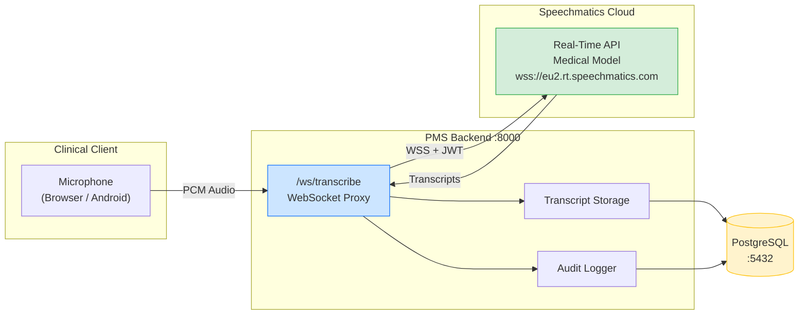

# Speechmatics Medical Model Setup Guide for PMS Integration

**Document ID:** PMS-EXP-SPEECHMATICSMEDICAL-001
**Version:** 1.0
**Date:** February 19, 2026
**Applies To:** PMS project (all platforms)
**Prerequisites Level:** Intermediate

---

## Table of Contents

1. [Overview](#1-overview)
2. [Prerequisites](#2-prerequisites)
3. [Part A: Speechmatics Account and API Setup](#3-part-a-speechmatics-account-and-api-setup)
4. [Part B: Integrate with PMS Backend](#4-part-b-integrate-with-pms-backend)
5. [Part C: Integrate with PMS Frontend](#5-part-c-integrate-with-pms-frontend)
6. [Part D: Testing and Verification](#6-part-d-testing-and-verification)
7. [Troubleshooting](#7-troubleshooting)
8. [Reference Commands](#8-reference-commands)

---

## 1. Overview

This guide walks you through integrating the **Speechmatics Medical Model** into the PMS for real-time clinical transcription. By the end, you will have:

- A Speechmatics API key configured with the Medical Model
- A FastAPI WebSocket proxy that streams audio to Speechmatics and returns transcripts
- A PostgreSQL table storing encounter transcripts with speaker labels
- A Next.js transcription component with live microphone capture
- Audit logging for HIPAA compliance
- End-to-end testing with real audio

### Architecture at a Glance



---

## 2. Prerequisites

### 2.1 Required Software

| Software | Minimum Version | Check Command |
| --- | --- | --- |
| Python | 3.12+ | `python3 --version` |
| Node.js | 20+ | `node --version` |
| Docker | 24+ | `docker --version` |
| Docker Compose | 2.20+ | `docker compose version` |
| pip / uv | pip 23+ or uv 0.4+ | `pip --version` or `uv --version` |
| ffmpeg (optional) | 6+ | `ffmpeg -version` |

### 2.2 Installation of Prerequisites

**ffmpeg** (for audio format conversion during testing):

```bash
# macOS
brew install ffmpeg

# Ubuntu/Debian
sudo apt update && sudo apt install ffmpeg
```

**Speechmatics Python SDK:**

```bash
pip install speechmatics-python
# or
uv add speechmatics-python
```

### 2.3 Verify PMS Services

```bash
# Check PMS Backend
curl -s http://localhost:8000/health | python3 -m json.tool
# Expected: {"status": "healthy", ...}

# Check PMS Frontend
curl -s -o /dev/null -w "%{http_code}" http://localhost:3000
# Expected: 200

# Check PostgreSQL
docker exec pms-postgres pg_isready -U pms
# Expected: accepting connections
```

---

## 3. Part A: Speechmatics Account and API Setup

### Step 1: Create a Speechmatics Account

1. Go to [https://portal.speechmatics.com](https://portal.speechmatics.com)
2. Sign up for an account (free trial includes credit for testing)
3. For production: contact Speechmatics sales for an enterprise plan with BAA

### Step 2: Generate an API Key

1. In the Speechmatics Portal, navigate to **Manage > API Keys**
2. Click **Create API Key**
3. Name it `pms-backend` and copy the key

### Step 3: Configure Environment Variables

Add to your PMS backend `.env` file:

```bash
# Speechmatics Configuration
SPEECHMATICS_API_KEY=your_api_key_here
SPEECHMATICS_RT_URL=wss://eu2.rt.speechmatics.com/v2
SPEECHMATICS_LANGUAGE=en
SPEECHMATICS_MODEL=enhanced
SPEECHMATICS_ENABLE_DIARIZATION=true
SPEECHMATICS_MAX_DELAY=2.0
```

### Step 4: Verify API Key

```bash
# Test with the Python SDK
python3 -c "
import speechmatics
settings = speechmatics.models.ConnectionSettings(
    url='wss://eu2.rt.speechmatics.com/v2',
    auth_token='YOUR_API_KEY_HERE'
)
print('API key configured successfully')
"
```

### Step 5: Create the Database Table

Run the following migration on the PMS database:

```sql
CREATE TABLE IF NOT EXISTS encounter_transcripts (
    id BIGSERIAL PRIMARY KEY,
    encounter_id INTEGER NOT NULL REFERENCES encounters(id),
    speaker_label VARCHAR(50),          -- 'clinician', 'patient', 'family', 'unknown'
    content TEXT NOT NULL,
    start_time DECIMAL(10,3),           -- seconds from session start
    end_time DECIMAL(10,3),
    confidence DECIMAL(4,3),            -- 0.000 to 1.000
    is_final BOOLEAN DEFAULT TRUE,
    language VARCHAR(10) DEFAULT 'en',
    session_id UUID NOT NULL,
    created_at TIMESTAMPTZ NOT NULL DEFAULT NOW()
);

CREATE INDEX idx_transcript_encounter ON encounter_transcripts (encounter_id);
CREATE INDEX idx_transcript_session ON encounter_transcripts (session_id);
CREATE INDEX idx_transcript_created ON encounter_transcripts (created_at);

-- Audit log for transcription sessions
CREATE TABLE IF NOT EXISTS transcription_audit_log (
    id BIGSERIAL PRIMARY KEY,
    session_id UUID NOT NULL,
    clinician_id INTEGER NOT NULL,
    encounter_id INTEGER NOT NULL,
    patient_id INTEGER NOT NULL,
    started_at TIMESTAMPTZ NOT NULL,
    ended_at TIMESTAMPTZ,
    duration_seconds INTEGER,
    language VARCHAR(10),
    total_words INTEGER,
    status VARCHAR(20) DEFAULT 'active',  -- 'active', 'completed', 'error'
    error_message TEXT,
    created_at TIMESTAMPTZ NOT NULL DEFAULT NOW()
);

CREATE INDEX idx_audit_session ON transcription_audit_log (session_id);
CREATE INDEX idx_audit_clinician ON transcription_audit_log (clinician_id);
```

**Checkpoint:** You have a Speechmatics API key, environment variables configured, and database tables created. The Python SDK is installed.

---

## 4. Part B: Integrate with PMS Backend

### Step 1: Create the WebSocket Transcription Proxy

Create `pms-backend/app/api/transcription.py`:

```python
"""Real-time clinical transcription via Speechmatics Medical Model."""

import asyncio
import json
import os
import uuid
from datetime import datetime, timezone

import speechmatics
from fastapi import APIRouter, WebSocket, WebSocketDisconnect, Depends
from speechmatics.models import ConnectionSettings, TranscriptionConfig

router = APIRouter()

SPEECHMATICS_API_KEY = os.getenv("SPEECHMATICS_API_KEY")
SPEECHMATICS_RT_URL = os.getenv("SPEECHMATICS_RT_URL", "wss://eu2.rt.speechmatics.com/v2")
SPEECHMATICS_LANGUAGE = os.getenv("SPEECHMATICS_LANGUAGE", "en")
SPEECHMATICS_MAX_DELAY = float(os.getenv("SPEECHMATICS_MAX_DELAY", "2.0"))
ENABLE_DIARIZATION = os.getenv("SPEECHMATICS_ENABLE_DIARIZATION", "true").lower() == "true"


@router.websocket("/ws/transcribe/{encounter_id}")
async def transcribe(websocket: WebSocket, encounter_id: int):
    """WebSocket endpoint for real-time clinical transcription.

    Client sends raw PCM audio (16kHz, 16-bit, mono).
    Server returns JSON transcript events.
    """
    await websocket.accept()
    session_id = uuid.uuid4()

    # Configure Speechmatics
    conn_settings = ConnectionSettings(
        url=SPEECHMATICS_RT_URL,
        auth_token=SPEECHMATICS_API_KEY,
    )

    transcription_config = TranscriptionConfig(
        language=SPEECHMATICS_LANGUAGE,
        enable_partials=True,
        max_delay=SPEECHMATICS_MAX_DELAY,
        operating_point="enhanced",
        diarization="speaker" if ENABLE_DIARIZATION else "none",
        speaker_diarization_config={"max_speakers": 4} if ENABLE_DIARIZATION else None,
    )

    sm_client = speechmatics.client.WebsocketClient(conn_settings)

    # Track transcription events to forward to the PMS client
    async def on_partial_transcript(msg):
        await websocket.send_json({
            "type": "partial",
            "session_id": str(session_id),
            "text": msg["metadata"]["transcript"],
            "speaker": msg.get("metadata", {}).get("speaker", "unknown"),
        })

    async def on_final_transcript(msg):
        transcript_text = msg["metadata"]["transcript"]
        speaker = msg.get("metadata", {}).get("speaker", "unknown")
        start_time = msg.get("metadata", {}).get("start_time", 0)
        end_time = msg.get("metadata", {}).get("end_time", 0)
        confidence = msg.get("metadata", {}).get("confidence", 0)

        # Send to PMS client
        await websocket.send_json({
            "type": "final",
            "session_id": str(session_id),
            "text": transcript_text,
            "speaker": speaker,
            "start_time": start_time,
            "end_time": end_time,
            "confidence": confidence,
        })

        # TODO: Persist to encounter_transcripts table
        # await store_transcript(encounter_id, session_id, speaker, transcript_text, ...)

    sm_client.add_event_handler(
        speechmatics.models.ServerMessageType.AddPartialTranscript,
        on_partial_transcript,
    )
    sm_client.add_event_handler(
        speechmatics.models.ServerMessageType.AddTranscript,
        on_final_transcript,
    )

    try:
        # Start the Speechmatics session
        await sm_client.run(
            transcription_config=transcription_config,
            audio_settings=speechmatics.models.AudioSettings(
                encoding="pcm_s16le",
                sample_rate=16000,
                chunk_size=1024,
            ),
        )

        # Forward audio from PMS client to Speechmatics
        while True:
            audio_data = await websocket.receive_bytes()
            sm_client.send_audio(audio_data)

    except WebSocketDisconnect:
        pass
    finally:
        await sm_client.stop()
        # TODO: Log session to transcription_audit_log
```

### Step 2: Register the Router

Add to your FastAPI app configuration (e.g., `pms-backend/app/main.py`):

```python
from app.api.transcription import router as transcription_router

app.include_router(transcription_router, tags=["transcription"])
```

### Step 3: Add the Dependency

```bash
cd pms-backend
pip install speechmatics-python
# or add to requirements.txt / pyproject.toml
```

### Step 4: Test the Backend Endpoint

```bash
# Verify the WebSocket endpoint is registered
curl -s http://localhost:8000/openapi.json | python3 -c "
import json, sys
spec = json.load(sys.stdin)
paths = [p for p in spec.get('paths', {}) if 'transcribe' in p]
print('Transcription endpoints:', paths or 'Not found — check router registration')
"
```

**Checkpoint:** The FastAPI backend has a `/ws/transcribe/{encounter_id}` WebSocket endpoint registered. The Speechmatics Python SDK is installed and configured.

---

## 5. Part C: Integrate with PMS Frontend

### Step 1: Install the Speechmatics Flow Client

```bash
cd pms-frontend
npm install @speechmatics/flow-client
```

### Step 2: Create the Transcription Hook

Create `pms-frontend/src/hooks/useTranscription.ts`:

```typescript
"use client";

import { useState, useCallback, useRef } from "react";

interface TranscriptEntry {
  type: "partial" | "final";
  text: string;
  speaker: string;
  startTime?: number;
  endTime?: number;
  confidence?: number;
}

interface UseTranscriptionResult {
  isRecording: boolean;
  transcript: TranscriptEntry[];
  partialText: string;
  startRecording: (encounterId: number) => Promise<void>;
  stopRecording: () => void;
  error: Error | null;
}

const WS_BASE_URL = process.env.NEXT_PUBLIC_WS_URL || "ws://localhost:8000";

export function useTranscription(): UseTranscriptionResult {
  const [isRecording, setIsRecording] = useState(false);
  const [transcript, setTranscript] = useState<TranscriptEntry[]>([]);
  const [partialText, setPartialText] = useState("");
  const [error, setError] = useState<Error | null>(null);
  const wsRef = useRef<WebSocket | null>(null);
  const mediaStreamRef = useRef<MediaStream | null>(null);
  const processorRef = useRef<ScriptProcessorNode | null>(null);

  const startRecording = useCallback(async (encounterId: number) => {
    try {
      setError(null);
      setTranscript([]);
      setPartialText("");

      // Request microphone access
      const stream = await navigator.mediaDevices.getUserMedia({
        audio: {
          sampleRate: 16000,
          channelCount: 1,
          echoCancellation: true,
          noiseSuppression: true,
        },
      });
      mediaStreamRef.current = stream;

      // Set up audio processing
      const audioContext = new AudioContext({ sampleRate: 16000 });
      const source = audioContext.createMediaStreamSource(stream);
      const processor = audioContext.createScriptProcessor(4096, 1, 1);
      processorRef.current = processor;

      // Connect to PMS backend WebSocket
      const ws = new WebSocket(
        `${WS_BASE_URL}/ws/transcribe/${encounterId}`
      );
      wsRef.current = ws;

      ws.onopen = () => {
        setIsRecording(true);

        // Send audio data to WebSocket
        processor.onaudioprocess = (e) => {
          if (ws.readyState === WebSocket.OPEN) {
            const float32 = e.inputBuffer.getChannelData(0);
            const int16 = new Int16Array(float32.length);
            for (let i = 0; i < float32.length; i++) {
              int16[i] = Math.max(-32768, Math.min(32767, float32[i] * 32768));
            }
            ws.send(int16.buffer);
          }
        };

        source.connect(processor);
        processor.connect(audioContext.destination);
      };

      ws.onmessage = (event) => {
        const data = JSON.parse(event.data);
        if (data.type === "partial") {
          setPartialText(data.text);
        } else if (data.type === "final") {
          setPartialText("");
          setTranscript((prev) => [...prev, data]);
        }
      };

      ws.onerror = () => {
        setError(new Error("WebSocket connection failed"));
        setIsRecording(false);
      };

      ws.onclose = () => {
        setIsRecording(false);
      };
    } catch (err) {
      setError(err instanceof Error ? err : new Error(String(err)));
    }
  }, []);

  const stopRecording = useCallback(() => {
    if (wsRef.current) {
      wsRef.current.close();
      wsRef.current = null;
    }
    if (mediaStreamRef.current) {
      mediaStreamRef.current.getTracks().forEach((track) => track.stop());
      mediaStreamRef.current = null;
    }
    if (processorRef.current) {
      processorRef.current.disconnect();
      processorRef.current = null;
    }
    setIsRecording(false);
  }, []);

  return { isRecording, transcript, partialText, startRecording, stopRecording, error };
}
```

### Step 3: Create the Transcription UI Component

Create `pms-frontend/src/components/TranscriptionPanel.tsx`:

```typescript
"use client";

import { useTranscription } from "@/hooks/useTranscription";

interface TranscriptionPanelProps {
  encounterId: number;
}

const SPEAKER_COLORS: Record<string, string> = {
  clinician: "text-blue-700",
  patient: "text-green-700",
  family: "text-purple-700",
  unknown: "text-gray-600",
};

export function TranscriptionPanel({ encounterId }: TranscriptionPanelProps) {
  const {
    isRecording,
    transcript,
    partialText,
    startRecording,
    stopRecording,
    error,
  } = useTranscription();

  return (
    <div className="border rounded-lg p-4 bg-white">
      <div className="flex items-center justify-between mb-4">
        <h3 className="text-lg font-semibold">Clinical Transcription</h3>
        <button
          onClick={() =>
            isRecording ? stopRecording() : startRecording(encounterId)
          }
          className={`px-4 py-2 rounded-md text-white font-medium ${
            isRecording
              ? "bg-red-600 hover:bg-red-700"
              : "bg-blue-600 hover:bg-blue-700"
          }`}
        >
          {isRecording ? "Stop Recording" : "Start Dictation"}
        </button>
      </div>

      {isRecording && (
        <div className="flex items-center gap-2 mb-3 text-sm text-red-600">
          <span className="inline-block w-2 h-2 bg-red-600 rounded-full animate-pulse" />
          Recording in progress...
        </div>
      )}

      {error && (
        <div className="mb-3 p-2 bg-red-50 text-red-700 rounded text-sm">
          Error: {error.message}
        </div>
      )}

      <div className="max-h-96 overflow-y-auto space-y-2">
        {transcript.map((entry, i) => (
          <div key={i} className="text-sm">
            <span className={`font-medium ${SPEAKER_COLORS[entry.speaker] || SPEAKER_COLORS.unknown}`}>
              [{entry.speaker}]
            </span>{" "}
            <span>{entry.text}</span>
          </div>
        ))}

        {partialText && (
          <div className="text-sm text-gray-400 italic">
            {partialText}
          </div>
        )}
      </div>
    </div>
  );
}
```

### Step 4: Add Environment Variable

Add to `pms-frontend/.env.local`:

```bash
NEXT_PUBLIC_WS_URL=ws://localhost:8000
```

**Checkpoint:** The Next.js frontend has a `TranscriptionPanel` component that captures microphone audio, streams it to the PMS backend via WebSocket, and displays live transcripts with speaker labels.

---

## 6. Part D: Testing and Verification

### Test 1: Verify Speechmatics API Connectivity

```bash
# Use the Speechmatics CLI to transcribe a test file
speechmatics transcribe \
    --auth-token $SPEECHMATICS_API_KEY \
    --url wss://eu2.rt.speechmatics.com/v2 \
    --lang en \
    --operating-point enhanced \
    path/to/test-audio.wav
```

### Test 2: WebSocket Proxy Health Check

```bash
# Test that the WebSocket endpoint accepts connections
python3 -c "
import asyncio
import websockets

async def test():
    try:
        async with websockets.connect('ws://localhost:8000/ws/transcribe/1') as ws:
            print('WebSocket connection: OK')
            await ws.close()
    except Exception as e:
        print(f'WebSocket connection: FAILED ({e})')

asyncio.run(test())
"
```

### Test 3: End-to-End Transcription Test

```bash
# Generate a test audio file with text-to-speech (macOS)
say -o /tmp/test-dictation.aiff "The patient presents with acute lower back pain. Prescribed ibuprofen 600 milligrams three times daily for seven days."

# Convert to PCM WAV (16kHz, 16-bit, mono)
ffmpeg -i /tmp/test-dictation.aiff -ar 16000 -ac 1 -f wav /tmp/test-dictation.wav

# Transcribe with Speechmatics
speechmatics transcribe \
    --auth-token $SPEECHMATICS_API_KEY \
    --url wss://eu2.rt.speechmatics.com/v2 \
    --lang en \
    --operating-point enhanced \
    /tmp/test-dictation.wav
```

Expected output should include:
- "acute lower back pain" (medical terminology)
- "ibuprofen 600 milligrams" (drug name and dosage)
- "three times daily for seven days" (temporal formatting)

### Test 4: Verify Database Records

```bash
docker exec pms-postgres psql -U pms -d pms -c \
    "SELECT id, encounter_id, speaker_label, LEFT(content, 80) as content_preview, confidence FROM encounter_transcripts ORDER BY created_at DESC LIMIT 5;"
```

**Checkpoint:** Speechmatics API is reachable, the WebSocket proxy accepts connections, end-to-end transcription produces accurate output including medical terms, and transcripts are persisted to PostgreSQL.

---

## 7. Troubleshooting

### WebSocket Connection Refused

**Symptom:** `WebSocket connection to 'ws://localhost:8000/ws/transcribe/1' failed`

**Cause:** The FastAPI backend doesn't have the transcription router registered, or the backend isn't running.

**Fix:**
```bash
# Verify the backend is running
curl -s http://localhost:8000/health

# Check that the router is registered
curl -s http://localhost:8000/openapi.json | python3 -m json.tool | grep transcribe

# Restart the backend
docker compose restart pms-backend
```

### "Invalid API Key" from Speechmatics

**Symptom:** Speechmatics returns `401 Unauthorized` or `Invalid authentication token`

**Cause:** The API key is missing, expired, or incorrectly configured.

**Fix:**
```bash
# Verify the environment variable is set
echo $SPEECHMATICS_API_KEY

# Test the key directly
python3 -c "
import speechmatics
settings = speechmatics.models.ConnectionSettings(
    url='wss://eu2.rt.speechmatics.com/v2',
    auth_token='$SPEECHMATICS_API_KEY'
)
print('Key format valid:', len('$SPEECHMATICS_API_KEY') > 0)
"

# Regenerate the key in the Speechmatics Portal if needed
```

### No Audio Reaching Speechmatics

**Symptom:** WebSocket connects but no transcript is returned.

**Cause:** Audio format mismatch — Speechmatics expects PCM 16kHz 16-bit mono, but the client sends a different format.

**Fix:**
- Verify the browser's `AudioContext` sample rate is 16000
- Check that the `ScriptProcessorNode` converts Float32 to Int16 correctly
- On Android, verify `AudioRecord` is configured for 16000Hz sample rate

### Speaker Diarization Not Working

**Symptom:** All transcript entries show `speaker: "unknown"`.

**Cause:** Diarization is not enabled in the transcription config, or there is only one speaker.

**Fix:**
```bash
# Verify SPEECHMATICS_ENABLE_DIARIZATION is "true" in .env
grep DIARIZATION .env

# Diarization requires at least 2 speakers — test with multi-speaker audio
```

### High Latency on Partial Transcripts

**Symptom:** Partial transcripts take > 1 second to appear.

**Cause:** The `max_delay` parameter is set too high, or network latency to Speechmatics is high.

**Fix:**
```bash
# Lower max_delay for faster partials (trades accuracy for speed)
# In .env:
SPEECHMATICS_MAX_DELAY=0.5

# Check network latency
ping eu2.rt.speechmatics.com

# If using US region, switch endpoint:
SPEECHMATICS_RT_URL=wss://us2.rt.speechmatics.com/v2
```

### Port 8000 WebSocket Conflict

**Symptom:** WebSocket endpoint works for HTTP but not for WebSocket upgrades.

**Cause:** A reverse proxy or load balancer in front of FastAPI doesn't support WebSocket upgrades.

**Fix:**
- If using nginx, add `proxy_set_header Upgrade $http_upgrade;` and `proxy_set_header Connection "upgrade";`
- If using Docker Compose, ensure the port mapping includes WebSocket traffic (it should by default)

---

## 8. Reference Commands

### Daily Development Workflow

```bash
# Start the PMS backend (includes WebSocket endpoint)
docker compose up -d pms-backend

# Test transcription with a file
speechmatics transcribe --auth-token $SPEECHMATICS_API_KEY \
    --url wss://eu2.rt.speechmatics.com/v2 --lang en test.wav

# Tail transcription logs
docker compose logs -f pms-backend | grep transcri

# Start the frontend with transcription UI
cd pms-frontend && npm run dev
```

### Management Commands

```bash
# Check Speechmatics API status
curl -s https://api.speechmatics.com/v2/health

# List supported languages
python3 -c "
import speechmatics
print(speechmatics.models.TranscriptionConfig.__doc__)
"

# Query transcription audit log
docker exec pms-postgres psql -U pms -d pms -c \
    "SELECT session_id, clinician_id, duration_seconds, total_words, status
     FROM transcription_audit_log
     ORDER BY created_at DESC LIMIT 10;"
```

### Monitoring Commands

```bash
# Check active WebSocket connections
docker exec pms-backend ss -tnp | grep 8000

# Database transcript storage size
docker exec pms-postgres psql -U pms -d pms -c \
    "SELECT pg_size_pretty(pg_total_relation_size('encounter_transcripts'));"

# Transcription sessions today
docker exec pms-postgres psql -U pms -d pms -c \
    "SELECT COUNT(*), SUM(duration_seconds)/60 AS total_minutes
     FROM transcription_audit_log
     WHERE started_at >= CURRENT_DATE;"
```

### Useful URLs

| Service | URL | Description |
| --- | --- | --- |
| PMS Backend | `http://localhost:8000` | FastAPI (includes WebSocket proxy) |
| PMS Frontend | `http://localhost:3000` | Next.js with transcription UI |
| Speechmatics Portal | `https://portal.speechmatics.com` | API key management, usage dashboard |
| Speechmatics RT (EU) | `wss://eu2.rt.speechmatics.com/v2` | Real-time transcription endpoint |
| Speechmatics RT (US) | `wss://us2.rt.speechmatics.com/v2` | US region endpoint |
| PostgreSQL | `localhost:5432` | Database (user: `pms`) |

---

## Next Steps

After completing this setup guide:

1. Follow the [Speechmatics Medical Developer Tutorial](10-SpeechmaticsMedical-Developer-Tutorial.md) to build a clinical dictation workflow end-to-end
2. Review the [PRD: Speechmatics Medical PMS Integration](10-PRD-SpeechmaticsMedical-PMS-Integration.md) for the full product requirements and phase plan
3. Explore the [Speechmatics Docs](https://docs.speechmatics.com/) for advanced features (custom vocabulary, translation, entity detection)
4. Compare with [MedASR (Experiment 07)](07-MedASR-PMS-Developer-Setup-Guide.md) for a self-hosted open-source alternative

---

## Resources

- **Speechmatics Documentation:** [docs.speechmatics.com](https://docs.speechmatics.com/)
- **Real-Time API Reference:** [docs.speechmatics.com/api-ref/realtime-transcription-websocket](https://docs.speechmatics.com/api-ref/realtime-transcription-websocket)
- **Python SDK:** [github.com/speechmatics/speechmatics-python](https://github.com/speechmatics/speechmatics-python)
- **TypeScript SDK:** [github.com/speechmatics/speechmatics-js-sdk](https://github.com/speechmatics/speechmatics-js-sdk)
- **Medical Model Announcement:** [speechmatics.com/company/articles-and-news/speechmatics-launches-medical-model-for-real-time-clinical-transcription](https://www.speechmatics.com/company/articles-and-news/speechmatics-launches-medical-model-for-real-time-clinical-transcription)
- **On-Premise Deployment:** [docs.speechmatics.com/on-prem/containers/cpu-container](https://docs.speechmatics.com/on-prem/containers/cpu-container)
- **Speaker Diarization:** [docs.speechmatics.com/speech-to-text/features/diarization](https://docs.speechmatics.com/speech-to-text/features/diarization)
- **PMS MedASR Setup Guide:** [MedASR Setup Guide](07-MedASR-PMS-Developer-Setup-Guide.md)
