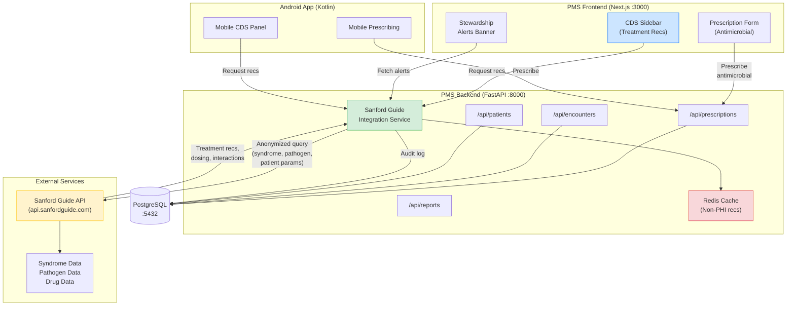

# Product Requirements Document: Sanford Guide Integration into Patient Management System (PMS)

**Document ID:** PRD-PMS-SANFORDGUIDE-001
**Version:** 1.0
**Date:** February 19, 2026
**Author:** Ammar (CEO, MPS Inc.)
**Status:** Draft

---

## 1. Executive Summary

The Sanford Guide to Antimicrobial Therapy is the industry-standard clinical decision support reference for infectious disease treatment, trusted by clinicians worldwide for over 50 years. Published by Antimicrobial Therapy, Inc. (Sperryville, VA), it delivers concise, evidence-based treatment guidelines covering syndromes, pathogens, and anti-infective agents — updated daily in its digital editions. The Sanford Guide is used in over 1,000 healthcare facilities globally and is consistently rated the top antimicrobial reference by physicians, pharmacists, and infectious disease specialists.

Integrating the Sanford Guide API into the PMS embeds real-time antimicrobial treatment recommendations directly into the prescribing workflow. When a clinician opens an encounter, creates a prescription, or reviews a patient's infection history, the PMS surfaces Sanford Guide content — syndrome-matched treatment regimens, pathogen-specific therapy, dosing adjustments for renal/hepatic impairment, drug interactions, and local antibiogram data — without requiring the provider to leave the PMS interface. This transforms the PMS from a passive record system into an active clinical decision support platform for infectious disease management.

For a healthcare system managing protected health information (PHI), the integration focuses on a one-directional data flow: the PMS sends anonymized clinical context (syndrome, pathogen, patient parameters) to the Sanford Guide API and receives treatment recommendations back. No PHI is stored or processed by Sanford Guide, minimizing HIPAA surface area while delivering maximum clinical value.

---

## 2. Problem Statement

The current PMS handles medication prescriptions and encounter documentation but lacks embedded clinical decision support for antimicrobial therapy:

- **No point-of-care antimicrobial guidance:** Clinicians must exit the PMS, open a separate Sanford Guide app or website, manually search for the relevant syndrome or pathogen, then return to the PMS to enter the prescription. This context-switching wastes 2-5 minutes per prescribing event and increases the risk of transcription errors.
- **No dose adjustment automation:** Renal and hepatic dose adjustments for anti-infectives require manual lookup. Clinicians must cross-reference the patient's GFR/creatinine clearance with drug-specific dosing tables — a tedious, error-prone process that the Sanford Guide API can automate.
- **No antimicrobial stewardship integration:** The PMS has no mechanism to surface institutional guidelines, local antibiogram data, or stewardship alerts (formulary restrictions, drug shortages, preferred agents) at the point of prescribing. Without embedded stewardship, inappropriate antimicrobial use goes unchecked.
- **No drug interaction checking for anti-infectives:** The PMS does not cross-reference a patient's current medication list against antimicrobial drug interactions. The Sanford Guide API provides comprehensive interaction data that could be surfaced inline during prescribing.
- **No pathogen-guided therapy workflow:** When lab results identify a specific pathogen, there is no automated pathway to recommend targeted antimicrobial therapy. Clinicians must manually interpret culture and sensitivity results and select therapy unaided.

---

## 3. Proposed Solution

Build a **Sanford Guide Integration Service** that acts as a middleware layer between the PMS backend and the Sanford Guide API. This service accepts clinical context from PMS workflows (encounters, prescriptions, lab results), queries the Sanford Guide API for relevant treatment recommendations, and returns structured guidance to the PMS frontend and Android app for display at the point of care.

### 3.1 Architecture Overview

### 3.2 Deployment Model

- **Cloud API integration:** The Sanford Guide API is a cloud-hosted service operated by Antimicrobial Therapy, Inc. The PMS backend communicates with it over HTTPS. No self-hosted infrastructure is required for the core content.
- **On-premise caching:** A Redis cache layer within the PMS Docker network stores non-PHI treatment recommendation responses (keyed by syndrome/pathogen/drug, not patient data) to reduce API latency and costs.
- **Stewardship Assist integration:** For institutions that subscribe to Sanford Guide Stewardship Assist, the PMS can pull institutional guidelines and antibiogram data through the same API channel.
- **HIPAA considerations:** The integration sends only anonymized clinical parameters (syndrome codes, pathogen identifiers, patient weight/renal function) to the Sanford Guide API — no patient names, MRN, DOB, or other PHI. Response data (treatment recommendations) is non-PHI reference content. A Business Associate Agreement (BAA) should still be executed with Antimicrobial Therapy, Inc. as a compliance best practice.

---

## 4. PMS Data Sources

The Sanford Guide integration interacts with the following PMS APIs:

- **Patient Records API (`/api/patients`):** Retrieves patient demographics (age, weight), renal function (GFR, creatinine clearance), hepatic function, and allergy list. These parameters are used to query the Sanford Guide API for dose-adjusted treatment recommendations. Only anonymized parameters are sent externally.
- **Encounter Records API (`/api/encounters`):** Retrieves active encounter context — chief complaint, diagnosis codes (ICD-10), and documented syndromes. Syndrome data drives Sanford Guide syndrome-based treatment lookups.
- **Medication & Prescription API (`/api/prescriptions`):** Retrieves the patient's current medication list for drug interaction checking against Sanford Guide's interaction database. Also the target for writing back the selected antimicrobial prescription.
- **Reporting API (`/api/reports`):** Provides antimicrobial usage and stewardship compliance reports. Aggregated prescribing data (antimicrobial selection, guideline adherence, dose appropriateness) feeds into stewardship dashboards.

---

## 5. Component/Module Definitions

### 5.1 Sanford Guide Integration Service

**Description:** A FastAPI module within the PMS backend that mediates all communication with the Sanford Guide API. Handles authentication, request construction, response parsing, caching, and audit logging.

**Input:** Anonymized clinical context (syndrome code, pathogen identifier, patient parameters: age, weight, GFR, hepatic function, allergy list, current medications).

**Output:** Structured treatment recommendations (primary regimen, alternative regimens, dosing details, adverse effects, drug interactions, stewardship notes).

**PMS APIs used:** `/api/patients`, `/api/encounters`, `/api/prescriptions`

### 5.2 Clinical Decision Support (CDS) Panel

**Description:** A Next.js sidebar component that displays Sanford Guide treatment recommendations inline during encounter documentation and prescribing workflows.

**Input:** Active encounter context, patient parameters, selected syndrome/pathogen.

**Output:** Rendered treatment cards with regimen details, dose adjustments, interaction alerts, and one-click prescription pre-fill.

**PMS APIs used:** `/api/encounters`, `/api/patients`

### 5.3 Drug Interaction Checker

**Description:** A middleware component that cross-references a proposed antimicrobial prescription against the patient's current medication list using Sanford Guide interaction data.

**Input:** Proposed antimicrobial + current medication list from `/api/prescriptions`.

**Output:** Interaction severity alerts (contraindicated, major, moderate, minor) with clinical detail and alternative recommendations.

**PMS APIs used:** `/api/prescriptions`

### 5.4 Stewardship Dashboard Module

**Description:** A reporting module that aggregates antimicrobial prescribing patterns, guideline adherence, and stewardship metrics.

**Input:** Historical prescription data from `/api/prescriptions`, Sanford Guide guideline mappings.

**Output:** Dashboard visualizations — antimicrobial usage trends, guideline compliance rates, dose appropriateness scores, and stewardship intervention opportunities.

**PMS APIs used:** `/api/prescriptions`, `/api/reports`

### 5.5 Mobile CDS Component (Android)

**Description:** A Jetpack Compose component in the Android app that mirrors the CDS Panel functionality for mobile clinicians.

**Input:** Active encounter context via PMS mobile API.

**Output:** Treatment recommendation cards optimized for mobile display with tap-to-prescribe functionality.

**PMS APIs used:** `/api/encounters`, `/api/patients`, `/api/prescriptions`

---

## 6. Non-Functional Requirements

### 6.1 Security and HIPAA Compliance

| Requirement | Implementation |
|---|---|
| PHI isolation | Only anonymized parameters (age, weight, GFR, syndrome code, pathogen ID) sent to Sanford Guide API — no patient identifiers |
| Transport encryption | All Sanford Guide API calls over TLS 1.3 |
| API key management | Sanford Guide API credentials stored in AWS Secrets Manager / Vault, rotated quarterly |
| Audit logging | Every Sanford Guide API query logged with timestamp, requesting clinician ID, encounter ID, and query parameters |
| BAA requirement | Execute Business Associate Agreement with Antimicrobial Therapy, Inc. before production deployment |
| Access control | CDS panel access restricted to clinician roles (physician, pharmacist, NP, PA) via PMS RBAC |
| Cache isolation | Redis cache stores only non-PHI reference content (treatment recs keyed by syndrome/drug, not patient ID) |

### 6.2 Performance

| Metric | Target |
|---|---|
| API response time (cached) | < 50ms |
| API response time (uncached) | < 500ms |
| CDS panel render time | < 200ms after API response |
| Cache hit rate (steady state) | > 80% |
| Mobile CDS load time | < 1 second |
| Concurrent users supported | 200+ clinicians |

### 6.3 Infrastructure

| Component | Specification |
|---|---|
| Sanford Guide API subscription | Enterprise API license from Antimicrobial Therapy, Inc. |
| Redis cache | Docker container, 512 MB, TTL 24 hours for non-PHI recommendation cache |
| Network egress | HTTPS egress to `api.sanfordguide.com` from PMS backend container |
| Monitoring | Prometheus metrics for API latency, cache hit rate, error rate |
| Fallback | Graceful degradation — CDS panel shows "Recommendations unavailable" if API is unreachable; prescribing workflow unblocked |

---

## 7. Implementation Phases

### Phase 1: Foundation (Sprints 1-3)

- Procure Sanford Guide Enterprise API license and execute BAA
- Build Sanford Guide Integration Service in FastAPI backend
- Implement API authentication, request/response models, and Redis caching
- Set up audit logging for all API queries
- Deploy integration service in Docker alongside existing PMS containers
- Build basic CDS panel in Next.js frontend (syndrome lookup, treatment display)

### Phase 2: Core Integration (Sprints 4-6)

- Integrate CDS panel into encounter and prescribing workflows
- Implement drug interaction checking with current medication cross-reference
- Add dose adjustment automation (renal/hepatic parameters from patient record)
- Build one-click prescription pre-fill from Sanford Guide recommendations
- Implement mobile CDS component in Android app
- Add Stewardship Assist integration for institutional guidelines and antibiograms

### Phase 3: Advanced Features (Sprints 7-9)

- Build stewardship dashboard with antimicrobial usage analytics
- Implement pathogen-guided therapy workflow (lab result → recommended therapy)
- Add clinician preference learning (track which recommendations are accepted/modified)
- Build stewardship compliance reports for `/api/reports`
- Integrate with existing MCP server (Experiment 09) to expose Sanford Guide tools as MCP-discoverable capabilities
- Performance optimization and load testing

---

## 8. Success Metrics

| Metric | Target | Measurement Method |
|---|---|---|
| Time-to-recommendation | < 10 seconds from encounter open to CDS panel populated | Frontend performance instrumentation |
| Clinician adoption | > 70% of antimicrobial prescriptions reference CDS panel within 6 months | Audit log analysis |
| Guideline adherence | > 85% of antimicrobial prescriptions align with Sanford Guide recommendations | Prescription vs. recommendation comparison |
| Dose adjustment accuracy | > 95% of renally-dosed antimicrobials have correct adjustment applied | Pharmacist review audit |
| Prescribing error reduction | > 30% reduction in antimicrobial prescribing errors vs. baseline | Incident report comparison |
| API availability | > 99.5% uptime for CDS panel | Monitoring dashboard |
| Clinician satisfaction | > 4.0/5.0 NPS for CDS panel usability | Quarterly clinician survey |

---

## 9. Risks and Mitigations

| Risk | Impact | Mitigation |
|---|---|---|
| Sanford Guide API downtime | CDS panel unavailable; clinicians lose point-of-care guidance | Graceful degradation — prescribing workflow continues without CDS; cached recommendations served when possible |
| API response latency | CDS panel feels slow; clinicians bypass it | Redis caching (80%+ hit rate target); async preloading of recommendations on encounter open |
| API licensing cost | Enterprise API license may be expensive for a startup | Start with limited API scope (syndrome + drug queries only); expand based on measured ROI |
| PHI leakage risk | Accidentally sending patient identifiers to external API | Strict data sanitization layer; unit tests validating no PHI fields in outbound requests; security review during Phase 1 |
| Clinician alert fatigue | Too many CDS recommendations → clinicians ignore all of them | Configurable alert thresholds; surface only high-confidence, clinically actionable recommendations |
| Content currency | Sanford Guide content may not reflect latest guidelines for rare conditions | Daily content updates via API (Sanford Guide updates content daily); fallback to latest cached content |
| Stewardship Assist adoption | Institutions may not subscribe to Stewardship Assist separately | Design CDS panel to work without Stewardship Assist; institutional features are additive |

---

## 10. Dependencies

| Dependency | Type | Notes |
|---|---|---|
| Sanford Guide Enterprise API License | External | Required before development begins; contact Antimicrobial Therapy, Inc. sales |
| Business Associate Agreement (BAA) | Legal | Must be executed before any patient-context data flows to Sanford Guide API |
| Redis | Infrastructure | Docker container for non-PHI recommendation caching |
| PMS Backend (FastAPI :8000) | Internal | Integration service runs as a module within the existing backend |
| PMS Frontend (Next.js :3000) | Internal | CDS panel and stewardship alerts integrated into existing UI |
| PMS Android App | Internal | Mobile CDS component added to encounter/prescribing views |
| PostgreSQL :5432 | Internal | Audit logs and stewardship reporting data |
| `/api/patients` endpoint | Internal | Patient parameters for dose adjustment queries |
| `/api/encounters` endpoint | Internal | Encounter context for syndrome-based lookups |
| `/api/prescriptions` endpoint | Internal | Medication list for interaction checking; prescription write-back |
| `/api/reports` endpoint | Internal | Stewardship analytics and compliance reporting |

---

## 11. Comparison with Existing Experiments

| Dimension | Sanford Guide (This Experiment) | MedASR (Experiment 07) | Adaptive Thinking (Experiment 08) | MCP (Experiment 09) |
|---|---|---|---|---|
| **Primary function** | Antimicrobial clinical decision support | Medical speech-to-text | AI reasoning optimization | Universal AI integration protocol |
| **Data direction** | External content → PMS (treatment recs inbound) | Audio → PMS (transcription inbound) | PMS data → AI model → PMS (bidirectional) | PMS ↔ AI clients (bidirectional protocol) |
| **PHI exposure** | Minimal — anonymized params sent outbound | High — raw audio contains PHI | Medium — clinical data sent to AI model | Medium — depends on tool invocations |
| **Self-hosted?** | No — cloud API from Antimicrobial Therapy, Inc. | Yes — on-premise GPU inference | No — uses Anthropic cloud API | Yes — self-hosted MCP server |
| **Complementary with** | MCP (expose as MCP tool), Adaptive Thinking (CDS reasoning), MedASR (dictation → antimicrobial lookup) | Sanford Guide (dictated diagnosis triggers CDS) | Sanford Guide (reason over treatment options) | All experiments (standardized access) |

The Sanford Guide integration is **complementary** to existing experiments. It provides the **clinical knowledge base** that other AI integrations act upon: MedASR transcribes a clinician's dictation mentioning "cellulitis," Adaptive Thinking reasons over treatment options, and MCP exposes the Sanford Guide lookup as a discoverable tool. Together, these form a pipeline from clinical observation to evidence-based prescription.

---

## 12. Research Sources

### Official Documentation
- [Sanford Guide Homepage](https://www.sanfordguide.com/) — Product overview, platform capabilities, subscription options
- [Sanford Guide API](https://www.sanfordguide.com/sanford-guide-api/) — API overview: real-time content delivery for syndrome, pathogen, and drug data
- [Sanford Guide Digital Subscriptions](https://www.sanfordguide.com/products/antimicrobial/digital/) — Digital platform features including web, mobile, and API access

### Integration & EHR
- [EHR & LIS Vendor Solutions](https://www.sanfordguide.com/solutions/ehr-lis-vendors/) — API integration approach for healthcare IT platforms
- [Hospital & Health System Solutions](https://www.sanfordguide.com/solutions/hospitals-health-systems) — Enterprise deployment, SSO, IP whitelisting, facility-wide access

### Stewardship & Clinical
- [Stewardship Assist](https://www.sanfordguide.com/stewardship-assist/) — Custom institutional guidelines, antibiogram integration, usage reporting
- [Antimicrobial Stewardship](https://www.sanfordguide.com/stewardship) — Stewardship program features and clinical evidence

### Alternatives & Ecosystem
- [Sanford Guide Review — iMedicalApps](https://www.imedicalapps.com/2015/12/sanford-guide-review-antimicrobial-therapy-app/) — Feature comparison with UpToDate, Epocrates, and other CDS tools
- [NIH Library: Sanford Guide](https://www.nihlibrary.nih.gov/about-us/news/enhance-your-clinical-decision-making-sanford-guide) — Clinical decision-making value and feature overview

---

## 13. Appendix: Related Documents

- [Sanford Guide Setup Guide](11-SanfordGuide-PMS-Developer-Setup-Guide.md)
- [Sanford Guide Developer Tutorial](11-SanfordGuide-Developer-Tutorial.md)
- [PRD: MCP PMS Integration](09-PRD-MCP-PMS-Integration.md) — Standardized protocol for exposing Sanford Guide as MCP tool
- [PRD: MedASR PMS Integration](07-PRD-MedASR-PMS-Integration.md) — Speech-to-text that feeds into antimicrobial CDS workflows
- [PRD: Adaptive Thinking PMS Integration](08-PRD-AdaptiveThinking-PMS-Integration.md) — AI reasoning over treatment recommendations
- [Sanford Guide Official Documentation](https://www.sanfordguide.com/)
