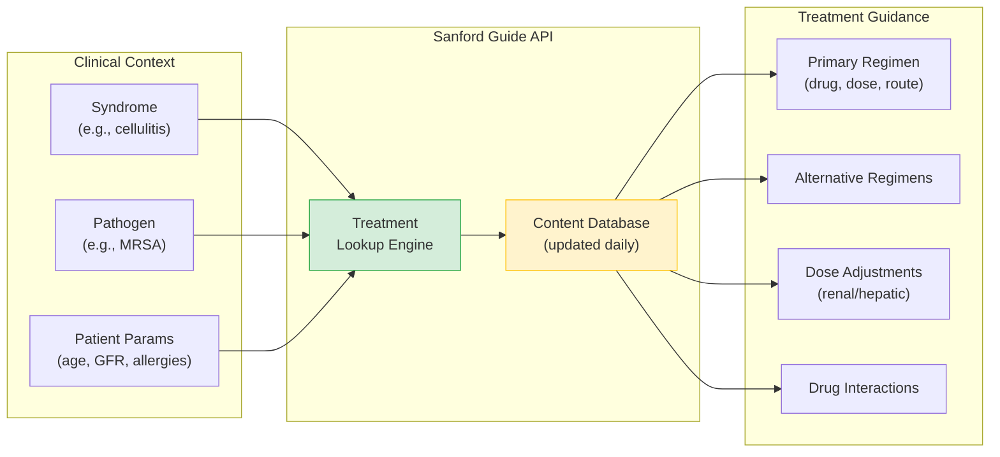
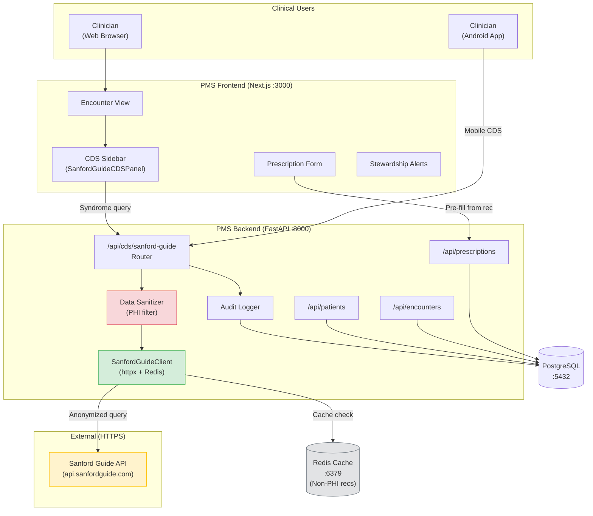

# Sanford Guide Developer Onboarding Tutorial

**Welcome to the MPS PMS Sanford Guide Integration Team**

This tutorial will take you from zero to building your first Sanford Guide clinical decision support integration with the PMS. By the end, you will understand how the Sanford Guide API works, have a running local environment, and have built and tested a custom antimicrobial CDS integration end-to-end.

**Document ID:** PMS-EXP-SANFORDGUIDE-002
**Version:** 1.0
**Date:** February 19, 2026
**Applies To:** PMS project (all platforms)
**Prerequisite:** [Sanford Guide Setup Guide](11-SanfordGuide-PMS-Developer-Setup-Guide.md)
**Estimated time:** 2-3 hours
**Difficulty:** Beginner-friendly

---

## What You Will Learn

1. What the Sanford Guide is and why it matters for antimicrobial prescribing
2. How the Sanford Guide API delivers treatment recommendations in real time
3. How syndrome-based, pathogen-based, and drug-based queries work
4. How the PMS integrates with the Sanford Guide API without exposing PHI
5. How to build a clinical decision support panel that surfaces recommendations at the point of care
6. How to implement drug interaction checking for antimicrobial prescriptions
7. How to cache recommendations using Redis for performance
8. How to audit-log all CDS queries for HIPAA compliance
9. How the Sanford Guide integration works alongside other PMS AI experiments (MCP, Adaptive Thinking, MedASR)
10. How to debug common integration issues

---

## Part 1: Understanding the Sanford Guide (15 min read)

### 1.1 What Problem Does the Sanford Guide Solve?

A clinician in the PMS encounters a patient with a suspected urinary tract infection. They need to prescribe an antimicrobial — but which one? The decision depends on:

- **The syndrome:** Is it uncomplicated cystitis, pyelonephritis, or catheter-associated UTI?
- **The pathogen:** Has a culture identified E. coli, Klebsiella, or Pseudomonas?
- **Patient factors:** What is the patient's renal function? Are they allergic to penicillin? Are they pregnant?
- **Local resistance:** What does the institution's antibiogram say about local susceptibility patterns?
- **Drug interactions:** Will the chosen antimicrobial interact with the patient's current medications?

Without embedded decision support, the clinician must leave the PMS, open the Sanford Guide app or website, manually look up the syndrome, cross-reference patient parameters, check interactions, and then return to the PMS to enter the prescription. This takes 2-5 minutes per prescribing event, introduces transcription errors, and makes antimicrobial stewardship compliance difficult to track.

The Sanford Guide integration solves this by embedding all of that clinical knowledge directly into the PMS prescribing workflow.

### 1.2 How the Sanford Guide Works — The Key Pieces



The Sanford Guide API has three primary content domains:

1. **Syndromes** — Clinical presentations (cellulitis, pneumonia, UTI, meningitis). Each syndrome maps to recommended first-line and alternative antimicrobial regimens with clinical settings, stewardship notes, and evidence grades.

2. **Pathogens** — Specific organisms (MRSA, E. coli, Pseudomonas aeruginosa). Each pathogen maps to susceptibility profiles, recommended therapy, and resistance considerations.

3. **Drugs** — Individual anti-infective agents (vancomycin, ciprofloxacin, amoxicillin). Each drug maps to adult/pediatric dosing, renal/hepatic adjustments, adverse effects, pharmacology, and drug interactions.

### 1.3 How the Sanford Guide Fits with Other PMS Technologies

| Technology | Role | Relationship to Sanford Guide |
|---|---|---|
| **MedASR** (Experiment 07) | Medical speech-to-text | Clinician dictates "patient has cellulitis" → MedASR transcribes → PMS extracts syndrome code → Sanford Guide provides treatment recs |
| **Adaptive Thinking** (Experiment 08) | AI reasoning optimization | When treatment choice is complex (multiple comorbidities, allergies), Adaptive Thinking reasons over Sanford Guide recommendations to suggest the best option |
| **MCP** (Experiment 09) | Universal AI integration protocol | Sanford Guide lookup becomes an MCP tool that any AI client (Claude Desktop, OpenClaw) can discover and invoke |
| **OpenClaw** (Experiment 05) | Agentic AI workflow automation | OpenClaw agents can autonomously query Sanford Guide as part of prior authorization or antimicrobial stewardship workflows |
| **Tambo** (Experiment 00) | Conversational analytics | Clinician asks Tambo "what's the recommended treatment for MRSA cellulitis?" → Tambo queries Sanford Guide CDS endpoint |

### 1.4 Key Vocabulary

| Term | Meaning |
|---|---|
| **Antimicrobial** | A drug that kills or inhibits the growth of microorganisms (antibiotics, antivirals, antifungals) |
| **Syndrome** | A clinical presentation or infection type (e.g., community-acquired pneumonia, uncomplicated UTI) |
| **Regimen** | A specific drug + dose + route + frequency + duration combination for treating an infection |
| **Antibiogram** | A summary of local antimicrobial susceptibility patterns for common pathogens at a specific institution |
| **Stewardship** | Programs and practices that ensure antimicrobials are used appropriately to combat resistance |
| **GFR** | Glomerular Filtration Rate — a measure of kidney function used for renal dose adjustment |
| **PHI** | Protected Health Information — patient-identifiable data governed by HIPAA |
| **CDS** | Clinical Decision Support — software that provides clinicians with knowledge and recommendations at the point of care |
| **BAA** | Business Associate Agreement — a HIPAA-required contract with any vendor that handles or could access PHI |
| **Spectra of Activity** | A visualization showing which antimicrobials are effective against which pathogens |
| **Drug Interaction** | A clinically significant effect that occurs when two drugs are used together |
| **Formulary** | An institution's list of approved drugs, often restricted for stewardship purposes |

### 1.5 Our Architecture



---

## Part 2: Environment Verification (15 min)

### 2.1 Checklist

Complete each verification step before proceeding:

1. **PMS Backend running:**
   ```bash
   curl -s http://localhost:8000/health
   # Expected: {"status": "healthy"}
   ```

2. **PMS Frontend running:**
   ```bash
   curl -s -o /dev/null -w "%{http_code}" http://localhost:3000
   # Expected: 200
   ```

3. **PostgreSQL running:**
   ```bash
   docker exec pms-db pg_isready -U pms
   # Expected: accepting connections
   ```

4. **Redis running:**
   ```bash
   docker exec pms-redis redis-cli ping
   # Expected: PONG
   ```

5. **Sanford Guide API key configured:**
   ```bash
   grep SANFORD_GUIDE_API_KEY .env
   # Expected: SANFORD_GUIDE_API_KEY=sg_your_key_here (not empty)
   ```

6. **CDS endpoint registered:**
   ```bash
   curl -s http://localhost:8000/api/cds/sanford-guide/health
   # Expected: {"status": "healthy", "cache": "connected"}
   ```

### 2.2 Quick Test

Run a single end-to-end test to confirm the full pipeline works:

```bash
curl -s -X POST http://localhost:8000/api/cds/sanford-guide/syndrome-recommendations \
  -H "Content-Type: application/json" \
  -H "Authorization: Bearer <your_dev_token>" \
  -d '{"syndrome_code": "uti_uncomplicated", "patient_age": 30, "gfr": 120}' \
  | python3 -m json.tool
```

You should see a JSON response with `primary_regimen`, `alternative_regimens`, and `dose_adjustments`. If you get an error, revisit the [Setup Guide](11-SanfordGuide-PMS-Developer-Setup-Guide.md) troubleshooting section.

---

## Part 3: Build Your First Integration (45 min)

### 3.1 What We Are Building

We will build a **Syndrome-to-Prescription Pipeline** — a feature that:

1. Accepts a syndrome code from an active encounter
2. Fetches patient parameters (age, weight, GFR, allergies) from `/api/patients`
3. Queries the Sanford Guide API for treatment recommendations
4. Displays the results in a CDS panel
5. Allows one-click prescription pre-fill from the recommended regimen
6. Logs everything for HIPAA audit

### 3.2 Step 1: Create the Patient Parameter Extractor

This utility pulls the relevant patient parameters needed for Sanford Guide queries.

Create `app/integrations/sanford_guide/patient_params.py`:

```python
"""Extract anonymized patient parameters for Sanford Guide queries."""

from typing import Any

from app.db.session import get_db


async def get_patient_params(patient_id: str, db) -> dict[str, Any]:
    """Extract anonymized patient parameters for CDS queries.

    Returns only non-PHI parameters needed for dose adjustment
    and treatment recommendation queries.
    """
    result = await db.fetch_one(
        """
        SELECT
            EXTRACT(YEAR FROM AGE(date_of_birth)) AS age,
            weight_kg,
            latest_gfr,
            hepatic_impairment,
            allergies
        FROM patients
        WHERE id = :patient_id
        """,
        {"patient_id": patient_id},
    )

    if not result:
        return {}

    return {
        "patient_age": int(result["age"]) if result["age"] else None,
        "patient_weight_kg": float(result["weight_kg"]) if result["weight_kg"] else None,
        "gfr": float(result["latest_gfr"]) if result["latest_gfr"] else None,
        "hepatic_impairment": bool(result["hepatic_impairment"]),
        "allergies": result["allergies"] or [],
    }
```

### 3.3 Step 2: Create the Encounter-Aware CDS Endpoint

This endpoint combines encounter context with patient parameters to deliver contextualized recommendations.

Add to `app/integrations/sanford_guide/router.py`:

```python
@router.post("/encounter-recommendations/{encounter_id}")
async def get_encounter_recommendations(
    encounter_id: str,
    clinician=Depends(get_current_clinician),
    db=Depends(get_db),
):
    """Get antimicrobial recommendations for an active encounter.

    Automatically extracts syndrome from encounter diagnosis
    and patient parameters from the patient record.
    """
    # 1. Get encounter details (syndrome/diagnosis)
    encounter = await db.fetch_one(
        "SELECT patient_id, syndrome_code, diagnosis_icd10 FROM encounters WHERE id = :id",
        {"id": encounter_id},
    )
    if not encounter:
        raise HTTPException(status_code=404, detail="Encounter not found")
    if not encounter["syndrome_code"]:
        raise HTTPException(
            status_code=422,
            detail="No syndrome code assigned to this encounter",
        )

    # 2. Get anonymized patient parameters
    from app.integrations.sanford_guide.patient_params import get_patient_params
    params = await get_patient_params(encounter["patient_id"], db)

    # 3. Build the query (no PHI — only clinical parameters)
    query = SyndromeQuery(
        syndrome_code=encounter["syndrome_code"],
        **params,
    )

    # 4. Fetch recommendations
    result = await sanford_client.get_syndrome_recommendations(query)

    # 5. Audit log
    await _audit_log(
        db,
        clinician.id,
        "encounter_recommendation",
        {"encounter_id": encounter_id, "syndrome": encounter["syndrome_code"]},
    )

    return result
```

### 3.4 Step 3: Create the Prescription Pre-Fill Endpoint

This endpoint converts a Sanford Guide recommendation into a draft prescription.

Add to `app/integrations/sanford_guide/router.py`:

```python
from pydantic import BaseModel


class PrescriptionDraft(BaseModel):
    """Draft prescription pre-filled from Sanford Guide recommendation."""
    encounter_id: str
    drug_name: str
    dose: str
    route: str
    frequency: str
    duration: str
    source: str = "sanford_guide"
    recommendation_type: str = "primary"


@router.post("/prefill-prescription")
async def prefill_prescription(
    draft: PrescriptionDraft,
    clinician=Depends(get_current_clinician),
    db=Depends(get_db),
):
    """Create a draft prescription from a Sanford Guide recommendation.

    The clinician must still review and confirm before the prescription
    is finalized — this is a pre-fill, not an auto-prescribe.
    """
    # Get current medications for interaction check
    current_meds = await db.fetch_all(
        """
        SELECT drug_name FROM prescriptions
        WHERE patient_id = (SELECT patient_id FROM encounters WHERE id = :eid)
          AND status = 'active'
        """,
        {"eid": draft.encounter_id},
    )

    # Check interactions
    med_names = [m["drug_name"] for m in current_meds]
    interactions = await sanford_client.check_drug_interactions(
        DrugInteractionQuery(
            proposed_drug=draft.drug_name,
            current_medications=med_names,
        )
    )

    # Create the draft (not finalized — clinician must confirm)
    draft_id = await db.execute(
        """
        INSERT INTO prescription_drafts
            (encounter_id, drug_name, dose, route, frequency, duration,
             source, recommendation_type, interaction_check, created_by)
        VALUES (:encounter_id, :drug_name, :dose, :route, :frequency,
                :duration, :source, :recommendation_type, :interactions,
                :clinician_id)
        RETURNING id
        """,
        {
            **draft.model_dump(),
            "interactions": str(interactions.model_dump()),
            "clinician_id": clinician.id,
        },
    )

    await _audit_log(
        db,
        clinician.id,
        "prescription_prefill",
        {"encounter_id": draft.encounter_id, "drug": draft.drug_name},
    )

    return {
        "draft_id": draft_id,
        "drug": draft.drug_name,
        "interactions": interactions,
        "status": "draft_created",
        "message": "Review and confirm to finalize prescription",
    }
```

### 3.5 Step 4: Create the Frontend Integration Hook

Create a React hook for the encounter-aware CDS flow in `hooks/useSanfordGuide.ts`:

```typescript
import { useState, useEffect, useCallback } from "react";
import {
  TreatmentRecommendation,
  DrugInteractionResult,
} from "@/lib/api/sanford-guide";

const CDS_API_URL = process.env.NEXT_PUBLIC_CDS_API_URL;

interface UseSanfordGuideOptions {
  encounterId: string;
  autoFetch?: boolean;
}

interface UseSanfordGuideResult {
  recommendation: TreatmentRecommendation | null;
  loading: boolean;
  error: string | null;
  fetchRecommendations: () => Promise<void>;
  prefillPrescription: (
    regimen: TreatmentRecommendation["primary_regimen"],
    type?: string
  ) => Promise<{ draft_id: string; interactions: DrugInteractionResult }>;
}

export function useSanfordGuide({
  encounterId,
  autoFetch = false,
}: UseSanfordGuideOptions): UseSanfordGuideResult {
  const [recommendation, setRecommendation] =
    useState<TreatmentRecommendation | null>(null);
  const [loading, setLoading] = useState(false);
  const [error, setError] = useState<string | null>(null);

  const fetchRecommendations = useCallback(async () => {
    setLoading(true);
    setError(null);

    try {
      const response = await fetch(
        `${CDS_API_URL}/encounter-recommendations/${encounterId}`,
        { credentials: "include" }
      );

      if (!response.ok) {
        const data = await response.json();
        throw new Error(data.detail || `API error: ${response.status}`);
      }

      const data = await response.json();
      setRecommendation(data);
    } catch (err) {
      setError(
        err instanceof Error
          ? err.message
          : "Recommendations unavailable"
      );
    } finally {
      setLoading(false);
    }
  }, [encounterId]);

  const prefillPrescription = useCallback(
    async (
      regimen: TreatmentRecommendation["primary_regimen"],
      type: string = "primary"
    ) => {
      const response = await fetch(`${CDS_API_URL}/prefill-prescription`, {
        method: "POST",
        headers: { "Content-Type": "application/json" },
        credentials: "include",
        body: JSON.stringify({
          encounter_id: encounterId,
          drug_name: regimen.drug,
          dose: regimen.dose,
          route: regimen.route,
          frequency: regimen.frequency,
          duration: regimen.duration,
          recommendation_type: type,
        }),
      });

      if (!response.ok) {
        throw new Error("Failed to create prescription draft");
      }

      return response.json();
    },
    [encounterId]
  );

  useEffect(() => {
    if (autoFetch && encounterId) {
      fetchRecommendations();
    }
  }, [autoFetch, encounterId, fetchRecommendations]);

  return {
    recommendation,
    loading,
    error,
    fetchRecommendations,
    prefillPrescription,
  };
}
```

### 3.6 Step 5: Wire It All Together

Update the encounter page to use the hook:

```tsx
"use client";

import { useSanfordGuide } from "@/hooks/useSanfordGuide";
import { SanfordGuideCDSPanel } from "@/components/cds/SanfordGuideCDSPanel";

export default function EncounterPage({
  params,
}: {
  params: { encounterId: string };
}) {
  const {
    recommendation,
    loading,
    error,
    fetchRecommendations,
    prefillPrescription,
  } = useSanfordGuide({
    encounterId: params.encounterId,
    autoFetch: true,
  });

  const handlePrefill = async (regimen) => {
    try {
      const result = await prefillPrescription(regimen);
      if (result.interactions.interactions.length > 0) {
        // Show interaction warning modal
        alert(
          `Warning: ${result.interactions.severity_summary}. Review interactions before confirming.`
        );
      }
      // Navigate to prescription review
      router.push(
        `/prescriptions/draft/${result.draft_id}`
      );
    } catch (err) {
      console.error("Prefill failed:", err);
    }
  };

  return (
    <div className="flex h-screen">
      <main className="flex-1 p-6 overflow-y-auto">
        {/* Encounter documentation content */}
      </main>

      <SanfordGuideCDSPanel
        encounterSyndromeCode={encounter?.syndromeCode}
        patientAge={patient?.age}
        patientWeightKg={patient?.weightKg}
        patientGfr={patient?.gfr}
        patientAllergies={patient?.allergies}
        onPrescriptionPrefill={handlePrefill}
      />
    </div>
  );
}
```

**Checkpoint:** You have built a complete syndrome-to-prescription pipeline — the CDS panel auto-fetches recommendations when an encounter opens, and the clinician can one-click prefill a prescription with automatic interaction checking.

---

## Part 4: Evaluating Strengths and Weaknesses (15 min)

### 4.1 Strengths

- **Gold-standard content:** The Sanford Guide is the most trusted antimicrobial reference worldwide, with over 50 years of editorial history and daily updates. No other CDS source matches its depth and currency for infectious disease treatment.
- **Three-domain coverage:** Syndrome, pathogen, and drug queries cover the full antimicrobial decision workflow — from "what might this be?" to "what drug should I use?" to "how should I dose it?"
- **Stewardship Assist:** The institutional customization layer (antibiograms, local guidelines, stewardship alerts) is unique — it bridges evidence-based recommendations with local practice patterns.
- **No PHI exposure:** The integration model is one-directional (anonymized parameters out, reference content back), minimizing HIPAA compliance burden.
- **Daily content updates:** Treatment guidelines stay current without developer intervention — the API always returns the latest evidence.
- **Proven adoption:** Used in 1,000+ facilities globally; Walter Reed study showed 95% of users modified prescribing practices after adoption.

### 4.2 Weaknesses

- **Proprietary API:** The Sanford Guide API is not open-source. API documentation, endpoints, and data formats are provided only under enterprise license. This creates vendor lock-in and limits the ability to prototype without a paid license.
- **Enterprise licensing cost:** The API requires a commercial enterprise license, which may be significant for a startup. Pricing is not publicly available.
- **Limited public documentation:** Unlike open APIs (FHIR, HL7), the Sanford Guide API's technical specifications are not publicly documented. Integration requires working directly with their sales/engineering team.
- **Antimicrobial-only scope:** The Sanford Guide covers infectious disease treatment — it does not provide CDS for cardiology, endocrinology, or other domains. Broader CDS requires additional data sources (UpToDate, DynaMed).
- **No offline mode:** The API requires internet connectivity. For edge deployments (Jetson Thor, field clinics), an offline fallback strategy is needed.
- **Syndrome taxonomy mapping:** The PMS must map its internal diagnosis codes (ICD-10) to Sanford Guide's syndrome taxonomy. This mapping requires clinical input and ongoing maintenance.

### 4.3 When to Use the Sanford Guide vs Alternatives

| Scenario | Best Choice | Reasoning |
|---|---|---|
| Antimicrobial prescribing for identified syndromes | **Sanford Guide** | Gold-standard antimicrobial-specific content; concise and actionable |
| Broad clinical reference (any specialty) | **UpToDate** | Covers all medical specialties, not just ID |
| Quick drug reference and dosing | **Epocrates** or **Lexicomp** | Broader drug coverage beyond antimicrobials |
| Antimicrobial stewardship program support | **Sanford Guide + Stewardship Assist** | Only CDS tool with institutional antibiogram integration |
| Pathogen-guided therapy from lab results | **Sanford Guide** | Pathogen-specific treatment recommendations with resistance data |
| Drug interaction checking (all drug classes) | **Lexicomp** or **Micromedex** | Broader interaction database beyond antimicrobials |

### 4.4 HIPAA / Healthcare Considerations

| Area | Assessment |
|---|---|
| **PHI in queries** | Low risk — only anonymized parameters (age, weight, GFR, syndrome code) sent externally. No patient identifiers. |
| **PHI in responses** | No risk — responses are generic reference content (drug names, dosing tables), not patient-specific data. |
| **BAA requirement** | Recommended — even though no PHI flows to Sanford Guide, execute a BAA as a compliance best practice given the clinical context. |
| **Audit trail** | Required — every CDS query is logged with clinician ID, encounter ID, timestamp, and query parameters. |
| **Access control** | CDS endpoints restricted to authenticated clinician roles (physician, pharmacist, NP, PA). |
| **Data residency** | Sanford Guide API is US-hosted. Confirm with vendor for any non-US deployment requirements. |
| **Cache security** | Redis cache stores only non-PHI reference content. Cache keys are hash-derived, not patient-identifiable. |

---

## Part 5: Debugging Common Issues (15 min read)

### Issue 1: "Recommendations temporarily unavailable" in CDS panel

**Symptoms:** The CDS panel shows a yellow warning banner. Backend logs show `httpx.ConnectError`.

**Cause:** The PMS backend cannot reach the Sanford Guide API (network issue, DNS failure, or API outage).

**Fix:**
1. Test connectivity: `curl -I https://api.sanfordguide.com`
2. Check if API key is valid: look for 401 errors in backend logs
3. Verify Docker network allows outbound HTTPS: `docker exec pms-backend curl -I https://api.sanfordguide.com`
4. If the API is down, the integration degrades gracefully — prescribing continues without CDS

### Issue 2: Cache miss rate is high (> 50%)

**Symptoms:** Most CDS queries hit the Sanford Guide API instead of Redis cache. API response times are high.

**Cause:** Cache keys are too specific (including patient-specific parameters that vary across patients), or cache TTL is too short.

**Fix:**
1. Check cache TTL: `echo $SANFORD_GUIDE_CACHE_TTL` (should be 86400 = 24 hours)
2. Review cache key composition — keys should hash by syndrome + drug, not by patient ID
3. Monitor key count: `docker exec pms-redis redis-cli dbsize`
4. Consider preloading common syndromes at startup

### Issue 3: Syndrome code not recognized by Sanford Guide API

**Symptoms:** API returns 404 or empty results for a valid PMS syndrome.

**Cause:** The PMS uses ICD-10 codes, but the Sanford Guide API uses its own syndrome taxonomy.

**Fix:**
1. Create a mapping table: ICD-10 code → Sanford Guide syndrome code
2. Consult the Sanford Guide API documentation for the complete syndrome taxonomy
3. Add fallback behavior — if no exact match, suggest the clinician select from a syndrome picker

### Issue 4: Drug interaction check returns empty for known interactions

**Symptoms:** Known drug-drug interactions (e.g., metronidazole + warfarin) return no results.

**Cause:** Drug names sent to the API don't match Sanford Guide's drug naming convention (e.g., brand name vs. generic name vs. INN).

**Fix:**
1. Standardize drug names to generic/INN names before sending to the API
2. Check if the API expects RxNorm codes instead of text names
3. Verify the interaction check endpoint is using the correct API path

### Issue 5: Audit log table is missing or migration not applied

**Symptoms:** CDS queries fail with `relation "cds_audit_log" does not exist`.

**Cause:** The database migration for the audit log table was not run.

**Fix:**
1. Run the migration: `alembic upgrade head` (or apply the SQL manually)
2. Verify: `docker exec pms-db psql -U pms -d pms -c "\dt cds_audit_log"`
3. Check that the migration file is in the `migrations/versions/` directory

---

## Part 6: Practice Exercise (45 min)

### Option A: Build a Pathogen-Guided Therapy Endpoint

**Scenario:** A lab culture result identifies *Staphylococcus aureus* (MRSA) from a wound culture. Build an endpoint that accepts a pathogen identifier and returns targeted antimicrobial therapy recommendations.

**Steps:**
1. Create a `PathogenQuery` Pydantic model with `pathogen_code`, `susceptibility_data`, and patient parameters
2. Add a `/api/cds/sanford-guide/pathogen-recommendations` endpoint
3. Query the Sanford Guide API's pathogen endpoint
4. Display results in a dedicated "Lab-Guided Therapy" card in the CDS panel
5. Add audit logging

**Hints:**
- Use the same `SanfordGuideClient` pattern with Redis caching
- Pathogen codes may follow a different taxonomy than syndromes — consult API docs
- Include susceptibility data (S/I/R) if available from the lab result

### Option B: Build a Stewardship Compliance Report

**Scenario:** The antimicrobial stewardship committee wants a monthly report showing how often clinicians followed Sanford Guide recommendations vs. chose alternatives.

**Steps:**
1. Query the `cds_audit_log` table for all `encounter_recommendation` and `prescription_prefill` events
2. Join with the `prescriptions` table to compare recommended drug vs. prescribed drug
3. Calculate guideline adherence rate (prescribed drug matches primary recommendation)
4. Return the report as a JSON response from `/api/reports/stewardship-compliance`
5. Build a simple bar chart in the frontend using the reporting data

**Hints:**
- Group by month and by syndrome for meaningful breakdowns
- Include "alternative regimen" matches — these count as guideline-adherent
- Consider adding a "reason for deviation" field to the prescription form

### Option C: Build an Allergy-Aware Recommendation Filter

**Scenario:** A patient is allergic to penicillin. The Sanford Guide recommends amoxicillin (a penicillin) as first-line therapy. Build logic that automatically filters out contraindicated regimens and promotes the best alternative.

**Steps:**
1. Fetch the patient's allergy list from `/api/patients`
2. Query Sanford Guide for syndrome recommendations
3. Cross-reference the primary regimen's drug class against the allergy list
4. If contraindicated, promote the first safe alternative regimen to "primary"
5. Display a warning badge on the original (filtered-out) regimen

**Hints:**
- Drug class cross-referencing requires a drug-to-class mapping (e.g., amoxicillin → penicillin class)
- The Sanford Guide API may provide drug class information in its drug data responses
- Always show the filtered regimen (with a warning) — never silently hide it from the clinician

---

## Part 7: Development Workflow and Conventions

### 7.1 File Organization

```
pms-backend/
└── app/
    └── integrations/
        └── sanford_guide/
            ├── __init__.py
            ├── client.py           # API client with Redis caching
            ├── router.py           # FastAPI endpoints
            ├── sanitizer.py        # PHI data sanitization
            ├── patient_params.py   # Patient parameter extraction
            ├── models.py           # Pydantic models (if split from client)
            └── tests/
                ├── test_client.py
                ├── test_router.py
                └── test_sanitizer.py

pms-frontend/
├── lib/
│   └── api/
│       └── sanford-guide.ts        # API client types and functions
├── hooks/
│   └── useSanfordGuide.ts          # React hook for CDS flow
└── components/
    └── cds/
        ├── SanfordGuideCDSPanel.tsx  # Main CDS sidebar component
        ├── TreatmentCard.tsx         # Individual recommendation card
        ├── InteractionAlert.tsx      # Drug interaction warning
        └── StewardshipBanner.tsx     # Stewardship alert banner
```

### 7.2 Naming Conventions

| Item | Convention | Example |
|---|---|---|
| Backend module | `snake_case` directory under `integrations/` | `sanford_guide/` |
| API endpoints | `/api/cds/sanford-guide/` prefix | `/api/cds/sanford-guide/syndrome-recommendations` |
| Pydantic models | `PascalCase` | `SyndromeQuery`, `TreatmentRecommendation` |
| Frontend API client | `camelCase` functions | `getSyndromeRecommendations()` |
| React components | `PascalCase` | `SanfordGuideCDSPanel` |
| React hooks | `usePascalCase` | `useSanfordGuide` |
| Cache keys | `sg:{type}:{hash}` | `sg:syndrome:a1b2c3d4` |
| Audit log actions | `snake_case` | `syndrome_lookup`, `interaction_check` |
| Environment variables | `UPPER_SNAKE_CASE` | `SANFORD_GUIDE_API_KEY` |

### 7.3 PR Checklist

- [ ] No PHI in outbound API requests (run `test_sanitizer.py`)
- [ ] All CDS queries have audit logging
- [ ] Redis cache keys do not contain patient identifiers
- [ ] Error handling returns graceful degradation (not stack traces)
- [ ] New endpoints require clinician authentication (`Depends(get_current_clinician)`)
- [ ] Frontend handles API errors with user-friendly messages
- [ ] Drug interaction alerts use severity-based color coding
- [ ] Unit tests for new backend endpoints
- [ ] Integration test with mock Sanford Guide API responses

### 7.4 Security Reminders

- **Never log PHI:** Audit logs record clinician ID and query parameters — never log patient names, MRN, or other identifiers.
- **Never cache PHI:** Redis cache keys and values contain only syndrome/drug identifiers and reference content. Never include patient IDs in cache keys.
- **Always sanitize:** Every outbound request to the Sanford Guide API must pass through the data sanitizer. This is enforced in the client, but verify in code review.
- **API key rotation:** Rotate the Sanford Guide API key quarterly. Store in environment variables, never in code.
- **Access control:** CDS endpoints are for authenticated clinicians only. Non-clinical roles (admin, billing) should not access treatment recommendations.

---

## Part 8: Quick Reference Card

### Key Commands

```bash
# Start services
docker compose up -d

# Health check
curl http://localhost:8000/api/cds/sanford-guide/health

# Syndrome lookup
curl -X POST http://localhost:8000/api/cds/sanford-guide/syndrome-recommendations \
  -H "Content-Type: application/json" \
  -H "Authorization: Bearer <token>" \
  -d '{"syndrome_code": "cellulitis", "patient_age": 55, "gfr": 60}'

# Interaction check
curl -X POST http://localhost:8000/api/cds/sanford-guide/drug-interactions \
  -H "Content-Type: application/json" \
  -H "Authorization: Bearer <token>" \
  -d '{"proposed_drug": "ciprofloxacin", "current_medications": ["warfarin"]}'

# View audit log
docker exec pms-db psql -U pms -d pms -c \
  "SELECT * FROM cds_audit_log ORDER BY timestamp DESC LIMIT 5;"

# Clear cache
docker exec pms-redis redis-cli keys "sg:*" | xargs docker exec pms-redis redis-cli del

# Monitor Redis
docker exec pms-redis redis-cli monitor
```

### Key Files

| File | Purpose |
|---|---|
| `app/integrations/sanford_guide/client.py` | Sanford Guide API client with caching |
| `app/integrations/sanford_guide/router.py` | FastAPI CDS endpoints |
| `app/integrations/sanford_guide/sanitizer.py` | PHI data sanitization |
| `lib/api/sanford-guide.ts` | Frontend API client |
| `hooks/useSanfordGuide.ts` | React CDS hook |
| `components/cds/SanfordGuideCDSPanel.tsx` | CDS sidebar component |

### Key URLs

| Resource | URL |
|---|---|
| CDS Health Check | `http://localhost:8000/api/cds/sanford-guide/health` |
| API Documentation | `http://localhost:8000/docs#/Clinical%20Decision%20Support` |
| Sanford Guide Web Edition | `https://webedition.sanfordguide.com` |
| Sanford Guide API Reference | Provided with enterprise license |

### Starter Template — New CDS Endpoint

```python
@router.post("/my-new-cds-feature")
async def my_new_cds_feature(
    query: MyQueryModel,
    clinician=Depends(get_current_clinician),
    db=Depends(get_db),
):
    """Description of what this endpoint does."""
    try:
        result = await sanford_client.some_api_call(query)
        await _audit_log(db, clinician.id, "my_action", query.model_dump())
        return result
    except Exception as e:
        logger.error("CDS error: %s", e)
        raise HTTPException(status_code=503, detail="CDS temporarily unavailable")
```

---

## Next Steps

1. Review the [PRD](11-PRD-SanfordGuide-PMS-Integration.md) for the full feature roadmap (Phases 2 and 3)
2. Implement Stewardship Assist integration for institutional guidelines and antibiogram data
3. Build the mobile CDS component for the Android app using Jetpack Compose
4. Expose the Sanford Guide CDS as an [MCP tool](09-PRD-MCP-PMS-Integration.md) for AI client discovery
5. Connect Sanford Guide recommendations to [Adaptive Thinking](08-PRD-AdaptiveThinking-PMS-Integration.md) for complex treatment reasoning
