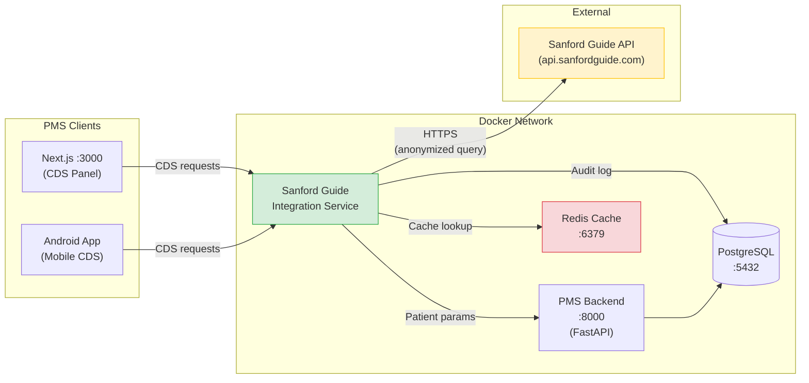

# Sanford Guide Setup Guide for PMS Integration

**Document ID:** PMS-EXP-SANFORDGUIDE-001
**Version:** 1.0
**Date:** February 19, 2026
**Applies To:** PMS project (all platforms)
**Prerequisites Level:** Intermediate

---

## Table of Contents

1. [Overview](#1-overview)
2. [Prerequisites](#2-prerequisites)
3. [Part A: Obtain and Configure Sanford Guide API Access](#3-part-a-obtain-and-configure-sanford-guide-api-access)
4. [Part B: Integrate with PMS Backend](#4-part-b-integrate-with-pms-backend)
5. [Part C: Integrate with PMS Frontend](#5-part-c-integrate-with-pms-frontend)
6. [Part D: Testing and Verification](#6-part-d-testing-and-verification)
7. [Troubleshooting](#7-troubleshooting)
8. [Reference Commands](#8-reference-commands)

---

## 1. Overview

This guide walks you through integrating the **Sanford Guide API** into the PMS — a clinical decision support integration that surfaces real-time antimicrobial treatment recommendations directly in the prescribing workflow. By the end, you will have:

- A configured Sanford Guide API client in the PMS backend
- A Redis cache for non-PHI treatment recommendation responses
- A Sanford Guide Integration Service module in FastAPI
- CDS (Clinical Decision Support) sidebar panel in the Next.js frontend
- Drug interaction checking for antimicrobial prescriptions
- Audit logging for all Sanford Guide API queries
- HIPAA-compliant data sanitization layer

### Architecture at a Glance



---

## 2. Prerequisites

### 2.1 Required Software

| Software | Minimum Version | Check Command |
|---|---|---|
| Docker | 24.0+ | `docker --version` |
| Docker Compose | 2.20+ | `docker compose version` |
| Python | 3.11+ | `python3 --version` |
| Node.js | 18.0+ | `node --version` |
| npm | 9.0+ | `npm --version` |
| Redis CLI (optional) | 7.0+ | `redis-cli --version` |
| curl | any | `curl --version` |

### 2.2 Installation of Prerequisites

**Redis (for local development without Docker):**

```bash
# macOS
brew install redis

# Ubuntu/Debian
sudo apt-get install redis-server

# Verify
redis-cli ping
# Expected: PONG
```

**httpx (Python HTTP client):**

```bash
pip install httpx[http2]
```

### 2.3 Verify PMS Services

Before proceeding, confirm the PMS backend, frontend, and database are running:

```bash
# Check PMS backend
curl -s http://localhost:8000/health | python3 -m json.tool
# Expected: {"status": "healthy"}

# Check PMS frontend
curl -s -o /dev/null -w "%{http_code}" http://localhost:3000
# Expected: 200

# Check PostgreSQL
docker exec pms-db pg_isready -U pms
# Expected: /var/run/postgresql:5432 - accepting connections
```

**Checkpoint:** All three PMS services are running and responding.

---

## 3. Part A: Obtain and Configure Sanford Guide API Access

### Step 1: Request an Enterprise API License

Contact Antimicrobial Therapy, Inc. to obtain an Enterprise API license:

- **Sales contact:** Visit [sanfordguide.com/sanford-guide-api](https://www.sanfordguide.com/sanford-guide-api/) and click "Contact Our Team"
- **Request:** Enterprise API access for EHR/clinical decision support integration
- **Include:** Organization name (MPS Inc.), intended use case (antimicrobial CDS in PMS), estimated query volume
- **Deliverables from Sanford Guide:** API key, API base URL, API documentation, rate limit details

### Step 2: Execute a Business Associate Agreement (BAA)

Before any clinical context flows to the Sanford Guide API:

1. Request a BAA from Antimicrobial Therapy, Inc.
2. Legal review by MPS compliance team
3. Execute and store the signed BAA in `docs/quality/` (do not commit the signed document — store securely and reference it)

### Step 3: Configure Environment Variables

Create or update the `.env` file in the PMS backend project:

```bash
# Sanford Guide API Configuration
SANFORD_GUIDE_API_KEY=sg_your_api_key_here
SANFORD_GUIDE_API_URL=https://api.sanfordguide.com/v1
SANFORD_GUIDE_CACHE_TTL=86400
SANFORD_GUIDE_TIMEOUT=5000

# Redis Configuration (for recommendation caching)
REDIS_URL=redis://localhost:6379/1
REDIS_CACHE_PREFIX=sg:
```

> **Security note:** Never commit `.env` files containing API keys. Add `.env` to `.gitignore` if not already present.

### Step 4: Add Redis to Docker Compose

Add the Redis service to your existing `docker-compose.yml`:

```yaml
services:
  # ... existing services (pms-backend, pms-frontend, pms-db) ...

  redis:
    image: redis:7-alpine
    container_name: pms-redis
    ports:
      - "6379:6379"
    volumes:
      - redis_data:/data
    command: redis-server --maxmemory 512mb --maxmemory-policy allkeys-lru
    healthcheck:
      test: ["CMD", "redis-cli", "ping"]
      interval: 10s
      timeout: 5s
      retries: 3

volumes:
  redis_data:
```

Start Redis:

```bash
docker compose up -d redis
```

Verify:

```bash
docker exec pms-redis redis-cli ping
# Expected: PONG
```

### Step 5: Install Python Dependencies

Add the required packages to `requirements.txt`:

```
httpx[http2]>=0.27.0
redis>=5.0.0
pydantic>=2.0.0
```

Install:

```bash
pip install -r requirements.txt
```

**Checkpoint:** You have a Sanford Guide API key configured in `.env`, Redis running in Docker, and Python dependencies installed.

---

## 4. Part B: Integrate with PMS Backend

### Step 1: Create the Sanford Guide Client Module

Create `app/integrations/sanford_guide/client.py`:

```python
"""Sanford Guide API client for the PMS backend."""

import hashlib
import json
import logging
from typing import Any

import httpx
import redis.asyncio as redis
from pydantic import BaseModel

from app.core.config import settings

logger = logging.getLogger(__name__)


class SyndromeQuery(BaseModel):
    """Query parameters for syndrome-based treatment lookup."""
    syndrome_code: str
    patient_age: int | None = None
    patient_weight_kg: float | None = None
    gfr: float | None = None
    hepatic_impairment: bool = False
    allergies: list[str] = []


class TreatmentRecommendation(BaseModel):
    """Structured treatment recommendation from Sanford Guide."""
    syndrome: str
    primary_regimen: dict[str, Any]
    alternative_regimens: list[dict[str, Any]] = []
    dose_adjustments: dict[str, Any] = {}
    adverse_effects: list[str] = []
    drug_interactions: list[dict[str, Any]] = []
    stewardship_notes: str | None = None
    source_url: str | None = None


class DrugInteractionQuery(BaseModel):
    """Query parameters for drug interaction checking."""
    proposed_drug: str
    current_medications: list[str]


class DrugInteractionResult(BaseModel):
    """Drug interaction check result."""
    proposed_drug: str
    interactions: list[dict[str, Any]]
    severity_summary: str


class SanfordGuideClient:
    """Async client for the Sanford Guide API with Redis caching."""

    def __init__(self):
        self.api_key = settings.SANFORD_GUIDE_API_KEY
        self.base_url = settings.SANFORD_GUIDE_API_URL
        self.timeout = settings.SANFORD_GUIDE_TIMEOUT / 1000  # ms to seconds
        self.cache_ttl = settings.SANFORD_GUIDE_CACHE_TTL
        self._http_client: httpx.AsyncClient | None = None
        self._redis: redis.Redis | None = None

    async def _get_http_client(self) -> httpx.AsyncClient:
        if self._http_client is None:
            self._http_client = httpx.AsyncClient(
                base_url=self.base_url,
                headers={
                    "Authorization": f"Bearer {self.api_key}",
                    "Content-Type": "application/json",
                    "Accept": "application/json",
                },
                timeout=self.timeout,
            )
        return self._http_client

    async def _get_redis(self) -> redis.Redis:
        if self._redis is None:
            self._redis = redis.from_url(settings.REDIS_URL)
        return self._redis

    def _cache_key(self, prefix: str, params: dict) -> str:
        """Generate a deterministic cache key from query parameters (no PHI)."""
        param_hash = hashlib.sha256(
            json.dumps(params, sort_keys=True).encode()
        ).hexdigest()[:16]
        return f"{settings.REDIS_CACHE_PREFIX}{prefix}:{param_hash}"

    async def get_syndrome_recommendations(
        self, query: SyndromeQuery
    ) -> TreatmentRecommendation:
        """Fetch treatment recommendations for a clinical syndrome."""
        cache_params = query.model_dump(exclude_none=True)
        cache_key = self._cache_key("syndrome", cache_params)

        # Check cache first
        r = await self._get_redis()
        cached = await r.get(cache_key)
        if cached:
            logger.info("Cache hit for syndrome query: %s", query.syndrome_code)
            return TreatmentRecommendation.model_validate_json(cached)

        # Query Sanford Guide API
        client = await self._get_http_client()
        response = await client.post(
            "/syndromes/recommend",
            json=cache_params,
        )
        response.raise_for_status()

        result = TreatmentRecommendation.model_validate(response.json())

        # Cache the response (non-PHI reference content)
        await r.setex(cache_key, self.cache_ttl, result.model_dump_json())
        logger.info("Cached syndrome recommendation: %s", query.syndrome_code)

        return result

    async def check_drug_interactions(
        self, query: DrugInteractionQuery
    ) -> DrugInteractionResult:
        """Check drug interactions for a proposed antimicrobial."""
        cache_params = query.model_dump()
        cache_key = self._cache_key("interaction", cache_params)

        r = await self._get_redis()
        cached = await r.get(cache_key)
        if cached:
            return DrugInteractionResult.model_validate_json(cached)

        client = await self._get_http_client()
        response = await client.post(
            "/drugs/interactions",
            json=cache_params,
        )
        response.raise_for_status()

        result = DrugInteractionResult.model_validate(response.json())
        await r.setex(cache_key, self.cache_ttl, result.model_dump_json())

        return result

    async def close(self):
        """Clean up HTTP and Redis connections."""
        if self._http_client:
            await self._http_client.aclose()
        if self._redis:
            await self._redis.aclose()


# Singleton instance
sanford_client = SanfordGuideClient()
```

### Step 2: Create the API Router

Create `app/integrations/sanford_guide/router.py`:

```python
"""FastAPI router for Sanford Guide CDS endpoints."""

import logging
from datetime import datetime, timezone

from fastapi import APIRouter, Depends, HTTPException

from app.auth.dependencies import get_current_clinician
from app.db.session import get_db
from app.integrations.sanford_guide.client import (
    DrugInteractionQuery,
    SanfordGuideClient,
    SyndromeQuery,
    sanford_client,
)

logger = logging.getLogger(__name__)
router = APIRouter(prefix="/api/cds/sanford-guide", tags=["Clinical Decision Support"])


async def _audit_log(db, clinician_id: str, action: str, params: dict):
    """Log CDS query for HIPAA audit trail."""
    await db.execute(
        """
        INSERT INTO cds_audit_log (clinician_id, action, query_params, timestamp)
        VALUES (:clinician_id, :action, :params, :timestamp)
        """,
        {
            "clinician_id": clinician_id,
            "action": action,
            "params": str(params),
            "timestamp": datetime.now(timezone.utc),
        },
    )


@router.post("/syndrome-recommendations")
async def get_syndrome_recommendations(
    query: SyndromeQuery,
    clinician=Depends(get_current_clinician),
    db=Depends(get_db),
):
    """Get antimicrobial treatment recommendations for a clinical syndrome.

    Sends anonymized patient parameters to Sanford Guide API.
    No PHI (name, MRN, DOB) is transmitted externally.
    """
    try:
        result = await sanford_client.get_syndrome_recommendations(query)
        await _audit_log(db, clinician.id, "syndrome_lookup", query.model_dump())
        return result
    except Exception as e:
        logger.error("Sanford Guide API error: %s", e)
        raise HTTPException(
            status_code=503,
            detail="Antimicrobial recommendations temporarily unavailable",
        )


@router.post("/drug-interactions")
async def check_drug_interactions(
    query: DrugInteractionQuery,
    clinician=Depends(get_current_clinician),
    db=Depends(get_db),
):
    """Check drug interactions for a proposed antimicrobial prescription."""
    try:
        result = await sanford_client.check_drug_interactions(query)
        await _audit_log(db, clinician.id, "interaction_check", query.model_dump())
        return result
    except Exception as e:
        logger.error("Sanford Guide interaction check error: %s", e)
        raise HTTPException(
            status_code=503,
            detail="Drug interaction checking temporarily unavailable",
        )


@router.get("/health")
async def sanford_guide_health():
    """Health check for the Sanford Guide integration."""
    try:
        r = await sanford_client._get_redis()
        await r.ping()
        return {"status": "healthy", "cache": "connected"}
    except Exception:
        return {"status": "degraded", "cache": "disconnected"}
```

### Step 3: Create the Data Sanitization Layer

Create `app/integrations/sanford_guide/sanitizer.py`:

```python
"""Data sanitization layer — ensures no PHI is sent to Sanford Guide API."""

from app.integrations.sanford_guide.client import SyndromeQuery

# Fields that are safe to send externally (no PHI)
ALLOWED_FIELDS = {
    "syndrome_code",
    "patient_age",
    "patient_weight_kg",
    "gfr",
    "hepatic_impairment",
    "allergies",
}

# Fields that must NEVER leave the PMS
PHI_FIELDS = {
    "patient_id",
    "patient_name",
    "mrn",
    "date_of_birth",
    "ssn",
    "address",
    "phone",
    "email",
    "encounter_id",
    "insurance_id",
}


def sanitize_query(query: SyndromeQuery) -> dict:
    """Strip any PHI fields and return only safe parameters."""
    data = query.model_dump(exclude_none=True)
    sanitized = {k: v for k, v in data.items() if k in ALLOWED_FIELDS}

    # Verify no PHI leaked through
    for field in PHI_FIELDS:
        if field in data:
            raise ValueError(f"PHI field '{field}' must not be sent to external API")

    return sanitized
```

### Step 4: Create the Database Migration for Audit Logging

Create the audit log table migration:

```sql
-- migrations/versions/xxxx_add_cds_audit_log.sql

CREATE TABLE IF NOT EXISTS cds_audit_log (
    id SERIAL PRIMARY KEY,
    clinician_id VARCHAR(255) NOT NULL,
    action VARCHAR(100) NOT NULL,
    query_params TEXT NOT NULL,
    timestamp TIMESTAMPTZ NOT NULL DEFAULT NOW(),
    response_time_ms INTEGER,
    cache_hit BOOLEAN DEFAULT FALSE
);

CREATE INDEX idx_cds_audit_clinician ON cds_audit_log (clinician_id);
CREATE INDEX idx_cds_audit_timestamp ON cds_audit_log (timestamp);
CREATE INDEX idx_cds_audit_action ON cds_audit_log (action);
```

### Step 5: Register the Router

Add the Sanford Guide router to `app/main.py`:

```python
from app.integrations.sanford_guide.router import router as sanford_guide_router

app.include_router(sanford_guide_router)
```

**Checkpoint:** The PMS backend has a Sanford Guide Integration Service with API client, caching, data sanitization, audit logging, and REST endpoints.

---

## 5. Part C: Integrate with PMS Frontend

### Step 1: Add Environment Variables

Add to `.env.local` in the Next.js project:

```bash
NEXT_PUBLIC_CDS_API_URL=http://localhost:8000/api/cds/sanford-guide
```

### Step 2: Create the CDS API Client

Create `lib/api/sanford-guide.ts`:

```typescript
export interface SyndromeQuery {
  syndrome_code: string;
  patient_age?: number;
  patient_weight_kg?: number;
  gfr?: number;
  hepatic_impairment?: boolean;
  allergies?: string[];
}

export interface TreatmentRecommendation {
  syndrome: string;
  primary_regimen: {
    drug: string;
    dose: string;
    route: string;
    frequency: string;
    duration: string;
  };
  alternative_regimens: Array<{
    drug: string;
    dose: string;
    route: string;
    frequency: string;
    duration: string;
    reason: string;
  }>;
  dose_adjustments: {
    renal?: string;
    hepatic?: string;
  };
  adverse_effects: string[];
  drug_interactions: Array<{
    drug: string;
    severity: "contraindicated" | "major" | "moderate" | "minor";
    description: string;
  }>;
  stewardship_notes?: string;
}

export interface DrugInteractionResult {
  proposed_drug: string;
  interactions: Array<{
    drug: string;
    severity: string;
    description: string;
  }>;
  severity_summary: string;
}

const CDS_API_URL = process.env.NEXT_PUBLIC_CDS_API_URL;

export async function getSyndromeRecommendations(
  query: SyndromeQuery
): Promise<TreatmentRecommendation> {
  const response = await fetch(`${CDS_API_URL}/syndrome-recommendations`, {
    method: "POST",
    headers: { "Content-Type": "application/json" },
    credentials: "include",
    body: JSON.stringify(query),
  });

  if (!response.ok) {
    throw new Error(`CDS API error: ${response.status}`);
  }

  return response.json();
}

export async function checkDrugInteractions(
  proposedDrug: string,
  currentMedications: string[]
): Promise<DrugInteractionResult> {
  const response = await fetch(`${CDS_API_URL}/drug-interactions`, {
    method: "POST",
    headers: { "Content-Type": "application/json" },
    credentials: "include",
    body: JSON.stringify({
      proposed_drug: proposedDrug,
      current_medications: currentMedications,
    }),
  });

  if (!response.ok) {
    throw new Error(`CDS API error: ${response.status}`);
  }

  return response.json();
}
```

### Step 3: Create the CDS Sidebar Panel Component

Create `components/cds/SanfordGuideCDSPanel.tsx`:

```tsx
"use client";

import { useState } from "react";
import {
  getSyndromeRecommendations,
  TreatmentRecommendation,
  SyndromeQuery,
} from "@/lib/api/sanford-guide";

interface CDSPanelProps {
  encounterSyndromeCode?: string;
  patientAge?: number;
  patientWeightKg?: number;
  patientGfr?: number;
  patientAllergies?: string[];
  onPrescriptionPrefill?: (regimen: TreatmentRecommendation["primary_regimen"]) => void;
}

export function SanfordGuideCDSPanel({
  encounterSyndromeCode,
  patientAge,
  patientWeightKg,
  patientGfr,
  patientAllergies = [],
  onPrescriptionPrefill,
}: CDSPanelProps) {
  const [recommendation, setRecommendation] =
    useState<TreatmentRecommendation | null>(null);
  const [loading, setLoading] = useState(false);
  const [error, setError] = useState<string | null>(null);

  const fetchRecommendations = async () => {
    if (!encounterSyndromeCode) return;

    setLoading(true);
    setError(null);

    try {
      const query: SyndromeQuery = {
        syndrome_code: encounterSyndromeCode,
        patient_age: patientAge,
        patient_weight_kg: patientWeightKg,
        gfr: patientGfr,
        allergies: patientAllergies,
      };
      const result = await getSyndromeRecommendations(query);
      setRecommendation(result);
    } catch (err) {
      setError("Recommendations temporarily unavailable");
    } finally {
      setLoading(false);
    }
  };

  return (
    <aside className="w-96 border-l border-gray-200 bg-white p-4 overflow-y-auto">
      <div className="flex items-center justify-between mb-4">
        <h2 className="text-lg font-semibold text-gray-900">
          Antimicrobial CDS
        </h2>
        <span className="text-xs text-gray-500">Powered by Sanford Guide</span>
      </div>

      {encounterSyndromeCode && (
        <button
          onClick={fetchRecommendations}
          disabled={loading}
          className="w-full mb-4 px-4 py-2 bg-green-600 text-white rounded-md
                     hover:bg-green-700 disabled:opacity-50"
        >
          {loading ? "Loading..." : "Get Treatment Recommendations"}
        </button>
      )}

      {error && (
        <div className="mb-4 p-3 bg-yellow-50 border border-yellow-200 rounded-md text-sm text-yellow-800">
          {error}
        </div>
      )}

      {recommendation && (
        <div className="space-y-4">
          {/* Primary Regimen */}
          <div className="p-3 bg-green-50 border border-green-200 rounded-md">
            <h3 className="text-sm font-semibold text-green-800 mb-2">
              Primary Regimen
            </h3>
            <p className="text-sm text-gray-700">
              <strong>{recommendation.primary_regimen.drug}</strong>{" "}
              {recommendation.primary_regimen.dose}{" "}
              {recommendation.primary_regimen.route}{" "}
              {recommendation.primary_regimen.frequency}
            </p>
            <p className="text-xs text-gray-500 mt-1">
              Duration: {recommendation.primary_regimen.duration}
            </p>
            {onPrescriptionPrefill && (
              <button
                onClick={() =>
                  onPrescriptionPrefill(recommendation.primary_regimen)
                }
                className="mt-2 text-xs text-green-700 underline"
              >
                Use for prescription
              </button>
            )}
          </div>

          {/* Dose Adjustments */}
          {(recommendation.dose_adjustments.renal ||
            recommendation.dose_adjustments.hepatic) && (
            <div className="p-3 bg-blue-50 border border-blue-200 rounded-md">
              <h3 className="text-sm font-semibold text-blue-800 mb-2">
                Dose Adjustments
              </h3>
              {recommendation.dose_adjustments.renal && (
                <p className="text-sm text-gray-700">
                  <strong>Renal:</strong>{" "}
                  {recommendation.dose_adjustments.renal}
                </p>
              )}
              {recommendation.dose_adjustments.hepatic && (
                <p className="text-sm text-gray-700">
                  <strong>Hepatic:</strong>{" "}
                  {recommendation.dose_adjustments.hepatic}
                </p>
              )}
            </div>
          )}

          {/* Drug Interactions */}
          {recommendation.drug_interactions.length > 0 && (
            <div className="p-3 bg-red-50 border border-red-200 rounded-md">
              <h3 className="text-sm font-semibold text-red-800 mb-2">
                Drug Interactions
              </h3>
              {recommendation.drug_interactions.map((interaction, i) => (
                <div key={i} className="text-sm text-gray-700 mb-1">
                  <span
                    className={`inline-block px-1.5 py-0.5 rounded text-xs font-medium mr-1 ${
                      interaction.severity === "contraindicated"
                        ? "bg-red-200 text-red-800"
                        : interaction.severity === "major"
                          ? "bg-orange-200 text-orange-800"
                          : "bg-yellow-200 text-yellow-800"
                    }`}
                  >
                    {interaction.severity}
                  </span>
                  {interaction.drug}: {interaction.description}
                </div>
              ))}
            </div>
          )}

          {/* Stewardship Notes */}
          {recommendation.stewardship_notes && (
            <div className="p-3 bg-purple-50 border border-purple-200 rounded-md">
              <h3 className="text-sm font-semibold text-purple-800 mb-2">
                Stewardship Notes
              </h3>
              <p className="text-sm text-gray-700">
                {recommendation.stewardship_notes}
              </p>
            </div>
          )}
        </div>
      )}

      {!encounterSyndromeCode && (
        <p className="text-sm text-gray-500 italic">
          Select a syndrome or diagnosis to view antimicrobial recommendations.
        </p>
      )}
    </aside>
  );
}
```

### Step 4: Integrate the CDS Panel into the Encounter Page

Add the CDS panel to the encounter view layout. In your encounter page component:

```tsx
import { SanfordGuideCDSPanel } from "@/components/cds/SanfordGuideCDSPanel";

export default function EncounterPage({ encounter, patient }) {
  const handlePrescriptionPrefill = (regimen) => {
    // Pre-fill the prescription form with the recommended regimen
    setPrescriptionDraft({
      drug: regimen.drug,
      dose: regimen.dose,
      route: regimen.route,
      frequency: regimen.frequency,
      duration: regimen.duration,
    });
  };

  return (
    <div className="flex h-screen">
      {/* Main encounter content */}
      <main className="flex-1 overflow-y-auto p-6">
        {/* Encounter form, notes, vitals, etc. */}
      </main>

      {/* CDS Sidebar */}
      <SanfordGuideCDSPanel
        encounterSyndromeCode={encounter.syndromeCode}
        patientAge={patient.age}
        patientWeightKg={patient.weightKg}
        patientGfr={patient.gfr}
        patientAllergies={patient.allergies}
        onPrescriptionPrefill={handlePrescriptionPrefill}
      />
    </div>
  );
}
```

**Checkpoint:** The PMS frontend has a CDS sidebar panel that fetches and displays Sanford Guide treatment recommendations inline during encounter documentation.

---

## 6. Part D: Testing and Verification

### Step 1: Verify Redis Cache

```bash
# Confirm Redis is running
docker exec pms-redis redis-cli ping
# Expected: PONG

# Check for cached entries (after a query)
docker exec pms-redis redis-cli keys "sg:*"
```

### Step 2: Verify the Integration Service Health

```bash
curl -s http://localhost:8000/api/cds/sanford-guide/health | python3 -m json.tool
# Expected:
# {
#     "status": "healthy",
#     "cache": "connected"
# }
```

### Step 3: Test Syndrome Recommendation Lookup

```bash
curl -s -X POST http://localhost:8000/api/cds/sanford-guide/syndrome-recommendations \
  -H "Content-Type: application/json" \
  -H "Authorization: Bearer <clinician_token>" \
  -d '{
    "syndrome_code": "cellulitis",
    "patient_age": 45,
    "patient_weight_kg": 80,
    "gfr": 90,
    "allergies": ["penicillin"]
  }' | python3 -m json.tool

# Expected: JSON response with primary_regimen, alternative_regimens,
# dose_adjustments, and drug_interactions
```

### Step 4: Test Drug Interaction Checking

```bash
curl -s -X POST http://localhost:8000/api/cds/sanford-guide/drug-interactions \
  -H "Content-Type: application/json" \
  -H "Authorization: Bearer <clinician_token>" \
  -d '{
    "proposed_drug": "metronidazole",
    "current_medications": ["warfarin", "lisinopril", "metformin"]
  }' | python3 -m json.tool

# Expected: JSON response with interaction list and severity_summary
```

### Step 5: Verify Audit Logging

```bash
# Check that CDS queries are logged
docker exec pms-db psql -U pms -d pms -c \
  "SELECT clinician_id, action, timestamp FROM cds_audit_log ORDER BY timestamp DESC LIMIT 5;"
```

### Step 6: Verify Data Sanitization

```bash
# This request should be REJECTED — it contains PHI fields
curl -s -X POST http://localhost:8000/api/cds/sanford-guide/syndrome-recommendations \
  -H "Content-Type: application/json" \
  -H "Authorization: Bearer <clinician_token>" \
  -d '{
    "syndrome_code": "pneumonia",
    "patient_id": "PAT-12345",
    "patient_name": "John Doe"
  }'

# Expected: 422 Unprocessable Entity (unknown fields rejected by Pydantic)
```

**Checkpoint:** The Sanford Guide integration is working end-to-end — API queries return treatment recommendations, responses are cached in Redis, interactions are checked, queries are audit-logged, and PHI is blocked from leaving the PMS.

---

## 7. Troubleshooting

### Sanford Guide API Returns 401 Unauthorized

**Symptom:** All API calls fail with HTTP 401.

**Solution:**
1. Verify `SANFORD_GUIDE_API_KEY` is set correctly in `.env`
2. Confirm the API key has not expired — contact Antimicrobial Therapy, Inc. support
3. Check if the key requires IP whitelisting — add your server's public IP to the allowlist

### Redis Connection Refused

**Symptom:** CDS panel shows "Recommendations unavailable"; backend logs show `ConnectionRefusedError`.

**Solution:**
1. Verify Redis is running: `docker exec pms-redis redis-cli ping`
2. If not running: `docker compose up -d redis`
3. Check `REDIS_URL` in `.env` matches the Docker network configuration
4. For Docker networking: use `redis://redis:6379/1` (service name, not localhost)

### Slow API Responses (> 1 second)

**Symptom:** CDS panel takes several seconds to load recommendations.

**Solution:**
1. Check cache hit rate: `docker exec pms-redis redis-cli info stats | grep keyspace`
2. If cache hit rate is low, verify `SANFORD_GUIDE_CACHE_TTL` is set (default 86400 seconds = 24 hours)
3. Enable HTTP/2 for the Sanford Guide API client (already configured via `httpx[http2]`)
4. Consider preloading common syndrome recommendations at application startup

### CDS Panel Shows No Recommendations

**Symptom:** The CDS panel loads but shows "Select a syndrome" even when a syndrome is selected.

**Solution:**
1. Verify the encounter has a `syndrome_code` mapped to Sanford Guide's syndrome taxonomy
2. Check browser console for CORS errors — ensure the backend allows the frontend origin
3. Verify the clinician's auth token is included in the request (`credentials: "include"`)

### Port Conflicts

**Symptom:** Redis fails to start with "port already in use."

**Solution:**
1. Check what's using port 6379: `lsof -i :6379`
2. Stop the conflicting process or change the Redis port in `docker-compose.yml`:
   ```yaml
   ports:
     - "6380:6379"
   ```
3. Update `REDIS_URL` in `.env` accordingly

---

## 8. Reference Commands

### Daily Development Workflow

```bash
# Start all services including Redis
docker compose up -d

# Check integration health
curl -s http://localhost:8000/api/cds/sanford-guide/health

# Monitor Redis cache
docker exec pms-redis redis-cli monitor

# View recent audit logs
docker exec pms-db psql -U pms -d pms -c \
  "SELECT * FROM cds_audit_log ORDER BY timestamp DESC LIMIT 10;"
```

### Cache Management Commands

```bash
# View all cached recommendations
docker exec pms-redis redis-cli keys "sg:*"

# Clear all Sanford Guide cache (forces fresh API calls)
docker exec pms-redis redis-cli keys "sg:*" | xargs docker exec pms-redis redis-cli del

# Check cache memory usage
docker exec pms-redis redis-cli info memory | grep used_memory_human
```

### Monitoring Commands

```bash
# Backend logs (Sanford Guide queries)
docker logs pms-backend --tail 50 | grep "sanford"

# Redis stats
docker exec pms-redis redis-cli info stats

# API response time check
time curl -s -X POST http://localhost:8000/api/cds/sanford-guide/syndrome-recommendations \
  -H "Content-Type: application/json" \
  -H "Authorization: Bearer <token>" \
  -d '{"syndrome_code": "uti"}'
```

### Useful URLs

| Resource | URL |
|---|---|
| CDS Health Check | `http://localhost:8000/api/cds/sanford-guide/health` |
| PMS Backend API Docs | `http://localhost:8000/docs` |
| PMS Frontend | `http://localhost:3000` |
| Sanford Guide Web Edition | `https://webedition.sanfordguide.com` |
| Sanford Guide API Docs | Provided with enterprise license |
| Redis Dashboard (optional) | `http://localhost:8001` (if RedisInsight is installed) |

---

## Next Steps

1. Complete the [Sanford Guide Developer Tutorial](11-SanfordGuide-Developer-Tutorial.md) to build your first end-to-end CDS integration
2. Configure Stewardship Assist for institutional guidelines and antibiogram integration
3. Implement the mobile CDS component in the Android app
4. Set up Prometheus metrics for API latency and cache performance monitoring
5. Review the [PRD](11-PRD-SanfordGuide-PMS-Integration.md) for Phase 2 and Phase 3 feature planning

---

## Resources

- [Sanford Guide Official Website](https://www.sanfordguide.com/)
- [Sanford Guide API Overview](https://www.sanfordguide.com/sanford-guide-api/)
- [Sanford Guide Web Edition](https://webedition.sanfordguide.com/)
- [Stewardship Assist](https://www.sanfordguide.com/stewardship-assist/)
- [FastAPI Documentation](https://fastapi.tiangolo.com/)
- [Redis Documentation](https://redis.io/docs/)
- [httpx Documentation](https://www.python-httpx.org/)
- [PMS Backend API Endpoints](../api/backend-endpoints.md)
- [PMS Project Setup Guide](../config/project-setup.md)
