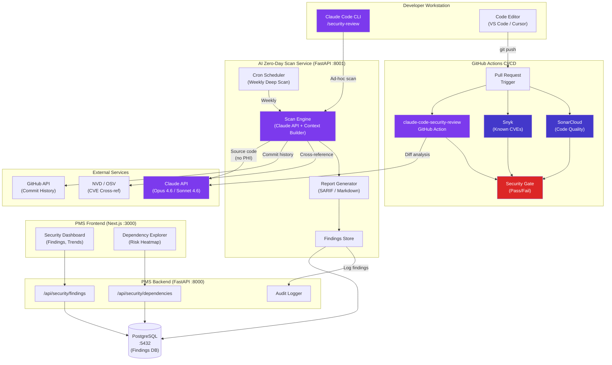

# Product Requirements Document: AI Zero-Day Vulnerability Scanning Integration into Patient Management System (PMS)

**Document ID:** PRD-PMS-AIZERODAYSCAN-001
**Version:** 1.0
**Date:** February 20, 2026
**Author:** Ammar (CEO, MPS Inc.)
**Status:** Draft

---

## 1. Executive Summary

Claude Opus 4.6, released by Anthropic on February 5, 2026, demonstrated a paradigm shift in software security by discovering over 500 previously unknown high-severity zero-day vulnerabilities in widely-used open-source libraries — including GhostScript, OpenSC, and CGIF — that had evaded traditional fuzzers, static analyzers, and human researchers for decades. Unlike traditional SAST tools that rely on pattern-matching rules, Opus 4.6 reads and reasons about code like a human security researcher: it examines commit histories for partially-fixed patterns, understands algorithmic semantics to craft trigger inputs, and identifies subtle memory corruption bugs across function boundaries.

Integrating AI-powered zero-day vulnerability scanning into the PMS creates a continuous security assurance layer that complements the project's existing Snyk, SonarCloud, and CodeRabbit toolchain. The PMS handles Protected Health Information (PHI) across its FastAPI backend, Next.js frontend, Android app, and PostgreSQL database — making supply chain security not just a best practice but a HIPAA compliance requirement. A single exploitable vulnerability in a transitive dependency (e.g., a PDF processing library handling clinical documents, a cryptographic library protecting PHI at rest) could result in a reportable breach.

This integration scans the PMS codebase and its dependency tree at three levels: (1) CI/CD pipeline scanning via GitHub Actions on every pull request, (2) scheduled deep audits of the full dependency tree targeting high-risk libraries, and (3) ad-hoc developer-initiated scans via Claude Code's `/security-review` command. No PHI is sent to the Claude API — only source code and dependency metadata are analyzed — minimizing HIPAA surface area while maximizing security coverage.

---

## 2. Problem Statement

The current PMS security toolchain has significant blind spots that AI-powered scanning addresses:

- **Traditional SAST misses logic flaws:** Snyk and SonarCloud detect known CVEs and pattern-based vulnerabilities but miss complex business logic flaws, inter-procedural taint flow, and implicit data flows. Research shows traditional SAST tools achieve F-1 scores of only 0.260-0.546 compared to LLM-based scanners at 0.750-0.797.
- **Zero-day gap:** Snyk's vulnerability database only contains *known* CVEs. The PMS depends on 200+ transitive Python packages and 500+ npm packages — any of which could harbor undisclosed vulnerabilities like those Opus 4.6 found in GhostScript (PDF processing) and OpenSC (smart card/cryptographic utilities).
- **Healthcare-specific attack surface:** The PMS processes clinical documents (PDFs, images), handles cryptographic operations for PHI encryption, and manages authentication tokens — all categories where Opus 4.6 has demonstrated superior vulnerability discovery in the underlying libraries.
- **No contextual code review:** Current tools don't understand *why* code is written the way it is. Claude can examine commit histories to find bugs introduced during partial fixes — a pattern responsible for many of the 500+ zero-days discovered.
- **Delayed feedback loop:** Snyk alerts arrive after vulnerabilities are publicly disclosed. AI scanning can find vulnerabilities before they're known to the security community, shifting from reactive patching to proactive discovery.

---

## 3. Proposed Solution

Build an **AI Zero-Day Scan Service** that integrates Claude Opus 4.6 into the PMS security pipeline at three levels: CI/CD automated review, scheduled deep dependency audits, and developer-initiated scans.

### 3.1 Architecture Overview

### 3.2 Deployment Model

- **CI/CD Scanning:** Runs within GitHub Actions using the `anthropics/claude-code-security-review` action. No additional infrastructure required. Scans only the PR diff for security-impacting changes.
- **Deep Scan Service:** Self-hosted FastAPI microservice (`:8001`) running in Docker alongside the PMS stack. Scheduled weekly via cron. Clones the repo, extracts dependency trees (`pip freeze`, `npm ls`), and submits high-risk source files to the Claude API for analysis.
- **Developer CLI:** Claude Code's `/security-review` runs locally in the developer's terminal. No infrastructure needed.
- **HIPAA Compliance:** Only source code and dependency metadata are sent to the Claude API — never PHI, database contents, or patient records. The Claude API is accessed via Anthropic's Enterprise tier with BAA. All findings are stored in the PMS PostgreSQL database with encryption at rest (AES-256) and access-controlled via the existing PMS RBAC.

---

## 4. PMS Data Sources

The AI Zero-Day Scan Service does **not** interact with clinical PMS APIs directly. Instead, it analyzes the **source code** that implements these APIs:

| PMS API | Scan Focus | Why |
|---------|-----------|-----|
| `/api/patients` | Authentication, authorization, input validation | PHI access control — injection, BOLA, broken auth |
| `/api/encounters` | Session management, data serialization | Clinical workflow integrity — CSRF, deserialization |
| `/api/prescriptions` | Business logic, validation rules | Medication safety — logic flaws enabling wrong doses |
| `/api/reports` | Data export, PDF generation | Document handling — library vulnerabilities (e.g., GhostScript-class bugs) |
| Dependencies | Transitive dependency tree | Supply chain — zero-days in upstream libraries |

---

## 5. Component/Module Definitions

### 5.1 CI/CD Security Gate (`claude-code-security-review` GitHub Action)

- **Description:** Automated PR-level security review that analyzes code diffs for vulnerabilities with >80% exploitability confidence filtering.
- **Input:** Git diff from pull request
- **Output:** Inline PR comments with severity, CWE classification, and remediation guidance. Pass/fail status check.
- **PMS APIs used:** None (analyzes source code only)

### 5.2 Deep Dependency Auditor

- **Description:** Weekly scheduled scan of the full PMS dependency tree. Extracts all Python packages (`requirements.txt`, `poetry.lock`), npm packages (`package-lock.json`), and Gradle dependencies (`build.gradle.kts`). Submits high-risk library source code to Claude API for zero-day analysis.
- **Input:** Dependency manifests, library source code from package registries
- **Output:** SARIF-format findings, risk-scored dependency report, trend analysis
- **PMS APIs used:** `/api/security/findings` (write), `/api/security/dependencies` (write)

### 5.3 Vulnerability Findings API

- **Description:** REST endpoints exposing scan results to the PMS frontend security dashboard.
- **Input:** Query parameters (severity, date range, component)
- **Output:** JSON findings with CWE, CVSS estimates, affected files, remediation steps
- **PMS APIs used:** New endpoints under `/api/security/`

### 5.4 Security Dashboard (Frontend)

- **Description:** Next.js dashboard displaying vulnerability findings, dependency risk heatmap, trend charts, and remediation status tracking.
- **Input:** Data from `/api/security/findings` and `/api/security/dependencies`
- **Output:** Visual dashboard with filters, export to PDF/CSV

### 5.5 Developer CLI Integration

- **Description:** Claude Code `/security-review` command for ad-hoc scanning from developer terminals.
- **Input:** Current git diff or specified files
- **Output:** Terminal-formatted findings with severity and fix suggestions

---

## 6. Non-Functional Requirements

### 6.1 Security and HIPAA Compliance

- **No PHI transmission:** Only source code and dependency metadata are sent to the Claude API. Database contents, patient records, and configuration files containing secrets are explicitly excluded via `.scanignore` rules.
- **API key management:** Claude API keys stored in GitHub Actions secrets and Docker secrets. Never committed to source code.
- **BAA coverage:** Claude Enterprise tier with Business Associate Agreement covers the API endpoint.
- **Audit logging:** Every scan invocation, finding, and remediation action is logged with timestamp, user, and action type to the PMS audit trail.
- **Encryption:** Findings stored in PostgreSQL with AES-256 encryption at rest. TLS 1.3 for all API communication.
- **Access control:** Security dashboard accessible only to users with `security_admin` role in PMS RBAC.
- **Data retention:** Scan findings retained for 7 years per HIPAA requirements. Raw scan data purged after 90 days.

### 6.2 Performance

| Metric | Target |
|--------|--------|
| CI/CD PR scan latency | < 3 minutes per PR |
| Weekly deep scan duration | < 2 hours for full dependency tree |
| Dashboard page load | < 2 seconds |
| False positive rate | < 20% (with human validation) |
| API rate limiting | Stay within Claude API tier limits |

### 6.3 Infrastructure

- **CI/CD:** GitHub Actions runner (no additional infrastructure)
- **Deep Scan Service:** Docker container, 2 vCPU, 4GB RAM, mounted repo volume
- **Database:** Existing PMS PostgreSQL instance (new `security_findings` schema)
- **Secrets:** GitHub Actions secrets for CI/CD, Docker secrets for deep scan service
- **Estimated API cost:** ~$50-150/month for weekly deep scans + PR reviews (Sonnet 4.6 for CI/CD, Opus 4.6 for deep scans)

---

## 7. Implementation Phases

### Phase 1: CI/CD Integration (Sprint 1 — 2 weeks)

- Configure `anthropics/claude-code-security-review` GitHub Action on all three PMS repos (backend, frontend, Android)
- Set up `.scanignore` to exclude PHI-adjacent files (database migrations with test data, environment files)
- Define severity thresholds for pass/fail gate (block on Critical/High, warn on Medium)
- Add CLAUDE.md security rules for FastAPI, Next.js, and Kotlin
- Validate with 10 test PRs containing intentional vulnerabilities

### Phase 2: Deep Dependency Auditor (Sprint 2-3 — 4 weeks)

- Build FastAPI microservice for scheduled dependency scanning
- Implement dependency tree extraction for Python (pip), JavaScript (npm), and Kotlin (Gradle)
- Build Claude API integration with context windowing for large codebases
- Create SARIF output format for integration with GitHub Security tab
- Build `/api/security/findings` and `/api/security/dependencies` endpoints
- Create PostgreSQL schema for findings storage
- Run first full audit and triage results

### Phase 3: Dashboard & Advanced Features (Sprint 4-5 — 4 weeks)

- Build Next.js security dashboard with findings table, risk heatmap, and trend charts
- Implement remediation tracking workflow (finding → assigned → in-progress → resolved)
- Add commit-history analysis for detecting partially-fixed vulnerability patterns
- Integrate with existing Snyk/SonarCloud findings for unified security view
- Build weekly email digest for security team
- Add Android app security-specific rules (Kotlin/Jetpack Compose patterns)

---

## 8. Success Metrics

| Metric | Target | Measurement Method |
|--------|--------|--------------------|
| Zero-days discovered in PMS dependencies | ≥ 5 in first 90 days | Deep scan findings validated by security review |
| CI/CD scan coverage | 100% of PRs | GitHub Actions completion rate |
| Mean time to remediate Critical findings | < 48 hours | Finding timestamp → resolution timestamp |
| False positive rate | < 20% | Validated findings / total findings |
| Developer adoption of `/security-review` | > 50% of team within 30 days | CLI usage telemetry |
| Reduction in post-deploy vulnerabilities | > 40% vs pre-integration baseline | Snyk production alerts before vs after |
| HIPAA audit readiness | 100% findings documented | Audit log completeness check |

---

## 9. Risks and Mitigations

| Risk | Impact | Mitigation |
|------|--------|------------|
| False positives overwhelming developers | Medium | Apply >80% exploitability filter. Sonnet 4.6 for CI/CD (faster, cheaper); Opus 4.6 only for deep scans. Human validation required before marking Critical. |
| Claude API hallucinating vulnerability details | High | Cross-reference all findings against NVD/OSV databases. Require reproduction steps for Critical/High. Never auto-patch without human review. |
| Source code exposure to Claude API | Medium | Anthropic Enterprise BAA covers API. No PHI sent. `.scanignore` excludes sensitive files. Review Anthropic data retention policy quarterly. |
| API cost overrun on large codebases | Low | Use Sonnet 4.6 ($3/$15 per 1M tokens) for CI/CD. Reserve Opus 4.6 for weekly deep scans only. Implement token budget per scan. |
| Scan latency blocking CI/CD pipeline | Medium | Set 5-minute timeout on CI/CD scans. Async deep scans never block merges. Cache repeat findings. |
| "Slopsquatting" — hallucinated package names | Low | Cross-reference all package names against actual `pip`/`npm` registries before reporting. |
| Vendor lock-in to Anthropic | Low | SARIF output format is standard. Findings stored in PostgreSQL, not Anthropic. Can swap to any LLM API. |

---

## 10. Dependencies

| Dependency | Type | Notes |
|------------|------|-------|
| Claude API (Opus 4.6 / Sonnet 4.6) | External API | Anthropic Enterprise tier with BAA |
| `anthropics/claude-code-security-review` | GitHub Action | Open-source, maintained by Anthropic |
| Claude Code CLI | Developer tool | Included in Anthropic Pro/Max/Enterprise subscriptions |
| GitHub Actions | CI/CD platform | Already in use for PMS |
| Snyk | Existing tool | Complement — known CVE database |
| SonarCloud | Existing tool | Complement — code quality rules |
| CodeRabbit | Existing tool | Complement — AI code review |
| NVD / OSV | Public database | Cross-reference for hallucination mitigation |
| Docker | Infrastructure | For deep scan service container |

---

## 11. Comparison with Existing Experiments

| Aspect | AI Zero-Day Scan (This) | MCP Integration (09) | Adaptive Thinking (08) |
|--------|------------------------|----------------------|----------------------|
| **Purpose** | Proactive security — find unknown vulnerabilities | Universal AI tool protocol | Optimize AI reasoning cost/quality |
| **Claude interaction** | API calls with source code context | MCP server exposing PMS tools | Effort-routed API calls |
| **PHI exposure** | None — source code only | Yes — PMS data via MCP tools | Yes — clinical data for reasoning |
| **HIPAA concern** | Low — no PHI involved | High — MCP tools access patient data | High — PHI in reasoning context |
| **Complementary?** | Yes — secures the code that MCP and Adaptive Thinking run on | Yes — MCP can expose security findings as tools | Yes — Adaptive Thinking can power scan triage |
| **Infrastructure** | GitHub Action + optional Docker service | FastMCP server + OAuth | SDK configuration change |

This experiment is foundational to all others: it secures the codebase that every other PMS integration runs on. A zero-day in a dependency used by the MCP server or the Adaptive Thinking pipeline could compromise patient data.

---

## 12. Research Sources

### Official Documentation & Announcements
- [Anthropic Zero-Day Research](https://red.anthropic.com/2026/zero-days/) — Detailed methodology for Opus 4.6 vulnerability discovery
- [Claude Code Security Review GitHub Action](https://github.com/anthropics/claude-code-security-review) — Official CI/CD integration for automated security review
- [Automate Security Reviews with Claude Code](https://www.anthropic.com/news/automate-security-reviews-with-claude-code) — Anthropic's guide to `/security-review` command

### Security Research & Analysis
- [Axios: Opus 4.6 Uncovers 500 Zero-Day Flaws](https://www.axios.com/2026/02/05/anthropic-claude-opus-46-software-hunting) — Detailed reporting on the zero-day discovery methodology
- [Tenable: Anthropic Claude Opus 4.6 AI Vulnerability Discovery](https://www.tenable.com/blog/Anthropic-Claude-Opus-AI-vulnerability-discovery-cybersecurity) — Enterprise security perspective on AI-powered scanning
- [Aikido: Claude Opus 4.6 Found 500 Vulnerabilities](https://www.aikido.dev/blog/claude-opus-4-6-500-vulnerabilities-software-security) — Practical implications for software security teams

### Comparative Analysis
- [ArXiv: LLMs vs Static Code Analysis for Vulnerability Detection](https://arxiv.org/html/2508.04448v1) — Benchmark showing LLM F-1 scores (0.797) vs SAST (0.260)
- [DryRun Security: Top AI SAST Tools 2026](https://www.dryrun.security/blog/top-ai-sast-tools-2026) — Market overview of AI-powered security tools
- [Semgrep: Finding Vulnerabilities Using Claude Code and Codex](https://semgrep.dev/blog/2025/finding-vulnerabilities-in-modern-web-apps-using-claude-code-and-openai-codex/) — Practical testing of LLM-based vulnerability scanning

### Healthcare & Compliance
- [Claude for Healthcare — HIPAA Compliance](https://amitkoth.com/claude-healthcare-hipaa-compliance/) — HIPAA considerations for Claude Enterprise
- [Anthropic: Advancing Claude in Healthcare](https://www.anthropic.com/news/healthcare-life-sciences) — Official healthcare strategy and compliance posture

---

## 13. Appendix: Related Documents

- [AI Zero-Day Scan Setup Guide](12-AIZeroDayScan-PMS-Developer-Setup-Guide.md)
- [AI Zero-Day Scan Developer Tutorial](12-AIZeroDayScan-Developer-Tutorial.md)
- [Anthropic Zero-Day Research](https://red.anthropic.com/2026/zero-days/)
- [Claude Code Security Review Action](https://github.com/anthropics/claude-code-security-review)
- [PMS Security Scanning Configuration](../config/security-scanning.md)
- [MCP PMS Integration PRD](09-PRD-MCP-PMS-Integration.md)
- [Adaptive Thinking PRD](08-PRD-AdaptiveThinking-PMS-Integration.md)
