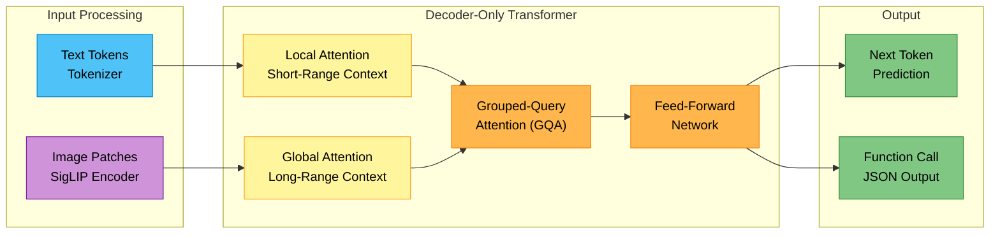
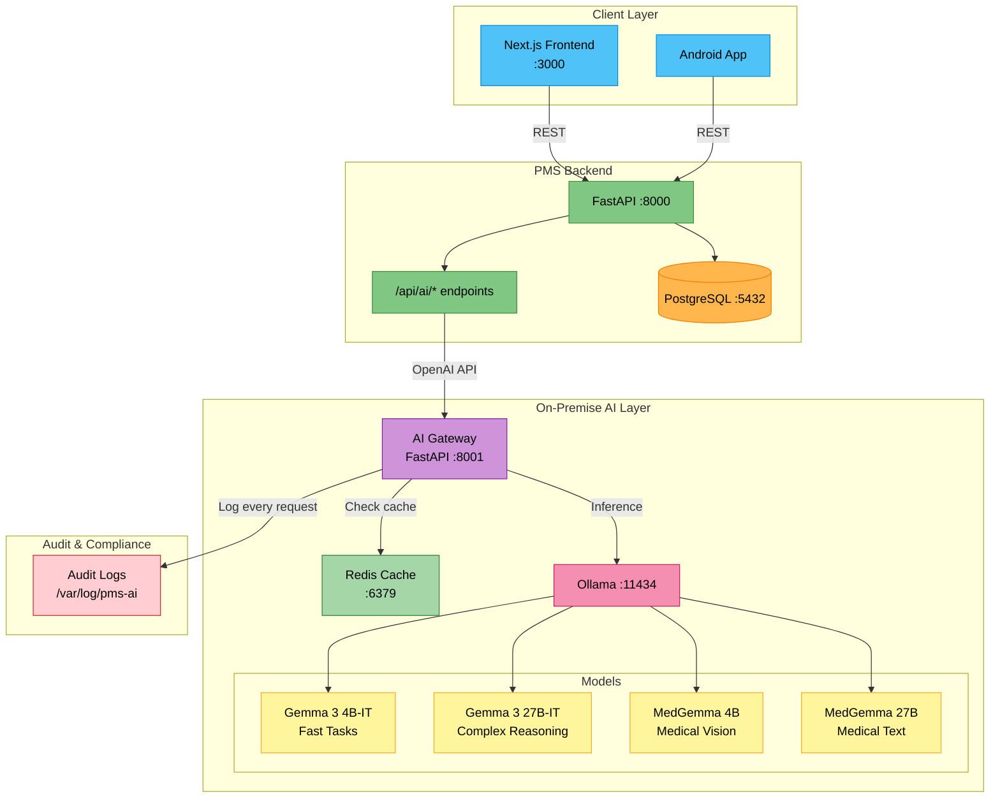

# Gemma 3 Developer Onboarding Tutorial

**Welcome to the MPS PMS Gemma 3 Integration Team**

This tutorial will take you from zero to building your first Gemma 3 integration with the PMS. By the end, you will understand how Gemma 3 works, have a running local environment, and have built and tested a custom clinical AI feature end-to-end.

**Document ID:** PMS-EXP-GEMMA3-002
**Version:** 1.0
**Date:** 2026-02-20
**Applies To:** PMS project (all platforms)
**Prerequisite:** [Gemma 3 Setup Guide](13-Gemma3-PMS-Developer-Setup-Guide.md)
**Estimated time:** 2-3 hours
**Difficulty:** Beginner-friendly

---

## What You Will Learn

1. What Gemma 3 is and why it matters for on-premise healthcare AI
2. How Gemma 3's multimodal architecture processes text and images
3. How MedGemma extends Gemma 3 for clinical use cases
4. How the AI Gateway routes requests to different model sizes
5. How to build a clinical encounter summarization pipeline
6. How to use function calling for structured data extraction
7. How to stream AI responses in real-time to the frontend
8. How to evaluate model output quality for clinical accuracy
9. How to fine-tune Gemma 3 with LoRA for your clinic's terminology
10. HIPAA security requirements for on-premise AI inference

---

## Part 1: Understanding Gemma 3 (15 min read)

### 1.1 What Problem Does Gemma 3 Solve?

Clinical staff at PMS-powered facilities face several daily pain points that AI could solve — but cloud AI introduces unacceptable risks:

| Pain Point | Current Workaround | Cloud AI Problem | Gemma 3 Solution |
|------------|-------------------|------------------|-------------------|
| Writing encounter notes takes 15-20 min per visit | Manual typing, copy-paste | PHI sent to OpenAI/Anthropic servers | On-premise summarization, PHI never leaves network |
| ICD-10 coding requires manual lookup | Reference books, web searches | Per-token costs scale unpredictably | Zero marginal cost after GPU investment |
| Medication reconciliation is error-prone | Manual cross-referencing | Cloud API latency (500-2000ms) | Sub-200ms local inference |
| Reading referral letters and lab reports | Manual review | Rate limits during peak hours | No rate limits — your hardware, your throughput |
| Generating patient summaries for handoffs | Resident-written summaries | Model unavailable during cloud outages | Runs air-gapped, no internet required |

Gemma 3 is Google DeepMind's open-weight model that runs entirely on your own hardware. It delivers performance comparable to Gemini 1.5 Pro on clinical benchmarks while fitting on a single GPU. With MedGemma (the healthcare-optimized variant), you get 87.7% accuracy on MedQA — within 3% of the best closed models, at 1/10th the inference cost.

### 1.2 How Gemma 3 Works — The Key Pieces



**Three key concepts:**

1. **Multimodal Input:** Gemma 3 (4B, 12B, 27B) accepts both text and images. Text goes through a tokenizer; images are resized to 896x896 and encoded by the SigLIP vision encoder into tokens. Text uses one-way (causal) attention; images use full bidirectional attention.

2. **Efficient Attention:** Gemma 3 uses a high ratio of local-to-global attention layers. Local layers attend to a short window (reducing memory), while global layers see the full 128K context. Grouped-Query Attention (GQA) further reduces the KV-cache memory footprint.

3. **Structured Output:** Beyond generating free text, Gemma 3 can produce function calls in strict JSON format — essential for extracting structured clinical data (ICD codes, medication lists, vital signs) that can be saved directly to the database.

### 1.3 How Gemma 3 Fits with Other PMS Technologies

| Technology | Experiment | Relationship to Gemma 3 |
|------------|-----------|------------------------|
| MedASR (Exp. 07) | Speech-to-text | **Upstream** — MedASR transcribes dictation → Gemma 3 structures the transcript |
| Adaptive Thinking (Exp. 08) | Cloud AI routing | **Replaced** — Gemma 3 provides local inference, eliminating cloud API dependency |
| MCP (Exp. 09) | AI integration protocol | **Complementary** — MCP exposes PMS APIs as tools; Gemma 3 calls them via function calling |
| Speechmatics (Exp. 10) | Real-time transcription | **Upstream** — Speechmatics streams transcripts → Gemma 3 generates notes |
| Sanford Guide (Exp. 11) | Antimicrobial CDS | **Augments** — Gemma 3 provides natural-language explanations of Sanford Guide recommendations |
| AI Zero-Day Scan (Exp. 12) | Security scanning | **Parallel** — Different domain (security vs. clinical); both use AI for analysis |

### 1.4 Key Vocabulary

| Term | Meaning |
|------|---------|
| **Open Weights** | Model parameters are downloadable and runnable locally, but the license is not OSI "open source" |
| **SigLIP** | Sigmoid Loss for Language Image Pre-training — the vision encoder used in Gemma 3 for image understanding |
| **GQA** | Grouped-Query Attention — memory-efficient attention mechanism that groups query heads |
| **KV-Cache** | Key-Value cache — stores computed attention states for faster autoregressive generation |
| **int4 Quantization** | Reducing model weights from 16-bit to 4-bit, cutting VRAM by ~75% with minimal quality loss |
| **LoRA** | Low-Rank Adaptation — fine-tuning technique that adds small trainable matrices to frozen model weights |
| **QLoRA** | Quantized LoRA — combines int4 quantization with LoRA for fine-tuning on consumer GPUs |
| **MedGemma** | Google's healthcare-optimized Gemma 3 variant trained on medical text and images |
| **Ollama** | Open-source tool for running LLMs locally with one-command model management |
| **vLLM** | High-throughput inference engine with continuous batching and tensor parallelism |
| **Function Calling** | Model generates structured JSON function calls instead of free text — used for tool use and data extraction |
| **TTFT** | Time to First Token — latency from request to the first generated token |

### 1.5 Our Architecture



---

## Part 2: Environment Verification (15 min)

### 2.1 Checklist

Run each command and confirm the expected output:

```bash
# 1. Docker is running
docker info > /dev/null 2>&1 && echo "OK: Docker running" || echo "FAIL: Docker not running"

# 2. GPU is accessible
nvidia-smi > /dev/null 2>&1 && echo "OK: GPU detected" || echo "FAIL: No GPU"

# 3. Ollama container is running
docker ps --filter name=pms-ollama --format '{{.Status}}' | grep -q Up && echo "OK: Ollama running" || echo "FAIL: Ollama not running"

# 4. Gemma 3 4B model is downloaded
docker exec pms-ollama ollama list | grep -q "gemma3:4b" && echo "OK: Gemma 3 4B available" || echo "FAIL: Pull gemma3:4b"

# 5. AI Gateway is responding
curl -sf http://localhost:8001/health > /dev/null && echo "OK: AI Gateway healthy" || echo "FAIL: Gateway not responding"

# 6. PMS Backend is running
curl -sf http://localhost:8000/api/health > /dev/null && echo "OK: PMS Backend healthy" || echo "FAIL: Backend not responding"

# 7. Redis is running
docker exec pms-ai-redis redis-cli ping | grep -q PONG && echo "OK: Redis healthy" || echo "FAIL: Redis not responding"
```

### 2.2 Quick Test

Send a clinical question to Gemma 3 through the full stack:

```bash
curl -s http://localhost:8000/api/ai/chat \
  -H "Content-Type: application/json" \
  -d '{
    "messages": [
      {"role": "system", "content": "You are a clinical assistant for a primary care practice."},
      {"role": "user", "content": "What are the ACC/AHA blood pressure categories for adults?"}
    ],
    "model_tier": "fast"
  }' | python3 -m json.tool
```

You should receive a clinically accurate response about blood pressure categories (Normal <120/80, Elevated 120-129/<80, Stage 1 130-139/80-89, Stage 2 >=140/>=90).

---

## Part 3: Build Your First Integration (45 min)

### 3.1 What We Are Building

We will build a **Medication Reconciliation Assistant** — a feature that:
1. Takes a patient's current medication list from the PMS
2. Takes a new prescription the provider wants to add
3. Uses Gemma 3 to check for interactions, duplications, and dose concerns
4. Returns a structured safety report

This is a real clinical workflow that saves pharmacist review time and catches errors at the point of prescribing.

### 3.2 Define the Data Model

Create `app/schemas/med_reconciliation.py` in the PMS Backend:

```python
"""Medication reconciliation schemas."""

from pydantic import BaseModel


class Medication(BaseModel):
    name: str
    dose: str
    frequency: str
    route: str = "oral"


class ReconciliationRequest(BaseModel):
    current_medications: list[Medication]
    new_medication: Medication
    patient_age: int | None = None
    patient_weight_kg: float | None = None
    allergies: list[str] = []
    renal_function: str | None = None  # e.g., "CrCl 45 mL/min"


class InteractionWarning(BaseModel):
    severity: str  # "high", "moderate", "low"
    drug_pair: str
    description: str
    recommendation: str


class ReconciliationReport(BaseModel):
    safe_to_prescribe: bool
    interactions: list[InteractionWarning]
    duplicate_therapy: list[str]
    dose_concerns: list[str]
    summary: str
```

### 3.3 Build the Reconciliation Service

Create `app/services/med_reconciliation.py`:

```python
"""Medication reconciliation using Gemma 3."""

import json
import logging

from openai import AsyncOpenAI

from app.schemas.med_reconciliation import (
    ReconciliationRequest,
    ReconciliationReport,
    InteractionWarning,
)

logger = logging.getLogger(__name__)

ai_client = AsyncOpenAI(
    base_url="http://localhost:8001/v1",
    api_key="not-needed",
)

RECONCILIATION_PROMPT = """You are a clinical pharmacist AI assistant. Analyze the medication reconciliation request and return a JSON safety report.

Current Medications:
{current_meds}

Proposed New Medication:
{new_med}

Patient Info:
- Age: {age}
- Weight: {weight}
- Allergies: {allergies}
- Renal Function: {renal}

Return ONLY valid JSON in this exact format:
{{
  "safe_to_prescribe": true/false,
  "interactions": [
    {{
      "severity": "high|moderate|low",
      "drug_pair": "Drug A + Drug B",
      "description": "Description of interaction",
      "recommendation": "What to do"
    }}
  ],
  "duplicate_therapy": ["Description of any therapeutic duplications"],
  "dose_concerns": ["Description of any dose issues given patient parameters"],
  "summary": "One-paragraph clinical summary"
}}

Be conservative — flag potential issues rather than miss them. Only include interactions that are clinically significant."""


async def reconcile_medications(
    req: ReconciliationRequest,
) -> ReconciliationReport:
    """Run medication reconciliation through Gemma 3."""
    current_meds = "\n".join(
        f"- {m.name} {m.dose} {m.frequency} ({m.route})"
        for m in req.current_medications
    )
    new_med = f"{req.new_medication.name} {req.new_medication.dose} {req.new_medication.frequency} ({req.new_medication.route})"

    prompt = RECONCILIATION_PROMPT.format(
        current_meds=current_meds or "None",
        new_med=new_med,
        age=req.patient_age or "Unknown",
        weight=f"{req.patient_weight_kg} kg" if req.patient_weight_kg else "Unknown",
        allergies=", ".join(req.allergies) if req.allergies else "NKDA",
        renal=req.renal_function or "Unknown",
    )

    response = await ai_client.chat.completions.create(
        model="gemma3-27b",
        messages=[
            {"role": "system", "content": "You are a clinical pharmacist. Return only valid JSON."},
            {"role": "user", "content": prompt},
        ],
        temperature=0.1,
        max_tokens=1024,
    )

    raw = response.choices[0].message.content

    # Parse JSON from response (handle markdown code blocks)
    clean = raw.strip()
    if clean.startswith("```"):
        clean = clean.split("\n", 1)[1]
        clean = clean.rsplit("```", 1)[0]

    try:
        data = json.loads(clean)
    except json.JSONDecodeError:
        logger.error(f"Failed to parse reconciliation response: {raw[:200]}")
        return ReconciliationReport(
            safe_to_prescribe=False,
            interactions=[],
            duplicate_therapy=[],
            dose_concerns=["AI parsing failed — manual review required"],
            summary="Automated reconciliation could not be completed. Please review manually.",
        )

    return ReconciliationReport(
        safe_to_prescribe=data.get("safe_to_prescribe", False),
        interactions=[
            InteractionWarning(**i) for i in data.get("interactions", [])
        ],
        duplicate_therapy=data.get("duplicate_therapy", []),
        dose_concerns=data.get("dose_concerns", []),
        summary=data.get("summary", ""),
    )
```

### 3.4 Add the API Endpoint

Add to `app/routers/ai.py`:

```python
from app.schemas.med_reconciliation import ReconciliationRequest, ReconciliationReport
from app.services.med_reconciliation import reconcile_medications


@router.post("/reconcile", response_model=ReconciliationReport)
async def api_reconcile(req: ReconciliationRequest):
    """AI-powered medication reconciliation check."""
    try:
        report = await reconcile_medications(req)
        return report
    except Exception as e:
        raise HTTPException(status_code=502, detail=f"Reconciliation error: {e}")
```

### 3.5 Test the Integration

```bash
curl -s http://localhost:8000/api/ai/reconcile \
  -H "Content-Type: application/json" \
  -d '{
    "current_medications": [
      {"name": "Warfarin", "dose": "5mg", "frequency": "daily", "route": "oral"},
      {"name": "Lisinopril", "dose": "20mg", "frequency": "daily", "route": "oral"},
      {"name": "Metformin", "dose": "1000mg", "frequency": "BID", "route": "oral"}
    ],
    "new_medication": {
      "name": "Aspirin",
      "dose": "325mg",
      "frequency": "daily",
      "route": "oral"
    },
    "patient_age": 72,
    "patient_weight_kg": 85,
    "allergies": ["Sulfa"],
    "renal_function": "CrCl 55 mL/min"
  }' | python3 -m json.tool
```

**Expected output:** A report flagging the Warfarin + Aspirin interaction (high severity — increased bleeding risk), with a recommendation to use low-dose aspirin (81mg) if dual therapy is clinically indicated.

### 3.6 Build the Frontend Component

Create `src/components/ai/med-reconciliation.tsx`:

```tsx
"use client";

import { useState } from "react";

const API_URL = process.env.NEXT_PUBLIC_API_URL || "http://localhost:8000";

interface InteractionWarning {
  severity: string;
  drug_pair: string;
  description: string;
  recommendation: string;
}

interface ReconciliationReport {
  safe_to_prescribe: boolean;
  interactions: InteractionWarning[];
  duplicate_therapy: string[];
  dose_concerns: string[];
  summary: string;
}

interface MedReconciliationProps {
  currentMedications: Array<{
    name: string;
    dose: string;
    frequency: string;
    route?: string;
  }>;
  newMedication: {
    name: string;
    dose: string;
    frequency: string;
    route?: string;
  };
  patientAge?: number;
  patientWeightKg?: number;
  allergies?: string[];
  renalFunction?: string;
}

export function MedReconciliation({
  currentMedications,
  newMedication,
  patientAge,
  patientWeightKg,
  allergies,
  renalFunction,
}: MedReconciliationProps) {
  const [report, setReport] = useState<ReconciliationReport | null>(null);
  const [loading, setLoading] = useState(false);

  const handleCheck = async () => {
    setLoading(true);
    try {
      const res = await fetch(`${API_URL}/api/ai/reconcile`, {
        method: "POST",
        headers: { "Content-Type": "application/json" },
        body: JSON.stringify({
          current_medications: currentMedications,
          new_medication: newMedication,
          patient_age: patientAge,
          patient_weight_kg: patientWeightKg,
          allergies: allergies || [],
          renal_function: renalFunction,
        }),
      });
      const data = await res.json();
      setReport(data);
    } catch {
      setReport(null);
    } finally {
      setLoading(false);
    }
  };

  const severityColor = (severity: string) => {
    switch (severity) {
      case "high":
        return "bg-red-100 text-red-800 border-red-300";
      case "moderate":
        return "bg-yellow-100 text-yellow-800 border-yellow-300";
      default:
        return "bg-blue-100 text-blue-800 border-blue-300";
    }
  };

  return (
    <div className="rounded-lg border border-gray-200 bg-white p-4">
      <div className="mb-3 flex items-center justify-between">
        <h3 className="text-sm font-semibold text-gray-700">
          AI Medication Safety Check
        </h3>
        <button
          onClick={handleCheck}
          disabled={loading}
          className="rounded bg-purple-600 px-3 py-1 text-xs font-medium text-white hover:bg-purple-700 disabled:opacity-50"
        >
          {loading ? "Checking..." : "Check Interactions"}
        </button>
      </div>

      {report && (
        <div className="space-y-3">
          {/* Safety Status */}
          <div
            className={`rounded p-2 text-center text-sm font-bold ${
              report.safe_to_prescribe
                ? "bg-green-100 text-green-800"
                : "bg-red-100 text-red-800"
            }`}
          >
            {report.safe_to_prescribe
              ? "No Critical Interactions Detected"
              : "Potential Safety Concerns — Review Required"}
          </div>

          {/* Interactions */}
          {report.interactions.length > 0 && (
            <div>
              <h4 className="mb-1 text-xs font-semibold text-gray-600">
                Drug Interactions
              </h4>
              {report.interactions.map((interaction, i) => (
                <div
                  key={i}
                  className={`mb-2 rounded border p-2 text-xs ${severityColor(interaction.severity)}`}
                >
                  <div className="font-bold">
                    [{interaction.severity.toUpperCase()}] {interaction.drug_pair}
                  </div>
                  <div>{interaction.description}</div>
                  <div className="mt-1 font-medium">
                    Recommendation: {interaction.recommendation}
                  </div>
                </div>
              ))}
            </div>
          )}

          {/* Summary */}
          <div className="rounded bg-gray-50 p-2 text-xs text-gray-700">
            {report.summary}
          </div>

          <div className="text-xs text-yellow-600">
            AI-Generated — Pharmacist review required before dispensing
          </div>
        </div>
      )}
    </div>
  );
}
```

**Checkpoint:** You have built a complete medication reconciliation pipeline: data models → Gemma 3 prompt → structured JSON parsing → FastAPI endpoint → React component. The Warfarin + Aspirin test case should correctly flag a high-severity bleeding risk.

---

## Part 4: Evaluating Strengths and Weaknesses (15 min)

### 4.1 Strengths

1. **Zero PHI Egress:** All inference happens on-premise — no patient data leaves the facility network. This is the single biggest advantage for HIPAA-regulated environments.

2. **No Per-Token Cost:** After the one-time GPU investment ($2,000-$10,000), inference is free. A clinic doing 500 AI requests/day saves $3,000-10,000/month vs. cloud APIs.

3. **Single-GPU Deployment:** Gemma 3 27B runs on a single NVIDIA GPU with 16+ GB VRAM when int4 quantized. No multi-GPU infrastructure needed.

4. **128K Context Window:** Process entire patient histories, multi-encounter summaries, or lengthy referral letters in a single prompt.

5. **Multimodal:** Process both text and images — read lab reports, interpret CXR images (with MedGemma), OCR prescription pads.

6. **Function Calling:** Native structured output enables reliable JSON extraction for database writes — essential for ICD-10 coding, medication parsing, and structured notes.

7. **MedGemma Variant:** Google's healthcare-optimized model provides 87.7% MedQA accuracy and validated CXR report generation out of the box.

8. **Fine-Tuning Ecosystem:** LoRA/QLoRA support via Hugging Face, Keras, and Unsloth makes domain adaptation accessible on consumer hardware.

9. **Broad Framework Support:** Works with Ollama, vLLM, Hugging Face Transformers, llama.cpp, JAX, PyTorch — no vendor lock-in.

### 4.2 Weaknesses

1. **Not True Open Source:** Google's license allows commercial use but retains the right to restrict usage. This is a legal risk for long-term dependency.

2. **Smaller Than Frontier Models:** Gemma 3 27B is capable but cannot match GPT-4o or Claude Opus on the hardest reasoning tasks. Complex differential diagnoses may need escalation to a cloud model.

3. **GPU Dependency:** Requires an NVIDIA GPU with adequate VRAM. CPU-only inference is possible but impractically slow for clinical use.

4. **No Built-In Safety Guardrails:** Unlike cloud APIs with managed safety filters, self-hosted Gemma 3 relies on the deployer to implement content filtering and hallucination detection.

5. **Hallucination Risk:** Like all LLMs, Gemma 3 can generate plausible but incorrect medical information. Every AI output must be labeled as requiring clinician review.

6. **Limited Multimodal Training Data:** While MedGemma handles CXR and pathology, it has not been validated for all medical imaging modalities (ultrasound, MRI sequences, dermatology).

7. **Model Update Lag:** When Google releases a new model version, you must manually download and deploy it — no automatic updates like cloud APIs.

### 4.3 When to Use Gemma 3 vs Alternatives

| Scenario | Use Gemma 3 | Use Cloud API (Claude/GPT) |
|----------|-------------|--------------------------|
| PHI in prompt | Always — zero data egress | Only with BAA + encrypted transit |
| Simple extraction (vitals, codes) | Gemma 3 4B — fast, free | Not cost-effective |
| Complex differential diagnosis | Gemma 3 27B first, escalate if needed | When local model confidence is low |
| High-throughput batch processing | vLLM + Gemma 3 — no rate limits | Rate-limited, expensive at scale |
| Cutting-edge reasoning | Try locally first | For tasks requiring frontier performance |
| Medical image analysis | MedGemma 4B for CXR, pathology | Cloud vision APIs for unsupported modalities |
| Real-time autocomplete | Gemma 3 4B — sub-200ms TTFT | Too slow (500-2000ms network latency) |
| Air-gapped / no-internet site | Gemma 3 — works offline | Impossible |

### 4.4 HIPAA / Healthcare Considerations

**What makes Gemma 3 HIPAA-friendly:**
- PHI stays on-premise — no Business Associate Agreement needed for the AI model itself
- No data retention by third parties — you control all logs and caches
- Audit logging is fully customizable — log exactly what your compliance officer requires
- Air-gap capable — can operate with zero internet connectivity

**What you still need to do:**
- Implement access controls (RBAC) on the AI Gateway
- Encrypt model storage and logs at rest (AES-256)
- Use TLS for all internal service communication
- Label all AI outputs as "AI-Generated — Requires Clinician Review"
- Never auto-apply AI suggestions to patient records without human confirmation
- De-identify any data used for fine-tuning
- Include AI inference in your facility's risk assessment
- Train staff on AI limitations and the requirement for clinical validation

---

## Part 5: Debugging Common Issues (15 min read)

### Issue 1: Model Returns Empty or Truncated Response

**Symptoms:** Response is empty string or cuts off mid-sentence

**Cause:** `max_tokens` set too low, or GPU ran out of memory during generation

**Fix:**
```bash
# Check GPU memory during inference
nvidia-smi

# Increase max_tokens in the request (default 2048 may be too low)
# Or reduce prompt length — 128K context doesn't mean you should use it all

# If OOM, switch to a smaller model
# In ai_service.py, change MODELS["standard"] to "gemma3-12b"
```

### Issue 2: JSON Parsing Fails for Structured Extraction

**Symptoms:** `json.JSONDecodeError` when parsing model output

**Cause:** Model wraps JSON in markdown code blocks or adds explanation text

**Fix:**
```python
# Always strip markdown code fences
raw = response.choices[0].message.content.strip()
if raw.startswith("```"):
    raw = raw.split("\n", 1)[1]
    raw = raw.rsplit("```", 1)[0]

# Add temperature=0.1 for structured output (less creative = more reliable)
# Add explicit instruction: "Return ONLY valid JSON, no explanation"
```

### Issue 3: First Request Takes 30+ Seconds

**Symptoms:** First request after startup is very slow; subsequent requests are fast

**Cause:** Ollama loads the model into GPU memory on first request

**Fix:**
```bash
# Pre-warm models after startup
docker exec pms-ollama ollama run gemma3:4b "warmup" --verbose
docker exec pms-ollama ollama run gemma3:27b "warmup" --verbose

# Or add a warmup script to docker-compose healthcheck
```

### Issue 4: Model Gives Generic / Non-Medical Answers

**Symptoms:** Gemma 3 responds with general knowledge instead of clinical specificity

**Cause:** System prompt is not specific enough about the clinical context

**Fix:**
```python
# Use detailed system prompts with clinical context
system_prompt = (
    "You are a board-certified internal medicine physician assistant "
    "working in a primary care clinic. Use evidence-based medical "
    "knowledge. Reference current clinical guidelines (AHA, ACC, ADA, "
    "IDSA) when applicable. Be specific about dosages, frequencies, "
    "and contraindications."
)
# Also consider using MedGemma instead of base Gemma 3
```

### Issue 5: Ollama Container Keeps Restarting

**Symptoms:** `docker ps` shows Ollama in restart loop

**Cause:** Usually a GPU driver mismatch or insufficient system resources

**Fix:**
```bash
# Check container logs
docker logs pms-ollama --tail 50

# Common fixes:
# 1. Update NVIDIA driver: sudo apt install nvidia-driver-535
# 2. Restart Docker: sudo systemctl restart docker
# 3. Check shared memory: Add `shm_size: '8g'` to docker-compose.yml
# 4. Ensure NVIDIA Container Toolkit is configured:
#    sudo nvidia-ctk runtime configure --runtime=docker
```

### Issue 6: Inconsistent Outputs for Same Input

**Symptoms:** Same prompt produces different results each time

**Cause:** Temperature > 0 introduces randomness

**Fix:**
```python
# For deterministic outputs (structured extraction, coding):
temperature = 0.0  # or 0.1

# For creative outputs (summaries, patient education):
temperature = 0.3  # controlled variety

# For conversational AI:
temperature = 0.7  # natural variation
```

---

## Part 6: Practice Exercise (45 min)

### Option A: Patient Handoff Summary Generator

Build an endpoint that takes a patient ID, fetches their last 5 encounters from the PMS API, and uses Gemma 3 27B with the full 128K context to generate a comprehensive handoff summary for the incoming provider.

**Hints:**
1. Query `/api/patients/{id}` for demographics and problem list
2. Query `/api/encounters?patient_id={id}&limit=5` for recent visits
3. Concatenate all encounter notes into a single prompt
4. Use system prompt: "Generate a concise handoff summary for an incoming provider. Include active problems, recent changes, pending results, and follow-up items."
5. Return structured JSON with sections: active_problems, recent_changes, pending_items, follow_up

### Option B: Clinical Note Auto-Coder

Build an endpoint that takes a free-text encounter note and returns suggested ICD-10 and CPT codes with confidence levels.

**Hints:**
1. Use Gemma 3 4B for speed (coding lookup is a focused task)
2. System prompt should specify: "Return JSON array of {code, description, confidence} objects"
3. Include common code ranges in the prompt for reference
4. Add a confidence threshold filter (only return codes with confidence > 0.7)
5. Compare AI suggestions against the clinic's historical coding patterns

### Option C: Medication Education Generator

Build an endpoint that generates patient-friendly medication education materials. Given a medication name and patient language preference, produce a plain-language explanation of what the medication does, how to take it, common side effects, and when to call the doctor.

**Hints:**
1. Use Gemma 3 4B (patient education doesn't need the 27B model)
2. Leverage Gemma 3's multilingual support — test with Spanish, Arabic, Vietnamese
3. System prompt: "You are a patient educator. Write at a 6th-grade reading level. Avoid medical jargon."
4. Return sections: what_it_does, how_to_take, side_effects, when_to_call_doctor
5. Add a Flesch-Kincaid readability check to verify reading level

---

## Part 7: Development Workflow and Conventions

### 7.1 File Organization

```
pms-backend/
├── app/
│   ├── routers/
│   │   └── ai.py                    # AI-powered API endpoints
│   ├── services/
│   │   ├── ai_service.py            # Core AI client (summarize, extract, chat)
│   │   └── med_reconciliation.py    # Medication reconciliation service
│   └── schemas/
│       └── med_reconciliation.py    # Pydantic models for med recon
│
pms-frontend/
├── src/
│   ├── lib/
│   │   └── ai-client.ts             # AI service client functions
│   └── components/
│       └── ai/
│           ├── encounter-summary.tsx  # AI summary component
│           ├── structured-extraction.tsx  # Data extraction component
│           └── med-reconciliation.tsx # Med recon component
│
pms-ai/
├── docker-compose.yml               # Ollama + Gateway + Redis
├── Dockerfile.gateway               # AI Gateway container
├── requirements-gateway.txt         # Gateway Python dependencies
├── gateway/
│   ├── __init__.py
│   └── main.py                      # AI Gateway FastAPI app
├── models/                          # Ollama model storage (gitignored)
├── logs/                            # Audit logs (gitignored)
└── config/                          # Model configurations
```

### 7.2 Naming Conventions

| Item | Convention | Example |
|------|-----------|---------|
| AI service functions | `snake_case`, verb-first | `summarize_encounter()`, `extract_structured_data()` |
| API endpoints | `/api/ai/{action}` | `/api/ai/summarize`, `/api/ai/reconcile` |
| Model tier names | lowercase descriptive | `"fast"`, `"standard"`, `"medical"` |
| Pydantic schemas | `PascalCase` | `ReconciliationRequest`, `InteractionWarning` |
| React components | `PascalCase` | `EncounterSummary`, `MedReconciliation` |
| Environment variables | `UPPER_SNAKE_CASE` | `AI_GATEWAY_URL`, `AI_DEFAULT_MODEL` |
| Docker containers | `pms-{service}` | `pms-ollama`, `pms-ai-gateway`, `pms-ai-redis` |
| Log entries | Structured JSON | `{"timestamp": "...", "user_id": "...", "model": "..."}` |

### 7.3 PR Checklist

- [ ] AI outputs are labeled "AI-Generated — Requires Clinician Review" in the UI
- [ ] No PHI is logged in audit entries (redact before logging)
- [ ] `temperature` is set appropriately (0.0-0.1 for extraction, 0.3 for summaries)
- [ ] Error handling includes fallback when AI service is unavailable
- [ ] New AI endpoints are added to the API documentation
- [ ] JSON parsing handles markdown code fences from model output
- [ ] Model tier is configurable (don't hardcode model names)
- [ ] Frontend components show loading states during inference
- [ ] Cache keys are deterministic for identical requests
- [ ] Integration tests cover both success and AI-unavailable scenarios

### 7.4 Security Reminders

1. **Never auto-apply AI outputs** to patient records — always require human confirmation
2. **Never log PHI** in AI audit entries — log only metadata (model, tokens, latency, user ID)
3. **Never expose Ollama port (11434)** to the public network — only the AI Gateway should be accessible from the PMS Backend
4. **Never use AI outputs for autonomous clinical decisions** — Gemma 3 is a decision support tool, not a decision maker
5. **Always encrypt** model files and audit logs at rest
6. **Rotate API access tokens** for the AI Gateway if using token-based auth
7. **De-identify all data** before using it for fine-tuning
8. **Document AI feature usage** in your facility's HIPAA risk assessment

---

## Part 8: Quick Reference Card

### Key Commands

| Action | Command |
|--------|---------|
| Start AI stack | `cd ~/pms-ai && docker compose up -d` |
| Stop AI stack | `cd ~/pms-ai && docker compose down` |
| View logs | `docker compose logs -f --tail=50` |
| Pull new model | `docker exec pms-ollama ollama pull gemma3:12b` |
| List models | `docker exec pms-ollama ollama list` |
| Test chat | `curl http://localhost:8001/v1/chat/completions -d '{"model":"gemma3-4b","messages":[{"role":"user","content":"Hello"}]}'` |
| GPU status | `nvidia-smi` |
| Cache stats | `docker exec pms-ai-redis redis-cli info stats` |

### Key Files

| File | Purpose |
|------|---------|
| `~/pms-ai/docker-compose.yml` | AI infrastructure definition |
| `~/pms-ai/gateway/main.py` | AI Gateway service |
| `pms-backend/app/services/ai_service.py` | Core AI client |
| `pms-backend/app/routers/ai.py` | AI API endpoints |
| `pms-frontend/src/lib/ai-client.ts` | Frontend AI client |
| `pms-frontend/src/components/ai/` | AI React components |

### Key URLs

| Service | URL |
|---------|-----|
| AI Gateway Health | http://localhost:8001/health |
| AI Gateway Models | http://localhost:8001/v1/models |
| AI Gateway Chat | http://localhost:8001/v1/chat/completions |
| PMS AI Summarize | http://localhost:8000/api/ai/summarize |
| PMS AI Extract | http://localhost:8000/api/ai/extract |
| PMS AI Reconcile | http://localhost:8000/api/ai/reconcile |
| PMS AI Chat | http://localhost:8000/api/ai/chat |

### Starter Template — New AI Feature

```python
# 1. Add to app/services/ai_service.py or create new service file:
async def your_feature(input_data: str) -> dict:
    response = await ai_client.chat.completions.create(
        model=MODELS["standard"],  # or "fast" for speed
        messages=[
            {"role": "system", "content": "Your system prompt here."},
            {"role": "user", "content": input_data},
        ],
        temperature=0.3,
        max_tokens=1024,
    )
    return {"result": response.choices[0].message.content}

# 2. Add endpoint to app/routers/ai.py:
@router.post("/your-feature")
async def api_your_feature(req: YourRequest):
    return await your_feature(req.input_data)

# 3. Add frontend client to src/lib/ai-client.ts:
# export async function yourFeature(input: string) { ... }

# 4. Add React component to src/components/ai/your-feature.tsx
```

---

## Next Steps

1. **Deploy MedGemma** — Follow the [MedGemma documentation](https://developers.google.com/health-ai-developer-foundations/medgemma) to add healthcare-optimized models to your Ollama setup
2. **Fine-tune for your clinic** — Use [Google's QLoRA tutorial](https://ai.google.dev/gemma/docs/core/huggingface_text_finetune_qlora) to adapt Gemma 3 to your facility's terminology and documentation style
3. **Add vLLM for production** — Replace or supplement Ollama with [vLLM](https://docs.vllm.ai/) for higher throughput when scaling to production
4. **Integrate with MCP** — Connect Gemma 3's function calling with the [MCP PMS server](09-PRD-MCP-PMS-Integration.md) to expose PMS APIs as callable tools
5. **Review the full PRD** — Read the [Gemma 3 PMS Integration PRD](13-PRD-Gemma3-PMS-Integration.md) for the complete roadmap including Phase 3 advanced features
