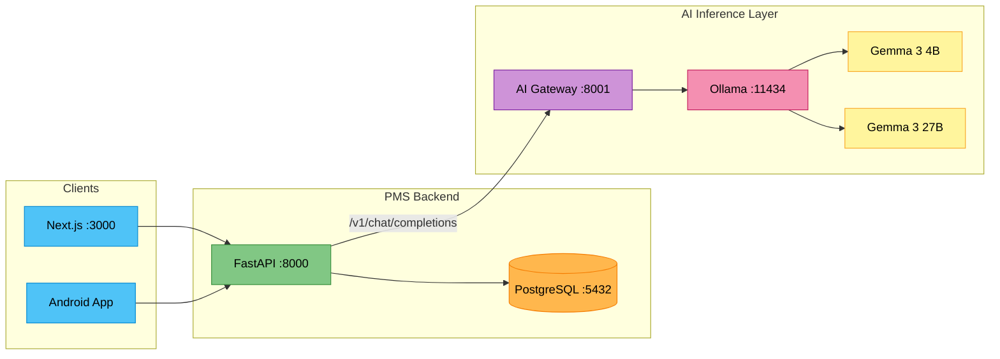

# Gemma 3 Setup Guide for PMS Integration

**Document ID:** PMS-EXP-GEMMA3-001
**Version:** 1.0
**Date:** 2026-02-20
**Applies To:** PMS project (all platforms)
**Prerequisites Level:** Intermediate

---

## Table of Contents

1. [Overview](#1-overview)
2. [Prerequisites](#2-prerequisites)
3. [Part A: Install and Configure Gemma 3 with Ollama](#3-part-a-install-and-configure-gemma-3-with-ollama)
4. [Part B: Integrate with PMS Backend](#4-part-b-integrate-with-pms-backend)
5. [Part C: Integrate with PMS Frontend](#5-part-c-integrate-with-pms-frontend)
6. [Part D: Testing and Verification](#6-part-d-testing-and-verification)
7. [Troubleshooting](#7-troubleshooting)
8. [Reference Commands](#8-reference-commands)

---

## 1. Overview

This guide walks you through deploying Google's Gemma 3 open-weight model as a self-hosted AI inference service for the PMS. By the end, you will have:

- Ollama running with Gemma 3 4B and 27B models
- An AI Gateway (FastAPI) exposing OpenAI-compatible endpoints
- PMS Backend connected to the AI Gateway for clinical summarization
- PMS Frontend displaying AI-generated summaries in the encounter view
- Full audit logging and HIPAA-compliant PHI isolation

### Architecture at a Glance



---

## 2. Prerequisites

### 2.1 Required Software

| Software | Minimum Version | Check Command |
|----------|----------------|---------------|
| Docker | 24.0 | `docker --version` |
| Docker Compose | 2.20 | `docker compose version` |
| NVIDIA Driver | 535+ | `nvidia-smi` |
| NVIDIA Container Toolkit | 1.14 | `nvidia-ctk --version` |
| Python | 3.11 | `python3 --version` |
| Node.js | 20.x | `node --version` |
| Git | 2.40+ | `git --version` |
| curl | any | `curl --version` |

### 2.2 Installation of Prerequisites

#### NVIDIA Container Toolkit (if not installed)

```bash
# Add NVIDIA repository
curl -fsSL https://nvidia.github.io/libnvidia-container/gpgkey | \
  sudo gpg --dearmor -o /usr/share/keyrings/nvidia-container-toolkit-keyring.gpg

curl -s -L https://nvidia.github.io/libnvidia-container/stable/deb/nvidia-container-toolkit.list | \
  sed 's#deb https://#deb [signed-by=/usr/share/keyrings/nvidia-container-toolkit-keyring.gpg] https://#g' | \
  sudo tee /etc/apt/sources.list.d/nvidia-container-toolkit.list

# Install
sudo apt-get update && sudo apt-get install -y nvidia-container-toolkit

# Configure Docker runtime
sudo nvidia-ctk runtime configure --runtime=docker
sudo systemctl restart docker
```

#### Verify GPU Access in Docker

```bash
docker run --rm --gpus all nvidia/cuda:12.4.0-base-ubuntu22.04 nvidia-smi
```

You should see your GPU listed with driver version and CUDA version.

### 2.3 Verify PMS Services

```bash
# Check PMS Backend
curl -s http://localhost:8000/api/health | python3 -m json.tool

# Check PMS Frontend
curl -s -o /dev/null -w "%{http_code}" http://localhost:3000

# Check PostgreSQL
docker exec pms-db pg_isready -U pms
```

All three should return healthy responses (200 OK, `/ready`, or `accepting connections`).

---

## 3. Part A: Install and Configure Gemma 3 with Ollama

### Step 1: Create the AI Services Directory

```bash
mkdir -p ~/pms-ai/{models,logs,config}
cd ~/pms-ai
```

### Step 2: Create Docker Compose for Ollama

Create `docker-compose.yml`:

```yaml
version: "3.8"

services:
  ollama:
    image: ollama/ollama:latest
    container_name: pms-ollama
    restart: unless-stopped
    ports:
      - "11434:11434"
    volumes:
      - ./models:/root/.ollama
      - ./logs:/var/log/ollama
    deploy:
      resources:
        reservations:
          devices:
            - driver: nvidia
              count: all
              capabilities: [gpu]
    environment:
      - OLLAMA_HOST=0.0.0.0
      - OLLAMA_NUM_PARALLEL=4
      - OLLAMA_MAX_LOADED_MODELS=2
    healthcheck:
      test: ["CMD", "curl", "-f", "http://localhost:11434/api/tags"]
      interval: 30s
      timeout: 10s
      retries: 3

  ai-gateway:
    build:
      context: .
      dockerfile: Dockerfile.gateway
    container_name: pms-ai-gateway
    restart: unless-stopped
    ports:
      - "8001:8001"
    environment:
      - OLLAMA_BASE_URL=http://ollama:11434
      - LOG_DIR=/var/log/ai-gateway
      - REDIS_URL=redis://redis:6379/0
    volumes:
      - ./logs:/var/log/ai-gateway
    depends_on:
      ollama:
        condition: service_healthy

  redis:
    image: redis:7-alpine
    container_name: pms-ai-redis
    restart: unless-stopped
    ports:
      - "6379:6379"
    volumes:
      - redis-data:/data

volumes:
  redis-data:
```

### Step 3: Create the AI Gateway Service

Create `Dockerfile.gateway`:

```dockerfile
FROM python:3.11-slim

WORKDIR /app

COPY requirements-gateway.txt .
RUN pip install --no-cache-dir -r requirements-gateway.txt

COPY gateway/ ./gateway/

EXPOSE 8001
CMD ["uvicorn", "gateway.main:app", "--host", "0.0.0.0", "--port", "8001"]
```

Create `requirements-gateway.txt`:

```text
fastapi==0.115.0
uvicorn[standard]==0.32.0
httpx==0.27.0
redis==5.0.0
pydantic==2.9.0
python-json-logger==2.0.7
```

Create `gateway/main.py`:

```python
"""PMS AI Gateway — OpenAI-compatible proxy for Ollama/Gemma 3."""

import hashlib
import json
import logging
import time
from datetime import datetime, timezone

import httpx
import redis.asyncio as redis
from fastapi import FastAPI, HTTPException, Request
from fastapi.responses import StreamingResponse
from pydantic import BaseModel

# --- Configuration ---
import os

OLLAMA_BASE_URL = os.getenv("OLLAMA_BASE_URL", "http://localhost:11434")
REDIS_URL = os.getenv("REDIS_URL", "redis://localhost:6379/0")
LOG_DIR = os.getenv("LOG_DIR", "/var/log/ai-gateway")
CACHE_TTL = int(os.getenv("CACHE_TTL", "86400"))  # 24 hours

# --- Logging ---
logging.basicConfig(level=logging.INFO)
logger = logging.getLogger("ai-gateway")

# --- App ---
app = FastAPI(title="PMS AI Gateway", version="1.0.0")

# --- Redis ---
redis_client: redis.Redis | None = None


@app.on_event("startup")
async def startup():
    global redis_client
    try:
        redis_client = redis.from_url(REDIS_URL, decode_responses=True)
        await redis_client.ping()
        logger.info("Redis connected")
    except Exception:
        logger.warning("Redis unavailable — caching disabled")
        redis_client = None


# --- Models ---

# Map friendly names to Ollama model tags
MODEL_MAP = {
    "gemma3-4b": "gemma3:4b",
    "gemma3-12b": "gemma3:12b",
    "gemma3-27b": "gemma3:27b",
    "medgemma-4b": "medgemma:4b",
    "medgemma-27b": "medgemma:27b",
}

DEFAULT_MODEL = "gemma3-4b"


class ChatMessage(BaseModel):
    role: str
    content: str


class ChatCompletionRequest(BaseModel):
    model: str = DEFAULT_MODEL
    messages: list[ChatMessage]
    temperature: float = 0.7
    max_tokens: int = 2048
    stream: bool = False


class AuditEntry(BaseModel):
    timestamp: str
    user_id: str
    model: str
    prompt_tokens: int
    completion_tokens: int
    latency_ms: float
    cache_hit: bool


def _cache_key(req: ChatCompletionRequest) -> str:
    """Generate a deterministic cache key from the request."""
    payload = json.dumps(
        {"model": req.model, "messages": [m.model_dump() for m in req.messages],
         "temperature": req.temperature},
        sort_keys=True,
    )
    return f"ai:cache:{hashlib.sha256(payload.encode()).hexdigest()}"


def _log_audit(entry: AuditEntry):
    """Write audit log entry (PHI-free)."""
    logger.info(
        "audit",
        extra={
            "timestamp": entry.timestamp,
            "user_id": entry.user_id,
            "model": entry.model,
            "prompt_tokens": entry.prompt_tokens,
            "completion_tokens": entry.completion_tokens,
            "latency_ms": entry.latency_ms,
            "cache_hit": entry.cache_hit,
        },
    )


@app.get("/health")
async def health():
    """Health check endpoint."""
    async with httpx.AsyncClient() as client:
        try:
            resp = await client.get(f"{OLLAMA_BASE_URL}/api/tags", timeout=5)
            ollama_ok = resp.status_code == 200
        except Exception:
            ollama_ok = False
    return {
        "status": "healthy" if ollama_ok else "degraded",
        "ollama": ollama_ok,
        "redis": redis_client is not None,
    }


@app.get("/v1/models")
async def list_models():
    """List available models (OpenAI-compatible)."""
    return {
        "object": "list",
        "data": [
            {"id": name, "object": "model", "owned_by": "google"}
            for name in MODEL_MAP
        ],
    }


@app.post("/v1/chat/completions")
async def chat_completions(req: ChatCompletionRequest, request: Request):
    """OpenAI-compatible chat completions endpoint."""
    start = time.monotonic()

    # Resolve model name
    ollama_model = MODEL_MAP.get(req.model, req.model)

    # Check cache
    cache_key = _cache_key(req)
    if redis_client and not req.stream:
        cached = await redis_client.get(cache_key)
        if cached:
            _log_audit(AuditEntry(
                timestamp=datetime.now(timezone.utc).isoformat(),
                user_id=request.headers.get("X-User-ID", "anonymous"),
                model=req.model,
                prompt_tokens=0,
                completion_tokens=0,
                latency_ms=(time.monotonic() - start) * 1000,
                cache_hit=True,
            ))
            return json.loads(cached)

    # Build Ollama request
    ollama_payload = {
        "model": ollama_model,
        "messages": [m.model_dump() for m in req.messages],
        "options": {
            "temperature": req.temperature,
            "num_predict": req.max_tokens,
        },
        "stream": req.stream,
    }

    async with httpx.AsyncClient(timeout=120) as client:
        if req.stream:
            # Streaming response
            async def stream_generator():
                async with client.stream(
                    "POST",
                    f"{OLLAMA_BASE_URL}/api/chat",
                    json=ollama_payload,
                ) as resp:
                    async for line in resp.aiter_lines():
                        if line:
                            chunk = json.loads(line)
                            yield f"data: {json.dumps(_to_openai_chunk(chunk, req.model))}\n\n"
                    yield "data: [DONE]\n\n"

            return StreamingResponse(
                stream_generator(),
                media_type="text/event-stream",
            )

        # Non-streaming response
        try:
            resp = await client.post(
                f"{OLLAMA_BASE_URL}/api/chat",
                json=ollama_payload,
            )
            resp.raise_for_status()
        except httpx.HTTPStatusError as e:
            raise HTTPException(status_code=502, detail=f"Ollama error: {e}")

        data = resp.json()
        result = _to_openai_response(data, req.model)

        # Cache the result
        if redis_client:
            await redis_client.setex(cache_key, CACHE_TTL, json.dumps(result))

        latency = (time.monotonic() - start) * 1000
        _log_audit(AuditEntry(
            timestamp=datetime.now(timezone.utc).isoformat(),
            user_id=request.headers.get("X-User-ID", "anonymous"),
            model=req.model,
            prompt_tokens=data.get("prompt_eval_count", 0),
            completion_tokens=data.get("eval_count", 0),
            latency_ms=latency,
            cache_hit=False,
        ))

        return result


def _to_openai_response(data: dict, model: str) -> dict:
    """Convert Ollama response to OpenAI format."""
    return {
        "id": f"chatcmpl-{int(time.time())}",
        "object": "chat.completion",
        "created": int(time.time()),
        "model": model,
        "choices": [
            {
                "index": 0,
                "message": {
                    "role": "assistant",
                    "content": data.get("message", {}).get("content", ""),
                },
                "finish_reason": "stop",
            }
        ],
        "usage": {
            "prompt_tokens": data.get("prompt_eval_count", 0),
            "completion_tokens": data.get("eval_count", 0),
            "total_tokens": data.get("prompt_eval_count", 0)
            + data.get("eval_count", 0),
        },
    }


def _to_openai_chunk(chunk: dict, model: str) -> dict:
    """Convert Ollama streaming chunk to OpenAI SSE format."""
    return {
        "id": f"chatcmpl-{int(time.time())}",
        "object": "chat.completion.chunk",
        "created": int(time.time()),
        "model": model,
        "choices": [
            {
                "index": 0,
                "delta": {
                    "content": chunk.get("message", {}).get("content", ""),
                },
                "finish_reason": "stop" if chunk.get("done") else None,
            }
        ],
    }
```

Create `gateway/__init__.py`:

```python
```

### Step 4: Start the Services

```bash
cd ~/pms-ai
docker compose up -d
```

### Step 5: Pull Gemma 3 Models

```bash
# Pull the 4B model (fast, good for real-time tasks)
docker exec pms-ollama ollama pull gemma3:4b

# Pull the 27B model (powerful, for complex clinical reasoning)
docker exec pms-ollama ollama pull gemma3:27b
```

> **Note:** The 4B model downloads ~2.5 GB, the 27B model downloads ~16 GB (int4 quantized). Ensure sufficient disk space and bandwidth.

### Step 6: Verify Ollama Is Serving

```bash
# List loaded models
curl -s http://localhost:11434/api/tags | python3 -m json.tool

# Quick test with 4B model
curl -s http://localhost:11434/api/chat -d '{
  "model": "gemma3:4b",
  "messages": [{"role": "user", "content": "What is HIPAA?"}],
  "stream": false
}' | python3 -m json.tool
```

### Step 7: Verify AI Gateway

```bash
# Health check
curl -s http://localhost:8001/health | python3 -m json.tool

# List available models
curl -s http://localhost:8001/v1/models | python3 -m json.tool

# Test chat completion (OpenAI-compatible)
curl -s http://localhost:8001/v1/chat/completions \
  -H "Content-Type: application/json" \
  -H "X-User-ID: dev-setup-test" \
  -d '{
    "model": "gemma3-4b",
    "messages": [
      {"role": "system", "content": "You are a clinical assistant."},
      {"role": "user", "content": "Summarize the key components of a patient encounter note."}
    ]
  }' | python3 -m json.tool
```

**Checkpoint:** Ollama is running with Gemma 3 models, and the AI Gateway is serving OpenAI-compatible chat completions on port 8001.

---

## 4. Part B: Integrate with PMS Backend

### Step 1: Add AI Client Dependencies

In the PMS Backend project (`pms-backend/`), add dependencies:

```bash
cd ~/pms-backend
pip install openai httpx
```

Or add to `requirements.txt`:

```text
openai>=1.50.0
httpx>=0.27.0
```

### Step 2: Create the AI Service Module

Create `app/services/ai_service.py`:

```python
"""AI Service — interfaces with local Gemma 3 via AI Gateway."""

import logging
from typing import AsyncGenerator

from openai import AsyncOpenAI

logger = logging.getLogger(__name__)

# Point to local AI Gateway (not OpenAI cloud)
ai_client = AsyncOpenAI(
    base_url="http://localhost:8001/v1",
    api_key="not-needed",  # Local inference, no API key required
)

# Model routing configuration
MODELS = {
    "fast": "gemma3-4b",       # Real-time tasks, autocomplete
    "standard": "gemma3-27b",  # Clinical summarization, complex reasoning
    "medical": "medgemma-27b", # Medical QA, clinical guidelines
}


async def summarize_encounter(
    encounter_text: str,
    patient_context: str = "",
    model_tier: str = "standard",
) -> str:
    """Generate a clinical summary from encounter notes."""
    system_prompt = (
        "You are a clinical documentation assistant. Generate a concise, "
        "structured summary of the encounter with these sections:\n"
        "- Chief Complaint\n"
        "- History of Present Illness\n"
        "- Assessment\n"
        "- Plan\n"
        "Use medical terminology. Be factual — do not infer or hallucinate."
    )

    messages = [
        {"role": "system", "content": system_prompt},
    ]
    if patient_context:
        messages.append({
            "role": "user",
            "content": f"Patient context:\n{patient_context}",
        })
    messages.append({
        "role": "user",
        "content": f"Encounter notes:\n{encounter_text}",
    })

    response = await ai_client.chat.completions.create(
        model=MODELS[model_tier],
        messages=messages,
        temperature=0.3,
        max_tokens=1024,
    )

    return response.choices[0].message.content


async def extract_structured_data(
    note_text: str,
) -> dict:
    """Extract ICD-10 codes, medications, and vitals from free text."""
    system_prompt = (
        "Extract structured data from the clinical note. Return valid JSON with:\n"
        '{"icd10_codes": ["Z00.00", ...], '
        '"medications": [{"name": "...", "dose": "...", "frequency": "..."}], '
        '"vitals": {"bp": "...", "hr": "...", "temp": "...", "spo2": "..."}}\n'
        "Only include data explicitly mentioned in the note."
    )

    response = await ai_client.chat.completions.create(
        model=MODELS["fast"],
        messages=[
            {"role": "system", "content": system_prompt},
            {"role": "user", "content": note_text},
        ],
        temperature=0.1,
        max_tokens=512,
    )

    import json
    try:
        return json.loads(response.choices[0].message.content)
    except json.JSONDecodeError:
        logger.warning("Failed to parse structured extraction — returning raw text")
        return {"raw": response.choices[0].message.content}


async def stream_completion(
    messages: list[dict],
    model_tier: str = "fast",
) -> AsyncGenerator[str, None]:
    """Stream a chat completion token by token."""
    stream = await ai_client.chat.completions.create(
        model=MODELS[model_tier],
        messages=messages,
        temperature=0.7,
        max_tokens=2048,
        stream=True,
    )

    async for chunk in stream:
        if chunk.choices[0].delta.content:
            yield chunk.choices[0].delta.content
```

### Step 3: Add AI Endpoints to the PMS API

Create `app/routers/ai.py`:

```python
"""AI-powered clinical endpoints."""

from fastapi import APIRouter, Depends, HTTPException
from fastapi.responses import StreamingResponse
from pydantic import BaseModel

from app.services.ai_service import (
    summarize_encounter,
    extract_structured_data,
    stream_completion,
)

router = APIRouter(prefix="/api/ai", tags=["AI"])


class SummarizeRequest(BaseModel):
    encounter_text: str
    patient_context: str = ""
    model_tier: str = "standard"


class ExtractionRequest(BaseModel):
    note_text: str


class ChatRequest(BaseModel):
    messages: list[dict]
    model_tier: str = "fast"
    stream: bool = False


@router.post("/summarize")
async def api_summarize(req: SummarizeRequest):
    """Generate an AI clinical summary from encounter notes."""
    try:
        summary = await summarize_encounter(
            encounter_text=req.encounter_text,
            patient_context=req.patient_context,
            model_tier=req.model_tier,
        )
        return {"summary": summary, "model": req.model_tier}
    except Exception as e:
        raise HTTPException(status_code=502, detail=f"AI service error: {e}")


@router.post("/extract")
async def api_extract(req: ExtractionRequest):
    """Extract structured clinical data from free-text notes."""
    try:
        result = await extract_structured_data(req.note_text)
        return {"extracted": result}
    except Exception as e:
        raise HTTPException(status_code=502, detail=f"AI service error: {e}")


@router.post("/chat")
async def api_chat(req: ChatRequest):
    """Chat with the clinical AI assistant."""
    if req.stream:
        return StreamingResponse(
            stream_completion(req.messages, req.model_tier),
            media_type="text/event-stream",
        )
    # Non-streaming
    chunks = []
    async for token in stream_completion(req.messages, req.model_tier):
        chunks.append(token)
    return {"response": "".join(chunks), "model": req.model_tier}
```

### Step 4: Register the Router

In `app/main.py`, add:

```python
from app.routers.ai import router as ai_router

app.include_router(ai_router)
```

### Step 5: Add Environment Variables

Add to `.env`:

```env
# AI Gateway Configuration
AI_GATEWAY_URL=http://localhost:8001
AI_DEFAULT_MODEL=gemma3-4b
AI_SUMMARY_MODEL=gemma3-27b
```

**Checkpoint:** PMS Backend now has `/api/ai/summarize`, `/api/ai/extract`, and `/api/ai/chat` endpoints that route to local Gemma 3 models via the AI Gateway.

---

## 5. Part C: Integrate with PMS Frontend

### Step 1: Add Environment Variables

In the PMS Frontend project (`pms-frontend/`), add to `.env.local`:

```env
NEXT_PUBLIC_API_URL=http://localhost:8000
```

### Step 2: Create the AI Service Client

Create `src/lib/ai-client.ts`:

```typescript
const API_URL = process.env.NEXT_PUBLIC_API_URL || "http://localhost:8000";

export interface SummarizeResponse {
  summary: string;
  model: string;
}

export interface ExtractResponse {
  extracted: {
    icd10_codes?: string[];
    medications?: Array<{ name: string; dose: string; frequency: string }>;
    vitals?: Record<string, string>;
    raw?: string;
  };
}

export async function summarizeEncounter(
  encounterText: string,
  patientContext?: string,
  modelTier: string = "standard"
): Promise<SummarizeResponse> {
  const res = await fetch(`${API_URL}/api/ai/summarize`, {
    method: "POST",
    headers: { "Content-Type": "application/json" },
    body: JSON.stringify({
      encounter_text: encounterText,
      patient_context: patientContext || "",
      model_tier: modelTier,
    }),
  });

  if (!res.ok) {
    throw new Error(`AI summarization failed: ${res.statusText}`);
  }

  return res.json();
}

export async function extractStructuredData(
  noteText: string
): Promise<ExtractResponse> {
  const res = await fetch(`${API_URL}/api/ai/extract`, {
    method: "POST",
    headers: { "Content-Type": "application/json" },
    body: JSON.stringify({ note_text: noteText }),
  });

  if (!res.ok) {
    throw new Error(`AI extraction failed: ${res.statusText}`);
  }

  return res.json();
}

export async function* streamChat(
  messages: Array<{ role: string; content: string }>,
  modelTier: string = "fast"
): AsyncGenerator<string, void, unknown> {
  const res = await fetch(`${API_URL}/api/ai/chat`, {
    method: "POST",
    headers: { "Content-Type": "application/json" },
    body: JSON.stringify({ messages, model_tier: modelTier, stream: true }),
  });

  if (!res.ok || !res.body) {
    throw new Error(`AI chat failed: ${res.statusText}`);
  }

  const reader = res.body.getReader();
  const decoder = new TextDecoder();

  while (true) {
    const { done, value } = await reader.read();
    if (done) break;
    yield decoder.decode(value, { stream: true });
  }
}
```

### Step 3: Create the AI Summary Component

Create `src/components/ai/encounter-summary.tsx`:

```tsx
"use client";

import { useState } from "react";
import { summarizeEncounter, type SummarizeResponse } from "@/lib/ai-client";

interface EncounterSummaryProps {
  encounterText: string;
  patientContext?: string;
}

export function EncounterSummary({
  encounterText,
  patientContext,
}: EncounterSummaryProps) {
  const [summary, setSummary] = useState<SummarizeResponse | null>(null);
  const [loading, setLoading] = useState(false);
  const [error, setError] = useState<string | null>(null);

  const handleSummarize = async () => {
    setLoading(true);
    setError(null);
    try {
      const result = await summarizeEncounter(
        encounterText,
        patientContext,
        "standard"
      );
      setSummary(result);
    } catch (err) {
      setError(err instanceof Error ? err.message : "Summarization failed");
    } finally {
      setLoading(false);
    }
  };

  return (
    <div className="rounded-lg border border-gray-200 bg-white p-4">
      <div className="mb-3 flex items-center justify-between">
        <h3 className="text-sm font-semibold text-gray-700">
          AI-Assisted Summary
        </h3>
        <button
          onClick={handleSummarize}
          disabled={loading || !encounterText}
          className="rounded bg-blue-600 px-3 py-1 text-xs font-medium text-white hover:bg-blue-700 disabled:opacity-50"
        >
          {loading ? "Generating..." : "Generate Summary"}
        </button>
      </div>

      {error && (
        <div className="mb-2 rounded bg-red-50 p-2 text-xs text-red-600">
          {error}
        </div>
      )}

      {summary && (
        <div className="space-y-2">
          <div className="whitespace-pre-wrap rounded bg-gray-50 p-3 text-sm text-gray-800">
            {summary.summary}
          </div>
          <div className="flex items-center gap-2 text-xs text-gray-400">
            <span>Model: {summary.model}</span>
            <span className="rounded bg-yellow-100 px-1.5 py-0.5 text-yellow-700">
              AI-Generated — Requires Clinician Review
            </span>
          </div>
        </div>
      )}
    </div>
  );
}
```

### Step 4: Create the Structured Extraction Component

Create `src/components/ai/structured-extraction.tsx`:

```tsx
"use client";

import { useState } from "react";
import { extractStructuredData, type ExtractResponse } from "@/lib/ai-client";

interface StructuredExtractionProps {
  noteText: string;
}

export function StructuredExtraction({ noteText }: StructuredExtractionProps) {
  const [result, setResult] = useState<ExtractResponse | null>(null);
  const [loading, setLoading] = useState(false);

  const handleExtract = async () => {
    setLoading(true);
    try {
      const data = await extractStructuredData(noteText);
      setResult(data);
    } catch {
      setResult(null);
    } finally {
      setLoading(false);
    }
  };

  return (
    <div className="rounded-lg border border-gray-200 bg-white p-4">
      <div className="mb-3 flex items-center justify-between">
        <h3 className="text-sm font-semibold text-gray-700">
          Extracted Data
        </h3>
        <button
          onClick={handleExtract}
          disabled={loading || !noteText}
          className="rounded bg-green-600 px-3 py-1 text-xs font-medium text-white hover:bg-green-700 disabled:opacity-50"
        >
          {loading ? "Extracting..." : "Extract Data"}
        </button>
      </div>

      {result?.extracted && (
        <div className="space-y-3 text-sm">
          {result.extracted.icd10_codes && (
            <div>
              <span className="font-medium text-gray-600">ICD-10 Codes:</span>
              <div className="mt-1 flex flex-wrap gap-1">
                {result.extracted.icd10_codes.map((code) => (
                  <span
                    key={code}
                    className="rounded bg-blue-100 px-2 py-0.5 text-xs text-blue-700"
                  >
                    {code}
                  </span>
                ))}
              </div>
            </div>
          )}

          {result.extracted.medications && (
            <div>
              <span className="font-medium text-gray-600">Medications:</span>
              <ul className="mt-1 list-inside list-disc text-gray-700">
                {result.extracted.medications.map((med, i) => (
                  <li key={i}>
                    {med.name} {med.dose} — {med.frequency}
                  </li>
                ))}
              </ul>
            </div>
          )}

          {result.extracted.vitals && (
            <div>
              <span className="font-medium text-gray-600">Vitals:</span>
              <div className="mt-1 grid grid-cols-2 gap-1 text-xs">
                {Object.entries(result.extracted.vitals).map(([key, val]) => (
                  <div key={key} className="rounded bg-gray-50 px-2 py-1">
                    <span className="font-medium">{key.toUpperCase()}:</span> {val}
                  </div>
                ))}
              </div>
            </div>
          )}

          <div className="text-xs text-yellow-600">
            AI-Extracted — Verify before saving to patient record
          </div>
        </div>
      )}
    </div>
  );
}
```

**Checkpoint:** PMS Frontend now has `EncounterSummary` and `StructuredExtraction` React components that call the PMS Backend AI endpoints, which route to local Gemma 3 models.

---

## 6. Part D: Testing and Verification

### Service Health Checks

```bash
# 1. Ollama health
curl -s http://localhost:11434/api/tags | python3 -m json.tool
# Expected: {"models": [{"name": "gemma3:4b", ...}, {"name": "gemma3:27b", ...}]}

# 2. AI Gateway health
curl -s http://localhost:8001/health | python3 -m json.tool
# Expected: {"status": "healthy", "ollama": true, "redis": true}

# 3. PMS Backend health
curl -s http://localhost:8000/api/health | python3 -m json.tool
```

### Functional Tests

```bash
# Test clinical summarization
curl -s http://localhost:8000/api/ai/summarize \
  -H "Content-Type: application/json" \
  -d '{
    "encounter_text": "Patient is a 65-year-old male presenting with chest pain for 2 hours. Pain is substernal, radiating to left arm. BP 160/95, HR 88, SpO2 97%. ECG shows ST elevation in leads II, III, aVF. Troponin pending. Started on aspirin 325mg, nitroglycerin SL, heparin drip. Cardiology consulted for emergent cath.",
    "model_tier": "standard"
  }' | python3 -m json.tool
# Expected: A structured summary with Chief Complaint, HPI, Assessment, Plan

# Test structured extraction
curl -s http://localhost:8000/api/ai/extract \
  -H "Content-Type: application/json" \
  -d '{
    "note_text": "Patient diagnosed with type 2 diabetes mellitus (E11.9) and essential hypertension (I10). Started metformin 500mg BID and lisinopril 10mg daily. BP today 142/88, HR 76, SpO2 99%."
  }' | python3 -m json.tool
# Expected: {"extracted": {"icd10_codes": ["E11.9", "I10"], "medications": [...], "vitals": {...}}}
```

### Integration Test

```bash
# Test the full pipeline: Gateway → Ollama → Gemma 3
curl -s http://localhost:8001/v1/chat/completions \
  -H "Content-Type: application/json" \
  -H "X-User-ID: integration-test" \
  -d '{
    "model": "gemma3-4b",
    "messages": [
      {"role": "system", "content": "You are a clinical assistant."},
      {"role": "user", "content": "What are the first-line treatments for community-acquired pneumonia in adults?"}
    ],
    "temperature": 0.3
  }' | python3 -m json.tool
# Expected: Valid OpenAI-format response with clinical information
```

### Performance Baseline

```bash
# Measure latency for 4B model
time curl -s http://localhost:8001/v1/chat/completions \
  -H "Content-Type: application/json" \
  -d '{
    "model": "gemma3-4b",
    "messages": [{"role": "user", "content": "Hello"}]
  }' > /dev/null

# Measure latency for 27B model
time curl -s http://localhost:8001/v1/chat/completions \
  -H "Content-Type: application/json" \
  -d '{
    "model": "gemma3-27b",
    "messages": [{"role": "user", "content": "Hello"}]
  }' > /dev/null
```

**Checkpoint:** All services are healthy, clinical summarization and structured extraction produce correct outputs, and you have baseline latency numbers for both models.

---

## 7. Troubleshooting

### Ollama Fails to Start / GPU Not Detected

**Symptoms:** `docker logs pms-ollama` shows "no compatible GPUs" or "CUDA not found"

**Solution:**
```bash
# Verify NVIDIA driver
nvidia-smi

# Verify NVIDIA Container Toolkit
docker run --rm --gpus all nvidia/cuda:12.4.0-base-ubuntu22.04 nvidia-smi

# If missing, install NVIDIA Container Toolkit (see Prerequisites)
sudo nvidia-ctk runtime configure --runtime=docker
sudo systemctl restart docker

# Restart Ollama
docker compose restart ollama
```

### Model Download Fails or Stalls

**Symptoms:** `ollama pull` hangs or returns connection errors

**Solution:**
```bash
# Check disk space (27B model needs ~16 GB)
df -h ~/pms-ai/models

# Pull with verbose output
docker exec pms-ollama ollama pull gemma3:27b --verbose

# Alternative: download GGUF manually from Hugging Face
# and place in ~/pms-ai/models/manifests/
```

### AI Gateway Returns 502 Bad Gateway

**Symptoms:** `/v1/chat/completions` returns `{"detail": "Ollama error: ..."}`

**Solution:**
```bash
# Check Ollama is reachable from Gateway container
docker exec pms-ai-gateway curl -s http://ollama:11434/api/tags

# Check model is loaded
docker exec pms-ollama ollama list

# If model not loaded, pull it
docker exec pms-ollama ollama pull gemma3:4b
```

### Out of Memory (OOM) During Inference

**Symptoms:** Ollama crashes or returns empty responses with large prompts

**Solution:**
```bash
# Check GPU memory usage
nvidia-smi

# Reduce parallel requests
# In docker-compose.yml, set:
#   OLLAMA_NUM_PARALLEL=1
#   OLLAMA_MAX_LOADED_MODELS=1

# Use smaller model for high-concurrency scenarios
# Route to gemma3-4b instead of gemma3-27b

# Reduce context length in the request
# Set max_tokens to 512 instead of 2048
```

### Slow Response Times (> 10 seconds)

**Symptoms:** First request takes 30+ seconds, subsequent requests are faster

**Solution:**
```bash
# First request loads model into GPU memory — this is normal
# Pre-warm the model after startup:
docker exec pms-ollama ollama run gemma3:4b "warm up" --verbose

# For production, add a startup warmup script
# that sends a dummy request to each model
```

### Redis Cache Not Working

**Symptoms:** Gateway health shows `"redis": false`

**Solution:**
```bash
# Check Redis container
docker logs pms-ai-redis

# Test Redis connectivity
docker exec pms-ai-redis redis-cli ping
# Expected: PONG

# Check Redis URL in Gateway environment
docker exec pms-ai-gateway env | grep REDIS
```

---

## 8. Reference Commands

### Daily Development Workflow

```bash
# Start all AI services
cd ~/pms-ai && docker compose up -d

# Check status
docker compose ps

# View logs
docker compose logs -f --tail=50

# Stop services
docker compose down
```

### Model Management

```bash
# List downloaded models
docker exec pms-ollama ollama list

# Pull a new model
docker exec pms-ollama ollama pull gemma3:12b

# Remove a model
docker exec pms-ollama ollama rm gemma3:12b

# Show model details
docker exec pms-ollama ollama show gemma3:27b
```

### Monitoring Commands

```bash
# GPU utilization
watch -n 1 nvidia-smi

# AI Gateway logs
docker logs -f pms-ai-gateway

# Audit log tail
tail -f ~/pms-ai/logs/*.log

# Redis cache stats
docker exec pms-ai-redis redis-cli info stats | grep hits
```

### Useful URLs

| Service | URL | Purpose |
|---------|-----|---------|
| Ollama API | http://localhost:11434 | Direct Ollama access |
| AI Gateway | http://localhost:8001 | OpenAI-compatible API |
| AI Gateway Health | http://localhost:8001/health | Service health check |
| AI Gateway Models | http://localhost:8001/v1/models | List available models |
| PMS Backend | http://localhost:8000 | PMS API server |
| PMS Frontend | http://localhost:3000 | PMS web UI |
| Redis | localhost:6379 | Response cache |

---

## Next Steps

1. Complete the [Gemma 3 Developer Tutorial](13-Gemma3-Developer-Tutorial.md) to build your first clinical AI integration end-to-end
2. Explore [MedGemma](https://developers.google.com/health-ai-developer-foundations/medgemma) for healthcare-specific capabilities
3. Review the [Gemma 3 PRD](13-PRD-Gemma3-PMS-Integration.md) for the full integration roadmap
4. Set up fine-tuning with LoRA — see [Google's QLoRA Tutorial](https://ai.google.dev/gemma/docs/core/huggingface_text_finetune_qlora)

---

## Resources

- [Gemma 3 Model Overview — Google AI](https://ai.google.dev/gemma/docs/core)
- [Ollama Documentation](https://ollama.com/)
- [Ollama Gemma 3 Registry](https://ollama.com/library/gemma3)
- [vLLM Documentation](https://docs.vllm.ai/)
- [MedGemma — Google Health AI](https://developers.google.com/health-ai-developer-foundations/medgemma)
- [Gemma GitHub Repository](https://github.com/google-deepmind/gemma)
- [OpenAI Python Client](https://github.com/openai/openai-python) (used for compatible API access)
- [NVIDIA Container Toolkit](https://docs.nvidia.com/datacenter/cloud-native/container-toolkit/latest/install-guide.html)
