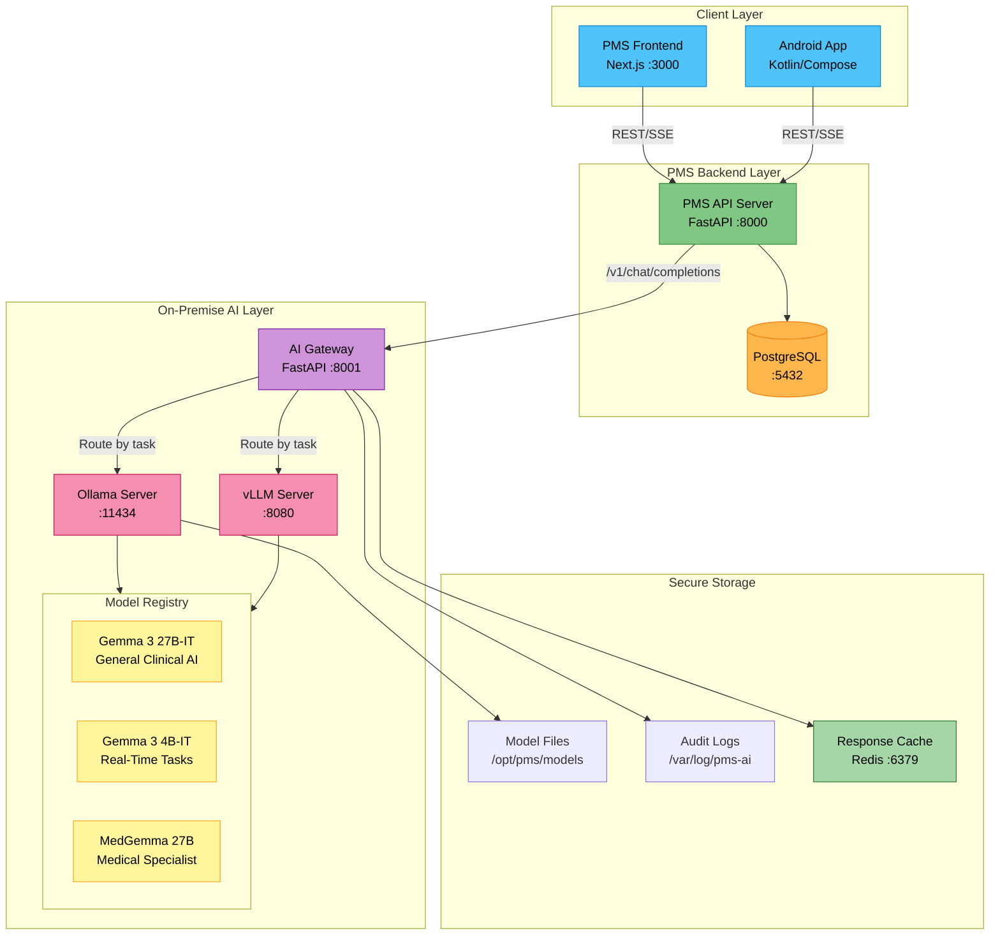

# Product Requirements Document: Gemma 3 Integration into Patient Management System (PMS)

**Document ID:** PRD-PMS-GEMMA3-001
**Version:** 1.0
**Date:** 2026-02-20
**Author:** Ammar (CEO, MPS Inc.)
**Status:** Draft

---

## 1. Executive Summary

Gemma 3 is Google DeepMind's open-weight multimodal language model family, released in March 2025 and built on the Gemini 2.0 architecture. Available in 1B, 4B, 12B, and 27B parameter sizes, Gemma 3 delivers state-of-the-art performance for an open model while running on a single GPU or TPU. The model supports text and image inputs, a 128K token context window, over 140 languages, and native function calling — making it uniquely suited as a self-hosted AI backbone for healthcare applications that require HIPAA-compliant, on-premise inference.

Integrating Gemma 3 into the PMS provides a **private, zero-data-egress AI engine** that powers clinical decision support, medical document understanding, patient record summarization, medication interaction analysis, and structured data extraction — all without sending protected health information (PHI) to external cloud APIs. Google has also released MedGemma, a healthcare-optimized variant built on Gemma 3 that scores 87.7% on the MedQA benchmark and has been validated for chest X-ray report generation and pathology analysis.

This PRD proposes deploying Gemma 3 (and optionally MedGemma) as a self-hosted inference service within the PMS infrastructure, exposed via an OpenAI-compatible API that the FastAPI backend, Next.js frontend, and Android app can consume. This approach eliminates per-token cloud costs, guarantees PHI never leaves the facility network, and enables domain-specific fine-tuning with LoRA/QLoRA on the clinic's own de-identified data.

## 2. Problem Statement

The PMS currently relies on external cloud AI APIs (e.g., Anthropic Claude, OpenAI GPT) for intelligent features such as clinical note summarization, medication interaction checking, and encounter documentation. This creates three critical operational challenges:

1. **PHI Data Egress Risk:** Every API call transmitting patient context to a third-party cloud violates the principle of minimal data exposure and creates HIPAA Business Associate Agreement (BAA) dependencies. Even with BAAs in place, data traverses networks outside the facility's control.

2. **Cost Unpredictability:** Cloud LLM pricing is per-token, creating unbounded cost exposure as clinical usage scales. A busy clinic generating 200+ encounters per day can accrue $5,000-15,000/month in API costs for summarization alone.

3. **Latency and Availability:** Cloud API calls introduce 500-2,000ms network latency per request and are subject to rate limits, outages, and throttling — unacceptable for real-time clinical workflows like point-of-care decision support during patient encounters.

4. **No Domain Customization:** Cloud models cannot be fine-tuned on a clinic's specific documentation patterns, formulary preferences, or specialty-specific terminology without expensive custom model training programs.

Gemma 3 addresses all four challenges by providing a high-capability open model that runs entirely on-premise, with zero recurring API costs, sub-100ms local inference latency, and full support for domain-specific fine-tuning.

## 3. Proposed Solution

### 3.1 Architecture Overview

### 3.2 Deployment Model

**Self-Hosted, Air-Gapped Capable:**
- All model weights stored locally on the PMS server or Jetson Thor edge device
- No internet connectivity required after initial model download
- Docker Compose deployment with GPU passthrough (NVIDIA Container Toolkit)
- Two inference backends: **Ollama** for developer simplicity and **vLLM** for production throughput

**HIPAA Security Envelope:**
- PHI never leaves the local network — all inference happens on-premise
- Model files are read-only, no training data is retained unless explicitly configured for fine-tuning
- AI Gateway logs every prompt/response with de-identified metadata for audit trails
- TLS encryption for all internal service-to-service communication
- RBAC on the AI Gateway to control which PMS roles can access which models

**Model Selection Strategy:**
| Model | Size | VRAM (int4) | Use Case |
|-------|------|-------------|----------|
| Gemma 3 4B-IT | 4B | ~2.6 GB | Real-time autocomplete, quick extraction, mobile inference |
| Gemma 3 27B-IT | 27B | ~14.1 GB | Clinical note summarization, complex reasoning, encounter documentation |
| MedGemma 4B | 4B | ~2.6 GB | Medical image analysis, CXR report generation |
| MedGemma 27B | 27B | ~14.1 GB | Medical QA, clinical guideline navigation, pathology analysis |

## 4. PMS Data Sources

Gemma 3 interacts with the following PMS APIs through the AI Gateway:

### Patient Records API (`/api/patients`)
- **Input:** Patient demographics, medical history, allergies, problem list
- **Use:** Generate patient summaries, identify care gaps, pre-populate encounter notes
- **PHI Handling:** Patient data is sent to the local Gemma 3 instance only — never transmitted externally

### Encounter Records API (`/api/encounters`)
- **Input:** Visit notes, chief complaints, assessments, plans, prior encounter history
- **Use:** Summarize encounter histories, generate follow-up recommendations, extract structured data from free-text notes
- **Context:** 128K token window allows processing multiple encounters in a single prompt

### Medication & Prescription API (`/api/prescriptions`)
- **Input:** Active medications, dosages, allergies, drug interaction databases
- **Use:** Generate medication reconciliation summaries, flag potential interactions, suggest dose adjustments using MedGemma's clinical training
- **Function Calling:** Gemma 3's native function calling triggers structured lookups against the drug database

### Reporting API (`/api/reports`)
- **Input:** Aggregate clinical data, quality metrics, utilization patterns
- **Use:** Generate natural-language summaries of quality reports, answer ad-hoc analytical questions, produce trend narratives for dashboards

## 5. Component/Module Definitions

### 5.1 AI Gateway Service
- **Description:** FastAPI microservice that provides an OpenAI-compatible `/v1/chat/completions` endpoint, routing requests to the appropriate model based on task type
- **Input:** Chat completion requests with model selection, system prompts, and optional images
- **Output:** Streamed or batched text responses in OpenAI-compatible format
- **PMS APIs Used:** None directly — acts as a proxy between PMS Backend and inference engines

### 5.2 Clinical Summarization Module
- **Description:** Generates concise clinical summaries from encounter notes, patient histories, and medication lists
- **Input:** Raw encounter text, patient record JSON from `/api/patients` and `/api/encounters`
- **Output:** Structured summary with Assessment, Plan, Key Findings sections
- **Model:** Gemma 3 27B-IT or MedGemma 27B

### 5.3 Medical Document Understanding Module
- **Description:** Processes uploaded medical images (CXR, lab reports, referral letters) using Gemma 3's vision capabilities
- **Input:** Image files (JPEG/PNG) + clinical context text
- **Output:** Structured findings, extracted text, suggested diagnoses
- **Model:** MedGemma 4B (multimodal) or Gemma 3 4B-IT
- **PMS APIs Used:** `/api/patients` for clinical context, `/api/encounters` to attach findings

### 5.4 Medication Intelligence Module
- **Description:** Provides real-time drug interaction checking, dose optimization suggestions, and medication reconciliation
- **Input:** Current medication list from `/api/prescriptions`, patient weight/renal function from `/api/patients`
- **Output:** Interaction warnings, dose adjustment recommendations, reconciliation summary
- **Model:** MedGemma 27B with function calling to query drug databases
- **PMS APIs Used:** `/api/prescriptions`, `/api/patients`

### 5.5 Structured Data Extraction Module
- **Description:** Extracts structured fields (ICD-10 codes, CPT codes, vital signs, lab values) from free-text clinical notes
- **Input:** Unstructured encounter text from `/api/encounters`
- **Output:** JSON with extracted fields conforming to PMS schema
- **Model:** Gemma 3 4B-IT (for speed) or 27B-IT (for accuracy)
- **Function Calling:** Uses Gemma 3's JSON output mode for reliable structured extraction

### 5.6 Fine-Tuning Pipeline
- **Description:** Offline pipeline for domain-adapting models using LoRA/QLoRA on de-identified clinic data
- **Input:** De-identified training pairs (input/output examples) from PMS data exports
- **Output:** LoRA adapter weights stored in the model registry
- **Infrastructure:** Requires GPU with 24+ GB VRAM; runs as a batch job, not in the inference path

## 6. Non-Functional Requirements

### 6.1 Security and HIPAA Compliance

| Requirement | Implementation |
|-------------|---------------|
| PHI Isolation | All inference runs on-premise; no PHI transmitted to external services |
| Encryption at Rest | Model files and audit logs encrypted with AES-256 on encrypted filesystem |
| Encryption in Transit | TLS 1.3 for all service-to-service communication within the AI layer |
| Access Control | RBAC on AI Gateway — clinicians, nurses, admins have different model access |
| Audit Logging | Every prompt/response logged with timestamp, user ID, model used, token count (PHI redacted in logs) |
| Data Retention | AI inference logs retained for 7 years per HIPAA; response cache TTL of 24 hours |
| Model Integrity | SHA-256 checksums verified on model load; read-only model storage |
| BAA Not Required | No third-party data processor — Gemma 3 runs within the covered entity's infrastructure |

### 6.2 Performance

| Metric | Target |
|--------|--------|
| Time to First Token (TTFT) | < 200ms for 4B model, < 500ms for 27B model |
| Tokens per Second | > 40 tok/s for 4B, > 15 tok/s for 27B (int4 quantized) |
| Concurrent Users | 10 simultaneous inference requests |
| Context Window Utilization | Up to 128K tokens for multi-encounter summarization |
| Availability | 99.5% uptime (local infrastructure dependent) |

### 6.3 Infrastructure

| Component | Requirement |
|-----------|------------|
| GPU | NVIDIA GPU with 16+ GB VRAM (RTX 4090, A6000, or Jetson Thor) |
| RAM | 32 GB system RAM minimum |
| Storage | 100 GB for model files + 50 GB for logs and cache |
| Docker | Docker 24+ with NVIDIA Container Toolkit |
| OS | Ubuntu 22.04 LTS or later |
| Network | Gigabit LAN between PMS services; no internet required post-setup |

## 7. Implementation Phases

### Phase 1: Foundation (Sprints 1-2, 4 weeks)
- Deploy Ollama with Gemma 3 4B-IT in Docker
- Build AI Gateway FastAPI service with OpenAI-compatible API
- Implement basic clinical summarization endpoint
- Set up audit logging and RBAC
- Integration tests with PMS Backend

### Phase 2: Core Integration (Sprints 3-5, 6 weeks)
- Add Gemma 3 27B-IT and MedGemma models
- Deploy vLLM for production throughput
- Build Medication Intelligence Module with function calling
- Build Structured Data Extraction Module
- Integrate Medical Document Understanding (vision) for uploaded images
- Frontend: Add AI-assisted encounter summary panel in Next.js
- Android: Add on-device Gemma 3 4B inference for offline clinical notes

### Phase 3: Advanced Features (Sprints 6-8, 6 weeks)
- Fine-tuning pipeline with LoRA/QLoRA on de-identified clinic data
- Multi-encounter longitudinal summarization (128K context)
- MedGemma pathology and radiology image analysis integration
- Response caching and intelligent prompt routing (4B vs 27B)
- Performance benchmarking and optimization
- Clinical validation study with physician review panel

## 8. Success Metrics

| Metric | Target | Measurement Method |
|--------|--------|--------------------|
| Cloud API Cost Reduction | > 80% reduction in external LLM API spend | Monthly billing comparison |
| PHI Exposure Incidents | Zero external PHI transmissions via AI | Network audit logs |
| Clinical Summary Accuracy | > 85% physician acceptance rate | Blinded review of 100 AI-generated summaries |
| Inference Latency (P95) | < 3 seconds for complete summary generation | AI Gateway latency metrics |
| Medication Interaction Detection | > 90% recall vs pharmacist gold standard | Retrospective chart comparison |
| Structured Extraction F1 | > 0.90 for ICD-10 code extraction | Comparison with manual coding |
| Developer Adoption | 100% of AI features use local Gemma 3 within 6 months | API call routing audit |
| Uptime | > 99.5% | Infrastructure monitoring |

## 9. Risks and Mitigations

| Risk | Impact | Mitigation |
|------|--------|------------|
| GPU hardware cost ($2,000-$10,000) | High upfront CapEx | Start with Gemma 3 4B on existing 16GB GPU; upgrade incrementally |
| Model hallucination in clinical context | Patient safety risk | All AI outputs labeled as "AI-Assisted" requiring clinician review; never auto-apply |
| Gemma 3 license terms allow Google to restrict usage | Service disruption | Download and archive model weights offline; monitor license changes |
| 27B model too large for current hardware | Cannot run flagship model | Use int4 quantization (14.1 GB) or fall back to 12B model |
| Fine-tuning on biased clinic data | Discriminatory outputs | De-identification pipeline + bias audits on training data; diverse evaluation sets |
| Ollama/vLLM breaking changes | Inference service instability | Pin versions in Docker; test upgrades in QA before production |
| MedGemma not validated for specific clinical use | Regulatory risk | Use MedGemma for decision support only; disclaim "not a medical device" |
| Staff resistance to AI-generated content | Low adoption | Pilot with early adopters; measure time savings; iterate on prompt quality |

## 10. Dependencies

| Dependency | Type | Notes |
|------------|------|-------|
| Gemma 3 model weights | Model | Downloaded from Hugging Face or Ollama registry |
| MedGemma model weights | Model | Downloaded from Hugging Face (Google Health) |
| Ollama | Inference Runtime | Open-source, MIT licensed |
| vLLM | Inference Runtime | Apache 2.0 licensed |
| NVIDIA GPU + CUDA | Hardware/Driver | CUDA 12.x, NVIDIA Container Toolkit |
| PMS Backend API | Internal | FastAPI endpoints for patients, encounters, prescriptions |
| Redis | Cache | Response caching for repeated queries |
| Docker + Docker Compose | Infrastructure | Container orchestration |
| Unsloth | Fine-Tuning | Optional, for efficient LoRA/QLoRA training |

## 11. Comparison with Existing Experiments

### vs. Experiment 08 — Adaptive Thinking (Claude API)
Adaptive Thinking integrates Claude's cloud API with effort-routing for cost optimization. Gemma 3 **replaces the need for cloud APIs entirely** by providing on-premise inference. The two are complementary: Adaptive Thinking's effort-routing logic can be repurposed to route between Gemma 3 4B (low-effort) and 27B (high-effort) models locally, achieving the same cost optimization without cloud dependency.

### vs. Experiment 07 — MedASR (Medical Speech Recognition)
MedASR handles speech-to-text for clinical dictation. Gemma 3 sits **downstream** of MedASR — once speech is transcribed, Gemma 3 can summarize, extract structured data, and generate encounter documentation from the transcript. The two form a pipeline: MedASR → Gemma 3 → structured encounter note.

### vs. Experiment 10 — Speechmatics Medical
Similar to MedASR, Speechmatics provides real-time transcription. Gemma 3 adds the **intelligence layer** that transforms raw transcripts into clinical documentation, code suggestions, and medication reconciliation.

### vs. Experiment 11 — Sanford Guide (Antimicrobial CDS)
Sanford Guide provides curated antimicrobial treatment recommendations via API. Gemma 3's Medication Intelligence Module can **augment** Sanford Guide by providing natural-language explanations, dose adjustment reasoning, and interaction analysis that goes beyond the structured Sanford Guide responses.

### vs. Experiment 12 — AI Zero-Day Scan
AI Zero-Day Scan uses Claude for security vulnerability analysis. Gemma 3 could potentially **replace Claude** for code review tasks if fine-tuned on security datasets, though Claude's 200K context window gives it an edge for large codebase scanning. The two serve different domains (security vs. clinical).

## 12. Research Sources

### Official Documentation
- [Gemma 3 Model Overview — Google AI for Developers](https://ai.google.dev/gemma/docs/core) — Architecture, sizes, capabilities, deployment options
- [Gemma 3 Technical Report — arXiv](https://arxiv.org/abs/2503.19786) — Full technical details on architecture and benchmarks
- [Introducing Gemma 3 — Google Blog](https://blog.google/technology/developers/gemma-3/) — Release announcement and key features
- [Gemma Terms of Use](https://ai.google.dev/gemma/terms) — License and commercial use terms

### Healthcare & Medical AI
- [MedGemma — Google Health AI Developer Foundations](https://developers.google.com/health-ai-developer-foundations/medgemma) — Healthcare-optimized Gemma 3 variants
- [K-Health Fine-Tuning Case Study — Google DeepMind](https://deepmind.google/models/gemma/gemmaverse/k-health/) — Production medical fine-tuning with DPO
- [MedGemma Research Blog — Google Research](https://research.google/blog/medgemma-our-most-capable-open-models-for-health-ai-development/) — MedQA benchmarks and clinical validation

### Deployment & Infrastructure
- [Gemma 3 QAT Models for Consumer GPUs — Google Developers Blog](https://developers.googleblog.com/en/gemma-3-quantized-aware-trained-state-of-the-art-ai-to-consumer-gpus/) — Quantization and VRAM requirements
- [Function Calling with Gemma — Google AI for Developers](https://ai.google.dev/gemma/docs/capabilities/function-calling) — Structured output and tool use
- [Welcome Gemma 3 — Hugging Face Blog](https://huggingface.co/blog/gemma3) — Ecosystem integration guide

### Fine-Tuning
- [Fine-Tune Gemma using QLoRA — Google AI for Developers](https://ai.google.dev/gemma/docs/core/huggingface_text_finetune_qlora) — Official QLoRA tutorial
- [Fine-Tuning Gemma 3 1B for Medical Q&A — Medium](https://medium.com/@gabi.preda/fine-tuning-gemma-3-1b-with-lora-for-medical-q-a-51802a5f1fa8) — Medical domain adaptation walkthrough

## 13. Appendix: Related Documents

- [Gemma 3 Setup Guide for PMS Integration](13-Gemma3-PMS-Developer-Setup-Guide.md)
- [Gemma 3 Developer Onboarding Tutorial](13-Gemma3-Developer-Tutorial.md)
- [Gemma 3 on Hugging Face](https://huggingface.co/google/gemma-3-27b-it)
- [MedGemma on Hugging Face](https://huggingface.co/google/medgemma-4b-it)
- [Ollama Gemma 3 Registry](https://ollama.com/library/gemma3)
- [Gemma GitHub Repository](https://github.com/google-deepmind/gemma)
- [MedGemma GitHub Repository](https://github.com/Google-Health/medgemma)
