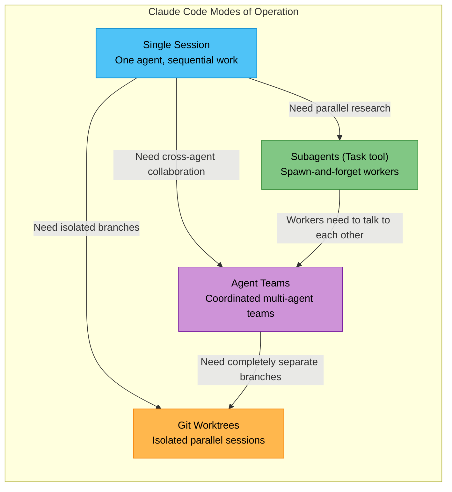
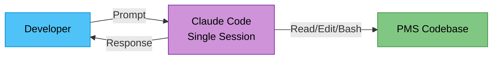
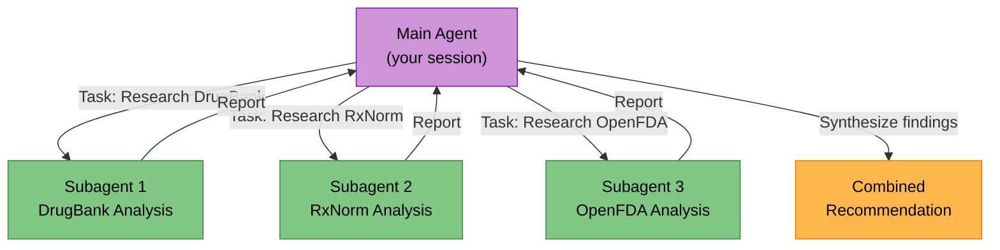
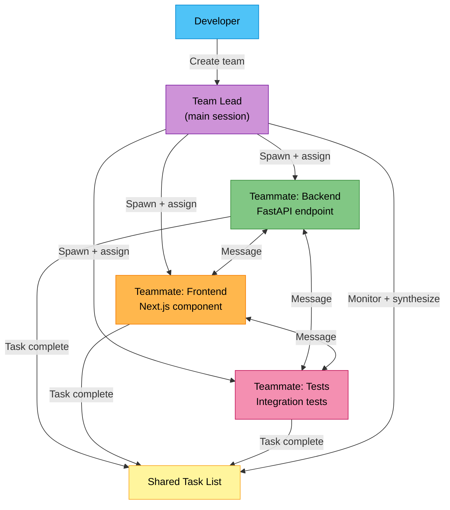
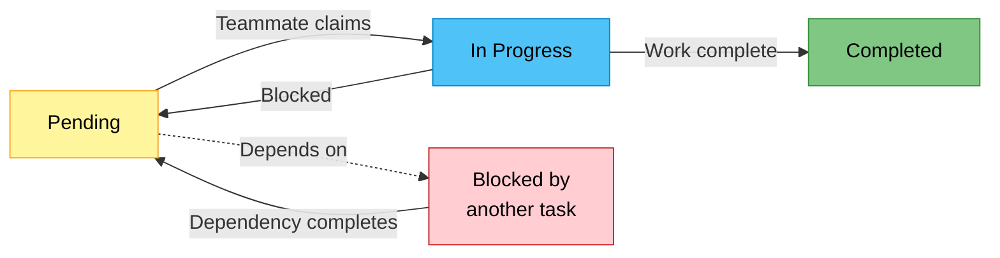
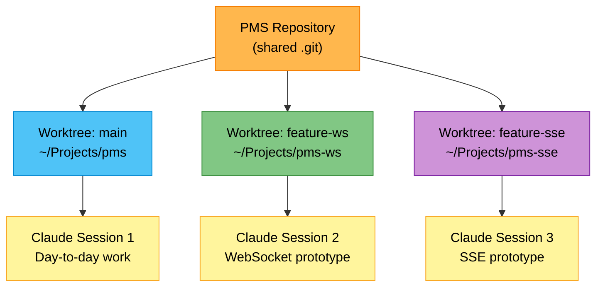
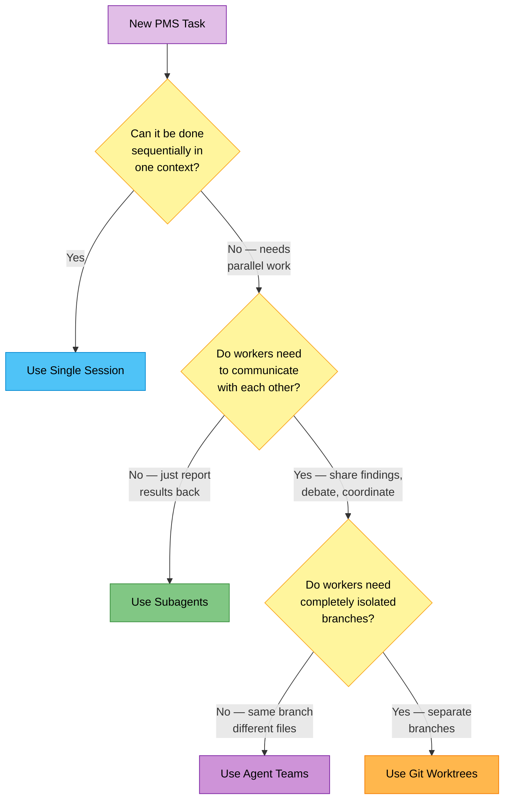

# Claude Code Multi-Agent Modes of Operation — PMS Developer Tutorial

**Welcome to the MPS PMS Multi-Agent Development Guide**

This tutorial explores the four distinct modes of operating Claude Code for PMS development — from a single session to full agent teams. You will learn when each mode shines, try each one with PMS-specific tasks, and build a mental framework for choosing the right approach for any clinical software engineering task.

**Document ID:** PMS-EXP-AGENTTEAMS-001
**Version:** 1.0
**Date:** 2026-02-20
**Applies To:** PMS project (all platforms)
**Prerequisite:** Claude Code installed, PMS repository cloned, familiarity with PMS architecture
**Estimated time:** 2-3 hours
**Difficulty:** Intermediate

---

## What You Will Learn

1. The four modes of operating Claude Code: Single Session, Subagents, Agent Teams, and Git Worktrees
2. How subagents differ from agent teams in architecture, communication, and cost
3. How to enable and configure Claude Code Agent Teams (experimental feature)
4. In-process vs split-pane display modes for agent teams
5. How the shared task list, mailbox, and team lead coordinate multi-agent work
6. PMS-specific scenarios for each mode — clinical workflows, cross-layer features, debugging
7. Token cost implications and how to optimize spend across modes
8. Best practices for avoiding file conflicts, sizing tasks, and steering agent work
9. Known limitations and workarounds for the experimental agent teams feature
10. A decision matrix for selecting the right mode for any PMS development task

---

## Part 1: Understanding the Four Modes (20 min read)

### 1.1 Why Multiple Modes Exist

PMS development spans four platforms (FastAPI backend, Next.js frontend, Android app, PostgreSQL database) and touches sensitive clinical workflows governed by HIPAA. Not every task has the same structure:

- **Sequential tasks** (fix a bug in one file) need focused, single-agent attention
- **Parallel-but-independent tasks** (research three libraries) benefit from concurrent workers that report back
- **Collaborative tasks** (implement a feature across backend + frontend + tests) need agents that talk to each other
- **Isolated experiments** (prototype two competing approaches) need completely separate working directories

Claude Code provides a mode for each of these patterns. Choosing the wrong mode wastes tokens, creates file conflicts, or leaves coordination gaps.

### 1.2 Mode Overview



### 1.3 Side-by-Side Comparison

| Dimension | Single Session | Subagents | Agent Teams | Git Worktrees |
|-----------|---------------|-----------|-------------|---------------|
| **Agents** | 1 | 1 main + N workers | 1 lead + N teammates | N independent sessions |
| **Context** | One shared context | Workers get own context, report back | Each teammate has own context | Completely separate |
| **Communication** | N/A | Worker → Main only | Teammate ↔ Teammate + Lead | None (manual) |
| **Coordination** | Sequential | Main manages all | Shared task list, self-claim | Developer manages |
| **File safety** | No conflicts | Workers are read-heavy | Risk of conflicts if not partitioned | Full isolation (separate worktrees) |
| **Token cost** | Baseline (1x) | ~1.2-1.5x | ~2-3x | Nx (independent sessions) |
| **Setup** | None | None (built-in) | Enable experimental flag | `git worktree add` |
| **Best for** | Simple edits, bugs | Focused research, file reads | Cross-layer features, reviews | Competing prototypes, risky experiments |

### 1.4 Key Vocabulary

| Term | Meaning |
|------|---------|
| **Single Session** | Standard Claude Code usage — one agent, one context window, sequential tool calls |
| **Subagent** | A child agent spawned via the `Task` tool; runs in its own context, returns a result, then terminates |
| **Agent Team** | A coordinated group of Claude Code instances with a shared task list and direct messaging |
| **Team Lead** | The main session that creates the team, spawns teammates, assigns tasks, and synthesizes results |
| **Teammate** | A separate Claude Code instance spawned by the lead; works independently, can message other teammates |
| **Shared Task List** | A file-locked task list that all team members can read, claim from, and update |
| **Mailbox** | Messaging system for agent-to-agent communication within a team |
| **Git Worktree** | A separate working directory linked to the same Git repository, with its own branch and file state |
| **In-Process Mode** | Agent team display where all teammates run inside the main terminal; navigate with Shift+Down |
| **Split-Pane Mode** | Agent team display where each teammate gets its own tmux or iTerm2 pane |
| **Spawn Prompt** | The initial instructions given to a teammate when it is created |
| **Plan Approval** | A workflow where teammates must submit plans to the lead for approval before implementing |

---

## Part 2: Mode 1 — Single Session (10 min)

### 2.1 When to Use

The single session is the default and most efficient mode. Use it for:

- Bug fixes in a single file or module
- Small feature additions with clear requirements
- Code reviews of a specific PR
- Writing or updating documentation
- Database migrations
- Any task where parallel work adds no value

**PMS Example:** Fixing a validation bug in the `/api/prescriptions` endpoint where the dose field accepts negative values.

### 2.2 How It Works



One context window. All tool calls are sequential. Claude reads files, reasons about them, edits them, runs tests — all in order. This is the most token-efficient mode because there is no coordination overhead.

### 2.3 PMS Hands-On Exercise

Try this single-session task:

```
Fix the validation in app/routers/prescriptions.py so that the dose field
rejects values <= 0. Add a unit test for the fix in tests/test_prescriptions.py.
```

Observe how Claude:
1. Reads the router file to understand the current validation
2. Reads the test file to understand existing test patterns
3. Edits the router to add the validation
4. Edits the test file to add the new test
5. Runs the test to verify

All sequential, all in one context. No need for parallelism here.

### 2.4 Strengths and Limits

**Strengths:** Lowest token cost, no setup, no coordination overhead, no file conflict risk.

**Limits:** Cannot parallelize. Long tasks may hit context window limits. Complex multi-file changes become a long sequential chain.

---

## Part 3: Mode 2 — Subagents (Task Tool) (15 min)

### 3.1 When to Use

Subagents are the first step up from a single session. Use them when:

- You need to research multiple topics in parallel (e.g., evaluating three libraries)
- You want to read and analyze many files without polluting the main context
- You need focused workers that report back a result — and nothing else
- Workers do not need to communicate with each other

**PMS Example:** Researching how three different drug interaction databases (DrugBank, RxNorm, OpenFDA) could integrate with the PMS Medication API.

### 3.2 How It Works



Key properties:
- Each subagent gets its **own context window** — the main context stays clean
- Subagents **cannot talk to each other** — they only report results back to the main agent
- Multiple subagents can run **in parallel** (launched in the same message)
- When a subagent finishes, its result is summarized back to the main context
- Subagents are created via the `Task` tool with a `subagent_type` parameter

### 3.3 PMS Hands-On Exercise

Try launching parallel subagents for a PMS research task:

```
I need to evaluate three approaches for adding real-time notifications
to the PMS. Research these in parallel using subagents:

1. WebSockets via FastAPI's built-in WebSocket support
2. Server-Sent Events (SSE) for one-way notifications
3. Firebase Cloud Messaging for the Android app

For each, tell me: setup complexity, HIPAA implications, latency
characteristics, and how it integrates with our FastAPI :8000 backend.
```

Observe how Claude launches three Task tool calls in a single message. Each subagent researches independently and reports back. The main agent then synthesizes the findings into a recommendation.

### 3.4 What Subagents Cannot Do

- **No peer communication:** Subagent 1 cannot ask Subagent 2 a question. If one subagent's findings depend on another's, the main agent must mediate.
- **No shared task list:** There is no coordination mechanism. The main agent is solely responsible for dividing work.
- **No persistence:** A subagent terminates after reporting its result. It cannot be resumed or redirected.
- **No file editing (typically):** Subagents are best used for research, not for writing code to the same files in parallel (conflict risk).

### 3.5 Cost Profile

Subagents add ~20-50% token overhead vs. a single session doing the same work sequentially, because:
- Each subagent loads project context (CLAUDE.md, etc.) into its own window
- Results are summarized when returned to the main agent
- But: no coordination messages, no idle/wake cycles, no task list overhead

---

## Part 4: Mode 3 — Agent Teams (30 min)

### 4.1 When to Use

Agent teams are for complex, collaborative tasks where agents need to **communicate with each other**, not just report to a central controller. Use them when:

- Implementing a feature that spans backend, frontend, and tests — each owned by a different agent
- Running a parallel code review where reviewers should challenge each other's findings
- Debugging with competing hypotheses where investigators should try to disprove each other
- Any task where the quality of the output depends on agents sharing context and debating

**PMS Example:** Implementing a new "Patient Discharge Summary" feature that requires a new FastAPI endpoint, a Next.js summary view, updated Android offline cache logic, and integration tests — all developed in parallel by different teammates.

### 4.2 How It Works



### 4.3 Architecture Components

| Component | Location | Purpose |
|-----------|----------|---------|
| **Team Lead** | Your main Claude Code session | Creates team, spawns teammates, assigns tasks, synthesizes results |
| **Teammates** | Separate Claude Code instances | Independent workers with full tool access |
| **Task List** | `~/.claude/tasks/{team-name}/` | Shared file-locked task list; agents claim and complete tasks |
| **Mailbox** | Internal messaging system | Teammates send messages to each other and the lead |
| **Team Config** | `~/.claude/teams/{team-name}/config.json` | Team membership, agent IDs, agent types |

### 4.4 Enabling Agent Teams

Agent teams are **experimental and disabled by default**. Enable them:

**Option A: Environment variable**

```bash
export CLAUDE_CODE_EXPERIMENTAL_AGENT_TEAMS=1
```

**Option B: settings.json (persistent)**

Add to `~/.claude/settings.json`:

```json
{
  "env": {
    "CLAUDE_CODE_EXPERIMENTAL_AGENT_TEAMS": "1"
  }
}
```

### 4.5 Display Modes

Agent teams support two display modes for interacting with teammates:

#### In-Process Mode (Default)

All teammates run inside your main terminal. Navigate between them:

- **Shift+Down** — Cycle through teammates (wraps back to lead after last teammate)
- **Enter** — View a teammate's session
- **Escape** — Interrupt a teammate's current turn
- **Ctrl+T** — Toggle the shared task list
- **Type** — Send a message to the currently selected teammate

Works in any terminal. No extra setup required.

```bash
# Force in-process mode for a single session
claude --teammate-mode in-process
```

#### Split-Pane Mode

Each teammate gets its own terminal pane. You see all output simultaneously and click into any pane to interact directly.

**Requires:** tmux or iTerm2 with the `it2` CLI.

```bash
# Install tmux (macOS)
brew install tmux

# Or for iTerm2: install it2 CLI
# Then enable: iTerm2 → Settings → General → Magic → Enable Python API
```

Configure in `settings.json`:

```json
{
  "teammateMode": "tmux"
}
```

The default `"auto"` uses split panes if you are already inside a tmux session, and in-process otherwise.

#### Choosing a Display Mode

| Criteria | In-Process | Split-Pane |
|----------|-----------|------------|
| Terminal requirements | Any terminal | tmux or iTerm2 |
| Visibility | One teammate at a time | All teammates visible |
| Interaction | Shift+Down to navigate | Click into pane |
| Best for | Quick teams, remote SSH | Local development, monitoring |
| IDE support | Works in VS Code terminal | Not supported in VS Code terminal |

### 4.6 PMS Hands-On Exercise: Parallel Code Review

This is the recommended starting exercise for agent teams — it is read-only, so there is no risk of file conflicts:

```
Create an agent team to review the PMS Backend codebase for HIPAA compliance.
Spawn three reviewers:
- One focused on authentication and authorization (JWT handling, RBAC, session management)
- One checking data encryption (at rest, in transit, PHI field handling)
- One validating audit logging (what is logged, what is missing, log retention)
Have them each review and report findings. They should challenge each other's
findings and look for gaps the others missed.
```

**What to observe:**
1. The lead creates a team and spawns three teammates
2. Each teammate independently explores different parts of the codebase
3. Teammates send messages to each other when they find related issues
4. The lead synthesizes all findings into a unified report
5. Use Shift+Down to check each teammate's progress

### 4.7 PMS Hands-On Exercise: Cross-Layer Feature Implementation

Once comfortable with read-only teams, try a feature implementation:

```
Create an agent team to implement a "Patient Allergy Alert" banner.
Requirements:
- Backend teammate: Add GET /api/patients/{id}/allergies endpoint in FastAPI
- Frontend teammate: Add a red alert banner component in Next.js that appears
  when viewing a patient with known allergies
- Test teammate: Write integration tests for the endpoint and component

Require plan approval before any teammate makes changes.
Each teammate owns different files — no overlapping edits.
```

**Key points:**
- "Require plan approval" ensures the lead reviews each teammate's approach before they write code
- File ownership is explicit — backend touches `app/routers/`, frontend touches `src/components/`, tests touch `tests/`
- The test teammate should wait for the backend teammate to finish the endpoint before writing integration tests (task dependency)

### 4.8 Task Assignment and Coordination

The shared task list is the coordination backbone. Tasks have three states:



**Assignment models:**
- **Lead assigns:** Tell the lead which task goes to which teammate — useful for specialized roles
- **Self-claim:** After finishing a task, a teammate picks the next unassigned, unblocked task — useful for balanced workloads

**Task claiming uses file locking** to prevent race conditions when multiple teammates try to claim the same task simultaneously.

### 4.9 Communication Patterns

| Pattern | Command | Use Case |
|---------|---------|----------|
| **Message** | Lead messages one teammate | Redirect approach, give feedback, ask question |
| **Broadcast** | Lead messages all teammates | Share a decision that affects everyone |
| **Peer message** | Teammate messages another teammate | Share a finding, ask about an interface |
| **Idle notification** | Automatic when teammate finishes | Lead knows when to synthesize results |

**Cost warning:** Broadcasts scale with team size. A broadcast to 5 teammates costs 5x a single message. Use sparingly.

### 4.10 Quality Gates with Hooks

Use Claude Code hooks to enforce standards when teammates finish work:

**`TeammateIdle` hook** — runs when a teammate is about to go idle:
- Exit code 0: allow idle
- Exit code 2: send feedback and keep the teammate working

**`TaskCompleted` hook** — runs when a task is marked complete:
- Exit code 0: allow completion
- Exit code 2: prevent completion and send feedback

**PMS Example:** A hook that checks whether a completed backend task includes a corresponding test file:

```json
{
  "hooks": {
    "TaskCompleted": [
      {
        "command": "bash -c 'if echo \"$TASK_DESCRIPTION\" | grep -q \"backend\"; then git diff --name-only | grep -q \"tests/\" || exit 2; fi'",
        "message": "Backend tasks must include test files"
      }
    ]
  }
}
```

### 4.11 Shutting Down and Cleaning Up

Always clean up agent teams when done to avoid orphaned resources:

```
# Step 1: Ask each teammate to shut down
Ask the backend teammate to shut down
Ask the frontend teammate to shut down
Ask the test teammate to shut down

# Step 2: Clean up team resources
Clean up the team
```

**Important:** Always use the lead to clean up. Teammates should not run cleanup — their team context may not resolve correctly.

If tmux sessions persist:

```bash
tmux ls
tmux kill-session -t <session-name>
```

---

## Part 5: Mode 4 — Git Worktrees (15 min)

### 5.1 When to Use

Git worktrees provide **complete isolation** — separate working directories, separate branches, separate Claude Code sessions with zero shared state. Use them when:

- Prototyping two competing approaches to the same problem
- Working on a risky refactor that you might abandon
- Running a long task in the background while working on something else
- Needing to test changes on different branches simultaneously

**PMS Example:** Prototyping two competing architectures for the real-time notification system — one using WebSockets and one using SSE — on separate branches.

### 5.2 How It Works



Each worktree has its own:
- File system (edits don't affect other worktrees)
- Branch (each worktree checks out a different branch)
- Claude Code session (completely independent context)

They share:
- Git history (commits, tags, remotes)
- The `.git` directory (repository metadata)

### 5.3 Setup and Usage

```bash
# Create worktrees for two competing approaches
git worktree add ../pms-ws feature-websocket
git worktree add ../pms-sse feature-sse

# Start Claude Code in each worktree
# Terminal 1:
cd ../pms-ws
claude

# Terminal 2:
cd ../pms-sse
claude

# Or use the --worktree flag (creates worktree + starts Claude):
claude -w feature-websocket
claude -w feature-sse
```

### 5.4 PMS Hands-On Exercise

```bash
# Create a worktree to prototype a Gemma 3 integration
git worktree add ../pms-gemma3 experiment/gemma3-prototype

# Start Claude in the worktree
cd ../pms-gemma3
claude

# In Claude:
# "Set up Ollama with Gemma 3 4B and create a basic /api/ai/summarize
#  endpoint following the setup guide in docs/experiments/13-Gemma3-PMS-Developer-Setup-Guide.md"

# When done, either merge or discard:
git worktree remove ../pms-gemma3  # Discard
# OR
cd ../pms-gemma3 && git push origin experiment/gemma3-prototype  # Keep
```

### 5.5 Strengths and Limits

**Strengths:** Complete isolation, no file conflicts, can abandon experiments cleanly, sessions visible via `/resume`.

**Limits:** No coordination between sessions. No shared task list. Developer must manually merge results. Each session uses its own token budget independently.

---

## Part 6: Decision Framework (15 min)

### 6.1 The Decision Matrix

Use this flowchart to choose the right mode for any PMS task:



### 6.2 PMS Task → Mode Mapping

| PMS Task | Recommended Mode | Why |
|----------|-----------------|-----|
| Fix a validation bug in `/api/prescriptions` | Single Session | Single file, sequential, simple |
| Research three drug interaction databases | Subagents | Parallel research, no inter-agent communication needed |
| Review a PR for security, performance, and tests | Agent Teams | Reviewers should challenge each other's findings |
| Implement patient discharge summary (BE + FE + tests) | Agent Teams | Cross-layer, each teammate owns different files |
| Debug intermittent WebSocket disconnection | Agent Teams | Competing hypotheses — agents disprove each other |
| Prototype WebSocket vs SSE notification architecture | Git Worktrees | Need isolated branches for each approach |
| Write migration script for new medication table | Single Session | Sequential database work |
| Evaluate Gemma 3, MedGemma, and Llama for clinical NLP | Subagents | Three independent research tasks, report back |
| Implement MCP server + client + tests simultaneously | Agent Teams | Three layers that need to agree on interfaces |
| Refactor auth module (risky, might abandon) | Git Worktrees | Need safe isolation; can discard worktree |

### 6.3 Token Cost Guidance

| Mode | Relative Cost | When to Accept the Cost |
|------|--------------|------------------------|
| Single Session | 1x (baseline) | Default for everything simple |
| Subagents | ~1.2-1.5x | When parallel research saves wall-clock time |
| Agent Teams | ~2-3x | When collaboration quality justifies the spend |
| Git Worktrees | Nx (N independent) | When isolation is non-negotiable |

**Rule of thumb:** If the task would take you 30+ minutes in a single session, and it has naturally parallel components, the time savings from subagents or agent teams usually justify the token cost. For tasks under 10 minutes, stick with a single session.

---

## Part 7: Agent Teams — Advanced Patterns (15 min)

### 7.1 Plan-Approve-Implement Pattern

For high-risk PMS changes (anything touching patient data, medication logic, or auth), require plan approval:

```
Spawn a backend teammate to add renal dose adjustment logic to the
Medication Intelligence Module. Require plan approval before they make
any changes. Only approve plans that:
- Include input validation for GFR values
- Do not modify the existing prescription schema
- Include at least 3 unit tests for edge cases
```

The teammate submits a plan → the lead reviews against your criteria → approves or rejects with feedback → teammate revises or implements.

### 7.2 Specialist Team Pattern

Assign each teammate a specific role matching PMS platform expertise:

```
Create an agent team with four specialists:
- "backend": FastAPI expert — owns all files in app/routers/ and app/services/
- "frontend": Next.js expert — owns all files in src/components/ and src/lib/
- "android": Kotlin expert — owns all files in the android/ directory
- "qa": Testing expert — owns all files in tests/ and writes integration tests

Have them implement the Patient Allergy Alert feature.
Backend builds the API, frontend builds the UI, android adds the mobile view,
and QA writes tests for all three. QA should wait for the others to finish
before writing integration tests.
```

### 7.3 Adversarial Debugging Pattern

When tracking down a hard-to-reproduce PMS bug, spawn investigators with competing theories:

```
Users report that medication lists sometimes show stale data after a new
prescription is added. Spawn 4 agent teammates to investigate:
- One investigating the FastAPI cache invalidation logic
- One checking the PostgreSQL transaction isolation level
- One examining the Next.js client-side state management
- One reviewing the Redis cache TTL configuration

Have them talk to each other to try to disprove each other's theories,
like a scientific debate. Update findings in docs/bugs/ with whatever
consensus emerges.
```

The adversarial structure prevents anchoring bias — once one theory is explored, sequential investigation tends to confirm it rather than challenge it. Parallel, adversarial investigation produces more reliable root cause analysis.

### 7.4 Research-Then-Implement Pattern

Use a two-phase approach: first research in parallel, then implement based on the consensus:

```
Phase 1: Create a research team with 3 teammates to investigate how to
add barcode scanning for medication verification:
- One researching camera APIs for the Android app
- One researching barcode/NDC databases and lookup APIs
- One researching HIPAA implications of storing barcode scan images

Wait for all three to report before proceeding.

Phase 2: Based on the research findings, create an implementation team
to build the feature.
```

---

## Part 8: Known Limitations and Workarounds (10 min)

### 8.1 Current Limitations

Agent teams are **experimental**. Be aware of these constraints:

| Limitation | Impact | Workaround |
|-----------|--------|------------|
| No session resumption for in-process teammates | After `/resume`, lead may try to message dead teammates | Tell the lead to spawn new teammates |
| Task status can lag | Completed tasks may appear stuck, blocking dependents | Manually update task status or tell the lead to nudge |
| Shutdown can be slow | Teammates finish current tool call before stopping | Be patient; don't force-kill |
| One team per session | Cannot run two teams from the same lead | Clean up current team before starting a new one |
| No nested teams | Teammates cannot spawn their own teams | Use subagents within a teammate if deeper delegation is needed |
| Lead is fixed | Cannot promote a teammate to lead | Design team structure upfront |
| Permissions set at spawn | All teammates inherit the lead's permissions | Change individual teammate modes after spawning if needed |
| Split panes require tmux/iTerm2 | VS Code terminal, Windows Terminal, and Ghostty are not supported | Use in-process mode in those terminals |

### 8.2 Avoiding File Conflicts

The most common pitfall is two teammates editing the same file. Prevent this by:

1. **Explicit file ownership:** In the spawn prompt, state which directories each teammate owns
2. **Interface-first design:** Have teammates agree on interfaces (API contracts, component props) before implementing
3. **Sequential dependencies:** Use task dependencies so the backend finishes the endpoint before the frontend integrates with it
4. **Lead as arbiter:** If a conflict is detected, the lead should resolve it before proceeding

### 8.3 Handling Permission Prompts

Teammate permission requests bubble up to the lead, which can be noisy. Reduce friction:

```json
// In your permission settings, pre-approve common operations:
{
  "permissions": {
    "allow": [
      "Read",
      "Glob",
      "Grep",
      "Edit",
      "Write"
    ]
  }
}
```

Or for maximum speed (use cautiously):

```bash
claude --dangerously-skip-permissions
# All teammates inherit this setting
```

---

## Part 9: Practice Exercises (30 min)

### Exercise A: Subagent Research Sprint

**Goal:** Use subagents to research three HIPAA compliance topics in parallel.

```
Research these three topics in parallel using subagents:
1. HIPAA minimum necessary standard — what data fields in /api/patients
   should be restricted based on the requesting user's role?
2. HIPAA audit log requirements — what events must we log, and for how long?
3. HIPAA breach notification rules — what triggers a notification, and what
   are the timelines?

For each, provide specific recommendations for PMS implementation.
```

**What to observe:** Three subagents run concurrently. Each produces an independent report. The main agent synthesizes them into a unified HIPAA compliance checklist.

### Exercise B: Agent Team Code Review

**Goal:** Use an agent team for a multi-perspective code review.

```
Create an agent team to review the PMS medication module (app/routers/prescriptions.py
and app/services/medication_service.py). Spawn three reviewers:
- Security reviewer: check for injection, auth bypass, PHI exposure
- Clinical safety reviewer: check for medication logic errors, missing validations
- Performance reviewer: check for N+1 queries, missing indexes, slow paths

Have them discuss findings and create a prioritized issues list.
```

**What to observe:** Teammates discover issues independently, then cross-reference. The security reviewer might find that the clinical safety reviewer's suggested validation fix introduces a new injection vector. The debate improves the quality of the final recommendation.

### Exercise C: Git Worktree Prototype Race

**Goal:** Use git worktrees to prototype two competing designs.

```bash
# Create two worktrees
git worktree add ../pms-redis-cache experiment/redis-cache
git worktree add ../pms-inmemory-cache experiment/inmemory-cache

# In Terminal 1 (Redis approach):
cd ../pms-redis-cache && claude
# "Add Redis caching to /api/patients/{id} with 5-minute TTL"

# In Terminal 2 (In-memory approach):
cd ../pms-inmemory-cache && claude
# "Add in-memory LRU caching to /api/patients/{id} with 5-minute TTL"

# Compare the two approaches, then merge the winner
```

**What to observe:** Complete isolation. Each session writes different code to the same files without conflict. You can benchmark both approaches before choosing.

---

## Part 10: Quick Reference Card

### Mode Selection Cheat Sheet

| If your task... | Use... |
|----------------|--------|
| Is simple and sequential | **Single Session** |
| Needs parallel research, no agent-to-agent chat | **Subagents** |
| Needs agents to collaborate and debate | **Agent Teams** |
| Needs completely isolated branches | **Git Worktrees** |

### Agent Team Commands

| Action | How |
|--------|-----|
| Enable agent teams | `"CLAUDE_CODE_EXPERIMENTAL_AGENT_TEAMS": "1"` in settings.json |
| Create a team | "Create an agent team to..." (natural language to lead) |
| Cycle through teammates | **Shift+Down** (in-process mode) |
| View teammate session | **Enter** on selected teammate |
| Interrupt teammate | **Escape** while viewing teammate |
| Toggle task list | **Ctrl+T** |
| Force in-process mode | `claude --teammate-mode in-process` |
| Shut down teammate | "Ask the {name} teammate to shut down" |
| Clean up team | "Clean up the team" |

### Git Worktree Commands

| Action | Command |
|--------|---------|
| Create worktree | `git worktree add ../pms-feature feature-branch` |
| List worktrees | `git worktree list` |
| Remove worktree | `git worktree remove ../pms-feature` |
| Start Claude in worktree | `claude -w feature-branch` |

### Key Files

| File | Purpose |
|------|---------|
| `~/.claude/settings.json` | Agent team enable flag, teammate mode |
| `~/.claude/teams/{name}/config.json` | Team membership and agent IDs |
| `~/.claude/tasks/{name}/` | Shared task list |
| `CLAUDE.md` | Project context loaded by all teammates |

---

## Next Steps

1. **Start with a read-only exercise** — Use Exercise B (agent team code review) to get comfortable before trying implementation tasks
2. **Read the source document** — Review [14-agent-teams-claude-whitepaper.md](14-agent-teams-claude-whitepaper.md) for the full official documentation
3. **Experiment with team sizes** — Start with 2-3 teammates; add more only when you see clear benefit
4. **Combine modes** — A teammate within an agent team can spawn subagents for sub-tasks; a git worktree can host its own agent team
5. **Track token usage** — Compare costs across modes for similar tasks to build your own cost intuition
6. **Review the PMS Adaptive Thinking experiment** — [Experiment 08](08-PRD-AdaptiveThinking-PMS-Integration.md) covers effort-routing, which can complement agent teams by routing different complexity levels to different modes
