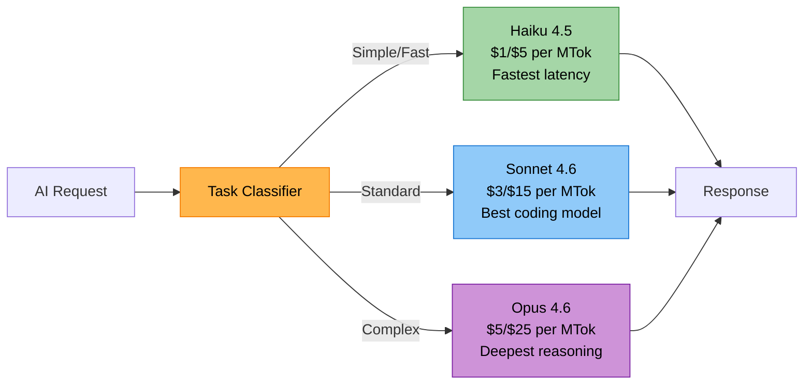
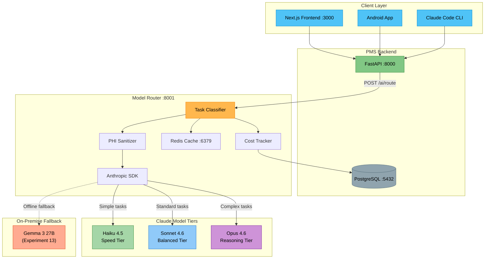

# Claude Model Selection Developer Onboarding Tutorial

**Welcome to the MPS PMS Claude Model Selection Integration Team**

This tutorial will take you from zero to building your first model-routed clinical AI pipeline with the PMS. By the end, you will understand how each Claude model tier performs, have a running Model Router, and have built and tested a cost-optimized clinical AI integration end-to-end.

**Document ID:** PMS-EXP-CLAUDEMODEL-002
**Version:** 1.0
**Date:** 2026-02-20
**Applies To:** PMS project (all platforms)
**Prerequisite:** [Claude Model Selection Setup Guide](15-ClaudeModelSelection-PMS-Developer-Setup-Guide.md)
**Estimated time:** 2-3 hours
**Difficulty:** Beginner-friendly

---

## What You Will Learn

1. Why different clinical tasks require different AI model tiers
2. How Claude Opus 4.6, Sonnet 4.6, and Haiku 4.5 compare on coding and reasoning benchmarks
3. How the Model Router classifies tasks and selects models
4. How PHI sanitization protects patient data before API calls
5. How to build a task-routed encounter summarization pipeline
6. How to add real-time medication interaction checking with model escalation
7. How response caching reduces cost and latency
8. How to monitor model usage, cost, and quality
9. When to use each model tier in clinical workflows
10. HIPAA compliance requirements for cloud AI in healthcare

---

## Part 1: Understanding Claude Model Selection (15 min read)

### 1.1 What Problem Does Model Selection Solve?

Imagine a busy PMS clinic generating 500+ AI requests per day. Some are simple — extracting a patient name from a form (takes 50 tokens, needs to be instant). Others are complex — evaluating whether adding clarithromycin to a warfarin regimen is safe (takes 2,000 tokens, needs deep pharmacological reasoning). Using the same model for both is wasteful:

- **Opus for everything:** The form extraction costs 5x more than necessary and is slower than it needs to be.
- **Haiku for everything:** The drug interaction analysis is dangerously inaccurate because Haiku lacks the reasoning depth.

Model selection solves this by **routing each request to the right model tier** — fast and cheap for simple tasks, powerful and thorough for complex clinical reasoning.

### 1.2 How Model Selection Works — The Three Tiers



**Haiku 4.5** — The speed specialist. Use for text extraction, classification, formatting, real-time alerts, and sub-agent tasks. Responds in < 200ms. Costs $1/$5 per million tokens. Extended thinking supported but no adaptive thinking.

**Sonnet 4.6** — The all-rounder. Scores 79.6% on SWE-bench (within 1.2 points of Opus). Preferred over the previous flagship Opus 4.5 by 59% of developers. Use for encounter summaries, code generation, medication checks, and report generation. Best price-performance ratio at $3/$15.

**Opus 4.6** — The deep thinker. Scores 91.3% on GPQA Diamond (17 points above Sonnet). 128K max output tokens. Use for clinical decision support, complex drug interactions, diagnostic differentials, security audits, and multi-agent orchestration. Worth the 5x premium when accuracy is critical.

### 1.3 How Model Selection Fits with Other PMS Technologies

| Technology | Experiment | Relationship to Model Selection |
|-----------|------------|--------------------------------|
| Gemma 3 | Exp 13 | On-premise model for zero-egress tasks; Model Router falls back to Gemma when offline |
| Adaptive Thinking | Exp 08 | Within-model effort control; Model Selection adds cross-model routing on top |
| MCP | Exp 09 | Tool-use protocol; Model Router decides which Claude model executes each MCP tool call |
| OpenClaw | Exp 05 | Agentic workflows; Opus orchestrates while sub-agents run on Sonnet/Haiku |
| Speechmatics Medical | Exp 10 | Speech-to-text pipeline; Haiku handles real-time transcription formatting |

### 1.4 Key Vocabulary

| Term | Meaning |
|------|---------|
| **Model Tier** | One of the three Claude intelligence levels: Opus, Sonnet, Haiku |
| **Task Classifier** | Component that maps an AI request to the appropriate model tier |
| **PHI Sanitizer** | Module that replaces Protected Health Information with tokens before API calls |
| **Model Router** | The FastAPI service that orchestrates classification, sanitization, and API calls |
| **SWE-bench** | Software Engineering Benchmark — measures real-world coding ability |
| **GPQA Diamond** | Graduate-level science reasoning benchmark |
| **Extended Thinking** | Feature allowing the model to "think" internally before responding (all tiers) |
| **Adaptive Thinking** | Dynamic effort control — model adjusts reasoning depth (Opus and Sonnet only) |
| **Prompt Caching** | Anthropic feature that caches repeated prompt prefixes for cost savings |
| **Batch API** | Asynchronous processing at 50% cost reduction for non-urgent tasks |
| **BAA** | Business Associate Agreement — HIPAA-required contract with cloud AI vendors |
| **MTok** | Million tokens — the unit for Claude API pricing |

### 1.5 Our Architecture



---

## Part 2: Environment Verification (15 min)

### 2.1 Checklist

Run each command and verify the expected output:

1. **Model Router running:**
   ```bash
   curl -s http://localhost:8001/health
   # Expected: {"status":"ok","service":"pms-model-router"}
   ```

2. **All three models accessible:**
   ```bash
   curl -s http://localhost:8001/ai/models | python3 -m json.tool
   # Expected: JSON with opus, sonnet, haiku model IDs and pricing
   ```

3. **Redis running:**
   ```bash
   redis-cli ping
   # Expected: PONG
   ```

4. **PMS backend running:**
   ```bash
   curl -s http://localhost:8000/docs | head -1
   # Expected: HTML content
   ```

5. **Anthropic API key valid:**
   ```bash
   curl -s -X POST http://localhost:8001/ai/route \
     -H "Content-Type: application/json" \
     -d '{"task_type": "simple_summary", "prompt": "Say hello", "max_tokens": 20}'
   # Expected: JSON response with content, model_tier: "haiku"
   ```

### 2.2 Quick Test

Send one request per tier and compare:

```bash
# Haiku — should be fastest and cheapest
time curl -s -X POST http://localhost:8001/ai/route \
  -H "Content-Type: application/json" \
  -d '{"task_type": "text_extraction", "prompt": "Extract the medication name: The patient was prescribed lisinopril 10mg daily.", "max_tokens": 50}'

# Sonnet — should be moderate speed, moderate cost
time curl -s -X POST http://localhost:8001/ai/route \
  -H "Content-Type: application/json" \
  -d '{"task_type": "encounter_summary", "prompt": "Summarize: 45yo M presents with chest pain, troponin negative, EKG normal sinus. Discharged with cardiology follow-up.", "max_tokens": 200}'

# Opus — should be slowest but most thorough
time curl -s -X POST http://localhost:8001/ai/route \
  -H "Content-Type: application/json" \
  -d '{"task_type": "clinical_decision_support", "prompt": "Evaluate adding methotrexate to a patient on warfarin and lisinopril for new rheumatoid arthritis diagnosis.", "max_tokens": 1000}'
```

Verify that each request was routed to the correct tier by checking `model_tier` in the response.

---

## Part 3: Build Your First Integration (45 min)

### 3.1 What We Are Building

A **multi-tier clinical encounter processor** that:
1. Uses **Haiku** to extract structured data from raw encounter notes (fast, cheap)
2. Uses **Sonnet** to generate a SOAP summary from the structured data (balanced)
3. Optionally escalates to **Opus** if the encounter involves complex multi-drug interactions (deep reasoning)

This mirrors a real clinical workflow: triage → summarize → escalate.

### 3.2 Create the Pipeline Script

```python
# tutorial_pipeline.py
"""
Multi-tier clinical encounter processing pipeline.
Demonstrates Haiku → Sonnet → Opus escalation.
"""
import httpx
import asyncio
import json

ROUTER_URL = "http://localhost:8001/ai/route"


async def ai_request(task_type: str, prompt: str, system: str = None, max_tokens: int = 1000) -> dict:
    async with httpx.AsyncClient(timeout=120.0) as client:
        payload = {
            "task_type": task_type,
            "prompt": prompt,
            "max_tokens": max_tokens,
        }
        if system:
            payload["system_prompt"] = system
        resp = await client.post(ROUTER_URL, json=payload)
        resp.raise_for_status()
        return resp.json()


async def process_encounter(raw_note: str):
    total_cost = 0.0
    print("=" * 60)
    print("MULTI-TIER ENCOUNTER PROCESSING PIPELINE")
    print("=" * 60)

    # --- Step 1: Haiku — Extract structured data ---
    print("\n[STEP 1] Haiku 4.5 → Structured Data Extraction")
    extraction = await ai_request(
        task_type="text_extraction",
        prompt=f"""Extract the following fields from this encounter note as JSON:
- patient_age, patient_sex
- chief_complaint
- vitals (dict)
- medications (list)
- diagnoses (list)
- plan (list)

Note: {raw_note}""",
        system="Return only valid JSON. No explanation.",
        max_tokens=500,
    )
    print(f"  Model: {extraction['model_used']} ({extraction['model_tier']})")
    print(f"  Latency: {extraction['latency_ms']:.0f}ms | Cost: ${extraction['cost_usd']:.6f}")
    print(f"  Extracted:\n{extraction['content'][:300]}...")
    total_cost += extraction["cost_usd"]

    # --- Step 2: Sonnet — Generate SOAP summary ---
    print("\n[STEP 2] Sonnet 4.6 → SOAP Summary")
    summary = await ai_request(
        task_type="encounter_summary",
        prompt=f"""Generate a clinical SOAP note from this structured data:

{extraction['content']}

Original note for context: {raw_note}""",
        system="You are a clinical documentation specialist. Write a concise, professional SOAP note.",
        max_tokens=1000,
    )
    print(f"  Model: {summary['model_used']} ({summary['model_tier']})")
    print(f"  Latency: {summary['latency_ms']:.0f}ms | Cost: ${summary['cost_usd']:.6f}")
    print(f"  Summary:\n{summary['content'][:400]}...")
    total_cost += summary["cost_usd"]

    # --- Step 3: Check if escalation to Opus is needed ---
    structured = json.loads(extraction["content"]) if extraction["content"].strip().startswith("{") else {}
    medications = structured.get("medications", [])

    if len(medications) >= 3:
        print("\n[STEP 3] Opus 4.6 → Drug Interaction Analysis (escalated)")
        interaction = await ai_request(
            task_type="drug_interaction_complex",
            prompt=f"""Perform a comprehensive drug interaction analysis for this patient:

Medications: {json.dumps(medications)}
Patient context: {raw_note}

Evaluate:
1. Drug-drug interactions (with severity ratings)
2. CYP450 pathway conflicts
3. Renal/hepatic dose adjustments needed
4. Monitoring recommendations
5. Safer alternatives if interactions are severe""",
            system="You are a clinical pharmacology expert. Be thorough and evidence-based.",
            max_tokens=2000,
        )
        print(f"  Model: {interaction['model_used']} ({interaction['model_tier']})")
        print(f"  Latency: {interaction['latency_ms']:.0f}ms | Cost: ${interaction['cost_usd']:.6f}")
        print(f"  Analysis:\n{interaction['content'][:500]}...")
        total_cost += interaction["cost_usd"]
    else:
        print("\n[STEP 3] Skipped — fewer than 3 medications, no escalation needed")

    print(f"\n{'=' * 60}")
    print(f"TOTAL PIPELINE COST: ${total_cost:.6f}")
    print(f"{'=' * 60}")


# Example encounter note
SAMPLE_NOTE = """
45-year-old male presents with productive cough x 5 days, fever to 101.4F,
and right-sided pleuritic chest pain. PMH: atrial fibrillation on warfarin 5mg daily,
hypertension on lisinopril 20mg, type 2 diabetes on metformin 1000mg BID.
Vitals: BP 138/88, HR 92, T 101.4F, SpO2 94% on RA.
CXR: Right lower lobe consolidation. Labs: WBC 14.2, procalcitonin 1.8.
Assessment: Community-acquired pneumonia, right lower lobe.
Plan: Start levofloxacin 750mg daily x 5 days, check INR in 3 days
(fluoroquinolone-warfarin interaction), continue home medications,
follow-up in 1 week.
"""

asyncio.run(process_encounter(SAMPLE_NOTE))
```

### 3.3 Run the Pipeline

```bash
cd pms-model-router
source .venv/bin/activate
python tutorial_pipeline.py
```

### 3.4 Analyze the Results

You should see output like:

```
============================================================
MULTI-TIER ENCOUNTER PROCESSING PIPELINE
============================================================

[STEP 1] Haiku 4.5 → Structured Data Extraction
  Model: claude-haiku-4-5-20251001 (haiku)
  Latency: 342ms | Cost: $0.000180
  Extracted: {"patient_age": 45, "patient_sex": "male", ...

[STEP 2] Sonnet 4.6 → SOAP Summary
  Model: claude-sonnet-4-6 (sonnet)
  Latency: 1205ms | Cost: $0.001350
  Summary: **Subjective:** 45-year-old male with 5-day history of ...

[STEP 3] Opus 4.6 → Drug Interaction Analysis (escalated)
  Model: claude-opus-4-6 (opus)
  Latency: 4521ms | Cost: $0.008200
  Analysis: ## Drug Interaction Analysis ...

============================================================
TOTAL PIPELINE COST: $0.009730
============================================================
```

Key observations:
- **Haiku** handled extraction in ~300ms for < $0.001 — fast and cheap
- **Sonnet** generated a quality SOAP note for ~$0.001 — great value
- **Opus** was engaged only because 3+ medications triggered escalation — expensive but worth it for pharmacological accuracy
- **Total cost** is ~$0.01 — if we had used Opus for all three steps, it would have been ~$0.03 (3x more)

### 3.5 Modify the Pipeline

Try changing the sample note to have fewer medications (remove the diabetes/hypertension history). The pipeline should skip Step 3 entirely, showing the cost savings of intelligent routing.

### 3.6 Add Caching

Run the pipeline twice. The second run should show `cached: true` for repeated requests with dramatically lower latency.

---

## Part 4: Evaluating Strengths and Weaknesses (15 min)

### 4.1 Strengths

| Strength | Details |
|----------|---------|
| **Best-in-class coding** | Sonnet 4.6 scores 79.6% on SWE-bench — within 1.2 points of Opus. For most PMS coding tasks, Sonnet is indistinguishable from Opus. |
| **Cost optimization** | Intelligent routing achieves 60-70% cost reduction versus uniform Opus usage. Haiku is 5x cheaper than Opus for simple tasks. |
| **Unified SDK** | Single `anthropic` Python SDK covers all three models. No separate integrations needed. |
| **Extended thinking** | All three tiers support extended thinking for complex reasoning chains. |
| **1M context window** | Opus 4.6 and Sonnet 4.6 support up to 1M tokens (beta) — ideal for large codebase analysis or lengthy medical records. |
| **HIPAA pathway** | Anthropic offers Enterprise BAAs. AWS Bedrock and GCP Vertex AI provide additional HIPAA-compliant deployment options. |
| **Streaming support** | All models support SSE streaming for real-time response display in the PMS frontend. |

### 4.2 Weaknesses

| Weakness | Details |
|----------|---------|
| **Cloud dependency** | All inference requires internet connectivity to Anthropic's API. No offline mode. |
| **PHI exposure risk** | Unlike self-hosted Gemma 3 (Exp 13), PHI must be sanitized before transmission — adds complexity and risk. |
| **Cost at scale** | Even with routing, a high-volume clinic can spend $1,000-3,000/month on API calls. Self-hosted models have fixed infrastructure costs. |
| **Rate limits** | Anthropic imposes per-model rate limits that may throttle busy clinics during peak hours. |
| **No fine-tuning** | Claude models cannot be fine-tuned on clinic-specific data (unlike open-weight Gemma 3). |
| **Opus latency** | Opus 4.6 has moderate latency (2-10 seconds typical) — not suitable for real-time UI interactions. |
| **Model deprecation** | Anthropic periodically deprecates models (e.g., Haiku 3 retiring April 2026). Requires ongoing migration planning. |

### 4.3 When to Use Claude vs Alternatives

| Scenario | Recommended | Why |
|----------|-------------|-----|
| Complex clinical reasoning | Claude Opus 4.6 | 91.3% GPQA Diamond — highest reasoning accuracy |
| General clinical AI (summaries, coding) | Claude Sonnet 4.6 | Best price-performance, 79.6% SWE-bench |
| High-volume real-time tasks | Claude Haiku 4.5 | Fastest latency, lowest cost |
| Zero-data-egress required | Gemma 3 (Exp 13) | Self-hosted, PHI never leaves network |
| Offline / air-gapped deployment | Gemma 3 (Exp 13) | No internet required |
| Domain-specific fine-tuning | Gemma 3 + LoRA (Exp 13) | Open-weight, supports QLoRA |
| Budget < $100/month | Gemma 3 (Exp 13) | Fixed infrastructure cost |
| Agent orchestration | Claude Opus 4.6 | Best multi-step planning and tool use |
| Sub-agent tasks in a team | Claude Haiku 4.5 | Fast, cheap, focused execution |

### 4.4 HIPAA / Healthcare Considerations

| Requirement | Status | How to Comply |
|-------------|--------|---------------|
| Business Associate Agreement | Required | Anthropic Enterprise plan, or AWS Bedrock / GCP Vertex AI with BAAs |
| PHI in transit encryption | Supported | TLS 1.3 enforced by Anthropic API |
| Zero data retention | Available | Enterprise plan includes zero-retention guarantee; Anthropic does not train on API data |
| Audit logging | Must implement | Log every AI request with user ID, timestamp, task type, model used (PHI-stripped) |
| Access control | Must implement | RBAC on frontend; service-to-service auth on Model Router |
| PHI minimization | Must implement | PHI Sanitizer strips identifiers before API calls; rehydrates on response |
| Breach notification | Contractual | Covered under BAA terms |

**Critical:** The free, Pro, Max, and Team plans do **not** support HIPAA compliance. Only the sales-assisted Enterprise plan with a signed BAA is HIPAA-eligible.

---

## Part 5: Debugging Common Issues (15 min read)

### Issue 1: Wrong Model Selected

**Symptoms:** A complex drug interaction query was routed to Haiku instead of Opus.
**Cause:** The `task_type` enum was set to `medication_check` (Sonnet) instead of `drug_interaction_complex` (Opus).
**Fix:** Review the task classifier mapping in `app/classifier.py`. Use the correct `TaskType` enum value. Add `model_override: "opus"` for manual escalation.

### Issue 2: PHI Detected in Outbound Logs

**Symptoms:** Audit logs show patient SSNs in API request payloads.
**Cause:** PHI Sanitizer regex missed a pattern, or `PHI_SANITIZATION_ENABLED` was set to `false`.
**Fix:** Verify `.env` has `PHI_SANITIZATION_ENABLED=true`. Add missing PHI patterns to `PHI_PATTERNS` in `app/phi_sanitizer.py`. Run the sanitizer unit tests.

### Issue 3: Budget Exceeded

**Symptoms:** Cost Tracker reports daily spend exceeding `DAILY_BUDGET_USD`.
**Cause:** A batch of Opus requests with extended thinking consumed more tokens than expected.
**Fix:** Set `thinking_budget_tokens` to a lower value (e.g., 5000). Review which tasks are routing to Opus and consider downgrading some to Sonnet. Enable batch API for non-urgent tasks (50% discount).

### Issue 4: Cache Returning Stale Results

**Symptoms:** Updated patient data returns the old AI summary.
**Cause:** Redis cache TTL is too long for the task type.
**Fix:** Reduce TTL for clinical tasks (e.g., 60 seconds for encounter summaries). Add cache invalidation when patient records are updated. Use `use_cache: false` for time-sensitive requests.

### Issue 5: Extended Thinking Errors

**Symptoms:** `Error: budget_tokens must be less than max_tokens`.
**Cause:** `thinking_budget_tokens` (10000) exceeds `max_tokens` (4096).
**Fix:** Ensure `max_tokens >= budget_tokens + 1000`. For extended thinking tasks, set `max_tokens` to at least 12000.

### Reading Logs

```bash
# Model Router logs
docker compose logs -f model-router | grep "ERROR"

# Redis cache hits/misses
redis-cli MONITOR | grep "GET\|SET"

# Anthropic API response headers (rate limit info)
curl -v -X POST http://localhost:8001/ai/route \
  -H "Content-Type: application/json" \
  -d '{"task_type": "simple_summary", "prompt": "test"}' 2>&1 | grep -i "x-ratelimit"
```

---

## Part 6: Practice Exercise (45 min)

### Option A: Build a Smart Triage Router

Build a two-stage pipeline:
1. **Haiku** classifies an incoming clinical message as `urgent`, `routine`, or `administrative`
2. Based on the classification, route to the appropriate model:
   - `urgent` → Opus (thorough clinical analysis)
   - `routine` → Sonnet (standard processing)
   - `administrative` → Haiku (fast response)

**Hints:**
- Create a new `triage_pipeline.py`
- First call uses `task_type: "classification"` (routes to Haiku)
- Parse Haiku's classification response
- Second call uses the appropriate task type based on urgency

### Option B: Build a Cost Comparison Dashboard

Create a script that sends the same clinical prompt to all three model tiers and compares:
- Response quality (you evaluate manually)
- Latency (measured automatically)
- Cost (from the response metadata)
- Token usage (input/output)

**Hints:**
- Use `model_override` to force each tier
- Create a markdown table of results
- Run on 5 different clinical scenarios
- Calculate the "quality per dollar" ratio

### Option C: Build a Streaming Encounter Assistant

Modify the Model Router to support SSE streaming and build a frontend component that:
1. Shows a typing indicator while the model responds
2. Streams text token-by-token
3. Displays the model tier badge (Haiku/Sonnet/Opus) and running cost as the response generates

**Hints:**
- Use `anthropic_client.messages.stream()` instead of `.create()`
- FastAPI `StreamingResponse` with `media_type="text/event-stream"`
- Frontend uses `EventSource` or `fetch` with `ReadableStream`

---

## Part 7: Development Workflow and Conventions

### 7.1 File Organization

```
pms-model-router/
├── app/
│   ├── __init__.py
│   ├── main.py              # FastAPI application and route handlers
│   ├── config.py             # Settings from environment
│   ├── classifier.py         # TaskType → ModelTier mapping
│   ├── phi_sanitizer.py      # PHI detection and tokenization
│   ├── cost_tracker.py       # Usage tracking and budget enforcement
│   └── cache.py              # Redis cache operations
├── tests/
│   ├── test_classifier.py    # Task classification unit tests
│   ├── test_sanitizer.py     # PHI sanitization tests
│   ├── test_routing.py       # Integration tests for model routing
│   └── test_cost.py          # Cost calculation tests
├── .env                      # Local environment (never commit)
├── .env.example              # Template for environment variables
├── Dockerfile
├── docker-compose.yml
├── requirements.txt
└── README.md
```

### 7.2 Naming Conventions

| Item | Convention | Example |
|------|-----------|---------|
| Task types | SCREAMING_SNAKE_CASE enum | `ENCOUNTER_SUMMARY` |
| Model tiers | lowercase enum | `opus`, `sonnet`, `haiku` |
| API endpoints | lowercase with slashes | `/ai/route`, `/ai/models` |
| Environment vars | SCREAMING_SNAKE_CASE | `CLAUDE_OPUS_MODEL` |
| Python modules | snake_case | `phi_sanitizer.py` |
| Test files | `test_` prefix | `test_classifier.py` |
| Config keys | snake_case | `daily_budget_usd` |

### 7.3 PR Checklist

- [ ] All three model tiers tested (Haiku, Sonnet, Opus)
- [ ] PHI Sanitizer covers any new data patterns
- [ ] Cost calculations verified against [official pricing](https://platform.claude.com/docs/en/about-claude/pricing)
- [ ] No API keys or secrets in committed code
- [ ] Task classifier mapping updated if new task types added
- [ ] Redis cache TTL appropriate for new task types
- [ ] Integration tests pass against all three models
- [ ] Budget limits not exceeded in test scenarios
- [ ] Extended thinking `budget_tokens` validated against `max_tokens`

### 7.4 Security Reminders

- **Never commit API keys.** Use `.env` files excluded via `.gitignore`.
- **Always sanitize PHI** before any outbound API call. Run `PHISanitizer` even for internal logging.
- **Pin model IDs** in production (e.g., `claude-haiku-4-5-20251001`) to prevent unexpected behavior from model updates.
- **Log everything, log no PHI.** Audit logs record task type, model used, token count, cost — but never raw prompts containing patient data.
- **Rotate API keys** quarterly. Use HashiCorp Vault or AWS Secrets Manager in production.
- **Test BAA coverage** before any production deployment. Verify your plan level includes HIPAA-ready features.

---

## Part 8: Quick Reference Card

### Key Commands

```bash
# Start Model Router
docker compose up -d

# Health check
curl http://localhost:8001/health

# Route a request
curl -X POST http://localhost:8001/ai/route \
  -H "Content-Type: application/json" \
  -d '{"task_type": "encounter_summary", "prompt": "..."}'

# List models
curl http://localhost:8001/ai/models

# Flush cache
redis-cli FLUSHDB

# View logs
docker compose logs -f model-router
```

### Key Files

| File | Purpose |
|------|---------|
| `app/main.py` | FastAPI routes and Anthropic SDK calls |
| `app/classifier.py` | Task → Model mapping rules |
| `app/phi_sanitizer.py` | PHI tokenization and rehydration |
| `app/config.py` | Environment-based settings |
| `.env` | API keys and configuration (never commit) |

### Model Quick Reference

| | Opus 4.6 | Sonnet 4.6 | Haiku 4.5 |
|-|----------|------------|-----------|
| **ID** | `claude-opus-4-6` | `claude-sonnet-4-6` | `claude-haiku-4-5-20251001` |
| **Cost** | $5/$25 MTok | $3/$15 MTok | $1/$5 MTok |
| **Context** | 200K (1M beta) | 200K (1M beta) | 200K |
| **Max Output** | 128K | 64K | 64K |
| **SWE-bench** | 80.8% | 79.6% | ~49% |
| **Speed** | Moderate | Fast | Fastest |

### Starter Template

```python
import anthropic

client = anthropic.Anthropic()

# Quick model test
for model_id in ["claude-haiku-4-5-20251001", "claude-sonnet-4-6", "claude-opus-4-6"]:
    resp = client.messages.create(
        model=model_id,
        max_tokens=100,
        messages=[{"role": "user", "content": "Hello!"}],
    )
    print(f"{model_id}: {resp.content[0].text}")
```

---

## Next Steps

1. **Complete the Setup Guide** — [Claude Model Selection Setup Guide](15-ClaudeModelSelection-PMS-Developer-Setup-Guide.md)
2. **Explore Adaptive Thinking** — [Adaptive Thinking Tutorial](08-AdaptiveThinking-Developer-Tutorial.md) for within-model effort control
3. **Combine with Gemma 3** — [Gemma 3 Tutorial](13-Gemma3-Developer-Tutorial.md) for hybrid cloud + on-premise routing
4. **Add MCP Tool Use** — [MCP Tutorial](09-MCP-Developer-Tutorial.md) for exposing the Router as an MCP server
5. **Review the PRD** — [Claude Model Selection PRD](15-PRD-ClaudeModelSelection-PMS-Integration.md) for the full integration roadmap
