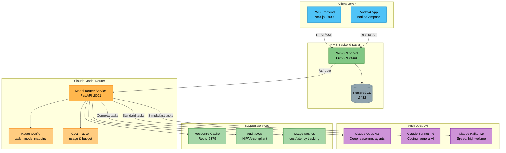

# Product Requirements Document: Claude Model Selection Strategy for Patient Management System (PMS)

**Document ID:** PRD-PMS-CLAUDEMODEL-001
**Version:** 1.0
**Date:** 2026-02-20
**Author:** Ammar (CEO, MPS Inc.)
**Status:** Draft

---

## 1. Executive Summary

Anthropic's Claude model family — comprising **Opus 4.6**, **Sonnet 4.6**, and **Haiku 4.5** — represents the most capable AI platform for coding, clinical reasoning, and agentic workflows in 2026. Each model tier occupies a distinct performance-cost position: Opus 4.6 delivers the highest reasoning intelligence at premium pricing ($5/$25 per million tokens), Sonnet 4.6 achieves 98%+ of Opus coding performance at one-fifth the cost ($3/$15), and Haiku 4.5 provides near-frontier speed at the most economical price point ($1/$5).

For the PMS, the question is not "which single model should we use?" but rather **"how do we build an intelligent model routing layer that selects the optimal Claude model per clinical task?"** A patient encounter summarization (routine, high-volume) should run on Haiku 4.5 for speed and cost. A complex drug interaction analysis should escalate to Sonnet 4.6 for accuracy. A full security audit or multi-agent clinical workflow orchestration should engage Opus 4.6 for deep reasoning.

This PRD proposes integrating a **Claude Model Router** into the PMS backend — a FastAPI service that dynamically selects between Opus 4.6, Sonnet 4.6, and Haiku 4.5 based on task complexity, latency requirements, and cost constraints. This approach minimizes API spend (projected 60-70% reduction versus uniform Opus usage), maintains clinical accuracy where it matters, and enables HIPAA-compliant AI across all PMS surfaces.

## 2. Problem Statement

The PMS currently faces four challenges with AI model consumption:

1. **Single-Model Bottleneck:** Using one model for all tasks means either overpaying (Opus for simple tasks) or underperforming (Haiku for complex reasoning). A busy clinic generating 500+ AI requests/day across encounter notes, medication checks, and report generation wastes $3,000-8,000/month on over-provisioned intelligence.

2. **No Task-Aware Routing:** The backend sends all AI requests to the same endpoint with the same model, regardless of whether the task is a simple text extraction (ideal for Haiku) or a multi-step clinical decision support query (requiring Opus-level reasoning).

3. **Latency Variance:** Opus 4.6 has moderate latency while Haiku 4.5 is the fastest. Real-time clinical workflows (point-of-care alerts, medication interaction popups) need sub-second responses, while background report generation can tolerate longer processing.

4. **Cost Unpredictability:** Without differentiated routing, API costs scale linearly with volume regardless of task complexity. With proper model selection, the same clinical output can be achieved at 20-40% of the uniform-Opus cost.

## 3. Proposed Solution

### 3.1 Architecture Overview

### 3.2 Model Comparison Matrix

| Feature | Claude Opus 4.6 | Claude Sonnet 4.6 | Claude Haiku 4.5 |
|:--------|:----------------|:------------------|:-----------------|
| **API Model ID** | `claude-opus-4-6` | `claude-sonnet-4-6` | `claude-haiku-4-5-20251001` |
| **Input Pricing** | $5 / MTok | $3 / MTok | $1 / MTok |
| **Output Pricing** | $25 / MTok | $15 / MTok | $5 / MTok |
| **Context Window** | 200K (1M beta) | 200K (1M beta) | 200K |
| **Max Output** | 128K tokens | 64K tokens | 64K tokens |
| **SWE-bench Verified** | 80.8% | 79.6% | ~49% |
| **GPQA Diamond** | 91.3% | 74.1% | ~65% |
| **Extended Thinking** | Yes | Yes | Yes |
| **Adaptive Thinking** | Yes | Yes | No |
| **Latency** | Moderate | Fast | Fastest |
| **Best For** | Deep reasoning, agents, security audits | Coding, general AI, data analysis | Real-time, high-volume, sub-agents |

### 3.3 Deployment Model

- **Cloud API:** All inference occurs via Anthropic's API endpoints (direct or via AWS Bedrock / Google Vertex AI for enterprise deployments).
- **HIPAA Compliance:** Requires Anthropic Enterprise plan with signed BAA, or deployment via AWS Bedrock / Google Vertex AI with healthcare-specific BAAs. Zero-data-retention agreements must be executed.
- **No Self-Hosting:** Claude models are closed-source and API-only — the Model Router is the on-premise component that handles PHI sanitization before API calls.
- **Docker Deployment:** The Model Router runs as a containerized FastAPI service within the PMS Docker network, ensuring PHI never leaves the network boundary without sanitization.

## 4. PMS Data Sources

The Claude Model Router interacts with PMS APIs based on task type:

| PMS API | Endpoint | Typical Model | Use Case |
|---------|----------|---------------|----------|
| Patient Records | `/api/patients` | Haiku 4.5 / Sonnet 4.6 | Patient lookup summaries, demographic extraction |
| Encounter Records | `/api/encounters` | Sonnet 4.6 / Opus 4.6 | Encounter note summarization, clinical coding |
| Medication & Rx | `/api/prescriptions` | Sonnet 4.6 / Opus 4.6 | Drug interaction analysis, formulary recommendations |
| Reporting | `/api/reports` | Haiku 4.5 / Sonnet 4.6 | Report generation, data aggregation |
| Clinical Workflow | `/api/encounters` | Opus 4.6 | Multi-step clinical decision support |
| Security Audit | Internal | Opus 4.6 | Code review, vulnerability analysis |

## 5. Component/Module Definitions

### 5.1 Model Router Service

**Description:** FastAPI microservice that receives AI requests from the PMS backend, classifies task complexity, selects the optimal Claude model, sanitizes PHI, forwards the request, and returns the response.

- **Input:** Task type, prompt, context, urgency level, optional model override
- **Output:** Claude model response with metadata (model used, latency, token count, cost)
- **PMS APIs Used:** All — acts as the single AI gateway

### 5.2 Task Classifier

**Description:** Rule-based + heuristic classifier that maps incoming requests to model tiers.

- **Input:** Task type enum, prompt length, required accuracy level
- **Output:** Model selection (opus/sonnet/haiku) with confidence score
- **Routing Rules:**
  - `HAIKU`: Simple extraction, formatting, classification, real-time alerts, sub-agent tasks
  - `SONNET`: Code generation, encounter summarization, medication checks, general clinical AI
  - `OPUS`: Multi-step reasoning, agent orchestration, security audits, complex drug interactions, diagnostic differentials

### 5.3 PHI Sanitizer

**Description:** Pre-processing module that strips or tokenizes PHI fields before sending prompts to the Anthropic API, and re-hydrates responses with original identifiers.

- **Input:** Raw prompt containing PHI
- **Output:** Sanitized prompt (PHI replaced with tokens) + mapping table for re-hydration
- **PMS APIs Used:** Patient Records API for identifier mapping

### 5.4 Cost Tracker

**Description:** Real-time usage tracking and budget enforcement module.

- **Input:** Model used, input/output token counts per request
- **Output:** Running cost totals, budget alerts, usage reports
- **Storage:** PostgreSQL `ai_usage` table

### 5.5 Response Cache

**Description:** Redis-based semantic cache for repeated queries.

- **Input:** Prompt hash + model + parameters
- **Output:** Cached response (if hit), or pass-through to API
- **TTL:** Configurable per task type (5 min for real-time, 24 hr for reports)

## 6. Non-Functional Requirements

### 6.1 Security and HIPAA Compliance

| Requirement | Implementation |
|-------------|---------------|
| BAA Coverage | Anthropic Enterprise BAA or AWS Bedrock / GCP Vertex AI BAA |
| PHI Sanitization | All prompts pass through PHI Sanitizer before API transmission |
| Data Retention | Zero-data-retention agreement with Anthropic; no training on PMS data |
| Encryption in Transit | TLS 1.3 for all API calls; mTLS within Docker network |
| Encryption at Rest | AES-256 for cached responses and audit logs |
| Access Control | Service-to-service auth with rotating API keys; per-user RBAC on frontend |
| Audit Logging | Every AI request logged: timestamp, user, task type, model used, PHI-stripped prompt hash |
| Key Management | API keys stored in HashiCorp Vault or AWS Secrets Manager; never in code or environment files |

### 6.2 Performance

| Metric | Haiku Target | Sonnet Target | Opus Target |
|--------|-------------|---------------|-------------|
| Time to First Token | < 200ms | < 500ms | < 1,000ms |
| Throughput (concurrent) | 50 req/s | 20 req/s | 5 req/s |
| Cache Hit Rate | > 30% | > 20% | > 15% |
| Availability | 99.9% | 99.9% | 99.5% |

### 6.3 Infrastructure

- **Model Router:** Docker container, 2 CPU / 2 GB RAM, FastAPI + uvicorn
- **Redis Cache:** Docker container, 1 CPU / 1 GB RAM
- **Dependencies:** `anthropic` Python SDK >= 1.0, `fastapi`, `redis`, `pydantic`
- **Networking:** Internal Docker network; only the Model Router makes outbound HTTPS calls to `api.anthropic.com`

## 7. Implementation Phases

### Phase 1: Foundation (Sprints 1-2)

- Deploy Model Router FastAPI service with basic routing
- Integrate Anthropic Python SDK with Opus 4.6, Sonnet 4.6, Haiku 4.5
- Implement PHI Sanitizer with tokenized replacement
- Add cost tracking to PostgreSQL
- Connect to existing PMS backend via internal API
- Write integration tests for all three models

### Phase 2: Intelligent Routing (Sprints 3-4)

- Build Task Classifier with rule-based routing engine
- Implement Redis response cache with per-task TTL
- Add adaptive thinking / extended thinking support for Sonnet and Opus
- Build usage dashboard in Next.js frontend
- Implement budget alerts and rate limiting
- Add streaming response support (SSE) for all model tiers

### Phase 3: Advanced Optimization (Sprints 5-6)

- Add prompt caching integration (Anthropic cache headers)
- Implement batch API for background processing (50% cost reduction)
- Build model performance comparison analytics
- Add automatic model escalation (Haiku → Sonnet → Opus) on quality score thresholds
- Integrate with MCP server (Experiment 09) for tool-use routing
- Add A/B testing framework for model quality comparison

## 8. Success Metrics

| Metric | Target | Measurement Method |
|--------|--------|-------------------|
| Cost Reduction vs Uniform Opus | ≥ 60% | Monthly API spend comparison |
| Clinical Accuracy (Sonnet tasks) | ≥ 95% clinician approval | Spot-check review of AI outputs |
| Real-Time Latency (Haiku tasks) | < 500ms end-to-end | P95 latency monitoring |
| Cache Hit Rate | ≥ 25% | Redis cache metrics |
| Model Selection Accuracy | ≥ 90% correct tier | Manual audit of routing decisions |
| Developer Adoption | 100% of AI calls via Router | API gateway logs |
| PHI Leak Rate | 0 incidents | Automated PHI scan on outbound requests |

## 9. Risks and Mitigations

| Risk | Impact | Mitigation |
|------|--------|------------|
| Anthropic API downtime | All AI features offline | Implement circuit breaker; fallback to on-premise Gemma 3 (Exp 13) for critical tasks |
| PHI leakage in prompts | HIPAA violation, fines | Automated PHI scanner with deny-by-default; audit logging of every outbound request |
| Incorrect model routing | Over-spending or under-performing | A/B testing framework; clinician feedback loop; override capability |
| API cost overrun | Budget exceeded | Hard budget caps in Cost Tracker; daily spend alerts; batch API for deferrable work |
| Rate limiting by Anthropic | Requests rejected at peak | Implement request queuing; use priority tiers; spread across AWS Bedrock + direct API |
| Model deprecation | Breaking changes | Pin model IDs (e.g., `claude-haiku-4-5-20251001`); monitor deprecation announcements |
| Extended thinking cost spikes | Unexpected high token usage | Set `budget_tokens` limits on extended thinking; monitor thinking token ratios |

## 10. Dependencies

| Dependency | Version | Purpose |
|------------|---------|---------|
| `anthropic` Python SDK | >= 1.0 | Official Anthropic API client |
| Claude Opus 4.6 API | `claude-opus-4-6` | Deep reasoning and agent tasks |
| Claude Sonnet 4.6 API | `claude-sonnet-4-6` | Standard coding and clinical AI |
| Claude Haiku 4.5 API | `claude-haiku-4-5-20251001` | High-speed, high-volume tasks |
| FastAPI | >= 0.115 | Model Router service framework |
| Redis | >= 7.0 | Response caching |
| PostgreSQL | >= 16 | Cost tracking and audit logs |
| PMS Backend API | `/api/patients`, `/api/encounters`, `/api/prescriptions`, `/api/reports` | Clinical data source |
| Anthropic Enterprise BAA | Required | HIPAA compliance |

## 11. Comparison with Existing Experiments

| Aspect | Claude Model Selection (This) | Gemma 3 (Exp 13) | Adaptive Thinking (Exp 08) |
|--------|------------------------------|-------------------|---------------------------|
| **Deployment** | Cloud API (Anthropic) | Self-hosted on-premise | Cloud API (Anthropic) |
| **PHI Handling** | Sanitize before API call | PHI stays on-premise | Sanitize before API call |
| **Cost Model** | Per-token (optimized by routing) | Fixed infrastructure cost | Per-token |
| **Best For** | Variable-complexity clinical tasks | High-volume, fixed-cost inference | Single-model reasoning optimization |
| **Offline Capable** | No | Yes | No |
| **Model Choice** | Opus / Sonnet / Haiku (dynamic) | Gemma 3 27B / 4B / MedGemma | Single model with variable effort |

**Complementarity:** This experiment complements Experiment 13 (Gemma 3) by providing a cloud-based fallback with superior reasoning capability for tasks that exceed local model capacity. It extends Experiment 08 (Adaptive Thinking) by adding cross-model routing on top of within-model effort control. The recommended production architecture is: Gemma 3 for routine high-volume tasks (zero cost), Claude Haiku/Sonnet via Router for standard cloud tasks, and Claude Opus for complex reasoning — creating a three-tier cost optimization pyramid.

## 12. Research Sources

### Official Documentation
- [Claude Models Overview](https://platform.claude.com/docs/en/about-claude/models/overview) — Complete model specs, pricing, context windows, and feature comparison
- [Choosing the Right Model](https://platform.claude.com/docs/en/about-claude/models/choosing-a-model) — Official model selection matrix and decision guide
- [Claude API Pricing](https://platform.claude.com/docs/en/about-claude/pricing) — Full cost breakdown including batch, caching, and extended thinking rates

### Benchmarks & Comparisons
- [Sonnet 4.6 vs Opus 4.6 Comparison (NxCode)](https://www.nxcode.io/resources/news/claude-sonnet-4-6-vs-opus-4-6-which-model-to-choose-2026) — Detailed benchmark comparison with SWE-bench, GPQA, and OSWorld scores
- [Sonnet 4.6 Benchmarks and Pricing (NxCode)](https://www.nxcode.io/resources/news/claude-sonnet-4-6-complete-guide-benchmarks-pricing-2026) — Comprehensive Sonnet 4.6 capabilities and developer preference data
- [VentureBeat: Sonnet 4.6 Matches Flagship Performance](https://venturebeat.com/technology/anthropics-sonnet-4-6-matches-flagship-ai-performance-at-one-fifth-the-cost) — Enterprise adoption analysis and cost-performance ratios

### Security & HIPAA Compliance
- [Anthropic BAA Information](https://privacy.claude.com/en/articles/8114513-business-associate-agreements-baa-for-commercial-customers) — BAA requirements and eligible plans
- [Claude HIPAA-Ready Enterprise Plans](https://support.claude.com/en/articles/13296973-hipaa-ready-enterprise-plans) — Enterprise plan HIPAA features
- [Anthropic Healthcare Announcement](https://www.anthropic.com/news/healthcare-life-sciences) — Claude for Healthcare tools and resources

### Agentic Workflows
- [Claude Code Best Practices](https://code.claude.com/docs/en/best-practices) — Official guidance on sub-agent architecture and model mixing
- [Anthropic Python SDK (GitHub)](https://github.com/anthropics/anthropic-sdk-python) — SDK source with FastAPI integration patterns

## 13. Appendix: Related Documents

- [Claude Model Selection Setup Guide](15-ClaudeModelSelection-PMS-Developer-Setup-Guide.md) — Step-by-step installation and configuration
- [Claude Model Selection Developer Tutorial](15-ClaudeModelSelection-Developer-Tutorial.md) — Hands-on onboarding: build your first model-routed clinical AI pipeline
- [Adaptive Thinking PRD](08-PRD-AdaptiveThinking-PMS-Integration.md) — Effort-routed reasoning within a single model
- [Gemma 3 PRD](13-PRD-Gemma3-PMS-Integration.md) — Self-hosted open-weight model for zero-egress inference
- [MCP PRD](09-PRD-MCP-PMS-Integration.md) — Universal AI integration protocol for tool-use routing
