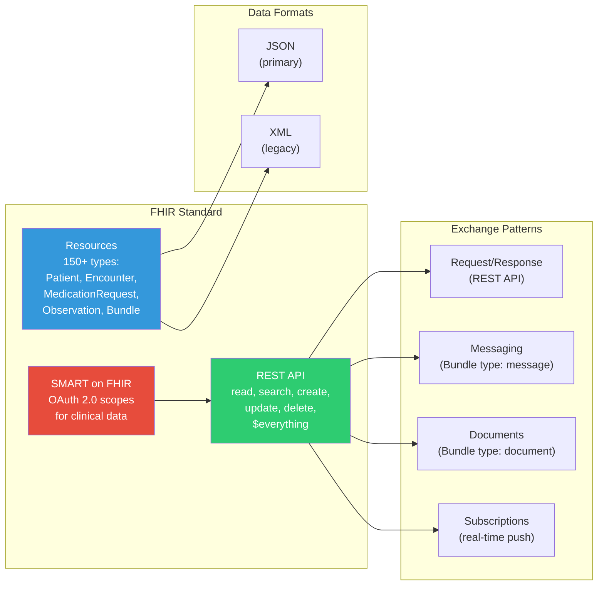
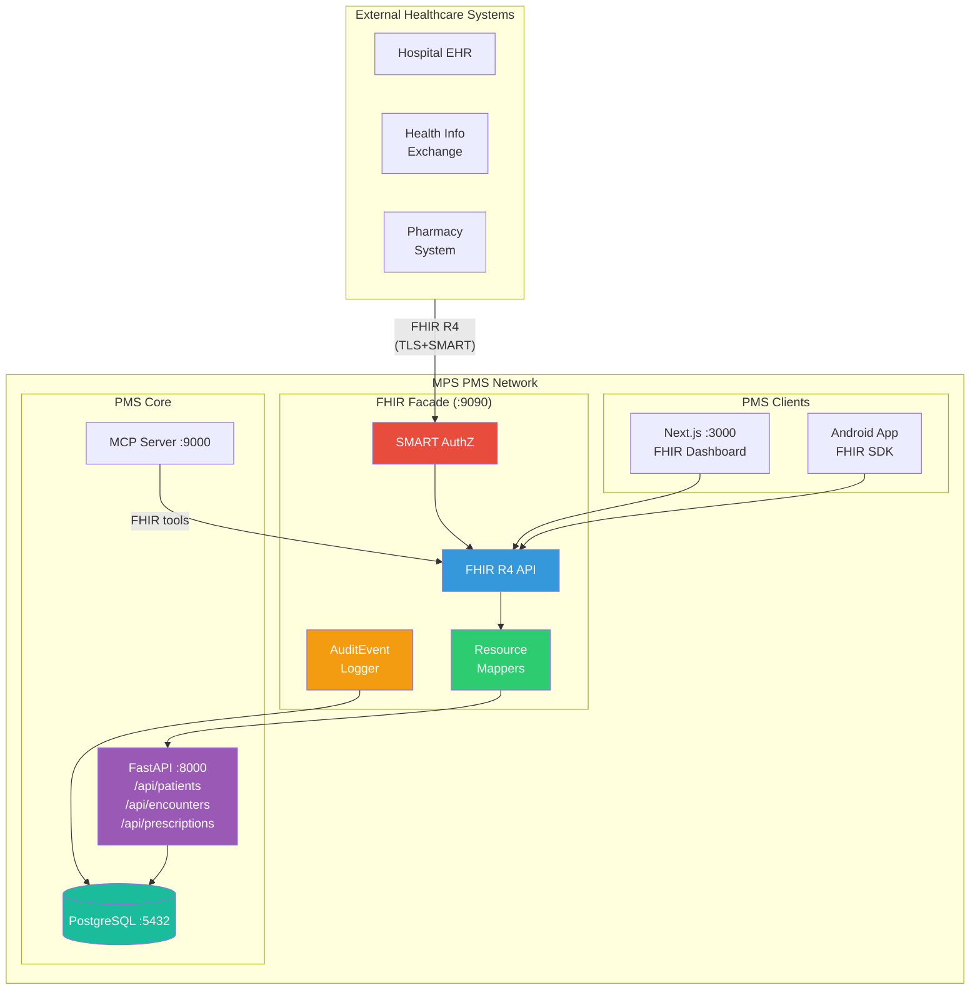

# FHIR Developer Onboarding Tutorial

**Welcome to the MPS PMS FHIR Integration Team**

This tutorial will take you from zero to building your first FHIR integration with the PMS. By the end, you will understand how FHIR works, have a running local environment, and have built and tested a custom integration end-to-end.

**Document ID:** PMS-EXP-FHIR-002
**Version:** 1.0
**Date:** February 21, 2026
**Applies To:** PMS project (all platforms)
**Prerequisite:** [FHIR Setup Guide](16-FHIR-PMS-Developer-Setup-Guide.md)
**Estimated time:** 2-3 hours
**Difficulty:** Beginner-friendly

---

## What You Will Learn

1. What FHIR is and why healthcare systems need it
2. How FHIR resources map to PMS clinical data (patients, encounters, medications)
3. How the FHIR R4 REST API works (CRUD operations, search, Bundles)
4. How to build a FHIR Resource Mapper between PMS and FHIR formats
5. How to implement FHIR search with proper Bundle responses
6. How SMART on FHIR authorization secures external access to PHI
7. How to validate FHIR resources using Python Pydantic models
8. How to import patient data from an external FHIR server into the PMS
9. How to render FHIR data in the Next.js frontend
10. How to test FHIR conformance against the HL7 specification

---

## Part 1: Understanding FHIR (15 min read)

### 1.1 What Problem Does FHIR Solve?

Imagine a patient, Maria, who visits your PMS clinic for a routine checkup. She was recently discharged from a hospital and is taking three medications prescribed by two different specialists. Your clinic's PMS has **none** of this history — Maria must verbally recall her medications, the front desk manually re-enters her demographics, and the clinician has no access to her hospital discharge notes.

This is the interoperability problem FHIR solves. Without a standard data exchange protocol, every healthcare system is a data silo. Patient data is trapped in the system that created it, leading to:

- **Duplicate data entry** — staff re-enter demographics, allergies, and medications at every facility
- **Incomplete clinical pictures** — clinicians make decisions without the patient's full history
- **Medication errors** — without a consolidated medication list, drug interactions go undetected
- **Administrative burden** — prior authorizations, referrals, and care coordination require fax and phone

FHIR gives the PMS the ability to **electronically import** Maria's complete record from the hospital and **share** PMS data back — all through standard REST APIs that any FHIR-compliant system understands.

### 1.2 How FHIR Works — The Key Pieces



**FHIR has three core concepts:**

1. **Resources** — The building blocks. Every piece of healthcare data is a "resource" with a defined structure. A `Patient` resource has name, birth date, and gender fields. An `Encounter` resource has dates, status, and participants. There are over 150 resource types, but the PMS primarily uses 6-8 of them.

2. **REST API** — The transport. FHIR defines standard HTTP operations: `GET /Patient/123` reads a patient, `POST /Patient` creates one, `GET /Patient?name=Smith` searches. Every FHIR server responds the same way to the same requests — that's the interoperability.

3. **SMART on FHIR** — The security. An OAuth 2.0 framework with healthcare-specific "scopes" like `patient/Patient.read` (read this patient's record) or `user/Encounter.rs` (read and search encounters as this user). External apps must obtain scoped access tokens before querying FHIR data.

### 1.3 How FHIR Fits with Other PMS Technologies

| Technology | Experiment | Role | Relationship to FHIR |
|---|---|---|---|
| MCP | 09 | AI-to-PMS integration protocol | MCP handles internal AI interoperability; FHIR handles external healthcare system interoperability. MCP tools can wrap FHIR operations. |
| OpenClaw | 05 | Agentic workflow automation | OpenClaw agents could use FHIR to fetch external patient data during prior authorization workflows. |
| MedASR | 07 | Clinical speech-to-text | Transcribed clinical notes can be stored as FHIR `DocumentReference` resources for cross-system sharing. |
| Sanford Guide | 11 | Antimicrobial CDS | Treatment recommendations can be modeled as FHIR `MedicationKnowledge` resources and shared via FHIR API. |
| Adaptive Thinking | 08 | AI reasoning optimization | Clinical decision support queries can use FHIR resources as input context for AI reasoning. |
| Claude Model Selection | 15 | AI model routing | AI queries involving FHIR data can be routed to appropriate model tiers based on clinical complexity. |

### 1.4 Key Vocabulary

| Term | Meaning |
|---|---|
| **FHIR** | Fast Healthcare Interoperability Resources — the HL7 standard for healthcare data exchange |
| **Resource** | A discrete unit of healthcare data (Patient, Encounter, Observation, etc.) with a defined JSON schema |
| **Bundle** | A FHIR resource that contains a collection of other resources — used for search results, batch operations, and documents |
| **CapabilityStatement** | A FHIR resource describing what a server supports — resource types, operations, search parameters |
| **SMART on FHIR** | OAuth 2.0-based authorization framework with clinical scopes for healthcare apps |
| **R4** | FHIR Release 4 (v4.0.1) — the most widely deployed version with normative (stable) content |
| **OperationOutcome** | A FHIR resource for error responses — contains issue severity, code, and diagnostics |
| **Reference** | A link from one FHIR resource to another, e.g., `Encounter.subject` → `Patient/123` |
| **Facade** | An architectural pattern where a thin layer translates between an internal data model and FHIR format, without replacing the underlying database |
| **PHI** | Protected Health Information — patient data regulated by HIPAA |
| **Interoperability** | The ability of different healthcare systems to exchange and use each other's data |
| **Search Parameters** | Named query parameters defined per resource type (e.g., `Patient?name=Smith&birthdate=1990-01-01`) |

### 1.5 Our Architecture



The FHIR Facade sits between external healthcare systems and the PMS core. It does **not** replace the PMS backend or database — it provides a standards-compliant view of the same data. External systems talk FHIR; the PMS backend continues to use its own API contracts.

---

## Part 2: Environment Verification (15 min)

### 2.1 Checklist

Run each command and verify the expected output:

1. **Python with fhir.resources installed:**
   ```bash
   python3 -c "from fhir.resources.R4B.patient import Patient; print('fhir.resources OK')"
   # Expected: fhir.resources OK
   ```

2. **PMS Backend running:**
   ```bash
   curl -s http://localhost:8000/docs | grep -c "swagger"
   # Expected: 1 (or more)
   ```

3. **PMS Frontend running:**
   ```bash
   curl -s http://localhost:3000 -o /dev/null -w "%{http_code}"
   # Expected: 200
   ```

4. **PostgreSQL accepting connections:**
   ```bash
   docker exec pms-db pg_isready
   # Expected: accepting connections
   ```

5. **FHIR Facade running (if setup guide completed):**
   ```bash
   curl -s http://localhost:9090/fhir/r4/metadata | python3 -m json.tool | head -3
   # Expected: valid JSON with "resourceType": "CapabilityStatement"
   ```

6. **Docker networking:**
   ```bash
   docker network inspect pms-network | grep -c "pms-"
   # Expected: 3 or more (pms-backend, pms-db, pms-fhir)
   ```

### 2.2 Quick Test

Confirm end-to-end connectivity with a single command:

```bash
# Create a patient via PMS API, then read it via FHIR API
PMS_ID=$(curl -s -X POST http://localhost:8000/api/patients \
  -H "Content-Type: application/json" \
  -d '{"first_name":"Test","last_name":"FHIR","gender":"other","date_of_birth":"2000-01-01"}' \
  | python3 -c "import sys,json; print(json.load(sys.stdin)['id'])")

curl -s "http://localhost:9090/fhir/r4/Patient/${PMS_ID}" \
  | python3 -c "
import sys, json
p = json.load(sys.stdin)
print(f'FHIR Resource: {p[\"resourceType\"]}')
print(f'Name: {p[\"name\"][0][\"given\"][0]} {p[\"name\"][0][\"family\"]}')
print(f'Birth Date: {p[\"birthDate\"]}')
"
# Expected:
# FHIR Resource: Patient
# Name: Test FHIR
# Birth Date: 2000-01-01
```

---

## Part 3: Build Your First Integration (45 min)

### 3.1 What We Are Building

We will build a **FHIR Encounter endpoint** that:

1. Maps PMS encounter records to FHIR `Encounter` resources
2. Supports `read` (get single encounter) and `search` (find encounters by patient)
3. Returns proper FHIR `Bundle` responses for search results
4. Validates all output with `fhir.resources` Pydantic models

This is the same pattern used for every FHIR resource — once you understand it for Encounter, you can add Observation, MedicationRequest, Condition, etc.

### 3.2 Step 1: Understand the Data Mapping

First, compare the PMS encounter schema with the FHIR Encounter resource:

| PMS Field | FHIR Encounter Field | Notes |
|---|---|---|
| `id` | `Encounter.id` | String in FHIR, integer in PMS |
| `patient_id` | `Encounter.subject` | FHIR uses `Reference` type: `{"reference": "Patient/123"}` |
| `status` ("scheduled", "in_progress", "completed") | `Encounter.status` | FHIR uses different codes: "planned", "in-progress", "finished" |
| `start_date` | `Encounter.period.start` | Both use ISO 8601 date-time |
| `end_date` | `Encounter.period.end` | Both use ISO 8601 date-time |
| `type` | `Encounter.type` | FHIR uses CodeableConcept with coding system |
| (not in PMS) | `Encounter.class` | Required in FHIR — we default to "AMB" (ambulatory) |

### 3.3 Step 2: Write the Encounter Mapper

Create `pms-fhir/app/mappers/encounter_mapper.py`:

```python
"""Bidirectional mapper: PMS Encounter ↔ FHIR R4 Encounter."""

from fhir.resources.R4B.encounter import Encounter
from fhir.resources.R4B.period import Period
from fhir.resources.R4B.reference import Reference
from fhir.resources.R4B.coding import Coding
from fhir.resources.R4B.codeableconcept import CodeableConcept

# PMS status → FHIR Encounter.status mapping
PMS_TO_FHIR_STATUS = {
    "scheduled": "planned",
    "in_progress": "in-progress",
    "completed": "finished",
    "cancelled": "cancelled",
    "no_show": "cancelled",
}

FHIR_TO_PMS_STATUS = {v: k for k, v in PMS_TO_FHIR_STATUS.items()}


def pms_encounter_to_fhir(pms_enc: dict) -> Encounter:
    """
    Convert a PMS encounter dict to a FHIR R4 Encounter resource.

    The PMS stores encounters with fields like patient_id, status,
    start_date, and end_date. FHIR expects references, coded status
    values, and a Period object.
    """
    fhir_status = PMS_TO_FHIR_STATUS.get(
        pms_enc.get("status", ""), "unknown"
    )

    encounter = Encounter(
        id=str(pms_enc["id"]),
        status=fhir_status,
        # class is required in FHIR - default to ambulatory
        class_fhir=Coding(
            system="http://terminology.hl7.org/CodeSystem/v3-ActCode",
            code="AMB",
            display="ambulatory",
        ),
        subject=Reference(
            reference=f"Patient/{pms_enc['patient_id']}",
        ),
        period=Period(
            start=pms_enc.get("start_date"),
            end=pms_enc.get("end_date"),
        ),
    )

    # Optional: map encounter type if present
    if pms_enc.get("type"):
        encounter.type = [
            CodeableConcept(
                text=pms_enc["type"],
            )
        ]

    return encounter


def fhir_encounter_to_pms(fhir_enc: Encounter) -> dict:
    """Convert a FHIR R4 Encounter to a PMS encounter dict for import."""
    pms_status = FHIR_TO_PMS_STATUS.get(fhir_enc.status, "scheduled")

    # Extract patient ID from reference string "Patient/123"
    patient_id = None
    if fhir_enc.subject and fhir_enc.subject.reference:
        ref_parts = fhir_enc.subject.reference.split("/")
        if len(ref_parts) == 2:
            patient_id = ref_parts[1]

    return {
        "patient_id": patient_id,
        "status": pms_status,
        "start_date": (
            fhir_enc.period.start.isoformat()
            if fhir_enc.period and fhir_enc.period.start
            else None
        ),
        "end_date": (
            fhir_enc.period.end.isoformat()
            if fhir_enc.period and fhir_enc.period.end
            else None
        ),
        "type": (
            fhir_enc.type[0].text
            if fhir_enc.type
            else None
        ),
    }
```

### 3.4 Step 3: Write the Encounter Router

Create `pms-fhir/app/routers/encounter.py`:

```python
"""FHIR R4 Encounter REST endpoints."""

from fastapi import APIRouter, HTTPException, Query
from fhir.resources.R4B.bundle import Bundle, BundleEntry
from fhir.resources.R4B.encounter import Encounter
import httpx

from app.mappers.encounter_mapper import pms_encounter_to_fhir
from app.config import settings

router = APIRouter()


@router.get("/Encounter/{encounter_id}")
async def read_encounter(encounter_id: str):
    """
    FHIR read: GET /fhir/r4/Encounter/{id}

    Returns a single Encounter resource or 404 OperationOutcome.
    """
    async with httpx.AsyncClient() as client:
        resp = await client.get(
            f"{settings.pms_backend_url}/api/encounters/{encounter_id}"
        )

    if resp.status_code == 404:
        raise HTTPException(status_code=404, detail={
            "resourceType": "OperationOutcome",
            "issue": [{
                "severity": "error",
                "code": "not-found",
                "diagnostics": f"Encounter/{encounter_id} not found",
            }],
        })

    pms_data = resp.json()
    fhir_encounter = pms_encounter_to_fhir(pms_data)
    return fhir_encounter.model_dump(exclude_none=True)


@router.get("/Encounter")
async def search_encounters(
    patient: str | None = Query(None, description="Patient reference (e.g., Patient/123)"),
    status: str | None = Query(None, description="Encounter status"),
    date: str | None = Query(None, description="Encounter date"),
):
    """
    FHIR search: GET /fhir/r4/Encounter?patient=Patient/123&status=finished

    Returns a Bundle of type searchset containing matching Encounters.
    """
    # Build PMS query parameters from FHIR search params
    params = {}
    if patient:
        # Extract ID from "Patient/123" reference format
        patient_id = patient.replace("Patient/", "")
        params["patient_id"] = patient_id
    if status:
        # Reverse-map FHIR status to PMS status
        from app.mappers.encounter_mapper import FHIR_TO_PMS_STATUS
        pms_status = FHIR_TO_PMS_STATUS.get(status, status)
        params["status"] = pms_status
    if date:
        params["date"] = date

    async with httpx.AsyncClient() as client:
        resp = await client.get(
            f"{settings.pms_backend_url}/api/encounters",
            params=params,
        )

    pms_encounters = resp.json()

    # Build FHIR Bundle with search results
    entries = []
    for enc in pms_encounters:
        fhir_enc = pms_encounter_to_fhir(enc)
        entries.append(
            BundleEntry(
                resource=fhir_enc,
                fullUrl=f"{settings.fhir_base_url}/Encounter/{enc['id']}",
            )
        )

    bundle = Bundle(
        type="searchset",
        total=len(entries),
        entry=entries if entries else None,
    )
    return bundle.model_dump(exclude_none=True)
```

### 3.5 Step 4: Write Unit Tests

Create `pms-fhir/tests/test_encounter.py`:

```python
"""Tests for the FHIR Encounter mapper and router."""

from app.mappers.encounter_mapper import (
    pms_encounter_to_fhir,
    fhir_encounter_to_pms,
)
from fhir.resources.R4B.encounter import Encounter


def test_pms_to_fhir_encounter():
    """PMS encounter converts to valid FHIR Encounter."""
    pms_data = {
        "id": 42,
        "patient_id": 7,
        "status": "completed",
        "start_date": "2026-02-01T09:00:00",
        "end_date": "2026-02-01T09:30:00",
        "type": "Follow-up visit",
    }

    fhir_enc = pms_encounter_to_fhir(pms_data)

    assert fhir_enc.id == "42"
    assert fhir_enc.status == "finished"  # PMS "completed" → FHIR "finished"
    assert fhir_enc.subject.reference == "Patient/7"
    assert fhir_enc.period.start is not None
    assert fhir_enc.class_fhir.code == "AMB"

    # Validate it's a proper FHIR resource
    json_dict = fhir_enc.model_dump(exclude_none=True)
    assert json_dict["resourceType"] == "Encounter"


def test_fhir_to_pms_encounter():
    """FHIR Encounter converts back to PMS format."""
    fhir_enc = Encounter.model_validate({
        "resourceType": "Encounter",
        "status": "in-progress",
        "class": {
            "system": "http://terminology.hl7.org/CodeSystem/v3-ActCode",
            "code": "AMB",
        },
        "subject": {"reference": "Patient/99"},
        "period": {
            "start": "2026-02-15T14:00:00",
        },
    })

    pms_data = fhir_encounter_to_pms(fhir_enc)

    assert pms_data["patient_id"] == "99"
    assert pms_data["status"] == "in_progress"  # FHIR "in-progress" → PMS "in_progress"
    assert pms_data["start_date"] is not None


def test_status_mapping_completeness():
    """All PMS statuses map to valid FHIR statuses."""
    from app.mappers.encounter_mapper import PMS_TO_FHIR_STATUS

    valid_fhir_statuses = {
        "planned", "arrived", "triaged", "in-progress",
        "onleave", "finished", "cancelled", "entered-in-error", "unknown",
    }

    for pms_status, fhir_status in PMS_TO_FHIR_STATUS.items():
        assert fhir_status in valid_fhir_statuses, (
            f"PMS status '{pms_status}' maps to invalid FHIR status '{fhir_status}'"
        )


def test_round_trip_preserves_data():
    """PMS → FHIR → PMS round-trip preserves critical fields."""
    original = {
        "id": 1,
        "patient_id": 5,
        "status": "scheduled",
        "start_date": "2026-03-01T08:00:00",
        "end_date": None,
        "type": "New patient intake",
    }

    fhir_enc = pms_encounter_to_fhir(original)
    round_tripped = fhir_encounter_to_pms(fhir_enc)

    assert round_tripped["patient_id"] == str(original["patient_id"])
    assert round_tripped["status"] == original["status"]
    assert round_tripped["type"] == original["type"]
```

### 3.6 Step 5: Run and Verify

```bash
# Run the unit tests
cd pms-fhir
python -m pytest tests/test_encounter.py -v

# Expected output:
# tests/test_encounter.py::test_pms_to_fhir_encounter PASSED
# tests/test_encounter.py::test_fhir_to_pms_encounter PASSED
# tests/test_encounter.py::test_status_mapping_completeness PASSED
# tests/test_encounter.py::test_round_trip_preserves_data PASSED

# Test the live endpoint (after restarting the FHIR service)
docker compose restart pms-fhir

# Search encounters for a patient
curl -s "http://localhost:9090/fhir/r4/Encounter?patient=Patient/1" \
  | python3 -m json.tool
# Expected: Bundle with type "searchset" and encounter entries
```

---

## Part 4: Evaluating Strengths and Weaknesses (15 min)

### 4.1 Strengths

- **Universal interoperability:** FHIR R4 is supported by Epic, Cerner, Allscripts, athenahealth, and virtually every major EHR vendor. Implementing FHIR means the PMS can exchange data with any of them.
- **Regulatory compliance:** CMS mandates FHIR-based APIs for prior authorization (January 2026). Having FHIR support ensures the PMS meets federal interoperability requirements.
- **Mature ecosystem:** Over 70% of countries have active FHIR deployments. Libraries exist for Python (`fhir.resources`), Java (HAPI FHIR), Kotlin (Google Android FHIR SDK), JavaScript (`fhir-react`), and every major language.
- **JSON-native:** FHIR resources are standard JSON, making them natural to work with in FastAPI (Python), Next.js (TypeScript), and Kotlin. No special binary protocols or serialization.
- **Backward compatibility:** FHIR R4 has normative status, meaning the core resource structures are stable and won't break in future versions. R5 and R6 are additive.
- **Built-in security model:** SMART on FHIR provides a healthcare-specific OAuth 2.0 framework with clinical scopes, eliminating the need to design a custom authorization model for external access.
- **Facade architecture:** The PMS doesn't need to replace its database or internal APIs. The FHIR layer is a thin translation layer that can be added incrementally.

### 4.2 Weaknesses

- **Mapping complexity:** FHIR resources don't map 1:1 to typical relational schemas. Fields like `CodeableConcept`, `Reference`, and `Extension` require careful handling. PMS-specific data that doesn't fit FHIR resources needs extensions.
- **Search parameter limitations:** FHIR search is powerful but different from SQL. Implementing FHIR search parameters on top of an existing API requires translating between two query paradigms.
- **Conformance testing burden:** To be truly interoperable, the PMS FHIR server must pass HL7 Touchstone conformance tests, which can require significant implementation effort for edge cases.
- **Terminology systems:** FHIR relies heavily on standardized code systems (SNOMED CT, LOINC, ICD-10, RxNorm). If the PMS doesn't already use these terminologies, adding terminology mapping is a substantial project.
- **Performance overhead:** Every FHIR request requires a translation step (PMS → FHIR and back). For high-throughput scenarios, this adds latency compared to direct API access.
- **Version management:** While R4 is normative, some resources are still at "trial use" maturity, meaning their structure could change. The PMS must handle version negotiation with external systems that may run R4, R4B, or R5.

### 4.3 When to Use FHIR vs Alternatives

| Scenario | Use FHIR | Use Alternative |
|---|---|---|
| Exchanging data with hospital EHRs | FHIR R4 REST API | — |
| Internal AI-to-PMS integration | — | MCP (experiment 09) |
| Real-time clinical event streaming | FHIR Subscriptions | WebSockets (for internal events) |
| Legacy HL7 v2 system integration | FHIR with v2→FHIR bridge | Direct HL7 v2 ADT/ORM messages |
| Patient-facing mobile app | FHIR + SMART on FHIR | Direct PMS API (for internal app) |
| Cross-organization patient matching | FHIR `$match` operation | — |
| Bulk data export (population health) | FHIR Bulk Data Access (`$export`) | Custom CSV/reporting API |
| Medication knowledge lookup | — | Sanford Guide API (experiment 11) |

### 4.4 HIPAA / Healthcare Considerations

**FHIR aligns well with HIPAA requirements, but implementation matters:**

| HIPAA Requirement | FHIR Support | PMS Implementation |
|---|---|---|
| Access control | SMART scopes restrict which resources and actions clients can perform | Enforce scopes per-request in FHIR Facade middleware |
| Audit trail | `AuditEvent` resource captures who, what, when, where | Log every FHIR interaction to PostgreSQL |
| Encryption in transit | FHIR spec requires TLS for all interactions | TLS 1.3 on port 9090 (FHIR Facade) |
| Encryption at rest | Not specified by FHIR (implementation responsibility) | PostgreSQL TDE or volume-level encryption |
| Minimum necessary | `_elements` search parameter returns only requested fields | Implement `_elements` support in search endpoints |
| Patient consent | `Consent` resource models patient sharing preferences | Check consent before releasing data to external systems |
| BAA with partners | Not a technical control | Require BAA registration before granting FHIR client credentials |

**Key rule:** FHIR provides the framework, but HIPAA compliance is the **implementer's** responsibility. The FHIR spec explicitly states this — using FHIR does not automatically make your system HIPAA-compliant.

---

## Part 5: Debugging Common Issues (15 min read)

### Issue 1: "resourceType" Missing from Response

**Symptoms:** External FHIR clients reject responses because `resourceType` is not in the JSON.

**Cause:** Using `model_dump()` without checking that `resourceType` is included.

**Fix:** `fhir.resources` includes `resourceType` by default in `model_dump()`. If it's missing, you may be constructing the resource incorrectly:

```python
# Wrong - missing resourceType
return {"name": [{"family": "Doe"}]}

# Right - use the model
patient = Patient(name=[HumanName(family="Doe")])
return patient.model_dump(exclude_none=True)
# {"resourceType": "Patient", "name": [{"family": "Doe"}]}
```

### Issue 2: Pydantic Validation Error on Encounter.class

**Symptoms:** `ValidationError: 1 validation error for Encounter — class_fhir field required`

**Cause:** `class` is a Python reserved word. `fhir.resources` uses `class_fhir` as the Python attribute name.

**Fix:** Always use `class_fhir` in Python code, but the JSON output will correctly use `class`:

```python
enc = Encounter(
    status="finished",
    class_fhir=Coding(system="...", code="AMB"),  # Not "class"
    subject=Reference(reference="Patient/1"),
)
```

### Issue 3: Bundle Entry Missing fullUrl

**Symptoms:** External clients report `fullUrl is required for each Bundle entry` validation error.

**Cause:** FHIR search result Bundles must include `fullUrl` on each entry.

**Fix:** Always provide `fullUrl` when building Bundle entries:

```python
BundleEntry(
    resource=fhir_patient,
    fullUrl=f"http://localhost:9090/fhir/r4/Patient/{patient_id}",  # Required
)
```

### Issue 4: Date Format Rejected by fhir.resources

**Symptoms:** `ValidationError: value is not a valid date format`

**Cause:** FHIR uses ISO 8601 dates (`2026-02-21`, `2026-02-21T09:30:00+00:00`). The PMS may store dates in other formats.

**Fix:** Normalize dates before passing to FHIR models:

```python
from datetime import datetime

pms_date = "02/21/2026"  # PMS format
fhir_date = datetime.strptime(pms_date, "%m/%d/%Y").strftime("%Y-%m-%d")
# "2026-02-21"
```

### Issue 5: Search Returns 200 but Empty Bundle

**Symptoms:** FHIR search succeeds but `total: 0` even when data exists.

**Cause:** FHIR search parameters don't match PMS backend query parameters.

**Fix:** Check the parameter mapping in your router. Common issues:
- FHIR uses `name` but PMS uses `search` or `last_name`
- FHIR uses `Patient/123` references but PMS expects bare ID `123`
- FHIR date format differs from PMS date format

Add logging to see what parameters reach the PMS backend:

```python
import logging
logger = logging.getLogger(__name__)

# In your search endpoint:
logger.info(f"FHIR search params: {params}")
logger.info(f"PMS query params: {pms_params}")
```

---

## Part 6: Practice Exercise (45 min)

### Option A: Build the MedicationRequest Mapper

Build a complete FHIR `MedicationRequest` endpoint that maps PMS prescriptions to FHIR format.

**Hints:**
1. PMS prescriptions have: `id`, `patient_id`, `medication_name`, `dosage`, `frequency`, `prescriber_id`, `status`, `prescribed_date`
2. FHIR `MedicationRequest` has: `status`, `intent`, `medicationCodeableConcept`, `subject`, `requester`, `dosageInstruction`, `authoredOn`
3. PMS status values map: "active" → "active", "completed" → "completed", "cancelled" → "cancelled"
4. `intent` should default to "order" for PMS prescriptions
5. Dosage instructions use FHIR's `Dosage` type with `text`, `timing`, and `doseAndRate` fields

**Steps:**
1. Create `pms-fhir/app/mappers/medication_mapper.py`
2. Create `pms-fhir/app/routers/medication.py` with `read` and `search` endpoints
3. Write tests in `pms-fhir/tests/test_medication.py`
4. Test against `/api/prescriptions` on the PMS backend

### Option B: Implement Patient $everything

Build the `$everything` operation that returns a complete Bundle of all resources for a patient.

**Hints:**
1. The endpoint is `GET /fhir/r4/Patient/{id}/$everything`
2. It returns a Bundle of type "searchset" containing the Patient resource plus all related Encounters, MedicationRequests, and Observations
3. Query each PMS endpoint with the patient ID and combine results
4. Use `Bundle.entry` to include all resources with appropriate `fullUrl` values

**Steps:**
1. Add a new route in `pms-fhir/app/routers/patient.py`
2. Call `/api/patients/{id}`, `/api/encounters?patient_id={id}`, `/api/prescriptions?patient_id={id}` in parallel using `asyncio.gather`
3. Map all results to FHIR resources and combine into a single Bundle
4. Test with `curl http://localhost:9090/fhir/r4/Patient/1/$everything`

### Option C: Build a FHIR Data Import Feature

Build a feature that fetches a patient from an external FHIR server and imports them into the PMS.

**Hints:**
1. Use the HAPI FHIR public test server: `https://hapi.fhir.org/baseR4`
2. Fetch a patient: `GET https://hapi.fhir.org/baseR4/Patient/592912`
3. Use `fhir_patient_to_pms()` to convert to PMS format
4. POST to `http://localhost:8000/api/patients` to create in PMS
5. Add provenance tracking — record which external server the data came from

**Steps:**
1. Create `pms-fhir/app/services/importer.py`
2. Implement `import_patient(external_fhir_url, patient_id)` function
3. Add a route: `POST /fhir/r4/import/Patient` that accepts an external server URL and patient ID
4. Test with the HAPI FHIR public server

---

## Part 7: Development Workflow and Conventions

### 7.1 File Organization

```
pms-fhir/
├── app/
│   ├── main.py                     # FastAPI app, router mounting
│   ├── config.py                   # Pydantic settings (env vars)
│   ├── routers/
│   │   ├── capability.py           # GET /fhir/r4/CapabilityStatement
│   │   ├── patient.py              # Patient CRUD + search + $everything
│   │   ├── encounter.py            # Encounter CRUD + search
│   │   ├── medication.py           # MedicationRequest CRUD + search
│   │   └── observation.py          # Observation CRUD + search
│   ├── mappers/
│   │   ├── patient_mapper.py       # PMS Patient ↔ FHIR Patient
│   │   ├── encounter_mapper.py     # PMS Encounter ↔ FHIR Encounter
│   │   ├── medication_mapper.py    # PMS Prescription ↔ FHIR MedicationRequest
│   │   └── observation_mapper.py   # PMS Vitals ↔ FHIR Observation
│   ├── auth/
│   │   ├── smart.py                # SMART on FHIR OAuth 2.0 flows
│   │   └── scopes.py               # Clinical scope validation
│   ├── services/
│   │   ├── importer.py             # External FHIR data import
│   │   └── audit.py                # AuditEvent creation and persistence
│   └── models/
│       └── audit.py                # SQLAlchemy model for fhir_audit_events
├── tests/
│   ├── test_patient.py
│   ├── test_encounter.py
│   ├── test_medication.py
│   └── test_capability.py
├── Dockerfile
├── requirements.txt
└── .env
```

### 7.2 Naming Conventions

| Item | Convention | Example |
|---|---|---|
| Router files | Lowercase FHIR resource name | `patient.py`, `encounter.py` |
| Mapper files | `{resource}_mapper.py` | `patient_mapper.py` |
| Mapper functions | `pms_{resource}_to_fhir()`, `fhir_{resource}_to_pms()` | `pms_patient_to_fhir()` |
| FHIR endpoints | `/fhir/r4/{ResourceType}` | `/fhir/r4/Patient` |
| Test files | `test_{resource}.py` | `test_encounter.py` |
| Status maps | `PMS_TO_FHIR_STATUS`, `FHIR_TO_PMS_STATUS` | Constants in mapper |
| FHIR imports | Import from `fhir.resources.R4B` | `from fhir.resources.R4B.patient import Patient` |
| Environment variables | `FHIR_` or `SMART_` prefix | `FHIR_BASE_URL`, `SMART_ISSUER` |

### 7.3 PR Checklist

Before submitting a PR that involves FHIR:

- [ ] All FHIR resources created using `fhir.resources` Pydantic models (not raw dicts)
- [ ] Search endpoints return `Bundle` with `type: "searchset"` and `total` count
- [ ] Error responses use `OperationOutcome` FHIR resource format
- [ ] All outbound resources include `resourceType` field
- [ ] Status codes mapped correctly (PMS ↔ FHIR)
- [ ] References use FHIR format: `"reference": "Patient/123"`
- [ ] AuditEvent logged for every FHIR interaction
- [ ] Unit tests cover mapper round-trip (PMS → FHIR → PMS)
- [ ] No PHI in log messages or error responses to external clients
- [ ] `CapabilityStatement` updated if new resource types added
- [ ] `_elements` parameter respected if implemented
- [ ] Date formats are ISO 8601

### 7.4 Security Reminders

1. **Never return PHI in error messages** — use generic `OperationOutcome` diagnostics for external clients
2. **Validate all inbound FHIR resources** — use `fhir.resources` `model_validate()` to reject malformed input
3. **Check SMART scopes before every operation** — a token with `patient/Patient.read` must not access Encounter data
4. **Log all external access** — every FHIR request from outside the Docker network must produce an AuditEvent
5. **Sanitize references** — inbound FHIR references could contain SQL injection or path traversal attempts
6. **Rate limit external endpoints** — prevent DDoS and data scraping through FHIR search
7. **Never expose internal IDs in extensions** — use FHIR identifier system/value pairs instead of raw database PKs

---

## Part 8: Quick Reference Card

### Key Commands

```bash
# Start FHIR service
docker compose up -d pms-fhir

# Run tests
docker exec pms-fhir python -m pytest tests/ -v

# Check CapabilityStatement
curl -s http://localhost:9090/fhir/r4/metadata | jq '.fhirVersion'

# Read patient
curl -s http://localhost:9090/fhir/r4/Patient/1

# Search encounters
curl -s "http://localhost:9090/fhir/r4/Encounter?patient=Patient/1"

# Validate a resource
python3 -c "from fhir.resources.R4B.patient import Patient; Patient.model_validate({'resourceType':'Patient','name':[{'family':'Test'}]}); print('Valid')"
```

### Key Files

| File | Purpose |
|---|---|
| `pms-fhir/app/main.py` | FastAPI app entry point |
| `pms-fhir/app/mappers/patient_mapper.py` | PMS ↔ FHIR Patient translation |
| `pms-fhir/app/routers/patient.py` | FHIR Patient REST endpoints |
| `pms-fhir/app/routers/capability.py` | CapabilityStatement endpoint |
| `pms-fhir/app/auth/smart.py` | SMART on FHIR authorization |
| `pms-fhir/app/models/audit.py` | AuditEvent database model |

### Key URLs

| URL | Purpose |
|---|---|
| `http://localhost:9090/fhir/r4/metadata` | Server capabilities |
| `http://localhost:9090/docs` | Swagger UI |
| `http://localhost:3000/fhir` | FHIR Dashboard |
| `https://hapi.fhir.org/baseR4` | Public test server |
| `https://launch.smarthealthit.org/` | SMART test launcher |
| `https://www.hl7.org/fhir/` | FHIR R4 spec |

### Starter Template — New Resource Mapper

```python
"""Template for adding a new FHIR resource mapper."""

from fhir.resources.R4B.{resource_module} import {ResourceType}


def pms_{resource}_to_fhir(pms_data: dict) -> {ResourceType}:
    return {ResourceType}(
        id=str(pms_data["id"]),
        # Map fields here
    )


def fhir_{resource}_to_pms(fhir_resource: {ResourceType}) -> dict:
    return {
        # Map fields here
    }
```

---

## Next Steps

1. Complete Practice Exercise Option A (MedicationRequest mapper) to solidify the pattern
2. Read the [FHIR Setup Guide](16-FHIR-PMS-Developer-Setup-Guide.md) to deploy SMART on FHIR authorization
3. Review the [PRD: FHIR PMS Integration](16-PRD-FHIR-PMS-Integration.md) for the full Phase 1-3 roadmap
4. Test interoperability against the [HAPI FHIR public server](https://hapi.fhir.org/baseR4)
5. Explore how [MCP (experiment 09)](09-PRD-MCP-PMS-Integration.md) can expose FHIR tools to AI agents
