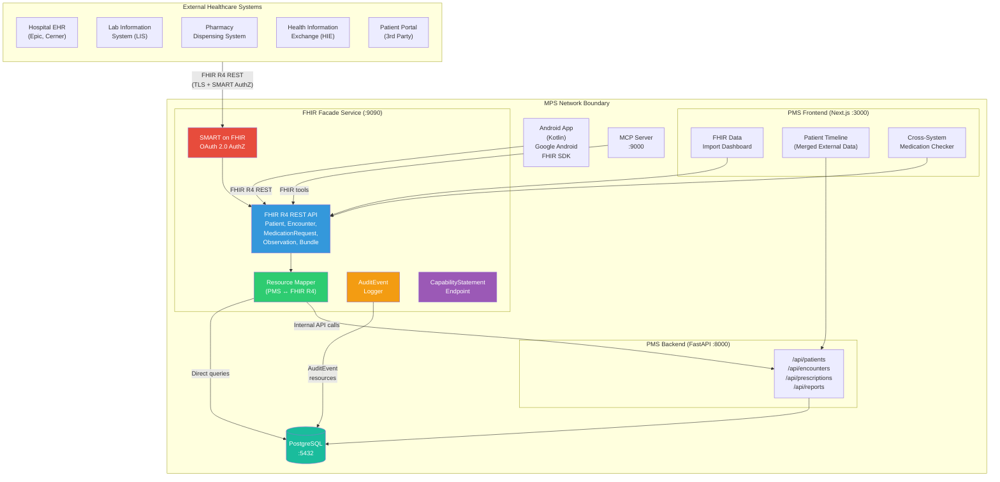

# Product Requirements Document: FHIR Integration into Patient Management System (PMS)

**Document ID:** PRD-PMS-FHIR-001
**Version:** 1.0
**Date:** February 21, 2026
**Author:** Ammar (CEO, MPS Inc.)
**Status:** Draft

---

## 1. Executive Summary

FHIR (Fast Healthcare Interoperability Resources) is the modern healthcare data interoperability standard developed by HL7 International. It defines a RESTful API and a set of over 150 resource types — including Patient, Encounter, Observation, MedicationRequest, and Condition — that represent discrete healthcare concepts using JSON and XML. FHIR R4, finalized in 2018, is the most widely adopted version globally and carries normative status guaranteeing backward compatibility. As of 2025, over 70% of countries report active FHIR use, and the CMS Prior Authorization Rule mandates FHIR-based APIs for US healthcare organizations by January 2026.

Integrating FHIR into the PMS transforms the system from a closed, proprietary patient management tool into an **interoperable healthcare platform** that can exchange clinical data with external EHR systems, health information exchanges (HIEs), pharmacy networks, lab systems, and insurance payers using the industry-standard protocol. This enables bi-directional data flow: the PMS can import patient histories from referring providers, and external systems can query PMS clinical data through standardized FHIR endpoints.

For a healthcare PMS handling protected health information (PHI), FHIR provides a standards-based security framework through SMART on FHIR (OAuth 2.0 scopes for clinical data), TLS encryption requirements, and AuditEvent resources for compliance logging. Combined with the existing MCP integration (experiment 09), FHIR gives the PMS both internal AI interoperability (via MCP) and external healthcare system interoperability (via FHIR) — a complete interoperability strategy.

---

## 2. Problem Statement

The current PMS operates as a data silo with no standardized mechanism for exchanging clinical data with external healthcare systems:

- **No external interoperability:** When a patient transfers from another clinic, their medical history (allergies, medications, prior encounters) must be manually re-entered. There is no way to electronically import a patient's existing clinical record from an external EHR.
- **Proprietary API surface:** The PMS backend exposes `/api/patients`, `/api/encounters`, and `/api/prescriptions` as custom REST endpoints with proprietary schemas. External healthcare systems (hospital EHRs, lab information systems, pharmacy dispensing systems) cannot query or push data to the PMS without custom point-to-point integrations.
- **Regulatory risk:** The CMS Interoperability and Prior Authorization Final Rule (CMS-0057-F) requires FHIR-based APIs for prior authorization, patient access, and provider directory by January 2026. Without FHIR support, the PMS cannot participate in these mandated data exchanges.
- **Fragmented clinical data:** Patients visiting multiple providers have their clinical data scattered across systems. The PMS cannot aggregate a patient's complete medication list, allergy history, or problem list from external sources, leading to incomplete clinical pictures that increase the risk of adverse events.
- **No standards-based authorization for external access:** Third-party clinical applications (patient portals, telemedicine platforms, clinical decision support tools) cannot securely connect to PMS data. There is no SMART on FHIR authorization framework to grant scoped, patient-consented access to specific clinical data.

---

## 3. Proposed Solution

Build a **FHIR R4 Facade** over the existing PMS backend that exposes PMS clinical data as standards-compliant FHIR resources and provides the ability to consume external FHIR data. The facade translates between the PMS's internal data model (PostgreSQL tables) and FHIR R4 resource representations, while a SMART on FHIR authorization layer controls external access.

### 3.1 Architecture Overview

### 3.2 Deployment Model

- **Self-hosted FHIR Facade:** The FHIR layer runs as a FastAPI microservice within the existing Docker Compose stack, avoiding external cloud dependencies and keeping PHI on-premises.
- **No external FHIR server required:** Unlike full HAPI FHIR JPA deployments, the facade approach reuses the existing PostgreSQL database — the PMS remains the system of record, and the FHIR layer provides a standards-compliant view of that data.
- **HIPAA security envelope:** All external FHIR traffic terminates at the SMART on FHIR authorization layer with TLS 1.3, OAuth 2.0 scopes, and AuditEvent logging before reaching PMS data.
- **Docker container:** Single `pms-fhir` container in the existing `docker-compose.yml`, with environment variables for database connection, SMART configuration, and allowed external client registrations.

---

## 4. PMS Data Sources

The FHIR facade maps existing PMS APIs and database tables to FHIR R4 resources:

| PMS API / Data Source | FHIR R4 Resource | Direction | Description |
|---|---|---|---|
| `/api/patients` | `Patient` | Read/Write | Demographics, identifiers, contact info |
| `/api/encounters` | `Encounter` | Read/Write | Clinical visits, status, participants, dates |
| `/api/prescriptions` | `MedicationRequest` | Read/Write | Medication orders, dosage, prescriber |
| `/api/reports` | `DiagnosticReport` | Read | Lab results, clinical reports |
| Patient vitals (planned) | `Observation` | Read/Write | Blood pressure, heart rate, temperature |
| Allergy records (planned) | `AllergyIntolerance` | Read/Write | Drug allergies, food allergies, reactions |
| Problem list (planned) | `Condition` | Read/Write | Active diagnoses, resolved conditions |
| Clinical notes | `DocumentReference` | Read | Encounter notes, discharge summaries |
| Practitioner data | `Practitioner` | Read | Provider demographics, credentials |
| Organization data | `Organization` | Read | Clinic/facility information |

All resources are exposed through standard FHIR REST interactions: `read`, `search`, `create`, `update`, and via `Bundle` for batch operations. The `$everything` operation on `Patient` returns a complete clinical summary Bundle.

---

## 5. Component/Module Definitions

### 5.1 FHIR Resource Mapper

**Description:** Bidirectional translation layer between PMS internal data models and FHIR R4 resource representations using `fhir.resources` Pydantic models.

- **Input:** PMS SQLAlchemy models (Patient, Encounter, Prescription) or FHIR R4 JSON payloads
- **Output:** Validated FHIR R4 resources (for outbound) or PMS model instances (for inbound)
- **PMS APIs used:** `/api/patients`, `/api/encounters`, `/api/prescriptions`, `/api/reports`

### 5.2 FHIR R4 REST API

**Description:** FastAPI router implementing the FHIR R4 RESTful API specification — CRUD operations, search, `$everything`, and `CapabilityStatement`.

- **Input:** FHIR REST requests (GET, POST, PUT, DELETE) with FHIR search parameters
- **Output:** FHIR R4 JSON responses with proper `Bundle` wrapping for search results
- **PMS APIs used:** All PMS endpoints through the Resource Mapper

### 5.3 SMART on FHIR Authorization Server

**Description:** OAuth 2.0 authorization layer implementing SMART App Launch Framework v2.2 for external client authentication and scoped access to FHIR resources.

- **Input:** OAuth 2.0 authorization requests with SMART clinical scopes (e.g., `patient/Patient.read`, `user/Encounter.rs`)
- **Output:** Access tokens with embedded FHIR scopes, refresh tokens
- **PMS APIs used:** User/role data from PMS backend for access control decisions

### 5.4 AuditEvent Logger

**Description:** Records all FHIR interactions as FHIR `AuditEvent` resources for HIPAA compliance, tracking who accessed what patient data, when, and from which system.

- **Input:** FHIR request metadata (client identity, resource accessed, action, timestamp)
- **Output:** `AuditEvent` FHIR resources persisted to PostgreSQL
- **PMS APIs used:** None (direct database writes)

### 5.5 External Data Importer

**Description:** Client module that fetches patient data from external FHIR servers (hospital EHRs, HIEs) and merges it into the PMS, reconciling identifiers and detecting duplicates.

- **Input:** External FHIR server URL + patient identifier
- **Output:** Merged patient record in PMS with provenance tracking
- **PMS APIs used:** `/api/patients` (create/update), `/api/encounters` (create)

---

## 6. Non-Functional Requirements

### 6.1 Security and HIPAA Compliance

| Requirement | Implementation |
|---|---|
| Authentication | SMART on FHIR OAuth 2.0 with PKCE for public clients; client credentials for system-to-system |
| Authorization | FHIR clinical scopes (`patient/*.read`, `user/Encounter.rs`) enforced per-request |
| Encryption in transit | TLS 1.3 mandatory for all external FHIR endpoints |
| Encryption at rest | AES-256 for FHIR audit logs and cached resources in PostgreSQL |
| Audit logging | Every FHIR interaction generates an `AuditEvent` resource with actor, action, resource, and timestamp |
| PHI minimization | External queries return only requested resource types; `_elements` parameter support for field-level filtering |
| Access control | Role-based: clinicians get `user/*.cruds`, patients get `patient/*.read` on own data, system clients get scoped access |
| BAA compliance | Client registration requires BAA verification before granting FHIR access |
| Consent management | FHIR `Consent` resource tracks patient authorization for data sharing with specific external systems |

### 6.2 Performance

| Metric | Target |
|---|---|
| Single resource read | < 100ms (p95) |
| Search with 2 parameters | < 500ms (p95) |
| Patient `$everything` Bundle | < 2s for typical patient (< 500 resources) |
| Concurrent external connections | 50 simultaneous FHIR clients |
| Bundle batch operation | < 5s for 100 resources |
| Uptime | 99.9% for FHIR endpoints |

### 6.3 Infrastructure

| Component | Specification |
|---|---|
| FHIR Facade container | Python 3.12 + FastAPI + `fhir.resources` + Uvicorn |
| Memory | 512 MB minimum, 1 GB recommended |
| CPU | 2 vCPUs recommended |
| Storage | Shared PostgreSQL (existing); FHIR audit tables add ~100 MB/month |
| Docker | Added to existing `docker-compose.yml` as `pms-fhir` service |
| Networking | Internal Docker network for PMS backend; external port 9090 with TLS termination |

---

## 7. Implementation Phases

### Phase 1: FHIR Foundation (Sprints 1-3, ~6 weeks)

- Deploy FHIR Facade FastAPI service in Docker
- Implement `CapabilityStatement` endpoint
- Build Resource Mapper for `Patient` and `Encounter` (read-only)
- Implement FHIR search with basic parameters (`_id`, `name`, `date`)
- Add AuditEvent logging for all FHIR interactions
- Write unit tests with mock FHIR resources using `fhir.resources`
- Validate FHIR conformance with official HL7 test suite

### Phase 2: Full CRUD + SMART AuthZ (Sprints 4-6, ~6 weeks)

- Extend Resource Mapper to `MedicationRequest`, `Observation`, `Condition`, `AllergyIntolerance`
- Implement full CRUD (create, read, update, delete) for all mapped resources
- Build SMART on FHIR authorization server (OAuth 2.0 + PKCE)
- Implement `Patient/$everything` operation
- Add `Bundle` support for batch operations
- Integrate external client registration workflow
- Build FHIR Import Dashboard in Next.js frontend
- Add Android FHIR SDK integration for mobile

### Phase 3: External Interoperability (Sprints 7-9, ~6 weeks)

- Build External Data Importer for fetching patient data from external FHIR servers
- Implement patient identity matching and deduplication (MPI-lite)
- Add Subscription resource for real-time notifications to external systems
- Build cross-system medication reconciliation using merged FHIR data
- Connect to FHIR test servers (HAPI public server, Logica Health sandbox)
- Performance tuning, load testing, and security penetration testing
- Document FHIR conformance profile and publish implementation guide

---

## 8. Success Metrics

| Metric | Target | Measurement Method |
|---|---|---|
| FHIR R4 conformance score | > 95% on HL7 Touchstone tests | Automated conformance test suite |
| External system connections | 3+ live integrations within 6 months | Integration registry count |
| Patient data import time | < 30s for complete history import | APM latency tracking |
| Manual data re-entry reduction | 80% reduction in duplicate data entry | Staff survey + task time comparison |
| FHIR API availability | 99.9% uptime | Uptime monitoring (Prometheus) |
| Audit compliance | 100% of FHIR interactions logged | AuditEvent count vs request count |
| SMART authorization success rate | > 99% for valid credentials | OAuth metrics dashboard |
| Developer integration time | < 2 days for new external client | Onboarding time tracking |

---

## 9. Risks and Mitigations

| Risk | Impact | Mitigation |
|---|---|---|
| FHIR mapping complexity: PMS schema doesn't perfectly align with FHIR resource structure | Medium — incomplete or lossy data mapping | Use FHIR extensions for PMS-specific fields; document mapping gaps; validate with clinicians |
| External systems sending malformed FHIR data | High — data corruption, import failures | Validate all inbound resources with `fhir.resources` Pydantic models; reject non-conformant data with `OperationOutcome` errors |
| SMART on FHIR implementation complexity | Medium — delays in Phase 2 | Use existing OAuth 2.0 libraries (`authlib`); start with client credentials flow, add PKCE later |
| Patient identity matching errors during import | High — wrong patient data merged | Implement probabilistic matching with manual review queue; never auto-merge without confidence threshold |
| Performance degradation with FHIR Bundle operations | Medium — slow imports of large patient records | Paginate `$everything` responses; implement async import for large Bundles; add Redis caching for frequently accessed resources |
| Regulatory changes to FHIR requirements | Low — need to update conformance | Design facade to be version-aware; plan for FHIR R5/R6 support via versioned endpoints (`/fhir/r4/`, `/fhir/r5/`) |
| External FHIR servers with inconsistent implementations | Medium — failed interoperability | Test against multiple public FHIR test servers; implement tolerant reader pattern for inbound data |

---

## 10. Dependencies

| Dependency | Type | Version | Purpose |
|---|---|---|---|
| `fhir.resources` | Python package | 8.x | FHIR R4 Pydantic models for validation and serialization |
| `fhir-core` | Python package | Latest | Core FHIR primitives (Pydantic v2 based) |
| FastAPI | Python framework | 0.110+ | FHIR REST API server (shared with PMS backend) |
| `authlib` | Python package | 1.x | OAuth 2.0 / SMART on FHIR authorization |
| PostgreSQL | Database | 16+ | Existing PMS database + FHIR audit tables |
| Google Android FHIR SDK | Kotlin library | 1.x | Offline-capable FHIR on Android |
| `@beda.software/fhir-react` | npm package | Latest | FHIR resource rendering in Next.js |
| HAPI FHIR Public Test Server | External service | R4 | Integration testing against reference implementation |
| Logica Health Sandbox | External service | R4 | Multi-system interoperability testing |
| HL7 Touchstone | External service | — | FHIR conformance validation |

---

## 11. Comparison with Existing Experiments

| Aspect | FHIR (This Experiment) | MCP (Experiment 09) | Sanford Guide (Experiment 11) |
|---|---|---|---|
| **Primary purpose** | External healthcare system interoperability | Internal AI-to-PMS integration | Clinical decision support for antimicrobials |
| **Standard body** | HL7 International | Linux Foundation (AAIF) | Sanford Guide (proprietary) |
| **Protocol** | FHIR R4 REST API (HTTP/JSON) | JSON-RPC over Streamable HTTP | REST API (HTTPS) |
| **Data direction** | Bidirectional (import + export) | Inbound (AI reads PMS data) | Inbound (PMS queries treatment data) |
| **Authorization** | SMART on FHIR (OAuth 2.0 + clinical scopes) | OAuth 2.1 | API key |
| **Complementarity** | FHIR handles external-facing interoperability; MCP handles internal AI integration. Together they provide complete inbound + outbound data exchange. | MCP can expose FHIR resources as MCP tools, allowing AI agents to query external systems via FHIR. | Sanford Guide data can be represented as FHIR `MedicationKnowledge` resources, making treatment recommendations queryable via standard FHIR search. |

FHIR and MCP are highly complementary: MCP provides the protocol for AI agents to discover and invoke PMS capabilities, while FHIR provides the data format and API standard for exchanging clinical data with external healthcare systems. The MCP server (experiment 09) can be extended with FHIR-aware tools that allow AI agents to query external FHIR servers or validate FHIR resources.

---

## 12. Research Sources

### Official Documentation & Specification
- [HL7 FHIR Overview](https://www.hl7.org/fhir/overview.html) — Official FHIR standard overview, resource types, and REST specification
- [FHIR Security Module](https://hl7.org/fhir/security.html) — Security labels, access control, encryption, and audit requirements
- [SMART App Launch v2.2](https://build.fhir.org/ig/HL7/smart-app-launch/app-launch.html) — OAuth 2.0 authorization framework for FHIR applications
- [FHIR v6.0.0 Ballot (R6 Preview)](https://build.fhir.org/) — Upcoming FHIR R6 specification and normative resource status

### Architecture & Implementation
- [Build FHIR API with FastAPI (WellAlly)](https://www.wellally.tech/blog/build-fhir-api-with-fastapi) — FastAPI FHIR server implementation guide with fhir.resources
- [fhir.resources on PyPI](https://pypi.org/project/fhir.resources/) — Python Pydantic models for FHIR R4/R5 validation and serialization
- [Google Android FHIR SDK](https://developers.google.com/open-health-stack/android-fhir) — Kotlin libraries for offline-capable mobile FHIR apps

### Security & Compliance
- [FHIR and HIPAA: Secure Health APIs (Clindcast)](https://www.clindcast.com/fhir-and-hipaa-building-secure-and-compliant-health-apis/) — HIPAA compliance requirements for FHIR implementations
- [FHIR Security Best Practices (Kodjin)](https://kodjin.com/blog/fhir-security-best-practices/) — Real-world security patterns for FHIR servers

### Ecosystem & Adoption
- [Healthcare API Interoperability Guide 2026 (Clindcast)](https://www.clindcast.com/healthcare-api-interoperability-and-fhir-guide-2026/) — FHIR adoption trends, CMS mandates, and R6 roadmap
- [Top FHIR Vendors and Tools 2025 (Clindcast)](https://www.clindcast.com/top-fhir-vendors-and-tools-to-watch-in-2025/) — HAPI FHIR, Firely, Aidbox, Smile CDR comparison

---

## 13. Appendix: Related Documents

- [FHIR Setup Guide](16-FHIR-PMS-Developer-Setup-Guide.md) — Step-by-step FHIR Facade deployment and PMS integration
- [FHIR Developer Tutorial](16-FHIR-Developer-Tutorial.md) — Hands-on onboarding: build your first FHIR resource mapping end-to-end
- [PRD: MCP PMS Integration](09-PRD-MCP-PMS-Integration.md) — Complementary internal AI interoperability protocol
- [PRD: Sanford Guide PMS Integration](11-PRD-SanfordGuide-PMS-Integration.md) — Clinical decision support that could expose data as FHIR resources
- [HL7 FHIR Official Documentation](https://www.hl7.org/fhir/) — Complete FHIR R4 specification
- [SMART on FHIR Documentation](https://docs.smarthealthit.org/) — SMART App Launch authorization framework
