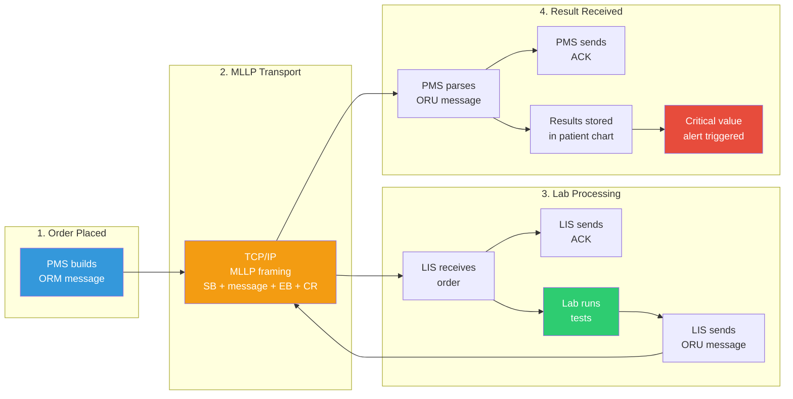
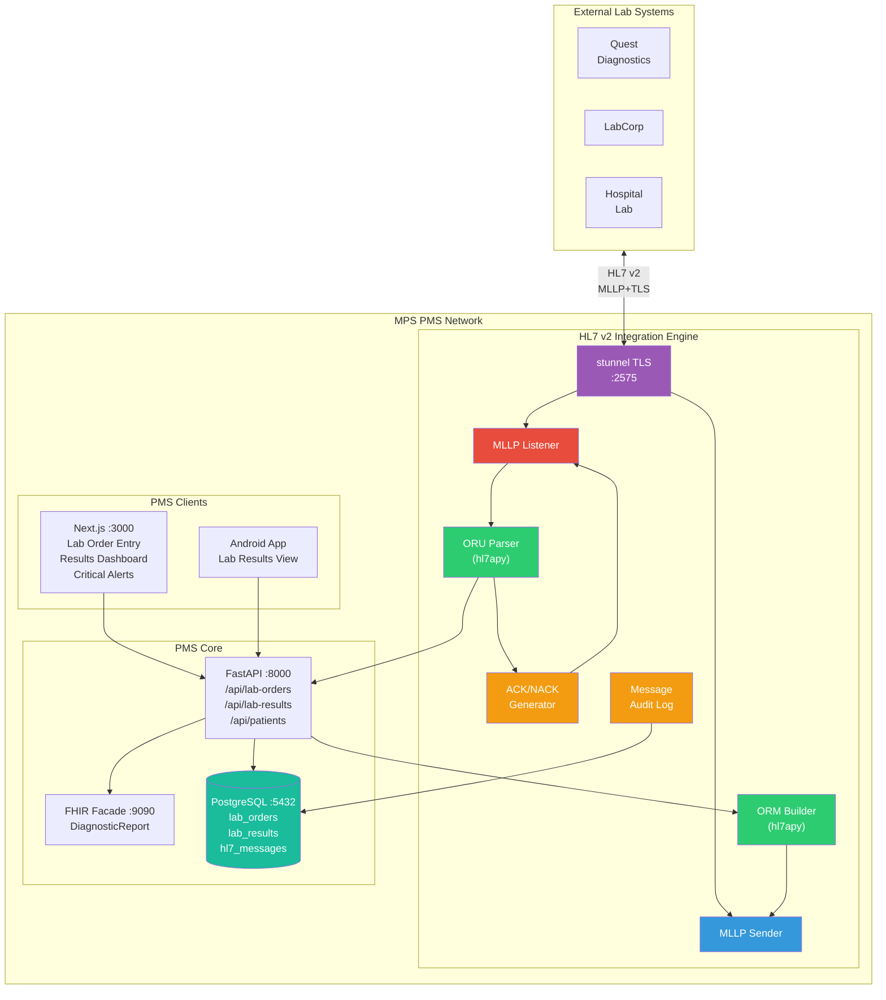

# HL7 v2 LIS Messaging Developer Onboarding Tutorial

**Welcome to the MPS PMS HL7 v2 LIS Integration Team**

This tutorial will take you from zero to building your first HL7 v2 lab integration with the PMS. By the end, you will understand how HL7 v2 messaging works, have a running local environment, and have built and tested a complete lab order-to-result cycle end-to-end.

**Document ID:** PMS-EXP-HL7V2LIS-002
**Version:** 1.0
**Date:** February 21, 2026
**Applies To:** PMS project (all platforms)
**Prerequisite:** [HL7v2LIS Setup Guide](17-HL7v2LIS-PMS-Developer-Setup-Guide.md)
**Estimated time:** 2-3 hours
**Difficulty:** Beginner-friendly

---

## What You Will Learn

1. What HL7 v2 messaging is and why labs still use it
2. How the MLLP protocol frames and transmits HL7 messages over TCP
3. How HL7 v2 message segments (MSH, PID, ORC, OBR, OBX) are structured
4. How to parse an inbound ORU (lab result) message using `hl7apy`
5. How to build an outbound ORM (lab order) message from PMS data
6. How to implement ACK/NACK acknowledgment responses
7. How to detect and alert on critical lab values (HH/LL flags)
8. How to bridge HL7 v2 results to FHIR DiagnosticReport resources
9. How to audit-log all HL7 transactions for HIPAA compliance
10. How to test with synthetic HL7 messages and public test servers

---

## Part 1: Understanding HL7 v2 Messaging (15 min read)

### 1.1 What Problem Does HL7 v2 Solve?

Picture this daily workflow at a clinic using the PMS:

1. **9:00 AM** — Dr. Reyes orders a CBC and BMP for patient Maria during her encounter. She writes "CBC, BMP" on a paper lab requisition form.
2. **9:15 AM** — The front desk faxes the requisition to the reference lab.
3. **9:20 AM** — The lab receives the fax, manually enters the order into their LIS (Laboratory Information System), and labels the sample tubes.
4. **11:00 AM** — The lab completes the tests. A lab tech prints the results and faxes them back to the clinic.
5. **11:30 AM** — A medical assistant picks up the fax, walks to a computer, and manually types each result value into the PMS patient chart.
6. **11:45 AM** — Dr. Reyes finally reviews the results — 2 hours and 45 minutes after ordering, with two manual transcription steps where errors could occur.

**Worse**: Maria's potassium came back critically high at 6.8 mEq/L (normal: 3.5-5.0). This is a medical emergency that sat in a fax tray for 30 minutes before anyone noticed.

HL7 v2 messaging eliminates every manual step in this workflow:

1. **9:00 AM** — Dr. Reyes places the order in the PMS → an **ORM message** is instantly transmitted to the LIS
2. **11:00 AM** — The lab completes tests → an **ORU message** with all results is instantly transmitted to the PMS
3. **11:00 AM** — The PMS parses the results, stores them in Maria's chart, and **immediately alerts** Dr. Reyes about the critical potassium value

Total time: 2 hours (sample processing, which is irreducible). Manual transcription steps: zero. Critical value notification delay: zero.

### 1.2 How HL7 v2 Works — The Key Pieces



**HL7 v2 has three core concepts:**

1. **Messages & Segments** — An HL7 v2 message is a sequence of pipe-delimited segments. Each segment starts with a 3-letter code (MSH, PID, OBR, OBX) followed by fields separated by `|`. Think of it like a structured text file where each line is a segment and each `|` separates a field.

2. **MLLP Transport** — Messages travel over TCP connections using MLLP (Minimal Lower Layer Protocol), which wraps each message in framing bytes: `0x0B` (start), message content, `0x1C` (end), `0x0D` (carriage return). This tells the receiver where one message ends and the next begins.

3. **ACK/NACK** — Every message requires an acknowledgment. The receiver sends back an ACK (accepted) or NACK (rejected) so the sender knows the message was processed. If no ACK arrives within the timeout, the sender retries.

### 1.3 How HL7 v2 Fits with Other PMS Technologies

| Technology | Experiment | Role | Relationship to HL7 v2 |
|---|---|---|---|
| FHIR R4 | 16 | Modern REST-based interoperability | FHIR is the modern successor; HL7 v2 covers legacy systems that haven't migrated. The HL7v2-to-FHIR bridge converts results to DiagnosticReport resources. |
| MCP | 09 | AI-to-PMS integration | MCP tools can expose lab order/result operations to AI agents for clinical decision support workflows. |
| MedASR | 07 | Clinical speech-to-text | Clinicians can dictate lab orders ("order a CBC and BMP for this patient") which MedASR transcribes and triggers the ORM message. |
| OpenClaw | 05 | Agentic workflow automation | OpenClaw agents can automate lab order follow-up: check result status, escalate overdue results, trigger reorders. |
| Sanford Guide | 11 | Antimicrobial CDS | Culture and sensitivity results from HL7 ORU feed into Sanford Guide for antimicrobial treatment recommendations. |
| Adaptive Thinking | 08 | AI reasoning | Lab result trends can be analyzed by AI with adaptive effort routing — simple results use Haiku, complex panels use Opus. |

### 1.4 Key Vocabulary

| Term | Meaning |
|---|---|
| **HL7 v2** | Health Level Seven Version 2 — the dominant messaging standard for healthcare data exchange (30+ years, 80%+ global adoption) |
| **MLLP** | Minimal Lower Layer Protocol — TCP-based framing protocol for transporting HL7 v2 messages (SB/EB/CR bytes) |
| **Segment** | A single line in an HL7 message, identified by a 3-letter code (MSH, PID, OBR, OBX) with pipe-delimited fields |
| **MSH** | Message Header — first segment in every message; contains sender, receiver, message type, version, control ID |
| **PID** | Patient Identification — patient demographics: MRN, name, DOB, gender |
| **ORC** | Common Order — order control information: order number, action (new, cancel, hold), ordering provider |
| **OBR** | Observation Request — describes the test panel or battery being ordered/reported (CBC, BMP, etc.) |
| **OBX** | Observation Result — a single test result: test code, value, units, reference range, abnormal flag |
| **ORM** | Order Message (ORM^O01) — outbound message from PMS to LIS containing a lab order |
| **ORU** | Observation Result Unsolicited (ORU^R01) — inbound message from LIS to PMS containing test results |
| **ACK** | Acknowledgment message — confirms receipt and processing of an HL7 message (AA=accept, AE=error, AR=reject) |
| **Abnormal Flag** | Code in OBX-8 indicating result status: N=Normal, H=High, L=Low, HH=Critical High, LL=Critical Low |

### 1.5 Our Architecture



---

## Part 2: Environment Verification (15 min)

### 2.1 Checklist

1. **hl7apy installed:**
   ```bash
   python3 -c "from hl7apy.core import Message; print('hl7apy OK')"
   # Expected: hl7apy OK
   ```

2. **python-hl7 installed:**
   ```bash
   python3 -c "import hl7; print(f'python-hl7 {hl7.__version__} OK')"
   # Expected: python-hl7 0.4.x OK
   ```

3. **PMS Backend running:**
   ```bash
   curl -s http://localhost:8000/docs | head -3
   # Expected: HTML
   ```

4. **PostgreSQL accepting connections:**
   ```bash
   docker exec pms-db pg_isready
   # Expected: accepting connections
   ```

5. **HL7 engine running:**
   ```bash
   docker logs pms-hl7-engine --tail 3
   # Expected: "MLLP listener started on 0.0.0.0:2575"
   ```

6. **Port 2575 reachable:**
   ```bash
   nc -z localhost 2575 && echo "MLLP port open" || echo "MLLP port closed"
   # Expected: MLLP port open
   ```

### 2.2 Quick Test

Send a minimal HL7 message and verify ACK:

```bash
# Build a minimal ORU message
MSG="MSH|^~\&|TEST_LIS|TEST_LAB|PMS_LAB|MPS_PMS|20260221120000||ORU^R01|QTEST001|P|2.5.1\rPID|1||99999^^^MPS_PMS^MR||Quick^Test||20000101|M\rOBR|1|QT001|QF001|GLU^Glucose|||20260221110000|||||||||Dr. Test||||||||F\rOBX|1|NM|GLU^Glucose||95|mg/dL|70-100|N||F"

# Wrap in MLLP framing and send
python3 -c "
import socket
msg = '$MSG'
sb, eb, cr = b'\x0b', b'\x1c', b'\x0d'
data = sb + msg.encode() + eb + cr
s = socket.socket(socket.AF_INET, socket.SOCK_STREAM)
s.connect(('localhost', 2575))
s.sendall(data)
resp = s.recv(4096)
print('Response:', resp[1:-2].decode())
s.close()
"
# Expected: Response containing MSA|AA|QTEST001
```

---

## Part 3: Build Your First Integration (45 min)

### 3.1 What We Are Building

We will build a **complete ORU parser** that:

1. Receives an HL7 v2 ORU^R01 message (lab results from a CBC panel)
2. Extracts patient identity from PID segment
3. Extracts panel info from OBR segment
4. Extracts individual test results from OBX segments
5. Detects critical values (HH/LL abnormal flags)
6. Stores results in the PMS via `/api/lab-results`
7. Returns a proper ACK message

### 3.2 Step 1: Understand HL7 v2 Message Anatomy

Here is a real HL7 v2 ORU^R01 message. Let's dissect it:

```
MSH|^~\&|LAB_LIS|QUEST|PMS_LAB|MPS_PMS|20260221120000||ORU^R01|MSG100|P|2.5.1
PID|1||12345^^^MPS_PMS^MR||Martinez^Maria||19900315|F|||123 Main St^^Austin^TX^78701
OBR|1|ORD001|FIL001|CBC^Complete Blood Count^^^CBC|||20260221110000|||||||||Dr. Reyes||||||||F
OBX|1|NM|WBC^White Blood Cell Count||7.5|10*3/uL|4.5-11.0|N|||F
OBX|2|NM|RBC^Red Blood Cell Count||4.8|10*6/uL|4.0-5.5|N|||F
OBX|3|NM|HGB^Hemoglobin||14.2|g/dL|12.0-16.0|N|||F
OBX|4|NM|HCT^Hematocrit||42.1|%|36.0-46.0|N|||F
OBX|5|NM|PLT^Platelet Count||250|10*3/uL|150-400|N|||F
```

**Segment breakdown:**

| Segment | Fields (key ones) | Purpose |
|---|---|---|
| `MSH` | Field separator, sending app/facility, receiving app/facility, timestamp, message type, control ID, version | Message envelope — who sent it, what type, unique ID |
| `PID` | Set ID, MRN (PID-3), patient name (PID-5), DOB (PID-7), gender (PID-8) | Patient identity — used to match results to PMS patient |
| `OBR` | Set ID, placer order # (OBR-2), filler order # (OBR-3), test code (OBR-4), observation date (OBR-7), result status (OBR-25) | Test panel metadata — which test panel, when collected |
| `OBX` | Set ID, value type (OBX-2), test code (OBX-3), value (OBX-5), units (OBX-6), reference range (OBX-7), abnormal flag (OBX-8), result status (OBX-11) | Individual test result — one OBX per test in the panel |

### 3.3 Step 2: Parse with hl7apy

Create `tutorial_parse.py`:

```python
"""Tutorial: Parse an HL7 v2 ORU message step by step."""

from hl7apy.parser import parse_message

# Sample ORU message (segments separated by \r)
raw = (
    "MSH|^~\\&|LAB_LIS|QUEST|PMS_LAB|MPS_PMS|20260221120000||ORU^R01|MSG100|P|2.5.1\r"
    "PID|1||12345^^^MPS_PMS^MR||Martinez^Maria||19900315|F\r"
    "OBR|1|ORD001|FIL001|CBC^Complete Blood Count|||20260221110000|||||||||Dr. Reyes||||||||F\r"
    "OBX|1|NM|WBC^White Blood Cell Count||7.5|10*3/uL|4.5-11.0|N|||F\r"
    "OBX|2|NM|RBC^Red Blood Cell Count||4.8|10*6/uL|4.0-5.5|N|||F\r"
    "OBX|3|NM|HGB^Hemoglobin||14.2|g/dL|12.0-16.0|N|||F\r"
    "OBX|4|NM|PLT^Platelet Count||250|10*3/uL|150-400|N|||F\r"
    "OBX|5|NM|K^Potassium||6.8|mEq/L|3.5-5.0|HH|||F"
)

msg = parse_message(raw, find_groups=False)

# --- Extract MSH ---
print("=== Message Header (MSH) ===")
print(f"  Sending: {msg.msh.msh_3.value} @ {msg.msh.msh_4.value}")
print(f"  Type: {msg.msh.msh_9.value}")
print(f"  Control ID: {msg.msh.msh_10.value}")
print(f"  Version: {msg.msh.msh_12.value}")

# --- Extract PID ---
pid = [s for s in msg.children if s.name == "PID"][0]
print("\n=== Patient (PID) ===")
print(f"  MRN: {pid.pid_3.value}")
print(f"  Name: {pid.pid_5.value}")
print(f"  DOB: {pid.pid_7.value}")
print(f"  Gender: {pid.pid_8.value}")

# --- Extract OBR ---
obr = [s for s in msg.children if s.name == "OBR"][0]
print("\n=== Test Panel (OBR) ===")
print(f"  Placer Order #: {obr.obr_2.value}")
print(f"  Filler Order #: {obr.obr_3.value}")
print(f"  Test: {obr.obr_4.value}")
print(f"  Result Status: {obr.obr_25.value}")

# --- Extract OBX results ---
obx_segments = [s for s in msg.children if s.name == "OBX"]
print(f"\n=== Results ({len(obx_segments)} tests) ===")
critical_results = []
for obx in obx_segments:
    test_name = obx.obx_3.value
    value = obx.obx_5.value
    units = obx.obx_6.value
    ref_range = obx.obx_7.value
    flag = obx.obx_8.value if obx.obx_8 and obx.obx_8.value else "N"

    flag_display = {
        "N": "Normal", "H": "HIGH", "L": "LOW",
        "HH": "** CRITICAL HIGH **", "LL": "** CRITICAL LOW **"
    }.get(flag, flag)

    print(f"  {test_name}: {value} {units} (ref: {ref_range}) [{flag_display}]")

    if flag in ("HH", "LL"):
        critical_results.append((test_name, value, units, flag))

if critical_results:
    print("\n!!! CRITICAL RESULTS DETECTED !!!")
    for name, val, unit, flg in critical_results:
        print(f"  ALERT: {name} = {val} {unit} ({flg})")
```

Run it:

```bash
python3 tutorial_parse.py
```

Expected output:

```
=== Message Header (MSH) ===
  Sending: LAB_LIS @ QUEST
  Type: ORU^R01
  Control ID: MSG100
  Version: 2.5.1

=== Patient (PID) ===
  MRN: 12345^^^MPS_PMS^MR
  Name: Martinez^Maria
  DOB: 19900315
  Gender: F

=== Test Panel (OBR) ===
  Placer Order #: ORD001
  Filler Order #: FIL001
  Test: CBC^Complete Blood Count
  Result Status: F

=== Results (5 tests) ===
  WBC^White Blood Cell Count: 7.5 10*3/uL (ref: 4.5-11.0) [Normal]
  RBC^Red Blood Cell Count: 4.8 10*6/uL (ref: 4.0-5.5) [Normal]
  HGB^Hemoglobin: 14.2 g/dL (ref: 12.0-16.0) [Normal]
  PLT^Platelet Count: 250 10*3/uL (ref: 150-400) [Normal]
  K^Potassium: 6.8 mEq/L (ref: 3.5-5.0) [** CRITICAL HIGH **]

!!! CRITICAL RESULTS DETECTED !!!
  ALERT: K^Potassium = 6.8 mEq/L (HH)
```

### 3.4 Step 3: Build an ORM Order Message

Create `tutorial_build.py`:

```python
"""Tutorial: Build an HL7 v2 ORM^O01 message for a lab order."""

from datetime import datetime, timezone


def build_lab_order(patient: dict, tests: list[str], provider: str, order_id: int) -> str:
    """Build a complete ORM^O01 message."""
    now = datetime.now(timezone.utc).strftime("%Y%m%d%H%M%S")
    ctrl_id = f"PMS{order_id:06d}"

    # MSH - Message Header
    msh = f"MSH|^~\\&|PMS_LAB|MPS_PMS|LIS|QUEST|{now}||ORM^O01|{ctrl_id}|P|2.5.1"

    # PID - Patient Identification
    dob = patient["dob"].replace("-", "")
    gender = {"male": "M", "female": "F"}.get(patient.get("gender", ""), "U")
    pid = f"PID|1||{patient['mrn']}^^^MPS_PMS^MR||{patient['last_name']}^{patient['first_name']}||{dob}|{gender}"

    # ORC + OBR pairs (one per test)
    orders = []
    for i, test in enumerate(tests, 1):
        placer = f"{order_id}-{i}"
        orc = f"ORC|NW|{placer}|||CM||||{now}|||{provider}"
        obr = f"OBR|{i}|{placer}||{test}|||{now}"
        orders.extend([orc, obr])

    segments = [msh, pid] + orders
    return "\r".join(segments)


# Build an order for Maria
patient = {
    "mrn": "12345",
    "first_name": "Maria",
    "last_name": "Martinez",
    "dob": "1990-03-15",
    "gender": "female",
}

message = build_lab_order(
    patient=patient,
    tests=["CBC^Complete Blood Count", "BMP^Basic Metabolic Panel"],
    provider="Dr. Reyes",
    order_id=1001,
)

print("=== Generated ORM^O01 Message ===")
for segment in message.split("\r"):
    print(segment)

print(f"\n=== Message Stats ===")
print(f"  Segments: {len(message.split(chr(13)))}")
print(f"  Tests ordered: 2 (CBC, BMP)")
print(f"  Message size: {len(message)} bytes")
```

Run it:

```bash
python3 tutorial_build.py
```

### 3.5 Step 4: Write Unit Tests

Create `tests/test_oru_parse.py`:

```python
"""Tests for ORU message parsing."""

from hl7apy.parser import parse_message


SAMPLE_ORU = (
    "MSH|^~\\&|LAB|QUEST|PMS|MPS|20260221||ORU^R01|T001|P|2.5.1\r"
    "PID|1||12345^^^MPS^MR||Doe^Jane||19900315|F\r"
    "OBR|1|O1|F1|CBC^CBC|||20260221\r"
    "OBX|1|NM|WBC^WBC||7.5|K/uL|4.5-11|N|||F\r"
    "OBX|2|NM|K^Potassium||6.8|mEq/L|3.5-5.0|HH|||F"
)


def test_parse_msh():
    msg = parse_message(SAMPLE_ORU, find_groups=False)
    assert msg.msh.msh_9.value == "ORU^R01"
    assert msg.msh.msh_10.value == "T001"


def test_parse_pid():
    msg = parse_message(SAMPLE_ORU, find_groups=False)
    pid = [s for s in msg.children if s.name == "PID"][0]
    assert "12345" in pid.pid_3.value
    assert "Doe" in pid.pid_5.value


def test_parse_obx_results():
    msg = parse_message(SAMPLE_ORU, find_groups=False)
    obx_list = [s for s in msg.children if s.name == "OBX"]
    assert len(obx_list) == 2

    # First result: WBC - Normal
    assert obx_list[0].obx_5.value == "7.5"
    assert obx_list[0].obx_8.value == "N"

    # Second result: Potassium - Critical High
    assert obx_list[1].obx_5.value == "6.8"
    assert obx_list[1].obx_8.value == "HH"


def test_detect_critical_values():
    msg = parse_message(SAMPLE_ORU, find_groups=False)
    obx_list = [s for s in msg.children if s.name == "OBX"]

    criticals = [
        obx for obx in obx_list
        if obx.obx_8 and obx.obx_8.value in ("HH", "LL")
    ]
    assert len(criticals) == 1
    assert "Potassium" in criticals[0].obx_3.value
```

Run:

```bash
python3 -m pytest tests/test_oru_parse.py -v
```

### 3.6 Step 5: Test the Complete Flow

```bash
# 1. Create a patient in PMS
curl -s -X POST http://localhost:8000/api/patients \
  -H "Content-Type: application/json" \
  -d '{"first_name":"Maria","last_name":"Martinez","gender":"female","date_of_birth":"1990-03-15"}' \
  | jq '.id'

# 2. Send synthetic ORU result to MLLP listener (use the script from Part 2)

# 3. Check results appeared in PMS
curl -s "http://localhost:8000/api/lab-results?patient_id=1" | jq '.[].test_name'

# 4. Check critical alert
curl -s "http://localhost:8000/api/lab-results/critical" | jq '.'

# 5. Check audit trail
docker exec pms-db psql -U pms -d pms -c \
  "SELECT direction, message_type, ack_status FROM hl7_messages ORDER BY processed_at DESC LIMIT 3;"
```

---

## Part 4: Evaluating Strengths and Weaknesses (15 min)

### 4.1 Strengths

- **Universal lab connectivity:** HL7 v2 is used by 80%+ of healthcare systems worldwide. Every major reference lab (Quest, LabCorp) and hospital LIS supports it. It's the lingua franca of lab messaging.
- **Battle-tested reliability:** 30+ years of production use in thousands of hospitals and labs. The protocol is simple, well-understood, and has proven failure modes with established recovery patterns.
- **Low infrastructure requirements:** MLLP runs over basic TCP — no HTTP servers, no REST frameworks, no complex middleware. A simple asyncio TCP server handles the transport.
- **Real-time messaging:** Results arrive the moment the lab completes analysis. No polling, no batch files, no delays.
- **Comprehensive audit trail:** Every message has a unique control ID and requires an ACK, creating a natural audit trail of every lab transaction.
- **Python library support:** `hl7apy` provides full parsing, building, and validation for all HL7 v2 versions (2.1-2.8.2), with built-in MLLP server/client support.

### 4.2 Weaknesses

- **No native encryption:** MLLP transmits plaintext. TLS must be added externally via stunnel, VPN, or custom TLS wrapper — adding infrastructure complexity.
- **Pipe-delimited format is fragile:** A misplaced `|` or `\r` can break an entire message. There's no schema validation like JSON Schema or XML Schema (though `hl7apy` helps with validation).
- **Vendor-specific variations:** Despite the standard, labs often send non-standard messages with missing segments, extra fields, or custom encoding. Every new LIS connection requires message testing and parser tuning.
- **No native REST support:** HL7 v2 is TCP-based, not HTTP-based. It can't be called from a web browser or REST client directly — you need the MLLP engine as an intermediary.
- **Limited query capability:** HL7 v2 is push-based (event-driven). You can't query a LIS for "all results for patient X" — you only receive results when the LIS sends them. FHIR is better for on-demand queries.
- **Legacy technology:** While still dominant, HL7 v2 is being gradually replaced by FHIR. New lab systems increasingly offer FHIR interfaces alongside HL7 v2.

### 4.3 When to Use HL7 v2 vs Alternatives

| Scenario | Use HL7 v2 | Use FHIR | Use Direct API |
|---|---|---|---|
| Connecting to Quest/LabCorp reference lab | HL7 v2 ORM/ORU | — | — |
| Connecting to hospital LIS | HL7 v2 (most common) | If LIS supports FHIR | — |
| Patient data exchange with modern EHR | — | FHIR R4 REST | — |
| Point-of-care analyzer integration | HL7 v2 (if device supports) | — | Serial/USB protocol |
| On-demand lab result query | — | FHIR DiagnosticReport search | Internal PMS API |
| New lab system being built today | Consider both | FHIR preferred | — |
| Patient registration sync with HIS | HL7 v2 ADT | FHIR Patient | — |

**Rule of thumb:** If the external system only speaks HL7 v2 (which is most labs today), use HL7 v2. If it supports FHIR, prefer FHIR. If you need both, build the HL7v2-to-FHIR bridge.

### 4.4 HIPAA / Healthcare Considerations

| HIPAA Requirement | HL7 v2 Challenge | PMS Mitigation |
|---|---|---|
| Encryption in transit | MLLP transmits plaintext | stunnel TLS 1.3 wrapper on all external connections |
| Encryption at rest | Raw messages contain PHI | AES-256 encryption for `hl7_messages` table |
| Audit logging | HL7 has no built-in audit | Log every message with sender, receiver, timestamp, ACK status |
| Access control | MLLP has no authentication | IP allowlisting + API key per LIS endpoint |
| Minimum necessary | HL7 messages may contain extra PHI | Strip unnecessary segments before storage; only persist needed fields |
| Patient consent | No consent mechanism in HL7 v2 | Check PMS consent records before releasing data to external systems |
| Error handling | NACK messages could leak PHI | Sanitize all error messages — codes only, no patient data |

---

## Part 5: Debugging Common Issues (15 min read)

### Issue 1: MLLP Framing Errors

**Symptoms:** Parser receives garbled data; `hl7apy` raises `InvalidHL7Message`.

**Cause:** Missing or incorrect MLLP framing bytes (SB=0x0B, EB=0x1C, CR=0x0D).

**Fix:** Verify the raw bytes:

```python
data = received_bytes
print(f"First byte: 0x{data[0]:02x} (expected 0x0b)")
print(f"Last 2 bytes: 0x{data[-2]:02x} 0x{data[-1]:02x} (expected 0x1c 0x0d)")
```

### Issue 2: Segment Delimiter Mismatch

**Symptoms:** Parser sees entire message as one segment.

**Cause:** Message uses `\n` (LF) instead of `\r` (CR) as segment delimiter.

**Fix:** Normalize before parsing:

```python
raw_message = raw_message.replace("\n", "\r")
```

### Issue 3: Patient Not Found by MRN

**Symptoms:** Results parsed but not linked to any patient.

**Cause:** PID-3 MRN format from LIS doesn't match PMS patient ID.

**Fix:** Extract just the numeric MRN from the PID-3 field:

```python
# PID-3 may contain: "12345^^^MPS_PMS^MR"
# Extract just the ID portion before the first ^
mrn = pid_3_value.split("^")[0]
```

### Issue 4: OBX Value Type Mismatch

**Symptoms:** `hl7apy` validation error on OBX-2 (Value Type).

**Cause:** OBX-2 specifies the data type of OBX-5. Common types: NM (numeric), ST (string), TX (text), CE (coded entry). Parser may not handle all types.

**Fix:** Handle different OBX-2 types:

```python
value_type = obx.obx_2.value
if value_type == "NM":
    result_value = float(obx.obx_5.value)
elif value_type in ("ST", "TX"):
    result_value = str(obx.obx_5.value)
elif value_type == "CE":
    result_value = str(obx.obx_5.value)  # Coded entry
```

### Issue 5: ACK Not Received by LIS

**Symptoms:** LIS retransmits the same message repeatedly.

**Cause:** ACK is being generated but not sent back through the MLLP connection, or ACK has incorrect message control ID.

**Fix:** Verify ACK contains the original message's control ID in MSA-2:

```python
# ACK must reference the original message's MSH-10
original_ctrl_id = msg.msh.msh_10.value
ack = f"MSH|^~\\&|PMS|MPS|||{now}||ACK^R01|{now}|P|2.5.1\rMSA|AA|{original_ctrl_id}\r"
```

---

## Part 6: Practice Exercise (45 min)

### Option A: Build an ADT Message Handler

Add support for ADT^A01 (patient registration) and ADT^A03 (patient discharge) messages to sync patient demographics from a hospital HIS.

**Hints:**
1. ADT messages have: MSH, EVN (event), PID, PV1 segments
2. ADT^A01 should create/update a patient in the PMS via `/api/patients`
3. ADT^A03 should update the encounter status to "completed"
4. Use `msg.msh.msh_9.value` to detect message type

**Steps:**
1. Create `pms-hl7/app/parser/adt_parser.py`
2. Extract patient data from PID and visit data from PV1
3. Route ADT^A01 to patient create/update, ADT^A03 to encounter update
4. Test with a synthetic ADT^A01 message

### Option B: Build an HL7v2-to-FHIR Bridge

Convert parsed ORU results into FHIR DiagnosticReport and Observation resources.

**Hints:**
1. An OBR maps to a FHIR `DiagnosticReport` with `status: "final"`
2. Each OBX maps to a FHIR `Observation` with `valueQuantity`
3. Use `fhir.resources.R4B` for FHIR model creation
4. POST the FHIR resources to the FHIR Facade at `http://localhost:9090/fhir/r4/`

**Steps:**
1. Create `pms-hl7/app/bridges/hl7_to_fhir.py`
2. Map OBR fields to DiagnosticReport attributes
3. Map OBX fields to Observation `valueQuantity`, `code`, `referenceRange`
4. Bundle all Observations as `result` references in the DiagnosticReport
5. Test with the CBC ORU message from Part 3

### Option C: Build an Order Status Tracker

Track the lifecycle of lab orders from creation through result receipt.

**Hints:**
1. Order lifecycle: pending → sent → acknowledged → resulted
2. Correlate outbound ORM (placer order #) with inbound ORU (placer order # in OBR-2)
3. Update order status at each stage with timestamps
4. Build a simple status display showing all orders and their current state

**Steps:**
1. Add status tracking fields to the `lab_orders` table
2. Update status to "sent" when ORM is transmitted
3. Update status to "acknowledged" when ACK received
4. Update status to "resulted" when matching ORU arrives (match on OBR-2 placer order #)
5. Build a frontend component showing order status timeline

---

## Part 7: Development Workflow and Conventions

### 7.1 File Organization

```
pms-hl7/
├── app/
│   ├── main.py                     # Engine entry point
│   ├── config.py                   # Environment settings
│   ├── mllp/
│   │   ├── listener.py             # Inbound MLLP server
│   │   ├── sender.py               # Outbound MLLP client
│   │   └── framing.py              # SB/EB/CR byte handling
│   ├── parser/
│   │   ├── oru_parser.py           # ORU^R01 result parser
│   │   ├── adt_parser.py           # ADT^A01/A03 parser (future)
│   │   ├── ack_builder.py          # ACK/NACK generator
│   │   └── segment_extract.py      # Reusable segment field extractors
│   ├── builder/
│   │   ├── orm_builder.py          # ORM^O01 order message builder
│   │   └── segment_build.py        # Reusable segment constructors
│   ├── bridges/
│   │   └── hl7_to_fhir.py          # ORU → FHIR DiagnosticReport
│   ├── services/
│   │   └── audit.py                # Message audit logging
│   └── models/
│       ├── lab_order.py            # Order SQLAlchemy model
│       ├── lab_result.py           # Result SQLAlchemy model
│       └── hl7_message.py          # Audit trail model
├── tests/
│   ├── test_oru_parser.py
│   ├── test_orm_builder.py
│   ├── test_mllp_framing.py
│   └── fixtures/
│       ├── sample_oru_cbc.hl7
│       ├── sample_oru_bmp.hl7
│       └── sample_adt_a01.hl7
├── config/
│   ├── stunnel.conf
│   └── lis_endpoints.json
└── Dockerfile
```

### 7.2 Naming Conventions

| Item | Convention | Example |
|---|---|---|
| Parser files | `{message_type}_parser.py` | `oru_parser.py`, `adt_parser.py` |
| Builder files | `{message_type}_builder.py` | `orm_builder.py` |
| Parser functions | `parse_{message_type}_message()` | `parse_oru_message()` |
| Builder functions | `build_{message_type}_message()` | `build_orm_message()` |
| Test fixtures | `sample_{message_type}_{panel}.hl7` | `sample_oru_cbc.hl7` |
| Database tables | `lab_orders`, `lab_results`, `hl7_messages` | Snake_case, plural |
| API endpoints | `/api/lab-orders`, `/api/lab-results` | Kebab-case, plural |
| HL7 field access | `segment.field_name.value` | `obx.obx_5.value` |
| Environment variables | `MLLP_` or `HL7_` prefix | `MLLP_LISTEN_PORT` |

### 7.3 PR Checklist

Before submitting a PR that involves HL7 v2:

- [ ] All HL7 messages built using `hl7apy` (not raw string concatenation for production)
- [ ] ACK/NACK responses include correct message control ID from original MSH-10
- [ ] Inbound messages validated with `hl7apy` before processing
- [ ] All MLLP connections wrapped in TLS (stunnel or mTLS)
- [ ] Every HL7 transaction logged in `hl7_messages` audit table
- [ ] No PHI in error messages, log outputs, or NACK responses
- [ ] Patient matching uses MRN + at least one additional identifier (name or DOB)
- [ ] Critical value flags (HH, LL) trigger alert pathway
- [ ] Retry logic implemented for failed outbound transmissions
- [ ] Test fixtures include edge cases (missing fields, extra segments, non-standard encoding)
- [ ] Message hash (SHA-256) stored for integrity verification
- [ ] Segment delimiters are CR (`\r`), not LF (`\n`)

### 7.4 Security Reminders

1. **Never log raw HL7 messages at INFO level** — they contain PHI. Use DEBUG level only in development.
2. **Sanitize NACK error messages** — use error codes only, never include patient data in rejection messages.
3. **IP allowlist all external MLLP connections** — only configured LIS endpoints should be able to connect.
4. **Encrypt stored messages** — the `hl7_messages` table contains raw PHI and must be encrypted at rest.
5. **Validate inbound patient identity** — never auto-create patients from HL7 messages without MRN verification.
6. **Audit every message** — inbound, outbound, ACK, and NACK must all be logged with timestamps.
7. **Rotate TLS certificates** — stunnel certificates must be renewed before expiration; set calendar reminders.

---

## Part 8: Quick Reference Card

### Key Commands

```bash
# Start HL7 services
docker compose up -d pms-hl7-engine pms-hl7-tls

# View engine logs
docker logs -f pms-hl7-engine

# Run tests
docker exec pms-hl7-engine python -m pytest tests/ -v

# Send test message
printf '\x0b<HL7_MESSAGE>\x1c\x0d' | nc localhost 2575

# Check message audit
docker exec pms-db psql -U pms -d pms -c "SELECT * FROM hl7_messages ORDER BY id DESC LIMIT 5;"

# Check lab results
docker exec pms-db psql -U pms -d pms -c "SELECT test_name, value, abnormal_flag FROM lab_results ORDER BY id DESC LIMIT 10;"
```

### Key Files

| File | Purpose |
|---|---|
| `pms-hl7/app/main.py` | Engine entry point (asyncio event loop) |
| `pms-hl7/app/mllp/listener.py` | Inbound MLLP server |
| `pms-hl7/app/mllp/sender.py` | Outbound MLLP client |
| `pms-hl7/app/parser/oru_parser.py` | ORU result message parser |
| `pms-hl7/app/builder/orm_builder.py` | ORM order message builder |
| `pms-hl7/app/parser/ack_builder.py` | ACK/NACK generator |
| `pms-hl7/config/stunnel.conf` | TLS proxy configuration |
| `pms-hl7/config/lis_endpoints.json` | LIS connection registry |

### Key URLs and Ports

| Endpoint | Description |
|---|---|
| `localhost:2575` (TCP) | MLLP listener (HL7 v2 messages, not HTTP) |
| `http://localhost:8000/api/lab-orders` | Lab Order REST API |
| `http://localhost:8000/api/lab-results` | Lab Results REST API |
| `http://localhost:8000/docs` | PMS Backend Swagger UI |
| `http://localhost:3000/lab` | Lab Dashboard (Next.js) |

### HL7 v2 Message Quick Reference

```
ORM^O01 (Lab Order):
  MSH|^~\&|PMS|MPS|LIS|LAB|{timestamp}||ORM^O01|{ctrl_id}|P|2.5.1
  PID|1||{mrn}^^^MPS^MR||{last}^{first}||{dob}|{gender}
  ORC|NW|{placer_id}|||CM
  OBR|1|{placer_id}||{test_code}^{test_name}|||{timestamp}

ORU^R01 (Lab Result):
  MSH|^~\&|LIS|LAB|PMS|MPS|{timestamp}||ORU^R01|{ctrl_id}|P|2.5.1
  PID|1||{mrn}^^^MPS^MR||{last}^{first}||{dob}|{gender}
  OBR|1|{placer_id}|{filler_id}|{test_code}^{test_name}|||{obs_date}||||||||{provider}||||||||F
  OBX|1|NM|{code}^{name}||{value}|{units}|{ref_range}|{flag}|||F

ACK (Acknowledgment):
  MSH|^~\&|PMS|MPS|LIS|LAB|{timestamp}||ACK^R01|{ctrl_id}|P|2.5.1
  MSA|AA|{original_ctrl_id}
```

---

## Next Steps

1. Complete Practice Exercise Option A (ADT message handler) to add patient registration sync
2. Build the HL7v2-to-FHIR bridge (Option B) to unify lab data across both protocols
3. Configure a real LIS test endpoint in `config/lis_endpoints.json`
4. Review the [PRD: HL7v2LIS PMS Integration](17-PRD-HL7v2LIS-PMS-Integration.md) for the Phase 2-3 roadmap
5. Explore how [MCP (experiment 09)](09-PRD-MCP-PMS-Integration.md) can expose lab tools to AI agents
