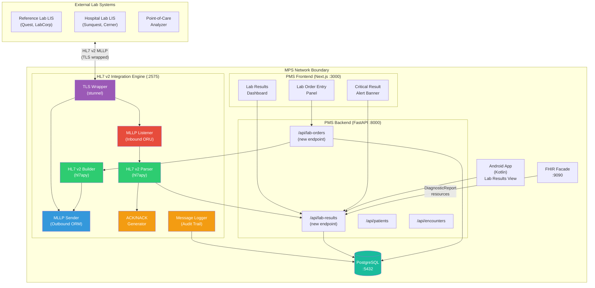

# Product Requirements Document: HL7 v2 LIS Messaging Integration into Patient Management System (PMS)

**Document ID:** PRD-PMS-HL7V2LIS-001
**Version:** 1.0
**Date:** February 21, 2026
**Author:** Ammar (CEO, MPS Inc.)
**Status:** Draft

---

## 1. Executive Summary

HL7 v2 (Health Level Seven Version 2) is the most widely deployed healthcare messaging standard in the world, used in over 80% of healthcare interface structures globally. It defines a pipe-delimited message format and a set of trigger events — ADT (Admit/Discharge/Transfer), ORM (Order Message), ORU (Observation Result Unsolicited), and others — for exchanging clinical data between healthcare systems over TCP/IP connections using the MLLP (Minimal Lower Layer Protocol). For laboratory workflows specifically, HL7 v2 defines the end-to-end electronic lab order and result cycle: the ordering system sends an ORM message with ORC/OBR segments describing the test panel, and the Laboratory Information System (LIS) returns an ORU message with OBR/OBX segments containing individual test results.

Integrating HL7 v2 LIS messaging into the PMS enables **electronic lab ordering and result reception** — clinicians place lab orders in the PMS, the order is transmitted to the laboratory's LIS as an HL7 ORM message, and results flow back automatically as HL7 ORU messages that populate the patient's chart. This eliminates manual fax-based lab ordering, reduces transcription errors in result entry, and accelerates the time from sample collection to clinician review. In a clinic setting, this means a provider can order a CBC (Complete Blood Count) during an encounter, and the results appear in the PMS within minutes of the lab completing analysis — without any manual data entry.

For HIPAA compliance, the integration wraps all HL7 v2 MLLP traffic in TLS encryption (since MLLP itself transmits plaintext), logs every message exchange as an audit event, and sanitizes PHI in error responses. Combined with the FHIR integration (experiment 16), the PMS achieves comprehensive healthcare interoperability: HL7 v2 for legacy lab and clinical system connectivity, FHIR R4 for modern RESTful interoperability.

---

## 2. Problem Statement

The current PMS has no mechanism for electronic communication with laboratory information systems, creating significant operational bottlenecks:

- **Manual lab ordering:** Clinicians write lab orders on paper or enter them into the LIS separately from the PMS encounter. There is no electronic order transmission — the front desk faxes or phones lab orders to the reference lab, introducing delays and transcription errors.
- **Manual result entry:** When lab results arrive (via fax, paper, or LIS portal), staff must manually re-enter values into the PMS patient record. This is slow (~5-10 minutes per result set), error-prone (wrong patient, wrong value, decimal point errors), and creates a gap between result availability and clinician notification.
- **No result-to-encounter linking:** Manually entered results are not automatically associated with the encounter that generated the order. Clinicians must navigate between encounters and results to correlate findings with clinical context.
- **No abnormal result alerting:** Without electronic result receipt, the PMS cannot flag critical or abnormal values (e.g., dangerously high potassium, positive cultures) for immediate clinician review. Staff must manually scan results and page providers.
- **Incompatibility with reference labs:** Major reference laboratories (Quest Diagnostics, LabCorp, local hospital labs) send and receive orders via HL7 v2 over MLLP. Without HL7 v2 support, the PMS cannot participate in these established electronic workflows, limiting the clinic to manual interfaces only.
- **No audit trail for lab communications:** There is no record of when an order was sent, when results were received, or whether acknowledgments were exchanged — making it difficult to investigate lost orders or delayed results.

---

## 3. Proposed Solution

Build an **HL7 v2 Integration Engine** within the PMS that handles bidirectional HL7 v2 messaging with external Laboratory Information Systems. The engine implements an MLLP listener (for inbound ORU result messages) and an MLLP sender (for outbound ORM order messages), with a message parser/builder layer using the `hl7apy` Python library.

### 3.1 Architecture Overview

### 3.2 Deployment Model

- **Self-hosted HL7 v2 engine:** The integration engine runs as a Python asyncio service within the Docker Compose stack, listening on port 2575 (the standard MLLP port) for inbound messages and maintaining outbound connections to configured LIS endpoints.
- **TLS termination via stunnel:** Since MLLP transmits plaintext, all external connections are wrapped with TLS using stunnel in a sidecar container, meeting HIPAA encryption requirements for PHI in transit.
- **Docker containers:** Two containers — `pms-hl7-engine` (Python asyncio MLLP service) and `pms-hl7-tls` (stunnel TLS proxy) — added to the existing `docker-compose.yml`.
- **HIPAA security envelope:** TLS 1.3 for transport encryption, AES-256 for stored messages, audit logging of every HL7 transaction, and IP allowlisting for external LIS connections.
- **Message persistence:** All inbound and outbound HL7 messages are stored in PostgreSQL with timestamps, enabling complete audit trail and message replay for troubleshooting.

---

## 4. PMS Data Sources

The HL7 v2 integration creates two new API endpoints and interacts with existing ones:

| PMS API / Data Source | HL7 v2 Message/Segment | Direction | Description |
|---|---|---|---|
| `/api/lab-orders` (new) | ORM → ORC + OBR | Outbound | Lab test orders placed by clinicians |
| `/api/lab-results` (new) | ORU → OBR + OBX | Inbound | Lab test results from LIS |
| `/api/patients` | PID segment | Both | Patient demographics for message header |
| `/api/encounters` | PV1 segment | Outbound | Encounter context linked to lab orders |
| `/api/prescriptions` | — | Read | Cross-reference for drug-lab interactions |
| `/api/reports` | — | Write | Aggregate lab result reporting |
| PostgreSQL `hl7_messages` table (new) | Raw HL7 pipe-delimited messages | Both | Message audit trail and replay |

### HL7 v2 Message Flow

**Outbound (Lab Order):**
1. Clinician places order in PMS → POST `/api/lab-orders`
2. Backend creates order record → triggers HL7 builder
3. Builder constructs ORM message (MSH + PID + PV1 + ORC + OBR segments)
4. MLLP sender transmits to LIS → receives ACK
5. Order status updated to "sent"

**Inbound (Lab Result):**
1. LIS sends ORU message to MLLP listener (port 2575)
2. Parser extracts PID (patient), OBR (test panel), OBX (individual results)
3. Patient matched by MRN from PID segment → linked to order
4. Results stored via POST `/api/lab-results`
5. ACK message returned to LIS
6. If critical value detected → alert pushed to frontend

---

## 5. Component/Module Definitions

### 5.1 MLLP Listener (Inbound Server)

**Description:** Asyncio TCP server listening on port 2575 for inbound HL7 v2 messages from external LIS systems. Handles MLLP framing (SB/EB/CR byte detection), message extraction, and ACK generation.

- **Input:** Raw MLLP-framed HL7 v2 messages over TCP (ORU^R01 for results, ADT^A01-A03 for patient events)
- **Output:** ACK/NACK messages back to sender; parsed message data forwarded to PMS backend
- **PMS APIs used:** `/api/lab-results` (create), `/api/patients` (lookup by MRN)

### 5.2 MLLP Sender (Outbound Client)

**Description:** Asyncio TCP client that transmits outbound HL7 v2 messages to configured LIS endpoints. Handles connection pooling, retry logic, and ACK verification.

- **Input:** Lab order data from `/api/lab-orders`
- **Output:** MLLP-framed ORM messages transmitted to LIS; ACK receipt confirmation
- **PMS APIs used:** `/api/lab-orders` (read), `/api/patients` (read for PID), `/api/encounters` (read for PV1)

### 5.3 HL7 v2 Parser

**Description:** Message parsing layer using `hl7apy` that extracts structured data from pipe-delimited HL7 v2 messages into Python objects. Handles segment iteration, field extraction, and data type conversion.

- **Input:** Raw HL7 v2 message string
- **Output:** Structured Python dict with patient, order, and result data
- **PMS APIs used:** None (pure transformation)

### 5.4 HL7 v2 Builder

**Description:** Message construction layer using `hl7apy` that builds valid HL7 v2 messages from PMS data. Populates MSH (header), PID (patient), PV1 (visit), ORC (common order), and OBR (observation request) segments.

- **Input:** Lab order dict from PMS backend
- **Output:** Valid HL7 v2 ORM^O01 message string
- **PMS APIs used:** `/api/patients` (PID data), `/api/encounters` (PV1 data), `/api/lab-orders` (ORC/OBR data)

### 5.5 Message Audit Logger

**Description:** Persists every inbound and outbound HL7 message to PostgreSQL for HIPAA audit compliance and troubleshooting. Stores raw message, parsed summary, direction, timestamp, sender/receiver, and ACK status.

- **Input:** HL7 message metadata (direction, endpoints, timestamp, ACK status)
- **Output:** Audit record in `hl7_messages` table
- **PMS APIs used:** None (direct database writes)

### 5.6 Lab Order Entry API

**Description:** New FastAPI endpoint (`/api/lab-orders`) that receives lab order requests from the frontend, validates them, stores the order, and triggers the HL7 builder to construct and send the ORM message.

- **Input:** JSON lab order (patient_id, encounter_id, test_codes[], ordering_provider, priority)
- **Output:** Order confirmation with tracking ID and send status
- **PMS APIs used:** `/api/patients` (validate patient), `/api/encounters` (validate encounter)

### 5.7 Lab Results API

**Description:** New FastAPI endpoint (`/api/lab-results`) that stores parsed lab results from inbound ORU messages and exposes them for frontend display.

- **Input:** Parsed result data from HL7 parser (patient_id, test_code, value, units, reference_range, abnormal_flag, result_status)
- **Output:** Stored result with alert flags for critical values
- **PMS APIs used:** `/api/patients` (link result to patient), `/api/encounters` (link result to order encounter)

---

## 6. Non-Functional Requirements

### 6.1 Security and HIPAA Compliance

| Requirement | Implementation |
|---|---|
| Encryption in transit | TLS 1.3 via stunnel for all MLLP connections (HL7 v2 transmits plaintext by default) |
| Encryption at rest | AES-256 for stored HL7 messages in PostgreSQL |
| Access control | IP allowlisting for external LIS connections; API key per LIS endpoint |
| Audit logging | Every HL7 message (inbound + outbound) logged with sender, receiver, timestamp, message type, ACK status |
| PHI in error messages | HL7 NACK responses contain error codes only — no patient data in rejection messages |
| Message integrity | SHA-256 hash stored per message to detect tampering |
| Connection security | Mutual TLS (mTLS) option for high-security lab connections |
| Retention policy | HL7 messages retained for 7 years (HIPAA minimum) with configurable archival |
| Access logging | All `/api/lab-results` and `/api/lab-orders` access logged with user identity |

### 6.2 Performance

| Metric | Target |
|---|---|
| Inbound ORU processing | < 500ms from MLLP receipt to database storage |
| Outbound ORM transmission | < 1s from order creation to MLLP send + ACK receipt |
| ACK response time | < 200ms (MLLP protocol requirement for timely ACK) |
| Concurrent MLLP connections | 10 simultaneous inbound + 5 outbound |
| Message throughput | 100 messages/minute sustained |
| Critical result alerting | < 5s from result receipt to frontend notification |
| Message retry | 3 retries with exponential backoff (5s, 15s, 45s) |

### 6.3 Infrastructure

| Component | Specification |
|---|---|
| HL7 Engine container | Python 3.12 + `hl7apy` + asyncio MLLP server |
| TLS Proxy container | stunnel 5.x with TLS 1.3 configuration |
| Memory | 256 MB minimum per container |
| CPU | 1 vCPU minimum |
| Storage | PostgreSQL (existing); HL7 message table adds ~500 MB/year at 100 msgs/day |
| Networking | Port 2575 (MLLP standard) exposed externally; internal Docker network for backend communication |
| Docker | Two new services in `docker-compose.yml`: `pms-hl7-engine`, `pms-hl7-tls` |

---

## 7. Implementation Phases

### Phase 1: Foundation — Inbound Results (Sprints 1-3, ~6 weeks)

- Deploy HL7 v2 engine with MLLP listener on port 2575
- Implement HL7 v2 ORU parser using `hl7apy` (PID, OBR, OBX extraction)
- Build ACK/NACK generator for inbound messages
- Create `/api/lab-results` endpoint and PostgreSQL schema
- Implement message audit logging table
- Add stunnel TLS wrapper container
- Build Lab Results Dashboard in Next.js frontend
- Test with synthetic HL7 ORU messages
- Connect to one test LIS (HAPI HL7 test server or local Mirth Connect)

### Phase 2: Outbound Orders + Alerting (Sprints 4-6, ~6 weeks)

- Implement MLLP sender for outbound ORM messages
- Build HL7 v2 ORM builder using `hl7apy` (MSH, PID, PV1, ORC, OBR segments)
- Create `/api/lab-orders` endpoint with order entry workflow
- Build Lab Order Entry Panel in Next.js frontend
- Implement critical result alerting (abnormal flag detection → WebSocket push to frontend)
- Add order-to-result linking (correlate OBR placer order number)
- Add retry logic with exponential backoff for failed transmissions
- Build Android lab results view
- Integration test with reference lab test environment

### Phase 3: Advanced Features + Production (Sprints 7-9, ~6 weeks)

- ADT message support (A01 registration, A03 discharge) for patient sync with hospital HIS
- Implement HL7 v2 to FHIR R4 bridge (ORU → DiagnosticReport/Observation FHIR resources)
- Add support for multiple concurrent LIS connections with endpoint-specific configuration
- Build message replay and resend capability for failed deliveries
- Implement order status tracking (ORM → ORU lifecycle)
- Performance tuning and load testing (100+ messages/minute)
- Production deployment with real reference lab connectivity
- Staff training on lab order entry and result review workflows

---

## 8. Success Metrics

| Metric | Target | Measurement Method |
|---|---|---|
| Lab result entry time | 90% reduction (manual: 5-10 min → electronic: < 30s) | Time comparison study |
| Order-to-result turnaround | 50% reduction in clinician notification time | Timestamp delta: order sent → result reviewed |
| Transcription errors | Zero (electronic transmission eliminates manual entry) | Error audit: pre vs post implementation |
| Critical result notification | < 5 minutes from LIS result to clinician alert | Alert timestamp tracking |
| Message delivery success rate | > 99.5% (with retry) | ACK/NACK ratio monitoring |
| HL7 message processing uptime | 99.9% | Uptime monitoring |
| Connected lab systems | 2+ live LIS connections within 6 months | Integration registry |
| Audit trail completeness | 100% of HL7 messages logged | Message count vs audit log count |

---

## 9. Risks and Mitigations

| Risk | Impact | Mitigation |
|---|---|---|
| HL7 v2 message format variations between LIS vendors | High — parser breaks on non-standard messages | Implement tolerant parser with fallback extraction; test against multiple vendor message samples |
| MLLP connection drops / network instability | Medium — lost orders or results | Persistent retry queue with exponential backoff; message store-and-forward; dead letter queue for manual review |
| Patient identity matching errors (MRN mismatch) | High — results linked to wrong patient | Match on multiple identifiers (MRN + name + DOB); reject ambiguous matches with manual review queue |
| TLS configuration complexity with legacy LIS systems | Medium — some labs may not support TLS | Offer VPN alternative for legacy systems; document minimum TLS requirements in BAA |
| Critical result alert fatigue | Medium — clinicians ignore alerts | Implement configurable critical value thresholds per test code; distinguish critical from abnormal |
| Mirth Connect licensing changes (2025 commercialization) | Low — affects integration engine choice | Use custom Python-based engine with `hl7apy` instead of depending on Mirth Connect |
| High message volume during peak lab hours | Low — performance degradation | Async processing with message queue; horizontal scaling of parser workers |
| HL7 v2 deprecation in favor of FHIR | Low — long-term technology risk | Build HL7v2-to-FHIR bridge (Phase 3); support both protocols concurrently |

---

## 10. Dependencies

| Dependency | Type | Version | Purpose |
|---|---|---|---|
| `hl7apy` | Python package | 1.3.x | HL7 v2 message parsing, building, and validation (v2.1-v2.8.2) |
| `python-hl7` | Python package | 0.4.x | Lightweight HL7 parsing + asyncio MLLP client |
| Python asyncio | Standard library | 3.12+ | Async TCP server/client for MLLP protocol |
| stunnel | System package | 5.x | TLS wrapping for MLLP connections |
| PostgreSQL | Database | 16+ | Existing PMS database + HL7 message/audit tables |
| FastAPI | Python framework | 0.110+ | New `/api/lab-orders` and `/api/lab-results` endpoints |
| WebSocket | Protocol | — | Real-time critical result alerts to frontend |
| HAPI HL7 Test Server | External service | — | Integration testing with synthetic HL7 messages |

---

## 11. Comparison with Existing Experiments

| Aspect | HL7 v2 LIS (This Experiment) | FHIR (Experiment 16) | MCP (Experiment 09) |
|---|---|---|---|
| **Primary purpose** | Legacy lab system bidirectional messaging | Modern REST-based healthcare interoperability | Internal AI-to-PMS integration |
| **Standard body** | HL7 International | HL7 International | Linux Foundation (AAIF) |
| **Protocol** | HL7 v2 pipe-delimited over MLLP/TCP | FHIR R4 REST API (HTTP/JSON) | JSON-RPC over Streamable HTTP |
| **Transport** | MLLP (TCP with SB/EB framing) + TLS via stunnel | HTTPS (native TLS) | HTTPS |
| **Message format** | Pipe-delimited segments (MSH\|PID\|OBR\|OBX) | JSON/XML resources | JSON-RPC |
| **Use case** | Lab orders and results with legacy LIS systems | Comprehensive clinical data exchange with modern systems | AI agent access to PMS capabilities |
| **Maturity** | 30+ years; 80%+ global healthcare adoption | 8+ years; 70%+ country adoption | 1.5 years; rapidly growing |
| **Complementarity** | HL7 v2 handles lab connectivity where FHIR is not available. Phase 3 includes an HL7v2-to-FHIR bridge so results also appear as FHIR DiagnosticReport resources. | FHIR provides the modern equivalent (DiagnosticReport, Observation). Labs migrating to FHIR can use the FHIR facade directly. | MCP can expose lab order/result tools to AI agents for clinical decision support. |

HL7 v2 and FHIR are highly complementary: HL7 v2 provides connectivity to the 80%+ of laboratory systems that still use legacy messaging, while FHIR provides the modern API for systems that have migrated. The HL7v2-to-FHIR bridge (Phase 3) ensures that lab data flows into both protocols, giving the PMS complete interoperability coverage.

---

## 12. Research Sources

### Official Documentation & Specification
- [HL7 v2.9 Observations Chapter](https://www.hl7.eu/HL7v2x/v29/std29/ch07.html) — OBR/OBX segment definitions for lab results
- [HL7 MLLP Transport Specification](https://www.hl7.org/documentcenter/public/wg/inm/mllp_transport_specification.PDF) — Official MLLP framing protocol specification
- [HL7 ADT Domain Reference](https://www.hl7.eu/refactored/dom01.html) — Admission/Discharge/Transfer message structure

### Architecture & Implementation
- [HL7apy Documentation](https://crs4.github.io/hl7apy/) — Python library for parsing and building HL7 v2 messages
- [python-hl7 Documentation](https://python-hl7.readthedocs.io/) — Lightweight HL7 parser with asyncio MLLP support
- [HL7 & LIS Integration Guide (SpeedsPath)](https://blog.speedspath.com/hl7-lis-integration-complete-guide/) — Lab-specific HL7 integration architecture and workflow
- [NextGen Mirth Connect GitHub](https://github.com/nextgenhealthcare/connect) — Open-source healthcare integration engine reference

### Security & Compliance
- [HL7 Security Checklist (CapMinds)](https://www.capminds.com/blog/hl7-guide-how-to-secure-your-sensitive-data/) — HL7 v2 HIPAA security requirements and checklist
- [HL7 TCP/IP Security Guide](https://www.hl7resources.com/Blog/BLOG-HL7-TCPIP-Security/) — TLS encryption for MLLP connections
- [HL7 Protocol Vulnerabilities (TXOne)](https://www.txone.com/blog/hl7-protocol-vulnerabilities-mitigation/) — Known vulnerabilities and mitigation strategies

### Ecosystem & Adoption
- [Evolution of HL7: v2 vs v3 vs FHIR (PureLogics)](https://purelogics.com/comparing-hl7-v2-v3-and-fhir/) — Comparison of HL7 versions and migration path
- [Mirth Connect 2025 Guide (CapMinds)](https://www.capminds.com/blog/mirth-connect-for-healthcare-integration-a-complete-2025-guide/) — Integration engine ecosystem and licensing changes

---

## 13. Appendix: Related Documents

- [HL7v2LIS Setup Guide](17-HL7v2LIS-PMS-Developer-Setup-Guide.md) — Step-by-step MLLP engine deployment and PMS integration
- [HL7v2LIS Developer Tutorial](17-HL7v2LIS-Developer-Tutorial.md) — Hands-on onboarding: parse ORU messages, build ORM orders, test with LIS
- [PRD: FHIR PMS Integration](16-PRD-FHIR-PMS-Integration.md) — Complementary modern healthcare interoperability (FHIR R4 REST)
- [PRD: MCP PMS Integration](09-PRD-MCP-PMS-Integration.md) — Internal AI integration that can expose lab tools
- [HL7 International](https://www.hl7.org/) — Official HL7 standards organization
- [HL7apy GitHub](https://github.com/crs4/hl7apy) — Python HL7 v2 library
