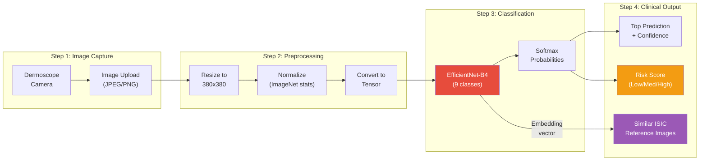
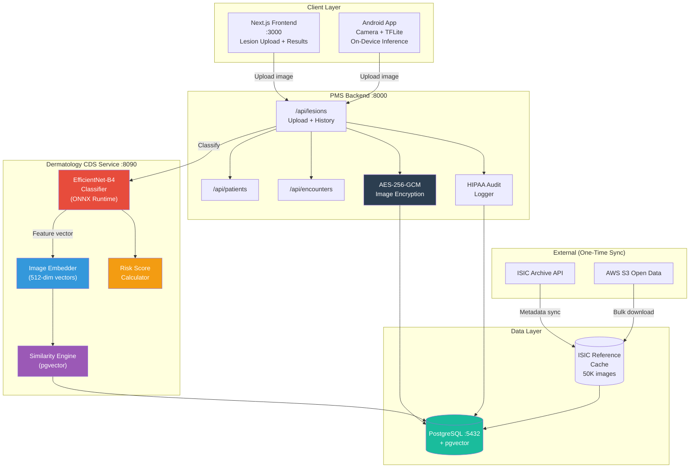

# ISIC Archive Developer Onboarding Tutorial

**Welcome to the MPS PMS ISIC Archive Integration Team**

This tutorial will take you from zero to building your first ISIC-powered skin lesion classification integration with the PMS. By the end, you will understand how the ISIC Archive works, have a running local environment, and have built and tested a custom dermatology CDS integration end-to-end.

**Document ID:** PMS-EXP-ISICARCHIVE-002
**Version:** 1.0
**Date:** February 21, 2026
**Applies To:** PMS project (all platforms)
**Prerequisite:** [ISICArchive Setup Guide](18-ISICArchive-PMS-Developer-Setup-Guide.md)
**Estimated time:** 2-3 hours
**Difficulty:** Beginner-friendly

---

## What You Will Learn

1. What the ISIC Archive is and why it matters for clinical dermatology
2. How deep learning classifies dermoscopic skin lesion images
3. How the 9 ISIC diagnostic categories map to clinical decisions
4. How to upload and classify a lesion image through the PMS
5. How pgvector similarity search finds matching reference images
6. How to build a risk scoring pipeline with referral recommendations
7. How to implement longitudinal lesion tracking for change detection
8. How to export a TFLite model for Android on-device inference
9. How HIPAA compliance is maintained with encrypted image storage
10. How to test and debug the full classification pipeline

---

## Part 1: Understanding the ISIC Archive (15 min read)

### 1.1 What Problem Does the ISIC Archive Solve?

Primary care clinicians encounter suspicious skin lesions daily. Without dermatology training, they must decide: is this mole benign or potentially malignant? Today, the options are:

- **Visual inspection alone** — ~60% accuracy for primary care providers
- **Refer every suspicious lesion** — overwhelms dermatology specialists, delays care for truly urgent cases
- **Wait and watch** — risks missing early melanoma when timely detection saves lives

The ISIC Archive provides **400,000+ expert-annotated dermoscopic images** that researchers have used to train AI models achieving **85-95% classification accuracy** — matching or exceeding general dermatologists. By integrating these models into the PMS, we give every clinician instant access to dermatology-grade triage at the point of care.

### 1.2 How Skin Lesion Classification Works — The Key Pieces



The pipeline has three conceptual stages:

1. **Image preprocessing** — The raw dermoscopic photo is resized, normalized, and converted to a tensor that the neural network expects.
2. **Model inference** — EfficientNet-B4 (a convolutional neural network) processes the tensor and outputs probability scores for each of the 9 ISIC diagnostic categories.
3. **Clinical interpretation** — The raw probabilities are converted into a risk score, referral recommendation, and a gallery of visually similar confirmed cases from the ISIC Archive.

### 1.3 How the ISIC Archive Fits with Other PMS Technologies

| Technology | What It Does | Relationship to ISIC |
|---|---|---|
| **Gemma 3** (Experiment 13) | General clinical AI: summarization, extraction, medication intelligence | Gemma 3 can reason about ISIC classification results (e.g., "given this classification and patient history, recommend next steps") |
| **Vision Capabilities** (Edge) | Wound assessment, patient ID verification, document OCR | Handles non-dermoscopic imaging; ISIC handles dermoscopy-specific classification |
| **FHIR** (Experiment 16) | Healthcare data interoperability | ISIC classification results can be exported as FHIR DiagnosticReport resources for external EHR sharing |
| **MCP** (Experiment 9) | Universal AI integration protocol | ISIC classification could be exposed as an MCP tool for AI assistants to invoke |
| **Adaptive Thinking** (Experiment 8) | Effort-routed AI reasoning | Route simple skin lesion queries to lightweight models, complex cases to EfficientNet-B4 |

### 1.4 Key Vocabulary

| Term | Meaning |
|---|---|
| **Dermoscopy** | Examination of skin lesions using a specialized magnifying device (dermoscope) that visualizes subsurface structures |
| **ISIC** | International Skin Imaging Collaboration — consortium maintaining the largest public dermoscopic image archive |
| **EfficientNet** | Family of convolutional neural networks that balance accuracy and computational efficiency; B4 variant used here |
| **pgvector** | PostgreSQL extension enabling vector similarity search using cosine distance, used for finding similar reference images |
| **Embedding** | A fixed-length numerical vector (512 dimensions) representing an image's visual features, extracted from a CNN's penultimate layer |
| **ONNX** | Open Neural Network Exchange — portable model format enabling inference across different runtimes (PyTorch, TensorRT, etc.) |
| **TFLite** | TensorFlow Lite — optimized model format for mobile and edge inference on Android devices |
| **Melanoma** | Most dangerous form of skin cancer; ISIC models are optimized for high sensitivity on this class |
| **Melanocytic nevus** | Common benign mole — the most frequent class in the ISIC dataset |
| **AES-256-GCM** | Encryption standard used for patient image storage; GCM mode provides both confidentiality and integrity |
| **Sensitivity** | The probability that the model correctly identifies a malignant lesion (true positive rate) |
| **Specificity** | The probability that the model correctly identifies a benign lesion (true negative rate) |

### 1.5 Our Architecture



---

## Part 2: Environment Verification (15 min)

### 2.1 Checklist

Confirm each service is running before proceeding:

1. **PMS Backend:**
   ```bash
   curl -s http://localhost:8000/health
   # Expected: {"status": "healthy"}
   ```

2. **PMS Frontend:**
   ```bash
   curl -s -o /dev/null -w "%{http_code}" http://localhost:3000
   # Expected: 200
   ```

3. **Dermatology CDS Service:**
   ```bash
   curl -s http://localhost:8090/health
   # Expected: {"status": "healthy", "service": "derm-cds", "model_loaded": true}
   ```

4. **PostgreSQL with pgvector:**
   ```bash
   psql -h localhost -p 5432 -U pms -d pms_db -c "SELECT extname, extversion FROM pg_extension WHERE extname = 'vector';"
   # Expected: vector | 0.7.x
   ```

5. **ISIC Reference Data Loaded:**
   ```bash
   psql -h localhost -p 5432 -U pms -d pms_db -c "SELECT COUNT(*) FROM isic_reference_embeddings;"
   # Expected: 10000 (or however many you loaded)
   ```

6. **isic-cli Installed:**
   ```bash
   isic --version
   # Expected: isic-cli, version 12.x.x
   ```

### 2.2 Quick Test

Run a single classification to confirm the full pipeline works:

```bash
# Download a test ISIC image
curl -o /tmp/test_lesion.jpg "https://api.isic-archive.com/api/v2/images/ISIC_0024306/thumbnail?size=380"

# Classify it
curl -s -X POST http://localhost:8090/classify \
  -F "image=@/tmp/test_lesion.jpg" | python3 -m json.tool

# Expected: JSON with predictions, top_prediction, confidence, risk_level
```

If you get a valid JSON response with predictions, your environment is ready.

---

## Part 3: Build Your First Integration (45 min)

### 3.1 What We Are Building

We will build a **Lesion Assessment API endpoint** that:

1. Accepts a dermoscopic image upload
2. Classifies it using EfficientNet-B4
3. Finds 5 similar ISIC reference images
4. Calculates a risk score
5. Stores the encrypted image and results in the database
6. Returns a structured clinical assessment

This is the core clinical workflow that ties everything together.

### 3.2 Step 1: Create the Assessment Data Model

Create `services/derm-cds/models.py`:

```python
"""Pydantic models for dermatology CDS requests and responses."""

from pydantic import BaseModel, Field
from datetime import datetime


class DiagnosisPrediction(BaseModel):
    """Single diagnostic class prediction."""
    diagnostic_class: str = Field(description="ISIC diagnostic category")
    probability: float = Field(ge=0, le=1, description="Classification probability")


class RiskAssessment(BaseModel):
    """Structured risk assessment for a skin lesion."""
    level: str = Field(description="Risk level: low, medium, high")
    malignant_probability: float = Field(description="Combined probability of malignant classes")
    referral_urgency: str = Field(description="Referral urgency: routine, expedited, urgent")
    factors: list[str] = Field(default_factory=list, description="Contributing risk factors")


class SimilarReference(BaseModel):
    """An ISIC reference image similar to the query."""
    isic_id: str
    diagnosis: str
    similarity_score: float = Field(ge=0, le=1)
    thumbnail_url: str
    patient_age: int | None = None
    anatomical_site: str | None = None


class LesionAssessment(BaseModel):
    """Complete lesion assessment result."""
    assessment_id: str
    timestamp: datetime
    predictions: list[DiagnosisPrediction]
    top_diagnosis: str
    confidence: float
    risk: RiskAssessment
    similar_references: list[SimilarReference]
    model_name: str = "efficientnet_b4"
    model_version: str = "isic-2024-v1"
```

### 3.3 Step 2: Build the Assessment Pipeline

Create `services/derm-cds/assessment.py`:

```python
"""End-to-end lesion assessment pipeline."""

from datetime import datetime, timezone
from uuid import uuid4
from PIL import Image
import torch
import torchvision.transforms as T
import io
import logging

from models import (
    LesionAssessment,
    DiagnosisPrediction,
    RiskAssessment,
    SimilarReference,
)

logger = logging.getLogger(__name__)

ISIC_CLASSES = [
    "melanoma",
    "melanocytic_nevus",
    "basal_cell_carcinoma",
    "actinic_keratosis",
    "benign_keratosis",
    "dermatofibroma",
    "vascular_lesion",
    "squamous_cell_carcinoma",
    "unknown",
]

preprocess = T.Compose([
    T.Resize((380, 380)),
    T.CenterCrop((380, 380)),
    T.ToTensor(),
    T.Normalize(mean=[0.485, 0.456, 0.406], std=[0.229, 0.224, 0.225]),
])


async def assess_lesion(
    image_bytes: bytes,
    classifier,
    embedder,
    similarity_engine,
    risk_scorer,
    patient_age: int | None = None,
    anatomical_site: str | None = None,
) -> LesionAssessment:
    """
    Run the full assessment pipeline:
    1. Preprocess image
    2. Classify with EfficientNet-B4
    3. Extract embedding for similarity search
    4. Find similar ISIC reference images
    5. Calculate risk score
    6. Return structured assessment
    """
    # Step 1: Preprocess
    img = Image.open(io.BytesIO(image_bytes)).convert("RGB")
    tensor = preprocess(img).unsqueeze(0)
    logger.info("Image preprocessed: %dx%d -> 380x380 tensor", img.width, img.height)

    # Step 2: Classify
    probabilities = classifier.predict(tensor)
    predictions = [
        DiagnosisPrediction(diagnostic_class=cls, probability=round(float(prob), 4))
        for cls, prob in sorted(
            zip(ISIC_CLASSES, probabilities),
            key=lambda x: x[1],
            reverse=True,
        )
    ]
    top = predictions[0]
    logger.info("Classification: %s (%.1f%%)", top.diagnostic_class, top.probability * 100)

    # Step 3: Extract embedding
    embedding = embedder.extract(tensor)

    # Step 4: Similarity search
    similar_raw = await similarity_engine.search(embedding, top_k=5)
    similar_refs = [
        SimilarReference(
            isic_id=r["isic_id"],
            diagnosis=r["diagnosis"],
            similarity_score=round(r["score"], 4),
            thumbnail_url=f"https://api.isic-archive.com/api/v2/images/{r['isic_id']}/thumbnail",
            patient_age=r["metadata"].get("age"),
            anatomical_site=r["metadata"].get("site"),
        )
        for r in similar_raw
    ]

    # Step 5: Risk score
    risk_input = [{"class": p.diagnostic_class, "probability": p.probability} for p in predictions]
    risk_result = risk_scorer.calculate(
        predictions=risk_input,
        patient_age=patient_age,
        anatomical_site=anatomical_site,
    )

    # Step 6: Build assessment
    return LesionAssessment(
        assessment_id=str(uuid4()),
        timestamp=datetime.now(timezone.utc),
        predictions=predictions[:5],  # Top 5 predictions
        top_diagnosis=top.diagnostic_class,
        confidence=top.probability,
        risk=RiskAssessment(
            level=risk_result["level"],
            malignant_probability=risk_result["malignant_probability"],
            referral_urgency=risk_result["referral_urgency"],
            factors=risk_result["factors"],
        ),
        similar_references=similar_refs,
    )
```

### 3.4 Step 3: Wire It Into the API

Add a new endpoint to `services/derm-cds/main.py`:

```python
from assessment import assess_lesion
from models import LesionAssessment


@app.post("/assess", response_model=LesionAssessment)
async def assess_lesion_endpoint(
    image: UploadFile = File(...),
    patient_age: int | None = None,
    anatomical_site: str | None = None,
):
    """Run full lesion assessment pipeline (classify + similarity + risk)."""
    if classifier is None:
        raise HTTPException(status_code=503, detail="Model not loaded")

    contents = await image.read()
    try:
        result = await assess_lesion(
            image_bytes=contents,
            classifier=classifier,
            embedder=embedder,
            similarity_engine=similarity_engine,
            risk_scorer=risk_scorer,
            patient_age=patient_age,
            anatomical_site=anatomical_site,
        )
    except Exception as e:
        logger.exception("Assessment failed")
        raise HTTPException(status_code=500, detail=str(e))

    return result
```

### 3.5 Step 4: Test the Assessment Pipeline

```bash
# Restart CDS to pick up new code
docker compose restart pms-derm-cds

# Run a full assessment
curl -s -X POST http://localhost:8090/assess \
  -F "image=@/tmp/test_lesion.jpg" \
  -F "patient_age=62" \
  -F "anatomical_site=back" | python3 -m json.tool
```

Expected response:

```json
{
    "assessment_id": "a1b2c3d4-...",
    "timestamp": "2026-02-21T...",
    "predictions": [
        {"diagnostic_class": "melanocytic_nevus", "probability": 0.7234},
        {"diagnostic_class": "melanoma", "probability": 0.1102},
        {"diagnostic_class": "benign_keratosis", "probability": 0.0891},
        {"diagnostic_class": "dermatofibroma", "probability": 0.0312},
        {"diagnostic_class": "basal_cell_carcinoma", "probability": 0.0210}
    ],
    "top_diagnosis": "melanocytic_nevus",
    "confidence": 0.7234,
    "risk": {
        "level": "medium",
        "malignant_probability": 0.1312,
        "referral_urgency": "expedited",
        "factors": ["Patient age 62 (elevated risk)"]
    },
    "similar_references": [
        {
            "isic_id": "ISIC_0025030",
            "diagnosis": "melanocytic_nevus",
            "similarity_score": 0.9234,
            "thumbnail_url": "https://api.isic-archive.com/api/v2/images/ISIC_0025030/thumbnail",
            "patient_age": 55,
            "anatomical_site": "trunk"
        }
    ],
    "model_name": "efficientnet_b4",
    "model_version": "isic-2024-v1"
}
```

### 3.6 Step 5: Build a Lesion History Viewer

Create `services/derm-cds/history.py`:

```python
"""Lesion history tracking for longitudinal monitoring."""

import psycopg
import numpy as np
import logging

logger = logging.getLogger(__name__)


async def get_patient_lesion_timeline(
    conn,
    patient_id: str,
    limit: int = 20,
) -> list[dict]:
    """Retrieve a patient's lesion assessment history."""
    async with conn.cursor() as cur:
        await cur.execute(
            """
            SELECT
                lc.id,
                lc.classified_at,
                lc.top_prediction,
                lc.confidence,
                lc.risk_level,
                lc.referral_urgency,
                li.anatomical_site
            FROM lesion_classifications lc
            JOIN lesion_images li ON lc.lesion_image_id = li.id
            WHERE li.patient_id = %s
            ORDER BY lc.classified_at DESC
            LIMIT %s
            """,
            (patient_id, limit),
        )
        rows = await cur.fetchall()

    return [
        {
            "id": str(row[0]),
            "classified_at": row[1].isoformat(),
            "top_prediction": row[2],
            "confidence": float(row[3]),
            "risk_level": row[4],
            "referral_urgency": row[5],
            "anatomical_site": row[6],
        }
        for row in rows
    ]


async def detect_lesion_change(
    conn,
    patient_id: str,
    current_embedding: np.ndarray,
    anatomical_site: str,
    change_threshold: float = 0.15,
) -> dict | None:
    """
    Compare a current lesion embedding against prior embeddings
    from the same anatomical site to detect significant changes.
    """
    async with conn.cursor() as cur:
        await cur.execute(
            """
            SELECT
                ple.embedding,
                ple.created_at,
                lc.top_prediction,
                lc.risk_level
            FROM patient_lesion_embeddings ple
            JOIN lesion_images li ON ple.lesion_image_id = li.id
            JOIN lesion_classifications lc ON lc.lesion_image_id = li.id
            WHERE li.patient_id = %s
              AND li.anatomical_site = %s
            ORDER BY ple.created_at DESC
            LIMIT 1
            """,
            (patient_id, anatomical_site),
        )
        row = await cur.fetchone()

    if row is None:
        return None  # No prior assessment at this site

    prior_embedding = np.array(row[0])
    prior_date = row[1]
    prior_prediction = row[2]
    prior_risk = row[3]

    # Calculate cosine distance between current and prior embeddings
    cosine_similarity = float(
        np.dot(current_embedding, prior_embedding)
        / (np.linalg.norm(current_embedding) * np.linalg.norm(prior_embedding))
    )
    change_score = 1.0 - cosine_similarity

    if change_score > change_threshold:
        return {
            "change_detected": True,
            "change_score": round(change_score, 4),
            "prior_date": prior_date.isoformat(),
            "prior_prediction": prior_prediction,
            "prior_risk_level": prior_risk,
            "recommendation": "Significant visual change detected. Consider expedited dermatology referral.",
        }

    return {
        "change_detected": False,
        "change_score": round(change_score, 4),
        "prior_date": prior_date.isoformat(),
        "prior_prediction": prior_prediction,
        "recommendation": "No significant change from prior assessment.",
    }
```

Test by querying the history endpoint after uploading multiple images for the same patient.

---

## Part 4: Strengths and Weaknesses (15 min)

### 4.1 Strengths

- **Largest public dermoscopy dataset:** 400K+ expert-annotated images across 9 diagnostic categories give ISIC-trained models a significant training advantage
- **Proven AI model ecosystem:** The annual ISIC Challenge (3,400+ participants) produces state-of-the-art models that are freely available
- **On-premises inference:** Patient images never leave the network — classification runs locally using PyTorch/ONNX, making HIPAA compliance straightforward
- **Similarity search with pgvector:** Clinicians can see confirmed reference cases that look like the patient's lesion, supporting visual pattern matching
- **Multi-platform inference:** ONNX (server/edge), TFLite (Android), and TensorRT (Jetson) support deployment across all PMS platforms
- **Free and open data:** ISIC data is available under Creative Commons licenses with no API keys or usage fees for the dataset itself
- **Clinical validation:** ISIC models have been validated in published clinical studies demonstrating diagnostic accuracy comparable to dermatologists

### 4.2 Weaknesses

- **Domain-specific only:** ISIC models classify dermoscopic skin lesions only — they cannot assess wounds, rashes, or other dermatologic conditions
- **Image quality dependency:** Classification accuracy degrades significantly with poor lighting, blur, hair obstruction, or non-dermoscopic photos
- **Class imbalance:** Melanoma and rare cancers are underrepresented in the ISIC dataset, potentially causing lower sensitivity for these critical classes
- **No real-time API for classification:** The ISIC Archive provides data, not inference — you must host your own classification model
- **Model size:** EfficientNet-B4 requires ~75 MB of weights and significant memory; CPU inference takes 1-2 seconds per image
- **Limited demographic diversity:** Most ISIC images come from fair-skinned populations; model performance on darker skin tones is less validated
- **Reference cache maintenance:** The local ISIC cache needs periodic updates as new images are added to the archive

### 4.3 When to Use ISIC vs Alternatives

| Scenario | Use ISIC | Use Alternative |
|---|---|---|
| Dermoscopic skin lesion triage | ISIC Archive + EfficientNet | — |
| General wound assessment | — | Vision Capabilities (Experiment: Edge) |
| Clinical note summarization | — | Gemma 3 (Experiment 13) |
| Skin rash or eczema identification | — | General medical vision model or Gemma 3 multimodal |
| Pathology slide analysis | — | Specialized histopathology models |
| Clinical reasoning about skin lesion results | Use ISIC for classification, Gemma 3 for reasoning | — |
| Patient-facing skin check app | ISIC TFLite on Android | — |
| Research on skin cancer detection | ISIC Archive dataset | — |

### 4.4 HIPAA / Healthcare Considerations

**What is HIPAA-compliant by design:**
- Patient dermoscopic images stored with AES-256-GCM encryption at rest
- All AI inference runs on-premises within the Docker network
- Audit logging tracks every image upload, classification, and result view
- Role-based access control limits image access to assigned clinicians
- Model provenance tracking records which model version produced each result

**What requires attention:**
- **ISIC reference images are NOT PHI** — they are de-identified public data under Creative Commons. No HIPAA concerns for the reference cache.
- **Patient images ARE PHI** — must be encrypted, access-controlled, and retained per policy
- **Classification results are clinical data** — must be stored in the patient record with appropriate access controls
- **AI disclaimer required** — classification is decision support only; clinician must review all results
- **Skin tone bias monitoring** — track classification accuracy across demographic groups and document limitations
- **Informed consent** — consider whether patients should be informed that AI is used in their skin lesion assessment

---

## Part 5: Debugging Common Issues (15 min read)

### Issue 1: Classification Returns Uniform Probabilities (~11% for all classes)

**Symptoms:** Every class gets approximately equal probability (1/9 = 11.1%).

**Cause:** The model has not been fine-tuned on ISIC data. A model with only ImageNet weights produces random-looking outputs for dermoscopic images.

**Fix:** Replace the model with one fine-tuned on the ISIC dataset:
```bash
# Download an ISIC-trained model from Kaggle (example)
# Or fine-tune using the ISIC 2024 dataset:
python3 scripts/finetune.py --dataset isic2024 --epochs 30 --lr 1e-4
```

### Issue 2: Similarity Search Returns No Results

**Symptoms:** `/similar` endpoint returns an empty array.

**Cause:** The ISIC reference cache is empty or embeddings were not computed.

**Fix:** Check the reference table and repopulate if needed:
```bash
psql -h localhost -p 5432 -U pms -d pms_db -c "SELECT COUNT(*) FROM isic_reference_embeddings;"
# If 0, run the cache population script:
python3 services/derm-cds/scripts/populate_cache.py
```

### Issue 3: ONNX Runtime CUDA Error

**Symptoms:** `RuntimeError: CUDA not available` or `ONNXRuntimeError: CUDA_FAILURE`.

**Cause:** GPU drivers not installed or CUDA version mismatch.

**Fix:** Fall back to CPU inference (slower but functional):
```python
# In classifier.py, force CPU provider:
providers = ["CPUExecutionProvider"]
self.session = ort.InferenceSession(path, providers=providers)
```

### Issue 4: Image Upload Returns 413 Entity Too Large

**Symptoms:** HTTP 413 when uploading high-resolution dermoscopic images.

**Cause:** Reverse proxy or FastAPI upload size limit exceeded.

**Fix:** Increase the upload limit in nginx or set FastAPI max upload size:
```python
# In main.py, configure upload limit:
from fastapi import FastAPI
app = FastAPI(max_request_size=50 * 1024 * 1024)  # 50 MB
```

### Issue 5: pgvector Index Scan Slow on Large Reference Cache

**Symptoms:** Similarity search takes > 1 second with 50K+ reference images.

**Cause:** IVFFlat index not built or has too few lists.

**Fix:** Rebuild the index with appropriate list count:
```sql
-- Drop and recreate with more lists for larger datasets
DROP INDEX IF EXISTS idx_isic_embedding;
CREATE INDEX idx_isic_embedding
    ON isic_reference_embeddings USING ivfflat (embedding vector_cosine_ops)
    WITH (lists = 200);
-- For 50K+ images, use lists = sqrt(num_rows)
```

### Issue 6: Encrypted Image Cannot Be Decrypted

**Symptoms:** `InvalidTag` error when decrypting stored patient images.

**Cause:** Encryption key changed between encrypt and decrypt operations.

**Fix:** Ensure `IMAGE_ENCRYPTION_KEY` environment variable is consistent:
```bash
# Check current key
echo $IMAGE_ENCRYPTION_KEY

# Key must be exactly 32 bytes for AES-256
# In production, use a key management service (AWS KMS, HashiCorp Vault)
```

---

## Part 6: Practice Exercise (45 min)

### Option A: Build a Batch Classification Pipeline

Build a script that classifies multiple dermoscopic images in batch, generates a CSV report, and identifies which images need urgent review.

**Hints:**
1. Create a directory with 20+ test ISIC images (use `isic image download`)
2. Loop through images, calling `/assess` for each
3. Collect results into a pandas DataFrame
4. Sort by `risk.malignant_probability` descending
5. Export to CSV with columns: filename, top_diagnosis, confidence, risk_level, referral_urgency

**Steps outline:**
```bash
# Download test images
isic image download --search "diagnosis:melanoma" --limit 10 --output ./test_images/melanoma/
isic image download --search "diagnosis:melanocytic_nevus" --limit 10 --output ./test_images/nevus/
```

```python
# batch_classify.py
import httpx
import asyncio
from pathlib import Path
import csv

async def classify_batch(image_dir: str):
    results = []
    async with httpx.AsyncClient(timeout=30.0) as client:
        for img_path in Path(image_dir).rglob("*.jpg"):
            # Call /assess endpoint
            # Collect results
            pass
    # Write CSV report
```

### Option B: Build an Anatomical Body Map Component

Create a React component that renders an SVG body outline where clinicians can click on an anatomical site to record lesion locations.

**Hints:**
1. Use an SVG body outline (front and back views)
2. Each anatomical region is a clickable SVG path
3. Clicking a region opens the LesionUploader pre-filled with that site
4. Show pins/markers on previously assessed sites with color-coded risk levels

**Steps outline:**
- Create `src/components/dermatology/BodyMap.tsx`
- Define SVG paths for each ISIC anatomical site (head_neck, upper_extremity, etc.)
- Use React state to track selected site and existing assessments
- Integrate with the `/api/lesions/history` endpoint

### Option C: Build a Model Comparison Dashboard

Build a page that lets you upload one image and compare classification results across multiple models (EfficientNet-B4, MobileNetV3, ResNet50).

**Hints:**
1. Deploy multiple model endpoints (one per model variant)
2. Upload the same image to all endpoints in parallel
3. Display side-by-side comparison of predictions
4. Highlight disagreements between models (potential uncertainty indicators)

**Steps outline:**
- Create model variant configs in `services/derm-cds/config.py`
- Add a `/compare` endpoint that runs inference on all loaded models
- Build a comparison table in the frontend showing predictions from each model

---

## Part 7: Development Workflow and Conventions

### 7.1 File Organization

```
services/derm-cds/
├── main.py                    # FastAPI application entry point
├── classifier.py              # ONNX/PyTorch model loader and inference
├── embedder.py                # Image embedding extraction
├── similarity.py              # pgvector similarity search
├── risk_scorer.py             # Clinical risk score calculator
├── assessment.py              # End-to-end assessment pipeline
├── history.py                 # Longitudinal lesion tracking
├── models.py                  # Pydantic request/response models
├── requirements.txt           # Python dependencies
├── Dockerfile                 # Container definition
├── models/                    # Model weights (git-ignored)
│   ├── efficientnet_b4_isic.onnx
│   └── mobilenetv3_isic.tflite
├── cache/                     # ISIC reference image cache (git-ignored)
│   └── isic_reference/
├── scripts/
│   ├── init_db.sql            # Database schema migration
│   ├── populate_cache.py      # ISIC reference cache builder
│   └── export_tflite.py       # TFLite model export script
└── tests/
    ├── test_classifier.py
    ├── test_similarity.py
    ├── test_risk_scorer.py
    └── test_assessment.py

pms-backend/app/
├── routers/
│   └── lesions.py             # /api/lesions endpoint
├── core/
│   └── encryption.py          # AES-256-GCM image encryption

pms-frontend/src/
├── components/dermatology/
│   ├── LesionUploader.tsx     # Image upload + classification
│   ├── ClassificationResults.tsx
│   ├── SimilarGallery.tsx
│   └── BodyMap.tsx
└── app/encounters/[id]/dermatology/
    └── page.tsx               # Dermatology assessment page
```

### 7.2 Naming Conventions

| Item | Convention | Example |
|---|---|---|
| API endpoints | `/api/lesions/{action}` | `/api/lesions/upload`, `/api/lesions/history/{patient_id}` |
| Database tables | `snake_case`, prefixed by domain | `lesion_images`, `lesion_classifications`, `isic_reference_embeddings` |
| Python modules | `snake_case.py` | `risk_scorer.py`, `similarity.py` |
| React components | `PascalCase.tsx` | `LesionUploader.tsx`, `ClassificationResults.tsx` |
| Model files | `{architecture}_{dataset}.{format}` | `efficientnet_b4_isic.onnx`, `mobilenetv3_isic.tflite` |
| ISIC IDs | `ISIC_NNNNNNN` (7-digit) | `ISIC_0024306` |
| Docker service | `pms-derm-cds` | `docker compose up pms-derm-cds` |
| Environment variables | `SCREAMING_SNAKE_CASE` | `DERM_CDS_URL`, `IMAGE_ENCRYPTION_KEY` |

### 7.3 PR Checklist

Before submitting a PR that modifies the dermatology CDS module:

- [ ] Classification tests pass: `pytest services/derm-cds/tests/`
- [ ] Risk scorer thresholds match clinical guidelines
- [ ] Patient images are encrypted before database storage
- [ ] Audit log entry created for every classification and image access
- [ ] No patient images or PHI in log output
- [ ] ISIC reference data accessed under correct license terms
- [ ] AI disclaimer visible on all classification result UI
- [ ] Model provenance (name + version) stored with every classification
- [ ] pgvector queries use indexed columns
- [ ] Frontend components handle loading and error states
- [ ] No hardcoded API URLs — use environment variables
- [ ] Docker health check configured for CDS service

### 7.4 Security Reminders

1. **Never log patient images** — log only classification results and metadata
2. **Always encrypt patient images** before database storage using AES-256-GCM
3. **Never expose the CDS service directly** — route all requests through the PMS backend which handles authentication
4. **Validate image inputs** — check file type, size, and dimensions before processing
5. **Track model provenance** — store which model version produced each classification for audit trail
6. **ISIC reference data is not PHI** — but patient images are. Never mix patient images into the ISIC reference cache
7. **Rate limit classification requests** — prevent abuse and resource exhaustion
8. **Monitor classification confidence** — flag assessments below a minimum confidence threshold for manual review

---

## Part 8: Quick Reference Card

### Key Commands

```bash
# Start CDS service
docker compose up -d pms-derm-cds

# Check CDS health
curl -s http://localhost:8090/health

# Classify a lesion image
curl -X POST http://localhost:8090/classify -F "image=@lesion.jpg"

# Full assessment (classify + similarity + risk)
curl -X POST http://localhost:8090/assess -F "image=@lesion.jpg" -F "patient_age=55"

# Find similar ISIC reference images
curl -X POST http://localhost:8090/similar -F "image=@lesion.jpg" -F "top_k=10"

# Download ISIC images via CLI
isic image download --search "diagnosis:melanoma" --limit 100 --output ./cache/

# Check reference cache size
psql -h localhost -p 5432 -U pms -d pms_db -c "SELECT COUNT(*) FROM isic_reference_embeddings;"

# View audit log
psql -h localhost -p 5432 -U pms -d pms_db -c "SELECT * FROM derm_audit_log ORDER BY created_at DESC LIMIT 5;"

# Rebuild CDS container
docker compose build --no-cache pms-derm-cds
```

### Key Files

| File | Purpose |
|---|---|
| `services/derm-cds/main.py` | CDS FastAPI application |
| `services/derm-cds/classifier.py` | EfficientNet-B4 ONNX inference |
| `services/derm-cds/risk_scorer.py` | Clinical risk assessment |
| `services/derm-cds/similarity.py` | pgvector similarity search |
| `services/derm-cds/scripts/init_db.sql` | Database schema |
| `pms-backend/app/routers/lesions.py` | Lesion API endpoint |
| `pms-backend/app/core/encryption.py` | AES-256 image encryption |
| `pms-frontend/src/components/dermatology/LesionUploader.tsx` | Image upload UI |

### Key URLs

| URL | Description |
|---|---|
| `http://localhost:8090/docs` | CDS Swagger API documentation |
| `http://localhost:8090/health` | CDS service health check |
| `http://localhost:8000/api/lesions/upload` | PMS lesion upload endpoint |
| `http://localhost:3000/encounters/{id}/dermatology` | Frontend assessment page |
| `https://api.isic-archive.com/api/docs/swagger/` | ISIC Archive API reference |
| `https://www.isic-archive.com/` | ISIC Archive web interface |

### Starter Template: Classify an Image in Python

```python
import httpx

async def classify_image(image_path: str, patient_age: int = None):
    """Quick classification using the CDS service."""
    async with httpx.AsyncClient(timeout=30.0) as client:
        with open(image_path, "rb") as f:
            resp = await client.post(
                "http://localhost:8090/assess",
                files={"image": ("lesion.jpg", f, "image/jpeg")},
                data={"patient_age": str(patient_age)} if patient_age else {},
            )
        resp.raise_for_status()
        result = resp.json()

    print(f"Diagnosis: {result['top_diagnosis']} ({result['confidence']:.1%})")
    print(f"Risk: {result['risk']['level']} -> {result['risk']['referral_urgency']}")
    return result
```

---

## Next Steps

1. **Fine-tune the model** — Train EfficientNet-B4 on the full ISIC 2024 dataset for production-grade accuracy. See the [ISIC 2024 Challenge](https://www.kaggle.com/competitions/isic-2024-challenge) for top-performing approaches.
2. **Deploy on Android** — Export a MobileNetV3 TFLite model and integrate with the PMS Android app for offline camera-based triage.
3. **Add FHIR output** — Convert classification results to FHIR DiagnosticReport resources for sharing with external EHRs (see [Experiment 16](16-PRD-FHIR-PMS-Integration.md)).
4. **Integrate with Gemma 3** — Use Gemma 3 to provide clinical reasoning about ISIC classification results (see [Experiment 13](13-PRD-Gemma3-PMS-Integration.md)).
5. **Set up model monitoring** — Track classification confidence distributions over time to detect model drift and trigger retraining.
