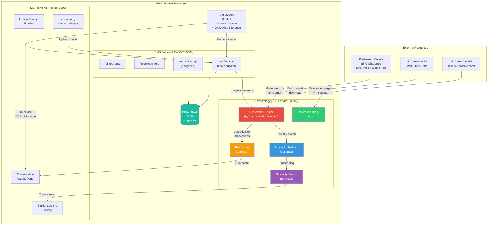

# Product Requirements Document: ISIC Archive Integration into Patient Management System (PMS)

**Document ID:** PRD-PMS-ISICARCHIVE-001
**Version:** 1.0
**Date:** February 21, 2026
**Author:** Ammar (CEO, MPS Inc.)
**Status:** Draft

---

## 1. Executive Summary

The ISIC Archive (International Skin Imaging Collaboration) is the world's largest open-access repository of dermoscopic skin lesion images, maintained by a global academia-industry partnership with the mission of reducing skin cancer mortality through digital imaging and artificial intelligence. The archive contains over 400,000 expert-annotated dermoscopic images spanning nine diagnostic categories — melanoma, melanocytic nevi, basal cell carcinoma, squamous cell carcinoma, actinic keratosis, benign keratosis, dermatofibroma, vascular lesions, and others — with rich metadata including diagnosis, anatomical site, age, sex, and imaging modality. Data is freely available under Creative Commons licenses via a REST API, the `isic-cli` command-line tool, and an AWS Open Data S3 bucket.

Integrating the ISIC Archive into the PMS enables **AI-assisted skin lesion triage** directly within the clinical encounter workflow. When a clinician captures a dermoscopic image of a patient's skin lesion (via the Android app, a USB dermoscope, or an uploaded photo), the PMS can classify the lesion against ISIC-trained deep learning models, retrieve visually similar reference images from the archive for comparison, and generate a structured risk assessment — all within seconds. This transforms the PMS from a passive record-keeping system into an active clinical decision support tool for dermatology, helping primary care providers identify lesions that warrant specialist referral.

The ISIC dataset's role as the benchmark standard for the annual ISIC Challenge (3,400+ participants in 2024, hosted on Kaggle) means that a rich ecosystem of pre-trained models exists. For the PMS, this means deploying proven classification models (EfficientNet, MobileNet, ConvNeXtV2) locally on the Jetson Thor edge device or as a containerized inference service — keeping patient images on-premises for HIPAA compliance while leveraging the collective research of thousands of AI researchers.

---

## 2. Problem Statement

The current PMS has no dermatology-specific clinical decision support, creating gaps in skin lesion assessment workflows:

- **No image-based CDS for skin lesions:** Primary care clinicians frequently encounter suspicious skin lesions during routine exams but lack the diagnostic confidence of a dermatologist. The PMS captures encounter notes but has no mechanism to analyze a dermoscopic image and provide a risk assessment. Clinicians must rely on visual inspection alone (60% accuracy) or refer every suspicious lesion to a dermatologist, creating bottlenecks.
- **No reference image database:** When evaluating a lesion, clinicians benefit from comparing it to confirmed examples. The PMS has no library of reference dermoscopic images to support visual pattern matching — clinicians must search external resources or rely on memory.
- **Delayed specialist referrals:** Without automated triage, low-risk lesions are unnecessarily referred to dermatology (wasting specialist capacity), while high-risk lesions may be missed or deprioritized. There is no structured risk scoring to guide referral urgency.
- **No lesion tracking over time:** Patients with multiple moles or prior skin cancer history need longitudinal monitoring. The PMS cannot compare a current lesion image against prior images to detect changes in size, shape, or color over time.
- **Disconnected from AI research ecosystem:** The ISIC Challenge produces state-of-the-art classification models annually, but the PMS has no pipeline to deploy and update these models. New research advances in skin cancer detection remain inaccessible to PMS clinicians.

---

## 3. Proposed Solution

Build an **ISIC-Powered Dermatology CDS Module** in the PMS that combines ISIC Archive reference data with on-premises AI inference for skin lesion classification, similarity search, and longitudinal tracking.

### 3.1 Architecture Overview

### 3.2 Deployment Model

- **Self-hosted inference:** AI classification runs on-premises within the Docker stack as the `pms-derm-cds` service, ensuring no patient images leave the network. Model weights are downloaded once from public repositories and cached locally.
- **Edge inference option:** For the Android app and Jetson Thor edge device, a TensorFlow Lite / ONNX model provides on-device inference without network dependency, enabling offline skin lesion triage.
- **ISIC reference data cached locally:** A curated subset of ISIC reference images (10,000-50,000 representative examples) is cached in the PMS with pre-computed embeddings for similarity search. Full archive access remains available via the ISIC API for extended searches.
- **HIPAA security envelope:** Patient dermoscopic images are stored encrypted in PostgreSQL (AES-256), never transmitted to external services. Only de-identified embeddings are compared against the ISIC reference dataset. Audit logging tracks every image upload and classification request.
- **Docker container:** Single `pms-derm-cds` container with PyTorch/ONNX Runtime, pre-loaded model weights, and ISIC reference cache.

---

## 4. PMS Data Sources

| PMS API / Data Source | CDS Module Interaction | Direction | Description |
|---|---|---|---|
| `/api/patients` | Patient context for lesion records | Read | Patient demographics, skin cancer history |
| `/api/encounters` | Link lesion assessments to encounters | Read/Write | Associate classification with clinical visit |
| `/api/lesions` (new) | Lesion image upload, classification results, history | Read/Write | Core lesion data: images, classifications, risk scores, timeline |
| `/api/reports` | Aggregate dermatology metrics | Write | Lesion classification statistics, referral rates |
| PostgreSQL `lesion_images` (new) | Encrypted image storage | Write | Raw dermoscopic images, AES-256 encrypted |
| PostgreSQL `lesion_embeddings` (new) | Vector similarity search (pgvector) | Read/Write | 512-dim feature vectors for image similarity |
| ISIC Archive API | Reference image retrieval | Read (external) | Metadata and images for comparison gallery |
| ISIC Archive S3 | Bulk reference dataset | Read (external, one-time) | Initial cache population of reference images |

---

## 5. Component/Module Definitions

### 5.1 AI Inference Engine

**Description:** PyTorch / ONNX Runtime service that classifies dermoscopic images into diagnostic categories using ISIC-trained models (EfficientNet-B4 or MobileNetV3 for edge). Returns probability distribution across 9 ISIC diagnostic classes.

- **Input:** Dermoscopic image (JPEG/PNG, min 224x224px)
- **Output:** Classification probabilities per class, top-3 predictions with confidence scores
- **PMS APIs used:** `/api/lesions` (receive image, store results)

### 5.2 Image Embedding Generator

**Description:** Extracts a 512-dimensional feature vector from the penultimate layer of the classification model. Used for similarity search against ISIC reference images.

- **Input:** Dermoscopic image
- **Output:** 512-dim float32 embedding vector
- **PMS APIs used:** None (internal to CDS service)

### 5.3 Similarity Search Engine

**Description:** Uses pgvector (PostgreSQL vector extension) to find the K most visually similar ISIC reference images to a patient's lesion. Enables "show me confirmed examples that look like this" functionality.

- **Input:** Query embedding vector
- **Output:** Top-K similar ISIC reference images with diagnosis, similarity score, and metadata
- **PMS APIs used:** PostgreSQL `lesion_embeddings` table (pgvector cosine distance)

### 5.4 Risk Score Calculator

**Description:** Converts raw classification probabilities into a structured risk score (low/medium/high) with referral recommendations based on configurable clinical thresholds.

- **Input:** Classification probabilities, patient age, lesion location, lesion change history
- **Output:** Risk level (low/medium/high), referral urgency (routine/expedited/urgent), contributing factors
- **PMS APIs used:** `/api/patients` (age, skin cancer history), `/api/lesions` (prior classifications for trend)

### 5.5 ISIC Reference Cache

**Description:** Locally cached subset of ISIC Archive images and metadata, pre-computed embeddings stored in pgvector. Populated from AWS S3 bucket on initial setup and refreshable via `isic-cli`.

- **Input:** ISIC Archive data (images, metadata CSV, diagnostic labels)
- **Output:** Indexed reference database with embeddings for similarity search
- **PMS APIs used:** None (standalone cache)

### 5.6 Lesion API

**Description:** New FastAPI endpoint (`/api/lesions`) for uploading dermoscopic images, triggering classification, viewing results, and tracking lesion history over time.

- **Input:** Image upload (multipart), patient_id, encounter_id, anatomical_site
- **Output:** Classification results, risk score, similar reference images, longitudinal history
- **PMS APIs used:** `/api/patients`, `/api/encounters`

---

## 6. Non-Functional Requirements

### 6.1 Security and HIPAA Compliance

| Requirement | Implementation |
|---|---|
| Patient image storage | AES-256 encryption at rest; images stored in PostgreSQL large objects or encrypted filesystem |
| No external image transmission | All AI inference runs on-premises; patient images never leave the Docker network |
| De-identified similarity search | Only embedding vectors (not images) are compared against ISIC reference data |
| Audit logging | Every image upload, classification request, and result view logged with user identity and timestamp |
| Access control | Role-based: only clinicians assigned to the patient can view lesion images and results |
| Image retention | Configurable retention policy (default: lifetime of patient record); secure deletion on request |
| ISIC data licensing | ISIC images used under CC-0/CC-BY/CC-BY-NC; no PHI in reference dataset |
| Model provenance | Track which model version produced each classification for reproducibility and liability |

### 6.2 Performance

| Metric | Target |
|---|---|
| Image classification latency | < 2s on CPU, < 500ms on GPU/Jetson |
| Similarity search (pgvector) | < 200ms for top-10 results against 50K reference images |
| Image upload + full pipeline | < 5s total (upload → classify → similarity → risk score) |
| Android on-device inference | < 3s using TFLite quantized model |
| Reference cache size | 50,000 ISIC images with embeddings (~10 GB storage) |
| Concurrent classification requests | 5 simultaneous |

### 6.3 Infrastructure

| Component | Specification |
|---|---|
| CDS Service container | Python 3.12 + PyTorch 2.x + ONNX Runtime + FastAPI |
| GPU (optional) | NVIDIA GPU with CUDA 12+ for accelerated inference; CPU fallback available |
| Memory | 2 GB minimum (CPU mode), 4 GB with GPU |
| Storage | 10 GB for ISIC reference cache + model weights; patient images scale with usage |
| PostgreSQL extension | pgvector 0.7+ for vector similarity search |
| Docker | `pms-derm-cds` service in `docker-compose.yml` |
| Android | TensorFlow Lite model (~15 MB) for on-device inference |

---

## 7. Implementation Phases

### Phase 1: Foundation — Classification + Reference Cache (Sprints 1-3, ~6 weeks)

- Deploy `pms-derm-cds` Docker service with PyTorch/ONNX Runtime
- Download and configure EfficientNet-B4 model pre-trained on ISIC dataset
- Populate ISIC reference cache from AWS S3 (50K representative images)
- Install pgvector and create embedding tables in PostgreSQL
- Create `/api/lesions` endpoint for image upload and classification
- Build basic classification results panel in Next.js frontend
- Implement AES-256 image encryption and audit logging
- Write classification accuracy tests against ISIC test set

### Phase 2: Similarity Search + Risk Scoring (Sprints 4-6, ~6 weeks)

- Implement embedding extraction and pgvector similarity search
- Build Similar Lesions Gallery component in frontend
- Implement Risk Score Calculator with configurable clinical thresholds
- Build Lesion Timeline component for longitudinal tracking
- Add encounter integration (link lesion assessments to visits)
- Add anatomical site body map for lesion location recording
- Build Android camera capture + TFLite on-device inference
- Integration test with clinician feedback on classification quality

### Phase 3: Advanced — Edge Deployment + Model Updates (Sprints 7-9, ~6 weeks)

- Deploy ONNX model on Jetson Thor for edge inference
- Build model update pipeline (download new ISIC Challenge winning models)
- Implement lesion change detection (compare current vs prior embeddings)
- Add FHIR DiagnosticReport output for lesion classifications (bridge to experiment 16)
- Build dermatology dashboard in `/api/reports` with classification statistics
- Add multi-image support (photograph full body region, classify all lesions)
- Performance tuning and clinical validation study
- Staff training on lesion capture and CDS interpretation

---

## 8. Success Metrics

| Metric | Target | Measurement Method |
|---|---|---|
| Classification accuracy (top-1) | > 85% on ISIC test set | Automated evaluation against held-out labeled data |
| Classification accuracy (top-3) | > 95% (correct diagnosis in top 3) | Same as above |
| Triage sensitivity (melanoma) | > 95% (miss rate < 5%) | Clinician-confirmed outcomes vs AI predictions |
| Unnecessary referral reduction | 30% fewer low-risk referrals | Referral count comparison pre/post deployment |
| Time to classification result | < 5s end-to-end | APM latency tracking |
| Clinician adoption rate | 80% of encounters with skin complaints use CDS | Usage analytics |
| Patient images encrypted | 100% | Encryption audit |
| Model update cadence | Annual (post-ISIC Challenge) | Model version tracking |

---

## 9. Risks and Mitigations

| Risk | Impact | Mitigation |
|---|---|---|
| AI classification error leading to missed melanoma | Critical — patient safety | Use AI as **decision support**, not autonomous diagnosis; always require clinician review; set high-sensitivity thresholds that over-refer rather than under-refer |
| Class imbalance in training data (rare cancers underrepresented) | High — poor accuracy on rare lesions | Use ISIC Challenge models that address imbalance (oversampling, focal loss); clearly indicate confidence levels |
| Image quality variation (lighting, focus, camera differences) | Medium — degraded accuracy | Add image quality checks on upload (blur detection, exposure assessment); provide capture guidelines |
| Patient anxiety from AI results | Medium — misinterpretation of risk scores | Never show raw AI output to patients; present results only to clinicians with context and uncertainty estimates |
| Model drift over time as image distribution changes | Low — gradual accuracy decline | Annual model refresh from ISIC Challenge; monitor classification confidence distribution for drift |
| ISIC Archive data licensing changes | Low — reference cache availability | Cache data locally; CC licenses are irrevocable for already-downloaded data |
| GPU unavailability in deployment environment | Medium — slow inference | ONNX Runtime CPU fallback; quantized INT8 models reduce CPU inference time |

---

## 10. Dependencies

| Dependency | Type | Version | Purpose |
|---|---|---|---|
| PyTorch | Python package | 2.x | Deep learning inference engine |
| ONNX Runtime | Python package | 1.17+ | Optimized inference for ONNX models |
| `torchvision` | Python package | 0.18+ | Image transforms, pre-trained model zoo |
| `Pillow` | Python package | 10+ | Image loading and preprocessing |
| `pgvector` | PostgreSQL extension | 0.7+ | Vector similarity search for embeddings |
| `isic-cli` | Python package | 12+ | ISIC Archive data download and management |
| TensorFlow Lite | Android library | 2.16+ | On-device inference for Android app |
| EfficientNet-B4 | Pre-trained model | ISIC 2024 | Primary classification model |
| MobileNetV3 | Pre-trained model | ISIC-trained | Lightweight model for edge/mobile |
| FastAPI | Python framework | 0.110+ | CDS API and lesion endpoints |
| AWS CLI | System tool | 2.x | ISIC S3 bucket data download |

---

## 11. Comparison with Existing Experiments

| Aspect | ISIC Archive (This Experiment) | Gemma 3 (Experiment 13) | Vision Capabilities (Edge) |
|---|---|---|---|
| **Primary purpose** | Skin lesion classification and dermatology CDS | General clinical AI (summarization, extraction, medication intelligence) | Wound assessment, patient ID, document OCR |
| **AI model type** | Specialized CNN (EfficientNet/MobileNet trained on dermoscopy) | General-purpose LLM (multimodal) | Computer vision (object detection, OCR) |
| **Image domain** | Dermoscopic skin lesion images | Clinical notes, medication images | Wound photos, ID cards, documents |
| **Data source** | ISIC Archive (400K+ labeled images, public) | None (model is pre-trained) | Live camera feed |
| **Inference location** | On-premises Docker, Jetson edge, Android on-device | On-premises via Ollama | Jetson Thor edge device |
| **Complementarity** | ISIC handles dermoscopy-specific classification using specialized domain models. Gemma 3 can provide contextual clinical reasoning about ISIC classification results (e.g., "given this patient's history and the ISIC classification, what are the next steps?"). Vision capabilities handle non-dermoscopic imaging. | Gemma 3 provides general medical reasoning but lacks the 400K+ labeled dermoscopy training images that make ISIC models superior for skin lesion classification. | Edge vision handles wound assessment; ISIC handles dermoscopic lesion classification — different image domains and clinical workflows. |

ISIC integration is complementary to both Gemma 3 and Vision capabilities: ISIC provides domain-specific skin lesion expertise that general-purpose models cannot match, while Gemma 3 provides clinical reasoning about the results, and Vision handles non-dermoscopic imaging tasks.

---

## 12. Research Sources

### Official Documentation & Data
- [ISIC Archive](https://www.isic-archive.com/) — Official ISIC repository for skin lesion images
- [ISIC Archive API (Swagger)](https://api.isic-archive.com/api/docs/swagger/) — REST API documentation
- [isic-cli on PyPI](https://pypi.org/project/isic-cli/) — Official CLI tool for programmatic archive access
- [ISIC Archive on AWS Open Data](https://registry.opendata.aws/isic-archive/) — S3 bucket for bulk dataset download

### AI Models & Research
- [ISIC 2024 Challenge (Kaggle)](https://www.kaggle.com/competitions/isic-2024-challenge) — 3,400 participants, 3D TBP skin cancer detection
- [SLICE-3D Dataset (Nature Scientific Data)](https://www.nature.com/articles/s41597-024-03743-w) — 400K lesion images from 3D total body photography
- [Deep Learning for Skin Cancer (Nature Scientific Reports)](https://www.nature.com/articles/s41598-025-15655-9) — Automated early diagnosis framework

### Clinical & Compliance
- [AI in Dermoscopy (PMC)](https://pmc.ncbi.nlm.nih.gov/articles/PMC10959827/) — AI enhancing diagnosis of benign vs malignant lesions
- [Dermoscopy in Telemedicine (NPJ Digital Medicine)](https://www.nature.com/articles/s41746-022-00587-9) — Practice guidelines for tele-dermoscopy

### Ecosystem & Tools
- [isic-cli GitHub](https://github.com/ImageMarkup/isic-cli) — Source code for ISIC CLI tool
- [ISIC Archive GitHub](https://github.com/ImageMarkup/isic-archive) — Archive source code and infrastructure

---

## 13. Appendix: Related Documents

- [ISICArchive Setup Guide](18-ISICArchive-PMS-Developer-Setup-Guide.md) — Step-by-step CDS service deployment and PMS integration
- [ISICArchive Developer Tutorial](18-ISICArchive-Developer-Tutorial.md) — Hands-on onboarding: classify a skin lesion and build a similarity search end-to-end
- [PRD: Gemma 3 PMS Integration](13-PRD-Gemma3-PMS-Integration.md) — Complementary general-purpose clinical AI
- [Vision Capabilities](../features/vision-capabilities.md) — Wound assessment and document OCR on Jetson edge
- [Jetson Deployment Guide](../config/jetson-deployment.md) — Edge device setup for AI inference
- [ISIC Archive Official](https://www.isic-archive.com/) — Public skin lesion image repository
