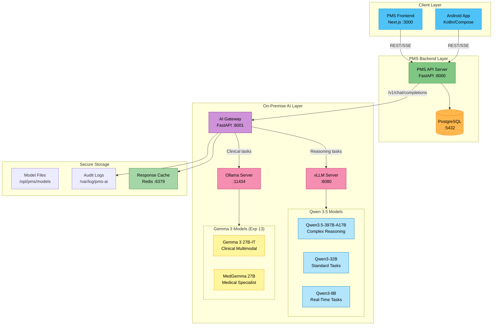

# Product Requirements Document: Qwen 3.5 Integration into Patient Management System (PMS)

**Document ID:** PRD-PMS-QWEN35-001
**Version:** 1.0
**Date:** 2026-02-22
**Author:** Ammar (CEO, MPS Inc.)
**Status:** Draft

---

## 1. Executive Summary

Qwen 3.5 is Alibaba Cloud's open-weight Mixture-of-Experts (MoE) language model, released on February 16, 2026. The flagship model, Qwen3.5-397B-A17B, contains 397 billion total parameters but activates only 17 billion per forward pass through a sparse MoE architecture with 512 experts. This achieves near-frontier performance — 83.6 on LiveCodeBench v6, 91.3 on AIME26, 88.4 on GPQA Diamond, and top-1% CodeForces Elo (2056) — while consuming a fraction of the compute of dense models with equivalent capability. The model supports a 1M token context window and native multimodal input (text + image + video) via early fusion, all under the permissive Apache 2.0 license.

Integrating Qwen 3.5 into the PMS provides a **high-performance on-premise reasoning and code generation engine** that complements the existing Gemma 3 integration (Experiment 13). While Gemma 3 excels at clinical multimodal tasks (medical imaging, encounter summarization, MedGemma clinical QA), Qwen 3.5 fills a distinct gap: complex clinical reasoning, structured data transformation, agentic workflow automation, and code generation for clinical rule engines. With only 17B active parameters per token, it achieves inference efficiency comparable to much smaller models while delivering frontier-class reasoning.

This PRD proposes deploying Qwen 3.5 alongside Gemma 3 in the PMS on-premise AI layer, exposed through the same AI Gateway (FastAPI :8001) with intelligent task-based routing. Qwen 3.5 handles reasoning-heavy tasks (differential diagnosis support, clinical protocol navigation, ICD-10/CPT code suggestion, medication interaction analysis) while Gemma 3 and MedGemma handle multimodal clinical tasks (medical imaging, CXR analysis, pathology). This dual-model strategy maximizes clinical AI capability while maintaining zero PHI data egress.

## 2. Problem Statement

The PMS on-premise AI layer (Experiment 13 — Gemma 3) provides clinical summarization, medical document understanding, and structured data extraction. However, three capability gaps remain:

1. **Complex Reasoning Ceiling:** Gemma 3 27B, while strong for summarization and multimodal tasks, underperforms on tasks requiring deep multi-step reasoning — differential diagnosis chains, medication interaction cascades with 5+ drugs, and complex clinical protocol navigation. Qwen 3.5's 83.6 LiveCodeBench and 91.3 AIME26 scores indicate substantially stronger reasoning capabilities with its thinking mode.

2. **Agentic Code Generation:** The PMS requires automated generation of clinical rule engine code (medication alerts, order set logic, clinical pathway automation). Gemma 3 produces adequate but not exceptional code. Qwen 3.5's top-1% CodeForces performance and dedicated thinking mode for code generation produce significantly more reliable structured outputs for programmatic clinical rules.

3. **Long-Context Clinical Analysis:** Patient histories spanning years of encounters, multi-page referral letters, and longitudinal medication records can exceed 128K tokens. Qwen 3.5's 1M token context window (vs Gemma 3's 128K) enables whole-patient-history reasoning without chunking or summarization loss.

4. **Cost-Efficient Reasoning at Scale:** Running a dense 27B model for every request wastes compute on simple tasks. Qwen 3.5's MoE architecture activates only 17B parameters per token, providing 8.6x–19x faster decoding than equivalent dense models — enabling high-throughput reasoning at lower GPU cost per request.

## 3. Proposed Solution

### 3.1 Architecture Overview

### 3.2 Deployment Model

**Self-Hosted, Air-Gapped Capable:**
- All Qwen 3.5 model weights stored locally alongside existing Gemma 3 models
- No internet connectivity required after initial model download from Hugging Face
- Qwen 3.5 served via **vLLM** (optimal for MoE models with tensor parallelism) while Gemma 3 continues via Ollama
- Docker Compose deployment with GPU passthrough (NVIDIA Container Toolkit)
- AI Gateway routes requests to the appropriate model/backend based on task type

**HIPAA Security Envelope:**
- PHI never leaves the local network — all inference happens on-premise
- Qwen 3.5 runs under Apache 2.0 license — no usage reporting or telemetry
- AI Gateway logs every prompt/response with de-identified metadata for audit trails
- TLS 1.3 encryption for all internal service-to-service communication
- Same RBAC controls as Gemma 3 integration (Experiment 13)

**Model Selection Strategy:**

| Model | Architecture | Active Params | VRAM (int4) | Use Case |
|-------|-------------|---------------|-------------|----------|
| Qwen3.5-397B-A17B | MoE (512 experts) | 17B | ~50 GB (2x GPU) | Complex reasoning, differential diagnosis, long-context analysis |
| Qwen3-32B | Dense | 32B | ~18 GB | Clinical protocol navigation, code generation, structured extraction |
| Qwen3-8B | Dense | 8B | ~5 GB | Real-time autocomplete, quick reasoning, medication lookups |
| Gemma 3 27B-IT | Dense | 27B | ~14.1 GB | Clinical summarization, multimodal imaging (Exp 13) |
| MedGemma 27B | Dense | 27B | ~14.1 GB | Medical QA, CXR analysis, pathology (Exp 13) |

**Task Routing Matrix:**

| Task Category | Primary Model | Fallback | Rationale |
|---------------|--------------|----------|-----------|
| Differential diagnosis | Qwen3.5-397B | Qwen3-32B | Multi-step reasoning with thinking mode |
| Medication interaction analysis | Qwen3.5-397B | Qwen3-32B | Complex cascade analysis across 5+ drugs |
| ICD-10/CPT code suggestion | Qwen3-32B | Qwen3-8B | Structured extraction with JSON mode |
| Clinical rule engine code gen | Qwen3.5-397B | Qwen3-32B | Top-1% CodeForces code quality |
| Clinical note summarization | Gemma 3 27B | Qwen3-32B | Gemma excels at summarization |
| Medical image analysis | MedGemma 27B | Gemma 3 27B | MedGemma trained on clinical images |
| Real-time autocomplete | Qwen3-8B | Gemma 3 4B | Fastest response time |
| Longitudinal patient analysis | Qwen3.5-397B | — | 1M context window required |

## 4. PMS Data Sources

Qwen 3.5 interacts with the following PMS APIs through the AI Gateway:

### Patient Records API (`/api/patients`)
- **Input:** Full patient demographics, medical history, allergies, problem list, longitudinal encounter history
- **Use:** Whole-patient reasoning across 1M token context; differential diagnosis support using complete history; care gap identification
- **Advantage over Gemma 3:** 1M token context allows processing years of patient history without chunking

### Encounter Records API (`/api/encounters`)
- **Input:** Visit notes, chief complaints, assessments, plans, linked orders and results
- **Use:** Complex clinical reasoning across multiple encounters; protocol adherence checking; discharge summary generation with reasoning chains
- **Thinking Mode:** Qwen 3.5's thinking mode produces explicit reasoning chains — valuable for clinical audit trails

### Medication & Prescription API (`/api/prescriptions`)
- **Input:** Active medications, dosages, allergies, renal/hepatic function, drug interaction databases
- **Use:** Multi-drug interaction cascade analysis (5+ medications); dose optimization with explicit pharmacokinetic reasoning; formulary substitution suggestions with clinical rationale
- **Function Calling:** Qwen 3.5 supports tool use for structured database lookups during reasoning

### Reporting API (`/api/reports`)
- **Input:** Aggregate clinical data, quality metrics, utilization patterns, compliance dashboards
- **Use:** Generate clinical rule engine code for automated quality reporting; complex analytical queries in natural language; trend analysis with statistical reasoning

## 5. Component/Module Definitions

### 5.1 AI Gateway Extension — Qwen 3.5 Routing
- **Description:** Extends the existing AI Gateway (Experiment 13) with Qwen 3.5 model routing via vLLM backend
- **Input:** Chat completion requests with task-type hints for intelligent routing
- **Output:** OpenAI-compatible responses, optionally including reasoning chains from thinking mode
- **Key Change:** `MODEL_MAP` extended with Qwen models; task-type header (`X-Task-Type`) enables automatic model selection

### 5.2 Clinical Reasoning Engine
- **Description:** Provides multi-step clinical reasoning with explicit thinking chains. Uses Qwen 3.5's thinking mode to produce auditable reasoning for clinical decisions.
- **Input:** Patient context JSON from `/api/patients` + clinical question or scenario
- **Output:** Structured reasoning output: `{reasoning_chain: [...], conclusion: "...", confidence: 0.XX, references: [...]}`
- **Model:** Qwen3.5-397B-A17B (thinking mode enabled)
- **PMS APIs Used:** `/api/patients`, `/api/encounters`, `/api/prescriptions`

### 5.3 Differential Diagnosis Module
- **Description:** Given symptoms, history, and test results, generates a ranked differential diagnosis with reasoning for each candidate
- **Input:** Symptom list, patient history, lab results, imaging findings
- **Output:** Ranked list of diagnoses with probability estimates and reasoning chains
- **Model:** Qwen3.5-397B-A17B (thinking mode)
- **Safety:** All outputs labeled "AI-Suggested — Requires Physician Review"

### 5.4 Clinical Rule Code Generator
- **Description:** Generates executable Python code for clinical alert rules, order set logic, and pathway automation based on natural language specifications
- **Input:** Natural language rule description (e.g., "Alert if creatinine rises >0.3 mg/dL within 48 hours")
- **Output:** Python function with type hints, validation, and unit tests
- **Model:** Qwen3.5-397B-A17B or Qwen3-32B
- **Safety:** Generated code requires human review and testing before deployment

### 5.5 Long-Context Patient Analysis Module
- **Description:** Processes complete patient histories (up to 1M tokens) for longitudinal analysis, care gap identification, and trend detection
- **Input:** Full patient record JSON spanning multiple years of encounters
- **Output:** Longitudinal summary, identified trends, care gaps, recommended follow-ups
- **Model:** Qwen3.5-397B-A17B (1M context)
- **PMS APIs Used:** `/api/patients` (full history), `/api/encounters` (all encounters), `/api/prescriptions` (medication history)

### 5.6 Structured Code Extraction Module
- **Description:** Extracts ICD-10, CPT, SNOMED codes from clinical narratives with higher accuracy than Gemma 3, using Qwen 3.5's JSON schema mode
- **Input:** Free-text clinical notes from `/api/encounters`
- **Output:** JSON conforming to PMS schema with extracted codes, medications, vitals
- **Model:** Qwen3-32B (JSON schema mode in non-thinking mode)
- **Advantage:** JSON schema enforcement ensures structurally valid output without post-processing

## 6. Non-Functional Requirements

### 6.1 Security and HIPAA Compliance

| Requirement | Implementation |
|-------------|---------------|
| PHI Isolation | All inference runs on-premise; no PHI transmitted to Alibaba Cloud or any external service |
| License | Apache 2.0 — no usage reporting, no telemetry, no restrictions on commercial healthcare use |
| Encryption at Rest | Model files and audit logs encrypted with AES-256 on encrypted filesystem |
| Encryption in Transit | TLS 1.3 for all service-to-service communication within the AI layer |
| Access Control | Same RBAC as Gemma 3 on AI Gateway — clinicians, nurses, admins have different model access |
| Audit Logging | Every prompt/response logged with timestamp, user ID, model used, token count, thinking mode status (PHI redacted) |
| Data Retention | AI inference logs retained for 7 years per HIPAA; response cache TTL of 24 hours |
| Model Integrity | SHA-256 checksums verified on model load; read-only model storage |
| BAA Not Required | No third-party data processor — Qwen 3.5 runs within the covered entity's infrastructure |
| Thinking Chain Audit | When thinking mode is used, the full reasoning chain is logged for clinical decision audit trails |

### 6.2 Performance

| Metric | Target | Notes |
|--------|--------|-------|
| Time to First Token (TTFT) | < 300ms (8B), < 800ms (32B), < 1.5s (397B) | MoE sparsity accelerates 397B |
| Tokens per Second | > 50 tok/s (8B), > 25 tok/s (32B), > 15 tok/s (397B int4) | 8.6x–19x faster decoding than dense equivalent |
| Concurrent Users | 10 simultaneous inference requests | vLLM continuous batching |
| Context Window | Up to 1M tokens for longitudinal analysis | Requires sufficient KV cache memory |
| Thinking Mode Overhead | < 2x latency vs non-thinking mode | Acceptable for non-real-time reasoning tasks |

### 6.3 Infrastructure

| Component | Requirement |
|-----------|------------|
| GPU (397B int4) | 2x NVIDIA A100 80GB or 2x H100 80GB (tensor parallel) |
| GPU (32B int4) | 1x NVIDIA GPU with 24+ GB VRAM (RTX 4090, A6000, L40) |
| GPU (8B int4) | 1x NVIDIA GPU with 8+ GB VRAM (RTX 3070, RTX 4060 Ti) |
| RAM | 64 GB system RAM minimum (128 GB recommended for 397B) |
| Storage | 250 GB for Qwen model files + existing Gemma storage |
| vLLM | vLLM 0.7+ with MoE support |
| Docker | Docker 24+ with NVIDIA Container Toolkit |
| OS | Ubuntu 22.04 LTS or later |

## 7. Implementation Phases

### Phase 1: Foundation (Sprints 1-2, 4 weeks)
- Deploy vLLM with Qwen3-8B and Qwen3-32B in Docker
- Extend AI Gateway with Qwen model routing and task-type headers
- Implement Clinical Reasoning Engine with thinking mode
- Add Qwen models to model health checks and audit logging
- Integration tests with PMS Backend via existing `/api/ai/*` endpoints

### Phase 2: Core Integration (Sprints 3-5, 6 weeks)
- Deploy Qwen3.5-397B-A17B with tensor parallelism across 2 GPUs
- Build Differential Diagnosis Module
- Build Clinical Rule Code Generator
- Build Structured Code Extraction Module with JSON schema mode
- Implement task-based routing in AI Gateway (auto-select Qwen vs Gemma based on task type)
- Frontend: Add reasoning chain display component for thinking mode outputs

### Phase 3: Advanced Features (Sprints 6-8, 6 weeks)
- Enable 1M token context for Long-Context Patient Analysis Module
- Fine-tune Qwen3-32B with LoRA on de-identified clinical reasoning examples
- Build A/B comparison pipeline (Qwen vs Gemma on clinical tasks) for accuracy benchmarking
- Implement intelligent model fallback (397B → 32B → 8B) based on GPU load
- Clinical validation study with physician review panel on differential diagnosis output
- Performance optimization: KV cache management, speculative decoding, batch scheduling

## 8. Success Metrics

| Metric | Target | Measurement Method |
|--------|--------|--------------------|
| Reasoning Accuracy | > 85% physician agreement on differential diagnosis | Blinded review of 200 AI-generated differentials |
| Code Generation Quality | > 90% of generated clinical rules pass unit tests on first attempt | Automated test execution |
| ICD-10 Extraction F1 | > 0.93 F1 score (vs Gemma 3's 0.90 target) | Comparison with manual coding on 500 notes |
| Inference Latency (P95) | < 5 seconds for 397B reasoning task | AI Gateway latency metrics |
| Context Utilization | Successfully process 500K+ token patient histories | Integration test with synthetic long histories |
| GPU Utilization | < 70% average across both GPUs during normal load | nvidia-smi monitoring |
| Cost per Inference | < $0.002 per reasoning request (amortized GPU cost) | Monthly hardware cost / request count |
| Thinking Chain Completeness | 100% of reasoning tasks produce auditable chains | Audit log inspection |

## 9. Risks and Mitigations

| Risk | Impact | Mitigation |
|------|--------|------------|
| 397B model requires 2x A100/H100 GPUs ($20,000-$60,000) | High upfront CapEx | Start with Qwen3-32B on existing GPU; upgrade when ROI justified |
| MoE architecture has higher memory bandwidth requirements | Inference slower than expected | Use vLLM with optimized MoE kernels; enable tensor parallelism |
| Qwen 3.5 not trained specifically on medical data | Lower clinical accuracy than MedGemma | Use for reasoning/coding tasks, not clinical QA; MedGemma handles medical-specific tasks |
| 1M token context requires significant KV cache memory | OOM on long patient histories | Implement progressive context loading; fall back to chunked analysis |
| Thinking mode produces verbose reasoning chains | Storage bloat in audit logs | Compress thinking chains after 90-day retention; summarize for long-term archive |
| Alibaba Cloud model — geopolitical/supply chain risk | Model access restricted | Download and archive all weights offline under Apache 2.0; no cloud dependency |
| Model hallucination in clinical reasoning | Patient safety risk | All outputs labeled "AI-Suggested — Requires Physician Review"; thinking chains enable clinician verification |
| Dual-model (Qwen + Gemma) complexity | Operational overhead | Unified AI Gateway abstracts model selection; single monitoring dashboard |

## 10. Dependencies

| Dependency | Type | Notes |
|------------|------|-------|
| Qwen3.5-397B-A17B weights | Model | Downloaded from Hugging Face (Qwen/Qwen3.5-397B-A17B) |
| Qwen3-32B weights | Model | Downloaded from Hugging Face (Qwen/Qwen3-32B) |
| Qwen3-8B weights | Model | Downloaded from Hugging Face (Qwen/Qwen3-8B) |
| vLLM | Inference Runtime | Apache 2.0 licensed; MoE support required |
| NVIDIA GPU (2x A100/H100 for 397B) | Hardware | Tensor parallelism for MoE model |
| PMS Backend API | Internal | FastAPI endpoints for patients, encounters, prescriptions |
| AI Gateway (Experiment 13) | Internal | Existing OpenAI-compatible proxy — extended, not replaced |
| Redis | Cache | Response caching (shared with Gemma 3 setup) |
| Docker + Docker Compose | Infrastructure | Container orchestration |
| Gemma 3 integration (Experiment 13) | Internal | Complementary — Gemma handles multimodal clinical tasks |

## 11. Comparison with Existing Experiments

### vs. Experiment 13 — Gemma 3 (On-Premise Clinical AI) — COMPLEMENTARY

This is the primary comparison. Qwen 3.5 and Gemma 3 serve **different roles** in the on-premise AI stack:

| Dimension | Gemma 3 (Exp 13) | Qwen 3.5 (This PRD) |
|-----------|------------------|---------------------|
| **Primary Strength** | Multimodal clinical (text + image) | Complex reasoning + code generation |
| **Healthcare Variant** | MedGemma (87.7% MedQA) | None — general-purpose |
| **Context Window** | 128K tokens | 1M tokens |
| **Architecture** | Dense (27B) | MoE (397B total, 17B active) |
| **Coding Benchmark** | Good | Top-1% CodeForces (Elo 2056) |
| **Reasoning Benchmark** | Good | 91.3 AIME26, 88.4 GPQA Diamond |
| **Inference Backend** | Ollama | vLLM (MoE-optimized) |
| **License** | Google Gemma Terms | Apache 2.0 |
| **Best PMS Use** | Summarization, medical imaging, extraction | Differential diagnosis, rule generation, long-context |

**Deployment strategy:** Both models coexist behind the AI Gateway. Task-type routing sends clinical multimodal tasks to Gemma/MedGemma and reasoning/coding tasks to Qwen 3.5.

### vs. Experiment 08 — Adaptive Thinking (Claude API)
Adaptive Thinking routes between Claude effort levels for cloud-based reasoning. Qwen 3.5's thinking mode provides **similar effort-routing locally** — the AI Gateway can toggle thinking mode on/off based on task complexity, achieving the same cost optimization without cloud dependency.

### vs. Experiment 12 — AI Zero-Day Scan
AI Zero-Day Scan uses Claude for security analysis. Qwen 3.5's top-1% coding performance makes it a viable **on-premise replacement** for code security analysis, eliminating cloud API dependency for security scanning of PMS source code.

### vs. Experiment 15 — Claude Model Selection
Claude Model Selection optimizes cost across Claude model tiers. Qwen 3.5's model family (8B/32B/397B) provides an **analogous local tier structure** — the same routing logic (complexity estimation → tier selection) applies to on-premise models.

## 12. Research Sources

### Official Documentation
- [Qwen 3.5 Developer Guide — NxCode](https://www.nxcode.io/resources/news/qwen-3-5-developer-guide-api-visual-agents-2026) — Architecture, API access, self-hosting instructions
- [Qwen3.5 GitHub Repository](https://github.com/QwenLM/Qwen3.5) — Source code, model cards, deployment examples
- [Qwen3.5 Ollama Registry](https://ollama.com/library/qwen3.5) — Ollama model tags and download commands
- [Qwen3.5 vLLM Usage Guide](https://docs.vllm.ai/projects/recipes/en/latest/Qwen/Qwen3.5.html) — vLLM deployment with MoE optimizations

### Architecture & Benchmarks
- [Qwen 3.5 Complete Guide — Digital Applied](https://www.digitalapplied.com/blog/qwen-3-5-agentic-ai-benchmarks-guide) — 397B MoE benchmarks, pricing, agentic capabilities
- [Qwen 3.5 NVIDIA NIM Model Card](https://build.nvidia.com/qwen/qwen3.5-397b-a17b/modelcard) — Hardware requirements, deployment on NVIDIA infrastructure
- [VentureBeat — Qwen 3.5 Analysis](https://venturebeat.com/technology/alibabas-qwen-3-5-397b-a17-beats-its-larger-trillion-parameter-model-at-a) — Performance vs cost analysis
- [Analytics Vidhya — Hands-on Tests](https://www.analyticsvidhya.com/blog/2026/02/qwen3-5-open-weight-qwen3-5-plus/) — Real-world testing and evaluation

### Function Calling & Structured Output
- [Qwen Function Calling Documentation](https://qwen.readthedocs.io/en/latest/framework/function_call.html) — Tool use and function calling guide
- [Qwen Structured Output — Alibaba Cloud](https://www.alibabacloud.com/help/en/model-studio/qwen-structured-output) — JSON mode and schema enforcement

### Comparison
- [Gemma 3 vs Qwen 3 Comparison — CoderSera](https://codersera.com/blog/gemma-3-vs-qwen-3-in-depth-comparison-of-two-leading-open-source-llms) — Feature-by-feature comparison

## 13. Appendix: Related Documents

- [Qwen 3.5 Setup Guide for PMS Integration](20-Qwen35-PMS-Developer-Setup-Guide.md)
- [Qwen 3.5 Developer Onboarding Tutorial](20-Qwen35-Developer-Tutorial.md)
- [Gemma 3 PRD — Experiment 13](13-PRD-Gemma3-PMS-Integration.md)
- [Gemma 3 Setup Guide — Experiment 13](13-Gemma3-PMS-Developer-Setup-Guide.md)
- [Qwen3.5-397B-A17B on Hugging Face](https://huggingface.co/Qwen/Qwen3.5-397B-A17B)
- [Qwen3.5 GitHub Repository](https://github.com/QwenLM/Qwen3.5)
- [vLLM Documentation](https://docs.vllm.ai/)
- [Ollama Qwen 3.5 Registry](https://ollama.com/library/qwen3.5)
