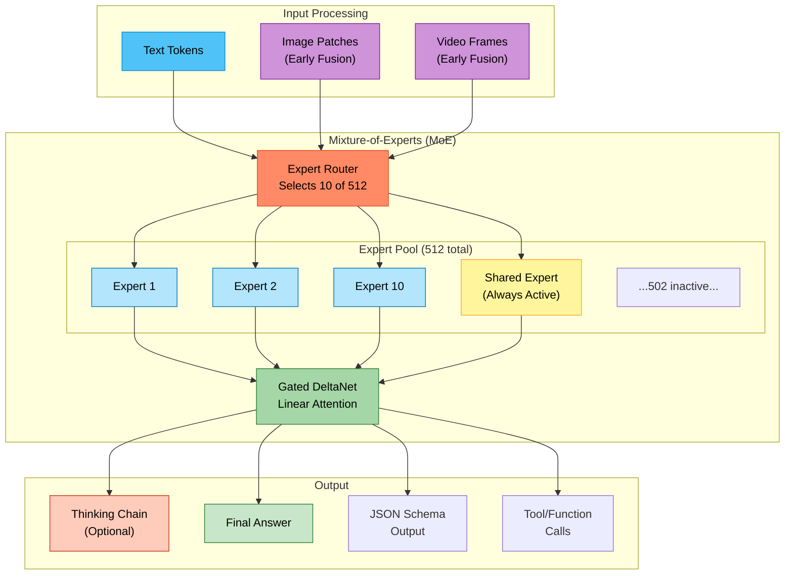
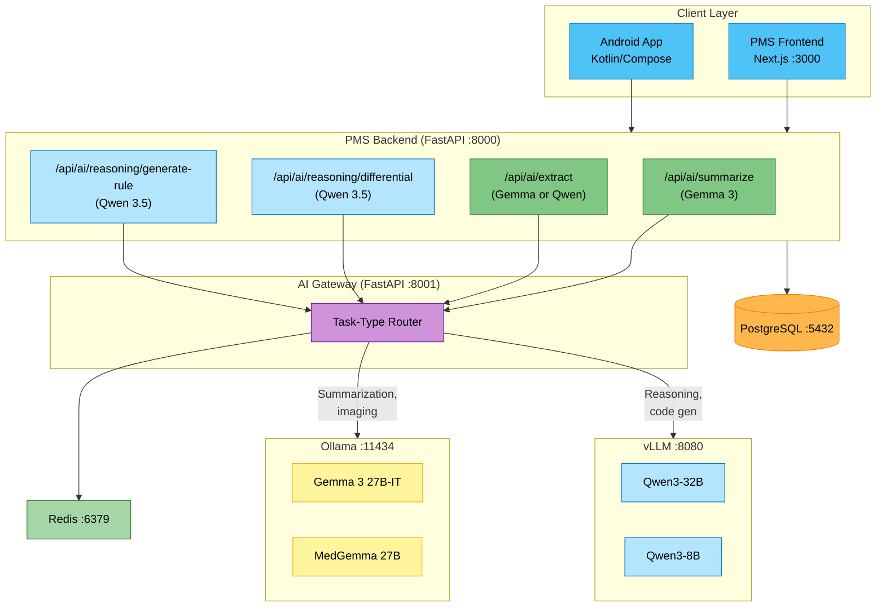

# Qwen 3.5 Developer Onboarding Tutorial

**Welcome to the MPS PMS Qwen 3.5 Integration Team**

This tutorial will take you from zero to building your first Qwen 3.5 integration with the PMS. By the end, you will understand how Qwen 3.5's Mixture-of-Experts architecture works, how it complements Gemma 3 for clinical AI, and have built and tested a clinical reasoning pipeline end-to-end.

**Document ID:** PMS-EXP-QWEN35-002
**Version:** 1.0
**Date:** 2026-02-22
**Applies To:** PMS project (all platforms)
**Prerequisite:** [Qwen 3.5 Setup Guide](20-Qwen35-PMS-Developer-Setup-Guide.md)
**Estimated time:** 2-3 hours
**Difficulty:** Beginner-friendly

---

## What You Will Learn

1. What Qwen 3.5 is and why its MoE architecture matters for on-premise healthcare AI
2. How Qwen 3.5 complements Gemma 3 in the PMS dual-model strategy
3. How Mixture-of-Experts routing activates only 17B of 397B parameters per token
4. How thinking mode produces auditable clinical reasoning chains
5. How to build a differential diagnosis pipeline with Qwen 3.5
6. How to use function calling for structured medication interaction analysis
7. How to generate clinical rule engine code with Qwen 3.5
8. How to compare Qwen 3.5 vs Gemma 3 output quality on clinical tasks
9. When to route tasks to Qwen 3.5 vs Gemma 3 in the AI Gateway
10. HIPAA security considerations for dual-model on-premise deployment

---

## Part 1: Understanding Qwen 3.5 (15 min read)

### 1.1 What Problem Does Qwen 3.5 Solve?

The PMS already has Gemma 3 (Experiment 13) providing on-premise clinical AI. So why add another model? Because Gemma 3 and Qwen 3.5 excel at **different tasks**:

| Clinical Task | Gemma 3 Performance | Qwen 3.5 Performance | Winner |
|---------------|--------------------|-----------------------|--------|
| Encounter note summarization | Excellent | Good | Gemma 3 |
| Medical image analysis (CXR, pathology) | Excellent (MedGemma) | Limited | Gemma 3 |
| Multi-step differential diagnosis | Good | Excellent (thinking mode) | Qwen 3.5 |
| ICD-10/CPT code extraction (structured) | Good | Excellent (JSON schema) | Qwen 3.5 |
| Clinical rule code generation | Adequate | Excellent (top-1% CodeForces) | Qwen 3.5 |
| Long patient history analysis (500K+ tokens) | 128K limit | 1M token context | Qwen 3.5 |
| Drug interaction cascade (5+ medications) | Adequate | Excellent | Qwen 3.5 |
| Medical QA (clinical guidelines) | Excellent (MedGemma) | Good | Gemma 3 |

The PMS needs **both** models — Gemma 3 as the clinical multimodal workhorse and Qwen 3.5 as the reasoning and code generation specialist.

### 1.2 How Qwen 3.5 Works — The Key Pieces



**The key insight:** Each token only activates 10 routed experts + 1 shared expert out of 512 total. This means the 397B model uses only ~17B parameters per forward pass — achieving frontier reasoning with mid-tier compute costs.

### 1.3 How Qwen 3.5 Fits with Other PMS Technologies

| Experiment | Technology | Relationship to Qwen 3.5 |
|------------|-----------|--------------------------|
| 13 — Gemma 3 | On-premise multimodal LLM | **Complementary** — Gemma handles clinical imaging and summarization; Qwen handles reasoning and code generation |
| 08 — Adaptive Thinking | Claude effort routing | **Local alternative** — Qwen's thinking mode toggle replaces cloud-based effort routing |
| 07 — MedASR | Medical speech-to-text | **Upstream** — MedASR transcribes, Qwen reasons over the transcript |
| 10 — Speechmatics | Real-time transcription | **Upstream** — Real-time transcript feeds into Qwen reasoning pipeline |
| 11 — Sanford Guide | Antimicrobial CDS | **Complementary** — Qwen generates natural-language explanations for Sanford Guide recommendations |
| 12 — AI Zero-Day Scan | Security code analysis | **Potential replacement** — Qwen's top-1% coding could replace cloud Claude for code security review |
| 15 — Claude Model Selection | Cost-optimized model routing | **Pattern reuse** — Same routing logic applies to Qwen 8B/32B/397B tiers |
| 18 — ISIC Archive | Dermatology CDS | **Complementary** — ISIC handles image classification; Qwen generates clinical reasoning for risk assessment |

### 1.4 Key Vocabulary

| Term | Meaning |
|------|---------|
| **MoE (Mixture-of-Experts)** | Architecture where each token is processed by a subset of "expert" neural networks, not the full model |
| **Active Parameters** | The 17B parameters actually used per token (out of 397B total) |
| **Expert Router** | Neural network that decides which 10 of 512 experts to activate for each token |
| **Shared Expert** | One expert that always activates for every token, providing common knowledge |
| **Gated DeltaNet** | Qwen 3.5's hybrid linear attention mechanism — uses 64 heads for values and 16 for queries/keys |
| **Thinking Mode** | Explicit reasoning mode where Qwen shows step-by-step logic before answering |
| **JSON Schema Mode** | Structured output mode that guarantees valid JSON conforming to a provided schema |
| **vLLM** | High-throughput inference engine optimized for MoE models with tensor parallelism |
| **AWQ (Activation-Aware Quantization)** | Quantization method that selectively preserves important weights, used for int4 Qwen models |
| **Tensor Parallelism** | Splitting a model across multiple GPUs, required for the 397B model |
| **Apache 2.0** | Permissive open-source license — no restrictions on commercial healthcare use, no telemetry |

### 1.5 Our Architecture



---

## Part 2: Environment Verification (15 min)

### 2.1 Checklist

Verify each service is running. Run these commands and confirm the expected output:

```bash
# 1. vLLM (Qwen 3.5)
curl -s http://localhost:8080/health
# Expected: {"status": "ok"}

# 2. vLLM models loaded
curl -s http://localhost:8080/v1/models | python3 -c "import sys,json; [print(m['id']) for m in json.load(sys.stdin)['data']]"
# Expected: qwen3-32b

# 3. Ollama (Gemma 3 — from Exp 13)
curl -s http://localhost:11434/api/tags | python3 -c "import sys,json; [print(m['name']) for m in json.load(sys.stdin)['models']]"
# Expected: gemma3:4b, gemma3:27b (or similar)

# 4. AI Gateway
curl -s http://localhost:8001/health | python3 -m json.tool
# Expected: {"status": "healthy", "ollama": true, "vllm": true, "redis": true}

# 5. PMS Backend
curl -s http://localhost:8000/api/health | python3 -m json.tool
# Expected: {"status": "healthy"}

# 6. GPU memory
nvidia-smi --query-gpu=name,memory.used,memory.total --format=csv,noheader
# Expected: Shows GPU with memory allocated for models
```

### 2.2 Quick Test

Send a clinical question to Qwen 3.5 and verify you get a reasoning-rich response:

```bash
curl -s http://localhost:8080/v1/chat/completions \
  -H "Content-Type: application/json" \
  -d '{
    "model": "qwen3-32b",
    "messages": [
      {"role": "system", "content": "You are a clinical reasoning assistant. Think step by step."},
      {"role": "user", "content": "A patient on metformin and lisinopril is starting warfarin. What interactions should I monitor?"}
    ],
    "max_tokens": 1024
  }' | python3 -c "import sys,json; print(json.load(sys.stdin)['choices'][0]['message']['content'][:500])"
```

You should see a detailed, step-by-step response discussing drug interactions between the three medications.

---

## Part 3: Build Your First Integration (45 min)

### 3.1 What We Are Building

We will build a **Medication Interaction Analyzer** — a pipeline that:
1. Takes a list of medications from the PMS
2. Sends them to Qwen 3.5 with thinking mode enabled
3. Receives a structured analysis with interaction severity, mechanism, and clinical recommendations
4. Displays the results in a frontend component with color-coded severity

This demonstrates Qwen 3.5's strengths: multi-step reasoning, structured JSON output, and clinical knowledge.

### 3.2 Step 1: Create the Medication Analysis Service

Create `app/services/medication_analyzer.py` in the PMS Backend:

```python
"""Medication Interaction Analyzer — Qwen 3.5 powered."""

import json
import logging
from openai import AsyncOpenAI

logger = logging.getLogger(__name__)

ai_client = AsyncOpenAI(
    base_url="http://localhost:8001/v1",
    api_key="not-needed",
)


async def analyze_interactions(
    medications: list[dict],
    patient_age: int | None = None,
    renal_function: str = "",
    hepatic_function: str = "",
) -> dict:
    """Analyze drug-drug interactions for a medication list.

    Args:
        medications: List of {"name": "...", "dose": "...", "frequency": "..."}
        patient_age: Patient age in years (affects dosing)
        renal_function: eGFR or creatinine clearance
        hepatic_function: Child-Pugh score or "normal"

    Returns:
        Structured interaction analysis with severity ratings
    """
    med_list = "\n".join(
        f"- {m['name']} {m.get('dose', '')} {m.get('frequency', '')}"
        for m in medications
    )

    patient_context = ""
    if patient_age:
        patient_context += f"Patient age: {patient_age} years\n"
    if renal_function:
        patient_context += f"Renal function: {renal_function}\n"
    if hepatic_function:
        patient_context += f"Hepatic function: {hepatic_function}\n"

    system_prompt = (
        "You are a clinical pharmacology expert. Analyze the following medication "
        "list for drug-drug interactions.\n\n"
        "For each interaction found:\n"
        "1. Identify the interacting drugs\n"
        "2. Describe the mechanism (pharmacokinetic or pharmacodynamic)\n"
        "3. Rate severity: Critical / Major / Moderate / Minor\n"
        "4. Describe the clinical effect\n"
        "5. Provide a management recommendation\n\n"
        "Think step by step through each drug pair.\n\n"
        "Output valid JSON:\n"
        "{\n"
        '  "reasoning": "step-by-step analysis...",\n'
        '  "interactions": [\n'
        "    {\n"
        '      "drug_a": "...",\n'
        '      "drug_b": "...",\n'
        '      "mechanism": "...",\n'
        '      "severity": "Critical|Major|Moderate|Minor",\n'
        '      "clinical_effect": "...",\n'
        '      "recommendation": "..."\n'
        "    }\n"
        "  ],\n"
        '  "overall_risk": "High|Medium|Low",\n'
        '  "monitoring_plan": "..."\n'
        "}"
    )

    user_content = f"Current medications:\n{med_list}"
    if patient_context:
        user_content += f"\n\nPatient context:\n{patient_context}"

    response = await ai_client.chat.completions.create(
        model="qwen3-32b",
        messages=[
            {"role": "system", "content": system_prompt},
            {"role": "user", "content": user_content},
        ],
        temperature=0.2,
        max_tokens=4096,
        extra_headers={"X-Task-Type": "reasoning"},
    )

    content = response.choices[0].message.content

    # Parse JSON from response (may be wrapped in markdown code fence)
    if "```json" in content:
        content = content.split("```json")[1].split("```")[0]
    elif "```" in content:
        content = content.split("```")[1].split("```")[0]

    try:
        return json.loads(content.strip())
    except json.JSONDecodeError:
        logger.warning("Failed to parse interaction analysis JSON")
        return {"raw_analysis": content}
```

### 3.3 Step 2: Add the API Endpoint

Create `app/routers/medication_analysis.py`:

```python
"""Medication interaction analysis endpoints."""

from fastapi import APIRouter, HTTPException
from pydantic import BaseModel

from app.services.medication_analyzer import analyze_interactions

router = APIRouter(prefix="/api/ai/medications", tags=["AI Medications"])


class MedicationItem(BaseModel):
    name: str
    dose: str = ""
    frequency: str = ""


class InteractionRequest(BaseModel):
    medications: list[MedicationItem]
    patient_age: int | None = None
    renal_function: str = ""
    hepatic_function: str = ""


@router.post("/interactions")
async def api_analyze_interactions(req: InteractionRequest):
    """Analyze drug-drug interactions for a medication list."""
    if len(req.medications) < 2:
        raise HTTPException(
            status_code=400,
            detail="At least 2 medications required for interaction analysis",
        )
    try:
        result = await analyze_interactions(
            medications=[m.model_dump() for m in req.medications],
            patient_age=req.patient_age,
            renal_function=req.renal_function,
            hepatic_function=req.hepatic_function,
        )
        return {
            "result": result,
            "model": "qwen3-32b",
            "disclaimer": "AI-Analyzed — Verify with pharmacist before clinical action",
        }
    except Exception as e:
        raise HTTPException(status_code=502, detail=f"Analysis error: {e}")
```

Register in `app/main.py`:

```python
from app.routers.medication_analysis import router as med_analysis_router

app.include_router(med_analysis_router)
```

### 3.4 Step 3: Test the Endpoint

```bash
curl -s http://localhost:8000/api/ai/medications/interactions \
  -H "Content-Type: application/json" \
  -d '{
    "medications": [
      {"name": "Warfarin", "dose": "5mg", "frequency": "daily"},
      {"name": "Aspirin", "dose": "81mg", "frequency": "daily"},
      {"name": "Omeprazole", "dose": "20mg", "frequency": "daily"},
      {"name": "Metformin", "dose": "1000mg", "frequency": "BID"},
      {"name": "Lisinopril", "dose": "10mg", "frequency": "daily"}
    ],
    "patient_age": 72,
    "renal_function": "eGFR 55 mL/min"
  }' | python3 -m json.tool
```

Expected output: A structured JSON with interactions between warfarin-aspirin (bleeding risk), warfarin-omeprazole (CYP2C19 inhibition), metformin dose adjustment for eGFR 55, and an overall risk assessment.

### 3.5 Step 4: Build the Frontend Component

Create `src/components/ai/medication-interactions.tsx`:

```tsx
"use client";

import { useState } from "react";

const API_URL = process.env.NEXT_PUBLIC_API_URL || "http://localhost:8000";

interface Medication {
  name: string;
  dose: string;
  frequency: string;
}

interface Interaction {
  drug_a: string;
  drug_b: string;
  mechanism: string;
  severity: "Critical" | "Major" | "Moderate" | "Minor";
  clinical_effect: string;
  recommendation: string;
}

interface AnalysisResult {
  reasoning?: string;
  interactions: Interaction[];
  overall_risk: string;
  monitoring_plan: string;
}

const severityStyles = {
  Critical: "border-red-500 bg-red-50",
  Major: "border-orange-400 bg-orange-50",
  Moderate: "border-yellow-400 bg-yellow-50",
  Minor: "border-gray-300 bg-gray-50",
};

const severityBadge = {
  Critical: "bg-red-600 text-white",
  Major: "bg-orange-500 text-white",
  Moderate: "bg-yellow-500 text-black",
  Minor: "bg-gray-400 text-white",
};

export function MedicationInteractions({
  medications,
  patientAge,
  renalFunction,
}: {
  medications: Medication[];
  patientAge?: number;
  renalFunction?: string;
}) {
  const [result, setResult] = useState<AnalysisResult | null>(null);
  const [loading, setLoading] = useState(false);
  const [error, setError] = useState<string | null>(null);
  const [showReasoning, setShowReasoning] = useState(false);

  const handleAnalyze = async () => {
    setLoading(true);
    setError(null);
    try {
      const res = await fetch(`${API_URL}/api/ai/medications/interactions`, {
        method: "POST",
        headers: { "Content-Type": "application/json" },
        body: JSON.stringify({
          medications,
          patient_age: patientAge,
          renal_function: renalFunction || "",
        }),
      });
      if (!res.ok) throw new Error(res.statusText);
      const data = await res.json();
      setResult(data.result);
    } catch (err) {
      setError(err instanceof Error ? err.message : "Analysis failed");
    } finally {
      setLoading(false);
    }
  };

  return (
    <div className="rounded-lg border border-purple-200 bg-white p-4">
      <div className="mb-3 flex items-center justify-between">
        <h3 className="text-sm font-semibold text-purple-800">
          AI Drug Interaction Analysis
        </h3>
        <button
          onClick={handleAnalyze}
          disabled={loading || medications.length < 2}
          className="rounded bg-purple-600 px-3 py-1 text-xs font-medium text-white hover:bg-purple-700 disabled:opacity-50"
        >
          {loading ? "Analyzing..." : "Analyze Interactions"}
        </button>
      </div>

      {error && (
        <div className="mb-2 rounded bg-red-50 p-2 text-xs text-red-600">
          {error}
        </div>
      )}

      {result && (
        <div className="space-y-3">
          {/* Overall risk */}
          <div className="flex items-center gap-2">
            <span className="text-sm font-medium">Overall Risk:</span>
            <span
              className={`rounded px-2 py-0.5 text-xs font-bold ${
                result.overall_risk === "High"
                  ? "bg-red-100 text-red-700"
                  : result.overall_risk === "Medium"
                  ? "bg-yellow-100 text-yellow-700"
                  : "bg-green-100 text-green-700"
              }`}
            >
              {result.overall_risk}
            </span>
          </div>

          {/* Reasoning toggle */}
          {result.reasoning && (
            <div>
              <button
                onClick={() => setShowReasoning(!showReasoning)}
                className="text-xs text-purple-500 underline"
              >
                {showReasoning ? "Hide" : "Show"} AI Reasoning
              </button>
              {showReasoning && (
                <pre className="mt-1 max-h-32 overflow-y-auto rounded bg-gray-50 p-2 text-xs text-gray-600">
                  {result.reasoning}
                </pre>
              )}
            </div>
          )}

          {/* Interactions */}
          {result.interactions.map((ix, i) => (
            <div
              key={i}
              className={`rounded-lg border-l-4 p-3 ${
                severityStyles[ix.severity]
              }`}
            >
              <div className="flex items-center gap-2">
                <span className="font-medium text-gray-800">
                  {ix.drug_a} + {ix.drug_b}
                </span>
                <span
                  className={`rounded px-1.5 py-0.5 text-xs font-bold ${
                    severityBadge[ix.severity]
                  }`}
                >
                  {ix.severity}
                </span>
              </div>
              <p className="mt-1 text-xs text-gray-600">
                <strong>Mechanism:</strong> {ix.mechanism}
              </p>
              <p className="text-xs text-gray-600">
                <strong>Effect:</strong> {ix.clinical_effect}
              </p>
              <p className="text-xs text-blue-700">
                <strong>Action:</strong> {ix.recommendation}
              </p>
            </div>
          ))}

          {/* Monitoring plan */}
          {result.monitoring_plan && (
            <div className="rounded bg-blue-50 p-2 text-xs text-blue-800">
              <strong>Monitoring Plan:</strong> {result.monitoring_plan}
            </div>
          )}

          {/* Disclaimer */}
          <div className="text-xs text-yellow-600">
            AI-Analyzed — Verify with pharmacist before clinical action
          </div>
        </div>
      )}
    </div>
  );
}
```

### 3.6 Step 5: Verify End-to-End

1. Start all services: `cd ~/pms-ai && docker compose up -d`
2. Start PMS Backend: `cd ~/pms-backend && uvicorn app.main:app --reload`
3. Test the endpoint with the curl command from Step 3.4
4. Verify the response contains structured interactions with severity ratings
5. Open the PMS Frontend and test the `MedicationInteractions` component

**Checkpoint:** You have built a complete medication interaction analysis pipeline powered by Qwen 3.5, with a backend service, API endpoint, and frontend component with color-coded severity indicators and reasoning chain display.

---

## Part 4: Evaluating Strengths and Weaknesses (15 min)

### 4.1 Strengths

1. **Reasoning Quality:** Qwen 3.5's thinking mode produces multi-step clinical reasoning chains that are auditable — critical for healthcare AI where "why" matters as much as "what"
2. **Code Generation:** Top-1% CodeForces Elo (2056) means generated clinical rules, alert logic, and data transformations are reliably correct
3. **MoE Efficiency:** 397B total parameters but only 17B active — you get frontier reasoning at mid-tier compute costs
4. **1M Token Context:** Process entire patient histories without chunking, preserving longitudinal patterns that chunked summarization would lose
5. **Structured Output:** JSON schema mode enforces valid JSON structure, eliminating parsing failures in extraction pipelines
6. **Apache 2.0 License:** No usage restrictions, no telemetry, no BAA needed — most permissive license in the open-weight frontier model space
7. **vLLM Optimization:** Native vLLM support with MoE-specific kernels, continuous batching, and tensor parallelism

### 4.2 Weaknesses

1. **No Healthcare-Specific Variant:** Unlike Gemma 3 (which has MedGemma), Qwen 3.5 has no medical fine-tune. It relies on general knowledge for clinical tasks
2. **Multimodal Limitations:** While Qwen 3.5 supports image input via early fusion, it hasn't been validated on medical imaging (CXR, dermoscopy, pathology) — MedGemma is far superior here
3. **GPU Requirements for 397B:** The flagship model requires 2x A100 80GB (~$20,000-$60,000). The 32B model is more practical for most deployments
4. **MoE Memory Bandwidth:** MoE models are memory-bandwidth bound, not compute-bound. Inference speed depends heavily on GPU memory bandwidth, not just FLOPS
5. **Thinking Mode Latency:** Thinking mode roughly doubles response time. Acceptable for reasoning tasks but too slow for real-time autocomplete
6. **JSON Schema + Thinking Incompatibility:** JSON schema mode (strict structured output) disables thinking mode. You must choose between auditable reasoning chains and guaranteed JSON structure
7. **Geopolitical Risk:** Alibaba Cloud is subject to Chinese government regulations. While Apache 2.0 allows unrestricted use of downloaded weights, future model updates could be affected

### 4.3 When to Use Qwen 3.5 vs Alternatives

| Scenario | Best Model | Why |
|----------|-----------|-----|
| Differential diagnosis with reasoning | **Qwen 3.5** (thinking mode) | Multi-step reasoning with auditable chains |
| Encounter note summarization | **Gemma 3 27B** | Gemma excels at concise clinical summarization |
| Medical image analysis | **MedGemma** | Trained specifically on clinical images |
| Drug interaction analysis (5+ drugs) | **Qwen 3.5** | Complex cascade reasoning |
| ICD-10 code extraction | **Qwen 3.5** (JSON schema) | Guaranteed valid JSON structure |
| Clinical rule code generation | **Qwen 3.5** | Top-1% CodeForces code quality |
| Real-time autocomplete during charting | **Qwen3-8B** or **Gemma 3 4B** | Fastest TTFT, lowest latency |
| Longitudinal patient analysis (years of data) | **Qwen 3.5** (1M context) | Only model with sufficient context window |
| Medical QA ("What's the first-line treatment for...") | **MedGemma 27B** | 87.7% MedQA — trained for this |
| Needs to work without any internet | **Either** | Both are fully local after model download |
| Needs smallest possible GPU | **Gemma 3 4B** (2.6 GB) | Qwen3-8B needs ~5 GB |

### 4.4 HIPAA / Healthcare Considerations

| Consideration | Assessment |
|---------------|-----------|
| **PHI Isolation** | Fully on-premise — no PHI leaves the network. Apache 2.0 includes no telemetry or phone-home. |
| **BAA Required?** | No — no third-party data processor. You own the infrastructure. |
| **Audit Trail** | Thinking mode produces explicit reasoning chains — ideal for clinical audit requirements. Log every reasoning chain with timestamp and user ID. |
| **Clinical Safety** | Qwen 3.5 is a general-purpose model, not validated for clinical use. All outputs must be labeled "AI-Suggested — Requires Physician Review." |
| **Model Integrity** | Download weights once, verify SHA-256 checksums, store read-only. Air-gap capable. |
| **Data at Rest** | Model files and inference logs on AES-256 encrypted filesystem. |
| **Access Control** | AI Gateway RBAC controls which roles can access reasoning endpoints. |
| **21 CFR Part 11** | Thinking chain logs provide the audit trail for electronic record requirements. |

---

## Part 5: Debugging Common Issues (15 min read)

### Issue 1: vLLM Returns "Model Not Found"

**Symptoms:** HTTP 404 when calling `/v1/chat/completions`

**Cause:** Model name in request doesn't match vLLM's `--served-model-name`

**Fix:**
```bash
# Check what model name vLLM is serving
curl -s http://localhost:8080/v1/models | python3 -m json.tool
# Use the exact "id" field in your requests
```

### Issue 2: Slow First Response (30+ seconds)

**Symptoms:** First request after startup takes much longer than subsequent requests

**Cause:** vLLM loading model weights into GPU memory on first request

**Fix:**
```bash
# Pre-warm the model after startup
curl -s http://localhost:8080/v1/chat/completions \
  -H "Content-Type: application/json" \
  -d '{"model": "qwen3-32b", "messages": [{"role": "user", "content": "warmup"}], "max_tokens": 1}' > /dev/null

# Add this to a startup script or Docker healthcheck
```

### Issue 3: JSON Parsing Failures

**Symptoms:** `json.JSONDecodeError` when parsing Qwen 3.5 output

**Cause:** Model wraps JSON in markdown code fences (` ```json ... ``` `) or includes preamble text

**Fix:**
```python
# Strip markdown code fences
if "```json" in content:
    content = content.split("```json")[1].split("```")[0]
elif "```" in content:
    content = content.split("```")[1].split("```")[0]

# For guaranteed JSON, use response_format in non-thinking mode:
response = await client.chat.completions.create(
    model="qwen3-32b",
    messages=messages,
    response_format={"type": "json_object"},  # Disables thinking mode
)
```

### Issue 4: GPU OOM with Both Ollama and vLLM

**Symptoms:** One service crashes after the other loads a model

**Cause:** Both services trying to allocate more GPU memory than available

**Fix:**
```bash
# Option 1: Limit vLLM GPU allocation
# In docker-compose.yml: --gpu-memory-utilization 0.50

# Option 2: Use separate GPUs (if available)
# vLLM: CUDA_VISIBLE_DEVICES=0
# Ollama: CUDA_VISIBLE_DEVICES=1

# Option 3: Time-share — stop unused models
docker exec pms-ollama ollama stop gemma3:27b  # Free GPU for Qwen
```

### Issue 5: Thinking Mode Not Activating

**Symptoms:** Qwen 3.5 answers directly without step-by-step reasoning

**Cause:** System prompt doesn't trigger thinking mode, or JSON schema mode is enabled (which disables thinking)

**Fix:**
```python
# Use explicit thinking prompts:
messages = [
    {"role": "system", "content": "Think step by step before providing your final answer. Show your reasoning process."},
    {"role": "user", "content": clinical_question},
]

# Do NOT combine with response_format={"type": "json_schema", ...}
# Use json_object mode instead if you need reasoning + JSON
```

---

## Part 6: Practice Exercise (45 min)

### Option A: Clinical Protocol Navigator

Build an endpoint that takes a clinical scenario and returns which treatment protocol to follow, with step-by-step reasoning through the decision tree.

**Hints:**
1. Create `app/services/protocol_navigator.py`
2. Use Qwen3-32B with thinking mode
3. System prompt should include common protocol frameworks (e.g., ACLS, Sepsis Bundle)
4. Output: `{reasoning: "...", protocol: "...", steps: [...], contraindications: [...]}`
5. Add a `/api/ai/reasoning/protocol` endpoint
6. Test with: "Patient in septic shock, MAP 55, lactate 4.2, on vasopressors"

### Option B: Automated Lab Result Interpreter

Build a pipeline that takes raw lab results and generates a clinical interpretation with abnormal value flagging.

**Hints:**
1. Create `app/services/lab_interpreter.py`
2. Use Qwen3-32B with JSON schema mode (non-thinking, for structured output)
3. Input: list of `{test: "...", value: "...", unit: "...", reference_range: "..."}`
4. Output: `{interpretations: [{test, status: "normal|low|high|critical", clinical_significance: "..."}], summary: "..."}`
5. Test with a comprehensive metabolic panel (CMP)

### Option C: Qwen vs Gemma Head-to-Head Evaluation

Build a comparison script that sends the same clinical questions to both Qwen 3.5 and Gemma 3, then scores the responses.

**Hints:**
1. Create `scripts/model_comparison.py`
2. Prepare 10 clinical questions spanning summarization, reasoning, and extraction
3. Send each question to both models via the AI Gateway
4. Measure: latency, response length, JSON validity (for extraction tasks)
5. Have a clinician review a blinded sample for accuracy
6. Output: comparison table with scores per category

---

## Part 7: Development Workflow and Conventions

### 7.1 File Organization

```
pms-backend/
├── app/
│   ├── services/
│   │   ├── ai_service.py               # Gemma 3 integration (Exp 13)
│   │   ├── reasoning_service.py         # Qwen 3.5 reasoning
│   │   └── medication_analyzer.py       # Qwen 3.5 medication analysis
│   ├── routers/
│   │   ├── ai.py                        # Gemma 3 endpoints (Exp 13)
│   │   ├── reasoning.py                 # Qwen 3.5 reasoning endpoints
│   │   └── medication_analysis.py       # Qwen 3.5 medication endpoints
│   └── ...
pms-frontend/
├── src/
│   ├── lib/
│   │   └── ai-client.ts                # Client for both Gemma and Qwen endpoints
│   ├── components/ai/
│   │   ├── encounter-summary.tsx        # Gemma 3 (Exp 13)
│   │   ├── structured-extraction.tsx    # Gemma 3 (Exp 13)
│   │   ├── differential-diagnosis.tsx   # Qwen 3.5
│   │   └── medication-interactions.tsx  # Qwen 3.5
│   └── ...
pms-ai/
├── docker-compose.yml                  # Ollama + vLLM + Gateway + Redis
├── gateway/
│   └── main.py                         # AI Gateway with dual-model routing
├── models/
│   ├── ollama/                         # Gemma 3 model files
│   └── vllm/                           # Qwen 3.5 model files
└── logs/                               # Audit logs
```

### 7.2 Naming Conventions

| Item | Convention | Example |
|------|-----------|---------|
| Service files (Qwen) | `snake_case` with descriptive name | `reasoning_service.py` |
| Router files (Qwen) | `snake_case` matching service | `reasoning.py` |
| API endpoints (Qwen) | `/api/ai/reasoning/{action}` | `/api/ai/reasoning/differential` |
| Frontend components (Qwen) | PascalCase with `Panel` suffix | `DifferentialDiagnosisPanel` |
| Model names in Gateway | `qwen3-{size}` | `qwen3-32b`, `qwen3-8b` |
| Task-type headers | `X-Task-Type: {category}` | `X-Task-Type: reasoning` |
| Docker containers (Qwen) | `pms-vllm` or `pms-vllm-fast` | `pms-vllm` |

### 7.3 PR Checklist

When submitting PRs that involve Qwen 3.5:

- [ ] Task routing: Verified the correct model is selected for the task type
- [ ] Thinking mode: Reasoning tasks use thinking mode; extraction tasks use JSON mode (not both)
- [ ] Disclaimer: All AI outputs include "AI-Suggested — Requires Physician Review"
- [ ] Audit logging: Reasoning chains are captured in audit logs
- [ ] Fallback: If vLLM is unavailable, requests gracefully fall back to Gemma 3 or return an error
- [ ] PHI handling: No PHI in logs, model prompts are de-identified where possible
- [ ] Tests: Integration test covers the new endpoint with mocked vLLM responses
- [ ] Documentation: Updated AI Gateway MODEL_MAP if new models or routes added

### 7.4 Security Reminders

1. **Never send PHI to external APIs.** Qwen 3.5 runs locally — keep it that way
2. **Log reasoning chains, not PHI.** Audit logs should capture the AI's reasoning but redact patient identifiers
3. **All clinical AI outputs require human review.** Never auto-apply AI suggestions to patient records
4. **Pin model versions.** Use specific model checksums in `docker-compose.yml` to prevent supply chain attacks
5. **Monitor GPU access.** Only authorized containers should have GPU access via NVIDIA Container Toolkit
6. **Apache 2.0 does not mean "no risk."** The license is permissive, but you are responsible for clinical safety validation

---

## Part 8: Quick Reference Card

### Key Commands

| Action | Command |
|--------|---------|
| Start all AI services | `cd ~/pms-ai && docker compose up -d` |
| Check vLLM health | `curl -s http://localhost:8080/health` |
| List vLLM models | `curl -s http://localhost:8080/v1/models \| python3 -m json.tool` |
| Quick Qwen test | `curl -s http://localhost:8080/v1/chat/completions -H "Content-Type: application/json" -d '{"model":"qwen3-32b","messages":[{"role":"user","content":"Hello"}]}'` |
| GPU memory usage | `nvidia-smi` |
| vLLM logs | `docker logs -f pms-vllm` |
| vLLM metrics | `curl -s http://localhost:8080/metrics` |
| Stop vLLM only | `docker compose stop vllm` |

### Key Files

| File | Purpose |
|------|---------|
| `~/pms-ai/docker-compose.yml` | Service definitions (Ollama + vLLM + Gateway) |
| `~/pms-ai/gateway/main.py` | AI Gateway with dual-model routing |
| `pms-backend/app/services/reasoning_service.py` | Qwen 3.5 reasoning service |
| `pms-backend/app/services/medication_analyzer.py` | Medication interaction analyzer |
| `pms-backend/app/routers/reasoning.py` | Reasoning API endpoints |
| `pms-frontend/src/lib/ai-client.ts` | Frontend AI client (Gemma + Qwen) |
| `pms-frontend/src/components/ai/differential-diagnosis.tsx` | Differential diagnosis UI |
| `pms-frontend/src/components/ai/medication-interactions.tsx` | Medication interaction UI |

### Key URLs

| Service | URL |
|---------|-----|
| vLLM (Qwen 3.5) | http://localhost:8080 |
| Ollama (Gemma 3) | http://localhost:11434 |
| AI Gateway (unified) | http://localhost:8001 |
| PMS Backend | http://localhost:8000 |
| PMS Frontend | http://localhost:3000 |

### Starter Template: New Qwen-Powered Service

```python
"""Template for a new Qwen 3.5-powered clinical service."""

import json
from openai import AsyncOpenAI

ai_client = AsyncOpenAI(base_url="http://localhost:8001/v1", api_key="not-needed")

async def my_clinical_service(patient_data: str) -> dict:
    response = await ai_client.chat.completions.create(
        model="qwen3-32b",
        messages=[
            {"role": "system", "content": "You are a clinical assistant. Think step by step. Output JSON."},
            {"role": "user", "content": patient_data},
        ],
        temperature=0.2,
        max_tokens=4096,
        extra_headers={"X-Task-Type": "reasoning"},
    )
    content = response.choices[0].message.content
    if "```json" in content:
        content = content.split("```json")[1].split("```")[0]
    return json.loads(content.strip())
```

---

## Next Steps

1. **Run the model comparison** (Practice Exercise Option C) to establish your own Qwen vs Gemma benchmarks on PMS-specific clinical tasks
2. **Explore the [Qwen 3.5 PRD](20-PRD-Qwen35-PMS-Integration.md)** for the full integration roadmap and Phase 2-3 plans
3. **Review the [Gemma 3 Tutorial (Experiment 13)](13-Gemma3-Developer-Tutorial.md)** if you haven't completed it — understanding both models is essential for dual-model development
4. **Read the [vLLM Qwen3.5 deployment guide](https://docs.vllm.ai/projects/recipes/en/latest/Qwen/Qwen3.5.html)** for advanced features: tensor parallelism, speculative decoding, and prefix caching
5. **Evaluate Qwen3.5-397B** if you have access to 2x A100/H100 GPUs — the reasoning quality jump from 32B to 397B is significant for complex clinical scenarios
