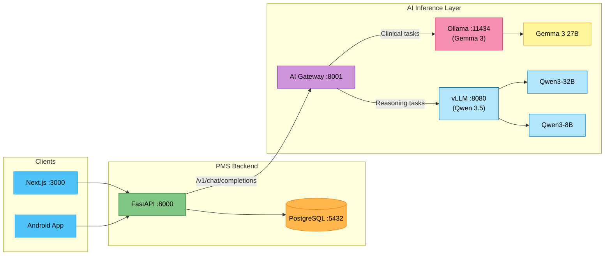

# Qwen 3.5 Setup Guide for PMS Integration

**Document ID:** PMS-EXP-QWEN35-001
**Version:** 1.0
**Date:** 2026-02-22
**Applies To:** PMS project (all platforms)
**Prerequisites Level:** Intermediate

---

## Table of Contents

1. [Overview](#1-overview)
2. [Prerequisites](#2-prerequisites)
3. [Part A: Install and Configure Qwen 3.5 with vLLM](#3-part-a-install-and-configure-qwen-35-with-vllm)
4. [Part B: Integrate with PMS Backend](#4-part-b-integrate-with-pms-backend)
5. [Part C: Integrate with PMS Frontend](#5-part-c-integrate-with-pms-frontend)
6. [Part D: Testing and Verification](#6-part-d-testing-and-verification)
7. [Troubleshooting](#7-troubleshooting)
8. [Reference Commands](#8-reference-commands)

---

## 1. Overview

This guide walks you through deploying Alibaba's Qwen 3.5 open-weight MoE model as a self-hosted AI reasoning engine for the PMS. Qwen 3.5 complements the existing Gemma 3 integration (Experiment 13) by adding frontier-class reasoning, code generation, and 1M token long-context analysis.

By the end, you will have:

- vLLM running with Qwen3-8B (real-time) and Qwen3-32B (reasoning) models
- The existing AI Gateway extended with Qwen model routing
- PMS Backend connected to Qwen models for clinical reasoning and code generation
- PMS Frontend displaying reasoning chains from thinking mode
- Full audit logging with thinking chain capture for HIPAA compliance

> **Note:** This guide assumes you have already completed the [Gemma 3 Setup Guide (Experiment 13)](13-Gemma3-PMS-Developer-Setup-Guide.md). The AI Gateway, Redis cache, and audit logging infrastructure are reused.

### Architecture at a Glance



---

## 2. Prerequisites

### 2.1 Required Software

| Software | Minimum Version | Check Command |
|----------|----------------|---------------|
| Docker | 24.0 | `docker --version` |
| Docker Compose | 2.20 | `docker compose version` |
| NVIDIA Driver | 535+ | `nvidia-smi` |
| NVIDIA Container Toolkit | 1.14 | `nvidia-ctk --version` |
| Python | 3.11 | `python3 --version` |
| Node.js | 20.x | `node --version` |
| Git | 2.40+ | `git --version` |
| curl | any | `curl --version` |
| Gemma 3 Setup (Exp 13) | Complete | `curl -s http://localhost:8001/health` |

### 2.2 GPU Requirements

| Model | Min VRAM | Recommended GPU |
|-------|----------|-----------------|
| Qwen3-8B (int4) | 8 GB | RTX 4060 Ti 16GB, RTX 3070 |
| Qwen3-32B (int4) | 24 GB | RTX 4090, A6000, L40 |
| Qwen3.5-397B-A17B (int4) | 2x 80 GB | 2x A100 80GB, 2x H100 80GB |

> **Getting started:** This guide uses **Qwen3-8B and Qwen3-32B** which run on a single consumer GPU. The 397B model requires multi-GPU setup and is covered as an advanced option.

### 2.3 Verify Existing PMS Services

```bash
# Check PMS Backend
curl -s http://localhost:8000/api/health | python3 -m json.tool

# Check AI Gateway (Gemma 3 setup)
curl -s http://localhost:8001/health | python3 -m json.tool
# Expected: {"status": "healthy", "ollama": true, "redis": true}

# Check Ollama (Gemma 3)
curl -s http://localhost:11434/api/tags | python3 -m json.tool

# Check PostgreSQL
docker exec pms-db pg_isready -U pms
```

All should return healthy responses. If the AI Gateway is not running, complete the [Gemma 3 Setup Guide](13-Gemma3-PMS-Developer-Setup-Guide.md) first.

---

## 3. Part A: Install and Configure Qwen 3.5 with vLLM

### Step 1: Add vLLM Service to Docker Compose

Edit `~/pms-ai/docker-compose.yml` to add the vLLM service alongside the existing Ollama and AI Gateway services:

```yaml
  # Add this service block alongside existing services
  vllm:
    image: vllm/vllm-openai:latest
    container_name: pms-vllm
    restart: unless-stopped
    ports:
      - "8080:8080"
    volumes:
      - ./models/vllm:/root/.cache/huggingface
      - ./logs:/var/log/vllm
    deploy:
      resources:
        reservations:
          devices:
            - driver: nvidia
              count: all
              capabilities: [gpu]
    environment:
      - HF_HOME=/root/.cache/huggingface
    command: >
      --model Qwen/Qwen3-32B-AWQ
      --quantization awq
      --port 8080
      --max-model-len 32768
      --gpu-memory-utilization 0.90
      --enable-auto-tool-choice
      --tool-call-parser hermes
      --served-model-name qwen3-32b
    healthcheck:
      test: ["CMD", "curl", "-f", "http://localhost:8080/health"]
      interval: 30s
      timeout: 10s
      retries: 5
      start_period: 120s
```

### Step 2: Create Model Download Directory

```bash
mkdir -p ~/pms-ai/models/vllm
```

### Step 3: Pre-Download the Model (Optional)

vLLM downloads models automatically on first startup, but you can pre-download for air-gapped deployment:

```bash
# Install huggingface-hub CLI
pip install huggingface-hub

# Download Qwen3-32B (AWQ quantized, ~18 GB)
huggingface-cli download Qwen/Qwen3-32B-AWQ \
  --local-dir ~/pms-ai/models/vllm/models--Qwen--Qwen3-32B-AWQ

# Optional: Download Qwen3-8B for real-time tasks (~5 GB)
huggingface-cli download Qwen/Qwen3-8B-AWQ \
  --local-dir ~/pms-ai/models/vllm/models--Qwen--Qwen3-8B-AWQ
```

### Step 4: Start vLLM Service

```bash
cd ~/pms-ai
docker compose up -d vllm
```

> **First startup takes 2-5 minutes** while vLLM loads the model into GPU memory. Monitor with:
> ```bash
> docker logs -f pms-vllm
> ```
> Wait until you see: `INFO: Started server process` and `INFO: Application startup complete`

### Step 5: Verify vLLM Is Serving

```bash
# Health check
curl -s http://localhost:8080/health
# Expected: {"status": "ok"}

# List models
curl -s http://localhost:8080/v1/models | python3 -m json.tool
# Expected: {"data": [{"id": "qwen3-32b", ...}]}

# Quick test
curl -s http://localhost:8080/v1/chat/completions \
  -H "Content-Type: application/json" \
  -d '{
    "model": "qwen3-32b",
    "messages": [{"role": "user", "content": "What is HIPAA in one sentence?"}],
    "max_tokens": 100
  }' | python3 -m json.tool
```

### Step 6: Test Thinking Mode

Qwen 3.5 supports a thinking mode where it produces explicit reasoning chains before answering:

```bash
curl -s http://localhost:8080/v1/chat/completions \
  -H "Content-Type: application/json" \
  -d '{
    "model": "qwen3-32b",
    "messages": [
      {"role": "system", "content": "You are a clinical reasoning assistant. Think step by step."},
      {"role": "user", "content": "A 58-year-old male presents with sudden onset crushing chest pain radiating to the left arm, diaphoresis, and nausea. BP 160/95, HR 102. What is your differential diagnosis?"}
    ],
    "max_tokens": 2048
  }' | python3 -m json.tool
```

You should see a structured reasoning chain followed by a ranked differential diagnosis.

### Step 7: Optional — Add Qwen3-8B for Real-Time Tasks

To run a second model for fast, real-time tasks, you can start a second vLLM instance:

```yaml
  # Add to docker-compose.yml
  vllm-fast:
    image: vllm/vllm-openai:latest
    container_name: pms-vllm-fast
    restart: unless-stopped
    ports:
      - "8081:8081"
    volumes:
      - ./models/vllm:/root/.cache/huggingface
    deploy:
      resources:
        reservations:
          devices:
            - driver: nvidia
              count: all
              capabilities: [gpu]
    environment:
      - HF_HOME=/root/.cache/huggingface
    command: >
      --model Qwen/Qwen3-8B-AWQ
      --quantization awq
      --port 8081
      --max-model-len 32768
      --gpu-memory-utilization 0.45
      --served-model-name qwen3-8b
```

> **GPU sharing:** If running both models on one GPU, set `--gpu-memory-utilization` to 0.45 for each to avoid OOM. Alternatively, use Ollama to serve the 8B model (it handles model swapping automatically).

**Checkpoint:** vLLM is running with Qwen3-32B, serving OpenAI-compatible chat completions on port 8080. Thinking mode is working and producing reasoning chains.

---

## 4. Part B: Integrate with PMS Backend

### Step 1: Extend the AI Gateway with Qwen Routing

Update `~/pms-ai/gateway/main.py` to add Qwen models and vLLM backend:

```python
# Add vLLM base URL
VLLM_BASE_URL = os.getenv("VLLM_BASE_URL", "http://localhost:8080")

# Extend MODEL_MAP with Qwen models
MODEL_MAP = {
    # Gemma 3 models (via Ollama)
    "gemma3-4b": {"tag": "gemma3:4b", "backend": "ollama"},
    "gemma3-12b": {"tag": "gemma3:12b", "backend": "ollama"},
    "gemma3-27b": {"tag": "gemma3:27b", "backend": "ollama"},
    "medgemma-4b": {"tag": "medgemma:4b", "backend": "ollama"},
    "medgemma-27b": {"tag": "medgemma:27b", "backend": "ollama"},
    # Qwen 3.5 models (via vLLM)
    "qwen3-8b": {"tag": "qwen3-8b", "backend": "vllm"},
    "qwen3-32b": {"tag": "qwen3-32b", "backend": "vllm"},
    "qwen3.5-397b": {"tag": "qwen3.5-397b", "backend": "vllm"},
}

# Task-type to model routing
TASK_ROUTING = {
    "reasoning": "qwen3-32b",
    "differential": "qwen3-32b",
    "code-generation": "qwen3-32b",
    "summarization": "gemma3-27b",
    "medical-qa": "medgemma-27b",
    "extraction": "qwen3-32b",
    "autocomplete": "qwen3-8b",
    "imaging": "medgemma-4b",
}
```

Update the `chat_completions` endpoint to route between Ollama and vLLM:

```python
@app.post("/v1/chat/completions")
async def chat_completions(req: ChatCompletionRequest, request: Request):
    """OpenAI-compatible chat completions — routes to Ollama or vLLM."""
    start = time.monotonic()

    # Auto-route by task type if header present
    task_type = request.headers.get("X-Task-Type", "")
    if task_type and task_type in TASK_ROUTING and req.model == DEFAULT_MODEL:
        req.model = TASK_ROUTING[task_type]

    # Resolve model config
    model_config = MODEL_MAP.get(req.model)
    if not model_config:
        raise HTTPException(status_code=400, detail=f"Unknown model: {req.model}")

    backend = model_config["backend"]
    model_tag = model_config["tag"]

    # Route to appropriate backend
    if backend == "vllm":
        base_url = VLLM_BASE_URL
        payload = {
            "model": model_tag,
            "messages": [m.model_dump() for m in req.messages],
            "temperature": req.temperature,
            "max_tokens": req.max_tokens,
            "stream": req.stream,
        }
        endpoint = f"{base_url}/v1/chat/completions"
    else:
        base_url = OLLAMA_BASE_URL
        payload = {
            "model": model_tag,
            "messages": [m.model_dump() for m in req.messages],
            "options": {
                "temperature": req.temperature,
                "num_predict": req.max_tokens,
            },
            "stream": req.stream,
        }
        endpoint = f"{base_url}/api/chat"

    # ... rest of the request handling (cache check, HTTP call, audit log)
    # vLLM returns OpenAI-compatible format natively — no conversion needed
```

### Step 2: Add Reasoning Service to PMS Backend

Create `app/services/reasoning_service.py` in the PMS Backend:

```python
"""Clinical Reasoning Service — interfaces with Qwen 3.5 via AI Gateway."""

import json
import logging
from openai import AsyncOpenAI

logger = logging.getLogger(__name__)

ai_client = AsyncOpenAI(
    base_url="http://localhost:8001/v1",
    api_key="not-needed",
)

REASONING_MODEL = "qwen3-32b"


async def differential_diagnosis(
    symptoms: list[str],
    patient_history: str,
    lab_results: str = "",
    vitals: dict | None = None,
) -> dict:
    """Generate a ranked differential diagnosis with reasoning chains."""
    system_prompt = (
        "You are a clinical reasoning assistant. Given the patient presentation, "
        "generate a ranked differential diagnosis. For each diagnosis:\n"
        "1. State the diagnosis name and ICD-10 code\n"
        "2. Explain why it fits the presentation (supporting evidence)\n"
        "3. Explain what argues against it (contradicting evidence)\n"
        "4. Assign a likelihood (High/Medium/Low)\n"
        "5. Suggest confirmatory tests\n\n"
        "Think step by step. Show your reasoning process.\n"
        "Output valid JSON with this structure:\n"
        '{"reasoning_chain": "...", "differentials": [{"diagnosis": "...", '
        '"icd10": "...", "supporting": [...], "contradicting": [...], '
        '"likelihood": "...", "confirmatory_tests": [...]}]}'
    )

    vitals_str = ""
    if vitals:
        vitals_str = f"\nVitals: {json.dumps(vitals)}"

    user_content = (
        f"Symptoms: {', '.join(symptoms)}\n"
        f"History: {patient_history}\n"
        f"Labs: {lab_results}{vitals_str}"
    )

    response = await ai_client.chat.completions.create(
        model=REASONING_MODEL,
        messages=[
            {"role": "system", "content": system_prompt},
            {"role": "user", "content": user_content},
        ],
        temperature=0.2,
        max_tokens=4096,
        extra_headers={"X-Task-Type": "differential"},
    )

    content = response.choices[0].message.content
    try:
        return json.loads(content)
    except json.JSONDecodeError:
        return {"raw_reasoning": content}


async def generate_clinical_rule(
    rule_description: str,
    context: str = "",
) -> dict:
    """Generate Python code for a clinical alert rule."""
    system_prompt = (
        "You are a clinical informatics engineer. Generate a Python function "
        "that implements the described clinical rule. Include:\n"
        "- Type hints for all parameters\n"
        "- Input validation\n"
        "- Clear docstring with the rule logic\n"
        "- A companion unit test function\n\n"
        "Output valid JSON with:\n"
        '{"function_code": "...", "test_code": "...", "description": "..."}'
    )

    response = await ai_client.chat.completions.create(
        model=REASONING_MODEL,
        messages=[
            {"role": "system", "content": system_prompt},
            {"role": "user", "content": f"Rule: {rule_description}\nContext: {context}"},
        ],
        temperature=0.1,
        max_tokens=4096,
        extra_headers={"X-Task-Type": "code-generation"},
    )

    content = response.choices[0].message.content
    try:
        return json.loads(content)
    except json.JSONDecodeError:
        return {"raw_code": content}
```

### Step 3: Add Reasoning Endpoints to the PMS API

Create `app/routers/reasoning.py`:

```python
"""Clinical reasoning endpoints powered by Qwen 3.5."""

from fastapi import APIRouter, HTTPException
from pydantic import BaseModel

from app.services.reasoning_service import (
    differential_diagnosis,
    generate_clinical_rule,
)

router = APIRouter(prefix="/api/ai/reasoning", tags=["AI Reasoning"])


class DifferentialRequest(BaseModel):
    symptoms: list[str]
    patient_history: str
    lab_results: str = ""
    vitals: dict | None = None


class ClinicalRuleRequest(BaseModel):
    rule_description: str
    context: str = ""


@router.post("/differential")
async def api_differential(req: DifferentialRequest):
    """Generate a ranked differential diagnosis with reasoning chains."""
    try:
        result = await differential_diagnosis(
            symptoms=req.symptoms,
            patient_history=req.patient_history,
            lab_results=req.lab_results,
            vitals=req.vitals,
        )
        return {
            "result": result,
            "model": "qwen3-32b",
            "disclaimer": "AI-Suggested — Requires Physician Review",
        }
    except Exception as e:
        raise HTTPException(status_code=502, detail=f"Reasoning service error: {e}")


@router.post("/generate-rule")
async def api_generate_rule(req: ClinicalRuleRequest):
    """Generate Python code for a clinical alert rule."""
    try:
        result = await generate_clinical_rule(
            rule_description=req.rule_description,
            context=req.context,
        )
        return {
            "result": result,
            "model": "qwen3-32b",
            "disclaimer": "AI-Generated Code — Requires Human Review and Testing",
        }
    except Exception as e:
        raise HTTPException(status_code=502, detail=f"Code generation error: {e}")
```

Register in `app/main.py`:

```python
from app.routers.reasoning import router as reasoning_router

app.include_router(reasoning_router)
```

### Step 4: Add Environment Variables

Add to `.env`:

```env
# Qwen 3.5 Configuration (extends existing AI config)
VLLM_BASE_URL=http://localhost:8080
AI_REASONING_MODEL=qwen3-32b
AI_FAST_MODEL=qwen3-8b
```

**Checkpoint:** PMS Backend now has `/api/ai/reasoning/differential` and `/api/ai/reasoning/generate-rule` endpoints that route to Qwen 3.5 via vLLM for clinical reasoning and code generation.

---

## 5. Part C: Integrate with PMS Frontend

### Step 1: Add Reasoning Client Functions

Add to `src/lib/ai-client.ts`:

```typescript
export interface DifferentialDiagnosis {
  diagnosis: string;
  icd10: string;
  supporting: string[];
  contradicting: string[];
  likelihood: "High" | "Medium" | "Low";
  confirmatory_tests: string[];
}

export interface DifferentialResponse {
  result: {
    reasoning_chain?: string;
    differentials: DifferentialDiagnosis[];
    raw_reasoning?: string;
  };
  model: string;
  disclaimer: string;
}

export interface ClinicalRuleResponse {
  result: {
    function_code?: string;
    test_code?: string;
    description?: string;
    raw_code?: string;
  };
  model: string;
  disclaimer: string;
}

export async function getDifferentialDiagnosis(
  symptoms: string[],
  patientHistory: string,
  labResults?: string,
  vitals?: Record<string, string>
): Promise<DifferentialResponse> {
  const res = await fetch(`${API_URL}/api/ai/reasoning/differential`, {
    method: "POST",
    headers: { "Content-Type": "application/json" },
    body: JSON.stringify({
      symptoms,
      patient_history: patientHistory,
      lab_results: labResults || "",
      vitals: vitals || null,
    }),
  });

  if (!res.ok) {
    throw new Error(`Differential diagnosis failed: ${res.statusText}`);
  }

  return res.json();
}

export async function generateClinicalRule(
  ruleDescription: string,
  context?: string
): Promise<ClinicalRuleResponse> {
  const res = await fetch(`${API_URL}/api/ai/reasoning/generate-rule`, {
    method: "POST",
    headers: { "Content-Type": "application/json" },
    body: JSON.stringify({
      rule_description: ruleDescription,
      context: context || "",
    }),
  });

  if (!res.ok) {
    throw new Error(`Rule generation failed: ${res.statusText}`);
  }

  return res.json();
}
```

### Step 2: Create the Differential Diagnosis Component

Create `src/components/ai/differential-diagnosis.tsx`:

```tsx
"use client";

import { useState } from "react";
import {
  getDifferentialDiagnosis,
  type DifferentialResponse,
} from "@/lib/ai-client";

interface DifferentialDiagnosisProps {
  symptoms: string[];
  patientHistory: string;
  labResults?: string;
  vitals?: Record<string, string>;
}

const likelihoodColor = {
  High: "bg-red-100 text-red-700",
  Medium: "bg-yellow-100 text-yellow-700",
  Low: "bg-gray-100 text-gray-600",
};

export function DifferentialDiagnosisPanel({
  symptoms,
  patientHistory,
  labResults,
  vitals,
}: DifferentialDiagnosisProps) {
  const [result, setResult] = useState<DifferentialResponse | null>(null);
  const [loading, setLoading] = useState(false);
  const [error, setError] = useState<string | null>(null);
  const [showReasoning, setShowReasoning] = useState(false);

  const handleGenerate = async () => {
    setLoading(true);
    setError(null);
    try {
      const data = await getDifferentialDiagnosis(
        symptoms,
        patientHistory,
        labResults,
        vitals
      );
      setResult(data);
    } catch (err) {
      setError(err instanceof Error ? err.message : "Failed to generate");
    } finally {
      setLoading(false);
    }
  };

  return (
    <div className="rounded-lg border border-blue-200 bg-white p-4">
      <div className="mb-3 flex items-center justify-between">
        <h3 className="text-sm font-semibold text-blue-800">
          AI Differential Diagnosis
        </h3>
        <button
          onClick={handleGenerate}
          disabled={loading || symptoms.length === 0}
          className="rounded bg-blue-600 px-3 py-1 text-xs font-medium text-white hover:bg-blue-700 disabled:opacity-50"
        >
          {loading ? "Reasoning..." : "Generate Differential"}
        </button>
      </div>

      {error && (
        <div className="mb-2 rounded bg-red-50 p-2 text-xs text-red-600">
          {error}
        </div>
      )}

      {result?.result.differentials && (
        <div className="space-y-3">
          {/* Reasoning chain toggle */}
          {result.result.reasoning_chain && (
            <div>
              <button
                onClick={() => setShowReasoning(!showReasoning)}
                className="text-xs text-blue-500 underline"
              >
                {showReasoning ? "Hide" : "Show"} Reasoning Chain
              </button>
              {showReasoning && (
                <pre className="mt-1 max-h-40 overflow-y-auto rounded bg-gray-50 p-2 text-xs text-gray-600">
                  {result.result.reasoning_chain}
                </pre>
              )}
            </div>
          )}

          {/* Differential list */}
          {result.result.differentials.map((dx, i) => (
            <div key={i} className="rounded border border-gray-100 p-3">
              <div className="flex items-center gap-2">
                <span className="font-medium text-gray-800">
                  {i + 1}. {dx.diagnosis}
                </span>
                <span className="rounded bg-gray-200 px-1.5 py-0.5 text-xs font-mono">
                  {dx.icd10}
                </span>
                <span
                  className={`rounded px-1.5 py-0.5 text-xs font-medium ${
                    likelihoodColor[dx.likelihood]
                  }`}
                >
                  {dx.likelihood}
                </span>
              </div>
              <div className="mt-2 grid grid-cols-2 gap-2 text-xs">
                <div>
                  <span className="font-medium text-green-600">Supporting:</span>
                  <ul className="mt-0.5 list-inside list-disc text-gray-600">
                    {dx.supporting.map((s, j) => (
                      <li key={j}>{s}</li>
                    ))}
                  </ul>
                </div>
                <div>
                  <span className="font-medium text-red-600">Against:</span>
                  <ul className="mt-0.5 list-inside list-disc text-gray-600">
                    {dx.contradicting.map((c, j) => (
                      <li key={j}>{c}</li>
                    ))}
                  </ul>
                </div>
              </div>
              {dx.confirmatory_tests.length > 0 && (
                <div className="mt-1 text-xs">
                  <span className="font-medium text-purple-600">Tests:</span>{" "}
                  {dx.confirmatory_tests.join(", ")}
                </div>
              )}
            </div>
          ))}

          {/* Disclaimer */}
          <div className="flex items-center gap-2 text-xs text-gray-400">
            <span>Model: {result.model}</span>
            <span className="rounded bg-yellow-100 px-1.5 py-0.5 text-yellow-700">
              {result.disclaimer}
            </span>
          </div>
        </div>
      )}
    </div>
  );
}
```

**Checkpoint:** PMS Frontend now has a `DifferentialDiagnosisPanel` component that calls the Qwen 3.5-powered reasoning endpoint and displays ranked differentials with reasoning chains and likelihood indicators.

---

## 6. Part D: Testing and Verification

### Service Health Checks

```bash
# 1. vLLM health (Qwen 3.5)
curl -s http://localhost:8080/health
# Expected: {"status": "ok"}

# 2. vLLM models
curl -s http://localhost:8080/v1/models | python3 -m json.tool
# Expected: {"data": [{"id": "qwen3-32b", ...}]}

# 3. AI Gateway health (should show both Ollama and vLLM)
curl -s http://localhost:8001/health | python3 -m json.tool
# Expected: {"status": "healthy", "ollama": true, "vllm": true, "redis": true}

# 4. Ollama health (Gemma 3 — still running)
curl -s http://localhost:11434/api/tags | python3 -m json.tool
```

### Functional Tests

```bash
# Test differential diagnosis
curl -s http://localhost:8000/api/ai/reasoning/differential \
  -H "Content-Type: application/json" \
  -d '{
    "symptoms": ["crushing chest pain", "diaphoresis", "nausea", "left arm radiation"],
    "patient_history": "58-year-old male, smoker, hypertension, hyperlipidemia, family history of MI",
    "lab_results": "Troponin I: 0.8 ng/mL (elevated), BNP: 450 pg/mL",
    "vitals": {"bp": "160/95", "hr": "102", "spo2": "96%", "temp": "37.1C"}
  }' | python3 -m json.tool
# Expected: Ranked differential with STEMI, unstable angina, etc.

# Test clinical rule generation
curl -s http://localhost:8000/api/ai/reasoning/generate-rule \
  -H "Content-Type: application/json" \
  -d '{
    "rule_description": "Alert if serum creatinine rises more than 0.3 mg/dL within 48 hours, suggesting acute kidney injury per KDIGO criteria",
    "context": "PMS database stores lab results with timestamps in the lab_results table"
  }' | python3 -m json.tool
# Expected: Python function + unit test for AKI detection rule

# Test thinking mode via direct vLLM call
curl -s http://localhost:8080/v1/chat/completions \
  -H "Content-Type: application/json" \
  -d '{
    "model": "qwen3-32b",
    "messages": [
      {"role": "system", "content": "Think step by step before answering."},
      {"role": "user", "content": "Patient on warfarin (INR 2.5) needs dental extraction. What are the management options?"}
    ],
    "max_tokens": 2048
  }' | python3 -m json.tool
```

### Gemma 3 vs Qwen 3.5 Comparison Test

```bash
# Same clinical question to both models — compare output quality

# Gemma 3 (via Ollama)
echo "=== Gemma 3 27B ===" && \
curl -s http://localhost:8001/v1/chat/completions \
  -H "Content-Type: application/json" \
  -d '{
    "model": "gemma3-27b",
    "messages": [{"role": "user", "content": "Explain the pathophysiology of diabetic ketoacidosis step by step."}]
  }' | python3 -c "import sys,json; print(json.load(sys.stdin)['choices'][0]['message']['content'][:500])"

echo ""

# Qwen 3.5 (via vLLM)
echo "=== Qwen3-32B ===" && \
curl -s http://localhost:8001/v1/chat/completions \
  -H "Content-Type: application/json" \
  -d '{
    "model": "qwen3-32b",
    "messages": [{"role": "user", "content": "Explain the pathophysiology of diabetic ketoacidosis step by step."}]
  }' | python3 -c "import sys,json; print(json.load(sys.stdin)['choices'][0]['message']['content'][:500])"
```

### Performance Baseline

```bash
# Measure Qwen3-32B latency
time curl -s http://localhost:8080/v1/chat/completions \
  -H "Content-Type: application/json" \
  -d '{
    "model": "qwen3-32b",
    "messages": [{"role": "user", "content": "Hello"}],
    "max_tokens": 50
  }' > /dev/null

# Measure Qwen3-32B reasoning latency (thinking mode)
time curl -s http://localhost:8080/v1/chat/completions \
  -H "Content-Type: application/json" \
  -d '{
    "model": "qwen3-32b",
    "messages": [
      {"role": "system", "content": "Think step by step."},
      {"role": "user", "content": "What drug interactions exist between warfarin, aspirin, and omeprazole?"}
    ],
    "max_tokens": 2048
  }' > /dev/null
```

**Checkpoint:** vLLM and Qwen3-32B are healthy, differential diagnosis and rule generation produce correct outputs, you have baseline latency numbers, and you can compare Qwen vs Gemma output quality on the same clinical questions.

---

## 7. Troubleshooting

### vLLM Fails to Start / Model Not Found

**Symptoms:** `docker logs pms-vllm` shows "Model not found" or download errors

**Solution:**
```bash
# Pre-download the model manually
pip install huggingface-hub
huggingface-cli download Qwen/Qwen3-32B-AWQ \
  --local-dir ~/pms-ai/models/vllm/models--Qwen--Qwen3-32B-AWQ

# Point vLLM to local path in docker-compose.yml:
# command: --model /root/.cache/huggingface/models--Qwen--Qwen3-32B-AWQ
```

### GPU Out of Memory (OOM) Running Both Ollama and vLLM

**Symptoms:** Either Ollama or vLLM crashes with OOM when both run simultaneously

**Solution:**
```bash
# Check GPU memory usage
nvidia-smi

# Option 1: Reduce vLLM GPU allocation
# In docker-compose.yml, set: --gpu-memory-utilization 0.50

# Option 2: Use Ollama only (it handles model swapping)
docker exec pms-ollama ollama pull qwen3.5

# Option 3: Stop Gemma models when not needed
docker exec pms-ollama ollama stop gemma3:27b
```

### vLLM Returns Empty or Truncated Responses

**Symptoms:** Responses cut off mid-sentence or return empty content

**Solution:**
```bash
# Increase max_tokens in the request (default may be too low)
# In the curl request, add: "max_tokens": 4096

# Check vLLM max model length
docker logs pms-vllm | grep "max_model_len"
# If limited, increase: --max-model-len 65536

# Check vLLM memory pressure
docker logs pms-vllm | grep "KV cache"
```

### Thinking Mode Not Producing Reasoning Chains

**Symptoms:** Qwen 3.5 answers directly without showing step-by-step reasoning

**Solution:**
```bash
# Thinking mode requires explicit prompting. Use system prompt:
# "Think step by step before providing your final answer."

# For JSON output with reasoning, specify the structure in the prompt:
# "Output JSON with {reasoning_chain: '...', answer: '...'}"

# Note: Structured output (json_schema mode) disables thinking mode
# Use json_object mode instead if you need both reasoning and JSON
```

### AI Gateway Routing Errors

**Symptoms:** Requests to Qwen models return 502 or "Unknown model"

**Solution:**
```bash
# Verify AI Gateway has been updated with Qwen MODEL_MAP
docker exec pms-ai-gateway python3 -c "from gateway.main import MODEL_MAP; print(MODEL_MAP)"

# Verify vLLM is reachable from Gateway container
docker exec pms-ai-gateway curl -s http://vllm:8080/health

# Check Docker network connectivity
docker network inspect pms-ai_default
```

---

## 8. Reference Commands

### Daily Development Workflow

```bash
# Start all AI services (Ollama + vLLM + Gateway + Redis)
cd ~/pms-ai && docker compose up -d

# Check status of all services
docker compose ps

# View vLLM logs
docker logs -f pms-vllm

# Stop all services
docker compose down
```

### Model Management

```bash
# List vLLM models
curl -s http://localhost:8080/v1/models | python3 -m json.tool

# Check vLLM GPU memory usage
docker exec pms-vllm nvidia-smi

# Pull Qwen models via Ollama (alternative to vLLM)
docker exec pms-ollama ollama pull qwen3.5

# List all models across both backends
echo "=== Ollama ===" && curl -s http://localhost:11434/api/tags | python3 -c "import sys,json; [print(m['name']) for m in json.load(sys.stdin)['models']]"
echo "=== vLLM ===" && curl -s http://localhost:8080/v1/models | python3 -c "import sys,json; [print(m['id']) for m in json.load(sys.stdin)['data']]"
```

### Monitoring Commands

```bash
# GPU utilization (both models)
watch -n 1 nvidia-smi

# vLLM metrics
curl -s http://localhost:8080/metrics | grep vllm

# AI Gateway audit logs
docker logs -f pms-ai-gateway | grep audit

# Compare request latencies
docker logs pms-ai-gateway 2>&1 | grep latency_ms | tail -20
```

### Useful URLs

| Service | URL | Purpose |
|---------|-----|---------|
| vLLM API | http://localhost:8080 | Direct vLLM access (Qwen models) |
| vLLM Models | http://localhost:8080/v1/models | List Qwen models |
| vLLM Health | http://localhost:8080/health | vLLM health check |
| vLLM Metrics | http://localhost:8080/metrics | Prometheus metrics |
| Ollama API | http://localhost:11434 | Direct Ollama access (Gemma models) |
| AI Gateway | http://localhost:8001 | Unified OpenAI-compatible API |
| AI Gateway Health | http://localhost:8001/health | Combined health check |
| PMS Backend | http://localhost:8000 | PMS API server |
| PMS Frontend | http://localhost:3000 | PMS web UI |

---

## Next Steps

1. Complete the [Qwen 3.5 Developer Tutorial](20-Qwen35-Developer-Tutorial.md) to build your first clinical reasoning integration end-to-end
2. Review the [Qwen 3.5 PRD](20-PRD-Qwen35-PMS-Integration.md) for the full integration roadmap and comparison with Gemma 3
3. Review the [Gemma 3 Setup Guide (Experiment 13)](13-Gemma3-PMS-Developer-Setup-Guide.md) if you haven't completed it
4. Explore the [vLLM Qwen3.5 Usage Guide](https://docs.vllm.ai/projects/recipes/en/latest/Qwen/Qwen3.5.html) for advanced deployment options

---

## Resources

- [Qwen3.5 GitHub Repository](https://github.com/QwenLM/Qwen3.5)
- [Qwen3.5 on Hugging Face](https://huggingface.co/Qwen/Qwen3.5-397B-A17B)
- [Qwen3.5 Ollama Registry](https://ollama.com/library/qwen3.5)
- [vLLM Qwen3.5 Deployment Guide](https://docs.vllm.ai/projects/recipes/en/latest/Qwen/Qwen3.5.html)
- [vLLM Documentation](https://docs.vllm.ai/)
- [Qwen Function Calling Guide](https://qwen.readthedocs.io/en/latest/framework/function_call.html)
- [Qwen Structured Output Guide](https://www.alibabacloud.com/help/en/model-studio/qwen-structured-output)
- [NVIDIA Container Toolkit](https://docs.nvidia.com/datacenter/cloud-native/container-toolkit/latest/install-guide.html)
- [Gemma 3 Setup Guide — Experiment 13](13-Gemma3-PMS-Developer-Setup-Guide.md)
