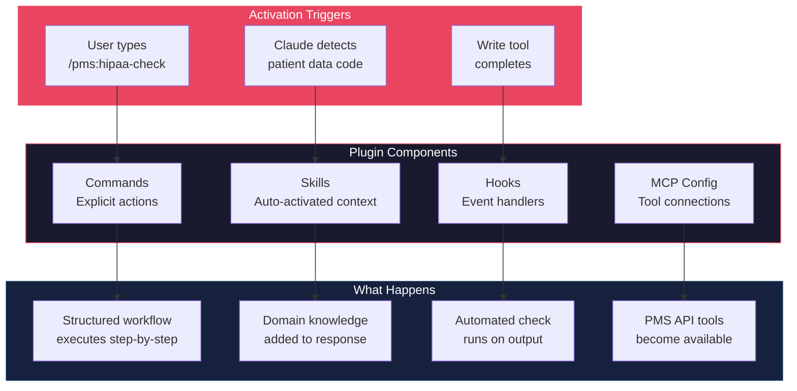
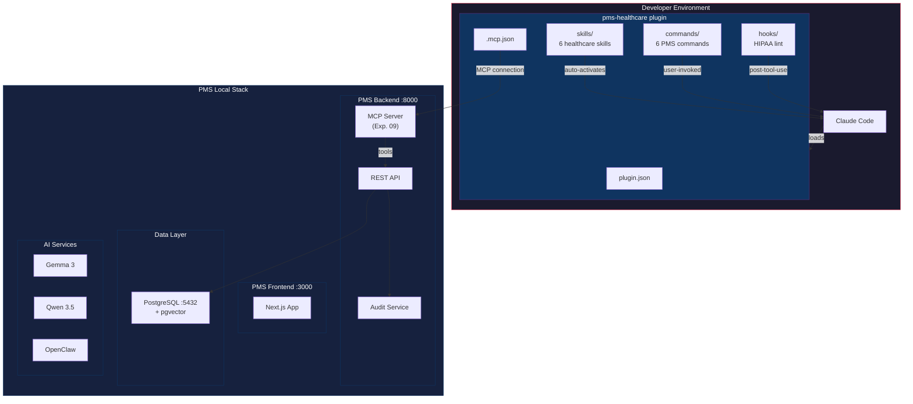

# Knowledge Work Plugins Developer Onboarding Tutorial

**Welcome to the MPS PMS Knowledge Work Plugins Integration Team**

This tutorial will take you from zero to building your first custom Claude Code plugin for the PMS. By the end, you will understand how the plugin framework works, have built and tested a PMS-specific plugin with skills, commands, and hooks, and evaluated the framework's strengths and weaknesses for healthcare development workflows.

**Document ID:** PMS-EXP-KWPLUGINS-002
**Version:** 1.0
**Date:** 2026-02-24
**Applies To:** PMS project (all platforms)
**Prerequisite:** [Knowledge Work Plugins Setup Guide](24-KnowledgeWorkPlugins-PMS-Developer-Setup-Guide.md)
**Estimated time:** 2-3 hours
**Difficulty:** Beginner-friendly

---

## What You Will Learn

1. How Claude Code plugins work and why they matter for healthcare development
2. The four plugin components: manifest, skills, commands, and hooks
3. How the `~~category` placeholder system enables tool-agnostic workflows
4. How to create a HIPAA compliance skill that auto-activates on patient data code
5. How to build a clinical documentation command that designs encounter workflows
6. How to configure MCP connections for PMS backend access
7. How to add hooks for automated HIPAA linting on code changes
8. How to evaluate plugin quality and iterate on skill prompts
9. How the PMS Healthcare Plugin relates to existing experiments (MCP, OpenClaw, Superpowers)
10. How to distribute plugins across a development team via marketplaces

---

## Part 1: Understanding Knowledge Work Plugins (15 min read)

### 1.1 What Problem Do Plugins Solve?

Every time a developer starts a Claude Code session to work on the PMS, they face a cold-start problem: Claude doesn't know about HIPAA requirements, PMS subsystem conventions, test naming patterns, or the 22+ experiment integrations. Developers must either:

- Manually paste context from docs into each session
- Hope that CLAUDE.md covers enough (it can't cover everything)
- Rely on memory for compliance patterns (error-prone)

**Knowledge Work Plugins solve this** by packaging domain expertise into a single installable bundle that auto-activates when relevant. When a developer writes code touching patient data, the HIPAA skill fires automatically — no prompting needed. When they need to design an encounter workflow, `/pms-healthcare:encounter-workflow` provides a structured process.

Think of it as: **CLAUDE.md is static context. A plugin is dynamic, contextual expertise.**

### 1.2 How Plugins Work — The Key Pieces



**Three key concepts:**

1. **Skills** = Passive expertise. Claude reads them when the conversation topic matches the skill's description. Multiple skills can fire simultaneously. You never invoke them directly.

2. **Commands** = Active workflows. You type `/pms-healthcare:command-name` and Claude follows the structured steps defined in the command file. They accept `$ARGUMENTS` for dynamic input.

3. **Hooks** = Automated checks. They run on tool events (e.g., after every `Write` or `Edit`) and provide feedback like HIPAA lint warnings without any manual invocation.

### 1.3 How Plugins Fit with Other PMS Technologies

| Technology | What It Does | Relationship to Plugin |
|---|---|---|
| **MCP Server (Exp. 09)** | Exposes PMS APIs as MCP tools | Plugin **consumes** MCP Server via `.mcp.json` |
| **OpenClaw (Exp. 05)** | Autonomous workflow automation | Plugin commands can **invoke** OpenClaw skills |
| **Superpowers (Exp. 19)** | Development workflow enforcement | Plugin **replaces** generic Superpowers with PMS-specific skills |
| **CLAUDE.md** | Static project context | Plugin **extends** CLAUDE.md with dynamic, context-sensitive expertise |
| **Adaptive Thinking (Exp. 08)** | Effort-routed AI reasoning | Plugin commands can specify **thinking effort** for complex clinical tasks |
| **Model Selection (Exp. 15)** | Multi-model routing | Plugin could route commands to **appropriate models** (Haiku for lint, Opus for diagnosis) |

### 1.4 Key Vocabulary

| Term | Meaning |
|---|---|
| **Plugin** | A directory bundling skills, commands, hooks, and MCP config into an installable package |
| **Manifest** | `.claude-plugin/plugin.json` — defines the plugin's name, version, description, and author |
| **Skill** | A `SKILL.md` file with domain knowledge that Claude auto-activates based on conversation context |
| **Command** | A markdown file defining a `/plugin:action` slash command with structured steps |
| **Hook** | An event handler that runs shell commands after specific tool events (e.g., Write, Edit) |
| **Namespace** | Plugin name prefix for commands (e.g., `/pms-healthcare:hipaa-check`) |
| **Category Placeholder** | `~~category` syntax in skills that maps to abstract tool types (e.g., `~~patient-records`) |
| **Marketplace** | A Git repository containing a `marketplace.json` that lists installable plugins |
| **Frontmatter** | YAML metadata at the top of skill/command files between `---` delimiters |
| **MCP Config** | `.mcp.json` file that wires the plugin to external services via Model Context Protocol |
| **`$ARGUMENTS`** | Placeholder in command files that captures user input after the command name |
| **`--plugin-dir`** | Claude Code flag to load a plugin from a local directory for development/testing |

### 1.5 Our Architecture



---

## Part 2: Environment Verification (15 min)

### 2.1 Checklist

Verify each prerequisite before proceeding:

1. **Claude Code version**
   ```bash
   claude --version
   # Expected: >= 1.0.33
   ```

2. **Plugin directory exists** (from Setup Guide)
   ```bash
   ls pms-healthcare-plugin/.claude-plugin/plugin.json
   # Expected: file exists
   ```

3. **Skills exist**
   ```bash
   ls pms-healthcare-plugin/skills/*/SKILL.md
   # Expected: hipaa-compliance, clinical-workflow, medication-safety, testing-conventions
   ```

4. **Commands exist**
   ```bash
   ls pms-healthcare-plugin/commands/*.md
   # Expected: hipaa-check.md, adr.md, encounter-workflow.md, fhir-map.md
   ```

5. **PMS Backend running** (optional — plugin works without it)
   ```bash
   curl -s http://localhost:8000/health | jq .status
   # Expected: "healthy"
   ```

### 2.2 Quick Test

Load the plugin and verify it appears:

```bash
claude --plugin-dir ./pms-healthcare-plugin
```

In the session:
```
/help
```

You should see `pms-healthcare` listed with its commands. If you see it, everything is working.

---

## Part 3: Build Your First Integration (45 min)

### 3.1 What We Are Building

We will build a **Medication Reconciliation Command** (`/pms-healthcare:med-reconcile`) that guides Claude through designing a medication reconciliation workflow for a given clinical scenario. This combines:
- The `medication-safety` skill (auto-activated context)
- A new command (structured workflow)
- MCP connection to PMS prescription data (when available)

### 3.2 Create the Command File

Create `pms-healthcare-plugin/commands/med-reconcile.md`:

```markdown
---
description: Design a medication reconciliation flow between two medication lists, identifying conflicts and suggesting resolution
---

# Medication Reconciliation Designer

Design a comprehensive medication reconciliation workflow for the given scenario.

## Context
Medication reconciliation is a critical patient safety process that compares medication lists from different sources (e.g., hospital discharge vs. outpatient pharmacy vs. patient-reported) to identify discrepancies.

## Steps

1. **Identify Sources**: Determine the two or more medication lists being reconciled based on the scenario below
2. **Data Model**: Define the data structures needed:
   - `MedicationEntry`: drug name, dose, frequency, route, prescriber, source system
   - `ReconciliationResult`: matches, conflicts, additions, deletions
3. **Conflict Detection Rules**: Design rules for identifying:
   - **Duplicates**: Same drug, different doses or frequencies
   - **Interactions**: Drug-drug interactions between combined lists
   - **Omissions**: Medications in one list missing from another
   - **Contraindications**: Medications conflicting with patient conditions
4. **Resolution Workflow**: For each conflict type, define:
   - Auto-resolvable (e.g., same drug, same dose = match)
   - Provider review required (e.g., dose discrepancy)
   - Critical alert (e.g., dangerous interaction)
5. **API Design**: Specify the REST endpoints:
   - `POST /api/prescriptions/reconcile` — Input: two medication lists, patient ID
   - Response: categorized conflicts with suggested resolutions
6. **AI Integration**: How Qwen 3.5 reasoning can enhance conflict analysis:
   - Complex interaction chains (Drug A + Drug B + Condition C)
   - Natural language explanation of risks
7. **FHIR Mapping**: Map to FHIR resources (MedicationStatement, DetectedIssue)
8. **Test Cases**: Define test cases following PMS naming conventions

Clinical scenario for reconciliation: $ARGUMENTS
```

### 3.3 Test the Command

Restart Claude Code with the plugin:

```bash
claude --plugin-dir ./pms-healthcare-plugin
```

Now invoke the command:

```
/pms-healthcare:med-reconcile Patient discharged from hospital with 8 medications, outpatient pharmacy has 5 medications on file, patient reports taking 3 OTC supplements
```

Claude should walk through all 8 steps, producing:
- Data model definitions
- Conflict detection rules
- API endpoint design
- AI integration suggestions
- FHIR resource mapping
- Test cases

### 3.4 Observe Skill Auto-Activation

Notice that during the reconciliation design, Claude should also reference patterns from the `medication-safety` skill (Sanford Guide integration, interaction checking patterns) and the `hipaa-compliance` skill (audit logging for medication access). These fire automatically without you invoking them.

### 3.5 Add a FHIR Interoperability Skill

Now let's add another skill that will complement the reconciliation command. Create `pms-healthcare-plugin/skills/fhir-interop/SKILL.md`:

```markdown
---
name: fhir-interop
description: FHIR R4 and HL7v2 interoperability patterns for PMS. Activates when working on data exchange, integration endpoints, or FHIR resource mapping.
---

# FHIR Interoperability Patterns for PMS

## FHIR R4 Facade Architecture (Experiment 16)
The PMS exposes a FHIR R4 Facade alongside its native REST API:
- FHIR endpoints: `/fhir/r4/{ResourceType}`
- SMART on FHIR authorization for external clients
- CapabilityStatement at `/fhir/r4/metadata`

## Supported FHIR Resources
| PMS Model | FHIR Resource | Direction |
|---|---|---|
| Patient | Patient | Bidirectional |
| Encounter | Encounter | Bidirectional |
| Prescription | MedicationRequest | Export |
| Medication List | MedicationStatement | Import |
| Lab Result | Observation + DiagnosticReport | Import (via HL7v2) |
| Clinical Note | DocumentReference | Export |
| Consent | Consent | Bidirectional |

## HL7v2 LIS Messaging (Experiment 17)
Lab system integration uses HL7v2 over MLLP:
- ORM messages for lab orders (outbound)
- ORU messages for lab results (inbound)
- stunnel TLS wrapping for encryption
- Critical value detection and alerting

## Resource Mapper Pattern
```python
class PatientFHIRMapper:
    def to_fhir(self, patient: Patient) -> dict:
        return {
            "resourceType": "Patient",
            "id": str(patient.id),
            "identifier": [{"system": "urn:oid:pms", "value": patient.mrn}],
            "name": [{"family": patient.last_name, "given": [patient.first_name]}],
            "birthDate": patient.date_of_birth.isoformat(),
        }

    def from_fhir(self, fhir_patient: dict) -> PatientCreate:
        return PatientCreate(
            mrn=next(i["value"] for i in fhir_patient["identifier"]),
            first_name=fhir_patient["name"][0]["given"][0],
            last_name=fhir_patient["name"][0]["family"],
        )
```
```

### 3.6 Verify the New Skill

Restart Claude Code and ask a question about FHIR:

```
How should I map the PMS LabResult model to FHIR resources?
```

Claude should reference the `fhir-interop` skill's resource mapping table and HL7v2 patterns without you explicitly mentioning the skill.

**Checkpoint**: You have built a medication reconciliation command, tested it with a clinical scenario, added a FHIR interoperability skill, and verified that skills auto-activate on relevant topics.

---

## Part 4: Evaluating Strengths and Weaknesses (15 min)

### 4.1 Strengths

1. **Zero infrastructure**: Plugins are pure text files (markdown + JSON). No Docker, no build steps, no runtime dependencies.
2. **Instant onboarding**: Install once, get consistent PMS-specific AI assistance across the entire team.
3. **Composable**: Skills stack — the medication reconciliation command benefits from `medication-safety`, `hipaa-compliance`, and `fhir-interop` skills firing simultaneously.
4. **Tool-agnostic**: The `~~category` placeholder system means skills can work with any MCP-connected tool, not just specific products.
5. **Version-controlled**: Plugin files live in Git, enabling code review, branching, and rollback of AI behavior changes.
6. **Progressive enhancement**: Skills and commands work standalone; MCP connections add richness but aren't required.

### 4.2 Weaknesses

1. **No runtime state**: Plugins can't persist state between sessions. Each session starts fresh with the same skill text.
2. **Skill activation is probabilistic**: Claude decides when to activate skills based on its understanding of relevance. Skills may not fire when expected or may fire when not needed.
3. **No conditional logic**: Skills are static markdown. You can't write `if patient_age < 18 then use pediatric guidelines` — the model must interpret this from prose.
4. **Limited testing tools**: There's no automated way to test that skills activate correctly or that commands produce consistent output. Testing is manual.
5. **Context window pressure**: Each active skill consumes context window tokens. Too many skills (>10) may degrade response quality.
6. **No inter-plugin communication**: Plugins can't call other plugins' commands or share data.

### 4.3 When to Use Plugins vs Alternatives

| Scenario | Best Approach |
|---|---|
| Encode team conventions and patterns | **Plugin** (skills) |
| Automate multi-step clinical workflows | **OpenClaw** (Exp. 05) for autonomous execution; **Plugin commands** for guided design |
| Expose PMS data to AI | **MCP Server** (Exp. 09); plugin consumes it |
| Enforce code quality in CI | **GitHub Actions** + linters; hooks for local enforcement |
| Complex reasoning on clinical data | **Qwen 3.5 / Gemma 3** via AI Gateway; plugin references patterns |
| One-off project customization | **CLAUDE.md** or `.claude/` standalone config |
| Shared team-wide AI behavior | **Plugin** (distributed via marketplace) |

### 4.4 HIPAA / Healthcare Considerations

| Concern | Assessment |
|---|---|
| **PHI in plugin files** | Safe — skills contain patterns, not data. Never put real patient data in skill files. |
| **MCP data access** | Controlled — MCP connections inherit PMS backend auth/RBAC. Plugin users need valid credentials. |
| **Audit trail** | Covered — MCP tool invocations are logged by PMS AuditEvent system. Command usage is logged in Claude Code session history. |
| **Hook security** | Hooks run shell commands on the developer's machine. HIPAA lint hooks read code files, not patient data. Ensure hooks don't make network calls. |
| **Plugin distribution** | Private — distribute via private GitHub repo or local file sharing. Don't publish to public marketplaces if skills contain sensitive architecture details. |
| **Model context** | Skills are sent to Claude's API. Ensure no PHI examples in skill files. Use synthetic data for code examples. |

---

## Part 5: Debugging Common Issues (15 min read)

### Issue 1: Skill doesn't activate when expected

**Symptom**: You're writing patient data code but Claude doesn't reference HIPAA patterns.

**Cause**: The skill's `description` field doesn't match the current context closely enough.

**Fix**: Make the description more specific. Include trigger keywords that match common code patterns:
```yaml
description: HIPAA security patterns. Activates when code references Patient model, PHI fields (ssn, mrn, dob), audit logging, or encryption.
```

### Issue 2: Command returns generic output

**Symptom**: `/pms-healthcare:encounter-workflow` gives generic advice instead of PMS-specific guidance.

**Cause**: Command file doesn't reference enough PMS-specific context.

**Fix**: Add explicit PMS references (API endpoints, subsystem codes, experiment numbers) to the command's step instructions. The more specific the command template, the more specific the output.

### Issue 3: Hook crashes Claude Code session

**Symptom**: Claude Code hangs or errors after a Write operation.

**Cause**: Hook shell command has a syntax error or takes too long.

**Fix**: Test the hook command independently:
```bash
echo '{"tool_input":{"file_path":"test.py"}}' | jq -r '.tool_input.file_path'
```
Ensure the command exits cleanly and quickly (< 5 seconds).

### Issue 4: Too many skills degrading response quality

**Symptom**: Claude's responses become unfocused, mixing irrelevant skill context.

**Cause**: Too many skills activating simultaneously consumes context window.

**Fix**: Make skill descriptions more specific to reduce false activations. Consider merging related skills (e.g., combine `clinical-workflow` and `medication-safety` if they always co-activate).

### Issue 5: MCP tools not available

**Symptom**: Claude can't find PMS API tools.

**Cause**: `.mcp.json` is misconfigured or PMS backend isn't running.

**Fix**: Check the MCP configuration:
```bash
cat pms-healthcare-plugin/.mcp.json | jq .
curl http://localhost:8000/mcp  # Check MCP endpoint
```

### Reading Claude Code logs

For deeper debugging, check Claude Code's output for plugin loading messages:

```bash
# Enable verbose logging
CLAUDE_LOG_LEVEL=debug claude --plugin-dir ./pms-healthcare-plugin
```

---

## Part 6: Practice Exercises (45 min)

### Exercise A: Build a Release Check Command

**Goal**: Create `/pms-healthcare:release-check` that verifies all PMS quality gates before a release.

**Hints**:
1. Create `commands/release-check.md`
2. Steps should check: test coverage, traceability matrix updates, ADR completeness, feature flag status, subsystem version updates
3. Reference the release management docs (ADR-0006, `docs/config/release-process.md`)
4. Accept a version number as `$ARGUMENTS`

### Exercise B: Create an Architecture Conventions Skill

**Goal**: Build a skill that auto-activates when Claude is making architectural decisions.

**Hints**:
1. Create `skills/architecture-conventions/SKILL.md`
2. Include: ADR format, three-tier requirements decomposition, subsystem codes, platform codes
3. Reference `docs/system-spec.md` conventions
4. Set the description to activate on keywords like "architecture", "ADR", "decision", "subsystem"

### Exercise C: Build a Custom Marketplace

**Goal**: Package the PMS plugin as a marketplace for team distribution.

**Hints**:
1. Create a new Git repo (e.g., `pms-plugin-marketplace`)
2. Add `.claude-plugin/marketplace.json` with the plugin entry
3. Copy the `pms-healthcare/` directory into the repo
4. Team members install via: `claude plugin marketplace add your-org/pms-plugin-marketplace`

---

## Part 7: Development Workflow and Conventions

### 7.1 File Organization

```
pms-healthcare-plugin/
├── .claude-plugin/
│   └── plugin.json              # Plugin manifest
├── skills/
│   ├── hipaa-compliance/
│   │   └── SKILL.md             # HIPAA patterns
│   ├── clinical-workflow/
│   │   └── SKILL.md             # Encounter lifecycle
│   ├── medication-safety/
│   │   └── SKILL.md             # Drug safety patterns
│   ├── fhir-interop/
│   │   └── SKILL.md             # FHIR/HL7v2 conventions
│   ├── testing-conventions/
│   │   └── SKILL.md             # Test naming and strategy
│   └── architecture-conventions/
│       └── SKILL.md             # ADR and requirements patterns
├── commands/
│   ├── hipaa-check.md           # Audit code for HIPAA
│   ├── adr.md                   # Create ADR
│   ├── encounter-workflow.md    # Design encounter flow
│   ├── fhir-map.md              # Map model to FHIR
│   ├── med-reconcile.md         # Medication reconciliation
│   └── release-check.md         # Pre-release verification
├── hooks/
│   └── hooks.json               # HIPAA lint hook
├── .mcp.json                    # MCP server connections
└── README.md                    # Plugin documentation
```

### 7.2 Naming Conventions

| Item | Convention | Example |
|---|---|---|
| Plugin name | lowercase-kebab | `pms-healthcare` |
| Skill directory | lowercase-kebab | `hipaa-compliance/` |
| Skill file | Always `SKILL.md` | `skills/hipaa-compliance/SKILL.md` |
| Command file | lowercase-kebab `.md` | `commands/hipaa-check.md` |
| Command invocation | `/plugin:command` | `/pms-healthcare:hipaa-check` |
| Frontmatter description | < 160 characters | `Audit code for HIPAA compliance gaps` |

### 7.3 PR Checklist

When submitting a PR that modifies the PMS Healthcare Plugin:

- [ ] Plugin loads without errors (`claude --plugin-dir ./pms-healthcare-plugin`)
- [ ] All commands appear in `/help` output
- [ ] New/modified skills have accurate `description` frontmatter
- [ ] No PHI or real patient data in skill files (use synthetic examples)
- [ ] Hook commands tested independently in shell
- [ ] `.mcp.json` points to `localhost` only (no external endpoints)
- [ ] README.md updated with any new skills/commands
- [ ] Tested with at least 3 relevant prompts to verify skill activation

### 7.4 Security Reminders

1. **Never put PHI in skill files**. Use synthetic data for all code examples.
2. **MCP connections are local only**. The `.mcp.json` must point to `localhost` or `127.0.0.1`. Never configure external URLs that could send PHI outside the network.
3. **Hooks run shell commands**. Review all hook commands for safety. Never use hooks to make network requests or access PHI.
4. **Private distribution**. Distribute the plugin via private GitHub repos. Don't publish to public marketplaces if skills contain sensitive architectural details.
5. **Audit awareness**. Remind developers that MCP tool invocations are audit-logged. All patient data access through the plugin is traceable.

---

## Part 8: Quick Reference Card

### Key Commands

```bash
# Load plugin (development)
claude --plugin-dir ./pms-healthcare-plugin

# Plugin commands
/pms-healthcare:hipaa-check              # Audit code for HIPAA
/pms-healthcare:adr {decision}           # Create architecture decision record
/pms-healthcare:encounter-workflow {scenario}  # Design encounter workflow
/pms-healthcare:fhir-map {model}         # Map PMS model to FHIR
/pms-healthcare:med-reconcile {scenario} # Design medication reconciliation
/pms-healthcare:release-check {version}  # Pre-release verification
```

### Key Files

| File | Purpose |
|---|---|
| `.claude-plugin/plugin.json` | Plugin identity |
| `skills/*/SKILL.md` | Auto-activated domain knowledge |
| `commands/*.md` | Slash command definitions |
| `hooks/hooks.json` | Event-driven automation |
| `.mcp.json` | MCP server connections |

### Skill Activation Keywords

| Skill | Activates On |
|---|---|
| `hipaa-compliance` | Patient data, PHI, audit, encryption, SSN, MRN |
| `clinical-workflow` | Encounter, clinical, SOAP, intake, assessment |
| `medication-safety` | Prescription, drug, interaction, reconciliation, formulary |
| `fhir-interop` | FHIR, HL7, interoperability, resource mapping |
| `testing-conventions` | Test, TC-, coverage, traceability, run record |
| `architecture-conventions` | ADR, architecture, decision, subsystem, requirement |

### Starter Template — New Skill

```markdown
---
name: my-new-skill
description: Brief description of when this skill should activate. Include trigger keywords.
---

# Skill Title

## When This Applies
{Context for when this knowledge is relevant}

## Key Patterns
{Domain-specific patterns and conventions}

## Code Examples
{Synthetic code examples — never use real PHI}

## Related PMS Components
{Subsystems, experiments, and docs references}
```

### Starter Template — New Command

```markdown
---
description: One-line description of what this command does
---

# Command Title

{Brief context paragraph}

## Steps

1. {First step with specific instructions}
2. {Second step referencing PMS APIs/conventions}
3. {Third step producing output}

Scenario/input: $ARGUMENTS
```

---

## Next Steps

1. **Add remaining skills** — Create `architecture-conventions` skill following the patterns in this tutorial
2. **Build the Release Check command** — Exercise A from Part 6
3. **Package as marketplace** — Exercise C from Part 6 to distribute to the team
4. **Read the official docs** — [Claude Code Plugin Reference](https://code.claude.com/docs/en/plugins-reference) for advanced features (sub-agents, LSP servers, settings.json)
5. **Explore the bio-research plugin** — [Bio-Research Plugin](https://github.com/anthropics/knowledge-work-plugins/tree/main/bio-research) is the most complex example with 10 MCP servers and genomics analysis skills — good inspiration for clinical data pipelines
