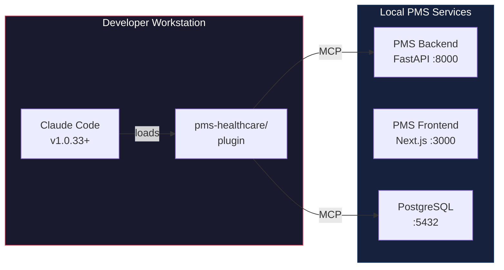

# Knowledge Work Plugins Setup Guide for PMS Integration

**Document ID:** PMS-EXP-KWPLUGINS-001
**Version:** 1.0
**Date:** 2026-02-24
**Applies To:** PMS project (all platforms)
**Prerequisites Level:** Intermediate

---

## Table of Contents

1. [Overview](#1-overview)
2. [Prerequisites](#2-prerequisites)
3. [Part A: Understand the Plugin Framework](#3-part-a-understand-the-plugin-framework)
4. [Part B: Create the PMS Healthcare Plugin](#4-part-b-create-the-pms-healthcare-plugin)
5. [Part C: Build Skills](#5-part-c-build-skills)
6. [Part D: Build Commands](#6-part-d-build-commands)
7. [Part E: Configure MCP Connections](#7-part-e-configure-mcp-connections)
8. [Part F: Add Hooks](#8-part-f-add-hooks)
9. [Part G: Testing and Verification](#9-part-g-testing-and-verification)
10. [Troubleshooting](#10-troubleshooting)
11. [Reference Commands](#11-reference-commands)
12. [Next Steps](#next-steps)
13. [Resources](#resources)

---

## 1. Overview

This guide walks you through setting up a custom PMS Healthcare Plugin using Anthropic's Knowledge Work Plugins framework. By the end, you will have:

- A working Claude Code plugin with PMS-specific skills, commands, and MCP connections
- Auto-activated clinical workflow and HIPAA compliance guidance
- Slash commands for common PMS development tasks
- MCP integration with your local PMS backend
- Hook-based HIPAA linting on code changes



## 2. Prerequisites

### 2.1 Required Software

| Software | Minimum Version | Check Command |
|---|---|---|
| Claude Code | 1.0.33 | `claude --version` |
| Node.js | 20.x | `node --version` |
| Python | 3.11+ | `python --version` |
| PostgreSQL | 16 | `psql --version` |
| Git | 2.40+ | `git --version` |
| jq | 1.6+ | `jq --version` |

### 2.2 Installation of Prerequisites

**Claude Code** (if not already installed):

```bash
# Install Claude Code
npm install -g @anthropic-ai/claude-code

# Authenticate
claude auth login
```

**jq** (needed for hooks):

```bash
# macOS
brew install jq

# Ubuntu/Debian
sudo apt-get install jq
```

### 2.3 Verify PMS Services

Confirm the PMS backend, frontend, and database are running:

```bash
# Check PMS Backend
curl -s http://localhost:8000/health | jq .
# Expected: {"status": "healthy"}

# Check PMS Frontend
curl -s http://localhost:3000 -o /dev/null -w "%{http_code}"
# Expected: 200

# Check PostgreSQL
psql -U pms -d pms_dev -c "SELECT 1;"
# Expected: 1
```

**Checkpoint**: All three services respond successfully. Claude Code version >= 1.0.33 is installed and authenticated.

---

## 3. Part A: Understand the Plugin Framework

Before building, understand the four components of a Claude Code plugin:

| Component | Location | Purpose | Activation |
|---|---|---|---|
| **Manifest** | `.claude-plugin/plugin.json` | Plugin identity and metadata | On install |
| **Skills** | `skills/{name}/SKILL.md` | Auto-activated domain knowledge | When Claude detects relevant context |
| **Commands** | `commands/{name}.md` | Explicit slash commands | When user types `/pms:{name}` |
| **Hooks** | `hooks/hooks.json` | Event-driven automation | On specified tool events |
| **MCP Config** | `.mcp.json` | External tool connections | When plugin is loaded |

The Knowledge Work Plugins repo uses **category placeholders** (`~~category`) in skills so workflows are tool-agnostic. For PMS, we'll use concrete MCP connections since we control the stack.

**Checkpoint**: You understand the four plugin components and how they activate.

---

## 4. Part B: Create the PMS Healthcare Plugin

### Step 1: Create the plugin directory structure

```bash
# From the demo repo root
mkdir -p pms-healthcare-plugin/.claude-plugin
mkdir -p pms-healthcare-plugin/skills
mkdir -p pms-healthcare-plugin/commands
mkdir -p pms-healthcare-plugin/hooks
```

### Step 2: Create the plugin manifest

Create `pms-healthcare-plugin/.claude-plugin/plugin.json`:

```json
{
  "name": "pms-healthcare",
  "version": "1.0.0",
  "description": "PMS-specific clinical workflow skills, HIPAA compliance enforcement, and healthcare development commands for the MPS Patient Management System",
  "author": {
    "name": "MPS Inc."
  }
}
```

### Step 3: Verify the directory structure

```bash
tree pms-healthcare-plugin/
```

Expected output:

```
pms-healthcare-plugin/
├── .claude-plugin/
│   └── plugin.json
├── commands/
├── hooks/
└── skills/
```

### Step 4: Test the empty plugin loads

```bash
claude --plugin-dir ./pms-healthcare-plugin
```

In the Claude Code session, run `/help` — you should see `pms-healthcare` listed as a loaded plugin (with no commands yet).

**Checkpoint**: The plugin directory is created, the manifest is valid, and Claude Code loads the plugin without errors.

---

## 5. Part C: Build Skills

Skills are auto-activated markdown files that provide domain context when Claude detects relevant topics. Each skill lives in `skills/{name}/SKILL.md`.

### Skill 1: HIPAA Compliance

Create `pms-healthcare-plugin/skills/hipaa-compliance/SKILL.md`:

```markdown
---
name: hipaa-compliance
description: HIPAA security and privacy patterns for PMS development. Activates when writing code that handles patient data, PHI fields, authentication, audit logging, or encryption.
---

# HIPAA Compliance Patterns for PMS

When writing code that touches patient data in the PMS, always apply these patterns:

## PHI Field Identification
The following PMS model fields contain PHI and require protection:
- `Patient.first_name`, `Patient.last_name`, `Patient.date_of_birth`
- `Patient.ssn`, `Patient.mrn` (Medical Record Number)
- `Patient.address`, `Patient.phone`, `Patient.email`
- `Encounter.notes`, `Encounter.diagnosis`, `Encounter.assessment`
- `Prescription.medication_name` (when linked to patient)

## Required Patterns

### Audit Logging
Every API endpoint that reads or writes PHI must create an AuditEvent:
```python
audit_service.log_access(
    user_id=current_user.id,
    resource_type="Patient",
    resource_id=patient.id,
    action="read|create|update|delete",
    ip_address=request.client.host
)
```

### Encryption at Rest
Patient data stored in PostgreSQL must use column-level encryption for sensitive fields:
- SSN: AES-256-GCM via `pgcrypto`
- Dermoscopic images: AES-256-GCM BYTEA (ADR-0010)
- Encryption keys: Versioned envelope management (ADR-0016)

### Access Control
All patient data endpoints require:
- OAuth 2.1 bearer token authentication
- Role-Based Access Control (RBAC) with minimum necessary access
- Session timeout after 15 minutes of inactivity

### Data Minimization
API responses must only include PHI fields that the requesting role needs. Use response schemas to filter:
```python
class PatientListResponse(BaseModel):
    id: UUID
    mrn: str
    # Do NOT include: ssn, full address, phone
```

### Logging Safety
Never log PHI to application logs. Use structured logging with PHI-safe serializers:
```python
logger.info("Patient accessed", extra={"patient_id": patient.id})
# NEVER: logger.info(f"Patient {patient.name} accessed")
```
```

### Skill 2: Clinical Workflow

Create `pms-healthcare-plugin/skills/clinical-workflow/SKILL.md`:

```markdown
---
name: clinical-workflow
description: PMS encounter lifecycle and clinical workflow patterns. Activates when working on encounter features, clinical documentation, care coordination, or SUB-CW requirements.
---

# Clinical Workflow Patterns for PMS

## Encounter Lifecycle
The PMS encounter follows this standard flow:

1. **Intake** — Patient check-in, demographics verification, insurance capture
2. **Assessment** — Vital signs, chief complaint, history of present illness
3. **Examination** — Physical exam findings, clinical observations
4. **Plan** — Diagnosis, treatment plan, prescriptions, referrals
5. **Documentation** — SOAP note generation, ICD/CPT coding
6. **Follow-Up** — Discharge instructions, follow-up scheduling, care coordination

## Subsystem Mapping
- **SUB-CW** (Clinical Workflow): Encounter lifecycle, care coordination, clinical documentation
- **SUB-PR** (Patient Records): Demographics, history, documents
- **SUB-MM** (Medication Management): Prescriptions, interactions, reconciliation

## API Endpoints
- `POST /api/encounters` — Create new encounter
- `GET /api/encounters/{id}` — Retrieve encounter with notes
- `PUT /api/encounters/{id}/status` — Transition encounter state
- `POST /api/encounters/{id}/notes` — Add clinical note (SOAP format)

## Speech-to-Text Integration
Clinical documentation can use the transcription pipeline (Experiments 07, 10, 21):
- MedASR: On-premise, batch processing
- Speechmatics: Real-time with diarization
- Voxtral: Open-weight, self-hosted streaming

## AI-Assisted Documentation
Structured note generation uses on-premise models (Experiments 13, 20):
- Gemma 3: Clinical summarization, multimodal analysis
- Qwen 3.5: Complex reasoning, differential diagnosis, drug interactions

## DermaCheck Integration (Experiment 18)
Dermatology encounters include the DermaCheck workflow (ADR-0022):
- Image capture → Classification → Risk scoring → Similar lesion search → Provider review
```

### Skill 3: Medication Safety

Create `pms-healthcare-plugin/skills/medication-safety/SKILL.md`:

```markdown
---
name: medication-safety
description: Medication management patterns including drug interaction checking, reconciliation, and prescription safety. Activates when working on SUB-MM features, prescription APIs, or Sanford Guide integration.
---

# Medication Safety Patterns for PMS

## SUB-MM Architecture
Medication Management (SUB-MM) covers:
- Prescription creation and modification
- Drug-drug interaction detection
- Medication reconciliation across care settings
- Formulary checking and therapeutic substitution
- Sanford Guide antimicrobial CDS (Experiment 11)

## API Endpoints
- `POST /api/prescriptions` — Create prescription
- `GET /api/prescriptions?patient_id={id}` — List patient medications
- `POST /api/prescriptions/check-interactions` — Drug interaction check
- `POST /api/prescriptions/reconcile` — Cross-setting reconciliation

## Interaction Checking Pattern
Always check drug interactions before finalizing a prescription:
```python
interactions = await medication_service.check_interactions(
    new_medication=prescription.medication,
    existing_medications=patient.active_medications,
    patient_conditions=patient.conditions  # Comorbidity-aware
)
if interactions.has_critical:
    raise ClinicalSafetyException(interactions.critical_details)
```

## Sanford Guide Integration (Experiment 11)
For antimicrobial prescriptions, invoke Sanford Guide CDS:
- Syndrome → Recommended regimens → Dose adjustments → Interaction checking
- Results cached in Redis with patient-context key
- PHI sanitized before external API calls

## FHIR Medication Resources (Experiment 16)
- `MedicationRequest` — Prescription orders
- `MedicationStatement` — Patient-reported medications
- `MedicationAdministration` — Administration records
```

### Skill 4: Testing Conventions

Create `pms-healthcare-plugin/skills/testing-conventions/SKILL.md`:

```markdown
---
name: testing-conventions
description: PMS testing strategy, naming conventions, and traceability requirements. Activates when writing tests, discussing test strategy, or working on quality assurance.
---

# PMS Testing Conventions

## Test Case Naming
All test cases follow platform-scoped naming:
`TC-{PLATFORM}-{DOMAIN}-{NNN}`

Platforms: BE (Backend), WEB (Web), AND (Android), AI (AI Infrastructure)
Domains: PR (Patient Records), CW (Clinical Workflow), MM (Medication), RA (Reporting), PM (Prompt Mgmt)

Examples:
- `TC-BE-PR-001` — Backend Patient Records test #1
- `TC-WEB-CW-003` — Web Clinical Workflow test #3
- `TC-AND-PR-002` — Android Patient Records test #2

## Run Record Format
Test runs are recorded in `docs/testing/evidence/RUN-{YYYYMMDD}-{SEQ}.md`:
```markdown
# Test Run Record RUN-{date}-{seq}
- **Date:** YYYY-MM-DD
- **Executor:** {name}
- **Environment:** {dev|qa|staging|prod}
- **Scope:** {subsystem or requirement IDs}
- **Results:** {PASS/FAIL counts}
```

## Traceability Requirements
Every requirement in SYS-REQ, SUB-*, must have:
1. At least one test case mapped in `docs/testing/traceability-matrix.md`
2. Test evidence from the latest run
3. Forward traceability (requirement → test) and backward (test → requirement)

## Test Levels
1. **Unit tests** — Individual functions/methods, mocked dependencies
2. **Integration tests** — API endpoint testing with database
3. **E2E tests** — Full workflow testing across frontend + backend
4. **AI/CDS tests** — Model inference accuracy, threshold validation
```

**Checkpoint**: Four skills are created in the `skills/` directory. Each has a `SKILL.md` with frontmatter (`name`, `description`) and detailed domain instructions.

---

## 6. Part D: Build Commands

Commands are markdown files in `commands/` that define explicit slash commands.

### Command 1: HIPAA Check

Create `pms-healthcare-plugin/commands/hipaa-check.md`:

```markdown
---
description: Audit current code changes for HIPAA compliance gaps
---

# HIPAA Compliance Check

Review the current code changes (staged and unstaged) for HIPAA compliance issues.

## Steps

1. Run `git diff` and `git diff --staged` to see all current changes
2. For each changed file, check for:
   - **PHI Exposure**: Patient data logged, returned without filtering, or stored unencrypted
   - **Missing Audit Logs**: CRUD operations on patient data without AuditEvent creation
   - **Access Control Gaps**: Endpoints missing authentication or RBAC decorators
   - **Logging Violations**: PHI fields (name, SSN, DOB, MRN) appearing in log statements
   - **Encryption Gaps**: Sensitive fields stored as plaintext in database models
   - **Session Security**: Missing timeout configuration or insecure token handling

3. For each finding, report:
   - **File and line number**
   - **Severity**: Critical / High / Medium / Low
   - **Issue description**
   - **Recommended fix** with code example

4. Summarize with a HIPAA compliance score (pass/fail) and action items.

$ARGUMENTS
```

### Command 2: ADR

Create `pms-healthcare-plugin/commands/adr.md`:

```markdown
---
description: Create an Architecture Decision Record following PMS conventions
---

# Create Architecture Decision Record

Generate an ADR for the PMS project following established conventions.

## Steps

1. Scan `docs/architecture/` for existing ADR files to determine the next number (format: `NNNN-short-title.md`)
2. Create the ADR with this structure:
   - **Title**: ADR-{NNNN}: {Decision Title}
   - **Status**: Proposed
   - **Date**: Today's date
   - **Context**: What problem or decision prompted this ADR
   - **Options Considered**: At least 2-3 alternatives with pros/cons
   - **Decision**: The chosen option with rationale
   - **Consequences**: Trade-offs, follow-up work, and risks
3. Save to `docs/architecture/{NNNN}-{short-title}.md`
4. Update `docs/index.md` with a link to the new ADR

Context for this ADR: $ARGUMENTS
```

### Command 3: Encounter Workflow

Create `pms-healthcare-plugin/commands/encounter-workflow.md`:

```markdown
---
description: Design an end-to-end encounter workflow for a clinical scenario
---

# Encounter Workflow Designer

Design a complete clinical encounter workflow for the given scenario.

## Steps

1. Analyze the clinical scenario described below
2. Map to the PMS encounter lifecycle: Intake → Assessment → Examination → Plan → Documentation → Follow-Up
3. For each phase, specify:
   - **API endpoints** involved (from `/api/encounters`, `/api/patients`, `/api/prescriptions`)
   - **Data model changes** needed (new fields, relationships)
   - **AI integrations** applicable (speech-to-text, CDS, summarization)
   - **Frontend components** needed (forms, displays, workflows)
4. Generate a Mermaid sequence diagram showing the full workflow
5. Identify which PMS subsystems are involved (SUB-PR, SUB-CW, SUB-MM, SUB-RA)
6. List test cases needed following PMS naming conventions (TC-{PLATFORM}-{DOMAIN}-{NNN})
7. Flag any HIPAA considerations specific to this workflow

Clinical scenario: $ARGUMENTS
```

### Command 4: FHIR Map

Create `pms-healthcare-plugin/commands/fhir-map.md`:

```markdown
---
description: Map a PMS data model to FHIR R4 resources
---

# FHIR R4 Resource Mapper

Map the specified PMS data model to FHIR R4 resources.

## Steps

1. Read the PMS model definition (from `pms-backend/app/models/` or the description below)
2. Identify the corresponding FHIR R4 resource(s):
   - Patient → FHIR Patient
   - Encounter → FHIR Encounter
   - Prescription → FHIR MedicationRequest
   - Lab Result → FHIR Observation + DiagnosticReport
   - Clinical Note → FHIR DocumentReference
3. For each mapping:
   - List field-by-field correspondence (PMS field → FHIR element)
   - Identify required FHIR extensions for PMS-specific fields
   - Generate Python mapper code following PMS FHIR Facade patterns (Experiment 16)
   - Include FHIR validation logic
4. Generate example FHIR JSON output
5. List test cases for the mapper

PMS model to map: $ARGUMENTS
```

**Checkpoint**: Four commands are created in the `commands/` directory. Each has frontmatter with a `description` and uses `$ARGUMENTS` for user input.

---

## 7. Part E: Configure MCP Connections

### Step 1: Create the MCP configuration

Create `pms-healthcare-plugin/.mcp.json`:

```json
{
  "mcpServers": {
    "pms-backend": {
      "type": "http",
      "url": "http://localhost:8000/mcp"
    }
  }
}
```

This connects the plugin to the PMS MCP Server (Experiment 09), giving Claude access to all PMS API tools, patient data resources, and clinical prompts.

### Step 2: Verify MCP connection

Start Claude Code with the plugin:

```bash
claude --plugin-dir ./pms-healthcare-plugin
```

In the session, ask Claude to list available MCP tools. You should see PMS-specific tools like `get_patient`, `list_encounters`, `create_prescription`, etc.

> **Note**: If the PMS MCP server is not yet implemented (Experiment 09 is at design stage), the `.mcp.json` can be added later. The plugin's skills and commands work independently of MCP connections.

**Checkpoint**: The `.mcp.json` file is created. When the PMS MCP server is available, Claude can access PMS APIs through the plugin's MCP connection.

---

## 8. Part F: Add Hooks

### Step 1: Create the hooks configuration

Create `pms-healthcare-plugin/hooks/hooks.json`:

```json
{
  "hooks": {
    "PostToolUse": [
      {
        "matcher": "Write|Edit",
        "hooks": [
          {
            "type": "command",
            "command": "jq -r '.tool_input.file_path // empty' | xargs -I{} sh -c 'grep -n -E \"(patient\\.name|patient\\.ssn|patient\\.dob|logger\\..*patient)\" \"{}\" 2>/dev/null && echo \"WARNING: Potential PHI in logs or unprotected access detected in {}\" || true'"
          }
        ]
      }
    ]
  }
}
```

This hook runs after every `Write` or `Edit` tool use and scans the modified file for common PHI exposure patterns.

### Step 2: Test the hook

Start Claude with the plugin and ask it to write a file that includes a log statement with patient name. The hook should trigger and warn about potential PHI exposure.

**Checkpoint**: Hooks configuration is created. The HIPAA lint hook fires on Write/Edit tool use and warns about PHI patterns.

---

## 9. Part G: Testing and Verification

### Test 1: Plugin loads correctly

```bash
claude --plugin-dir ./pms-healthcare-plugin
```

Run `/help` and verify:
- Plugin `pms-healthcare` appears in the loaded plugins list
- Commands appear: `/pms-healthcare:hipaa-check`, `/pms-healthcare:adr`, `/pms-healthcare:encounter-workflow`, `/pms-healthcare:fhir-map`

### Test 2: Skills auto-activate

In a Claude Code session with the plugin loaded, type:

```
I need to add a new endpoint that returns patient demographics including SSN
```

Claude should reference the `hipaa-compliance` skill and warn about SSN handling, encryption requirements, and audit logging needs.

### Test 3: Commands execute

```
/pms-healthcare:hipaa-check
```

Claude should analyze current git changes for HIPAA compliance issues.

```
/pms-healthcare:adr Choose between REST and GraphQL for the reporting API
```

Claude should create a new ADR file in `docs/architecture/`.

### Test 4: Hooks fire

Ask Claude to write a Python file that logs patient data:

```
Write a function that logs patient name when accessed
```

After the Write tool executes, the hook should output a warning about PHI in logs.

### Test 5: Full verification checklist

| Test | Expected Result | Status |
|---|---|---|
| Plugin loads without errors | No error messages on startup | |
| `/help` shows plugin commands | 4 commands listed under `pms-healthcare` | |
| Skills fire on relevant topics | HIPAA skill activates for patient data code | |
| Commands accept arguments | `/pms-healthcare:adr {topic}` works | |
| Hooks trigger on Write/Edit | PHI warning appears after writing patient code | |
| MCP connection available | PMS tools listed (when MCP server is running) | |

**Checkpoint**: All five tests pass. The plugin is fully functional.

---

## 10. Troubleshooting

### Plugin not loading

**Symptom**: Claude Code starts but plugin is not listed in `/help`.

**Fix**: Verify the directory structure. The `.claude-plugin/plugin.json` must be at `{plugin-dir}/.claude-plugin/plugin.json`, not nested deeper. Check:

```bash
cat pms-healthcare-plugin/.claude-plugin/plugin.json | jq .
```

### Commands not appearing

**Symptom**: Plugin loads but `/pms-healthcare:*` commands don't show up.

**Fix**: Command files must be in `commands/` at the plugin root (not inside `.claude-plugin/`). Ensure each `.md` file has valid frontmatter with a `description` field.

### Skills not activating

**Symptom**: Claude doesn't reference HIPAA patterns when writing patient code.

**Fix**: Check that `SKILL.md` files have proper frontmatter with `name` and `description` fields. The `description` must clearly indicate when the skill should activate. Restart Claude Code after changes.

### MCP connection refused

**Symptom**: `Connection refused` errors for PMS MCP tools.

**Fix**: Ensure PMS backend is running on the configured port:

```bash
curl http://localhost:8000/health
```

If the MCP server endpoint is not yet implemented, remove or comment out the `.mcp.json` entry — skills and commands work without it.

### Hooks not firing

**Symptom**: No PHI warning after writing patient code.

**Fix**: Verify `jq` is installed (`jq --version`). Check that hooks are in `hooks/hooks.json` (not inside `.claude-plugin/`). The matcher pattern `Write|Edit` is case-sensitive.

### Port conflicts

**Symptom**: PMS services not reachable on expected ports.

**Fix**: Check which ports are in use:

```bash
lsof -i :8000  # Backend
lsof -i :3000  # Frontend
lsof -i :5432  # PostgreSQL
```

Update `.mcp.json` URLs if using non-default ports.

---

## 11. Reference Commands

### Daily Development Workflow

```bash
# Start Claude Code with PMS plugin
claude --plugin-dir ./pms-healthcare-plugin

# Run HIPAA check before committing
/pms-healthcare:hipaa-check

# Create ADR for a new decision
/pms-healthcare:adr "Choose caching strategy for medication lookups"

# Design a clinical workflow
/pms-healthcare:encounter-workflow "Dermatology follow-up with lesion comparison"

# Map a model to FHIR
/pms-healthcare:fhir-map "LabResult model with reference ranges"
```

### Plugin Management Commands

```bash
# Install plugin from marketplace (when published)
claude plugin install pms-healthcare

# Load plugin from local directory (development)
claude --plugin-dir ./pms-healthcare-plugin

# Load multiple plugins
claude --plugin-dir ./pms-healthcare-plugin --plugin-dir ./other-plugin

# Check loaded plugins
/help
```

### Useful URLs

| Resource | URL |
|---|---|
| PMS Backend Health | http://localhost:8000/health |
| PMS Frontend | http://localhost:3000 |
| PMS API Docs | http://localhost:8000/docs |
| Claude Code Plugin Docs | https://code.claude.com/docs/en/plugins |
| Knowledge Work Plugins Repo | https://github.com/anthropics/knowledge-work-plugins |

---

## Next Steps

After completing this setup:

1. **Complete the Developer Tutorial** — [Knowledge Work Plugins Developer Tutorial](24-KnowledgeWorkPlugins-Developer-Tutorial.md) for hands-on exercises building custom skills and commands.
2. **Add more skills** — Create `fhir-interop` and `architecture-conventions` skills following the patterns above.
3. **Publish as marketplace** — Package the plugin directory as a GitHub repo for team distribution via `claude plugin marketplace add`.
4. **Integrate with CI** — Add plugin validation to the GitHub Actions pipeline.
5. **Iterate on prompts** — Refine skill and command prompts based on real usage feedback.

---

## Resources

### Official Documentation
- [Claude Code Plugins Guide](https://code.claude.com/docs/en/plugins) — Creating and managing plugins
- [Claude Code Plugin Reference](https://code.claude.com/docs/en/plugins-reference) — Full technical specification
- [Claude Code Skills](https://code.claude.com/docs/en/skills) — Skill authoring guide
- [Claude Code MCP](https://code.claude.com/docs/en/mcp) — MCP server configuration

### GitHub Repositories
- [Knowledge Work Plugins](https://github.com/anthropics/knowledge-work-plugins) — Official plugin marketplace
- [Claude Plugins Official](https://github.com/anthropics/claude-plugins-official) — Anthropic-curated plugins

### PMS-Specific References
- [MCP PMS Integration (Experiment 09)](09-PRD-MCP-PMS-Integration.md) — PMS MCP server design
- [Superpowers PMS Integration (Experiment 19)](19-PRD-Superpowers-PMS-Integration.md) — Development workflow enforcement
- [PMS Testing Strategy](../testing/testing-strategy.md) — Test naming conventions and strategy
