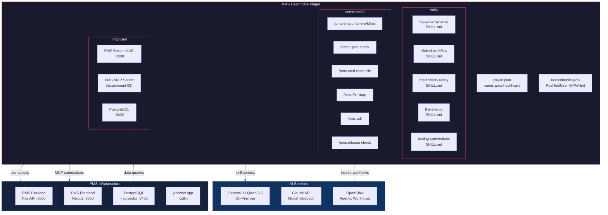

# Product Requirements Document: Knowledge Work Plugins Integration into Patient Management System (PMS)

**Document ID:** PRD-PMS-KWPLUGINS-001
**Version:** 1.0
**Date:** 2026-02-24
**Author:** Ammar (CEO, MPS Inc.)
**Status:** Draft

---

## 1. Executive Summary

Anthropic's Knowledge Work Plugins is an open-source framework (Apache 2.0) that packages domain-specific skills, slash commands, MCP server connections, and sub-agents into installable plugin bundles for Claude Code and Claude Cowork. With 7,800+ stars and 800+ forks, the repository provides 11 official plugins spanning sales, finance, data, legal, bio-research, engineering, operations, and more — each delivering role-specific AI assistance through file-based configuration (markdown + JSON) with zero code compilation or infrastructure.

Integrating this plugin framework into the PMS development workflow enables the team to build a **custom healthcare plugin** that encodes PMS-specific clinical workflows, HIPAA compliance patterns, subsystem conventions, and tool integrations into a reusable, shareable package. Instead of each developer manually configuring Claude with PMS context, a single plugin bundles all domain expertise — clinical documentation skills, medication management commands, audit logging hooks, and MCP connections to PMS APIs — so that every team member gets a consistent, healthcare-specialized AI assistant from the moment they install it.

The plugin would complement and orchestrate existing PMS experiments (MCP server, OpenClaw, Speechmatics, DermaCheck, etc.) by providing a unified interaction layer where developers invoke `/pms:encounter-workflow` or `/pms:hipaa-check` rather than manually composing multi-tool workflows.

## 2. Problem Statement

PMS development involves coordinating across 5 subsystems (Patient Records, Clinical Workflow, Medication Management, Reporting & Analytics, Prompt Management), 4 platforms (Backend, Web, Android, AI), 22+ experimental integrations, and strict HIPAA compliance requirements. Current challenges:

1. **Context fragmentation**: Developers must read 50+ docs files, understand 13 system requirements, and navigate 100 platform requirements before making changes. Claude sessions start cold without PMS domain knowledge.
2. **Inconsistent AI assistance**: Each developer configures Claude differently — some use MCP, some don't; some reference HIPAA patterns, others miss them. There is no standardized way to encode "how we build PMS features" into the AI assistant.
3. **Workflow repetition**: Common tasks (encounter workflow design, medication interaction checking, FHIR resource mapping, clinical note structuring) follow established patterns documented in experiments but require manual prompting each time.
4. **Compliance drift**: HIPAA audit logging, PHI sanitization, and encryption patterns must be applied consistently, but relying on individual developer memory leads to gaps.
5. **Onboarding friction**: New developers must absorb significant domain context before contributing effectively. A plugin that auto-activates healthcare-specific skills would accelerate ramp-up.

## 3. Proposed Solution

### 3.1 Architecture Overview

### 3.2 Deployment Model

- **File-based distribution**: The plugin is a directory of markdown and JSON files committed to the `pms-healthcare-plugin/` directory within the demo repo (or a separate repo). No compilation, no Docker, no runtime infrastructure.
- **Installation**: `claude plugin install pms-healthcare` or `claude --plugin-dir ./pms-healthcare-plugin` for local development.
- **Security envelope**: The plugin itself contains no PHI. It encodes *patterns* and *skills* that guide Claude's behavior when working with PMS code. MCP connections to PMS APIs inherit the existing HIPAA-compliant authentication and audit logging from the PMS backend (Experiment 09).
- **HIPAA considerations**: Plugin skill files reference PHI handling patterns but never contain PHI. The `.mcp.json` connects to locally-running PMS services only — no external data egress. Hook-based HIPAA linting runs post-tool-use to catch compliance gaps before code is committed.

## 4. PMS Data Sources

The plugin's MCP configuration connects Claude to PMS APIs for context-aware assistance:

| API Endpoint | Plugin Usage | Category Placeholder |
|---|---|---|
| `/api/patients` | Patient record context for clinical workflow skills | `~~patient-records` |
| `/api/encounters` | Encounter data for documentation and workflow commands | `~~encounters` |
| `/api/prescriptions` | Medication data for reconciliation and safety checking | `~~medications` |
| `/api/reports` | Analytics data for reporting skills | `~~analytics` |
| PMS MCP Server (Exp. 09) | Full tool/resource/prompt access via standardized MCP | `~~pms-mcp` |

## 5. Component/Module Definitions

### 5.1 Skills (Auto-Activated Domain Knowledge)

| Skill | Description | Auto-Activates When | PMS APIs Used |
|---|---|---|---|
| **hipaa-compliance** | HIPAA security patterns: PHI handling, audit logging, encryption requirements, access control. Fires when Claude writes code touching patient data. | Code references patient models, PHI fields, or auth endpoints | N/A (pattern guidance) |
| **clinical-workflow** | Encounter lifecycle patterns: intake → assessment → plan → documentation → follow-up. Guides feature development for SUB-CW. | Working on encounter or clinical features | `/api/encounters` |
| **medication-safety** | Drug interaction checking, reconciliation patterns, Sanford Guide integration conventions. | Working on medication or prescription features | `/api/prescriptions` |
| **fhir-interop** | FHIR R4 resource mapping conventions, HL7v2 message parsing patterns, interoperability architecture. | Working on data exchange or integration features | PMS MCP Server |
| **testing-conventions** | PMS testing strategy: platform-scoped naming (TC-{PLATFORM}-{DOMAIN}-NNN), run record format, traceability matrix updates. | Writing or discussing tests | N/A (pattern guidance) |
| **architecture-conventions** | ADR format, three-tier requirements decomposition (SYS→Domain→Platform), subsystem codes, documentation workflow. | Making architectural decisions or writing specs | N/A (pattern guidance) |

### 5.2 Commands (Explicit Slash Commands)

| Command | Description | Input | Output |
|---|---|---|---|
| `/pms:encounter-workflow` | Design an end-to-end encounter workflow for a given clinical scenario | Clinical scenario description | Workflow diagram, API endpoints, data model changes, test plan |
| `/pms:hipaa-check` | Audit current code changes for HIPAA compliance gaps | Git diff or file path | Compliance report with findings and remediation steps |
| `/pms:med-reconcile` | Design a medication reconciliation flow between two medication lists | Two med list sources | Reconciliation algorithm, conflict detection rules, UI mockup |
| `/pms:fhir-map` | Map a PMS data model to FHIR R4 resources | PMS model name | FHIR resource mapping, transformation code, validation tests |
| `/pms:adr` | Create an Architecture Decision Record following PMS conventions | Decision context | ADR markdown file in `docs/architecture/` format |
| `/pms:release-check` | Pre-release verification against PMS quality gates | Version number | Checklist: tests, traceability, docs, feature flags, compatibility |

### 5.3 Hooks (Automated Behavior)

| Hook | Trigger | Action |
|---|---|---|
| **HIPAA Lint** | `PostToolUse` on `Write` or `Edit` | Scan written code for common HIPAA violations (hardcoded PHI, missing audit logs, unencrypted fields) |
| **Doc Sync Reminder** | `PostToolUse` on `Write` for `docs/` files | Remind developer to update `docs/index.md` if a new doc file was created |
| **Test Naming Check** | `PostToolUse` on `Write` for test files | Validate test naming follows PMS convention `TC-{PLATFORM}-{DOMAIN}-NNN` |

### 5.4 MCP Servers

The `.mcp.json` configuration connects to:

| Server | Type | URL | Purpose |
|---|---|---|---|
| `pms-backend` | http | `http://localhost:8000/mcp` | PMS Backend API access via MCP |
| `pms-db` | stdio | `npx @anthropic/postgres-mcp` | Direct database querying for schema exploration |

## 6. Non-Functional Requirements

### 6.1 Security and HIPAA Compliance

- **No PHI in plugin files**: Skills and commands contain patterns and instructions, never actual patient data.
- **Local-only MCP connections**: `.mcp.json` connects to `localhost` services only. No external API calls that could leak PHI.
- **Audit trail**: All MCP tool invocations through the plugin are logged by the PMS MCP server's existing AuditEvent system (Experiment 09).
- **Hook-based enforcement**: The HIPAA lint hook provides an automated safety net that catches common compliance gaps in real-time during development.
- **Access control**: MCP connections inherit the PMS backend's OAuth 2.1 + RBAC authentication. Plugin users must have valid developer credentials.

### 6.2 Performance

| Metric | Target |
|---|---|
| Plugin load time | < 2 seconds |
| Skill activation latency | < 100ms (file-based, no network) |
| Command execution (excluding AI inference) | < 5 seconds |
| MCP tool response time | Inherits PMS backend SLA (< 500ms p95) |

### 6.3 Infrastructure

- **No additional infrastructure**: The plugin is file-based — markdown + JSON only.
- **Development dependencies**: Claude Code v1.0.33+, PMS backend running locally, PostgreSQL running locally.
- **Storage**: < 1MB total plugin size (text files only).

## 7. Implementation Phases

### Phase 1: Foundation (Sprint 1-2)

- Create plugin directory structure with `plugin.json` manifest
- Implement 3 core skills: `hipaa-compliance`, `clinical-workflow`, `testing-conventions`
- Implement 2 commands: `/pms:hipaa-check`, `/pms:adr`
- Configure `.mcp.json` for PMS backend connection
- Local testing with `--plugin-dir` flag

### Phase 2: Clinical Integration (Sprint 3-4)

- Add remaining skills: `medication-safety`, `fhir-interop`, `architecture-conventions`
- Add remaining commands: `/pms:encounter-workflow`, `/pms:med-reconcile`, `/pms:fhir-map`, `/pms:release-check`
- Implement hooks: HIPAA lint, doc sync reminder, test naming check
- Integration testing with PMS backend and MCP server

### Phase 3: Distribution & Refinement (Sprint 5-6)

- Create plugin marketplace repository for team distribution
- Add `settings.json` for team-wide defaults (subsystem codes, ADR numbering, etc.)
- Write onboarding documentation and record usage metrics
- Iterate on skill prompts based on developer feedback
- Explore sub-agents for complex multi-step workflows (e.g., full encounter design agent)

## 8. Success Metrics

| Metric | Target | Measurement Method |
|---|---|---|
| Developer onboarding time | 50% reduction (from ~2 days to ~1 day) | Time-to-first-PR for new developers |
| HIPAA compliance issues caught pre-commit | 90% of common patterns | Hook-caught violations vs. code review findings |
| Consistent ADR/doc format | 100% adherence | Automated format validation |
| Skill activation accuracy | >85% relevant activation rate | Developer satisfaction surveys |
| Plugin adoption | 100% of PMS developers | Installation tracking |
| Command usage frequency | >10 invocations/developer/week | Usage telemetry |

## 9. Risks and Mitigations

| Risk | Impact | Mitigation |
|---|---|---|
| Skill prompts become outdated as PMS evolves | Medium — incorrect guidance | Tie skill updates to the documentation workflow; update skills when docs change |
| Plugin overhead slows Claude responses | Low — file-based, minimal overhead | Skills are small markdown files (<5KB each); benchmark load times |
| MCP connection exposes PHI in development | High — HIPAA violation | MCP connects to local services only; use synthetic test data in development; audit logging |
| Plugin format changes in future Claude Code versions | Medium — maintenance burden | Pin to stable plugin API; follow Anthropic's plugin changelog |
| Developers bypass hooks or disable plugin | Medium — compliance gaps | Make plugin installation a team policy; CI check for plugin presence |
| Skill activation fires incorrectly | Low — irrelevant context | Use specific `description` fields in SKILL.md frontmatter; test with diverse scenarios |

## 10. Dependencies

| Dependency | Version | Purpose |
|---|---|---|
| Claude Code | >= 1.0.33 | Plugin runtime |
| Knowledge Work Plugins repo | Reference architecture | Plugin structure patterns |
| PMS MCP Server (Experiment 09) | 1.0 | MCP tool/resource access |
| PMS Backend | Running locally | API access for MCP connections |
| PostgreSQL | >= 16 | Database access for schema exploration |
| Node.js | >= 20 | MCP server runtime |

## 11. Comparison with Existing Experiments

| Aspect | Knowledge Work Plugins (This) | MCP Server (Exp. 09) | OpenClaw (Exp. 05) | Superpowers (Exp. 19) |
|---|---|---|---|---|
| **Primary function** | Bundles skills, commands, MCP, hooks into installable plugin | Exposes PMS APIs as MCP tools | Autonomous agentic workflows | Development workflow enforcement |
| **User interaction** | Slash commands + auto-activated skills | Tool calls from any MCP client | Autonomous task execution | Skill-based development guidance |
| **Scope** | Developer experience & consistency | API interoperability | Business process automation | Code quality enforcement |
| **Relationship** | **Consumes** MCP Server as a connector | **Consumed by** this plugin | **Invoked by** plugin commands | **Overlaps** — plugin replaces some Superpowers skills with PMS-specific versions |

This plugin acts as the **integration layer** that ties MCP (data access), OpenClaw (automation), and development conventions (Superpowers-like enforcement) into a single installable package.

## 12. Research Sources

### Official Documentation
- [Knowledge Work Plugins Repository](https://github.com/anthropics/knowledge-work-plugins) — Source code, plugin structure, and README
- [Claude Code Plugin Documentation](https://code.claude.com/docs/en/plugins) — Plugin creation guide, schema, and lifecycle
- [Claude Plugins Directory](https://claude.com/plugins) — Marketplace listing and installation counts

### Architecture & Specification
- [Knowledge Work Plugins DeepWiki](https://deepwiki.com/anthropics/knowledge-work-plugins) — Detailed architectural analysis of plugin framework
- [Claude Code Plugins Blog Post](https://claude.com/blog/claude-code-plugins) — Plugin system announcement and design philosophy
- [Bio-Research Plugin](https://github.com/anthropics/knowledge-work-plugins/tree/main/bio-research) — Most complex plugin example with 10 MCP servers

### Security & Compliance
- [Claude for Healthcare](https://claude.com/solutions/healthcare) — Anthropic's HIPAA-compliant healthcare AI strategy
- [Anthropic Healthcare Announcement](https://www.anthropic.com/news/healthcare-life-sciences) — Claude for Healthcare launch details

### Ecosystem & Adoption
- [Composio Plugin Guide](https://composio.dev/blog/claude-code-plugin) — Third-party guide to building plugins
- [John Snow Labs Healthcare MCP](https://www.johnsnowlabs.com/bring-clinical-de-identification-into-agent-clients-ides-mcp-servers-for-healthcare-nlp/) — Healthcare-specific MCP server example

## 13. Appendix: Related Documents

- [Knowledge Work Plugins Setup Guide](24-KnowledgeWorkPlugins-PMS-Developer-Setup-Guide.md)
- [Knowledge Work Plugins Developer Tutorial](24-KnowledgeWorkPlugins-Developer-Tutorial.md)
- [MCP PMS Integration PRD](09-PRD-MCP-PMS-Integration.md)
- [OpenClaw PMS Integration PRD](05-PRD-OpenClaw-PMS-Integration.md)
- [Superpowers PMS Integration PRD](19-PRD-Superpowers-PMS-Integration.md)
- [Official Plugin Documentation](https://code.claude.com/docs/en/plugins)
