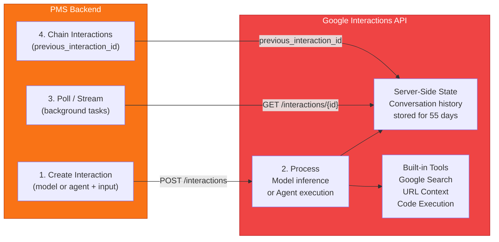
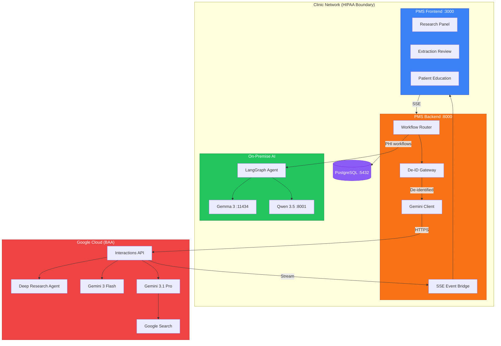

# Gemini Interactions API Developer Onboarding Tutorial

**Welcome to the MPS PMS Gemini Interactions API Integration Team**

This tutorial will take you from zero to building your first Gemini Interactions API integration with the PMS. By the end, you will understand how the Interactions API works, have a running local environment, and have built and tested a clinical research and structured extraction integration end-to-end.

**Document ID:** PMS-EXP-GEMINI-INTERACTIONS-002
**Version:** 1.0
**Date:** March 3, 2026
**Applies To:** PMS project (all platforms)
**Prerequisite:** [Gemini Interactions Setup Guide](29-GeminiInteractions-PMS-Developer-Setup-Guide.md)
**Estimated time:** 2-3 hours
**Difficulty:** Beginner-friendly

---

## What You Will Learn

1. What the Gemini Interactions API is and why the PMS uses it
2. How server-side state management works with `previous_interaction_id`
3. How the Deep Research Agent executes autonomous multi-step research
4. How to build a clinical evidence research workflow end-to-end
5. How to use structured output enforcement for clinical data extraction
6. How PHI de-identification protects patient data before API calls
7. How streaming events power real-time frontend updates
8. How the Interactions API complements LangGraph and on-premise models
9. How to debug common issues with background tasks and polling
10. HIPAA compliance requirements for cloud-hosted AI in healthcare

---

## Part 1: Understanding the Gemini Interactions API (15 min read)

### 1.1 What Problem Does the Interactions API Solve?

Clinical staff at a PMS-powered clinic frequently need answers to complex medical questions:

> *"What are the current treatment guidelines for newly diagnosed heart failure with preserved ejection fraction in patients over 75 with concurrent CKD stage 3?"*

Today, answering this requires manually searching PubMed, UpToDate, and specialty guidelines — often taking 30+ minutes per query. The on-premise AI models (Gemma 3, Qwen 3.5) can reason but lack access to current medical literature and real-time web sources.

The Gemini Interactions API solves this by providing:
- **Deep Research Agent**: An autonomous AI researcher that plans search strategies, queries multiple sources, reads results, iterates, and produces cited reports — all in 2-5 minutes.
- **Google Search grounding**: Real-time access to current drug information, FDA alerts, and treatment guidelines.
- **Server-side state management**: Multi-turn conversations without sending full history each time.
- **Structured extraction**: Guaranteed JSON output conforming to clinical schemas (ICD-10 codes, medication lists, FHIR resources).

### 1.2 How the Interactions API Works — The Key Pieces



**Three core concepts:**

1. **Interactions** — Each API call creates an interaction with a unique ID. An interaction has `input` (your prompt), `outputs` (the response), `status`, and `usage` metadata. Think of it as a single conversational turn.

2. **State chaining** — Pass `previous_interaction_id` to continue a conversation. Google stores the history server-side — you don't need to resend prior messages. This saves tokens and prevents context overflow.

3. **Background mode** — For long-running tasks (like Deep Research), set `background=True`. The API returns immediately with an interaction ID. You poll or stream to get the result when ready.

### 1.3 How the Interactions API Fits with Other PMS Technologies

| Technology | Experiment | Role | PHI Handling | Hosting |
|------------|-----------|------|-------------|---------|
| **Gemini Interactions API** | 29 (this) | Cloud research, structured extraction, patient education | De-identified only | Google Cloud (managed) |
| **LangGraph** | 26 | Stateful multi-step clinical workflows (prior auth, care coord) | Full PHI access | Self-hosted (Docker) |
| **Gemma 3** | 13 | On-premise summarization, medication intelligence | Full PHI, zero egress | Self-hosted (Ollama) |
| **Qwen 3.5** | 20 | Complex reasoning, drug interaction analysis | Full PHI, zero egress | Self-hosted (vLLM) |
| **MCP** | 09 | Tool protocol — PMS APIs as discoverable tools | N/A (protocol layer) | Self-hosted |
| **Speechmatics** | 10 | Real-time clinical speech-to-text | Audio processing | Cloud with BAA |

**Key insight:** The Interactions API handles workflows that benefit from real-time web access and managed infrastructure. Anything touching raw PHI stays on-premise with LangGraph, Gemma, or Qwen.

### 1.4 Key Vocabulary

| Term | Meaning |
|------|---------|
| **Interaction** | A single request-response pair with the API. Has a unique ID, status, inputs, and outputs. |
| **previous_interaction_id** | Reference to a prior interaction for multi-turn conversations. Google manages the history server-side. |
| **Background mode** | Async execution for long-running tasks. Returns immediately; poll for results. Required for agents. |
| **Deep Research Agent** | Google's autonomous research agent. Plans searches, reads sources, iterates, and produces cited reports. |
| **Grounding** | Connecting model outputs to real sources (Google Search, URLs). Cited responses reduce hallucination. |
| **Thinking level** | Controls reasoning depth: minimal (fast) → high (thorough). Affects latency and token usage. |
| **store** | Whether Google persists the interaction (default: true). Set to false for clinical data to prevent PHI retention. |
| **content.delta** | Streaming event containing incremental text output. Used for real-time UI updates. |
| **response_format** | JSON Schema that forces the model to output structured data matching your schema. |
| **De-identification** | Stripping PHI (names, DOBs, SSNs) before sending to external APIs. PMS re-identifies on response. |
| **BAA** | Business Associate Agreement with Google. Required for HIPAA compliance in production. |
| **Vertex AI** | Google Cloud's enterprise AI platform. Provides BAA-covered Gemini API access for healthcare. |

### 1.5 Our Architecture



---

## Part 2: Environment Verification (15 min)

### 2.1 Checklist

Run each command and verify the expected output:

```bash
# 1. Python version
python --version
# Expected: Python 3.11.x or higher

# 2. google-genai SDK
python -c "import google.genai; print(google.genai.__version__)"
# Expected: 1.55.0 or higher

# 3. API key is set
python -c "import os; assert os.environ.get('GEMINI_API_KEY'), 'Key not set'; print('OK')"
# Expected: OK

# 4. PMS backend is running
curl -s http://localhost:8000/api/health | python -c "import json,sys; print(json.load(sys.stdin)['status'])"
# Expected: ok

# 5. PMS frontend is running
curl -s -o /dev/null -w "%{http_code}" http://localhost:3000
# Expected: 200

# 6. PostgreSQL is accessible
psql -U pms -d pms_db -c "SELECT 1;" -t
# Expected: 1

# 7. Gemini endpoint is registered
curl -s http://localhost:8000/openapi.json | python -c "
import json, sys
paths = [p for p in json.load(sys.stdin)['paths'] if 'gemini' in p]
print(f'{len(paths)} Gemini endpoints found')
"
# Expected: 4 Gemini endpoints found
```

### 2.2 Quick Test

```bash
# End-to-end test: send a prompt and get a response
curl -s -X POST http://localhost:8000/api/gemini/interact \
  -H "Content-Type: application/json" \
  -d '{"prompt": "What is the recommended first-line treatment for stage 2 hypertension? Answer in 2 sentences."}' \
  | python -m json.tool
```

Expected: A JSON response with `status: "completed"` and a medically relevant answer in the `output` field.

---

## Part 3: Build Your First Integration (45 min)

### 3.1 What We Are Building

A **Clinical Drug Interaction Research Pipeline** that:
1. Takes two medication names as input
2. Uses the Deep Research Agent to find current interaction data
3. Follows up with a structured extraction to produce a FHIR-compatible interaction summary
4. Displays results in the PMS frontend

### 3.2 Step 1 — Create the Drug Interaction Research Function

Create `app/services/gemini/drug_research.py`:

```python
"""Drug interaction research using Gemini Deep Research Agent."""
import logging
from typing import Optional
from .client import GeminiInteractionsClient
from .config import GeminiModel

logger = logging.getLogger(__name__)

RESEARCH_PROMPT_TEMPLATE = """
Research the clinical drug interaction between {drug_a} and {drug_b}.

Provide a comprehensive report covering:
1. Mechanism of interaction (pharmacokinetic, pharmacodynamic, or both)
2. Clinical significance (severity: major, moderate, minor)
3. Recommended management (dose adjustment, monitoring, alternatives)
4. Evidence quality (high/moderate/low based on study types)
5. Patient populations at higher risk
6. Recent clinical trial data (2024-2026 if available)

Focus on evidence-based findings with citations.
"""

EXTRACTION_SCHEMA = {
    "type": "object",
    "properties": {
        "drug_a": {"type": "string"},
        "drug_b": {"type": "string"},
        "interaction_type": {
            "type": "string",
            "enum": ["pharmacokinetic", "pharmacodynamic", "both", "none_known"]
        },
        "severity": {
            "type": "string",
            "enum": ["major", "moderate", "minor", "none"]
        },
        "clinical_effect": {"type": "string"},
        "management": {
            "type": "array",
            "items": {"type": "string"}
        },
        "evidence_quality": {
            "type": "string",
            "enum": ["high", "moderate", "low"]
        },
        "monitoring_parameters": {
            "type": "array",
            "items": {"type": "string"}
        },
        "alternative_drugs": {
            "type": "array",
            "items": {"type": "string"}
        }
    },
    "required": ["drug_a", "drug_b", "interaction_type", "severity", "clinical_effect"]
}


async def research_drug_interaction(
    client: GeminiInteractionsClient,
    drug_a: str,
    drug_b: str,
) -> dict:
    """
    Execute a two-phase drug interaction research pipeline:
    Phase 1: Deep Research for comprehensive evidence
    Phase 2: Structured extraction from the research report
    """
    # Phase 1: Deep Research
    prompt = RESEARCH_PROMPT_TEMPLATE.format(drug_a=drug_a, drug_b=drug_b)
    logger.info(f"Starting drug interaction research: {drug_a} + {drug_b}")

    research_interaction = await client.research(query=prompt)
    logger.info(f"Research started: {research_interaction.id}")

    # Poll for completion
    research_result = await client.poll_research(research_interaction.id)
    research_text = research_result.outputs[-1].text if research_result.outputs else ""
    logger.info(f"Research completed: {len(research_text)} chars")

    # Phase 2: Structured extraction from research report
    extraction_prompt = f"""
Based on the following drug interaction research report, extract structured data:

{research_text}

Extract the interaction details between {drug_a} and {drug_b}.
"""

    extraction = await client.interact(
        input_text=extraction_prompt,
        model=GeminiModel.FLASH_PREVIEW,
        response_format=EXTRACTION_SCHEMA,
        system_instruction="Extract structured drug interaction data accurately from the research report.",
        store=False,
    )

    return {
        "research_report": research_text,
        "structured_data": extraction.outputs[0].text if extraction.outputs else None,
        "research_interaction_id": research_interaction.id,
        "extraction_interaction_id": extraction.id,
    }
```

### 3.3 Step 2 — Add the API Endpoint

Add to `app/api/routes/gemini.py`:

```python
from app.services.gemini.drug_research import research_drug_interaction


class DrugInteractionRequest(BaseModel):
    drug_a: str
    drug_b: str


@router.post("/drug-interaction")
async def drug_interaction_research(
    req: DrugInteractionRequest,
    client: GeminiInteractionsClient = Depends(get_client),
):
    """Research drug interactions using Deep Research Agent + structured extraction."""
    result = await research_drug_interaction(client, req.drug_a, req.drug_b)
    return result
```

### 3.4 Step 3 — Test the Pipeline

```bash
# This will take 2-5 minutes (Deep Research runs in background)
curl -s -X POST http://localhost:8000/api/gemini/drug-interaction \
  -H "Content-Type: application/json" \
  -d '{"drug_a": "Warfarin", "drug_b": "Amiodarone"}' \
  | python -m json.tool
```

Expected output (abbreviated):
```json
{
  "research_report": "## Drug Interaction: Warfarin and Amiodarone\n\nAmiodarone inhibits CYP2C9...",
  "structured_data": "{\"drug_a\": \"Warfarin\", \"drug_b\": \"Amiodarone\", \"interaction_type\": \"pharmacokinetic\", \"severity\": \"major\", ...}",
  "research_interaction_id": "interactions/abc123",
  "extraction_interaction_id": "interactions/def456"
}
```

### 3.5 Step 4 — Build the Frontend Component

Create `src/components/gemini/DrugInteractionPanel.tsx`:

```tsx
"use client";

import { useState } from "react";

interface StructuredInteraction {
  drug_a: string;
  drug_b: string;
  interaction_type: string;
  severity: string;
  clinical_effect: string;
  management: string[];
  evidence_quality: string;
  monitoring_parameters: string[];
  alternative_drugs: string[];
}

const API_BASE = process.env.NEXT_PUBLIC_API_URL || "http://localhost:8000";

export function DrugInteractionPanel() {
  const [drugA, setDrugA] = useState("");
  const [drugB, setDrugB] = useState("");
  const [loading, setLoading] = useState(false);
  const [report, setReport] = useState<string | null>(null);
  const [structured, setStructured] = useState<StructuredInteraction | null>(null);
  const [error, setError] = useState<string | null>(null);

  const handleResearch = async () => {
    if (!drugA.trim() || !drugB.trim()) return;
    setLoading(true);
    setError(null);
    setReport(null);
    setStructured(null);

    try {
      const res = await fetch(`${API_BASE}/api/gemini/drug-interaction`, {
        method: "POST",
        headers: { "Content-Type": "application/json" },
        body: JSON.stringify({ drug_a: drugA, drug_b: drugB }),
      });
      if (!res.ok) throw new Error(`Request failed: ${res.status}`);
      const data = await res.json();
      setReport(data.research_report);
      if (data.structured_data) {
        setStructured(JSON.parse(data.structured_data));
      }
    } catch (err) {
      setError(err instanceof Error ? err.message : "Research failed");
    } finally {
      setLoading(false);
    }
  };

  const severityColor = (s: string) => {
    switch (s) {
      case "major": return "bg-red-100 text-red-800";
      case "moderate": return "bg-amber-100 text-amber-800";
      case "minor": return "bg-green-100 text-green-800";
      default: return "bg-gray-100 text-gray-800";
    }
  };

  return (
    <div className="rounded-lg border p-6 space-y-4">
      <h2 className="text-lg font-semibold">Drug Interaction Research</h2>

      <div className="grid grid-cols-2 gap-4">
        <input
          value={drugA}
          onChange={(e) => setDrugA(e.target.value)}
          placeholder="Drug A (e.g., Warfarin)"
          className="rounded-md border px-3 py-2 text-sm"
          disabled={loading}
        />
        <input
          value={drugB}
          onChange={(e) => setDrugB(e.target.value)}
          placeholder="Drug B (e.g., Amiodarone)"
          className="rounded-md border px-3 py-2 text-sm"
          disabled={loading}
        />
      </div>

      <button
        onClick={handleResearch}
        disabled={loading || !drugA.trim() || !drugB.trim()}
        className="rounded-md bg-blue-600 px-4 py-2 text-sm text-white hover:bg-blue-700 disabled:opacity-50"
      >
        {loading ? "Researching (2-5 min)..." : "Research Interaction"}
      </button>

      {error && <div className="rounded-md bg-red-50 p-3 text-sm text-red-700">{error}</div>}

      {structured && (
        <div className="rounded-md border bg-white p-4 space-y-3">
          <div className="flex items-center gap-2">
            <h3 className="font-semibold">{structured.drug_a} + {structured.drug_b}</h3>
            <span className={`rounded-full px-2 py-0.5 text-xs font-medium ${severityColor(structured.severity)}`}>
              {structured.severity}
            </span>
            <span className="rounded-full bg-gray-100 px-2 py-0.5 text-xs">{structured.interaction_type}</span>
          </div>
          <p className="text-sm">{structured.clinical_effect}</p>
          {structured.management?.length > 0 && (
            <div>
              <p className="text-xs font-medium text-gray-500 uppercase">Management</p>
              <ul className="text-sm list-disc pl-5">{structured.management.map((m, i) => <li key={i}>{m}</li>)}</ul>
            </div>
          )}
          {structured.monitoring_parameters?.length > 0 && (
            <div>
              <p className="text-xs font-medium text-gray-500 uppercase">Monitor</p>
              <div className="flex flex-wrap gap-1">{structured.monitoring_parameters.map((p, i) => (
                <span key={i} className="rounded-full bg-blue-50 px-2 py-0.5 text-xs text-blue-700">{p}</span>
              ))}</div>
            </div>
          )}
          <p className="text-xs text-gray-400">Evidence quality: {structured.evidence_quality}</p>
        </div>
      )}

      {report && (
        <details className="rounded-md border">
          <summary className="cursor-pointer p-3 text-sm font-medium">View Full Research Report</summary>
          <div className="prose prose-sm max-w-none p-4 border-t">{report}</div>
        </details>
      )}
    </div>
  );
}
```

### 3.6 Step 5 — Verify End-to-End

1. Start the PMS backend with `GEMINI_API_KEY` set
2. Start the PMS frontend with `npm run dev`
3. Navigate to the page where you added `<DrugInteractionPanel />`
4. Enter "Warfarin" and "Amiodarone"
5. Click "Research Interaction"
6. Wait 2-5 minutes for Deep Research to complete
7. Verify: structured interaction card appears with severity badge, management steps, and monitoring parameters
8. Click "View Full Research Report" to see the cited evidence

**Checkpoint:** You've built a complete drug interaction research pipeline — from Deep Research to structured extraction to frontend display.

---

## Part 4: Evaluating Strengths and Weaknesses (15 min)

### 4.1 Strengths

| Strength | Why It Matters for PMS |
|----------|----------------------|
| **Server-side state management** | Multi-turn clinical conversations without resending history. Saves tokens, reduces latency. |
| **Deep Research Agent** | Autonomous multi-step research replaces 30+ minutes of manual literature searching. |
| **Google Search grounding** | Real-time access to drug recalls, FDA alerts, and current guidelines. On-premise models lack this. |
| **Structured output enforcement** | JSON Schema guarantees clinical data extraction compliance. No post-processing needed. |
| **Zero infrastructure** | No Docker containers, GPUs, or model serving. Pure API integration. |
| **Streaming events** | Granular events (thought, content.delta, tool calls) enable rich real-time UIs. |
| **Multi-modal input** | Accept images, PDFs, audio alongside text. Useful for clinical document processing. |

### 4.2 Weaknesses

| Weakness | Impact | Workaround |
|----------|--------|------------|
| **Beta status** | Schema may change, breaking client code | Pin SDK version. Wrap in adapter layer. |
| **No raw PHI** | Cannot send identifiable patient data without de-identification | PHI de-identification gateway (built into our setup). Use on-premise models for PHI workflows. |
| **Cost per research query** | $2-5 per Deep Research query adds up | Cache repeated queries. Batch non-urgent research. Set per-user daily limits. |
| **Gemini-only models** | Locked to Google's model family | Use LangGraph for multi-model orchestration. Interactions API for Google-specific workflows only. |
| **Remote MCP limited** | Gemini 3 models don't support remote MCP servers | Use built-in tools (google_search, url_context) instead. MCP support expected to improve. |
| **Data retention** | Google stores interactions for up to 55 days (paid) | `store=False` for clinical data. Document in HIPAA risk assessment. |
| **Research hallucination risk** | Deep Research may produce inaccurate citations | Always display as "evidence summary, not clinical recommendation." Require clinician review. |

### 4.3 When to Use Interactions API vs Alternatives

| Use Case | Best Tool | Why |
|----------|-----------|-----|
| Evidence-based clinical research | **Interactions API** (Deep Research) | Autonomous multi-step web research with citations |
| Drug interaction lookup (real-time) | **Interactions API** (Google Search grounding) | Needs current web data |
| Patient encounter summarization | **Gemma 3** (on-premise) | Contains PHI — must stay on-premise |
| Medication reconciliation workflow | **LangGraph** (on-premise) | Multi-step HITL workflow with PHI |
| Structured clinical data extraction | **Interactions API** (response_format) | Schema enforcement, no PHI if de-identified |
| Prior authorization workflow | **LangGraph** (on-premise) | Durable state, HITL, PHI access |
| Patient education generation | **Interactions API** (grounded) | Needs current medical information |
| Clinical note generation from dictation | **Qwen 3.5** (on-premise) | PHI in audio + text, requires on-premise |

### 4.4 HIPAA / Healthcare Considerations

| Requirement | Status | Notes |
|-------------|--------|-------|
| **BAA available** | Yes (Vertex AI) | Google Cloud BAA covers enterprise Gemini API via Vertex AI |
| **AI Studio BAA** | No | Free AI Studio tier has no BAA. Never use with PHI. |
| **PHI de-identification** | Required | PMS de-identification gateway strips PHI before all API calls |
| **Data retention** | Configurable | `store=False` prevents Google from persisting clinical interactions |
| **Audit logging** | PMS-side | Every interaction logged in `gemini_interaction_log` with user, prompt hash, model, tokens |
| **Access control** | PMS-side | Role-based access: `research_access` and `clinical_ai` roles |
| **Encryption in transit** | Yes | TLS 1.3 to Google endpoints |
| **SOC 2 / ISO 27001** | Yes | Google Cloud certified |

---

## Part 5: Debugging Common Issues (15 min read)

### Issue 1: "interaction.status is 'failed'"

**Symptom:** Research or interaction returns `status: "failed"` without clear error.

**Cause:** Usually input too long, unsupported content type, or model overloaded.

**Fix:**
```python
result = client.interactions.get(interaction_id)
# Check for error details in outputs
for output in result.outputs:
    if output.type == "error":
        print(f"Error: {output.text}")
```

### Issue 2: "previous_interaction_id not found"

**Symptom:** `404` when referencing a prior interaction.

**Cause:** Interaction created with `store=False`, or interaction expired (free tier: 1 day, paid: 55 days).

**Fix:** Ensure `store=True` for interactions you want to chain. For clinical interactions using `store=False`, manage conversation context client-side.

### Issue 3: Structured extraction returns invalid JSON

**Symptom:** `response_format` specified but output is not valid JSON.

**Cause:** Prompt conflicting with schema, or thinking level too low for complex schemas.

**Fix:**
```python
# Increase thinking level for complex schemas
interaction = await client.interact(
    ...,
    generation_config={"thinking_level": "medium"},
    response_format=your_schema,
)
```

### Issue 4: Deep Research takes longer than expected

**Symptom:** Research running for 10+ minutes without completion.

**Cause:** Complex query requiring many search iterations, or Google infrastructure delays.

**Fix:** Increase timeout. Add streaming to show progress:
```python
stream = client.interactions.create(
    agent="deep-research-pro-preview-12-2025",
    input=query,
    background=True,
    stream=True,
)
for chunk in stream:
    if chunk.event_type == "interaction.status_update":
        print(f"Status: {chunk.interaction.status}")
```

### Issue 5: De-identification false positives

**Symptom:** Drug names or clinical terms being incorrectly stripped as PHI.

**Cause:** Regex patterns matching clinical terms (e.g., "John" in "St. John's Wort").

**Fix:** Add a clinical terminology allowlist to the de-identification gateway:
```python
CLINICAL_ALLOWLIST = {"St. John's Wort", "Adams-Stokes", "Cushing's", ...}
```

---

## Part 6: Practice Exercise (45 min)

### Option A: Patient Education Generator

Build an endpoint that generates patient-friendly education materials about a medication, adjustable by reading level (5th grade, 8th grade, college).

**Hints:**
- Use `system_instruction` to set the reading level
- Use Google Search grounding for current medication info
- Add `response_format` for structured output (sections, warnings, side effects)
- Test with common medications: Metformin, Lisinopril, Amlodipine

### Option B: Multi-Turn Clinical Conversation

Build a multi-turn clinical Q&A endpoint using `previous_interaction_id` chaining.

**Hints:**
- First interaction: present a clinical case
- Second interaction: ask for differential diagnosis (references the case)
- Third interaction: ask for workup recommendations (references the differential)
- Verify each response correctly references prior context

### Option C: Batch Structured Extraction

Build a pipeline that processes 5 de-identified encounter notes and extracts ICD-10 codes, medications, and vital signs into a unified JSON report.

**Hints:**
- Use Gemini Flash for speed
- Define a comprehensive `response_format` schema
- Process notes in parallel using `asyncio.gather()`
- Validate output with Pydantic models
- Compare extraction accuracy across different thinking levels

---

## Part 7: Development Workflow and Conventions

### 7.1 File Organization

```
pms-backend/
├── app/
│   ├── services/
│   │   └── gemini/
│   │       ├── __init__.py
│   │       ├── config.py          # Configuration and model enums
│   │       ├── client.py          # Core Interactions API client
│   │       ├── deidentify.py      # PHI de-identification gateway
│   │       ├── drug_research.py   # Drug interaction research pipeline
│   │       └── education.py       # Patient education generator
│   └── api/
│       └── routes/
│           └── gemini.py          # FastAPI router for all Gemini endpoints

pms-frontend/
├── src/
│   ├── lib/
│   │   └── gemini-client.ts       # TypeScript API client
│   └── components/
│       └── gemini/
│           ├── ResearchPanel.tsx   # Clinical research component
│           ├── DrugInteractionPanel.tsx  # Drug interaction component
│           └── ExtractionReview.tsx      # Structured extraction review
```

### 7.2 Naming Conventions

| Item | Convention | Example |
|------|-----------|---------|
| Python modules | `snake_case` | `drug_research.py` |
| Python classes | `PascalCase` | `GeminiInteractionsClient` |
| API endpoints | `kebab-case` | `/api/gemini/drug-interaction` |
| React components | `PascalCase` | `DrugInteractionPanel.tsx` |
| Environment variables | `SCREAMING_SNAKE_CASE` | `GEMINI_API_KEY` |
| Database tables | `snake_case` | `gemini_interaction_log` |
| Interaction workflows | `descriptive-kebab` | `research`, `extraction`, `education` |

### 7.3 PR Checklist

- [ ] PHI de-identification: All outbound requests pass through `deidentify_text()`
- [ ] `store=False` for any interaction containing de-identified clinical data
- [ ] Audit logging: New endpoints log to `gemini_interaction_log`
- [ ] Error handling: API failures return meaningful errors, not 500s
- [ ] Rate limiting: New endpoints respect per-user daily limits
- [ ] Schema pinning: `response_format` schemas are version-controlled
- [ ] Tests: Unit tests for de-identification, integration tests for API calls
- [ ] Frontend: Clinical disclaimer displayed on all AI-generated content
- [ ] Cost: Estimated per-request cost documented in PR description

### 7.4 Security Reminders

1. **Never send raw PHI to the Gemini API.** All requests must pass through the de-identification gateway.
2. **Use `store=False`** for any interaction containing clinical content (even de-identified).
3. **API keys** must be in environment variables, never in code or commits.
4. **Audit every interaction** in the `gemini_interaction_log` table.
5. **Production must use Vertex AI** with a signed Google Cloud BAA. AI Studio is for development only.
6. **Display clinical disclaimers** on all AI-generated content: "Evidence summary, not clinical recommendation."

---

## Part 8: Quick Reference Card

### Key Commands

```bash
# Test basic interaction
curl -X POST http://localhost:8000/api/gemini/interact \
  -H "Content-Type: application/json" \
  -d '{"prompt": "Your prompt here"}'

# Start Deep Research
curl -X POST http://localhost:8000/api/gemini/research \
  -H "Content-Type: application/json" \
  -d '{"query": "Your research question here"}'

# Poll research status
curl http://localhost:8000/api/gemini/research/{INTERACTION_ID}

# Structured extraction
curl -X POST http://localhost:8000/api/gemini/extract \
  -H "Content-Type: application/json" \
  -d '{"prompt": "...", "response_format": {...}}'

# Drug interaction research
curl -X POST http://localhost:8000/api/gemini/drug-interaction \
  -H "Content-Type: application/json" \
  -d '{"drug_a": "Warfarin", "drug_b": "Amiodarone"}'
```

### Key Files

| File | Purpose |
|------|---------|
| `app/services/gemini/config.py` | Models, agents, thinking levels, config |
| `app/services/gemini/client.py` | Core SDK wrapper |
| `app/services/gemini/deidentify.py` | PHI stripping |
| `app/api/routes/gemini.py` | FastAPI endpoints |
| `src/lib/gemini-client.ts` | Frontend API client |
| `src/components/gemini/` | React components |

### Key URLs

| Resource | URL |
|----------|-----|
| Local Gemini API docs | http://localhost:8000/docs#/gemini |
| Interactions API reference | https://ai.google.dev/gemini-api/docs/interactions |
| Deep Research docs | https://ai.google.dev/gemini-api/docs/deep-research |
| Python SDK | https://github.com/googleapis/python-genai |
| Pricing | https://ai.google.dev/gemini-api/docs/pricing |

---

## Next Steps

1. Complete one of the [Practice Exercises](#part-6-practice-exercise-45-min) to solidify your understanding
2. Review the [PRD](29-PRD-GeminiInteractions-PMS-Integration.md) for the full implementation roadmap and Phase 2-3 features
3. Study the [LangGraph Developer Tutorial](26-LangGraph-Developer-Tutorial.md) to understand the complementary on-premise orchestration layer
4. Explore [Gemma 3 Developer Tutorial](13-Gemma3-Developer-Tutorial.md) for on-premise model inference patterns
5. Read the [MCP Developer Tutorial](09-MCP-Developer-Tutorial.md) to understand how PMS tools are exposed to AI agents
