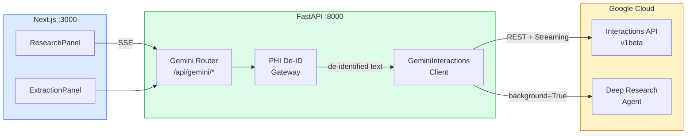

# Gemini Interactions API Setup Guide for PMS Integration

**Document ID:** PMS-EXP-GEMINI-INTERACTIONS-001
**Version:** 1.0
**Date:** March 3, 2026
**Applies To:** PMS project (all platforms)
**Prerequisites Level:** Intermediate

---

## Table of Contents

1. [Overview](#1-overview)
2. [Prerequisites](#2-prerequisites)
3. [Part A: Install and Configure Gemini Interactions SDK](#3-part-a-install-and-configure-gemini-interactions-sdk)
4. [Part B: Integrate with PMS Backend](#4-part-b-integrate-with-pms-backend)
5. [Part C: Integrate with PMS Frontend](#5-part-c-integrate-with-pms-frontend)
6. [Part D: Testing and Verification](#6-part-d-testing-and-verification)
7. [Troubleshooting](#7-troubleshooting)
8. [Reference Commands](#8-reference-commands)

---

## 1. Overview

This guide walks you through adding Google's **Gemini Interactions API** to the PMS stack. By the end, you will have:

- The `google-genai` Python SDK installed and configured in the PMS backend
- A `GeminiInteractionsClient` that wraps stateful interactions, streaming, and Deep Research
- A PHI de-identification gateway that strips patient data before any external API call
- FastAPI endpoints exposing clinical research, structured extraction, and multi-turn conversation
- A Next.js frontend panel for triggering and displaying research results
- End-to-end health checks confirming connectivity

### Architecture at a Glance



---

## 2. Prerequisites

### 2.1 Required Software

| Software | Minimum Version | Check Command |
|----------|----------------|---------------|
| Python | 3.11+ | `python3 --version` |
| Node.js | 20+ | `node --version` |
| PostgreSQL | 15+ | `psql --version` |
| Docker | 24+ | `docker --version` |
| pip | 23+ | `pip --version` |
| Google Cloud SDK | 469+ (optional) | `gcloud --version` |

### 2.2 Installation of Prerequisites

**Google API Key (AI Studio — development only):**

1. Navigate to [Google AI Studio](https://aistudio.google.com/apikey)
2. Click **Create API Key**
3. Copy the key — you will add it to `.env` in Part A

> **HIPAA WARNING:** AI Studio keys have NO Business Associate Agreement (BAA). Never send PHI through AI Studio. For production with real patient data, use Vertex AI with a signed BAA. See [PRD Section 6.1](29-PRD-GeminiInteractions-PMS-Integration.md) for details.

**Vertex AI (production with BAA):**

```bash
# Install gcloud CLI if not present
curl https://sdk.cloud.google.com | bash
gcloud init
gcloud auth application-default login
gcloud services enable aiplatform.googleapis.com
```

### 2.3 Verify PMS Services

Confirm the PMS backend, frontend, and database are running:

```bash
# Backend health check
curl -s http://localhost:8000/health | python3 -m json.tool

# Frontend running
curl -s -o /dev/null -w "%{http_code}" http://localhost:3000

# PostgreSQL connection
psql -U pms -d pms_dev -c "SELECT 1;"
```

All three should respond successfully before proceeding.

---

## 3. Part A: Install and Configure Gemini Interactions SDK

### Step 1: Install the Python SDK

```bash
cd pms-backend
pip install "google-genai>=1.55.0"
```

Verify:

```bash
python3 -c "import google.genai; print(google.genai.__version__)"
```

Expected: `1.55.0` or higher.

### Step 2: Add environment variables

Add to `pms-backend/.env`:

```env
# Gemini Interactions API
GEMINI_API_KEY=your-api-key-here
GEMINI_MODEL=gemini-2.5-flash
GEMINI_RESEARCH_AGENT=deep-research-pro-preview-12-2025
GEMINI_USE_VERTEX=false
GEMINI_VERTEX_PROJECT=your-gcp-project
GEMINI_VERTEX_LOCATION=us-central1
GEMINI_STORE_INTERACTIONS=false
GEMINI_MAX_TOKENS=8192
```

> Set `GEMINI_USE_VERTEX=true` and remove `GEMINI_API_KEY` for production deployments with a BAA.

### Step 3: Create the configuration module

Create `pms-backend/app/integrations/gemini/config.py`:

```python
"""Gemini Interactions API configuration."""

from dataclasses import dataclass, field
from enum import Enum
from functools import lru_cache
from os import environ


class GeminiModel(str, Enum):
    """Available Gemini models for the Interactions API."""
    FLASH_25 = "gemini-2.5-flash"
    PRO_25 = "gemini-2.5-pro"
    FLASH_3 = "gemini-3-flash-preview"
    PRO_31 = "gemini-3.1-pro-preview"


class GeminiAgent(str, Enum):
    """Managed agent identifiers."""
    DEEP_RESEARCH = "deep-research-pro-preview-12-2025"


class ThinkingLevel(str, Enum):
    """Thinking budget levels for extended reasoning."""
    NONE = "none"
    LOW = "low"
    MEDIUM = "medium"
    HIGH = "high"


@dataclass(frozen=True)
class GeminiConfig:
    """Immutable configuration for the Gemini Interactions client."""
    api_key: str = ""
    model: str = GeminiModel.FLASH_25.value
    research_agent: str = GeminiAgent.DEEP_RESEARCH.value
    use_vertex: bool = False
    vertex_project: str = ""
    vertex_location: str = "us-central1"
    store_interactions: bool = False
    max_tokens: int = 8192


@lru_cache(maxsize=1)
def load_gemini_config() -> GeminiConfig:
    """Load Gemini configuration from environment variables."""
    return GeminiConfig(
        api_key=environ.get("GEMINI_API_KEY", ""),
        model=environ.get("GEMINI_MODEL", GeminiModel.FLASH_25.value),
        research_agent=environ.get(
            "GEMINI_RESEARCH_AGENT", GeminiAgent.DEEP_RESEARCH.value
        ),
        use_vertex=environ.get("GEMINI_USE_VERTEX", "false").lower() == "true",
        vertex_project=environ.get("GEMINI_VERTEX_PROJECT", ""),
        vertex_location=environ.get("GEMINI_VERTEX_LOCATION", "us-central1"),
        store_interactions=environ.get(
            "GEMINI_STORE_INTERACTIONS", "false"
        ).lower() == "true",
        max_tokens=int(environ.get("GEMINI_MAX_TOKENS", "8192")),
    )
```

### Step 4: Create the Interactions client

Create `pms-backend/app/integrations/gemini/client.py`:

```python
"""Gemini Interactions API client for PMS."""

from __future__ import annotations

import asyncio
import logging
from typing import Any, AsyncIterator

from google import genai
from google.genai import types

from .config import GeminiConfig, load_gemini_config

logger = logging.getLogger(__name__)


class GeminiInteractionsClient:
    """Wraps the Gemini Interactions API with PMS-specific defaults."""

    def __init__(self, config: GeminiConfig | None = None) -> None:
        self.config = config or load_gemini_config()
        if self.config.use_vertex:
            self._client = genai.Client(
                vertexai=True,
                project=self.config.vertex_project,
                location=self.config.vertex_location,
            )
        else:
            self._client = genai.Client(api_key=self.config.api_key)

    async def interact(
        self,
        user_message: str,
        *,
        model: str | None = None,
        previous_interaction_id: str | None = None,
        system_instruction: str | None = None,
        response_schema: dict[str, Any] | None = None,
        tools: list[str] | None = None,
    ) -> types.Interaction:
        """Send a single interaction and return the full response.

        Args:
            user_message: The user's message text.
            model: Override the default model.
            previous_interaction_id: Chain to a prior interaction for
                multi-turn conversations.
            system_instruction: System prompt override.
            response_schema: JSON Schema for structured output enforcement.
            tools: Built-in tools to enable (e.g., ["google_search"]).

        Returns:
            The completed Interaction object.
        """
        config_kwargs: dict[str, Any] = {
            "store": self.config.store_interactions,
        }
        if response_schema:
            config_kwargs["response_format"] = response_schema
        if tools:
            config_kwargs["tools"] = [
                types.Tool(name=t) for t in tools
            ]

        interaction = await asyncio.to_thread(
            self._client.interactions.create,
            model=model or self.config.model,
            config=types.InteractionConfig(**config_kwargs),
            user_content=user_message,
            previous_interaction_id=previous_interaction_id,
            system_instruction=system_instruction,
        )
        return interaction

    async def interact_stream(
        self,
        user_message: str,
        *,
        model: str | None = None,
        previous_interaction_id: str | None = None,
        system_instruction: str | None = None,
    ) -> AsyncIterator[types.InteractionEvent]:
        """Stream interaction events (content deltas, tool calls, etc.).

        Yields InteractionEvent objects as they arrive.
        """
        stream = self._client.interactions.create_stream(
            model=model or self.config.model,
            config=types.InteractionConfig(
                store=self.config.store_interactions,
            ),
            user_content=user_message,
            previous_interaction_id=previous_interaction_id,
            system_instruction=system_instruction,
        )
        for event in stream:
            yield event

    async def research(
        self,
        query: str,
        *,
        system_instruction: str | None = None,
    ) -> types.Interaction:
        """Launch a Deep Research Agent task (background execution).

        Returns immediately with an interaction ID. Poll with
        get_interaction() to check completion status.
        """
        interaction = await asyncio.to_thread(
            self._client.interactions.create,
            model=self.config.research_agent,
            config=types.InteractionConfig(
                store=True,  # research results must persist for polling
            ),
            user_content=query,
            system_instruction=system_instruction,
            background=True,
        )
        logger.info(
            "Deep Research started: interaction_id=%s", interaction.id
        )
        return interaction

    async def poll_research(
        self,
        interaction_id: str,
        *,
        poll_interval: float = 5.0,
        timeout: float = 300.0,
    ) -> types.Interaction:
        """Poll a background research interaction until completion.

        Args:
            interaction_id: The interaction ID from research().
            poll_interval: Seconds between polls.
            timeout: Maximum wait time in seconds.

        Returns:
            The completed Interaction with research results.

        Raises:
            TimeoutError: If the research does not complete within timeout.
        """
        elapsed = 0.0
        while elapsed < timeout:
            interaction = await self.get_interaction(interaction_id)
            if interaction.status == "COMPLETED":
                return interaction
            if interaction.status == "FAILED":
                raise RuntimeError(
                    f"Research failed: {interaction.error}"
                )
            await asyncio.sleep(poll_interval)
            elapsed += poll_interval
        raise TimeoutError(
            f"Research {interaction_id} did not complete within {timeout}s"
        )

    async def get_interaction(
        self, interaction_id: str
    ) -> types.Interaction:
        """Retrieve a previously created interaction by ID."""
        return await asyncio.to_thread(
            self._client.interactions.get,
            interaction_id=interaction_id,
        )
```

### Step 5: Create the PHI de-identification gateway

Create `pms-backend/app/integrations/gemini/deidentify.py`:

```python
"""PHI de-identification gateway for Gemini Interactions API.

Strips Protected Health Information (PHI) from text before sending
to external APIs. Uses regex patterns for common PHI formats and
maintains a reversible mapping for re-identification of responses.
"""

from __future__ import annotations

import re
import uuid
from dataclasses import dataclass, field

# PHI patterns — order matters (most specific first)
PHI_PATTERNS: list[tuple[str, str]] = [
    # SSN
    (r"\b\d{3}-\d{2}-\d{4}\b", "SSN"),
    # MRN (Medical Record Number) — common formats
    (r"\bMRN[:\s#]*\d{6,10}\b", "MRN"),
    # Phone numbers
    (r"\b\(?\d{3}\)?[-.\s]?\d{3}[-.\s]?\d{4}\b", "PHONE"),
    # Email addresses
    (r"\b[A-Za-z0-9._%+-]+@[A-Za-z0-9.-]+\.[A-Z|a-z]{2,}\b", "EMAIL"),
    # Dates of birth / dates in MM/DD/YYYY or YYYY-MM-DD
    (r"\b\d{1,2}/\d{1,2}/\d{2,4}\b", "DATE"),
    (r"\b\d{4}-\d{2}-\d{2}\b", "DATE"),
    # Street addresses (simple heuristic)
    (r"\b\d{1,5}\s[\w\s]{2,30}(?:St|Ave|Blvd|Dr|Ln|Rd|Way|Ct)\b", "ADDRESS"),
]


@dataclass
class DeidentificationResult:
    """Result of PHI de-identification with reversible mapping."""
    clean_text: str
    phi_map: dict[str, str] = field(default_factory=dict)
    phi_count: int = 0


def deidentify_text(text: str) -> DeidentificationResult:
    """Remove PHI from text, replacing with unique placeholders.

    Args:
        text: Raw text potentially containing PHI.

    Returns:
        DeidentificationResult with clean text and a mapping from
        placeholders to original values for re-identification.
    """
    phi_map: dict[str, str] = {}
    clean = text
    count = 0

    for pattern, phi_type in PHI_PATTERNS:
        for match in re.finditer(pattern, clean):
            original = match.group()
            placeholder = f"[{phi_type}_{uuid.uuid4().hex[:8]}]"
            phi_map[placeholder] = original
            clean = clean.replace(original, placeholder, 1)
            count += 1

    return DeidentificationResult(
        clean_text=clean,
        phi_map=phi_map,
        phi_count=count,
    )


def reidentify_text(text: str, phi_map: dict[str, str]) -> str:
    """Re-insert original PHI values into de-identified text.

    Args:
        text: Text containing placeholders from deidentify_text().
        phi_map: The mapping returned by deidentify_text().

    Returns:
        Text with placeholders replaced by original PHI values.
    """
    result = text
    for placeholder, original in phi_map.items():
        result = result.replace(placeholder, original)
    return result
```

### Step 6: Create the package init

Create `pms-backend/app/integrations/gemini/__init__.py`:

```python
"""Gemini Interactions API integration for PMS."""

from .client import GeminiInteractionsClient
from .config import GeminiConfig, load_gemini_config
from .deidentify import deidentify_text, reidentify_text

__all__ = [
    "GeminiInteractionsClient",
    "GeminiConfig",
    "load_gemini_config",
    "deidentify_text",
    "reidentify_text",
]
```

**Checkpoint:** You now have the Gemini SDK installed, a typed configuration module, a full-featured async client with streaming and Deep Research support, and a PHI de-identification gateway. Run `python3 -c "from app.integrations.gemini import GeminiInteractionsClient; print('OK')"` from the backend root to verify imports.

---

## 4. Part B: Integrate with PMS Backend

### Step 1: Create the FastAPI router

Create `pms-backend/app/api/routes/gemini.py`:

```python
"""FastAPI routes for Gemini Interactions API."""

from __future__ import annotations

import logging
from typing import Any

from fastapi import APIRouter, HTTPException
from fastapi.responses import StreamingResponse
from pydantic import BaseModel, Field

from app.integrations.gemini import (
    GeminiInteractionsClient,
    deidentify_text,
    reidentify_text,
)

logger = logging.getLogger(__name__)
router = APIRouter(prefix="/api/gemini", tags=["gemini"])

# Singleton client — initialized on first request
_client: GeminiInteractionsClient | None = None


def _get_client() -> GeminiInteractionsClient:
    global _client
    if _client is None:
        _client = GeminiInteractionsClient()
    return _client


# --- Request / Response Models ---


class InteractionRequest(BaseModel):
    """Request body for a single Gemini interaction."""
    message: str = Field(..., min_length=1, max_length=10000)
    previous_interaction_id: str | None = None
    system_instruction: str | None = None
    model: str | None = None
    tools: list[str] | None = None


class InteractionResponse(BaseModel):
    """Response from a Gemini interaction."""
    interaction_id: str
    text: str
    model: str
    phi_stripped: int = 0


class ResearchRequest(BaseModel):
    """Request body for a Deep Research task."""
    query: str = Field(..., min_length=10, max_length=5000)
    system_instruction: str | None = None


class ResearchStatusResponse(BaseModel):
    """Status of a background research task."""
    interaction_id: str
    status: str
    result: str | None = None


class ExtractionRequest(BaseModel):
    """Request for structured clinical data extraction."""
    text: str = Field(..., min_length=1, max_length=20000)
    schema_name: str = Field(..., description="Name of the extraction schema")
    model: str | None = None


# --- Extraction Schemas ---

EXTRACTION_SCHEMAS: dict[str, dict[str, Any]] = {
    "medication_list": {
        "type": "object",
        "properties": {
            "medications": {
                "type": "array",
                "items": {
                    "type": "object",
                    "properties": {
                        "name": {"type": "string"},
                        "dosage": {"type": "string"},
                        "frequency": {"type": "string"},
                        "route": {"type": "string"},
                        "indication": {"type": "string"},
                    },
                    "required": ["name"],
                },
            }
        },
    },
    "icd10_codes": {
        "type": "object",
        "properties": {
            "codes": {
                "type": "array",
                "items": {
                    "type": "object",
                    "properties": {
                        "code": {"type": "string"},
                        "description": {"type": "string"},
                        "confidence": {"type": "number"},
                    },
                    "required": ["code", "description"],
                },
            }
        },
    },
    "vital_signs": {
        "type": "object",
        "properties": {
            "vitals": {
                "type": "array",
                "items": {
                    "type": "object",
                    "properties": {
                        "type": {"type": "string"},
                        "value": {"type": "number"},
                        "unit": {"type": "string"},
                        "timestamp": {"type": "string"},
                    },
                    "required": ["type", "value", "unit"],
                },
            }
        },
    },
}


# --- Endpoints ---


@router.post("/interact", response_model=InteractionResponse)
async def create_interaction(req: InteractionRequest):
    """Create a single Gemini interaction with PHI de-identification."""
    client = _get_client()

    # De-identify before sending to Google
    deid = deidentify_text(req.message)
    if deid.phi_count > 0:
        logger.info("Stripped %d PHI elements from interaction", deid.phi_count)

    interaction = await client.interact(
        user_message=deid.clean_text,
        model=req.model,
        previous_interaction_id=req.previous_interaction_id,
        system_instruction=req.system_instruction,
        tools=req.tools,
    )

    # Re-identify the response if needed
    response_text = interaction.text or ""
    if deid.phi_map:
        response_text = reidentify_text(response_text, deid.phi_map)

    return InteractionResponse(
        interaction_id=interaction.id,
        text=response_text,
        model=interaction.model,
        phi_stripped=deid.phi_count,
    )


@router.post("/interact/stream")
async def stream_interaction(req: InteractionRequest):
    """Stream a Gemini interaction via Server-Sent Events."""
    client = _get_client()
    deid = deidentify_text(req.message)

    async def event_generator():
        async for event in client.interact_stream(
            user_message=deid.clean_text,
            model=req.model,
            previous_interaction_id=req.previous_interaction_id,
            system_instruction=req.system_instruction,
        ):
            if hasattr(event, "text") and event.text:
                text = event.text
                if deid.phi_map:
                    text = reidentify_text(text, deid.phi_map)
                yield f"data: {text}\n\n"
        yield "data: [DONE]\n\n"

    return StreamingResponse(
        event_generator(),
        media_type="text/event-stream",
        headers={"Cache-Control": "no-cache", "X-Accel-Buffering": "no"},
    )


@router.post("/research", response_model=ResearchStatusResponse)
async def start_research(req: ResearchRequest):
    """Start a Deep Research Agent task (background)."""
    client = _get_client()

    # De-identify the research query
    deid = deidentify_text(req.query)
    if deid.phi_count > 0:
        logger.warning(
            "PHI detected in research query — stripped %d elements. "
            "Research queries should not contain PHI.",
            deid.phi_count,
        )

    interaction = await client.research(
        query=deid.clean_text,
        system_instruction=req.system_instruction,
    )

    return ResearchStatusResponse(
        interaction_id=interaction.id,
        status="RUNNING",
    )


@router.get("/research/{interaction_id}", response_model=ResearchStatusResponse)
async def get_research_status(interaction_id: str):
    """Poll the status of a background research task."""
    client = _get_client()

    try:
        interaction = await client.get_interaction(interaction_id)
    except Exception as exc:
        raise HTTPException(status_code=404, detail=str(exc)) from exc

    return ResearchStatusResponse(
        interaction_id=interaction.id,
        status=interaction.status or "UNKNOWN",
        result=interaction.text if interaction.status == "COMPLETED" else None,
    )


@router.post("/extract")
async def structured_extraction(req: ExtractionRequest):
    """Extract structured clinical data using JSON Schema enforcement."""
    if req.schema_name not in EXTRACTION_SCHEMAS:
        raise HTTPException(
            status_code=400,
            detail=f"Unknown schema: {req.schema_name}. "
            f"Available: {list(EXTRACTION_SCHEMAS.keys())}",
        )

    client = _get_client()
    deid = deidentify_text(req.text)

    interaction = await client.interact(
        user_message=f"Extract structured data from the following clinical text:\n\n{deid.clean_text}",
        response_schema=EXTRACTION_SCHEMAS[req.schema_name],
        system_instruction=(
            "You are a clinical data extraction assistant. Extract structured "
            "data from the provided text according to the response schema. "
            "Only include data explicitly present in the text."
        ),
    )

    return {
        "interaction_id": interaction.id,
        "schema": req.schema_name,
        "data": interaction.text,
        "phi_stripped": deid.phi_count,
    }


@router.get("/health")
async def gemini_health():
    """Check connectivity to the Gemini Interactions API."""
    client = _get_client()
    try:
        interaction = await client.interact(
            user_message="Respond with exactly: OK",
            model="gemini-2.5-flash",
        )
        return {
            "status": "healthy",
            "model": interaction.model,
            "interaction_id": interaction.id,
        }
    except Exception as exc:
        return {"status": "unhealthy", "error": str(exc)}
```

### Step 2: Register the router

Add to `pms-backend/app/api/router.py` (or wherever your root router is):

```python
from app.api.routes.gemini import router as gemini_router

app.include_router(gemini_router)
```

### Step 3: Add audit logging middleware

Create `pms-backend/app/integrations/gemini/audit.py`:

```python
"""HIPAA audit logging for Gemini Interactions API calls."""

from __future__ import annotations

import logging
from datetime import datetime, timezone
from typing import Any

logger = logging.getLogger("gemini.audit")


def log_interaction(
    *,
    interaction_id: str,
    endpoint: str,
    user_id: str | None = None,
    phi_stripped: int = 0,
    model: str = "",
    status: str = "success",
    metadata: dict[str, Any] | None = None,
) -> None:
    """Log a HIPAA-compliant audit entry for a Gemini API call.

    Never logs the actual message content — only metadata.
    """
    logger.info(
        "GEMINI_AUDIT interaction_id=%s endpoint=%s user=%s "
        "phi_stripped=%d model=%s status=%s timestamp=%s metadata=%s",
        interaction_id,
        endpoint,
        user_id or "anonymous",
        phi_stripped,
        model,
        status,
        datetime.now(timezone.utc).isoformat(),
        metadata or {},
    )
```

**Checkpoint:** The PMS backend now has a complete Gemini router at `/api/gemini/*` with four endpoints: `POST /interact`, `POST /interact/stream`, `POST /research`, `GET /research/{id}`, `POST /extract`, and `GET /health`. PHI is de-identified before every external call and audit-logged after.

---

## 5. Part C: Integrate with PMS Frontend

### Step 1: Install the JavaScript SDK (optional — for client-side type reference)

```bash
cd pms-frontend
npm install @google/genai@^1.33.0
```

> The frontend does **not** call the Interactions API directly. All calls route through the PMS backend. The SDK is installed only for TypeScript types if needed.

### Step 2: Add environment variables

Add to `pms-frontend/.env.local`:

```env
NEXT_PUBLIC_GEMINI_API_URL=/api/gemini
```

### Step 3: Create the Research Panel component

Create `pms-frontend/src/components/gemini/ResearchPanel.tsx`:

```tsx
"use client";

import { FormEvent, useState } from "react";

interface ResearchResult {
  interaction_id: string;
  status: string;
  result: string | null;
}

export function ResearchPanel() {
  const [query, setQuery] = useState("");
  const [result, setResult] = useState<ResearchResult | null>(null);
  const [loading, setLoading] = useState(false);
  const [error, setError] = useState<string | null>(null);

  async function handleSubmit(e: FormEvent) {
    e.preventDefault();
    setLoading(true);
    setError(null);
    setResult(null);

    try {
      // Start research
      const startRes = await fetch("/api/gemini/research", {
        method: "POST",
        headers: { "Content-Type": "application/json" },
        body: JSON.stringify({ query }),
      });

      if (!startRes.ok) {
        throw new Error(`Research start failed: ${startRes.statusText}`);
      }

      const startData: ResearchResult = await startRes.json();
      setResult(startData);

      // Poll for completion
      const interactionId = startData.interaction_id;
      let attempts = 0;
      const maxAttempts = 60; // 5 minutes at 5s intervals

      while (attempts < maxAttempts) {
        await new Promise((r) => setTimeout(r, 5000));
        const pollRes = await fetch(
          `/api/gemini/research/${interactionId}`
        );
        const pollData: ResearchResult = await pollRes.json();
        setResult(pollData);

        if (pollData.status === "COMPLETED" || pollData.status === "FAILED") {
          break;
        }
        attempts++;
      }
    } catch (err) {
      setError(err instanceof Error ? err.message : "Unknown error");
    } finally {
      setLoading(false);
    }
  }

  return (
    <div className="rounded-lg border bg-white p-6 shadow-sm">
      <h2 className="mb-4 text-lg font-semibold">
        Clinical Research (Gemini Deep Research)
      </h2>

      <form onSubmit={handleSubmit} className="space-y-4">
        <textarea
          value={query}
          onChange={(e) => setQuery(e.target.value)}
          placeholder="Enter a clinical research question..."
          className="w-full rounded border p-3 text-sm"
          rows={3}
          disabled={loading}
        />
        <button
          type="submit"
          disabled={loading || !query.trim()}
          className="rounded bg-blue-600 px-4 py-2 text-sm font-medium text-white
                     hover:bg-blue-700 disabled:opacity-50"
        >
          {loading ? "Researching..." : "Start Research"}
        </button>
      </form>

      {error && (
        <div className="mt-4 rounded bg-red-50 p-3 text-sm text-red-700">
          {error}
        </div>
      )}

      {result && (
        <div className="mt-4 space-y-2">
          <div className="flex items-center gap-2 text-sm text-gray-500">
            <span>Status: {result.status}</span>
            <span>ID: {result.interaction_id}</span>
          </div>
          {result.result && (
            <pre className="max-h-96 overflow-auto rounded bg-gray-50 p-4 text-sm whitespace-pre-wrap">
              {result.result}
            </pre>
          )}
        </div>
      )}
    </div>
  );
}
```

### Step 4: Create the Streaming Chat component

Create `pms-frontend/src/components/gemini/GeminiChat.tsx`:

```tsx
"use client";

import { FormEvent, useRef, useState } from "react";

interface Message {
  role: "user" | "assistant";
  content: string;
}

export function GeminiChat() {
  const [messages, setMessages] = useState<Message[]>([]);
  const [input, setInput] = useState("");
  const [streaming, setStreaming] = useState(false);
  const [interactionId, setInteractionId] = useState<string | null>(null);
  const abortRef = useRef<AbortController | null>(null);

  async function handleSubmit(e: FormEvent) {
    e.preventDefault();
    if (!input.trim() || streaming) return;

    const userMessage = input;
    setInput("");
    setMessages((prev) => [...prev, { role: "user", content: userMessage }]);
    setStreaming(true);

    try {
      abortRef.current = new AbortController();
      const res = await fetch("/api/gemini/interact/stream", {
        method: "POST",
        headers: { "Content-Type": "application/json" },
        body: JSON.stringify({
          message: userMessage,
          previous_interaction_id: interactionId,
        }),
        signal: abortRef.current.signal,
      });

      if (!res.ok || !res.body) {
        throw new Error("Stream failed");
      }

      const reader = res.body.getReader();
      const decoder = new TextDecoder();
      let assistantContent = "";

      setMessages((prev) => [...prev, { role: "assistant", content: "" }]);

      while (true) {
        const { done, value } = await reader.read();
        if (done) break;

        const chunk = decoder.decode(value);
        const lines = chunk.split("\n");

        for (const line of lines) {
          if (line.startsWith("data: ")) {
            const data = line.slice(6);
            if (data === "[DONE]") break;
            assistantContent += data;
            setMessages((prev) => {
              const updated = [...prev];
              updated[updated.length - 1] = {
                role: "assistant",
                content: assistantContent,
              };
              return updated;
            });
          }
        }
      }
    } catch (err) {
      if (err instanceof Error && err.name !== "AbortError") {
        setMessages((prev) => [
          ...prev,
          { role: "assistant", content: `Error: ${err.message}` },
        ]);
      }
    } finally {
      setStreaming(false);
    }
  }

  return (
    <div className="flex h-[600px] flex-col rounded-lg border bg-white shadow-sm">
      <div className="border-b px-4 py-3">
        <h2 className="font-semibold">Gemini Clinical Assistant</h2>
        <p className="text-xs text-gray-500">
          Powered by Gemini Interactions API
        </p>
      </div>

      <div className="flex-1 overflow-y-auto p-4 space-y-4">
        {messages.map((msg, i) => (
          <div
            key={i}
            className={`rounded-lg p-3 text-sm ${
              msg.role === "user"
                ? "ml-8 bg-blue-50 text-blue-900"
                : "mr-8 bg-gray-50 text-gray-900"
            }`}
          >
            <pre className="whitespace-pre-wrap font-sans">{msg.content}</pre>
          </div>
        ))}
      </div>

      <form onSubmit={handleSubmit} className="border-t p-4 flex gap-2">
        <input
          type="text"
          value={input}
          onChange={(e) => setInput(e.target.value)}
          placeholder="Ask a clinical question..."
          className="flex-1 rounded border px-3 py-2 text-sm"
          disabled={streaming}
        />
        <button
          type="submit"
          disabled={streaming || !input.trim()}
          className="rounded bg-blue-600 px-4 py-2 text-sm font-medium text-white
                     hover:bg-blue-700 disabled:opacity-50"
        >
          {streaming ? "..." : "Send"}
        </button>
      </form>
    </div>
  );
}
```

### Step 5: Create the Extraction Panel component

Create `pms-frontend/src/components/gemini/ExtractionPanel.tsx`:

```tsx
"use client";

import { FormEvent, useState } from "react";

const SCHEMAS = ["medication_list", "icd10_codes", "vital_signs"];

export function ExtractionPanel() {
  const [text, setText] = useState("");
  const [schema, setSchema] = useState(SCHEMAS[0]);
  const [result, setResult] = useState<string | null>(null);
  const [loading, setLoading] = useState(false);

  async function handleExtract(e: FormEvent) {
    e.preventDefault();
    setLoading(true);
    setResult(null);

    try {
      const res = await fetch("/api/gemini/extract", {
        method: "POST",
        headers: { "Content-Type": "application/json" },
        body: JSON.stringify({ text, schema_name: schema }),
      });
      const data = await res.json();
      setResult(JSON.stringify(data.data, null, 2));
    } catch (err) {
      setResult(`Error: ${err instanceof Error ? err.message : "Unknown"}`);
    } finally {
      setLoading(false);
    }
  }

  return (
    <div className="rounded-lg border bg-white p-6 shadow-sm">
      <h2 className="mb-4 text-lg font-semibold">
        Structured Clinical Extraction
      </h2>

      <form onSubmit={handleExtract} className="space-y-4">
        <textarea
          value={text}
          onChange={(e) => setText(e.target.value)}
          placeholder="Paste clinical text to extract structured data..."
          className="w-full rounded border p-3 text-sm"
          rows={5}
          disabled={loading}
        />

        <div className="flex items-center gap-4">
          <select
            value={schema}
            onChange={(e) => setSchema(e.target.value)}
            className="rounded border px-3 py-2 text-sm"
          >
            {SCHEMAS.map((s) => (
              <option key={s} value={s}>
                {s.replace(/_/g, " ")}
              </option>
            ))}
          </select>

          <button
            type="submit"
            disabled={loading || !text.trim()}
            className="rounded bg-green-600 px-4 py-2 text-sm font-medium text-white
                       hover:bg-green-700 disabled:opacity-50"
          >
            {loading ? "Extracting..." : "Extract"}
          </button>
        </div>
      </form>

      {result && (
        <pre className="mt-4 max-h-64 overflow-auto rounded bg-gray-50 p-4 text-sm whitespace-pre-wrap">
          {result}
        </pre>
      )}
    </div>
  );
}
```

**Checkpoint:** The PMS frontend now has three Gemini components: `ResearchPanel` for Deep Research, `GeminiChat` for streaming multi-turn conversation, and `ExtractionPanel` for structured clinical data extraction. All components route through the PMS backend — no direct Google API calls from the browser.

---

## 6. Part D: Testing and Verification

### Step 1: Verify API connectivity

```bash
# Health check
curl -s http://localhost:8000/api/gemini/health | python3 -m json.tool
```

Expected:

```json
{
  "status": "healthy",
  "model": "gemini-2.5-flash",
  "interaction_id": "interactions/abc123..."
}
```

### Step 2: Test a basic interaction

```bash
curl -s -X POST http://localhost:8000/api/gemini/interact \
  -H "Content-Type: application/json" \
  -d '{
    "message": "What are the first-line treatments for type 2 diabetes?",
    "tools": ["google_search"]
  }' | python3 -m json.tool
```

Expected: A JSON response with `interaction_id`, `text` containing treatment information, and `phi_stripped: 0`.

### Step 3: Test PHI de-identification

```bash
curl -s -X POST http://localhost:8000/api/gemini/interact \
  -H "Content-Type: application/json" \
  -d '{
    "message": "Patient John Smith, MRN: 1234567, DOB 03/15/1980, was prescribed metformin 500mg. Summarize the treatment plan."
  }' | python3 -m json.tool
```

Expected: Response with `phi_stripped` > 0, confirming PHI was removed before the API call.

### Step 4: Test structured extraction

```bash
curl -s -X POST http://localhost:8000/api/gemini/extract \
  -H "Content-Type: application/json" \
  -d '{
    "text": "Patient takes lisinopril 10mg daily for hypertension, metformin 500mg twice daily for diabetes, and aspirin 81mg daily for cardioprotection.",
    "schema_name": "medication_list"
  }' | python3 -m json.tool
```

Expected: Structured JSON with three medication entries.

### Step 5: Test Deep Research

```bash
# Start research
RESEARCH_ID=$(curl -s -X POST http://localhost:8000/api/gemini/research \
  -H "Content-Type: application/json" \
  -d '{"query": "What are the latest 2025-2026 guidelines for managing heart failure with preserved ejection fraction?"}' \
  | python3 -c "import sys,json; print(json.load(sys.stdin)['interaction_id'])")

echo "Research started: $RESEARCH_ID"

# Poll for results (may take 2-5 minutes)
sleep 30
curl -s "http://localhost:8000/api/gemini/research/$RESEARCH_ID" | python3 -m json.tool
```

### Step 6: Test streaming via SSE

```bash
curl -N -X POST http://localhost:8000/api/gemini/interact/stream \
  -H "Content-Type: application/json" \
  -d '{"message": "List three common side effects of metformin."}'
```

Expected: Streaming `data:` lines followed by `data: [DONE]`.

**Checkpoint:** All six test scenarios pass — basic interaction, PHI de-identification, structured extraction, Deep Research, streaming, and health check.

---

## 7. Troubleshooting

### API Key Invalid or Missing

**Symptom:** `403 Forbidden` or `401 Unauthorized` from the Gemini API.

**Solution:**
1. Verify the key is set: `echo $GEMINI_API_KEY`
2. Test directly: `curl "https://generativelanguage.googleapis.com/v1beta/models?key=$GEMINI_API_KEY"`
3. Regenerate the key at [AI Studio](https://aistudio.google.com/apikey) if needed
4. Ensure the key has the Generative Language API enabled

### Model Not Found

**Symptom:** `404 Model not found` for preview models.

**Solution:** Preview models rotate. Check current availability:
```bash
curl -s "https://generativelanguage.googleapis.com/v1beta/models?key=$GEMINI_API_KEY" \
  | python3 -c "import sys,json; [print(m['name']) for m in json.load(sys.stdin)['models'] if 'interact' in str(m.get('supportedGenerationMethods',[]))]"
```

### Deep Research Timeout

**Symptom:** Research tasks never reach `COMPLETED` status.

**Solution:**
1. Deep Research requires `store=True` — verify `GEMINI_STORE_INTERACTIONS` is not overriding for research calls
2. Check rate limits — free tier allows only 5 RPM
3. Increase poll timeout: the default 5 minutes may not be enough for complex queries
4. Verify the research agent model name matches the current preview: `deep-research-pro-preview-12-2025`

### Port Conflicts

**Symptom:** Backend fails to start on port 8000.

**Solution:**
```bash
# Find what's using port 8000
lsof -i :8000
# Kill the process or change the backend port in .env
```

### Vertex AI Authentication Failure

**Symptom:** `PermissionDenied` when using Vertex AI in production.

**Solution:**
1. Verify application default credentials: `gcloud auth application-default print-access-token`
2. Ensure the service account has `roles/aiplatform.user`
3. Confirm the project has the Vertex AI API enabled: `gcloud services list --enabled | grep aiplatform`
4. Check the BAA is signed for the project

### Rate Limiting

**Symptom:** `429 Too Many Requests`.

**Solution:**
- Free tier: 5-15 RPM depending on model
- Tier 1 paid: 150-300 RPM
- Add exponential backoff in the client or upgrade the billing tier
- Cache frequent queries in Redis (see [Experiment 26 — LangGraph](26-LangGraph-PMS-Developer-Setup-Guide.md) for Redis patterns)

### SSE Streaming Not Working

**Symptom:** Frontend receives entire response at once instead of streaming.

**Solution:**
1. Ensure `X-Accel-Buffering: no` header is set (included in the router)
2. If behind nginx, add `proxy_buffering off;` to the location block
3. Verify the frontend uses `fetch` with `res.body.getReader()`, not `res.json()`

---

## 8. Reference Commands

### Daily Development Workflow

```bash
# Start PMS services
docker compose up -d postgres
cd pms-backend && uvicorn app.main:app --reload --port 8000 &
cd pms-frontend && npm run dev &

# Test Gemini connectivity
curl -s http://localhost:8000/api/gemini/health | python3 -m json.tool

# Run backend tests
cd pms-backend && pytest tests/integrations/gemini/ -v

# Run frontend tests
cd pms-frontend && npm test -- --testPathPattern=gemini
```

### Management Commands

```bash
# Check current model availability
curl -s "https://generativelanguage.googleapis.com/v1beta/models?key=$GEMINI_API_KEY" | python3 -m json.tool

# List interactions (if store=True)
curl -s "https://generativelanguage.googleapis.com/v1beta/interactions?key=$GEMINI_API_KEY" | python3 -m json.tool

# Delete stored interaction
curl -s -X DELETE "https://generativelanguage.googleapis.com/v1beta/interactions/{id}?key=$GEMINI_API_KEY"

# Check API quota usage
gcloud services api-keys list --project=$GEMINI_VERTEX_PROJECT
```

### Useful URLs

| Resource | URL |
|----------|-----|
| PMS Backend Gemini Health | http://localhost:8000/api/gemini/health |
| PMS Backend Swagger Docs | http://localhost:8000/docs#/gemini |
| Google AI Studio | https://aistudio.google.com |
| Gemini API Documentation | https://ai.google.dev/gemini-api/docs/interactions |
| Vertex AI Console | https://console.cloud.google.com/vertex-ai |
| SDK PyPI Page | https://pypi.org/project/google-genai/ |

---

## Next Steps

After setup is complete:

1. Work through the [Gemini Interactions Developer Tutorial](29-GeminiInteractions-Developer-Tutorial.md) to build a drug interaction research pipeline end-to-end
2. Review the [PRD](29-PRD-GeminiInteractions-PMS-Integration.md) for the full component design and implementation phases
3. Evaluate how the Interactions API complements the [LangGraph orchestration layer](26-LangGraph-PMS-Developer-Setup-Guide.md) for PHI-touching workflows
4. Set up Vertex AI with a BAA for production deployment if moving past development

---

## Resources

- **Official Documentation:** [Gemini Interactions API Guide](https://ai.google.dev/gemini-api/docs/interactions)
- **Python SDK:** [google-genai on PyPI](https://pypi.org/project/google-genai/)
- **JavaScript SDK:** [@google/genai on npm](https://www.npmjs.com/package/@google/genai)
- **Vertex AI BAA:** [Google Cloud BAA for HIPAA](https://cloud.google.com/security/compliance/hipaa)
- **PMS Backend:** [API Endpoints Reference](../api/backend-endpoints.md)
- **Related Experiment:** [LangGraph Setup Guide](26-LangGraph-PMS-Developer-Setup-Guide.md)
