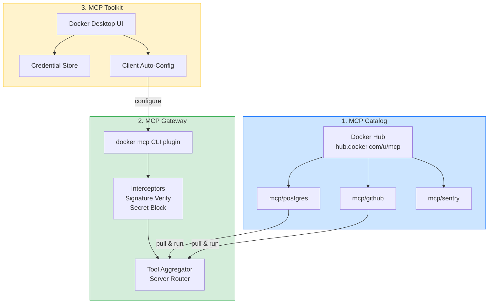
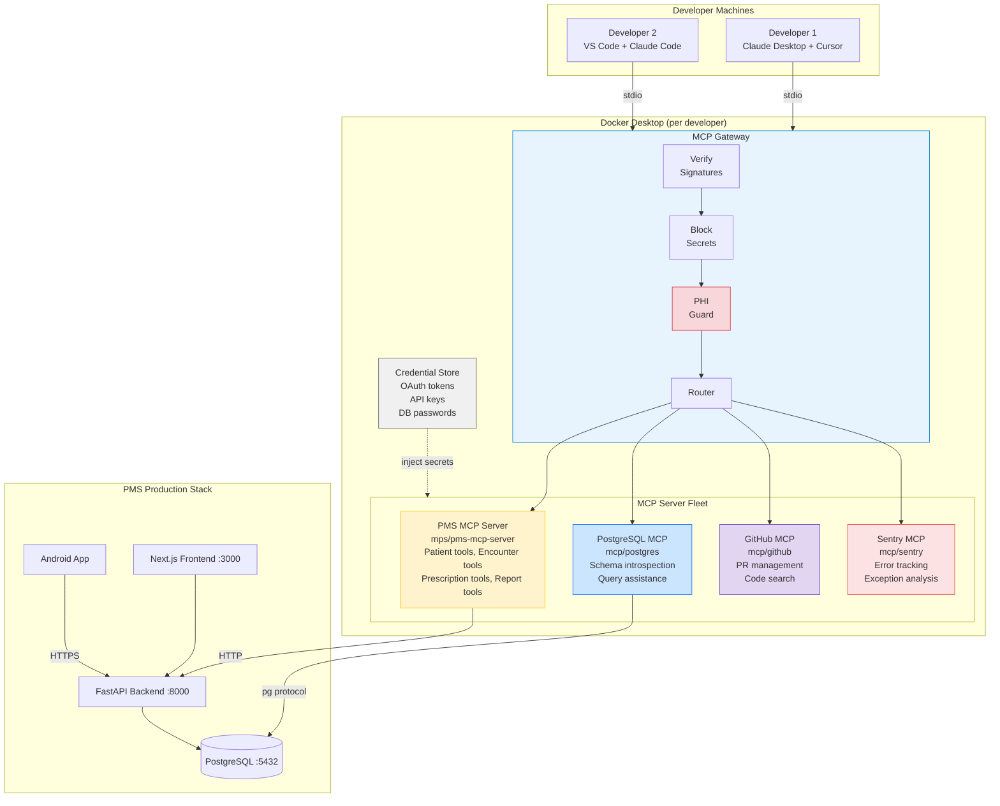

# MCP Docker Developer Onboarding Tutorial

**Welcome to the MPS PMS MCP Docker Integration Team**

This tutorial will take you from zero to deploying your first containerized MCP server fleet with the PMS. By the end, you will understand how Docker MCP Gateway works, have a running local environment with multiple MCP servers, and have built and tested a custom integration end-to-end.

**Document ID:** PMS-EXP-MCPDOCKER-002
**Version:** 1.0
**Date:** 2026-03-04
**Applies To:** PMS project (all platforms)
**Prerequisite:** [MCP Docker Setup Guide](29-MCPDocker-PMS-Developer-Setup-Guide.md)
**Estimated time:** 2-3 hours
**Difficulty:** Beginner-friendly

---

## What You Will Learn

1. What Docker MCP Toolkit is and why it matters for healthcare PMS development
2. How the MCP Gateway proxies, isolates, and secures MCP server communication
3. How to install and manage MCP servers from the Docker MCP Catalog
4. How to containerize a custom MCP server (the PMS MCP Server)
5. How to connect multiple AI clients (Claude Desktop, Cursor, VS Code) through a single Gateway
6. How to configure security interceptors for PHI protection
7. How to set up centralized credential management
8. How to monitor and audit MCP tool invocations for HIPAA compliance
9. How Docker MCP compares to running bare MCP servers
10. Best practices for MCP server fleet operations in a healthcare environment

---

## Part 1: Understanding MCP Docker (15 min read)

### 1.1 What Problem Does MCP Docker Solve?

In the PMS, we already have a custom MCP server (Experiment 09) that exposes patient records, encounters, prescriptions, and reports as MCP tools. But **running** that server — and adding ecosystem MCP servers for developer productivity — creates operational pain:

**Without Docker MCP:**
- Each developer manually installs Python 3.12, FastMCP, and all dependencies
- Python version conflicts with other MCP servers that need Node.js or Go
- API keys for GitHub, PostgreSQL, and Sentry scattered across `claude_desktop_config.json` files on every laptop
- No resource limits — a buggy MCP server can consume all CPU/RAM
- No supply-chain verification — pulling MCP servers from random GitHub repos
- Updating MCP server configuration requires editing JSON files in 4 different AI clients

**With Docker MCP:**
- `docker mcp server enable mcp/postgres` — done in 5 seconds, no dependency installation
- Custom PMS MCP server packaged as a Docker image — runs identically everywhere
- All credentials stored in Docker Desktop's secure credential store
- Each server runs in an isolated container with 1 CPU / 2 GB RAM limits
- Catalog images are signed, SBOM-attested, and supply-chain verified
- One `docker mcp client connect claude-desktop` auto-configures all clients

### 1.2 How MCP Docker Works — The Key Pieces



**Piece 1 — MCP Catalog:** A registry of 300+ verified MCP server container images on Docker Hub. Each image is built by Docker, digitally signed, and includes an SBOM (Software Bill of Materials). You enable servers with `docker mcp server enable mcp/<name>`.

**Piece 2 — MCP Gateway:** A Docker CLI plugin (`docker mcp`) that runs as a local proxy between AI clients and MCP servers. It aggregates tools from all enabled servers into a single tool list, routes tool calls to the correct server, and runs security interceptors on every request/response.

**Piece 3 — MCP Toolkit:** A Docker Desktop UI extension for visual server management, credential storage, and one-click AI client configuration. It's the GUI complement to the CLI.

### 1.3 How MCP Docker Fits with Other PMS Technologies

| Experiment | Technology | Relationship to MCP Docker |
|---|---|---|
| 09 — MCP | FastMCP PMS Server | **Deployed by** MCP Docker — containerized and managed through the Gateway |
| 05 — OpenClaw | Agentic Workflows | Connects to PMS tools **through** the MCP Gateway as an MCP client |
| 08 — Adaptive Thinking | AI Reasoning | Uses MCP tools **through** the Gateway with effort-based routing |
| 12 — AI Zero-Day Scan | Security Scanning | MCP Docker's SBOM verification **complements** code-level scanning |
| 15 — Claude Model Selection | Model Routing | Routes requests that invoke MCP tools; Gateway adds security layer |
| 24 — Knowledge Work Plugins | Claude Code Plugins | Plugins use MCP connections that flow **through** the Gateway |
| 26 — LangGraph | Agent Orchestration | LangGraph agents invoke MCP tools **through** the Gateway |

### 1.4 Key Vocabulary

| Term | Meaning |
|---|---|
| **MCP Catalog** | Docker Hub registry of 300+ verified, containerized MCP server images |
| **MCP Gateway** | Docker CLI plugin and runtime proxy between AI clients and MCP servers |
| **MCP Toolkit** | Docker Desktop UI for visual MCP server and credential management |
| **Interceptor** | Gateway middleware that inspects/transforms MCP traffic (e.g., secret-blocking) |
| **SBOM** | Software Bill of Materials — inventory of all components in a container image |
| **Provenance Verification** | Cryptographic check that a container image was built by Docker (not tampered) |
| **Secret Blocking** | Interceptor that scans MCP payloads for credential patterns and blocks them |
| **Tool Aggregation** | Gateway feature that merges tool lists from all MCP servers into one list |
| **Hot-Swap** | Ability to enable/disable MCP servers without restarting the Gateway or clients |
| **PHI Guard** | Custom interceptor (PMS-specific) that redacts patient identifiers in dev contexts |
| **Call Tracing** | Gateway logging of every MCP tool invocation for audit compliance |
| **Client Auto-Config** | Toolkit feature that automatically updates AI client MCP configuration files |

### 1.5 Our Architecture



---

## Part 2: Environment Verification (15 min)

### 2.1 Checklist

Run each command and confirm the expected output:

1. **Docker Desktop version:**
```bash
docker version --format '{{.Client.Version}}'
# Expected: >= 4.42.0
```

2. **MCP CLI plugin:**
```bash
docker mcp version
# Expected: Docker MCP CLI Plugin, Version: x.x.x, Gateway: running
```

3. **PMS Backend running:**
```bash
curl -s http://localhost:8000/health | jq .status
# Expected: "healthy"
```

4. **PostgreSQL accessible:**
```bash
pg_isready -h localhost -p 5432
# Expected: accepting connections
```

5. **MCP servers enabled:**
```bash
docker mcp server ls
# Expected: at least 'pms' server showing 'running'
```

6. **AI client connected:**
```bash
docker mcp client ls
# Expected: at least one client showing 'connected'
```

### 2.2 Quick Test

Run a single MCP tool call through the Gateway to confirm the full chain works:

```bash
docker mcp tools call --server pms --tool search_patients --input '{"query": "test"}'
```

Expected: A JSON response with patient records (or an empty list if no "test" patients exist). If you see a response (not an error), the full chain is working: AI client -> Gateway -> PMS MCP Server -> PMS Backend -> PostgreSQL.

---

## Part 3: Build Your First Integration (45 min)

### 3.1 What We Are Building

We'll build a **PMS Developer Dashboard MCP Server** — a custom MCP server that provides developer-specific tools for the PMS, deployed through the Docker MCP Gateway. It will expose three tools:

1. **`pms_system_health`** — Aggregates health status from all PMS services
2. **`pms_recent_errors`** — Fetches recent error logs from PMS backend
3. **`pms_db_stats`** — Returns database table row counts and sizes

This is a separate server from the clinical PMS MCP Server (Experiment 09) — it provides developer tooling, not clinical data access.

### 3.2 Create the Server Directory

```bash
mkdir -p pms-dev-mcp-server
cd pms-dev-mcp-server
```

### 3.3 Write the MCP Server

Create `server.py`:

```python
"""PMS Developer Dashboard MCP Server.

Provides developer-specific tools for PMS system monitoring
and debugging. No PHI access - developer tooling only.
"""

import httpx
import asyncpg
from fastmcp import FastMCP

mcp = FastMCP(
    name="PMS Developer Dashboard",
    description="Developer tools for PMS system monitoring and debugging",
)


@mcp.tool()
async def pms_system_health() -> dict:
    """Check health status of all PMS services.

    Returns the health status of:
    - PMS Backend (FastAPI :8000)
    - PMS Frontend (Next.js :3000)
    - PMS MCP Server (:9000)
    - PostgreSQL (:5432)
    """
    services = {
        "backend": "http://host.docker.internal:8000/health",
        "frontend": "http://host.docker.internal:3000",
        "mcp_server": "http://host.docker.internal:9000/health",
    }

    results = {}
    async with httpx.AsyncClient(timeout=5.0) as client:
        for name, url in services.items():
            try:
                resp = await client.get(url)
                results[name] = {
                    "status": "healthy" if resp.status_code == 200 else "unhealthy",
                    "status_code": resp.status_code,
                    "response_time_ms": resp.elapsed.total_seconds() * 1000,
                }
            except Exception as e:
                results[name] = {"status": "unreachable", "error": str(e)}

    # Check PostgreSQL
    try:
        conn = await asyncpg.connect(
            host="host.docker.internal", port=5432,
            user="pms_user", password="pms_password", database="pms_db"
        )
        results["postgresql"] = {"status": "healthy"}
        await conn.close()
    except Exception as e:
        results["postgresql"] = {"status": "unreachable", "error": str(e)}

    healthy_count = sum(1 for v in results.values() if v["status"] == "healthy")
    return {
        "overall": "healthy" if healthy_count == len(results) else "degraded",
        "services": results,
        "healthy_count": f"{healthy_count}/{len(results)}",
    }


@mcp.tool()
async def pms_recent_errors(limit: int = 10) -> dict:
    """Fetch recent error log entries from PMS backend.

    Args:
        limit: Maximum number of error entries to return (default: 10)

    Returns error log entries with timestamp, level, module, and message.
    No PHI is included - only technical error information.
    """
    async with httpx.AsyncClient(timeout=10.0) as client:
        try:
            resp = await client.get(
                f"http://host.docker.internal:8000/api/admin/logs",
                params={"level": "ERROR", "limit": limit},
            )
            if resp.status_code == 200:
                return resp.json()
            return {"error": f"Backend returned {resp.status_code}", "logs": []}
        except Exception as e:
            return {"error": str(e), "logs": []}


@mcp.tool()
async def pms_db_stats() -> dict:
    """Get PMS database table statistics.

    Returns row counts and sizes for all PMS tables.
    No PHI is included - only schema metadata.
    """
    try:
        conn = await asyncpg.connect(
            host="host.docker.internal", port=5432,
            user="pms_user", password="pms_password", database="pms_db"
        )
        rows = await conn.fetch("""
            SELECT
                schemaname,
                relname AS table_name,
                n_live_tup AS row_count,
                pg_size_pretty(pg_total_relation_size(relid)) AS total_size
            FROM pg_stat_user_tables
            ORDER BY n_live_tup DESC;
        """)
        await conn.close()

        tables = [
            {
                "schema": r["schemaname"],
                "table": r["table_name"],
                "rows": r["row_count"],
                "size": r["total_size"],
            }
            for r in rows
        ]
        return {
            "table_count": len(tables),
            "tables": tables,
            "total_rows": sum(t["rows"] for t in tables),
        }
    except Exception as e:
        return {"error": str(e), "tables": []}


if __name__ == "__main__":
    mcp.run(transport="sse", host="0.0.0.0", port=9001)
```

### 3.4 Create the Dockerfile

Create `Dockerfile`:

```dockerfile
FROM python:3.12-slim

WORKDIR /app

# Install dependencies
RUN pip install --no-cache-dir fastmcp httpx asyncpg

# Copy server code
COPY server.py .

# Health check
HEALTHCHECK --interval=30s --timeout=5s --retries=3 \
    CMD python -c "import httpx; httpx.get('http://localhost:9001/health')" || exit 1

EXPOSE 9001
CMD ["python", "server.py"]
```

### 3.5 Build and Register with Gateway

```bash
# Build the image
docker build -t mps/pms-dev-mcp:latest .

# Register with the MCP Gateway
cat <<EOF | docker mcp config write -
servers:
  pms-dev:
    name: "PMS Developer Dashboard"
    image: "mps/pms-dev-mcp:latest"
    transport: "sse"
    port: 9001
    resources:
      cpu: "0.5"
      memory: "512m"
EOF

# Verify it's running
docker mcp server ls
# Expected: pms-dev showing "running"

# List its tools
docker mcp tools ls --server pms-dev
# Expected: pms_system_health, pms_recent_errors, pms_db_stats
```

### 3.6 Test Through an AI Client

Open Claude Desktop (or Cursor) and try:

> "Check the health of all PMS services"

Claude should invoke the `pms_system_health` tool through the MCP Gateway and return a status report showing the health of the backend, frontend, MCP server, and PostgreSQL.

Try another:

> "Show me PMS database statistics — how many rows in each table?"

Claude should invoke `pms_db_stats` and return table-level statistics.

**Checkpoint:** You have built a custom MCP server, containerized it, registered it with the Docker MCP Gateway, and successfully invoked its tools through an AI client.

---

## Part 4: Evaluating Strengths and Weaknesses (15 min)

### 4.1 Strengths

- **Zero-dependency setup:** `docker mcp server enable mcp/postgres` installs a fully configured PostgreSQL MCP server in seconds — no Python, Node.js, or Go installation needed on the host
- **Container isolation:** Each MCP server runs in its own container with capped CPU/RAM, preventing resource contention and providing security boundaries
- **Supply chain security:** All catalog images are signed, SBOM-attested, and verified on pull — critical for healthcare environments where software provenance matters
- **Centralized credentials:** Docker Desktop's credential store eliminates credential sprawl across developer machines and AI client config files
- **Multi-client auto-config:** One `docker mcp client connect` command configures Claude Desktop, Cursor, VS Code, etc. — no more editing JSON config files manually
- **Hot-swap servers:** Enable/disable MCP servers without restarting the Gateway or AI clients — tools appear/disappear dynamically
- **Gateway interceptors:** Built-in secret-blocking and signature verification, with extensibility for custom interceptors (e.g., PHI Guard)
- **Ecosystem breadth:** 300+ verified servers covering databases, APIs, monitoring, version control, and more — ready to use out of the box

### 4.2 Weaknesses

- **Docker Desktop dependency:** Requires Docker Desktop (commercial license for large enterprises), though the CLI plugin works with Docker Engine
- **Gateway latency:** Adds ~10-15ms proxy overhead per tool call, which may matter for latency-sensitive clinical workflows
- **Limited customization of catalog servers:** Catalog images are pre-built — you can't easily modify their behavior without forking
- **Rapidly evolving:** The MCP Toolkit is still maturing; CLI commands and configuration formats may change between Docker Desktop versions
- **No native remote Gateway:** The Gateway is designed for local development; production deployment of a shared Gateway requires additional architecture
- **Interceptor development:** Custom interceptors require understanding Gateway internals; limited documentation available
- **macOS/Windows focus:** Docker Desktop's MCP Toolkit UI is not available on Linux servers (CLI-only workflow)

### 4.3 When to Use MCP Docker vs Alternatives

| Scenario | Recommendation |
|---|---|
| Running multiple MCP servers for development | **Use MCP Docker** — eliminates dependency conflicts, centralizes config |
| Single custom MCP server in production | **Direct deployment** may be simpler — one container, no Gateway overhead |
| Team sharing MCP configurations | **Use MCP Docker** — `docker mcp config` export/import for consistency |
| Latency-critical clinical tool calls | **Consider direct connection** — skip Gateway for < 5ms latency needs |
| Evaluating new MCP servers quickly | **Use MCP Docker** — `docker mcp server enable` for instant testing |
| CI/CD pipeline MCP testing | **Use MCP Docker CLI** — scriptable, no Docker Desktop needed |
| Air-gapped / on-premise deployment | **Use MCP Docker** — pre-pull catalog images, deploy without internet |

### 4.4 HIPAA / Healthcare Considerations

| Requirement | MCP Docker Capability | Gap / Action Needed |
|---|---|---|
| **PHI at rest encryption** | Container volumes can use encrypted storage | Must configure encrypted Docker volumes explicitly |
| **PHI in transit encryption** | Gateway-to-server on Docker internal network (no TLS needed); external via TLS | Configure TLS for any remote Gateway access |
| **Access control** | Per-server enable/disable; Gateway-level routing | No built-in RBAC within Gateway — use OAuth 2.1 at server level (Experiment 09) |
| **Audit logging** | Gateway call tracing logs all tool invocations | Must configure log persistence and retention policy |
| **PHI redaction** | Secret-blocking interceptor + custom PHI Guard | PHI Guard must be custom-built (not in catalog) |
| **Supply chain integrity** | SBOM attestation, Docker Content Trust | Custom images (PMS MCP server) must be signed manually |
| **Minimum necessary access** | Resource limits (CPU/RAM), network isolation | Configure `outbound: false` for PHI-accessing servers |
| **Breach notification** | Gateway logs provide forensic trail | Integrate with PMS alerting for anomalous MCP activity |

---

## Part 5: Debugging Common Issues (15 min read)

### Issue 1: "docker mcp" Command Not Found

**Symptom:** Running `docker mcp` returns "docker: 'mcp' is not a docker command"

**Cause:** Docker Desktop version is too old (< 4.42.0) or CLI plugin not installed.

**Fix:**
```bash
# Check version
docker version --format '{{.Client.Version}}'

# If < 4.42.0, update Docker Desktop
# If >= 4.42.0, rebuild plugin:
git clone https://github.com/docker/mcp-gateway.git
cd mcp-gateway && make docker-mcp
```

### Issue 2: MCP Server Container Keeps Restarting

**Symptom:** `docker mcp server ls` shows server cycling between "starting" and "error"

**Cause:** Usually a missing environment variable or port conflict.

**Fix:**
```bash
# Check container logs
docker mcp server inspect pms-dev
docker logs $(docker ps -aqf "name=mcp-pms-dev") --tail 30

# Common fixes:
# - Set missing env vars: docker mcp secret set pms-dev KEY VALUE
# - Free conflicting port: lsof -i :9001
```

### Issue 3: Tools Not Appearing in Claude Desktop

**Symptom:** Claude Desktop shows "No tools available" despite servers running.

**Cause:** Client not connected to Gateway, or Gateway not aggregating tools.

**Fix:**
```bash
# Reconnect client
docker mcp client connect claude-desktop

# Restart Claude Desktop (required after reconnection)

# Verify tools are aggregated
docker mcp tools ls
# Should show tools from all enabled servers
```

### Issue 4: Gateway Blocking Legitimate Requests

**Symptom:** Tool calls return "blocked by interceptor" for valid queries.

**Cause:** Secret-blocking interceptor matching false positive patterns.

**Fix:**
```bash
# Check what was blocked
docker mcp gateway logs | grep "blocked" | tail 5

# Temporarily disable for debugging
docker mcp feature disable block-secrets

# Test the call again, then re-enable
docker mcp feature enable block-secrets
```

### Issue 5: Slow Tool Call Responses

**Symptom:** Tool calls take > 5 seconds through the Gateway.

**Cause:** Container resource limits too low, or upstream PMS backend slow.

**Fix:**
```bash
# Check resource usage
docker stats --format "table {{.Name}}\t{{.CPUPerc}}\t{{.MemUsage}}" --no-stream | grep mcp

# If CPU is at limit, increase:
# Edit mcp-config.yaml -> resources -> cpu: "2.0"
docker mcp config write < mcp-config.yaml

# If upstream is slow, check PMS backend directly:
curl -w "Total: %{time_total}s\n" -s http://localhost:8000/api/patients?q=test -o /dev/null
```

### Log Reading Tips

```bash
# Gateway logs (interceptor activity, routing, errors)
docker mcp gateway logs --tail 100

# Specific MCP server container logs
docker logs $(docker ps -qf "name=mcp-pms") --tail 50

# Filter for errors only
docker mcp gateway logs | grep -i "error\|fail\|block"

# Follow logs in real-time
docker mcp gateway logs --follow
```

---

## Part 6: Practice Exercise (45 min)

### Option A: Add a Monitoring MCP Server

Build a custom MCP server that monitors Docker container resource usage across the PMS stack. Tools to implement:

1. `pms_container_stats` — CPU, memory, and network usage per PMS container
2. `pms_container_logs` — Fetch last N log lines from any PMS container
3. `pms_restart_service` — Restart a specific PMS service (with confirmation)

**Hints:**
- Use the Docker SDK for Python (`docker` package) to interact with the Docker daemon
- Mount the Docker socket into the container: `-v /var/run/docker.sock:/var/run/docker.sock`
- Add safety checks: only allow operations on PMS containers (prefix filter)

### Option B: Create a Custom PHI Guard Interceptor

Build a Gateway interceptor that scans MCP tool responses for PHI patterns and redacts them in development contexts.

**Patterns to detect and redact:**
- Social Security Numbers: `\b\d{3}-\d{2}-\d{4}\b`
- Medical Record Numbers: `MRN-\d{6,10}`
- Date of Birth patterns in patient data
- Phone numbers: `\b\d{3}[-.]?\d{3}[-.]?\d{4}\b`

**Hints:**
- Study the Gateway interceptor documentation at https://docs.docker.com/ai/mcp-catalog-and-toolkit/mcp-gateway/
- Interceptors can modify response payloads before they reach the client
- Use regex-based pattern matching with a replace function
- Log all redactions to the audit table for compliance review

### Option C: Team Configuration Sharing Pipeline

Build a script that exports the team's MCP configuration, validates it, and distributes it:

1. Export current config: `docker mcp config read > team-config.yaml`
2. Validate: Check that all required servers are enabled and secrets are set
3. Distribute: Commit to a shared repo location and document the import process

**Hints:**
- Use `docker mcp config read` and `docker mcp config write` for export/import
- Validate YAML structure with a Python script
- Store the template config (without secrets) in the PMS repo
- Document the secret injection process for each developer

---

## Part 7: Development Workflow and Conventions

### 7.1 File Organization

```
pms-project/
├── docker-compose.yml              # Main PMS stack (includes pms-mcp-server)
├── pms-mcp-server/                 # Clinical MCP server (Experiment 09)
│   ├── Dockerfile.mcp
│   ├── server.py
│   ├── tools/
│   ├── resources/
│   └── prompts/
├── pms-dev-mcp-server/             # Developer tooling MCP server (this tutorial)
│   ├── Dockerfile
│   └── server.py
├── mcp-config.yaml                 # Docker MCP Gateway configuration
├── mcp-config.team.yaml            # Team-shared config template (no secrets)
└── docs/experiments/
    ├── 09-PRD-MCP-PMS-Integration.md
    ├── 29-PRD-MCPDocker-PMS-Integration.md
    ├── 29-MCPDocker-PMS-Developer-Setup-Guide.md
    └── 29-MCPDocker-Developer-Tutorial.md
```

### 7.2 Naming Conventions

| Item | Convention | Example |
|---|---|---|
| Custom MCP server image | `mps/<purpose>-mcp:<version>` | `mps/pms-mcp-server:1.2.0` |
| MCP server name in Gateway | Lowercase, hyphenated | `pms`, `pms-dev`, `pms-monitor` |
| MCP tool names | `snake_case`, prefixed with domain | `pms_search_patients`, `pms_db_stats` |
| Gateway config files | `mcp-config.yaml` (local), `mcp-config.team.yaml` (shared) | |
| Dockerfile for MCP servers | `Dockerfile.mcp` (or `Dockerfile` if sole purpose) | |
| Interceptor scripts | `intercept-<purpose>.py` | `intercept-phi-guard.py` |
| Audit log table | `mcp_audit_log` | |

### 7.3 PR Checklist

When submitting a PR that involves MCP Docker changes:

- [ ] Custom MCP server image builds successfully: `docker build -t mps/<name>:latest .`
- [ ] Server registers with Gateway: `docker mcp server ls` shows "running"
- [ ] All tools listed: `docker mcp tools ls --server <name>` shows expected tools
- [ ] Security interceptors don't block legitimate calls
- [ ] No PHI in MCP tool responses for developer-context servers
- [ ] `mcp-config.team.yaml` updated if new servers added
- [ ] Audit logging captures tool invocations
- [ ] Resource limits set (CPU <= 1, RAM <= 2 GB unless justified)
- [ ] Dockerfile uses `python:3.12-slim` base (or equivalent minimal image)
- [ ] HEALTHCHECK defined in Dockerfile
- [ ] No hardcoded credentials — all secrets via `docker mcp secret`
- [ ] Documentation updated in `docs/experiments/`

### 7.4 Security Reminders

1. **Never embed PHI in MCP server images.** All patient data must come from the PMS Backend API at runtime — never baked into the container.
2. **Use `outbound: false` for PHI-accessing servers.** The PMS MCP server should not have outbound internet access — it only needs to reach the PMS Backend on the Docker internal network.
3. **Rotate credentials regularly.** Use `docker mcp secret set` to update tokens. The Toolkit handles propagation to running containers.
4. **Sign custom images.** Before deploying custom MCP server images to production, sign them with Docker Content Trust: `export DOCKER_CONTENT_TRUST=1 && docker push mps/pms-mcp-server:latest`.
5. **Review interceptor logs weekly.** Check `docker mcp gateway logs` for any blocked requests — they may indicate attempted PHI leakage or credential exposure.
6. **Separate clinical and developer servers.** Clinical tools (patient lookup, prescriptions) run in the PMS MCP Server with full audit logging. Developer tools (DB stats, health checks) run in a separate server with no PHI access.

---

## Part 8: Quick Reference Card

### Key Commands

```bash
# Server management
docker mcp server ls                          # List servers
docker mcp server enable mcp/<name>           # Enable catalog server
docker mcp server disable <name>              # Disable server
docker mcp server inspect <name>              # Server details
docker mcp tools ls                           # List all tools
docker mcp tools ls --server <name>           # List tools for server

# Client management
docker mcp client connect <client>            # Connect AI client
docker mcp client ls                          # List connected clients

# Credentials
docker mcp secret set <server> <key> <value>  # Set a secret
docker mcp secret ls                          # List secrets

# Configuration
docker mcp config read                        # Export config
docker mcp config write < config.yaml         # Import config
docker mcp config reset                       # Reset to defaults

# Gateway
docker mcp gateway status                     # Gateway health
docker mcp gateway logs --tail 50             # Recent logs
docker mcp gateway run --port 8811            # Start in streaming mode

# Security
docker mcp feature enable verify-signatures   # Enable sig verification
docker mcp feature enable block-secrets       # Enable secret blocking
docker mcp feature ls                         # List active features
```

### Key Files

| File | Purpose |
|---|---|
| `~/.docker/cli-plugins/docker-mcp` | MCP CLI plugin binary |
| `mcp-config.yaml` | Local Gateway configuration |
| `mcp-config.team.yaml` | Team-shared config template |
| `pms-mcp-server/Dockerfile.mcp` | Clinical MCP server Dockerfile |
| `pms-dev-mcp-server/Dockerfile` | Developer MCP server Dockerfile |
| `docker-compose.yml` | PMS stack with MCP server service |

### Key URLs

| Resource | URL |
|---|---|
| Docker MCP Catalog | https://hub.docker.com/u/mcp |
| Docker MCP Docs | https://docs.docker.com/ai/mcp-catalog-and-toolkit/ |
| MCP Gateway GitHub | https://github.com/docker/mcp-gateway |
| PMS Backend | http://localhost:8000 |
| PMS Frontend | http://localhost:3000 |
| PMS MCP Server | http://localhost:9000 |
| Dev MCP Server | http://localhost:9001 |

### Starter Template

Minimal custom MCP server for PMS:

```python
from fastmcp import FastMCP

mcp = FastMCP(name="PMS Custom Server")

@mcp.tool()
async def my_tool(query: str) -> dict:
    """Description of what this tool does."""
    return {"result": f"Processed: {query}"}

if __name__ == "__main__":
    mcp.run(transport="sse", host="0.0.0.0", port=9002)
```

Minimal Dockerfile:

```dockerfile
FROM python:3.12-slim
WORKDIR /app
RUN pip install --no-cache-dir fastmcp
COPY server.py .
EXPOSE 9002
CMD ["python", "server.py"]
```

---

## Next Steps

1. **Explore the MCP Catalog** — Browse [hub.docker.com/u/mcp](https://hub.docker.com/u/mcp) and enable servers relevant to your workflow (Sentry, Grafana, Jira, etc.)
2. **Build a custom interceptor** — Follow Practice Exercise Option B to build a PHI Guard for HIPAA compliance
3. **Review Experiment 09** — Read the [MCP PMS Integration PRD](09-PRD-MCP-PMS-Integration.md) to understand the clinical MCP server that Docker MCP deploys
4. **Set up team configuration** — Export your working config with `docker mcp config read` and share with the team
5. **Integrate with LangGraph** — Connect [LangGraph agents (Experiment 26)](26-PRD-LangGraph-PMS-Integration.md) to PMS tools through the MCP Gateway for stateful clinical workflows
