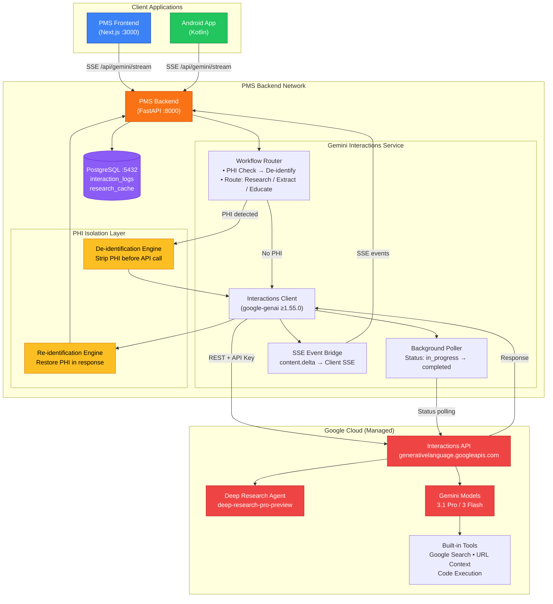

# Product Requirements Document: Gemini Interactions API Integration into Patient Management System (PMS)

**Document ID:** PRD-PMS-GEMINI-INTERACTIONS-001
**Version:** 1.0
**Date:** March 3, 2026
**Author:** Ammar (CEO, MPS Inc.)
**Status:** Draft

---

## 1. Executive Summary

The Gemini Interactions API is Google's unified interface for interacting with Gemini models and specialized agents such as the Deep Research Agent. Unlike the traditional `generateContent` API, the Interactions API was designed from the ground up for **stateful, multi-turn agentic workflows** — it manages conversation history server-side via `previous_interaction_id`, supports background execution for long-running tasks, streams granular events (thought blocks, tool calls, content deltas), and provides a single endpoint for both raw model inference and managed agent orchestration. Released in beta in late 2025, it is available through the `google-genai` Python SDK (≥1.55.0) and `@google/genai` JavaScript SDK (≥1.33.0).

Integrating the Gemini Interactions API into the PMS addresses a strategic need for a **cloud-hosted, Google-ecosystem-native agentic layer** that complements the on-premise LangGraph orchestration (Experiment 26) and the local Gemma 3 / Qwen 3.5 inference engines (Experiments 13, 20). Where LangGraph provides self-hosted graph-based orchestration with PostgreSQL checkpointing, the Interactions API offers a managed alternative with zero infrastructure overhead — Google handles state persistence, background execution, retry logic, and agent lifecycle. This is especially valuable for PMS workflows that benefit from Google's built-in tools: Deep Research for evidence-based clinical protocol research, Google Search grounding for drug interaction lookups, and URL context retrieval for pulling guidelines from medical references.

The integration adds a new `GeminiInteractionsService` to the PMS backend that routes qualifying workflows — clinical research queries, evidence synthesis, protocol comparison, and patient education content generation — through the Interactions API. The service manages API keys, enforces PHI isolation (no raw PHI sent to Google's API without de-identification), maintains interaction chains for multi-turn clinical conversations, and streams progress events to the Next.js frontend and Android app via SSE.

---

## 2. Problem Statement

The current PMS has multiple AI capabilities, but several clinical workflow gaps remain that are uniquely suited to a managed, cloud-hosted agentic API:

- **No evidence-based research automation:** When a clinician needs to research the latest treatment guidelines for a rare condition, compare drug efficacy across studies, or synthesize clinical trial data, they must manually search PubMed, UpToDate, or Sanford Guide. There is no automated multi-step research agent that can plan a search strategy, execute it across multiple sources, and produce a cited, synthesized report.
- **No managed agentic infrastructure for non-critical workflows:** The LangGraph orchestration layer (Experiment 26) requires self-hosted infrastructure, PostgreSQL checkpointing, and operational maintenance. For workflows that don't involve PHI directly — clinical research, protocol comparison, patient education — a managed API eliminates infrastructure overhead entirely.
- **No Google Search grounding for clinical lookups:** Existing PMS AI features (Gemma 3, Qwen 3.5) run on-premise without internet access. Drug recalls, FDA safety alerts, and treatment guideline updates require real-time web access that only a cloud API with search grounding can provide.
- **Limited multi-turn conversation state management:** The PMS backend currently manages conversation history client-side, passing full message arrays with each request. This wastes tokens, increases latency, and risks context window overflow for long clinical conversations. Server-side state management via `previous_interaction_id` eliminates these issues.
- **No structured output enforcement for clinical data extraction:** While the on-premise models support JSON output, the Interactions API provides native Pydantic-compatible JSON Schema enforcement via `response_format`, ensuring structured clinical data extraction (ICD-10 codes, medication lists, vital sign summaries) with guaranteed schema compliance.

---

## 3. Proposed Solution

Build a **Gemini Interactions Service** in the PMS backend that acts as a managed complement to the self-hosted LangGraph orchestration layer. The service routes non-PHI and de-identified workflows through Google's Interactions API, leveraging the Deep Research Agent for clinical evidence synthesis and Gemini models for structured extraction, patient education, and protocol comparison.

### 3.1 Architecture Overview

### 3.2 Deployment Model

| Aspect | Decision |
|--------|----------|
| **Hosting** | Google Cloud managed — no self-hosted infrastructure for the API itself |
| **PMS Service** | `GeminiInteractionsService` runs inside the existing FastAPI backend (no new Docker container) |
| **Authentication** | Gemini API key stored in environment variable (`GEMINI_API_KEY`), rotated via secrets manager |
| **PHI Isolation** | All requests pass through de-identification layer before reaching Google's API. Raw PHI never leaves the PMS network boundary |
| **HIPAA** | Google Cloud with BAA covers Vertex AI and enterprise Gemini API. For AI Studio free tier: no PHI, no BAA. Production must use Vertex AI endpoint with BAA |
| **Data Retention** | `store=False` for any interaction containing de-identified clinical data. `store=True` only for non-clinical research interactions to enable `previous_interaction_id` |
| **Network** | Outbound HTTPS only. No inbound connections from Google to PMS |

---

## 4. PMS Data Sources

| PMS API | Endpoint | Gemini Integration Use Case |
|---------|----------|-----------------------------|
| **Patient Records** | `/api/patients` | De-identified demographics for cohort research queries ("How does treatment X perform in patients with condition Y?") |
| **Encounter Records** | `/api/encounters` | De-identified encounter summaries for clinical protocol comparison |
| **Medication & Prescriptions** | `/api/prescriptions` | Drug names and dosages (no patient identifiers) for interaction checking via Google Search grounding |
| **Reporting** | `/api/reports` | Aggregate clinical metrics (no PHI) for trend analysis and research synthesis |
| **Sanford Guide** | `/api/cds/sanford` | Antimicrobial guidelines for cross-referencing with Gemini Deep Research findings |

---

## 5. Component/Module Definitions

### 5.1 GeminiInteractionsClient

**Description:** Core Python client wrapping `google-genai` SDK interactions. Manages API key rotation, request formatting, response parsing, error handling, and retry logic.

**Input:** Workflow request (prompt, model/agent selection, tools, generation_config)
**Output:** Interaction response (outputs, status, usage metadata, grounding sources)
**PMS APIs Used:** None directly — called by other components

### 5.2 ClinicalResearchAgent

**Description:** Orchestrates Deep Research Agent calls for evidence-based clinical research. Manages multi-turn research conversations using `previous_interaction_id` chains.

**Input:** Research query (condition, drug, treatment comparison parameters)
**Output:** Cited research report with grounding sources, confidence scores, and structured findings
**PMS APIs Used:** `/api/prescriptions` (drug names for context), `/api/cds/sanford` (cross-reference)

### 5.3 StructuredExtractionPipeline

**Description:** Uses Gemini models with `response_format` JSON Schema to extract structured clinical data from unstructured text — ICD-10 codes, medication lists, vital sign summaries, problem lists.

**Input:** Unstructured clinical text (de-identified)
**Output:** Pydantic-validated structured JSON conforming to FHIR-compatible schemas
**PMS APIs Used:** `/api/encounters` (source text), `/api/patients` (demographic context for extraction accuracy)

### 5.4 PatientEducationGenerator

**Description:** Generates patient-facing educational content using Gemini models with Google Search grounding for current medical information. Supports multiple reading levels and languages.

**Input:** Condition/medication name, target reading level, language
**Output:** Patient education document with citations, formatted for print or in-app display
**PMS APIs Used:** `/api/prescriptions` (medication context), `/api/encounters` (diagnosis context)

### 5.5 PHIDeIdentificationGateway

**Description:** Intercepts all outbound requests to the Interactions API. Strips PHI using regex patterns, NER, and lookup-based de-identification. Tags de-identified tokens for re-identification on response.

**Input:** Raw clinical text with PHI
**Output:** De-identified text with token map for re-hydration
**PMS APIs Used:** `/api/patients` (PHI detection patterns)

### 5.6 InteractionEventBridge

**Description:** Translates Interactions API streaming events (`content.start`, `content.delta`, `content.stop`, `interaction.complete`) into PMS SSE events for real-time frontend updates.

**Input:** Interactions API stream
**Output:** PMS-formatted SSE events consumed by Next.js and Android clients
**PMS APIs Used:** None — pure event translation layer

---

## 6. Non-Functional Requirements

### 6.1 Security and HIPAA Compliance

| Requirement | Implementation |
|-------------|----------------|
| **PHI isolation** | All requests pass through de-identification gateway. Raw PHI never sent to Google API. |
| **BAA coverage** | Production uses Vertex AI endpoint with signed Google Cloud BAA. AI Studio free tier used only for non-clinical development/testing. |
| **API key security** | Key stored in environment variable, rotated every 90 days via secrets manager. Never logged or included in error traces. |
| **Audit logging** | Every interaction logged: timestamp, user ID, de-identified prompt hash, model/agent used, token usage, grounding sources cited. Stored in `interaction_audit_log` table. |
| **Data retention** | `store=False` for clinical interactions. Google retains paid-tier data for 55 days; free-tier for 1 day. |
| **Network security** | Outbound HTTPS only. TLS 1.3. No Google → PMS inbound connections. |
| **Access control** | Role-based: only clinicians with `research_access` role can invoke Deep Research. Structured extraction limited to `clinical_ai` role. |

### 6.2 Performance

| Metric | Target |
|--------|--------|
| **Model inference latency (Flash)** | < 2 seconds for structured extraction |
| **Model inference latency (Pro)** | < 10 seconds for complex reasoning |
| **Deep Research completion** | 2–5 minutes (background mode) |
| **SSE event delivery** | < 100ms from API event to client display |
| **De-identification overhead** | < 200ms per request |
| **Throughput** | 150 RPM (Tier 1 paid), scaling to 300+ RPM with Tier 2 |

### 6.3 Infrastructure

| Resource | Specification |
|----------|---------------|
| **New containers** | None — service runs inside existing FastAPI backend |
| **Python dependency** | `google-genai>=1.55.0` added to `requirements.txt` |
| **Database** | 2 new tables in existing PostgreSQL: `interaction_log`, `research_cache` |
| **Network** | Outbound HTTPS to `generativelanguage.googleapis.com` |
| **Secrets** | `GEMINI_API_KEY` environment variable |
| **Cost** | ~$2–5 per Deep Research query, ~$0.001–0.01 per structured extraction |

---

## 7. Implementation Phases

### Phase 1: Foundation (Sprints 1–2, ~4 weeks)

- Set up `google-genai` SDK in PMS backend
- Implement `GeminiInteractionsClient` with API key management, error handling, retry logic
- Build PHI de-identification gateway with regex + NER patterns
- Create `interaction_log` and `research_cache` database tables
- Implement basic model interaction (non-streaming) with Gemini Flash
- Add configuration for model selection, thinking levels, and generation config
- Write unit tests for client, de-identification, and response parsing

### Phase 2: Core Integration (Sprints 3–4, ~4 weeks)

- Implement `ClinicalResearchAgent` with Deep Research Agent integration
- Build background polling loop for long-running research tasks
- Implement `StructuredExtractionPipeline` with Pydantic JSON Schema enforcement
- Add SSE streaming via `InteractionEventBridge` for real-time progress
- Build multi-turn conversation management with `previous_interaction_id`
- Create Next.js research results component with citation display
- Create Next.js structured extraction review panel
- Add role-based access control for research and extraction endpoints

### Phase 3: Advanced Features (Sprints 5–6, ~4 weeks)

- Implement `PatientEducationGenerator` with reading-level adjustment
- Add Google Search grounding for real-time drug recall and safety alert lookups
- Build caching layer for repeated research queries (TTL-based)
- Implement cross-referencing with Sanford Guide CDS (Experiment 11)
- Add Android app integration for mobile research access
- Build usage analytics dashboard (token costs, query patterns, model utilization)
- Performance optimization: parallel extraction pipelines, batch structured outputs

---

## 8. Success Metrics

| Metric | Target | Measurement |
|--------|--------|-------------|
| Clinical research query completion rate | > 95% | `interaction_log` status = completed / total |
| Structured extraction schema compliance | > 99% | Pydantic validation pass rate |
| Clinician time saved per research query | > 30 minutes | Pre/post time tracking |
| De-identification accuracy | > 99.5% | PHI leakage audit (manual + automated) |
| Patient education reading level accuracy | Within 1 grade level of target | Flesch-Kincaid validation |
| SSE latency (API event → client) | < 100ms p95 | Event timestamp comparison |
| Monthly API cost per clinician | < $50 | Google billing + `interaction_log` aggregation |

---

## 9. Risks and Mitigations

| Risk | Impact | Mitigation |
|------|--------|------------|
| **Beta API instability** | Schema changes break client | Pin SDK version. Wrap all API calls in adapter layer. Monitor changelog weekly. |
| **PHI leakage to Google** | HIPAA violation, fines | De-identification gateway with regex + NER + dictionary. Automated PHI detection tests in CI. Manual audit quarterly. |
| **API rate limiting** | Research queries rejected | Implement exponential backoff. Cache repeated queries. Batch non-urgent requests. Monitor RPM dashboard. |
| **Deep Research hallucination** | Incorrect clinical guidance | Always present research as "evidence summary, not clinical recommendation." Require clinician review. Display grounding source citations prominently. |
| **Google Cloud dependency** | Vendor lock-in | Interactions API adapter pattern allows swapping to OpenAI Agents SDK or direct LangGraph. Non-PHI workflows only — critical workflows stay on-premise. |
| **Cost overrun** | Unexpected API bills | Per-user daily query limits. Token usage monitoring. Alert at 80% of monthly budget. |
| **Data retention by Google** | PHI stored beyond control | `store=False` for clinical interactions. Vertex AI BAA for production. Regular data deletion verification. |

---

## 10. Dependencies

| Dependency | Version | Purpose |
|------------|---------|---------|
| `google-genai` Python SDK | ≥ 1.55.0 | Interactions API client |
| Google Gemini API key | — | Authentication |
| Google Cloud BAA | — | HIPAA compliance (production) |
| Gemini 3.1 Pro Preview | `gemini-3.1-pro-preview` | Complex reasoning and research follow-ups |
| Gemini 3 Flash Preview | `gemini-3-flash-preview` | Fast structured extraction |
| Deep Research Agent | `deep-research-pro-preview-12-2025` | Autonomous clinical research |
| PostgreSQL | Existing (≥ 14) | Interaction logs and research cache |
| PMS PHI de-identification | New module | PHI isolation before API calls |
| MCP Server (Experiment 09) | Existing | Tool definitions for agent workflows |
| Sanford Guide API (Experiment 11) | Existing | Cross-reference for drug research |

---

## 11. Comparison with Existing Experiments

### vs. LangGraph (Experiment 26)

| Aspect | LangGraph (Exp 26) | Gemini Interactions API (Exp 29) |
|--------|--------------------|---------------------------------|
| **Hosting** | Self-hosted (Docker + PostgreSQL) | Google Cloud managed |
| **State management** | PostgreSQL checkpointer | Google server-side (`previous_interaction_id`) |
| **PHI handling** | On-premise, full PHI access | De-identified only, no raw PHI |
| **Use case** | Complex multi-step clinical workflows (prior auth, med reconciliation) with HITL | Evidence research, structured extraction, patient education |
| **Model flexibility** | Any model via LangChain adapters | Gemini models only |
| **Built-in tools** | Custom via MCP | Google Search, URL Context, Code Execution, Deep Research |
| **Cost model** | Infrastructure cost (compute) | Per-API-call pricing ($2–5/research, ~$0.01/extraction) |
| **Maturity** | 1.0 GA, production-proven | Beta, schema may change |

**Complementary strategy:** LangGraph handles PHI-touching, mission-critical clinical workflows on-premise. Gemini Interactions handles non-PHI research, evidence synthesis, and structured extraction in the cloud. Both feed results into the same PMS database and frontend components.

### vs. Gemma 3 / Qwen 3.5 (Experiments 13, 20)

The on-premise models provide zero-PHI-egress inference for clinical summarization and medication analysis. The Interactions API adds capabilities those models lack: web search grounding, autonomous multi-step research, and managed state persistence — but only for de-identified or non-PHI workloads.

### vs. MCP (Experiment 09)

MCP defines the tool interface. The Interactions API can consume MCP-compatible tool definitions (though remote MCP support is limited to non-Gemini 3 models currently). When MCP + Gemini 3 remote MCP support matures, the Interactions API becomes a first-class MCP client.

---

## 12. Research Sources

### Official Documentation
- [Interactions API Reference — Google AI](https://ai.google.dev/gemini-api/docs/interactions) — Complete API specification, parameters, streaming events, and code examples
- [Deep Research Agent — Google AI](https://ai.google.dev/gemini-api/docs/deep-research) — Agent invocation, research workflow, cost estimates, and limitations
- [Gemini API Pricing — Google AI](https://ai.google.dev/gemini-api/docs/pricing) — Per-model pricing, free tier limits, and paid tier details

### Architecture & Integration
- [Building agents with ADK and Interactions API — Google Developers Blog](https://developers.googleblog.com/building-agents-with-the-adk-and-the-new-interactions-api/) — ADK integration patterns and agent composition
- [Mastering Google's Interactions API — ADK Training Hub](https://raphaelmansuy.github.io/adk_training/blog/interactions-api-deep-research/) — Unified gateway concept, mixed agent/model workflows
- [Gemini Interactions API — One Interface — Mete Atamel (Medium)](https://medium.com/google-cloud/gemini-interactions-api-one-interface-for-models-and-agents-986ffb16021c) — Single-endpoint architecture for models and agents

### Security & Compliance
- [Is Google Gemini HIPAA Compliant? — Paubox](https://www.paubox.com/blog/is-googles-ai-gemini-hipaa-compliant) — BAA requirements, Vertex AI vs AI Studio distinction
- [Gemini HIPAA Compliance Guide — GetProsper](https://www.getprosper.ai/blog/gemini-ai-hipaa-compliant-guide-baa-setup) — Step-by-step BAA setup and PHI handling requirements

### Ecosystem & Comparison
- [State of AI Agent Frameworks — Roberto Infante (Medium)](https://medium.com/@roberto.g.infante/the-state-of-ai-agent-frameworks-comparing-langgraph-openai-agent-sdk-google-adk-and-aws-d3e52a497720) — LangGraph vs ADK vs OpenAI Agents SDK comparison
- [Getting Started with Gemini Deep Research — Phil Schmid](https://www.philschmid.de/gemini-deep-research-getting-started) — Practical Deep Research implementation tutorial

---

## 13. Appendix: Related Documents

- [Gemini Interactions Setup Guide](29-GeminiInteractions-PMS-Developer-Setup-Guide.md) — Installation, configuration, and PMS integration
- [Gemini Interactions Developer Tutorial](29-GeminiInteractions-Developer-Tutorial.md) — Hands-on onboarding: build your first clinical research integration
- [LangGraph PMS Integration PRD](26-PRD-LangGraph-PMS-Integration.md) — Complementary self-hosted orchestration layer
- [MCP PMS Integration PRD](09-PRD-MCP-PMS-Integration.md) — Tool protocol used by both LangGraph and Interactions API
- [Gemma 3 PMS Integration PRD](13-PRD-Gemma3-PMS-Integration.md) — On-premise model inference (complementary)
- [Official Interactions API Docs](https://ai.google.dev/gemini-api/docs/interactions)
