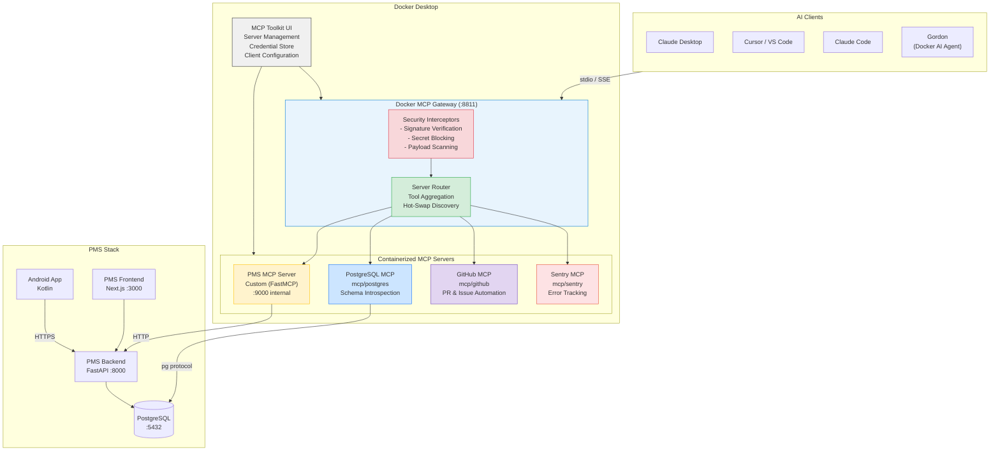

# Product Requirements Document: MCP Docker Integration into Patient Management System (PMS)

**Document ID:** PRD-PMS-MCPDOCKER-001
**Version:** 1.0
**Date:** 2026-03-04
**Author:** Ammar (CEO, MPS Inc.)
**Status:** Draft

---

## 1. Executive Summary

Docker MCP (Model Context Protocol) Toolkit is Docker's enterprise-grade infrastructure for discovering, deploying, and managing MCP servers as isolated, secure containers. It comprises three components: the **MCP Catalog** (300+ verified, signed MCP server images on Docker Hub), the **MCP Gateway** (a Docker CLI plugin and runtime proxy that sits between AI clients and containerized MCP servers), and the **MCP Toolkit** (a Docker Desktop UI for one-click server installation, credential management, and multi-client configuration). Together they eliminate the "dependency hell" of running MCP servers by packaging each server as a versioned, SBOM-attested container image with provenance verification, resource limits, and built-in secret scanning.

Integrating Docker MCP into the PMS provides a **production-hardened deployment envelope** for the PMS MCP Server built in Experiment 09. Instead of running the PMS MCP server as a bare Python process, it runs inside Docker's MCP Gateway with container-level isolation (1 CPU, 2 GB RAM limits), supply-chain verification (Docker Scout SBOM checks), and OAuth credential management handled by the Toolkit. Additionally, it allows the development team to instantly provision catalog MCP servers (GitHub, PostgreSQL, Sentry, Grafana) alongside the custom PMS MCP server — all managed through a single `docker mcp` CLI and accessible to Claude Desktop, Cursor, VS Code, and Claude Code simultaneously.

For a healthcare PMS handling PHI, Docker MCP's security interceptors — signature verification, secret-blocking payload scanning, and network-scoped container isolation — provide defense-in-depth that complements the OAuth 2.1 and audit logging already designed in Experiment 09. The Gateway's centralized credential store also eliminates the risk of API tokens being scattered across multiple `claude_desktop_config.json` files on developer machines.

---

## 2. Problem Statement

The PMS has already designed a custom MCP server (Experiment 09) using FastMCP. However, deploying and operating that server — along with additional MCP servers from the ecosystem — presents several operational challenges:

- **Complex server lifecycle management:** Each developer must manually install Python dependencies, configure virtual environments, and manage process lifecycles for the PMS MCP server. When adding ecosystem MCP servers (e.g., a PostgreSQL MCP server for schema introspection, or a GitHub MCP server for PR automation), each has its own runtime requirements (Node.js, Go, Python), creating dependency conflicts and environment drift across the team.

- **No centralized credential management:** MCP servers require API keys, database credentials, and OAuth tokens. Currently, each developer stores these in local config files (`claude_desktop_config.json`, `.cursor/mcp.json`), leading to credential sprawl, inconsistent secrets across machines, and the risk of PHI-accessing tokens being stored insecurely on developer laptops.

- **Inconsistent multi-client configuration:** The team uses Claude Desktop, Cursor, VS Code, and Claude Code. Each AI client has its own MCP configuration format. When the PMS MCP server configuration changes (new tools, updated endpoints), every developer must manually update every client config file — a fragile, error-prone process.

- **No supply-chain security for ecosystem servers:** Community MCP servers pulled from GitHub repositories have no provenance verification, no SBOM, and no resource limits. A compromised or malicious MCP server could access the Docker network, exfiltrate PHI, or consume unbounded resources.

- **Missing runtime security controls:** The current PMS MCP server runs as a regular Docker service with full network access. There are no interceptors for scanning payloads for accidentally leaked secrets, no resource quotas, and no centralized audit trail of which MCP tools were invoked across all clients.

---

## 3. Proposed Solution

Deploy the PMS MCP Server and ecosystem MCP servers through Docker's MCP Gateway, managed via the `docker mcp` CLI and Docker Desktop Toolkit UI. The Gateway acts as a single SSE/stdio proxy between AI clients and containerized MCP servers, providing container isolation, credential management, payload scanning, and centralized configuration.

### 3.1 Architecture Overview

### 3.2 Deployment Model

| Aspect | Decision |
|---|---|
| **Hosting** | Self-hosted via Docker Desktop (development) and Docker Engine (CI/production) |
| **Gateway Transport** | stdio mode for local AI clients; streaming HTTP (`:8811`) for remote/programmatic access |
| **Authentication** | Docker MCP Toolkit manages OAuth credentials centrally; PMS MCP server uses OAuth 2.1 (Experiment 09) |
| **Supply Chain** | All catalog images verified via Docker Content Trust + SBOM attestation via Docker Scout |
| **PHI Handling** | PMS MCP server runs in isolated container with no outbound internet access; PHI stays within Docker network |
| **Resource Limits** | Each MCP server container limited to 1 CPU and 2 GB RAM by Gateway defaults |
| **HIPAA** | Secret-blocking interceptor prevents PHI leakage in MCP payloads; centralized audit logging via Gateway call tracing |

---

## 4. PMS Data Sources

Docker MCP does not directly access PMS data — it acts as the **deployment and security envelope** around the PMS MCP Server (Experiment 09) which exposes PMS APIs. The following PMS APIs are accessed indirectly through the containerized PMS MCP server:

| PMS API | Accessed Via | Docker MCP Role |
|---|---|---|
| `/api/patients` | PMS MCP Server tools (`search_patients`, `get_patient`, etc.) | Container isolation, payload scanning, credential management |
| `/api/encounters` | PMS MCP Server tools (`list_encounters`, `get_encounter`, etc.) | Resource limiting (1 CPU / 2 GB), audit trail |
| `/api/prescriptions` | PMS MCP Server tools (`list_prescriptions`, `prescribe_medication`) | Secret-blocking interceptor prevents credential leakage |
| `/api/reports` | PMS MCP Server tools (`generate_report`, `get_report`) | Supply-chain verification of server image integrity |

Additionally, the PostgreSQL MCP catalog server (`mcp/postgres`) provides direct schema introspection of the PMS database for developer tooling (not clinical use).

---

## 5. Component/Module Definitions

### 5.1 Docker MCP Gateway Instance

**Description:** A `docker mcp gateway` process that runs as a Docker CLI plugin, proxying all MCP communication between AI clients and containerized MCP servers.

- **Input:** stdio or SSE connections from AI clients (Claude Desktop, Cursor, VS Code, Claude Code)
- **Output:** Aggregated tool lists and proxied tool call responses from all enabled MCP servers
- **Security:** Signature verification, secret-blocking, resource quotas per container
- **PMS APIs used:** None directly — delegates to containerized MCP servers

### 5.2 PMS MCP Server Container

**Description:** The custom FastMCP PMS MCP server (from Experiment 09) packaged as a Docker image and managed by the MCP Gateway.

- **Input:** JSON-RPC requests proxied from the MCP Gateway
- **Output:** PMS API responses (patient records, encounters, prescriptions, reports)
- **PMS APIs used:** All (`/api/patients`, `/api/encounters`, `/api/prescriptions`, `/api/reports`)
- **Technology:** Python, FastMCP, packaged as `mps/pms-mcp-server:latest`

### 5.3 Catalog MCP Server Fleet

**Description:** Pre-built, verified MCP servers from the Docker MCP Catalog, enabled via `docker mcp server enable`.

| Server | Image | Purpose |
|---|---|---|
| PostgreSQL | `mcp/postgres` | Database schema introspection, query assistance for developers |
| GitHub | `mcp/github` | PR reviews, issue management, code search within PMS repos |
| Sentry | `mcp/sentry` | Error tracking, exception analysis for PMS services |
| Grafana | `mcp/grafana` | Dashboard querying, metric analysis for PMS monitoring |

### 5.4 MCP Toolkit Configuration

**Description:** Docker Desktop UI extension that provides a visual interface for managing MCP servers, credentials, and client connections.

- **Input:** Developer interactions via Docker Desktop UI
- **Output:** Updated MCP Gateway configuration, client config files auto-synced
- **Key features:** One-click server enable/disable, centralized OAuth/API key storage, auto-configuration of Claude Desktop, Cursor, and VS Code

### 5.5 Custom Interceptor: PHI Guard

**Description:** A custom MCP Gateway interceptor that scans MCP tool call responses for patterns matching PHI (SSNs, MRNs, date-of-birth patterns) and redacts them when the requesting client is classified as "development" (not "clinical").

- **Input:** MCP tool call responses passing through the Gateway
- **Output:** Responses with PHI patterns redacted for non-clinical contexts
- **PMS APIs used:** None — operates on Gateway traffic

---

## 6. Non-Functional Requirements

### 6.1 Security and HIPAA Compliance

| Requirement | Implementation |
|---|---|
| **Container Isolation** | Each MCP server runs in its own container with no shared filesystem; PMS MCP server has no outbound internet access |
| **Supply Chain Verification** | All catalog images verified via Docker Content Trust; SBOM attestation checked on pull |
| **Secret Management** | All API keys and OAuth tokens stored in Docker Desktop credential store; never written to client config files |
| **Payload Scanning** | Secret-blocking interceptor scans all inbound/outbound MCP payloads for leaked credentials |
| **PHI Redaction** | Custom PHI Guard interceptor redacts patient identifiers in development-context tool responses |
| **Audit Logging** | Gateway call tracing logs every tool invocation with timestamp, client identity, server, and tool name |
| **Access Control** | MCP server enable/disable controlled per-developer; production deployments use policy-based tool restrictions |
| **Encryption** | All Gateway-to-server communication over Docker's internal network; external connections use TLS |

### 6.2 Performance

| Metric | Target |
|---|---|
| Gateway proxy latency overhead | < 15ms per tool call |
| MCP server cold start (container spin-up) | < 3 seconds |
| Concurrent tool calls supported | 50+ across all servers |
| Memory per MCP server container | <= 2 GB (Gateway enforced) |
| CPU per MCP server container | <= 1 core (Gateway enforced) |

### 6.3 Infrastructure

| Requirement | Specification |
|---|---|
| Docker Desktop version | >= 4.42.0 (MCP Toolkit support) |
| Docker Engine (CI/prod) | >= 27.0 with `docker mcp` CLI plugin |
| Host OS | macOS 14+, Windows 11+, Ubuntu 22.04+ |
| Host RAM | >= 8 GB (4 GB for Gateway + MCP server fleet) |
| Disk space | ~500 MB for catalog server images |

---

## 7. Implementation Phases

### Phase 1: Foundation (Sprints 1-2)
- Install Docker MCP CLI plugin across the development team
- Package PMS MCP Server (Experiment 09) as a Docker image with Dockerfile
- Register PMS MCP Server with the local MCP Gateway
- Enable 2-3 catalog servers (PostgreSQL, GitHub)
- Connect Claude Desktop and Cursor to the MCP Gateway
- Verify end-to-end: AI client -> Gateway -> PMS MCP Server -> PMS Backend

### Phase 2: Security Hardening (Sprints 3-4)
- Configure secret-blocking interceptor for all MCP servers
- Build and deploy custom PHI Guard interceptor
- Set up centralized credential management via Docker Desktop Toolkit
- Implement Gateway audit logging with PostgreSQL storage
- Define and enforce per-server network policies (no outbound for PMS MCP server)
- Security review and penetration testing of Gateway configuration

### Phase 3: Production & Scaling (Sprints 5-6)
- Deploy MCP Gateway in CI/CD pipeline for automated testing against MCP tools
- Add Sentry and Grafana catalog servers for observability
- Build team-wide MCP configuration sharing via `docker mcp config` export/import
- Implement policy-based tool restrictions for production environments
- Document runbooks for MCP server fleet operations
- Performance benchmarking and optimization

---

## 8. Success Metrics

| Metric | Target | Measurement Method |
|---|---|---|
| MCP server setup time (new developer) | < 5 minutes (from > 30 minutes) | Time from `docker mcp server enable` to first tool call |
| Credential sprawl incidents | 0 per quarter | Audit of developer machines for plaintext API keys |
| MCP server availability | 99.5% during business hours | Gateway health check monitoring |
| Security interceptor coverage | 100% of MCP traffic scanned | Gateway audit log analysis |
| Developer adoption | 100% of team using MCP Gateway | Docker Desktop telemetry |
| Supply chain verification | 100% of catalog images verified | Docker Scout scan reports |
| Cross-client config consistency | 0 config drift incidents/month | Automated config comparison checks |

---

## 9. Risks and Mitigations

| Risk | Impact | Mitigation |
|---|---|---|
| Docker Desktop licensing cost for commercial use | Medium — requires paid subscription for enterprises > 250 employees | MPS Inc. is well under threshold; Docker Personal/Pro sufficient. For CI, use Docker Engine (free) with CLI plugin. |
| Gateway becomes single point of failure | High — all AI-MCP communication routes through Gateway | Gateway runs as lightweight CLI plugin process; auto-restarts on failure. Production fallback: direct MCP server connections. |
| Container resource limits degrade PMS MCP server performance | Medium — 1 CPU / 2 GB may be insufficient for complex queries | Monitor with Grafana MCP server; adjust limits via `docker mcp config` if needed. PMS MCP server is a thin proxy, not compute-heavy. |
| Custom PHI Guard interceptor false positives | Low — may redact non-PHI data matching patterns | Implement allowlist for known safe patterns; log redactions for review. |
| Docker MCP Toolkit maturity — still evolving rapidly | Medium — API and CLI may change between Docker Desktop versions | Pin Docker Desktop version; test upgrades in staging before team rollout. |
| Developer resistance to Docker Desktop requirement | Low — team already uses Docker for PMS stack | Provide CLI-only workflow for developers who prefer terminal over GUI. |

---

## 10. Dependencies

| Dependency | Type | Version/Details |
|---|---|---|
| Docker Desktop | Infrastructure | >= 4.42.0 with MCP Toolkit |
| Docker MCP CLI Plugin | Tool | `docker mcp` (bundled with Docker Desktop 4.42+) |
| PMS MCP Server (Experiment 09) | Internal | FastMCP-based server, to be containerized |
| Docker MCP Catalog | External | `hub.docker.com/u/mcp` — verified server images |
| Docker Scout | External | SBOM and supply-chain verification |
| PMS Backend (FastAPI) | Internal | Running on :8000 within Docker Compose |
| PostgreSQL | Internal | Running on :5432 within Docker Compose |
| OAuth 2.1 Authorization (Experiment 09) | Internal | Token issuance for MCP clients |

---

## 11. Comparison with Existing Experiments

### vs. Experiment 09 — MCP (Universal AI Integration Protocol)

Experiment 09 designed the **PMS MCP Server itself** — the FastMCP application that wraps PMS APIs into MCP tools, resources, and prompts. Experiment 29 (this document) addresses the **deployment, security, and operations layer** around that server. They are complementary:

| Aspect | Experiment 09 (MCP) | Experiment 29 (MCP Docker) |
|---|---|---|
| **Focus** | Application logic — what tools/resources to expose | Infrastructure — how to deploy, secure, and manage MCP servers |
| **Technology** | FastMCP, Python `mcp` SDK, OAuth 2.1 | Docker MCP Gateway, Toolkit, Catalog |
| **Security** | OAuth 2.1 tokens, audit logging in PostgreSQL | Container isolation, SBOM verification, secret scanning, PHI Guard |
| **Server scope** | Single custom PMS MCP server | PMS server + ecosystem catalog servers (PostgreSQL, GitHub, Sentry, Grafana) |
| **Client config** | Manual per-client JSON configuration | Centralized via Toolkit, auto-synced to all AI clients |
| **Credential management** | Developer-managed API keys | Centralized Docker credential store |

### vs. Experiment 26 — LangGraph (Stateful Agent Orchestration)

LangGraph handles multi-step agent workflow orchestration with checkpointing. Docker MCP provides the infrastructure layer that LangGraph agents would connect through to access PMS tools. A LangGraph agent could use the MCP Gateway as its tool provider, benefiting from Gateway security interceptors and centralized credentials.

---

## 12. Research Sources

### Official Documentation
- [Docker MCP Catalog and Toolkit Documentation](https://docs.docker.com/ai/mcp-catalog-and-toolkit/) — Primary reference for MCP Catalog, Toolkit, and Gateway features
- [Docker MCP Gateway Documentation](https://docs.docker.com/ai/mcp-catalog-and-toolkit/mcp-gateway/) — Gateway architecture, interceptors, and configuration
- [Docker MCP CLI Reference](https://docs.docker.com/reference/cli/docker/mcp/) — Complete CLI command reference

### Architecture & Security
- [Docker MCP Gateway: Secure Infrastructure for Agentic AI](https://www.docker.com/blog/docker-mcp-gateway-secure-infrastructure-for-agentic-ai/) — Gateway security architecture, interceptors, and enterprise features
- [MCP Security: Risks, Challenges, and How to Mitigate](https://www.docker.com/blog/mcp-security-explained/) — MCP threat model and Docker's mitigation approach
- [Docker MCP Gateway Interceptors](https://dasroot.net/posts/2026/01/docker-mcp-gateway-interceptors-security/) — Deep dive into Gateway interceptor configuration

### Ecosystem & Integration
- [Docker MCP Gateway GitHub Repository](https://github.com/docker/mcp-gateway) — Open-source Gateway CLI plugin source code
- [Add MCP Servers to Claude Code with MCP Toolkit](https://www.docker.com/blog/add-mcp-servers-to-claude-code-with-mcp-toolkit/) — Claude Code integration walkthrough
- [Docker MCP Catalog on Docker Hub](https://hub.docker.com/u/mcp) — Catalog of 300+ verified MCP server images

### Healthcare & Compliance
- [HIPAA Compliance for Containers and the Cloud](https://www.sysdig.com/learn-cloud-native/a-guide-to-hipaa-compliance-for-containers-and-the-cloud) — Container security requirements for HIPAA
- [Build and Deploy HIPAA Compliant Container Apps](https://medstack.co/learning/docker-build-how-to-build-and-deploy-hipaa-compliant-container-apps/) — Docker best practices for healthcare

---

## 13. Appendix: Related Documents

- [MCP Docker Setup Guide](29-MCPDocker-PMS-Developer-Setup-Guide.md) — Step-by-step installation and configuration
- [MCP Docker Developer Tutorial](29-MCPDocker-Developer-Tutorial.md) — Hands-on onboarding tutorial
- [PRD: MCP PMS Integration (Experiment 09)](09-PRD-MCP-PMS-Integration.md) — The MCP server this experiment containerizes
- [Docker MCP Official Docs](https://docs.docker.com/ai/mcp-catalog-and-toolkit/) — Official documentation
- [Docker MCP Gateway GitHub](https://github.com/docker/mcp-gateway) — Open-source repository
