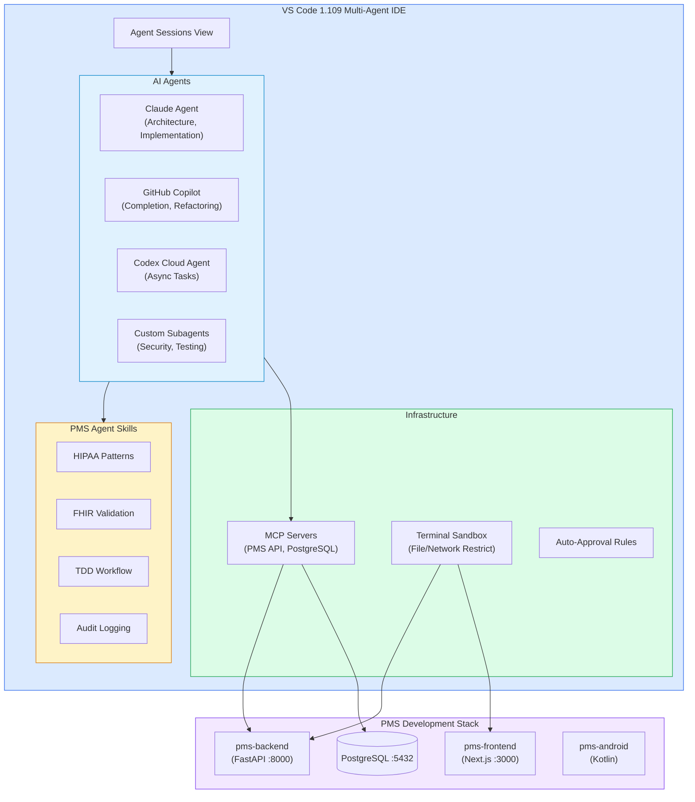

# Product Requirements Document: VS Code 1.109 Multi-Agent Integration into Patient Management System (PMS)

**Document ID:** PRD-PMS-VSCODE-MULTIAGENT-001
**Version:** 1.0
**Date:** March 3, 2026
**Author:** Ammar (CEO, MPS Inc.)
**Status:** Draft

---

## 1. Executive Summary

Visual Studio Code 1.109 (January 2026) transforms the editor from a code-writing tool into a **multi-agent development platform**. The release introduces first-class support for running Claude, Codex, and Copilot agents side-by-side, a unified Agent Sessions view for orchestrating local, background, and cloud agents from a single interface, and Agent Skills — reusable packages of domain expertise that agents invoke automatically. Combined with MCP server integration, terminal sandboxing, auto-approval rules, subagent architecture for parallel task delegation, and the `/init` workspace priming command, VS Code 1.109 represents a paradigm shift in AI-assisted development.

Integrating VS Code 1.109's multi-agent capabilities into the PMS development workflow addresses a critical productivity gap: today, PMS developers use Claude Code CLI in the terminal and Copilot in the editor as separate, disconnected tools. With 1.109, developers can run a **Claude agent for architecture and implementation**, a **Copilot agent for code completion and refactoring**, and a **Codex cloud agent for long-running async tasks** — all orchestrated from the same Agent Sessions view, with PMS-specific Agent Skills enforcing HIPAA compliance, coding standards, and testing requirements.

The integration creates a standardized multi-agent development environment where every PMS developer has the same Agent Skills (HIPAA patterns, FHIR validation, clinical data handling), the same MCP servers (PMS API, PostgreSQL, audit log), and the same workspace priming — ensuring consistent, compliant, high-quality code across the team.

---

## 2. Problem Statement

- **Fragmented AI tooling:** PMS developers currently switch between Claude Code (terminal), Copilot (editor), and manual processes. There is no unified view of what each AI assistant is doing, and no way to coordinate tasks across them.
- **No standardized AI development environment:** Each developer configures their own AI tools, prompts, and settings. This leads to inconsistent code quality, missed HIPAA requirements, and duplicated configuration effort.
- **No domain-specific AI skills:** Generic AI assistants don't know PMS conventions — FHIR resource naming, PHI handling patterns, audit logging requirements, or the three-tier requirement decomposition. Developers must re-explain context in every session.
- **No parallel task delegation:** Complex PMS tasks (e.g., "add a new API endpoint with tests, frontend component, and documentation") require sequential work. There is no way to delegate sub-tasks to parallel agents.
- **No terminal safety for AI agents:** When Claude or Copilot runs terminal commands, there are no guardrails preventing access to production databases, sensitive files, or external networks — a significant risk in a healthcare codebase.
- **Manual MCP server management:** PMS MCP servers (Experiment 9) must be configured manually in each developer's environment, leading to inconsistency and onboarding friction.

---

## 3. Proposed Solution

Standardize the PMS development environment on **VS Code 1.109's multi-agent platform** with custom Agent Skills, MCP server configurations, workspace priming, and terminal sandboxing tailored for healthcare software development.

### 3.1 Architecture Overview

### 3.2 Deployment Model

- **Local IDE:** VS Code 1.109+ installed on each developer's machine with the standardized PMS workspace configuration
- **Shared configuration:** Agent Skills, MCP server definitions, workspace instructions, and auto-approval rules stored in the repo (`.github/skills/`, `.vscode/mcp.json`, `.github/copilot-instructions.md`)
- **Cloud agents:** Codex runs in GitHub's cloud for long-running tasks — no local compute required
- **Terminal sandbox:** Restricts agent-executed commands to the workspace directory, blocking access to production systems and sensitive files
- **No additional infrastructure:** Everything runs within VS Code and existing PMS services

---

## 4. PMS Data Sources

| PMS Resource | Multi-Agent Integration | Use Case |
|-------------|------------------------|----------|
| PMS Backend APIs | MCP Server tools | Agents query/test APIs directly during development |
| PostgreSQL | MCP Server resource | Agents read schema, check migrations, verify data |
| FHIR Resources | Agent Skill validation | FHIR Validation skill checks resource conformance |
| Audit Logs | Agent Skill enforcement | Audit Logging skill ensures log calls in new code |
| Test Suites | Agent Skill TDD | TDD Workflow skill enforces test-first development |

---

## 5. Component/Module Definitions

### 5.1 PMS Agent Skills Package

**Description:** A `.github/skills/` directory containing reusable Agent Skills for PMS development.

**Skills included:**
- `hipaa-patterns/` — Enforces PHI handling, encryption, audit logging in new code
- `fhir-validation/` — Validates FHIR R4 resource definitions and mapper code
- `tdd-workflow/` — Enforces test-first development with coverage requirements
- `clinical-data/` — Patterns for safe clinical data handling across all PMS APIs
- `pms-architecture/` — Enforces the three-tier requirement decomposition and ADR conventions

**Input:** Automatically loaded by agents when relevant to the current task.
**Output:** Agent behavior modified to follow PMS conventions.

### 5.2 PMS MCP Server Configuration

**Description:** `.vscode/mcp.json` defining MCP servers that give agents access to PMS services.

**Servers:**
- `pms-api` — Read-only access to PMS backend API endpoints
- `pms-db` — Read-only access to PostgreSQL schema and sample data
- `pms-docs` — Access to `docs/` directory for context and requirements

**Input:** Agent tool calls during development sessions.
**Output:** Real PMS data context for informed code generation.

### 5.3 Workspace Priming Configuration

**Description:** `.github/copilot-instructions.md` and `/init` configuration for workspace priming.

**Content:** PMS coding conventions, HIPAA requirements, tech stack details, file naming patterns, and cross-references to experiment docs.

**Input:** Automatically loaded on `/init` or session start.
**Output:** All agents share consistent PMS context.

### 5.4 Terminal Sandbox Configuration

**Description:** VS Code settings restricting agent terminal access to safe operations.

**Rules:**
- File access limited to workspace directories only
- Network access limited to localhost (development services) and trusted domains (npm, PyPI)
- Blocked: production database connections, external API calls, SSH

### 5.5 Auto-Approval Rules

**Description:** Rules that skip confirmation for safe, frequent agent operations.

**Auto-approved:** File reads, test execution, linting, type checking, documentation generation.
**Requires approval:** File writes outside workspace, package installation, git operations, database mutations.

### 5.6 Multi-Agent Workflow Templates

**Description:** Pre-configured workflow templates for common PMS development tasks.

**Templates:**
- `new-api-endpoint` — Claude: implementation → Copilot: tests → Codex: documentation
- `bug-investigation` — Claude: root cause analysis → Copilot: fix → Claude: verification
- `fhir-resource` — Claude: FHIR mapper → FHIR skill: validation → Copilot: tests

---

## 6. Non-Functional Requirements

### 6.1 Security and HIPAA Compliance

- **Terminal sandboxing mandatory:** All PMS workspaces must have terminal sandboxing enabled to prevent agents from accessing production systems
- **No PHI in agent prompts:** Workspace instructions must never include real patient data
- **MCP servers read-only:** MCP server connections to PMS backend and database are read-only in development environments
- **Audit of agent actions:** Enable VS Code's agent action logging for compliance review
- **Secret scanning:** Auto-approval rules must block commands that could expose API keys or credentials
- **Network restrictions:** Agents cannot make outbound HTTP calls except to localhost and whitelisted package registries

### 6.2 Performance

| Metric | Target |
|--------|--------|
| Agent response time (local) | < 2 seconds for code suggestions |
| Subagent delegation latency | < 500ms to spawn parallel worker |
| Workspace priming (/init) | < 30 seconds for full PMS workspace |
| MCP server tool response | < 1 second for API/DB queries |
| Cloud agent task pickup | < 10 seconds (Codex) |

### 6.3 Infrastructure

- **VS Code 1.109+** on all developer machines (auto-updated)
- **GitHub Copilot Business** subscription for all team members
- **Anthropic API key** for Claude Agent support
- **GitHub Codex** access for cloud agent tasks
- **No additional servers** — all configuration is in-repo

---

## 7. Implementation Phases

### Phase 1: Foundation — Workspace Standardization (Sprint 1)

- Create `.github/copilot-instructions.md` with PMS conventions
- Create `.vscode/mcp.json` with PMS MCP server definitions
- Configure terminal sandboxing rules for healthcare development
- Set up auto-approval rules for safe operations
- Document team setup instructions

### Phase 2: Agent Skills & Multi-Agent Workflows (Sprints 2-3)

- Build 5 PMS Agent Skills (HIPAA, FHIR, TDD, Clinical Data, Architecture)
- Create multi-agent workflow templates for common tasks
- Configure subagent architecture for parallel task delegation
- Integrate Claude Agent SDK with PMS-specific system prompts
- Team training on multi-agent workflows

### Phase 3: Advanced Integration & Optimization (Sprints 4-5)

- Build custom MCP Apps for PMS-specific UI in chat (requirement status, test coverage)
- Optimize workspace priming for large PMS monorepo
- Create organization-wide instruction inheritance
- Build agent performance dashboards (which agents produce the most accepted code)
- Codex cloud agent templates for async documentation and refactoring tasks

---

## 8. Success Metrics

| Metric | Target | Measurement Method |
|--------|--------|--------------------|
| Agent skill adoption | 100% of PMS developers | Workspace config audit |
| Code quality improvement | 20% fewer PR review comments | GitHub PR analytics |
| HIPAA compliance rate | Zero HIPAA-related code review flags | Security scan results |
| Developer productivity | 30% faster feature delivery | Sprint velocity tracking |
| Multi-agent session usage | 80% of developers use weekly | VS Code telemetry |
| Terminal sandbox violations | < 5 per month | Sandbox log analysis |

---

## 9. Risks and Mitigations

| Risk | Impact | Mitigation |
|------|--------|------------|
| Agent generates non-compliant code | HIPAA violation in codebase | HIPAA Agent Skill enforces patterns; CI/CD security gates |
| Terminal sandbox bypass | Unauthorized system access | Sandbox restrictions + dev container fallback |
| Over-reliance on AI agents | Reduced developer understanding | Code review requirements; agent action audit |
| Inconsistent agent behavior | Unpredictable code quality | Standardized skills + workspace priming |
| Copilot subscription cost | Budget impact | Measure ROI via productivity metrics; justify with velocity gains |
| Agent context window overflow | Degraded suggestions | Subagent architecture distributes context load |

---

## 10. Dependencies

| Dependency | Version | Purpose |
|------------|---------|---------|
| VS Code | >= 1.109 | Multi-agent platform, Agent Skills, terminal sandbox |
| GitHub Copilot Business | Current | Base AI code assistance |
| Anthropic API | Current | Claude Agent support |
| GitHub Codex | Current | Cloud agent for async tasks |
| PMS MCP Server (Exp 9) | Current | Provides PMS API and DB tools to agents |
| Node.js | >= 20 | MCP server runtime |
| Python | >= 3.11 | Backend development |

---

## 11. Comparison with Existing Experiments

| Aspect | VS Code Multi-Agent (Exp 31) | Claude Code (Exp 27) | Knowledge Work Plugins (Exp 24) | Superpowers (Exp 19) |
|--------|------------------------------|---------------------|-------------------------------|---------------------|
| **Platform** | VS Code IDE | CLI terminal | Claude Code plugins | Claude Code plugins |
| **Multi-agent** | Claude + Copilot + Codex | Subagents | No | No |
| **Agent Skills** | .github/skills/ (GA) | .claude/skills/ | Plugin skills | Plugin workflows |
| **MCP Integration** | Native (.vscode/mcp.json) | Native | MCP connections | No |
| **Terminal Sandbox** | Built-in (macOS/Linux) | Bash sandbox | No | No |
| **Cloud Agents** | Codex (async) | No | No | No |
| **Workspace Priming** | /init command | CLAUDE.md | Plugin init | No |
| **GUI** | Full IDE with panels | Terminal only | Terminal only | Terminal only |

**Complementary roles:**
- **VS Code 1.109** is the primary IDE for PMS development with multi-agent orchestration, visual tools, and integrated debugging
- **Claude Code (Exp 27)** remains the CLI tool for headless/CI automation, worktree-based parallel work, and terminal-first workflows
- **Agent Skills (VS Code)** and **Knowledge Work Plugins (Exp 24)** serve similar purposes — standardize the PMS workspace configuration to work in both environments
- Together, they provide a **unified AI-assisted development experience** whether working in the IDE or the terminal

---

## 12. Research Sources

### Official Documentation
- [VS Code 1.109 Release Notes](https://code.visualstudio.com/updates/v1_109) — Full changelog with multi-agent features
- [Multi-Agent Development Blog Post](https://code.visualstudio.com/blogs/2026/02/05/multi-agent-development) — Official announcement of VS Code as multi-agent platform
- [Using Agents in VS Code](https://code.visualstudio.com/docs/copilot/agents/overview) — Agent architecture documentation

### Analysis & Coverage
- [VS Code 1.109 Multi-Agent Platform (Visual Studio Magazine)](https://visualstudiomagazine.com/articles/2026/02/05/vs-code-1-109-deemed-multi-agent-development-platform.aspx) — In-depth analysis of multi-agent features
- [Hands-On Multi-Agent Orchestration (Visual Studio Magazine)](https://visualstudiomagazine.com/articles/2026/02/09/hands-on-with-new-multi-agent-orchestration-in-vs-code.aspx) — Practical walkthrough of agent orchestration
- [Workspace Priming Deep Dive (Visual Studio Magazine)](https://visualstudiomagazine.com/articles/2026/02/05/beyond-the-magic-word-testing-vs-code-v1-109s-new-workspace-priming.aspx) — Testing the /init command

### Security & MCP
- [VS Code Copilot Security](https://code.visualstudio.com/docs/copilot/security) — Terminal sandboxing and safety documentation
- [MCP Servers in VS Code](https://code.visualstudio.com/docs/copilot/customization/mcp-servers) — MCP server configuration guide
- [GitHub Copilot v1.109 Changelog](https://github.blog/changelog/2026-02-04-github-copilot-in-visual-studio-code-v1-109-january-release/) — Copilot-specific release details

---

## 13. Appendix: Related Documents

- [VS Code Multi-Agent Setup Guide](31-VSCodeMultiAgent-PMS-Developer-Setup-Guide.md)
- [VS Code Multi-Agent Developer Tutorial](31-VSCodeMultiAgent-Developer-Tutorial.md)
- [Claude Code Developer Tutorial (Experiment 27)](27-ClaudeCode-Developer-Tutorial.md)
- [Knowledge Work Plugins PRD (Experiment 24)](24-PRD-KnowledgeWorkPlugins-PMS-Integration.md)
- [MCP PRD (Experiment 9)](09-PRD-MCP-PMS-Integration.md)
