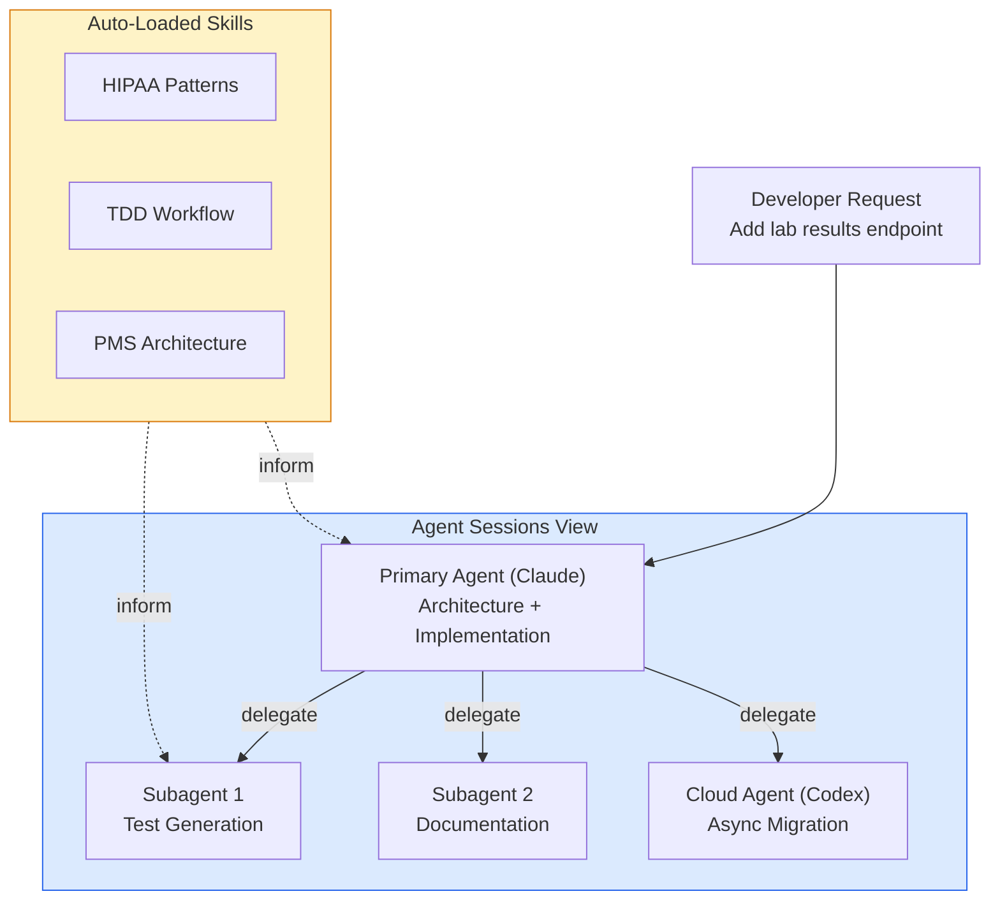
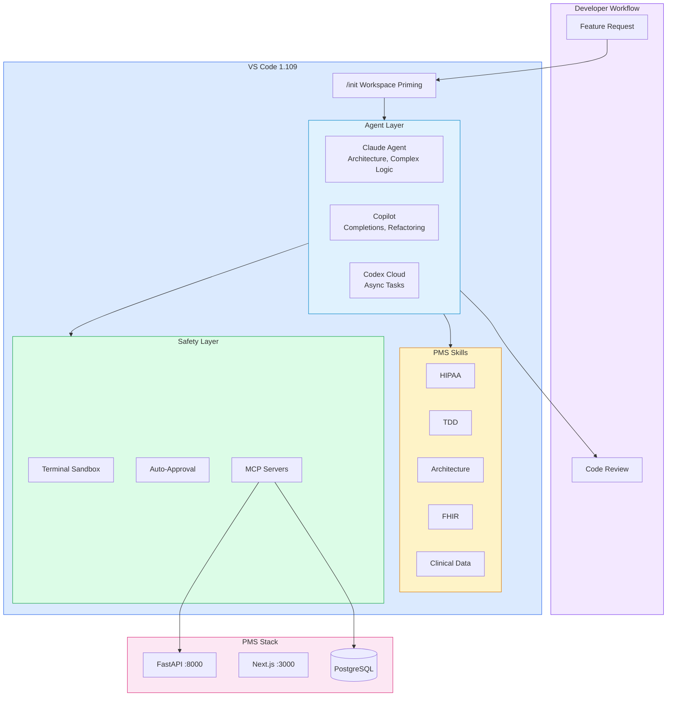

# VS Code 1.109 Multi-Agent Developer Onboarding Tutorial

**Welcome to the MPS PMS Multi-Agent Development Team**

This tutorial will take you from zero to mastering VS Code 1.109's multi-agent capabilities for PMS development. By the end, you will understand how to orchestrate Claude, Copilot, and Codex agents together, create custom Agent Skills, and use multi-agent workflows to build PMS features faster and with higher quality.

**Document ID:** PMS-EXP-VSCODE-MULTIAGENT-002
**Version:** 1.0
**Date:** March 3, 2026
**Applies To:** PMS project (all platforms)
**Prerequisite:** [VS Code Multi-Agent Setup Guide](31-VSCodeMultiAgent-PMS-Developer-Setup-Guide.md)
**Estimated time:** 2-3 hours
**Difficulty:** Beginner-friendly

---

## What You Will Learn

1. What VS Code 1.109's multi-agent platform is and why PMS uses it
2. How the Agent Sessions view orchestrates multiple AI agents
3. How Agent Skills encode PMS domain expertise for automatic application
4. How the `/init` workspace priming command bootstraps PMS context
5. How subagents delegate parallel tasks for complex features
6. How terminal sandboxing protects healthcare codebases
7. How to build a PMS feature using the multi-agent workflow
8. How MCP servers give agents live access to PMS data
9. How auto-approval rules balance speed and safety
10. How VS Code multi-agent complements Claude Code CLI workflows

---

## Part 1: Understanding Multi-Agent Development (15 min read)

### 1.1 What Problem Does Multi-Agent Development Solve?

PMS development involves complex tasks that touch multiple layers:

> *"Add a new lab results API endpoint with HIPAA audit logging, unit tests, integration tests, a frontend component, and documentation."*

Today, a developer does this sequentially — write the endpoint, then the tests, then the component, then the docs. Each step requires context-switching and re-explaining the requirements to the AI assistant.

With VS Code 1.109's multi-agent platform:
- **Claude** handles architecture decisions and implementation
- **Copilot** generates inline completions and refactors code
- **Codex** runs async documentation generation in the cloud
- **Subagents** handle tests and validation in parallel

All agents share the same PMS context via workspace priming and Agent Skills, ensuring consistent, HIPAA-compliant code regardless of which agent writes it.

### 1.2 How Multi-Agent Development Works



### 1.3 How VS Code Multi-Agent Fits with Other PMS Technologies

| Feature | VS Code Multi-Agent | Claude Code CLI | Knowledge Work Plugins |
|---------|--------------------|-----------------|-----------------------|
| Multi-agent orchestration | Claude + Copilot + Codex | Subagents only | No |
| Visual IDE | Full VS Code GUI | Terminal only | Terminal only |
| Agent Skills | .github/skills/ | .claude/skills/ | Plugin skills |
| Terminal sandbox | Built-in | Bash sandbox | No |
| Cloud agents | Codex (async) | No | No |
| MCP integration | .vscode/mcp.json | mcp_servers.json | MCP connections |
| Best for | IDE-centric development | CLI automation, CI/CD | Claude Code customization |

### 1.4 Key Vocabulary

| Term | Meaning |
|------|---------|
| Agent Sessions View | Unified panel showing all running agent sessions (local, background, cloud) |
| Agent Skills | Reusable folders of instructions that agents load automatically when relevant |
| Workspace Priming | The `/init` command that indexes your project and generates context for all agents |
| Subagent | A parallel worker spawned by the primary agent for delegated tasks |
| Terminal Sandbox | Security feature restricting agent terminal commands to safe paths and domains |
| Auto-Approval Rules | Rules that skip confirmation for safe, frequent agent operations |
| MCP Server | Model Context Protocol server providing tools and data to agents |
| Cloud Agent | An agent (Codex) that runs in GitHub's cloud for async, long-running tasks |
| Steer with Message | Redirecting an agent mid-task when it's heading in the wrong direction |
| Add to Queue | Queuing a new request while the agent is still processing the current one |
| Context Window Popup | New UI showing token usage across messages, files, and instructions |

### 1.5 Our Multi-Agent Architecture



---

## Part 2: Environment Verification (15 min)

### 2.1 Checklist

1. **VS Code version:**
   - Help > About > Verify version >= 1.109.0

2. **GitHub Copilot active:**
   - Click the Copilot icon in the status bar — should show "Ready"

3. **Agent Skills detected:**
   - Open Chat > type `/init` > verify it mentions 5 PMS skills

4. **MCP servers connected:**
   - Open Command Palette > "MCP: List Servers" > verify pms-api and pms-docs

5. **Terminal sandbox active:**
   - Open Terminal > run `echo $SANDBOX_ENABLED` or check Settings for sandbox config

### 2.2 Quick Test

1. Open VS Code Chat (Cmd+Shift+I)
2. Type: "Explain the PMS backend architecture"
3. The agent should reference `.github/copilot-instructions.md` context
4. It should mention FastAPI, port 8000, PostgreSQL, and the three-tier requirement decomposition

---

## Part 3: Build Your First Multi-Agent Feature (45 min)

### 3.1 What We Are Building

A **Lab Results API Endpoint** using the full multi-agent workflow:
1. Primary agent (Claude) designs the architecture and writes the endpoint
2. Subagent generates unit tests
3. Another subagent writes the frontend component
4. All code follows HIPAA patterns (auto-loaded skill)

### 3.2 Step 1: Prime the Workspace

In VS Code Chat:

```
/init
```

Wait for the agent to index the workspace. It should report:
- Found `.github/copilot-instructions.md`
- Detected 5 Agent Skills
- Connected to 2 MCP servers

### 3.3 Step 2: Start the Feature Request

In VS Code Chat (using Claude agent if available):

```
Create a new lab results API endpoint for the PMS. Requirements:
1. GET /api/lab-results/{patient_id} — returns all lab results for a patient
2. POST /api/lab-results — creates a new lab result
3. Each lab result has: test_name, value, unit, reference_range, abnormal_flag, ordered_by, result_date
4. HIPAA audit logging for all access
5. Pydantic request/response models
6. Put it in app/api/routes/lab_results.py
```

**Observe:** The agent should automatically load the `hipaa-patterns`, `pms-architecture`, and `clinical-data` skills.

### 3.4 Step 3: Review the Generated Code

The agent should produce code that includes:

```python
# Expected patterns from HIPAA Patterns skill:
@require_auth
@audit_log(resource="lab_result")
async def get_lab_results(patient_id: str, ...):
    ...

# Expected patterns from PMS Architecture skill:
class LabResultCreate(BaseModel):
    test_name: str
    value: float
    unit: str
    reference_range: str | None = None
    abnormal_flag: bool = False
    ordered_by: str
    result_date: datetime
```

### 3.5 Step 4: Delegate Test Generation

In the same Chat session:

```
Now delegate test generation to a subagent. Create unit tests for both
endpoints following the TDD Workflow skill patterns. Put tests in
tests/api/test_lab_results.py
```

The primary agent should spawn a subagent that generates tests like:

```python
def test_get_lab_results_with_valid_patient_returns_200():
    ...

def test_get_lab_results_with_unauthorized_user_returns_403():
    ...

def test_create_lab_result_with_valid_data_returns_201():
    ...

def test_create_lab_result_audit_log_created():
    ...
```

### 3.6 Step 5: Delegate Frontend Component

```
Delegate to another subagent: Create a React component at
src/components/lab-results/LabResultsTable.tsx that displays lab results
for a patient. Use the existing PMS component patterns.
```

---

## Part 4: Evaluating Strengths and Weaknesses (15 min)

### 4.1 Strengths

- **Unified agent orchestration:** One interface for Claude, Copilot, and Codex — no context-switching between tools
- **Agent Skills automate domain expertise:** HIPAA patterns, TDD, and architecture conventions applied automatically
- **Subagent parallelism:** Complex tasks broken into parallel subtasks — faster completion
- **Terminal sandboxing:** First-class security for healthcare codebases — agents can't access production
- **MCP integration:** Agents have live access to PMS API and docs — better context, better code
- **Workspace priming:** `/init` gives every agent the full PMS context on first use
- **Cloud agents:** Codex handles long-running async tasks without blocking local development
- **Auto-approval:** Common safe operations run without interruption

### 4.2 Weaknesses

- **Copilot Business subscription required:** $19/user/month adds up for larger teams
- **Claude agent requires separate API key:** Additional cost and configuration
- **Terminal sandbox macOS/Linux only:** Windows developers don't get sandbox protection
- **Agent Skills are new (GA in 1.109):** Limited community examples and best practices
- **Context window limits:** Even with subagents, very large PMS tasks may exceed context
- **Non-deterministic:** Different agents may produce different code for the same request
- **Learning curve:** Multi-agent workflows require new mental models — delegation, steering, queuing

### 4.3 When to Use VS Code Multi-Agent vs Alternatives

| Scenario | Best Choice | Why |
|----------|-------------|-----|
| IDE-based feature development | **VS Code Multi-Agent** | Full GUI, debugging, multi-agent |
| Terminal automation / CI/CD | **Claude Code CLI** | Headless, scriptable, worktrees |
| Quick code completions | **Copilot inline** | Fastest for single-line suggestions |
| Complex architecture design | **Claude Agent in VS Code** | Best reasoning with visual context |
| Long-running async refactoring | **Codex Cloud Agent** | Runs in background, no local compute |
| Pair programming sessions | **VS Code + Claude Chat** | Interactive, visual, real-time |

### 4.4 HIPAA / Healthcare Considerations

1. **Terminal sandbox is mandatory** for PMS development — agents must not access production systems
2. **Agent Skills enforce compliance** — HIPAA patterns are applied automatically, not optionally
3. **MCP servers are read-only** — agents can query but not modify PMS data
4. **Auto-approval denies dangerous operations** — `git push`, `DROP TABLE`, production connections blocked
5. **Never include real PHI in prompts** — workspace instructions and skills use synthetic data only
6. **Audit agent actions** — VS Code logs agent-generated changes for compliance review
7. **Organization-wide instructions** — ensure consistent HIPAA enforcement across all developer environments

---

## Part 5: Debugging Common Issues (15 min read)

### Issue 1: Agent Generates Non-HIPAA-Compliant Code

**Symptom:** Generated endpoint lacks audit logging or auth decorator.
**Cause:** HIPAA Patterns skill not loaded — workspace not primed.
**Fix:** Run `/init` to prime. Verify `.github/skills/hipaa-patterns/SKILL.md` exists and is well-formed.

### Issue 2: Subagent Produces Low-Quality Tests

**Symptom:** Subagent tests are shallow or miss edge cases.
**Cause:** Subagent didn't inherit the TDD Workflow skill context.
**Fix:** Be explicit in delegation: "Follow the TDD Workflow skill and include tests for error cases, auth failures, and audit logging."

### Issue 3: MCP Server Timeout

**Symptom:** Agent says "tool call failed" when querying PMS API.
**Cause:** MCP server process crashed or PMS backend is down.
**Fix:** Restart MCP servers via Command Palette > "MCP: Restart Servers". Verify PMS backend is running on port 8000.

### Issue 4: Auto-Approval Blocking Legitimate Command

**Symptom:** Agent asks for approval to run `pytest` even though it's in the allow list.
**Cause:** Command pattern doesn't match exactly (e.g., using flags).
**Fix:** Add the specific command pattern to auto-approval allow list. Patterns use glob matching.

### Issue 5: Context Window Overflow

**Symptom:** Agent responses become generic or lose PMS context.
**Cause:** Too many files and messages in context.
**Fix:** Use the new context window popup (click token count in Chat) to see usage. Close old sessions. Use subagents to distribute context load.

---

## Part 6: Practice Exercises (45 min)

### Exercise 1: Build a Multi-Agent Bug Fix Workflow

Simulate a bug report: "Patient search returns results for deleted patients."

Use the multi-agent workflow:
1. Claude agent: investigate the bug (read the search endpoint code)
2. Claude agent: propose a fix with rationale
3. Subagent: write a regression test that reproduces the bug
4. Primary agent: implement the fix
5. Subagent: verify all existing tests still pass

### Exercise 2: Create a Custom Agent Skill

Create a new Agent Skill at `.github/skills/medication-safety/SKILL.md` that:
- Triggers when working on medication-related code
- Enforces drug interaction checking before prescription creation
- Requires dose range validation
- Mandates allergy cross-reference
- Includes code examples for each pattern

Test it by asking an agent to create a medication endpoint.

### Exercise 3: Multi-Agent Code Review

Use three agents to review a hypothetical PR:
1. Copilot: Check code style and TypeScript/Python conventions
2. Claude: Review architecture decisions and HIPAA compliance
3. Security subagent: Scan for vulnerabilities (injection, XSS, PHI exposure)

Document each agent's findings and how they complement each other.

---

## Part 7: Development Workflow and Conventions

### 7.1 File Organization

```
.github/
├── copilot-instructions.md    # Workspace priming instructions
└── skills/                    # Agent Skills directory
    ├── hipaa-patterns/
    │   └── SKILL.md
    ├── tdd-workflow/
    │   └── SKILL.md
    ├── pms-architecture/
    │   └── SKILL.md
    ├── fhir-validation/
    │   └── SKILL.md
    └── clinical-data/
        └── SKILL.md

.vscode/
├── mcp.json                   # MCP server configuration
└── settings.json              # Sandbox + auto-approval rules
```

### 7.2 Naming Conventions

| Item | Convention | Example |
|------|-----------|---------|
| Agent Skills directory | kebab-case | `hipaa-patterns/` |
| Skill definition | Always `SKILL.md` | `.github/skills/hipaa-patterns/SKILL.md` |
| MCP server names | kebab-case | `pms-api`, `pms-docs` |
| Workspace instructions | Fixed name | `.github/copilot-instructions.md` |
| VS Code settings | Fixed name | `.vscode/settings.json` |

### 7.3 PR Checklist

- [ ] `/init` workspace priming verified in this session
- [ ] Agent Skills loaded for all relevant domains
- [ ] Terminal sandbox active during development
- [ ] Generated code reviewed for HIPAA compliance
- [ ] Tests generated by subagent reviewed for coverage
- [ ] No real PHI in any agent prompt or context
- [ ] Changes to Agent Skills reviewed by team lead
- [ ] MCP server configurations committed to repo

### 7.4 Security Reminders

1. **Never disable terminal sandboxing** for convenience
2. **Never add production credentials** to workspace instructions or skills
3. **Review all agent-generated code** before committing — agents can make mistakes
4. **Keep auto-approval deny lists strict** — it's easier to add exceptions than recover from mistakes
5. **Rotate API keys** if they appear in any agent chat history

---

## Part 8: Quick Reference Card

### Agent Keyboard Shortcuts

| Shortcut | Action |
|----------|--------|
| Cmd+Shift+I | Open/focus Chat panel |
| Cmd+L | New Chat session |
| Cmd+. | Toggle inline completions |
| Escape | Cancel current agent action |

### Chat Commands

| Command | What It Does |
|---------|-------------|
| `/init` | Prime workspace with project context |
| `@claude` | Switch to Claude agent |
| `@copilot` | Switch to Copilot agent |
| `@codex` | Delegate to Codex cloud agent |
| `Add to Queue` | Queue message during processing |
| `Steer with Message` | Redirect agent mid-task |

### Key Configuration Files

| File | Purpose |
|------|---------|
| `.github/copilot-instructions.md` | Workspace context for all agents |
| `.github/skills/*/SKILL.md` | Domain-specific agent behavior |
| `.vscode/mcp.json` | MCP server tool definitions |
| `.vscode/settings.json` | Sandbox, auto-approval, features |

---

## Next Steps

1. Customize the five Agent Skills for your team's specific PMS conventions and priorities
2. Build MCP server scripts (`tools/mcp/pms-api-server.js`) to give agents real API access
3. Explore [Claude Code CLI (Exp 27)](27-ClaudeCode-Developer-Tutorial.md) for terminal-based complementary workflows
4. Create organization-wide instructions for consistent agent behavior across all PMS repositories
5. Measure multi-agent impact on sprint velocity and code quality over 3 sprints
