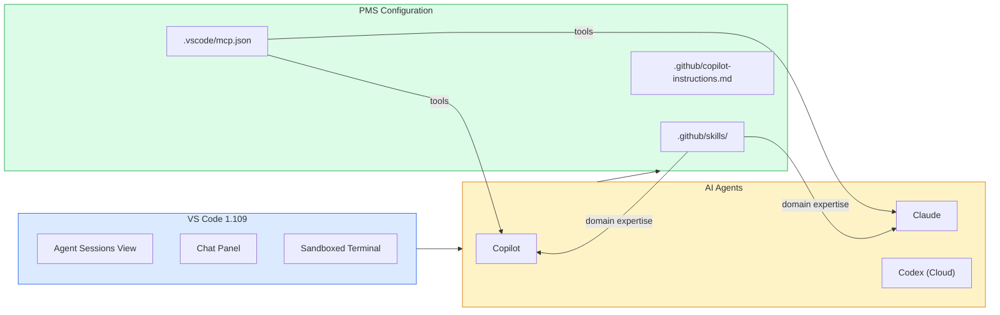

# VS Code 1.109 Multi-Agent Setup Guide for PMS Integration

**Document ID:** PMS-EXP-VSCODE-MULTIAGENT-001
**Version:** 1.0
**Date:** March 3, 2026
**Applies To:** PMS project (all platforms)
**Prerequisites Level:** Beginner

---

## Table of Contents

1. [Overview](#1-overview)
2. [Prerequisites](#2-prerequisites)
3. [Part A: Install and Configure VS Code 1.109](#3-part-a-install-and-configure-vs-code-1109)
4. [Part B: Configure Multi-Agent Environment](#4-part-b-configure-multi-agent-environment)
5. [Part C: Set Up PMS Agent Skills](#5-part-c-set-up-pms-agent-skills)
6. [Part D: Testing and Verification](#6-part-d-testing-and-verification)
7. [Troubleshooting](#7-troubleshooting)
8. [Reference Commands](#8-reference-commands)

---

## 1. Overview

This guide walks you through configuring **VS Code 1.109** as the PMS multi-agent development platform. By the end you will have:

- VS Code 1.109+ with GitHub Copilot, Claude Agent, and Codex configured
- A unified Agent Sessions view for managing all AI agents
- PMS-specific Agent Skills for HIPAA compliance, TDD, and architecture conventions
- MCP server connections to the PMS backend and PostgreSQL
- Terminal sandboxing and auto-approval rules for safe agent operations
- Workspace priming via `/init` with PMS context

### Architecture at a Glance



---

## 2. Prerequisites

### 2.1 Required Software

| Software | Minimum Version | Check Command |
|----------|----------------|---------------|
| VS Code | 1.109+ | `code --version` |
| Node.js | 20+ | `node --version` |
| Python | 3.11+ | `python3 --version` |
| Git | 2.40+ | `git --version` |
| GitHub Copilot extension | Latest | Check Extensions panel |

### 2.2 Required Accounts

- **GitHub account** with Copilot Business/Enterprise subscription
- **Anthropic API key** for Claude Agent support (optional but recommended)
- **GitHub Codex access** for cloud agent tasks (included with Copilot Business)

### 2.3 Verify PMS Services

```bash
# Backend
curl -s http://localhost:8000/health | python3 -m json.tool

# Frontend
curl -s -o /dev/null -w "%{http_code}" http://localhost:3000

# Database
psql -U pms -d pms_dev -c "SELECT 1;"
```

---

## 3. Part A: Install and Configure VS Code 1.109

### Step 1: Update VS Code

```bash
# macOS (Homebrew)
brew update && brew upgrade visual-studio-code

# Verify version
code --version
# Should show 1.109.x or higher
```

### Step 2: Install required extensions

```bash
# GitHub Copilot (includes agent mode)
code --install-extension GitHub.copilot
code --install-extension GitHub.copilot-chat

# Optional: Additional language support
code --install-extension ms-python.python
code --install-extension ms-python.vscode-pylance
code --install-extension dbaeumer.vscode-eslint
```

### Step 3: Configure Claude Agent (optional)

Open VS Code Settings (JSON) and add:

```json
{
  "github.copilot.chat.agent.claude.enabled": true,
  "github.copilot.chat.agent.claude.apiKey": "your-anthropic-api-key"
}
```

> Alternatively, set the `ANTHROPIC_API_KEY` environment variable — VS Code will detect it automatically.

### Step 4: Enable multi-agent features

```json
{
  "github.copilot.chat.agentSessions.enabled": true,
  "github.copilot.chat.subagents.enabled": true,
  "github.copilot.chat.agentSkills.enabled": true,
  "chat.agent.enabled": true
}
```

**Checkpoint:** VS Code 1.109 is installed with Copilot, Claude Agent support, and multi-agent features enabled.

---

## 4. Part B: Configure Multi-Agent Environment

### Step 1: Create workspace priming instructions

Create `.github/copilot-instructions.md` in the PMS repo root:

```markdown
# PMS Development Instructions

## Project Overview
The Patient Management System (PMS) is a healthcare application with:
- **Backend:** FastAPI (Python 3.11+) on port 8000
- **Frontend:** Next.js 15 (React 19, TypeScript) on port 3000
- **Android:** Kotlin with Jetpack Compose
- **Database:** PostgreSQL 15+ on port 5432
- **Documentation:** All docs in `docs/` directory (single source of truth)

## Coding Conventions
- Python: Follow PEP 8, use type hints, async/await for IO operations
- TypeScript: Strict mode, functional React components with hooks
- All API endpoints follow REST conventions with `/api/` prefix
- Database models use SQLAlchemy ORM with Alembic migrations

## HIPAA Requirements (CRITICAL)
- Never log PHI (patient names, MRNs, DOBs, SSNs, addresses)
- All PHI at rest must be AES-256-GCM encrypted
- All PHI in transit uses TLS 1.3
- Every data access must be audit logged
- PHI de-identification required before sending to any external API

## Testing Requirements
- All new endpoints require unit tests AND integration tests
- Use pytest for backend, Jest for frontend
- Minimum 80% code coverage for new code
- Test files go in `tests/` directory mirroring `app/` structure

## Architecture
- Three-tier requirement decomposition: SYS-REQ → SUB-* → SUB-*-BE/WEB/AND
- ADRs in `docs/architecture/` for all significant decisions
- Feature docs in `docs/features/` after implementation

## File Naming
- Backend routes: `app/api/routes/{domain}.py`
- Backend models: `app/models/{domain}.py`
- Frontend components: `src/components/{domain}/{ComponentName}.tsx`
- Frontend pages: `src/app/{route}/page.tsx`
```

### Step 2: Configure MCP servers

Create `.vscode/mcp.json`:

```json
{
  "servers": {
    "pms-api": {
      "type": "stdio",
      "command": "node",
      "args": ["./tools/mcp/pms-api-server.js"],
      "description": "PMS Backend API access (read-only)"
    },
    "pms-docs": {
      "type": "stdio",
      "command": "node",
      "args": ["./tools/mcp/pms-docs-server.js"],
      "description": "PMS documentation and requirements"
    }
  }
}
```

### Step 3: Configure terminal sandboxing

Add to `.vscode/settings.json`:

```json
{
  "terminal.integrated.sandbox.enabled": true,
  "terminal.integrated.sandbox.allowedPaths": [
    "${workspaceFolder}",
    "${userHome}/.local",
    "${userHome}/.cache",
    "/tmp"
  ],
  "terminal.integrated.sandbox.allowedDomains": [
    "localhost",
    "127.0.0.1",
    "registry.npmjs.org",
    "pypi.org",
    "files.pythonhosted.org",
    "github.com"
  ]
}
```

### Step 4: Configure auto-approval rules

Add to `.vscode/settings.json`:

```json
{
  "chat.agent.autoApprove": {
    "terminal": {
      "allow": [
        "python -m pytest *",
        "npm test *",
        "npm run lint *",
        "python -m mypy *",
        "cat *",
        "ls *",
        "grep *",
        "git status",
        "git diff *",
        "git log *",
        "curl -s http://localhost:*"
      ],
      "deny": [
        "rm -rf *",
        "git push *",
        "git reset --hard *",
        "DROP TABLE *",
        "DELETE FROM *",
        "psql -h production*"
      ]
    },
    "fileEdit": {
      "allow": [
        "${workspaceFolder}/app/**",
        "${workspaceFolder}/src/**",
        "${workspaceFolder}/tests/**",
        "${workspaceFolder}/docs/**"
      ],
      "deny": [
        "${workspaceFolder}/.env*",
        "${workspaceFolder}/**/credentials*",
        "${workspaceFolder}/**/secrets*"
      ]
    }
  }
}
```

**Checkpoint:** Multi-agent environment configured with workspace instructions, MCP servers, terminal sandboxing, and auto-approval rules.

---

## 5. Part C: Set Up PMS Agent Skills

### Step 1: Create the skills directory

```bash
mkdir -p .github/skills/hipaa-patterns
mkdir -p .github/skills/tdd-workflow
mkdir -p .github/skills/pms-architecture
mkdir -p .github/skills/fhir-validation
mkdir -p .github/skills/clinical-data
```

### Step 2: Create HIPAA Patterns skill

Create `.github/skills/hipaa-patterns/SKILL.md`:

```markdown
# HIPAA Compliance Patterns

## When to Use
Apply this skill when writing or modifying code that handles patient data,
API endpoints, database queries, or logging in the PMS.

## Rules

### PHI Handling
- Never log PHI fields: patient_name, mrn, dob, ssn, address, phone, email
- Audit log every data access with: user_id, resource_type, action, timestamp
- Use `deidentify_text()` before sending any text to external APIs

### Encryption
- PHI at rest: AES-256-GCM via the `encrypt_field()` utility
- PHI in transit: TLS 1.3 enforced on all endpoints
- Database columns with PHI must use the `EncryptedString` type

### Code Patterns
When creating a new API endpoint that returns patient data:
1. Add `@require_auth` decorator
2. Add `@audit_log(resource="patient")` decorator
3. Filter response fields based on user role
4. Never include SSN in API responses unless specifically authorized

### Testing
- Test that PHI fields are encrypted in the database
- Test that audit log entries are created for every data access
- Test that unauthorized users cannot access PHI endpoints
```

### Step 3: Create TDD Workflow skill

Create `.github/skills/tdd-workflow/SKILL.md`:

```markdown
# Test-Driven Development Workflow

## When to Use
Apply this skill when implementing new features or fixing bugs.

## Workflow
1. Write the test first — describe the expected behavior
2. Run the test — confirm it fails (red)
3. Write the minimum code to pass the test (green)
4. Refactor while keeping tests green
5. Repeat for the next behavior

## PMS Testing Conventions
- Backend tests: `tests/{module}/test_{feature}.py` using pytest
- Frontend tests: `src/**/__tests__/{Component}.test.tsx` using Jest
- Integration tests: `tests/integration/test_{feature}.py`
- Minimum 80% coverage for new code

## Test Naming
- `test_{action}_{condition}_{expected_result}`
- Example: `test_create_patient_with_valid_data_returns_201`

## Fixtures
- Use `conftest.py` for shared fixtures
- Use factory functions for test data (never use real PHI)
- Database fixtures use transactions that rollback after each test
```

### Step 4: Create PMS Architecture skill

Create `.github/skills/pms-architecture/SKILL.md`:

```markdown
# PMS Architecture Conventions

## When to Use
Apply this skill when creating new files, modules, API endpoints,
or making architectural decisions.

## Three-Tier Requirement Decomposition
- SYS-REQ: System-level requirements (docs/specs/requirements/SYS-REQ.md)
- SUB-*: Domain requirements (SUB-PR, SUB-CW, SUB-MM, SUB-RA, SUB-PM)
- SUB-*-BE/WEB/AND: Platform requirements

## ADR Convention
Every significant architectural decision gets an ADR:
- File: `docs/architecture/NNNN-short-title.md`
- Include: context, options considered, rationale, trade-offs

## API Endpoint Convention
- REST with `/api/{domain}/{resource}` pattern
- CRUD operations: GET (list), GET/:id (detail), POST (create), PUT/:id (update), DELETE/:id
- Pydantic models for request/response validation
- Always return appropriate HTTP status codes

## File Organization
- Backend routes: `app/api/routes/{domain}.py`
- Backend services: `app/services/{domain}.py`
- Backend models: `app/models/{domain}.py`
- Frontend components: `src/components/{domain}/{Name}.tsx`
- Frontend hooks: `src/hooks/use{Name}.ts`
```

### Step 5: Create FHIR Validation skill

Create `.github/skills/fhir-validation/SKILL.md`:

```markdown
# FHIR R4 Validation

## When to Use
Apply this skill when working with FHIR resources, mappers,
or healthcare interoperability features.

## FHIR R4 Conventions
- All resources must conform to FHIR R4 specification
- Use camelCase for FHIR field names (as per spec)
- Include `resourceType`, `id`, and `meta` in all resources
- Reference format: `{ResourceType}/{id}`

## PMS FHIR Mappers
- Location: `app/fhir/mappers/{resource_type}.py`
- Each mapper converts PMS model ↔ FHIR resource
- Include `to_fhir()` and `from_fhir()` methods
- Validate against JSON Schema before returning

## Required Fields by Resource
- Patient: identifier, name, gender, birthDate
- Encounter: status, class, subject, period
- MedicationRequest: status, intent, medication, subject
- Observation: status, code, subject, value
```

### Step 6: Create Clinical Data skill

Create `.github/skills/clinical-data/SKILL.md`:

```markdown
# Clinical Data Handling

## When to Use
Apply this skill when working with patient records, encounters,
medications, lab results, or any clinical data in the PMS.

## Data Safety Rules
- Always validate input data against Pydantic models
- Never trust client-side data — validate server-side
- Use parameterized queries — never string-format SQL
- Sanitize all text fields before storage
- Strip PHI before external API calls (use deidentify_text)

## Clinical Data Types
- Patient demographics: encrypted at rest (EncryptedString)
- Encounter notes: full-text searchable but audit-logged
- Medications: validated against drug database
- Lab results: include reference ranges and abnormal flags
- Vital signs: validated against physiological ranges

## Error Handling
- Never expose internal errors to clients
- Log detailed errors server-side with correlation IDs
- Return user-friendly error messages
- Critical clinical errors trigger alerts (e.g., drug interaction warnings)
```

**Checkpoint:** Five PMS Agent Skills created. Run `/init` in VS Code chat to prime the workspace with these skills.

---

## 6. Part D: Testing and Verification

### Step 1: Verify multi-agent features

1. Open VS Code and the PMS workspace
2. Open the **Chat** panel (Ctrl+Shift+I / Cmd+Shift+I)
3. Click the agent dropdown — you should see: **Copilot**, **Claude** (if configured), **Codex**
4. Open **Agent Sessions** view from the sidebar — should show an empty session list

### Step 2: Test workspace priming

1. In the Chat panel, type `/init` and press Enter
2. The agent should index your workspace and detect:
   - `.github/copilot-instructions.md`
   - `.github/skills/` directory with 5 skills
   - `.vscode/mcp.json` with MCP server definitions
3. The agent should summarize the PMS project context

### Step 3: Test Agent Skills

1. In Chat, ask: "Create a new API endpoint for lab results"
2. The agent should automatically load the `hipaa-patterns`, `pms-architecture`, and `clinical-data` skills
3. The generated code should include:
   - `@require_auth` decorator
   - Audit logging
   - Pydantic request/response models
   - Proper file placement

### Step 4: Test terminal sandboxing

1. Ask an agent to run `ls /etc/passwd` in the terminal
2. The sandbox should block this (file outside workspace)
3. Ask the agent to run `pytest tests/` — this should be auto-approved

### Step 5: Test multi-agent delegation

1. Start a Claude agent session
2. Ask: "Create a patient search API endpoint with tests and documentation"
3. Observe the agent delegating:
   - Implementation to the primary agent
   - Test generation to a subagent
   - Documentation to another subagent

### Step 6: Verify MCP server access

1. In Chat, ask: "What API endpoints does the PMS backend expose?"
2. The agent should use the `pms-api` MCP server to list endpoints
3. Verify the response matches actual backend routes

**Checkpoint:** All six verification steps pass — multi-agent features enabled, workspace primed, skills auto-loading, sandbox active, delegation working, and MCP servers connected.

---

## 7. Troubleshooting

### Agent Skills Not Loading

**Symptom:** Agent doesn't apply HIPAA patterns when generating code.

**Solution:**
1. Verify skills directory: `ls .github/skills/`
2. Each skill must have a `SKILL.md` file
3. Run `/init` to re-index the workspace
4. Check that `github.copilot.chat.agentSkills.enabled` is `true`

### Claude Agent Not Available

**Symptom:** Only Copilot shows in agent dropdown.

**Solution:**
1. Verify API key: Settings > search "claude" > check API key is set
2. Or set `ANTHROPIC_API_KEY` environment variable
3. Restart VS Code after setting the key
4. Check the Output panel (GitHub Copilot) for connection errors

### Terminal Sandbox Too Restrictive

**Symptom:** Agent can't run legitimate commands.

**Solution:**
1. Add the blocked path to `terminal.integrated.sandbox.allowedPaths`
2. Add the blocked domain to `terminal.integrated.sandbox.allowedDomains`
3. Use the Output panel to see which paths/domains were blocked

### MCP Server Connection Failed

**Symptom:** "MCP server not found" or tool calls fail.

**Solution:**
1. Verify the server script exists: `ls tools/mcp/pms-api-server.js`
2. Test the server manually: `node tools/mcp/pms-api-server.js`
3. Check `.vscode/mcp.json` syntax
4. Restart VS Code to reconnect MCP servers

### Subagent Delegation Not Working

**Symptom:** Agent handles everything sequentially instead of delegating.

**Solution:**
1. Ensure `github.copilot.chat.subagents.enabled` is `true`
2. Subagents require Copilot Business/Enterprise
3. Complex tasks with clear subtasks trigger delegation — simple tasks don't
4. Explicitly request delegation: "Delegate tests to a subagent"

### Workspace Priming Slow or Incomplete

**Symptom:** `/init` takes too long or misses project context.

**Solution:**
1. Exclude large directories in `.gitignore` (node_modules, .venv, etc.)
2. Keep `.github/copilot-instructions.md` concise (< 500 lines)
3. Use skill files for detailed domain knowledge instead of one large instructions file

---

## 8. Reference Commands

### Daily Workflow

```bash
# Open PMS workspace in VS Code
code /path/to/pms

# In VS Code Chat:
# /init — Prime workspace with PMS context
# @claude — Switch to Claude agent
# @copilot — Switch to GitHub Copilot
# @codex — Delegate to cloud agent
```

### Agent Management

| Action | Command / UI |
|--------|-------------|
| Open Chat | Ctrl+Shift+I (Cmd+Shift+I) |
| Open Agent Sessions | Click "Agent Sessions" in sidebar |
| Switch agent | Click agent dropdown in Chat |
| Start new session | Click "+" in Agent Sessions |
| Delegate to subagent | "Delegate {task} to a subagent" |
| Queue a message | Click "Add to Queue" during processing |
| Steer agent | Click "Steer with Message" during processing |

### Key Files

| File | Purpose |
|------|---------|
| `.github/copilot-instructions.md` | Workspace priming instructions |
| `.github/skills/*/SKILL.md` | Agent Skill definitions |
| `.vscode/mcp.json` | MCP server configuration |
| `.vscode/settings.json` | Sandbox + auto-approval rules |

### Useful URLs

| Resource | URL |
|----------|-----|
| VS Code 1.109 Release Notes | https://code.visualstudio.com/updates/v1_109 |
| Multi-Agent Development Blog | https://code.visualstudio.com/blogs/2026/02/05/multi-agent-development |
| Agent Documentation | https://code.visualstudio.com/docs/copilot/agents/overview |
| MCP Server Guide | https://code.visualstudio.com/docs/copilot/customization/mcp-servers |
| Terminal Security | https://code.visualstudio.com/docs/copilot/security |

---

## Next Steps

1. Work through the [VS Code Multi-Agent Developer Tutorial](31-VSCodeMultiAgent-Developer-Tutorial.md) to practice multi-agent workflows
2. Review the [PRD](31-PRD-VSCodeMultiAgent-PMS-Integration.md) for the full multi-agent strategy
3. Compare with [Claude Code (Exp 27)](27-ClaudeCode-Developer-Tutorial.md) for CLI-based AI development
4. Explore [Knowledge Work Plugins (Exp 24)](24-KnowledgeWorkPlugins-PMS-Developer-Setup-Guide.md) for complementary Claude Code skills

---

## Resources

- **VS Code Release Notes:** [v1.109](https://code.visualstudio.com/updates/v1_109)
- **Multi-Agent Blog:** [Your Home for Multi-Agent Development](https://code.visualstudio.com/blogs/2026/02/05/multi-agent-development)
- **Agent Docs:** [Using Agents in VS Code](https://code.visualstudio.com/docs/copilot/agents/overview)
- **MCP Docs:** [Add and Manage MCP Servers](https://code.visualstudio.com/docs/copilot/customization/mcp-servers)
- **Security:** [Copilot Security](https://code.visualstudio.com/docs/copilot/security)
