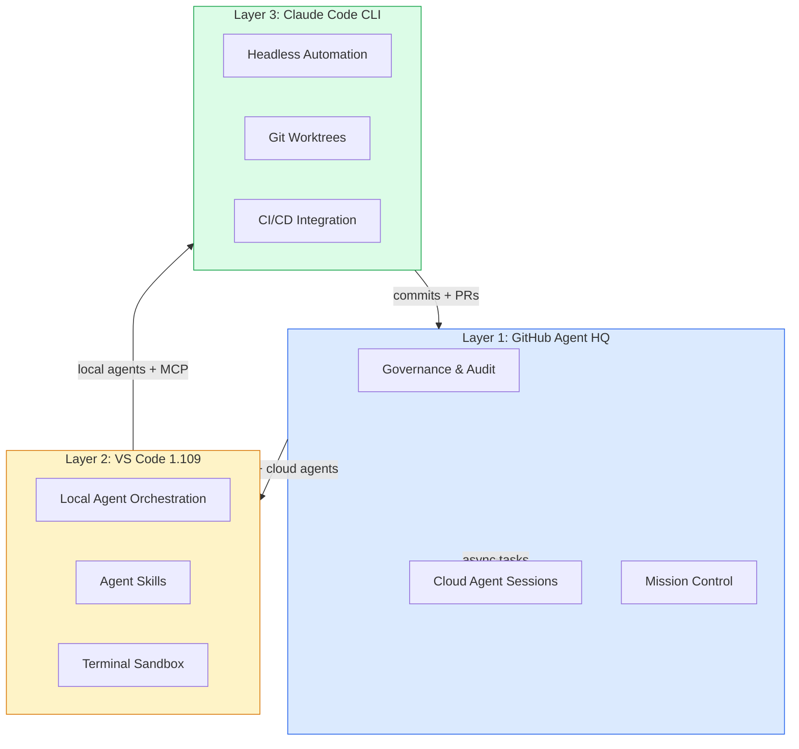
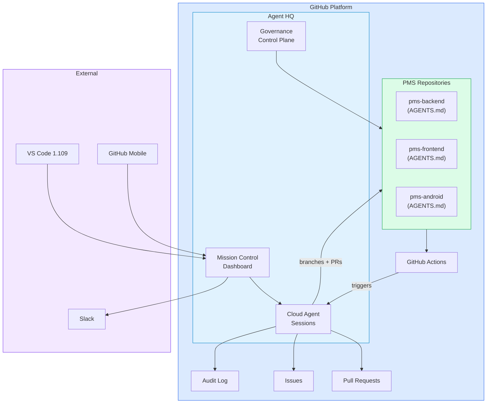

# GitHub Agent HQ Developer Onboarding Tutorial

**Welcome to the MPS PMS GitHub Agent HQ Integration Team**

This tutorial will take you from zero to mastering GitHub Agent HQ for PMS development. By the end, you will understand how Agent HQ provides platform-level agent governance, know how to assign tasks to cloud agents, and have practiced the full workflow from task assignment through Mission Control to PR review.

**Document ID:** PMS-EXP-GITHUB-AGENT-HQ-002
**Version:** 1.0
**Date:** March 3, 2026
**Applies To:** PMS project (all platforms)
**Prerequisite:** [GitHub Agent HQ Setup Guide](32-GitHubAgentHQ-PMS-Developer-Setup-Guide.md)
**Estimated time:** 2-3 hours
**Difficulty:** Beginner-friendly

---

## What You Will Learn

1. What GitHub Agent HQ is and why the PMS uses it for governance
2. How the three-layer agent stack works (Agent HQ → VS Code → Claude Code CLI)
3. How AGENTS.md files define repository-specific agent guardrails
4. How cloud agent sessions run async tasks in GitHub's infrastructure
5. How branch protection and audit trails enforce HIPAA compliance
6. How Mission Control provides visibility into agent activity across repositories
7. How to assign and monitor agent tasks through the dashboard
8. How agent-powered PR review catches healthcare compliance issues
9. How Agent HQ integrates with GitHub Actions for automated agent workflows
10. How to balance agent autonomy with human oversight in healthcare

---

## Part 1: Understanding GitHub Agent HQ (15 min read)

### 1.1 What Problem Does Agent HQ Solve?

PMS development spans multiple repositories (backend, frontend, Android, docs) with a team of developers each using AI agents differently. Without platform-level governance:

> *Developer A uses Claude with aggressive auto-approval. Developer B uses Copilot with no HIPAA instructions. Developer C uses a custom agent that hasn't been security-reviewed. There's no audit trail of which agents touched what code.*

Agent HQ solves this by providing:
- **Organization-level governance:** Whitelist approved agents, set permission boundaries, enforce branch protection
- **Cloud agent infrastructure:** Run Claude, Codex, and custom agents in GitHub's sandboxed cloud
- **Mission Control dashboard:** Centralized visibility into all agent activity across all repositories
- **Audit trail:** Every agent session logged for HIPAA compliance review
- **AGENTS.md:** Source-controlled agent behavior definitions that travel with the repository

### 1.2 The Three-Layer Agent Stack



**Each layer has a distinct role:**
- **Agent HQ (Platform):** Governance, cloud compute, audit trail, cross-repo coordination
- **VS Code (IDE):** Local agent orchestration, Skills, MCP servers, terminal sandbox
- **Claude Code (CLI):** Headless automation, CI/CD integration, parallel worktrees

### 1.3 How Agent HQ Fits with Other PMS Technologies

| Feature | Agent HQ (Exp 32) | VS Code (Exp 31) | Claude Code (Exp 27) | Superpowers (Exp 19) |
|---------|-------------------|-------------------|---------------------|---------------------|
| Governance | Org-level | Workspace | CLAUDE.md | Plugin |
| Cloud agents | Claude, Codex | Codex only | No | No |
| Audit trail | Platform-level | Local | None | None |
| Branch protection | Agent-specific rules | No | No | No |
| Custom agents | AGENTS.md | .github/skills/ | .claude/skills/ | Plugins |
| Best for | Platform governance | IDE development | CLI automation | Plugin framework |

### 1.4 Key Vocabulary

| Term | Meaning |
|------|---------|
| Agent HQ | GitHub's platform for multi-agent orchestration and governance |
| Mission Control | Dashboard for monitoring agent activity across repositories |
| AGENTS.md | Source-controlled file defining agent behavior for a repository |
| Cloud Session | Agent execution in GitHub's sandboxed cloud infrastructure |
| Premium Request | One agent interaction consuming from monthly Copilot allocation |
| Agent Whitelisting | Organization policy approving specific agents for use |
| Control Plane | Admin interface for managing agent permissions and policies |
| Branch Protection | Rules preventing agents from merging to protected branches |
| Agent Task Template | Pre-defined task specification for cloud agent assignment |

### 1.5 Our Platform Architecture



---

## Part 2: Environment Verification (15 min)

### 2.1 Checklist

1. **GitHub CLI authenticated:**
   ```bash
   gh auth status
   ```
   Expected: Logged in to github.com

2. **Copilot subscription active:**
   Check github.com > Settings > Copilot — should show Business/Enterprise

3. **Agent HQ accessible:**
   Navigate to github.com/{org} > Agent HQ — should show dashboard

4. **AGENTS.md committed:**
   ```bash
   gh api repos/{org}/pms-backend/contents/AGENTS.md --jq '.name'
   ```
   Expected: `AGENTS.md`

5. **VS Code connected:**
   Open VS Code > Command Palette > "Agent HQ: Show Status" — should show Connected

### 2.2 Quick Test

1. Go to github.com/{org}/pms-backend > Agent HQ
2. Click "New Session" > Select "Claude"
3. Type: "What does this repository do?"
4. Claude should respond using context from AGENTS.md and the codebase

---

## Part 3: Build Your First Agent HQ Workflow (45 min)

### 3.1 What We Are Building

An **Agent-Powered Security Audit** workflow that:
1. Assigns a Claude cloud agent to audit the pms-backend for HIPAA compliance
2. The agent creates a GitHub issue with findings
3. Another agent creates a PR fixing the most critical finding
4. Mission Control tracks the entire workflow
5. The audit trail logs every agent action

### 3.2 Step 1: Assign the Security Audit Task

On github.com:

1. Navigate to `pms-backend` > Agent HQ
2. Click **"New Task"**
3. Select the `security-audit` template (from `.github/agent-tasks/`)
4. Assign to **Claude**
5. Click **Start**

Or via CLI:

```bash
gh copilot agent run \
  --agent claude \
  --repo {org}/pms-backend \
  --task-file .github/agent-tasks/security-audit.md
```

### 3.3 Step 2: Monitor via Mission Control

1. Open github.com/{org} > Agent HQ > Mission Control
2. You should see the security audit task in the "Active Sessions" widget
3. Watch as the status progresses: Analyzing → Scanning → Writing Report
4. Typical completion time: 5-15 minutes

### 3.4 Step 3: Review the Audit Issue

Once complete, the agent creates a GitHub issue:

```
Title: Security Audit: March 3, 2026
Labels: security, audit

## Findings

### Critical
None

### High
1. **Missing audit log on GET /api/patients/{id}/encounters**
   - File: app/api/routes/encounters.py:45
   - The endpoint returns patient encounter data without @audit_log decorator
   - Fix: Add @audit_log(resource="encounter") decorator

### Medium
2. **PHI field not encrypted in LabResult model**
   - File: app/models/lab_results.py:12
   - The `ordered_by` field may contain physician names linked to patient context
   ...
```

### 3.5 Step 4: Assign Fix Task to Another Agent

From the audit issue:

1. Click **"Assign to Agent"** on the highest-severity finding
2. Select **Codex** (cloud agent for async fixes)
3. Codex creates a branch: `agent/codex/fix-missing-audit-log`
4. Codex opens a PR with the fix

### 3.6 Step 5: Review and Merge

1. Review the agent's PR — verify the fix is correct
2. CI/CD runs automatically (tests, lint, security scan)
3. As code owner, approve and merge
4. Verify the audit log records all agent actions

---

## Part 4: Evaluating Strengths and Weaknesses (15 min)

### 4.1 Strengths

- **Platform-level governance:** Organization-wide agent policies enforced consistently across all repos
- **Cloud agent infrastructure:** No local compute needed for async tasks — GitHub hosts everything
- **AGENTS.md in source control:** Agent behavior definitions travel with the code and are reviewed in PRs
- **Audit trail for compliance:** Every agent action logged — critical for HIPAA and ISO 13485
- **Branch protection:** Agents can never merge to main without human approval
- **Mission Control:** Single dashboard for all agent activity across the organization
- **GitHub Actions integration:** Scheduled and event-driven agent tasks
- **Multi-surface access:** Dashboard, VS Code, GitHub Mobile, CLI — agents are available everywhere

### 4.2 Weaknesses

- **Copilot Business/Enterprise required:** $19-39/user/month adds significant cost
- **Premium request limits:** Each agent session consumes requests from monthly allocation
- **New and evolving:** Agent HQ launched February 2026 — features are still maturing
- **Limited custom agent framework:** AGENTS.md is simpler than Claude Code's skill system
- **Cloud-only agents:** No option to run Agent HQ agents on self-hosted infrastructure
- **Vendor lock-in:** Deep GitHub integration makes migration to alternatives difficult
- **Latency for cloud sessions:** 10-30 second startup for cloud agent sessions

### 4.3 When to Use Agent HQ vs Alternatives

| Scenario | Best Choice | Why |
|----------|-------------|-----|
| Enforce org-wide agent policies | **Agent HQ** | Only platform with org-level governance |
| Async security audits | **Agent HQ cloud agent** | Runs in GitHub cloud without tying up dev machine |
| Local feature development | **VS Code Multi-Agent** | Better IDE integration and MCP tools |
| CI/CD automation | **Claude Code CLI** | Headless, scriptable, designed for pipelines |
| PR review automation | **Agent HQ** | Native GitHub PR integration |
| Issue triage | **Agent HQ** | Native GitHub issue integration |
| Complex architecture design | **VS Code + Claude** | Interactive, visual, real-time feedback |

### 4.4 HIPAA / Healthcare Considerations

1. **Audit trail is mandatory:** Agent HQ's logging satisfies HIPAA audit requirements for AI-assisted code changes
2. **AGENTS.md enforces HIPAA patterns:** Repository-level rules prevent agents from generating non-compliant code
3. **Branch protection prevents direct deployment:** Agents cannot merge to main — human review required
4. **Agent whitelisting prevents unapproved AI:** Only security-reviewed agents touch healthcare code
5. **Cloud sessions are sandboxed:** No access to production systems or real patient data
6. **90-day log retention minimum:** Configure audit log retention to meet HIPAA requirements
7. **No PHI in agent context:** AGENTS.md and task templates must never contain real patient data

---

## Part 5: Debugging Common Issues (15 min read)

### Issue 1: Agent Creates PR Against Wrong Branch

**Symptom:** Agent opens PR against main instead of develop.
**Cause:** Default branch configuration not specified in AGENTS.md.
**Fix:** Add "Default PR target: develop" to AGENTS.md rules.

### Issue 2: Security Audit Finds False Positives

**Symptom:** Audit issue lists findings that are not actual vulnerabilities.
**Cause:** Agent lacks codebase context — doesn't understand existing security patterns.
**Fix:** Improve AGENTS.md with specific security patterns used in the PMS. Add examples of correct implementations.

### Issue 3: Mission Control Shows Stale Sessions

**Symptom:** Completed sessions still show as "Active."
**Cause:** Session cleanup delay or timeout.
**Fix:** Refresh the dashboard. Sessions may take up to 5 minutes to update status after completion.

### Issue 4: Agent Cannot Access Repository Files

**Symptom:** "Permission denied" when agent tries to read code.
**Cause:** Organization governance policy restricts repository access.
**Fix:** Verify agent permissions in governance settings. Ensure the repository is not in a restricted group.

### Issue 5: GitHub Actions Agent Workflow Fails

**Symptom:** Scheduled agent audit workflow fails with "agent not available."
**Cause:** Premium requests exhausted or agent whitelisting changed.
**Fix:** Check premium request balance. Verify agent is still whitelisted. Add error notification to workflow.

---

## Part 6: Practice Exercises (45 min)

### Exercise 1: Set Up Agent-Powered Issue Triage

Configure a workflow where:
1. A new issue is created in pms-backend
2. A GitHub Actions workflow triggers a Claude agent to classify it (bug/feature/docs/security)
3. The agent adds appropriate labels and suggests an assignee
4. Test with 3 sample issues of different types

### Exercise 2: Cross-Repository Agent Coordination

Design a workflow (do not deploy) where:
1. A backend API change is merged to pms-backend
2. An agent detects the API change and creates an issue in pms-frontend
3. Another agent in pms-frontend proposes frontend changes to match
4. A third agent in pms-android proposes Android changes

Document the GitHub Actions triggers and AGENTS.md configurations needed.

### Exercise 3: Agent Productivity Analysis

Use Mission Control metrics to analyze:
1. Which agent (Claude vs Codex vs Copilot) has the highest PR acceptance rate
2. Which types of tasks (security audit, test generation, docs) complete fastest
3. How many premium requests each workflow type consumes
4. Write recommendations for optimizing agent allocation

---

## Part 7: Development Workflow and Conventions

### 7.1 File Organization

```
{repository}/
├── AGENTS.md                           # Agent behavior rules
├── .github/
│   ├── copilot-instructions.md         # Workspace priming
│   ├── agent-tasks/                    # Cloud task templates
│   │   ├── security-audit.md
│   │   └── test-generation.md
│   └── workflows/
│       └── agent-security-audit.yml    # Scheduled agent Actions
└── .vscode/
    ├── mcp.json                        # MCP servers (local)
    └── settings.json                   # Sandbox rules (local)
```

### 7.2 Naming Conventions

| Item | Convention | Example |
|------|-----------|---------|
| Agent branches | `agent/{agent}/{description}` | `agent/claude/fix-audit-logging` |
| Task templates | kebab-case .md | `security-audit.md` |
| Workflow files | `agent-{task}.yml` | `agent-security-audit.yml` |
| Audit issues | "Security Audit: {date}" | "Security Audit: March 3, 2026" |
| Agent PRs | Conventional commits | `fix: add missing audit log decorator` |

### 7.3 PR Checklist

- [ ] AGENTS.md reviewed if modified
- [ ] Agent-generated code reviewed by human code owner
- [ ] Branch protection enforced (no direct agent merges)
- [ ] Audit log entry verified for agent session
- [ ] No real PHI in agent task templates or AGENTS.md
- [ ] CI/CD passed (tests, lint, security)

### 7.4 Security Reminders

1. **Review all agent-generated PRs** — agents can introduce subtle bugs
2. **Never approve agent PRs without reading the diff** — treat like any PR
3. **Monitor premium request usage** — unexpected spikes may indicate misconfiguration
4. **Rotate secrets** if any appear in agent session logs
5. **Review AGENTS.md changes in PRs** — changes affect all future agent behavior

---

## Part 8: Quick Reference Card

### Agent HQ Surfaces

| Surface | Access | Best For |
|---------|--------|----------|
| github.com | Browser | Task assignment, Mission Control, audit log |
| VS Code 1.109 | IDE | Local + cloud agent orchestration |
| GitHub Mobile | Phone | Monitor and approve on-the-go |
| GitHub CLI | Terminal | Scripted agent tasks, CI/CD integration |

### Key URLs

| Resource | URL |
|----------|-----|
| Agent HQ Dashboard | github.com/{org} > Agent HQ |
| Mission Control | github.com/{org} > Agent HQ > Mission Control |
| Governance Settings | github.com/organizations/{org}/settings/copilot |
| Audit Log | github.com/organizations/{org}/settings/audit-log |

### Common CLI Commands

```bash
# List sessions
gh copilot agent list

# Start task
gh copilot agent run --agent claude --task "Audit for HIPAA compliance"

# Check status
gh copilot agent status --session-id <id>

# View audit log
gh api orgs/{org}/audit-log --jq '.[0:10]'
```

---

## Next Steps

1. Set up weekly automated security audits via GitHub Actions agent workflows
2. Configure agent-powered PR review as a required status check on all PMS repos
3. Build cross-repository agent coordination for API contract changes
4. Measure agent impact on code quality and sprint velocity over 3 sprints
5. Review [VS Code Multi-Agent (Exp 31)](31-VSCodeMultiAgent-Developer-Tutorial.md) for complementary local IDE configuration
